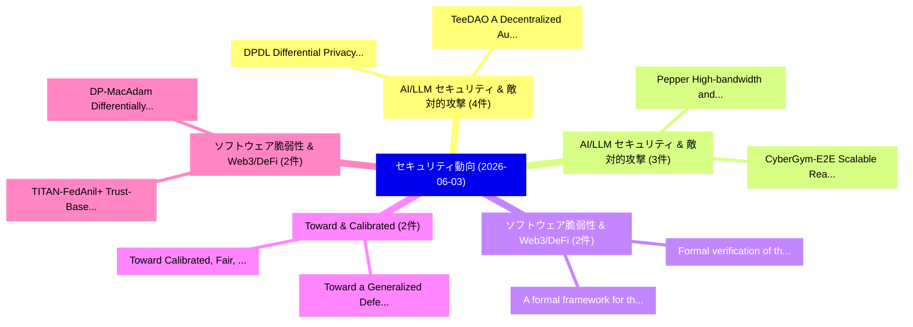

# 📅 02_daily: 日次エグゼクティブサマリー報告書 (2026-06-03)

**集計日時**: 2026-10-02 23:06:13 UTC  
**対象日付**: 2026-06-03  
**本日収集論文数**: 47 件  

---

## 💡 主要セキュリティ動向・脅威インサイト (Executive Insights)

本日の収集論文（計 47 件）において、以下の重点セキュリティ領域で活発な研究動向が確認されました：
- **AI/LLM セキュリティ & 敵対的攻撃** (4 件): 注目論文として 「DPDL: Differential Privacy Pre...」、「TeeDAO: A Decentralized Autono...」 等が発表され、実務防御および攻撃検証の進展が見られます。
- **AI/LLM セキュリティ & 敵対的攻撃** (3 件): 注目論文として 「Pepper: High-bandwidth and Sca...」、「CyberGym-E2E: Scalable Real-Wo...」 等が発表され、実務防御および攻撃検証の進展が見られます。
- **ソフトウェア脆弱性 & Web3/DeFi** (2 件): 注目論文として 「Formal verification of the S-t...」、「A formal framework for the eco...」 等が発表され、実務防御および攻撃検証の進展が見られます。
- **Toward & Calibrated** (2 件): 注目論文として 「Toward a Generalized Defense A...」、「Toward Calibrated, Fair, and a...」 等が発表され、実務防御および攻撃検証の進展が見られます。
- **ソフトウェア脆弱性 & Web3/DeFi** (2 件): 注目論文として 「TITAN-FedAnil+: Trust-Based Ad...」、「DP-MacAdam: Differentially Pri...」 等が発表され、実務防御および攻撃検証の進展が見られます。

### 🗺️ 技術・脅威トピックマインドマップ

---

## 📌 日次セキュリティ論文一覧 (日本語表形式)

| No | arXiv ID | 論文タイトル (日本語訳) | 重要キーワード | 構造化エグゼクティブ要約 (背景・提案・影響) | 脅威分類 | 詳細リンク |
|---|---|---|---|---|---|---|
| 1 | `2606.04311v1` | [Formal verification of the S-two AIR（セキュリティ分析論文）](../../okf/papers/2026-06-03/2606.04311.md) | `S-two AIR`, `Jeremy Avigad`, `Anat Ganor` | 【提案】概要 (Overview & Key Finding) 本論文「Formal verification of the S-two AIR（セキュリティ分析論文）」（原題: F...。実証評価により経営層・セキュリティ管理者向け推奨アクション (E... | `arXiv` | [arXiv](https://arxiv.org/abs/2606.04311v1) &#124; [OKF](../../okf/papers/2026-06-03/2606.04311.md) |
| 2 | `2606.04317v1` | [Toward a Generalized Defense Across Sparse, Continuous, and Structured Parameter Attacks（セキュリティ分析論文）](../../okf/papers/2026-06-03/2606.04317.md) | `Generalized Defense Across Sparse`, `Structured Parameter Attacks`, `Bin Duan` | 【提案】概要 (Overview & Key Finding) 本論文「Toward a Generalized Defense Across Sparse, Continuous,...。実証評価により経営層・セキュリティ管理者向け推奨アクション (E... | `arXiv` | [arXiv](https://arxiv.org/abs/2606.04317v1) &#124; [OKF](../../okf/papers/2026-06-03/2606.04317.md) |
| 3 | `2606.04329v2` | [From Untrusted Input to Trusted Memory: A Systematic Study of Memory Poisoning Attacks in LLMエージェント](../../okf/papers/2026-06-03/2606.04329.md) | `Memory Poisoning Attacks`, `Trusted Memory`, `Pritam Dash` | 【提案】概要 (Overview & Key Finding) 本論文「From Untrusted Input to Trusted Memory: A Systematic St...。実証評価により経営層・セキュリティ管理者向け推奨アクション (E... | `arXiv` | [arXiv](https://arxiv.org/abs/2606.04329v2) &#124; [OKF](../../okf/papers/2026-06-03/2606.04329.md) |
| 4 | `2606.04338v1` | [連合学習 for Multi-Center Sepsis Early Prediction with Privacy-Preserving](../../okf/papers/2026-06-03/2606.04338.md) | `Center Sepsis Early Prediction`, `Multi-Center Sepsis`, `Federated Learning` | 【提案】概要 (Overview & Key Finding) 本論文「連合学習 for Multi-Center Sepsis Early Prediction with Priv...。実証評価により経営層・セキュリティ管理者向け推奨アクション (E... | `arXiv` | [arXiv](https://arxiv.org/abs/2606.04338v1) &#124; [OKF](../../okf/papers/2026-06-03/2606.04338.md) |
| 5 | `2606.04384v1` | [Revisiting Privacy Amplification by Subsampling in Selective Release DPSGD（セキュリティ分析論文）](../../okf/papers/2026-06-03/2606.04384.md) | `Revisiting Privacy Amplification`, `Selective Release`, `Xiaobo Huang` | 【提案】概要 (Overview & Key Finding) 本論文「Revisiting Privacy Amplification by Subsampling in Sele...。実証評価により経営層・セキュリティ管理者向け推奨アクション (E... | `arXiv` | [arXiv](https://arxiv.org/abs/2606.04384v1) &#124; [OKF](../../okf/papers/2026-06-03/2606.04384.md) |
| 6 | `2606.04388v1` | [TITAN-FedAnil+: Trust-Based Adaptive Blockchain 連合学習 for Resource-Constrained Intelligent Enterprises](../../okf/papers/2026-06-03/2606.04388.md) | `Constrained Intelligent Enterprises`, `Trust-Based Adaptive`, `Resource-Constrained Intelligent` | 【提案】概要 (Overview & Key Finding) 本論文「TITAN-FedAnil+: Trust-Based Adaptive Blockchain 連合学習 fo...。実証評価により経営層・セキュリティ管理者向け推奨アクション (E... | `arXiv` | [arXiv](https://arxiv.org/abs/2606.04388v1) &#124; [OKF](../../okf/papers/2026-06-03/2606.04388.md) |
| 7 | `2606.04399v1` | [DPDL: Differential Privacy Preservation in Decentralized Stochastic Learning on Non-IID Dataに向けて](../../okf/papers/2026-06-03/2606.04399.md) | `Decentralized Stochastic Learning`, `Towards Differential Privacy Preservation`, `Differential Privacy Preservation` | 【提案】概要 (Overview & Key Finding) 本論文「DPDL: 差分プライバシー Preservation in Decentralized Stochastic...。実証評価により経営層・セキュリティ管理者向け推奨アクション (E... | `arXiv` | [arXiv](https://arxiv.org/abs/2606.04399v1) &#124; [OKF](../../okf/papers/2026-06-03/2606.04399.md) |
| 8 | `2606.04411v1` | [Pepper: High-bandwidth and Scalable Anonymous Broadcast with Cryptographic Privacy（セキュリティ分析論文）](../../okf/papers/2026-06-03/2606.04411.md) | `Scalable Anonymous Broadcast`, `Cryptographic Privacy`, `Chenghao Li` | 【提案】概要 (Overview & Key Finding) 本論文「Pepper: High-bandwidth and Scalable Anonymous Broadcast...。実証評価により経営層・セキュリティ管理者向け推奨アクション (E... | `arXiv` | [arXiv](https://arxiv.org/abs/2606.04411v1) &#124; [OKF](../../okf/papers/2026-06-03/2606.04411.md) |
| 9 | `2606.04425v2` | [What If Prompt Injection Never Left? Rethinking Agent Security through Cross-Session Stored Prompt Injection（セキュリティ分析論文）](../../okf/papers/2026-06-03/2606.04425.md) | `Session Stored Prompt Injection`, `Rethinking Agent Security`, `Cross-Session Stored` | 【提案】Rethinking Agent Security through Cross-Session Stored プロンプトインジェクション（セキュリティ分析論文）)  > [!...。実証評価により経営層・セキュリティ管理者向け推奨アクション (E... | `arXiv` | [arXiv](https://arxiv.org/abs/2606.04425v2) &#124; [OKF](../../okf/papers/2026-06-03/2606.04425.md) |
| 10 | `2606.04435v1` | [Cascading Hallucination in Agentic RAG: The CHARM Framework for Detection and Mitigation（セキュリティ分析論文）](../../okf/papers/2026-06-03/2606.04435.md) | `Cascading Hallucination`, `Saroj Mishra`, `Raw Meta` | 【提案】概要 (Overview & Key Finding) 本論文「Cascading Hallucination in Agentic RAG: The CHARM Frame...。実証評価により経営層・セキュリティ管理者向け推奨アクション (E... | `arXiv` | [arXiv](https://arxiv.org/abs/2606.04435v1) &#124; [OKF](../../okf/papers/2026-06-03/2606.04435.md) |
| 11 | `2606.04443v1` | [What Can Verifiable Decapsulation Tests Certify? Pass Bounds and Fault-Recognition Limits for FO-Based KEMs（セキュリティ分析論文）](../../okf/papers/2026-06-03/2606.04443.md) | `Pass Bounds`, `Recognition Limits`, `Fault-Recognition Limits` | 【提案】Pass Bounds and Fault-Recognition Limits for FO-Based KEMs ### (日本語題名: What Can Verifia...。実証評価により経営層・セキュリティ管理者向け推奨アクション (E... | `arXiv` | [arXiv](https://arxiv.org/abs/2606.04443v1) &#124; [OKF](../../okf/papers/2026-06-03/2606.04443.md) |
| 12 | `2606.04459v1` | [Token Rankings are Unforgeable Language Model Signatures（セキュリティ分析論文）](../../okf/papers/2026-06-03/2606.04459.md) | `Unforgeable Language Model Signatures`, `Token Rankings`, `Matthew Finlayson` | 【提案】概要 (Overview & Key Finding) 本論文「Token Rankings are Unforgeable Language Model Signature...。実証評価により経営層・セキュリティ管理者向け推奨アクション (E... | `arXiv` | [arXiv](https://arxiv.org/abs/2606.04459v1) &#124; [OKF](../../okf/papers/2026-06-03/2606.04459.md) |
| 13 | `2606.04460v2` | [CyberGym-E2E: Scalable Real-World Benchmark for AI Agents' End-to-End サイバーセキュリティ Capabilities](../../okf/papers/2026-06-03/2606.04460.md) | `Scalable Real`, `World Benchmark`, `Real-World Benchmark` | 【提案】概要 (Overview & Key Finding) 本論文「CyberGym-E2E: Scalable Real-World Benchmark for AI Agen...。実証評価により経営層・セキュリティ管理者向け推奨アクション (E... | `arXiv` | [arXiv](https://arxiv.org/abs/2606.04460v2) &#124; [OKF](../../okf/papers/2026-06-03/2606.04460.md) |
| 14 | `2606.04486v1` | [Global Sketch-Based Watermarking for Diffusion Language Models（セキュリティ分析論文）](../../okf/papers/2026-06-03/2606.04486.md) | `Diffusion Language Models`, `Global Sketch`, `Based Watermarking` | 【提案】概要 (Overview & Key Finding) 本論文「Global Sketch-Based Watermarking for Diffusion Language...。実証評価により経営層・セキュリティ管理者向け推奨アクション (E... | `arXiv` | [arXiv](https://arxiv.org/abs/2606.04486v1) &#124; [OKF](../../okf/papers/2026-06-03/2606.04486.md) |
| 15 | `2606.04549v1` | [PS-UIE: Privilege-Separated Integrity Enforcement for User-Space Executable Objects in Confidential VMs（セキュリティ分析論文）](../../okf/papers/2026-06-03/2606.04549.md) | `Separated Integrity Enforcement`, `Space Executable Objects`, `Privilege-Separated Integrity` | 【提案】概要 (Overview & Key Finding) 本論文「PS-UIE: Privilege-Separated Integrity Enforcement for U...。実証評価により経営層・セキュリティ管理者向け推奨アクション (E... | `arXiv` | [arXiv](https://arxiv.org/abs/2606.04549v1) &#124; [OKF](../../okf/papers/2026-06-03/2606.04549.md) |
| 16 | `2606.04580v1` | [TIBlender: Early-Warning Threat Intelligence from Cross-Platform Social Media Evidence（セキュリティ分析論文）](../../okf/papers/2026-06-03/2606.04580.md) | `Platform Social Media Evidence`, `Warning Threat Intelligence`, `Early-Warning Threat` | 【提案】概要 (Overview & Key Finding) 本論文「TIBlender: Early-Warning 脅威 Intelligence from Cross-Pla...。実証評価により経営層・セキュリティ管理者向け推奨アクション (E... | `arXiv` | [arXiv](https://arxiv.org/abs/2606.04580v1) &#124; [OKF](../../okf/papers/2026-06-03/2606.04580.md) |
| 17 | `2606.04657v1` | [TeleHunt: A Framework and Tool for Efficient Cybercriminal Community Discovery on Telegram（セキュリティ分析論文）](../../okf/papers/2026-06-03/2606.04657.md) | `Efficient Cybercriminal Community Discovery`, `Efficient Cybercriminal Community`, `Roy Ricaldi` | 【提案】概要 (Overview & Key Finding) 本論文「TeleHunt: A Framework and Tool for Efficient Cybercrimi...。実証評価により経営層・セキュリティ管理者向け推奨アクション (E... | `arXiv` | [arXiv](https://arxiv.org/abs/2606.04657v1) &#124; [OKF](../../okf/papers/2026-06-03/2606.04657.md) |
| 18 | `2606.04669v2` | [SoK: Post-Quantum Cryptography Implementation in Software: Approaches, Challenges and the PQC-HOT Framework（セキュリティ分析論文）](../../okf/papers/2026-06-03/2606.04669.md) | `Quantum Cryptography Implementation`, `Post-Quantum Cryptography`, `Raw Meta` | 【提案】概要 (Overview & Key Finding) 本論文「SoK: ポスト量子暗号 Implementation in Software: Approaches, Ch...。実証評価により経営層・セキュリティ管理者向け推奨アクション (E... | `arXiv` | [arXiv](https://arxiv.org/abs/2606.04669v2) &#124; [OKF](../../okf/papers/2026-06-03/2606.04669.md) |
| 19 | `2606.04717v2` | [Auditing CoT Answer-Hijack Patches: Source-Control Certificates with Type-I Guarantees（セキュリティ分析論文）](../../okf/papers/2026-06-03/2606.04717.md) | `Hijack Patches`, `Control Certificates`, `Answer-Hijack Patches` | 【提案】概要 (Overview & Key Finding) 本論文「Auditing CoT Answer-Hijack Patches: Source-Control Cert...。実証評価により経営層・セキュリティ管理者向け推奨アクション (E... | `arXiv` | [arXiv](https://arxiv.org/abs/2606.04717v2) &#124; [OKF](../../okf/papers/2026-06-03/2606.04717.md) |
| 20 | `2606.04769v1` | [Description-Code Inconsistency in Real-world MCP Servers: Measurement, Detection, and Security Implications（セキュリティ分析論文）](../../okf/papers/2026-06-03/2606.04769.md) | `Code Inconsistency`, `Security Implications`, `Description-Code Inconsistency` | 【提案】概要 (Overview & Key Finding) 本論文「Description-Code Inconsistency in Real-world MCP Server...。実証評価により経営層・セキュリティ管理者向け推奨アクション (E... | `arXiv` | [arXiv](https://arxiv.org/abs/2606.04769v1) &#124; [OKF](../../okf/papers/2026-06-03/2606.04769.md) |
| 21 | `2606.04819v2` | [The Usefulness Gap in Proof-of-Useful-Work: Pearl's cuPOW Protocolの実証研究](../../okf/papers/2026-06-03/2606.04819.md) | `Abhinaba Basu`, `Raw Meta`, `Executive Summary` | 【提案】概要 (Overview & Key Finding) 本論文「The Usefulness Gap in Proof-of-Useful-Work: Pearl's cuP...。実証評価により経営層・セキュリティ管理者向け推奨アクション (E... | `arXiv` | [arXiv](https://arxiv.org/abs/2606.04819v2) &#124; [OKF](../../okf/papers/2026-06-03/2606.04819.md) |
| 22 | `2606.04892v1` | [ODYSSEY: Reestablishing Confidentiality in Confidential Blockchain via Delegated Execution（セキュリティ分析論文）](../../okf/papers/2026-06-03/2606.04892.md) | `Reestablishing Confidentiality`, `Confidential Blockchain`, `Delegated Execution` | 【提案】概要 (Overview & Key Finding) 本論文「ODYSSEY: Reestablishing Confidentiality in Confidential...。実証評価により経営層・セキュリティ管理者向け推奨アクション (E... | `arXiv` | [arXiv](https://arxiv.org/abs/2606.04892v1) &#124; [OKF](../../okf/papers/2026-06-03/2606.04892.md) |
| 23 | `2606.04899v2` | [DIST-FL: Enhancing Security for TEE-based Aggregation in 連合学習](../../okf/papers/2026-06-03/2606.04899.md) | `Enhancing Security`, `TEE-based Aggregation`, `Federated Learning` | 【提案】概要 (Overview & Key Finding) 本論文「DIST-FL: Enhancing Security for TEE-based Aggregation i...。実証評価により経営層・セキュリティ管理者向け推奨アクション (E... | `arXiv` | [arXiv](https://arxiv.org/abs/2606.04899v2) &#124; [OKF](../../okf/papers/2026-06-03/2606.04899.md) |
| 24 | `2606.04901v2` | [CLIF: Cross-layer LEO-ISL Fingerprinting for Physical and Network Attack Detection in Dense LEO Constellations（セキュリティ分析論文）](../../okf/papers/2026-06-03/2606.04901.md) | `Network Attack Detection`, `Cross-layer LEO`, `Varun Kohli` | 【提案】概要 (Overview & Key Finding) 本論文「CLIF: Cross-layer LEO-ISL Fingerprinting for Physical a...。実証評価により経営層・セキュリティ管理者向け推奨アクション (E... | `arXiv` | [arXiv](https://arxiv.org/abs/2606.04901v2) &#124; [OKF](../../okf/papers/2026-06-03/2606.04901.md) |
| 25 | `2606.04912v1` | [TeeDAO: A Decentralized Autonomous Organization for Heterogeneous TEEs（セキュリティ分析論文）](../../okf/papers/2026-06-03/2606.04912.md) | `Decentralized Autonomous Organization`, `Pinshen Xu`, `Wentao Dong` | 【提案】概要 (Overview & Key Finding) 本論文「TeeDAO: A Decentralized Autonomous Organization for Het...。実証評価により経営層・セキュリティ管理者向け推奨アクション (E... | `arXiv` | [arXiv](https://arxiv.org/abs/2606.04912v1) &#124; [OKF](../../okf/papers/2026-06-03/2606.04912.md) |
| 26 | `2606.04929v1` | [Sequential Data Poisoning in LLM Post-Training（セキュリティ分析論文）](../../okf/papers/2026-06-03/2606.04929.md) | `Sequential Data Poisoning`, `Jack Sanderson`, `Yihan Wang` | 【提案】概要 (Overview & Key Finding) 本論文「Sequential Data Poisoning in LLM Post-Training（セキュリティ分析...。実証評価により経営層・セキュリティ管理者向け推奨アクション (E... | `arXiv` | [arXiv](https://arxiv.org/abs/2606.04929v1) &#124; [OKF](../../okf/papers/2026-06-03/2606.04929.md) |
| 27 | `2606.04957v1` | [NLLog: Lightweight, Explainable SOC Anomaly Detection via Log-to-Language Rewriting（セキュリティ分析論文）](../../okf/papers/2026-06-03/2606.04957.md) | `Anomaly Detection`, `Language Rewriting`, `Samuel Ndichu` | 【提案】概要 (Overview & Key Finding) 本論文「NLLog: Lightweight, Explainable SOC Anomaly Detection v...。実証評価により経営層・セキュリティ管理者向け推奨アクション (E... | `arXiv` | [arXiv](https://arxiv.org/abs/2606.04957v1) &#124; [OKF](../../okf/papers/2026-06-03/2606.04957.md) |
| 28 | `2606.04990v4` | [From Agent Traces to Trust: A Survey of Evidence Tracing and Execution Provenance in LLMエージェント](../../okf/papers/2026-06-03/2606.04990.md) | `Evidence Tracing`, `Execution Provenance`, `Yiqi Wang` | 【提案】概要 (Overview & Key Finding) 本論文「From Agent Traces to Trust: A Survey of Evidence Tracin...。実証評価により経営層・セキュリティ管理者向け推奨アクション (E... | `arXiv` | [arXiv](https://arxiv.org/abs/2606.04990v4) &#124; [OKF](../../okf/papers/2026-06-03/2606.04990.md) |
| 29 | `2606.05004v1` | [SharedRequest: Privacy-Preserving Model-Agnostic Inference for 大規模言語モデル](../../okf/papers/2026-06-03/2606.05004.md) | `Preserving Model`, `Agnostic Inference`, `Privacy-Preserving Model` | 【提案】概要 (Overview & Key Finding) 本論文「SharedRequest: Privacy-Preserving Model-Agnostic Infere...。実証評価により経営層・セキュリティ管理者向け推奨アクション (E... | `arXiv` | [arXiv](https://arxiv.org/abs/2606.05004v1) &#124; [OKF](../../okf/papers/2026-06-03/2606.05004.md) |
| 30 | `2606.05078v1` | [Attention-Augmented LSTMs for Automatic Homophonic Ciphertext Decipherment（セキュリティ分析論文）](../../okf/papers/2026-06-03/2606.05078.md) | `Automatic Homophonic Ciphertext Decipherment`, `Attention-Augmented LSTMs`, `Micaella Bruton` | 【提案】概要 (Overview & Key Finding) 本論文「Attention-Augmented LSTMs for Automatic Homophonic Ciph...。実証評価により経営層・セキュリティ管理者向け推奨アクション (E... | `arXiv` | [arXiv](https://arxiv.org/abs/2606.05078v1) &#124; [OKF](../../okf/papers/2026-06-03/2606.05078.md) |
| 31 | `2606.05090v1` | [Bernoulli CUSUM and Bayes-Optimal Detection Ceilings for Trust Fraud in Sparse Rating Networks（セキュリティ分析論文）](../../okf/papers/2026-06-03/2606.05090.md) | `Optimal Detection Ceilings`, `Sparse Rating Networks`, `Trust Fraud` | 【提案】概要 (Overview & Key Finding) 本論文「Bernoulli CUSUM and Bayes-Optimal Detection Ceilings fo...。実証評価により経営層・セキュリティ管理者向け推奨アクション (E... | `arXiv` | [arXiv](https://arxiv.org/abs/2606.05090v1) &#124; [OKF](../../okf/papers/2026-06-03/2606.05090.md) |
| 32 | `2606.05126v1` | [A-Live: Passive Liveness Detection via Neuromuscular Micro-Motion Signatures on Commodity Sensors（セキュリティ分析論文）](../../okf/papers/2026-06-03/2606.05126.md) | `Passive Liveness Detection`, `Neuromuscular Micro`, `Motion Signatures` | 【提案】概要 (Overview & Key Finding) 本論文「A-Live: Passive Liveness Detection via Neuromuscular Mi...。実証評価により経営層・セキュリティ管理者向け推奨アクション (E... | `arXiv` | [arXiv](https://arxiv.org/abs/2606.05126v1) &#124; [OKF](../../okf/papers/2026-06-03/2606.05126.md) |
| 33 | `2606.05129v1` | [Preserving Data Privacy in Learning Causal Structure with Fully Homomorphic Encryption（セキュリティ分析論文）](../../okf/papers/2026-06-03/2606.05129.md) | `Preserving Data Privacy`, `Learning Causal Structure`, `Fully Homomorphic Encryption` | 【提案】概要 (Overview & Key Finding) 本論文「Preserving Data Privacy in Learning Causal Structure wi...。実証評価により経営層・セキュリティ管理者向け推奨アクション (E... | `arXiv` | [arXiv](https://arxiv.org/abs/2606.05129v1) &#124; [OKF](../../okf/papers/2026-06-03/2606.05129.md) |
| 34 | `2606.05233v1` | [Domain-Conditioned Safety in Frontier Computer-Using Agents: A 793-Episode Browser Benchmark, a Coding-Domain Cross-Reference, and a Reproducibility Audit of Recent Red-Teaming（セキュリティ分析論文）](../../okf/papers/2026-06-03/2606.05233.md) | `Episode Browser Benchmark`, `Conditioned Safety`, `Frontier Computer` | 【提案】概要 (Overview & Key Finding) 本論文「Domain-Conditioned Safety in Frontier Computer-Using Ag...。実証評価により経営層・セキュリティ管理者向け推奨アクション (E... | `arXiv` | [arXiv](https://arxiv.org/abs/2606.05233v1) &#124; [OKF](../../okf/papers/2026-06-03/2606.05233.md) |
| 35 | `2606.05241v1` | [Search-Time Contamination in Deep Research Agents: Measuring Performance Inflation in Public Benchmark Evaluation（セキュリティ分析論文）](../../okf/papers/2026-06-03/2606.05241.md) | `Deep Research Agents`, `Measuring Performance Inflation`, `Time Contamination` | 【提案】概要 (Overview & Key Finding) 本論文「Search-Time Contamination in Deep Research Agents: Meas...。実証評価により経営層・セキュリティ管理者向け推奨アクション (E... | `arXiv` | [arXiv](https://arxiv.org/abs/2606.05241v1) &#124; [OKF](../../okf/papers/2026-06-03/2606.05241.md) |
| 36 | `2606.05252v1` | [From Attack Simulation to SIEM Rule: Deterministic Detection-as-Code Synthesis with Probe-Level Traceability（セキュリティ分析論文）](../../okf/papers/2026-06-03/2606.05252.md) | `Deterministic Detection`, `Code Synthesis`, `Level Traceability` | 【提案】概要 (Overview & Key Finding) 本論文「From Attack Simulation to SIEM Rule: Deterministic Dete...。実証評価により経営層・セキュリティ管理者向け推奨アクション (E... | `arXiv` | [arXiv](https://arxiv.org/abs/2606.05252v1) &#124; [OKF](../../okf/papers/2026-06-03/2606.05252.md) |
| 37 | `2606.05273v1` | [Online Safety Regulation Increases Privacy Risk: Evidence from the UK Online Safety Act（セキュリティ分析論文）](../../okf/papers/2026-06-03/2606.05273.md) | `Online Safety Regulation Increases Privacy Risk`, `Online Safety Act`, `Dhyey Mehta` | 【提案】概要 (Overview & Key Finding) 本論文「Online Safety Regulation Increases Privacy Risk: Eviden...。実証評価により経営層・セキュリティ管理者向け推奨アクション (E... | `arXiv` | [arXiv](https://arxiv.org/abs/2606.05273v1) &#124; [OKF](../../okf/papers/2026-06-03/2606.05273.md) |
| 38 | `2606.05396v1` | [Willing but Unable: Separating Refusal from Capability in Code LLMs via Abliteration（セキュリティ分析論文）](../../okf/papers/2026-06-03/2606.05396.md) | `Separating Refusal`, `Cristina Carleo`, `Pietro Liguori` | 【提案】概要 (Overview & Key Finding) 本論文「Willing but Unable: Separating Refusal from Capability ...。実証評価により経営層・セキュリティ管理者向け推奨アクション (E... | `arXiv` | [arXiv](https://arxiv.org/abs/2606.05396v1) &#124; [OKF](../../okf/papers/2026-06-03/2606.05396.md) |
| 39 | `2606.05418v1` | [A formal framework for the economic security of DeFi compositions（セキュリティ分析論文）](../../okf/papers/2026-06-03/2606.05418.md) | `Massimo Bartoletti`, `Riccado Marchesin`, `Roberto Zunino` | 【提案】概要 (Overview & Key Finding) 本論文「A formal framework for the economic security of DeFi co...。実証評価により経営層・セキュリティ管理者向け推奨アクション (E... | `arXiv` | [arXiv](https://arxiv.org/abs/2606.05418v1) &#124; [OKF](../../okf/papers/2026-06-03/2606.05418.md) |
| 40 | `2606.05423v1` | [Policy-Compliant Cloud Storage Systems（セキュリティ分析論文）](../../okf/papers/2026-06-03/2606.05423.md) | `Compliant Cloud Storage Systems`, `Policy-Compliant Cloud`, `Dimitrios Stavrakakis` | 【提案】概要 (Overview & Key Finding) 本論文「Policy-Compliant Cloud Storage Systems（セキュリティ分析論文）」（原題:...。実証評価により経営層・セキュリティ管理者向け推奨アクション (E... | `arXiv` | [arXiv](https://arxiv.org/abs/2606.05423v1) &#124; [OKF](../../okf/papers/2026-06-03/2606.05423.md) |
| 41 | `2606.05435v1` | [DP-MacAdam: Differentially Private Mechanism with Adaptive Clipping and Adaptive Momentum（セキュリティ分析論文）](../../okf/papers/2026-06-03/2606.05435.md) | `Differentially Private Mechanism`, `Adaptive Clipping`, `Adaptive Momentum` | 【提案】概要 (Overview & Key Finding) 本論文「DP-MacAdam: Differentially Private Mechanism with Adapt...。実証評価により経営層・セキュリティ管理者向け推奨アクション (E... | `arXiv` | [arXiv](https://arxiv.org/abs/2606.05435v1) &#124; [OKF](../../okf/papers/2026-06-03/2606.05435.md) |
| 42 | `2606.05459v1` | [CRESS: Quantifying Vulnerabilities of Attack Scenarios in Hardware Reverse Engineering（セキュリティ分析論文）](../../okf/papers/2026-06-03/2606.05459.md) | `Hardware Reverse Engineering`, `Quantifying Vulnerabilities`, `Attack Scenarios` | 【提案】概要 (Overview & Key Finding) 本論文「CRESS: Quantifying Vulnerabilities of Attack Scenarios ...。実証評価により経営層・セキュリティ管理者向け推奨アクション (E... | `arXiv` | [arXiv](https://arxiv.org/abs/2606.05459v1) &#124; [OKF](../../okf/papers/2026-06-03/2606.05459.md) |
| 43 | `2606.05476v1` | [SHIELDS: Automating OS Hardening with Iterative Multi-Agent Remediation（セキュリティ分析論文）](../../okf/papers/2026-06-03/2606.05476.md) | `Iterative Multi`, `Agent Remediation`, `Multi-Agent Remediation` | 【提案】概要 (Overview & Key Finding) 本論文「SHIELDS: Automating OS Hardening with Iterative Multi-A...。実証評価により経営層・セキュリティ管理者向け推奨アクション (E... | `arXiv` | [arXiv](https://arxiv.org/abs/2606.05476v1) &#124; [OKF](../../okf/papers/2026-06-03/2606.05476.md) |
| 44 | `2606.05503v1` | [Bitcoin After Block Rewards（セキュリティ分析論文）](../../okf/papers/2026-06-03/2606.05503.md) | `Junhyuk Lee`, `Raw Meta`, `Executive Summary` | 【提案】概要 (Overview & Key Finding) 本論文「Bitcoin After Block Rewards（セキュリティ分析論文）」（原題: Bitcoin Af...。実証評価により経営層・セキュリティ管理者向け推奨アクション (E... | `arXiv` | [arXiv](https://arxiv.org/abs/2606.05503v1) &#124; [OKF](../../okf/papers/2026-06-03/2606.05503.md) |
| 45 | `2606.07655v1` | [FADRW: A Feature-Aware Modulated and Dynamically Reweighted Loss for Few-Shot Linguistic Steganalysis（セキュリティ分析論文）](../../okf/papers/2026-06-03/2606.07655.md) | `Dynamically Reweighted Loss`, `Shot Linguistic Steganalysis`, `Aware Modulated` | 【提案】概要 (Overview & Key Finding) 本論文「FADRW: A Feature-Aware Modulated and Dynamically Reweig...。実証評価により経営層・セキュリティ管理者向け推奨アクション (E... | `arXiv` | [arXiv](https://arxiv.org/abs/2606.07655v1) &#124; [OKF](../../okf/papers/2026-06-03/2606.07655.md) |
| 46 | `2606.09881v1` | [Toward Calibrated, Fair, and accurate Deepfake Detection（セキュリティ分析論文）](../../okf/papers/2026-06-03/2606.09881.md) | `Toward Calibrated`, `Deepfake Detection`, `Ryan Brown` | 【提案】概要 (Overview & Key Finding) 本論文「Toward Calibrated, Fair, and accurate Deepfake Detectio...。実証評価により経営層・セキュリティ管理者向け推奨アクション (E... | `arXiv` | [arXiv](https://arxiv.org/abs/2606.09881v1) &#124; [OKF](../../okf/papers/2026-06-03/2606.09881.md) |
| 47 | `2606.10408v1` | [A Modular Approach to Succinct Arguments for QMA（セキュリティ分析論文）](../../okf/papers/2026-06-03/2606.10408.md) | `Succinct Arguments`, `James Bartusek`, `Jiahui Liu` | 【提案】概要 (Overview & Key Finding) 本論文「A Modular Approach to Succinct Arguments for QMA（セキュリティ...。実証評価により経営層・セキュリティ管理者向け推奨アクション (E... | `arXiv` | [arXiv](https://arxiv.org/abs/2606.10408v1) &#124; [OKF](../../okf/papers/2026-06-03/2606.10408.md) |

