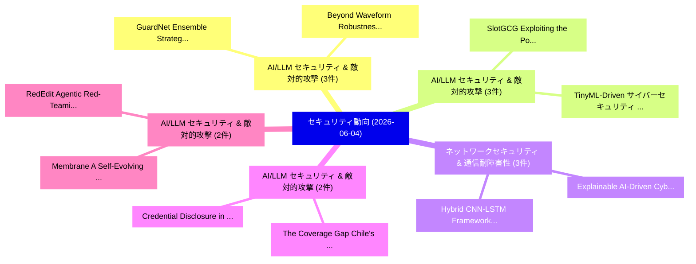

# 📅 02_daily: 日次エグゼクティブサマリー報告書 (2026-06-04)

**集計日時**: 2026-10-02 23:06:13 UTC  
**対象日付**: 2026-06-04  
**本日収集論文数**: 38 件  

---

## 💡 主要セキュリティ動向・脅威インサイト (Executive Insights)

本日の収集論文（計 38 件）において、以下の重点セキュリティ領域で活発な研究動向が確認されました：
- **AI/LLM セキュリティ & 敵対的攻撃** (3 件): 注目論文として 「GuardNet: Ensemble Strategies ...」、「Beyond Waveform Robustness: Ro...」 等が発表され、実務防御および攻撃検証の進展が見られます。
- **AI/LLM セキュリティ & 敵対的攻撃** (3 件): 注目論文として 「SlotGCG: Exploiting the Positi...」、「TinyML-Driven サイバーセキュリティ for A...」 等が発表され、実務防御および攻撃検証の進展が見られます。
- **ネットワークセキュリティ & 通信耐障害性** (3 件): 注目論文として 「Explainable AI-Driven Cyber Ri...」、「Hybrid CNN-LSTM Framework for ...」 等が発表され、実務防御および攻撃検証の進展が見られます。
- **AI/LLM セキュリティ & 敵対的攻撃** (2 件): 注目論文として 「The Coverage Gap: Chile's Cybe...」、「Credential Disclosure in (EU) ...」 等が発表され、実務防御および攻撃検証の進展が見られます。
- **AI/LLM セキュリティ & 敵対的攻撃** (2 件): 注目論文として 「Membrane: A Self-Evolving Cont...」、「RedEdit: Agentic Red-Teaming o...」 等が発表され、実務防御および攻撃検証の進展が見られます。

### 🗺️ 技術・脅威トピックマインドマップ

---

## 📌 日次セキュリティ論文一覧 (日本語表形式)

| No | arXiv ID | 論文タイトル (日本語訳) | 重要キーワード | 構造化エグゼクティブ要約 (背景・提案・影響) | 脅威分類 | 詳細リンク |
|---|---|---|---|---|---|---|
| 1 | `2606.05527v1` | [On the Cryptographic Structure Required for Verifying Qubits（セキュリティ分析論文）](../../okf/papers/2026-06-04/2606.05527.md) | `Cryptographic Structure Required`, `Verifying Qubits`, `James Bartusek` | 【提案】概要 (Overview & Key Finding) 本論文「On the Cryptographic Structure Required for Verifying Q...。実証評価により経営層・セキュリティ管理者向け推奨アクション (E... | `arXiv` | [arXiv](https://arxiv.org/abs/2606.05527v1) &#124; [OKF](../../okf/papers/2026-06-04/2606.05527.md) |
| 2 | `2606.05566v1` | [GuardNet: Ensemble Strategies of Shallow Neural Networks for Robust Prompt Injection and Jailbreak Detection（セキュリティ分析論文）](../../okf/papers/2026-06-04/2606.05566.md) | `Shallow Neural Networks`, `Robust Prompt Injection`, `Ensemble Strategies` | 【提案】概要 (Overview & Key Finding) 本論文「GuardNet: Ensemble Strategies of Shallow Neural Network...。実証評価により経営層・セキュリティ管理者向け推奨アクション (E... | `arXiv` | [arXiv](https://arxiv.org/abs/2606.05566v1) &#124; [OKF](../../okf/papers/2026-06-04/2606.05566.md) |
| 3 | `2606.05567v1` | [ZERO-APT: A Closed-Loop Adversarial Framework for LLM-Driven Automated Penetration Testing under Intelligent Defense（セキュリティ分析論文）](../../okf/papers/2026-06-04/2606.05567.md) | `Driven Automated Penetration Testing`, `Closed-Loop Adversarial`, `Intelligent Defense` | 【提案】概要 (Overview & Key Finding) 本論文「ZERO-APT: A Closed-Loop Adversarial Framework for LLM-D...。実証評価により経営層・セキュリティ管理者向け推奨アクション (E... | `arXiv` | [arXiv](https://arxiv.org/abs/2606.05567v1) &#124; [OKF](../../okf/papers/2026-06-04/2606.05567.md) |
| 4 | `2606.05584v1` | [Dimensionality Reduction for Cyberattack Classification: A Comparative Evaluation of PCA and Linear Predictive Coding（セキュリティ分析論文）](../../okf/papers/2026-06-04/2606.05584.md) | `Linear Predictive Coding`, `Dimensionality Reduction`, `Cyberattack Classification` | 【提案】概要 (Overview & Key Finding) 本論文「Dimensionality Reduction for Cyberattack Classification...。実証評価により経営層・セキュリティ管理者向け推奨アクション (E... | `arXiv` | [arXiv](https://arxiv.org/abs/2606.05584v1) &#124; [OKF](../../okf/papers/2026-06-04/2606.05584.md) |
| 5 | `2606.05594v2` | [The Coverage Gap: Chile's Cyber Disclosure Framework versus the USA, EU and UK（セキュリティ分析論文）](../../okf/papers/2026-06-04/2606.05594.md) | `David Mellafe Zuvic`, `Raw Meta`, `Executive Summary` | 【提案】概要 (Overview & Key Finding) 本論文「The Coverage Gap: Chile's Cyber Disclosure Framework ve...。実証評価により経営層・セキュリティ管理者向け推奨アクション (E... | `arXiv` | [arXiv](https://arxiv.org/abs/2606.05594v2) &#124; [OKF](../../okf/papers/2026-06-04/2606.05594.md) |
| 6 | `2606.05596v1` | [Multi-Objective Submodular Maximization with Differential Privacy（セキュリティ分析論文）](../../okf/papers/2026-06-04/2606.05596.md) | `Objective Submodular Maximization`, `Differential Privacy`, `Multi-Objective Submodular` | 【提案】概要 (Overview & Key Finding) 本論文「Multi-Objective Submodular Maximization with 差分プライバシー（セ...。実証評価により経営層・セキュリティ管理者向け推奨アクション (E... | `arXiv` | [arXiv](https://arxiv.org/abs/2606.05596v1) &#124; [OKF](../../okf/papers/2026-06-04/2606.05596.md) |
| 7 | `2606.05609v1` | [SlotGCG: Exploiting the Positional Vulnerability in LLMs for Jailbreak Attacks（セキュリティ分析論文）](../../okf/papers/2026-06-04/2606.05609.md) | `Positional Vulnerability`, `Jailbreak Attacks`, `Seungwon Jeong` | 【提案】概要 (Overview & Key Finding) 本論文「SlotGCG: Exploiting the Positional 脆弱性 in LLMs for ジェイル...。実証評価により経営層・セキュリティ管理者向け推奨アクション (E... | `arXiv` | [arXiv](https://arxiv.org/abs/2606.05609v1) &#124; [OKF](../../okf/papers/2026-06-04/2606.05609.md) |
| 8 | `2606.05648v1` | [Protecting K-Nearest Neighbor Queries from Location Inference Attacks（セキュリティ分析論文）](../../okf/papers/2026-06-04/2606.05648.md) | `Nearest Neighbor Queries`, `Location Inference Attacks`, `K-Nearest Neighbor` | 【提案】概要 (Overview & Key Finding) 本論文「Protecting K-Nearest Neighbor Queries from Location Inf...。実証評価により経営層・セキュリティ管理者向け推奨アクション (E... | `arXiv` | [arXiv](https://arxiv.org/abs/2606.05648v1) &#124; [OKF](../../okf/papers/2026-06-04/2606.05648.md) |
| 9 | `2606.05678v1` | [Beyond Waveform Robustness: Robust Feature-Vocoder Automatic Speech Recognitionに対する敵対的攻撃](../../okf/papers/2026-06-04/2606.05678.md) | `Beyond Waveform Robustness`, `Robust Feature`, `Vocoder Automatic Speech` | 【提案】概要 (Overview & Key Finding) 本論文「Beyond Waveform Robustness: Robust Feature-Vocoder Auto...。実証評価により経営層・セキュリティ管理者向け推奨アクション (E... | `arXiv` | [arXiv](https://arxiv.org/abs/2606.05678v1) &#124; [OKF](../../okf/papers/2026-06-04/2606.05678.md) |
| 10 | `2606.05701v1` | [Cognitive Threat Intelligence and Explainable Federated Security Analytics for distributed Infrastructure Systems（セキュリティ分析論文）](../../okf/papers/2026-06-04/2606.05701.md) | `Explainable Federated Security Analytics`, `Cognitive Threat Intelligence`, `Infrastructure Systems` | 【提案】概要 (Overview & Key Finding) 本論文「Cognitive 脅威 Intelligence and Explainable Federated Sec...。実証評価により経営層・セキュリティ管理者向け推奨アクション (E... | `arXiv` | [arXiv](https://arxiv.org/abs/2606.05701v1) &#124; [OKF](../../okf/papers/2026-06-04/2606.05701.md) |
| 11 | `2606.05710v1` | [Explainable AI-Driven Cyber Risk Analytics and Model Reliability Assessment for Intelligent Governance of U.S. Critical Infrastructure: An XGBoost and SHAP-Based Intrusion Detection Framework（セキュリティ分析論文）](../../okf/papers/2026-06-04/2606.05710.md) | `Driven Cyber Risk Analytics`, `Model Reliability Assessment`, `AI-Driven Cyber` | 【提案】Critical Infrastructure: An XGBoost and SHAP-Based Intrusion Detection Framework ### (日...。実証評価によりセキュリティ影響と実験結果 (Results & ... | `arXiv` | [arXiv](https://arxiv.org/abs/2606.05710v1) &#124; [OKF](../../okf/papers/2026-06-04/2606.05710.md) |
| 12 | `2606.05714v1` | [Hybrid CNN-LSTM Framework for Intelligent Cyber Attack Detection and Prevention in U.S. Critical Digital Infrastructure: A Comparative Machine Learning Evaluation on CSE-CIC-IDS2018（セキュリティ分析論文）](../../okf/papers/2026-06-04/2606.05714.md) | `Intelligent Cyber Attack Detection`, `Critical Digital Infrastructure`, `Serajul Kabir Chowdhury Rubel` | 【提案】Critical Digital Infrastructure: A Comparative Machine Learning Evaluation on CSE-CIC-I...。実証評価によりセキュリティ影響と実験結果 (Results & ... | `arXiv` | [arXiv](https://arxiv.org/abs/2606.05714v1) &#124; [OKF](../../okf/papers/2026-06-04/2606.05714.md) |
| 13 | `2606.05725v1` | [An Embarrassingly Simple Detector for Model Extraction Attacks in Large Language Model API Traffic（セキュリティ分析論文）](../../okf/papers/2026-06-04/2606.05725.md) | `Model Extraction Attacks`, `Large Language Model`, `Shuze Liu` | 【提案】概要 (Overview & Key Finding) 本論文「An Embarrassingly Simple Detector for Model Extraction ...。実証評価により経営層・セキュリティ管理者向け推奨アクション (E... | `arXiv` | [arXiv](https://arxiv.org/abs/2606.05725v1) &#124; [OKF](../../okf/papers/2026-06-04/2606.05725.md) |
| 14 | `2606.05743v1` | [Membrane: A Self-Evolving Contrastive Safety Memory for LLM Agent Defense（セキュリティ分析論文）](../../okf/papers/2026-06-04/2606.05743.md) | `Evolving Contrastive Safety Memory`, `Self-Evolving Contrastive`, `Agent Defense` | 【提案】概要 (Overview & Key Finding) 本論文「Membrane: A Self-Evolving Contrastive Safety Memory for...。実証評価により経営層・セキュリティ管理者向け推奨アクション (E... | `arXiv` | [arXiv](https://arxiv.org/abs/2606.05743v1) &#124; [OKF](../../okf/papers/2026-06-04/2606.05743.md) |
| 15 | `2606.05776v1` | [An Improved CNN-LSTM Based Intrusion Detection System for IoT Networks（セキュリティ分析論文）](../../okf/papers/2026-06-04/2606.05776.md) | `Based Intrusion Detection System`, `CNN-LSTM Based`, `Malik Muhammad Mueed Aslam` | 【提案】概要 (Overview & Key Finding) 本論文「An Improved CNN-LSTM Based Intrusion Detection System f...。実証評価により経営層・セキュリティ管理者向け推奨アクション (E... | `arXiv` | [arXiv](https://arxiv.org/abs/2606.05776v1) &#124; [OKF](../../okf/papers/2026-06-04/2606.05776.md) |
| 16 | `2606.05779v1` | [TinyML-Driven サイバーセキュリティ for Autonomous Spacecraft: Latency-Accuracy Analysis for SPARTA RF and Cyber Threat Detection](../../okf/papers/2026-06-04/2606.05779.md) | `Cyber Threat Detection`, `Autonomous Spacecraft`, `Driven Cybersecurity` | 【提案】概要 (Overview & Key Finding) 本論文「TinyML-Driven サイバーセキュリティ for Autonomous Spacecraft: Lat...。実証評価により経営層・セキュリティ管理者向け推奨アクション (E... | `arXiv` | [arXiv](https://arxiv.org/abs/2606.05779v1) &#124; [OKF](../../okf/papers/2026-06-04/2606.05779.md) |
| 17 | `2606.05787v1` | [SentinelRAG: Synthetic Sentinel Knowledge for RAG Database Copyright Protection（セキュリティ分析論文）](../../okf/papers/2026-06-04/2606.05787.md) | `Synthetic Sentinel Knowledge`, `Database Copyright Protection`, `Ki Sen Hung` | 【提案】概要 (Overview & Key Finding) 本論文「SentinelRAG: Synthetic Sentinel Knowledge for RAG Datab...。実証評価により経営層・セキュリティ管理者向け推奨アクション (E... | `arXiv` | [arXiv](https://arxiv.org/abs/2606.05787v1) &#124; [OKF](../../okf/papers/2026-06-04/2606.05787.md) |
| 18 | `2606.05796v2` | [GCD: Garbled, Corrected, Demonstrandum -- Fixing and Proving Go's Extended GCD Implementation（セキュリティ分析論文）](../../okf/papers/2026-06-04/2606.05796.md) | `Proving Go`, `Linard Arquint`, `Raw Meta` | 【提案】概要 (Overview & Key Finding) 本論文「GCD: Garbled, Corrected, Demonstrandum -- Fixing and Pr...。実証評価により経営層・セキュリティ管理者向け推奨アクション (E... | `arXiv` | [arXiv](https://arxiv.org/abs/2606.05796v2) &#124; [OKF](../../okf/papers/2026-06-04/2606.05796.md) |
| 19 | `2606.05821v1` | [PriSrv: Privacy-Enhanced and Highly Usable Service Discovery in Wireless Communications（セキュリティ分析論文）](../../okf/papers/2026-06-04/2606.05821.md) | `Highly Usable Service Discovery`, `Wireless Communications`, `Yang Yang` | 【提案】概要 (Overview & Key Finding) 本論文「PriSrv: Privacy-Enhanced and Highly Usable Service Disc...。実証評価により経営層・セキュリティ管理者向け推奨アクション (E... | `arXiv` | [arXiv](https://arxiv.org/abs/2606.05821v1) &#124; [OKF](../../okf/papers/2026-06-04/2606.05821.md) |
| 20 | `2606.05834v1` | [Worst-case Hardness for Low-Noise LPNに向けて](../../okf/papers/2026-06-04/2606.05834.md) | `Worst-case Hardness`, `Towards Worst`, `Low-Noise LPN` | 【提案】概要 (Overview & Key Finding) 本論文「Worst-case Hardness for Low-Noise LPNに向けて」（原題: Towards ...。実証評価により経営層・セキュリティ管理者向け推奨アクション (E... | `arXiv` | [arXiv](https://arxiv.org/abs/2606.05834v1) &#124; [OKF](../../okf/papers/2026-06-04/2606.05834.md) |
| 21 | `2606.05844v1` | [GenTI: LLMs for Autonomous IDPS Rule Generation for Unseen Attacksのベンチマーク評価](../../okf/papers/2026-06-04/2606.05844.md) | `Rule Generation`, `Unseen Attacks`, `Hassan Jalil Hadi` | 【提案】概要 (Overview & Key Finding) 本論文「GenTI: LLMs for Autonomous IDPS Rule Generation for Uns...。実証評価により経営層・セキュリティ管理者向け推奨アクション (E... | `arXiv` | [arXiv](https://arxiv.org/abs/2606.05844v1) &#124; [OKF](../../okf/papers/2026-06-04/2606.05844.md) |
| 22 | `2606.05902v1` | [PriSrv+: Privacy and Usability-Enhanced Wireless Service Discovery with Fast and Expressive Matchmaking Encryption（セキュリティ分析論文）](../../okf/papers/2026-06-04/2606.05902.md) | `Enhanced Wireless Service Discovery`, `Expressive Matchmaking Encryption`, `Usability-Enhanced Wireless` | 【提案】概要 (Overview & Key Finding) 本論文「PriSrv+: Privacy and Usability-Enhanced Wireless Servic...。実証評価により経営層・セキュリティ管理者向け推奨アクション (E... | `arXiv` | [arXiv](https://arxiv.org/abs/2606.05902v1) &#124; [OKF](../../okf/papers/2026-06-04/2606.05902.md) |
| 23 | `2606.05945v1` | [Exploring the connection between coding habits and cognitive styles in malware developers（セキュリティ分析論文）](../../okf/papers/2026-06-04/2606.05945.md) | `Vasilis Vouvoutsis`, `Constantinos Patsakis`, `Fran Casino` | 【提案】概要 (Overview & Key Finding) 本論文「Exploring the connection between coding habits and cogn...。実証評価により経営層・セキュリティ管理者向け推奨アクション (E... | `arXiv` | [arXiv](https://arxiv.org/abs/2606.05945v1) &#124; [OKF](../../okf/papers/2026-06-04/2606.05945.md) |
| 24 | `2606.05986v1` | [AttackPathGNN: Cross-function 脆弱性検出 in smart contracts using state interference graphs and conjunction pooling](../../okf/papers/2026-06-04/2606.05986.md) | `Cross-function vulnerability`, `Gabriela Dobrita`, `Vasilica Oprea` | 【提案】概要 (Overview & Key Finding) 本論文「AttackPathGNN: Cross-function 脆弱性検出 in スマートコントラクトs usin...。実証評価により経営層・セキュリティ管理者向け推奨アクション (E... | `arXiv` | [arXiv](https://arxiv.org/abs/2606.05986v1) &#124; [OKF](../../okf/papers/2026-06-04/2606.05986.md) |
| 25 | `2606.06013v1` | [Cheating in Multiplayer Online Games: a Dataset（セキュリティ分析論文）](../../okf/papers/2026-06-04/2606.06013.md) | `Multiplayer Online Games`, `Hugo Bertin`, `Marc Dacier` | 【提案】概要 (Overview & Key Finding) 本論文「Cheating in Multiplayer Online Games: a Dataset（セキュリティ分...。実証評価により経営層・セキュリティ管理者向け推奨アクション (E... | `arXiv` | [arXiv](https://arxiv.org/abs/2606.06013v1) &#124; [OKF](../../okf/papers/2026-06-04/2606.06013.md) |
| 26 | `2606.06140v1` | [RedEdit: Agentic Red-Teaming of Image Safety Classifiers via MCTS-Guided Photo-Editing（セキュリティ分析論文）](../../okf/papers/2026-06-04/2606.06140.md) | `Image Safety Classifiers`, `Agentic Red`, `Guided Photo` | 【提案】概要 (Overview & Key Finding) 本論文「RedEdit: Agentic Red-Teaming of Image Safety Classifier...。実証評価により経営層・セキュリティ管理者向け推奨アクション (E... | `arXiv` | [arXiv](https://arxiv.org/abs/2606.06140v1) &#124; [OKF](../../okf/papers/2026-06-04/2606.06140.md) |
| 27 | `2606.06181v2` | [Opportunities and Challenges in Securely Reusing and Repurposing Mobile Devices（セキュリティ分析論文）](../../okf/papers/2026-06-04/2606.06181.md) | `Repurposing Mobile Devices`, `Securely Reusing`, `Adelin Roty` | 【提案】概要 (Overview & Key Finding) 本論文「Opportunities and Challenges in Securely Reusing and Re...。実証評価により経営層・セキュリティ管理者向け推奨アクション (E... | `arXiv` | [arXiv](https://arxiv.org/abs/2606.06181v2) &#124; [OKF](../../okf/papers/2026-06-04/2606.06181.md) |
| 28 | `2606.06244v1` | [Steering LLM Viewpoints through Fabricated Evidence Injection（セキュリティ分析論文）](../../okf/papers/2026-06-04/2606.06244.md) | `Fabricated Evidence Injection`, `Xi Yang`, `Chang Liu` | 【提案】概要 (Overview & Key Finding) 本論文「Steering LLM Viewpoints through Fabricated Evidence Inj...。実証評価により経営層・セキュリティ管理者向け推奨アクション (E... | `arXiv` | [arXiv](https://arxiv.org/abs/2606.06244v1) &#124; [OKF](../../okf/papers/2026-06-04/2606.06244.md) |
| 29 | `2606.06254v1` | [SecRL-Prune: Structured Reinforcement Learning-Based Pruning of CodeLLMs for Preserving Adversarial Code Mutation（セキュリティ分析論文）](../../okf/papers/2026-06-04/2606.06254.md) | `Structured Reinforcement Learning`, `Preserving Adversarial Code Mutation`, `Based Pruning` | 【提案】概要 (Overview & Key Finding) 本論文「SecRL-Prune: Structured Reinforcement Learning-Based Pr...。実証評価により経営層・セキュリティ管理者向け推奨アクション (E... | `arXiv` | [arXiv](https://arxiv.org/abs/2606.06254v1) &#124; [OKF](../../okf/papers/2026-06-04/2606.06254.md) |
| 30 | `2606.06265v1` | [Robust Ensemble of Selectively Strengthened and Augmented Predictors（セキュリティ分析論文）](../../okf/papers/2026-06-04/2606.06265.md) | `Robust Ensemble`, `Selectively Strengthened`, `Augmented Predictors` | 【提案】概要 (Overview & Key Finding) 本論文「Robust Ensemble of Selectively Strengthened and Augment...。実証評価により経営層・セキュリティ管理者向け推奨アクション (E... | `arXiv` | [arXiv](https://arxiv.org/abs/2606.06265v1) &#124; [OKF](../../okf/papers/2026-06-04/2606.06265.md) |
| 31 | `2606.06354v1` | [Credential Disclosure in (EU) Digital Identity Wallets: Privacy Risks and Practical Mitigations（セキュリティ分析論文）](../../okf/papers/2026-06-04/2606.06354.md) | `Digital Identity Wallets`, `Credential Disclosure`, `Privacy Risks` | 【提案】概要 (Overview & Key Finding) 本論文「Credential Disclosure in (EU) Digital Identity Wallets:...。実証評価により経営層・セキュリティ管理者向け推奨アクション (E... | `arXiv` | [arXiv](https://arxiv.org/abs/2606.06354v1) &#124; [OKF](../../okf/papers/2026-06-04/2606.06354.md) |
| 32 | `2606.06387v1` | [WebMCP Tool Surface Poisoning: Runtime Manipulation Attacks on LLMエージェント](../../okf/papers/2026-06-04/2606.06387.md) | `Tool Surface Poisoning`, `Runtime Manipulation Attacks`, `Fa Lee` | 【提案】概要 (Overview & Key Finding) 本論文「WebMCP Tool Surface Poisoning: Runtime Manipulation Att...。実証評価により経営層・セキュリティ管理者向け推奨アクション (E... | `arXiv` | [arXiv](https://arxiv.org/abs/2606.06387v1) &#124; [OKF](../../okf/papers/2026-06-04/2606.06387.md) |
| 33 | `2606.06460v4` | [Will the Agent Recuse, and Will It Stop? Measuring LLM-Agent Compliance with In-Band Governance Signals at the Access Door and Mid-Flight（セキュリティ分析論文）](../../okf/papers/2026-06-04/2606.06460.md) | `Band Governance Signals`, `Agent Recuse`, `Agent Compliance` | 【提案】Measuring LLM-Agent Compliance with In-Band Governance Signals at the Access Door and M...。実証評価により経営層・セキュリティ管理者向け推奨アクション (E... | `arXiv` | [arXiv](https://arxiv.org/abs/2606.06460v4) &#124; [OKF](../../okf/papers/2026-06-04/2606.06460.md) |
| 34 | `2606.06552v1` | [Beyond the Canonical Protocol: Quantum Encrypted Cloning from Secret-Sharing Access Structures（セキュリティ分析論文）](../../okf/papers/2026-06-04/2606.06552.md) | `Quantum Encrypted Cloning`, `Sharing Access Structures`, `Canonical Protocol` | 【提案】概要 (Overview & Key Finding) 本論文「Beyond the Canonical Protocol: 量子 Encrypted Cloning fro...。実証評価により経営層・セキュリティ管理者向け推奨アクション (E... | `arXiv` | [arXiv](https://arxiv.org/abs/2606.06552v1) &#124; [OKF](../../okf/papers/2026-06-04/2606.06552.md) |
| 35 | `2606.06570v1` | [MalTree: Tracing Malware Evolution from Embeddings at Scale（セキュリティ分析論文）](../../okf/papers/2026-06-04/2606.06570.md) | `Tracing Malware Evolution`, `Akash Amalan`, `Georgios Smaragdakis` | 【提案】概要 (Overview & Key Finding) 本論文「MalTree: Tracing マルウェア Evolution from Embeddings at Sca...。実証評価によりViering - **公開日時**: `2026... | `arXiv` | [arXiv](https://arxiv.org/abs/2606.06570v1) &#124; [OKF](../../okf/papers/2026-06-04/2606.06570.md) |
| 36 | `2606.06697v1` | [AgileOS: A GPU Operating System Layer for Protected CUDA Services（セキュリティ分析論文）](../../okf/papers/2026-06-04/2606.06697.md) | `Operating System Layer`, `Zhuoping Yang`, `Yiyu Shi` | 【提案】概要 (Overview & Key Finding) 本論文「AgileOS: A GPU Operating System Layer for Protected CUD...。実証評価により経営層・セキュリティ管理者向け推奨アクション (E... | `arXiv` | [arXiv](https://arxiv.org/abs/2606.06697v1) &#124; [OKF](../../okf/papers/2026-06-04/2606.06697.md) |
| 37 | `2606.06700v1` | [The Economics of Proof-of-Useful-Work（セキュリティ分析論文）](../../okf/papers/2026-06-04/2606.06700.md) | `Rafael Pass`, `Raw Meta`, `Executive Summary` | 【提案】概要 (Overview & Key Finding) 本論文「The Economics of Proof-of-Useful-Work（セキュリティ分析論文）」（原題: ...。実証評価により経営層・セキュリティ管理者向け推奨アクション (E... | `arXiv` | [arXiv](https://arxiv.org/abs/2606.06700v1) &#124; [OKF](../../okf/papers/2026-06-04/2606.06700.md) |
| 38 | `2606.06767v1` | [The Custody Envelope Threshold: Authority-Scaled Admission of External Artifacts in Institutional Infrastructure（セキュリティ分析論文）](../../okf/papers/2026-06-04/2606.06767.md) | `Scaled Admission`, `External Artifacts`, `Authority-Scaled Admission` | 【提案】概要 (Overview & Key Finding) 本論文「The Custody Envelope Threshold: Authority-Scaled Admiss...。実証評価により経営層・セキュリティ管理者向け推奨アクション (E... | `arXiv` | [arXiv](https://arxiv.org/abs/2606.06767v1) &#124; [OKF](../../okf/papers/2026-06-04/2606.06767.md) |

