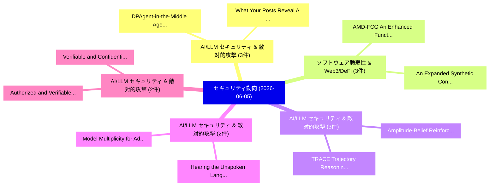

# 📅 02_daily: 日次エグゼクティブサマリー報告書 (2026-06-05)

**集計日時**: 2026-10-02 23:06:13 UTC  
**対象日付**: 2026-06-05  
**本日収集論文数**: 37 件  

---

## 💡 主要セキュリティ動向・脅威インサイト (Executive Insights)

本日の収集論文（計 37 件）において、以下の重点セキュリティ領域で活発な研究動向が確認されました：
- **AI/LLM セキュリティ & 敵対的攻撃** (3 件): 注目論文として 「What Your Posts Reveal: A Benc...」、「DPAgent-in-the-Middle: Agentic...」 等が発表され、実務防御および攻撃検証の進展が見られます。
- **ソフトウェア脆弱性 & Web3/DeFi** (3 件): 注目論文として 「AMD-FCG: An Enhanced Function ...」、「An Expanded Synthetic Conversa...」 等が発表され、実務防御および攻撃検証の進展が見られます。
- **AI/LLM セキュリティ & 敵対的攻撃** (3 件): 注目論文として 「TRACE: Trajectory Reasoning th...」、「Amplitude-Belief Reinforcement...」 等が発表され、実務防御および攻撃検証の進展が見られます。
- **AI/LLM セキュリティ & 敵対的攻撃** (2 件): 注目論文として 「Hearing the Unspoken: Language...」、「Model Multiplicity for Adversa...」 等が発表され、実務防御および攻撃検証の進展が見られます。
- **AI/LLM セキュリティ & 敵対的攻撃** (2 件): 注目論文として 「Authorized and Verifiable Sear...」、「Verifiable and Confidential DN...」 等が発表され、実務防御および攻撃検証の進展が見られます。

### 🗺️ 技術・脅威トピックマインドマップ

---

## 📌 日次セキュリティ論文一覧 (日本語表形式)

| No | arXiv ID | 論文タイトル (日本語訳) | 重要キーワード | 構造化エグゼクティブ要約 (背景・提案・影響) | 脅威分類 | 詳細リンク |
|---|---|---|---|---|---|---|
| 1 | `2606.06784v1` | [What Your Posts Reveal: A Benchmark and Agentic Framework for User-Level Privacy Leakage on Social Media（セキュリティ分析論文）](../../okf/papers/2026-06-05/2606.06784.md) | `Level Privacy Leakage`, `Social Media`, `User-Level Privacy` | 【提案】概要 (Overview & Key Finding) 本論文「What Your Posts Reveal: A Benchmark and Agentic Framewo...。実証評価により経営層・セキュリティ管理者向け推奨アクション (E... | `arXiv` | [arXiv](https://arxiv.org/abs/2606.06784v1) &#124; [OKF](../../okf/papers/2026-06-05/2606.06784.md) |
| 2 | `2606.06815v1` | [AMD-FCG: An Enhanced Function Call Graph Dataset with Integrated Topological Features for マルウェア検出 and Classification](../../okf/papers/2026-06-05/2606.06815.md) | `Integrated Topological Features`, `Malware Detection`, `Parthajit Borah` | 【提案】概要 (Overview & Key Finding) 本論文「AMD-FCG: An Enhanced Function Call Graph Dataset with I...。実証評価により経営層・セキュリティ管理者向け推奨アクション (E... | `arXiv` | [arXiv](https://arxiv.org/abs/2606.06815v1) &#124; [OKF](../../okf/papers/2026-06-05/2606.06815.md) |
| 3 | `2606.06833v1` | [Hearing the Unspoken: Language Model Priors for Acoustic Adversarial Attacks（セキュリティ分析論文）](../../okf/papers/2026-06-05/2606.06833.md) | `Language Model Priors`, `Acoustic Adversarial Attacks`, `Jiani Xie` | 【提案】概要 (Overview & Key Finding) 本論文「Hearing the Unspoken: Language Model Priors for Acousti...。実証評価により経営層・セキュリティ管理者向け推奨アクション (E... | `arXiv` | [arXiv](https://arxiv.org/abs/2606.06833v1) &#124; [OKF](../../okf/papers/2026-06-05/2606.06833.md) |
| 4 | `2606.06860v1` | [On the Incentive Compatibility of Block Propagation in Bitcoin（セキュリティ分析論文）](../../okf/papers/2026-06-05/2606.06860.md) | `Incentive Compatibility`, `Block Propagation`, `Fumichika Maeda` | 【提案】概要 (Overview & Key Finding) 本論文「On the Incentive Compatibility of Block Propagation in ...。実証評価により経営層・セキュリティ管理者向け推奨アクション (E... | `arXiv` | [arXiv](https://arxiv.org/abs/2606.06860v1) &#124; [OKF](../../okf/papers/2026-06-05/2606.06860.md) |
| 5 | `2606.06875v1` | [Unified Safe In-context Image Generation in Multimodal Diffusion Transformers via Restricting Unsafe Information Flows（セキュリティ分析論文）](../../okf/papers/2026-06-05/2606.06875.md) | `Restricting Unsafe Information Flows`, `Multimodal Diffusion Transformers`, `Image Generation` | 【提案】概要 (Overview & Key Finding) 本論文「Unified Safe In-context Image Generation in Multimodal ...。実証評価により経営層・セキュリティ管理者向け推奨アクション (E... | `arXiv` | [arXiv](https://arxiv.org/abs/2606.06875v1) &#124; [OKF](../../okf/papers/2026-06-05/2606.06875.md) |
| 6 | `2606.06879v1` | [An Expanded Synthetic Conversation Dataset for Multi-Turn Smishing Detection（セキュリティ分析論文）](../../okf/papers/2026-06-05/2606.06879.md) | `Turn Smishing Detection`, `Multi-Turn Smishing`, `Carl Lochstampfor` | 【提案】概要 (Overview & Key Finding) 本論文「An Expanded Synthetic Conversation Dataset for Multi-Tu...。実証評価により経営層・セキュリティ管理者向け推奨アクション (E... | `arXiv` | [arXiv](https://arxiv.org/abs/2606.06879v1) &#124; [OKF](../../okf/papers/2026-06-05/2606.06879.md) |
| 7 | `2606.06894v1` | [FDM: A Framework for Decision-making to build ML-based マルウェア検出 systems](../../okf/papers/2026-06-05/2606.06894.md) | `ML-based Malware`, `Tadiwa Vhito`, `Jakapan Suaboot` | 【提案】概要 (Overview & Key Finding) 本論文「FDM: A Framework for Decision-making to build ML-based ...。実証評価により経営層・セキュリティ管理者向け推奨アクション (E... | `arXiv` | [arXiv](https://arxiv.org/abs/2606.06894v1) &#124; [OKF](../../okf/papers/2026-06-05/2606.06894.md) |
| 8 | `2606.06895v1` | [Blockchain Infrastructure for Intelligent Cyber--Physical--Social Systems:Post-Quantum Security, Interoperability, and Trustworthy Data Economies in the Era of Embodied AI（セキュリティ分析論文）](../../okf/papers/2026-06-05/2606.06895.md) | `Trustworthy Data Economies`, `Blockchain Infrastructure`, `Intelligent Cyber` | 【提案】概要 (Overview & Key Finding) 本論文「Blockchain Infrastructure for Intelligent Cyber--Physic...。実証評価により経営層・セキュリティ管理者向け推奨アクション (E... | `arXiv` | [arXiv](https://arxiv.org/abs/2606.06895v1) &#124; [OKF](../../okf/papers/2026-06-05/2606.06895.md) |
| 9 | `2606.06914v1` | [DPAgent-in-the-Middle: Agentic Defense and Repair Against AI-Groomed Deceptive Patterns（セキュリティ分析論文）](../../okf/papers/2026-06-05/2606.06914.md) | `Groomed Deceptive Patterns`, `Agentic Defense`, `AI-Groomed Deceptive` | 【提案】概要 (Overview & Key Finding) 本論文「DPAgent-in-the-Middle: Agentic Defense and Repair Again...。実証評価により経営層・セキュリティ管理者向け推奨アクション (E... | `arXiv` | [arXiv](https://arxiv.org/abs/2606.06914v1) &#124; [OKF](../../okf/papers/2026-06-05/2606.06914.md) |
| 10 | `2606.06968v1` | [HAVE: Host Active Verification Engine for Closing the Contextual Reality Gap in Security Digital Twins（セキュリティ分析論文）](../../okf/papers/2026-06-05/2606.06968.md) | `Host Active Verification Engine`, `Contextual Reality Gap`, `Security Digital Twins` | 【提案】概要 (Overview & Key Finding) 本論文「HAVE: Host Active Verification Engine for Closing the C...。実証評価により経営層・セキュリティ管理者向け推奨アクション (E... | `arXiv` | [arXiv](https://arxiv.org/abs/2606.06968v1) &#124; [OKF](../../okf/papers/2026-06-05/2606.06968.md) |
| 11 | `2606.07005v1` | [The Sound of Malware: A Memory Forensics Approach for Android Malware Analysis via Audio Signals（セキュリティ分析論文）](../../okf/papers/2026-06-05/2606.07005.md) | `Audio Signals`, `Silvia Lucia Sanna`, `Massimo Palozzi` | 【提案】概要 (Overview & Key Finding) 本論文「The Sound of マルウェア: A Memory Forensics Approach for And...。実証評価により経営層・セキュリティ管理者向け推奨アクション (E... | `arXiv` | [arXiv](https://arxiv.org/abs/2606.07005v1) &#124; [OKF](../../okf/papers/2026-06-05/2606.07005.md) |
| 12 | `2606.07009v1` | [Fast Bounded-Independence Functions and Their Duals（セキュリティ分析論文）](../../okf/papers/2026-06-05/2606.07009.md) | `Fast Bounded`, `Independence Functions`, `Bounded-Independence Functions` | 【提案】概要 (Overview & Key Finding) 本論文「Fast Bounded-Independence Functions and Their Duals（セキュ...。実証評価により経営層・セキュリティ管理者向け推奨アクション (E... | `arXiv` | [arXiv](https://arxiv.org/abs/2606.07009v1) &#124; [OKF](../../okf/papers/2026-06-05/2606.07009.md) |
| 13 | `2606.07054v1` | [TRACE: Trajectory Reasoning through Adaptive Cross-Step Evidence Aggregation for LLMエージェント](../../okf/papers/2026-06-05/2606.07054.md) | `Step Evidence Aggregation`, `Trajectory Reasoning`, `Adaptive Cross` | 【提案】概要 (Overview & Key Finding) 本論文「TRACE: Trajectory Reasoning through Adaptive Cross-Step...。実証評価により経営層・セキュリティ管理者向け推奨アクション (E... | `arXiv` | [arXiv](https://arxiv.org/abs/2606.07054v1) &#124; [OKF](../../okf/papers/2026-06-05/2606.07054.md) |
| 14 | `2606.07131v3` | [MalSkillBench: A Runtime-Verified Benchmark of Malicious Agent Skills（セキュリティ分析論文）](../../okf/papers/2026-06-05/2606.07131.md) | `Malicious Agent Skills`, `Verified Benchmark`, `Runtime-Verified Benchmark` | 【提案】概要 (Overview & Key Finding) 本論文「MalSkillBench: A Runtime-Verified Benchmark of Maliciou...。実証評価により経営層・セキュリティ管理者向け推奨アクション (E... | `arXiv` | [arXiv](https://arxiv.org/abs/2606.07131v3) &#124; [OKF](../../okf/papers/2026-06-05/2606.07131.md) |
| 15 | `2606.07150v3` | [From Privacy to Workflow Integrity: Communication-Graph Metadata in Autonomous Agent Interoperability（セキュリティ分析論文）](../../okf/papers/2026-06-05/2606.07150.md) | `Autonomous Agent Interoperability`, `Workflow Integrity`, `Graph Metadata` | 【提案】概要 (Overview & Key Finding) 本論文「From Privacy to Workflow Integrity: Communication-Graph...。実証評価により経営層・セキュリティ管理者向け推奨アクション (E... | `arXiv` | [arXiv](https://arxiv.org/abs/2606.07150v3) &#124; [OKF](../../okf/papers/2026-06-05/2606.07150.md) |
| 16 | `2606.07158v1` | [Synthetic APTs: the Collapse of TTP-Based Attribution（セキュリティ分析論文）](../../okf/papers/2026-06-05/2606.07158.md) | `Based Attribution`, `TTP-Based Attribution`, `Lauren Min Kim` | 【提案】概要 (Overview & Key Finding) 本論文「Synthetic APTs: the Collapse of TTP-Based Attribution（セ...。実証評価により経営層・セキュリティ管理者向け推奨アクション (E... | `arXiv` | [arXiv](https://arxiv.org/abs/2606.07158v1) &#124; [OKF](../../okf/papers/2026-06-05/2606.07158.md) |
| 17 | `2606.07210v1` | [A Large-Scale Per-Speaker Re-identification Risk in Speech Anonymizationの分析](../../okf/papers/2026-06-05/2606.07210.md) | `Scale Per`, `Large-Scale Per`, `Re-identification Risk` | 【提案】概要 (Overview & Key Finding) 本論文「A Large-Scale Per-Speaker Re-identification Risk in Spe...。実証評価により経営層・セキュリティ管理者向け推奨アクション (E... | `arXiv` | [arXiv](https://arxiv.org/abs/2606.07210v1) &#124; [OKF](../../okf/papers/2026-06-05/2606.07210.md) |
| 18 | `2606.07277v1` | [The Capacity of Information-Theoretic Secure Aggregation in 連合学習](../../okf/papers/2026-06-05/2606.07277.md) | `Theoretic Secure Aggregation`, `Information-Theoretic Secure`, `Federated Learning` | 【提案】概要 (Overview & Key Finding) 本論文「The Capacity of Information-Theoretic Secure Aggregatio...。実証評価により経営層・セキュリティ管理者向け推奨アクション (E... | `arXiv` | [arXiv](https://arxiv.org/abs/2606.07277v1) &#124; [OKF](../../okf/papers/2026-06-05/2606.07277.md) |
| 19 | `2606.07282v1` | [Rethinking IoT Intrusion Detection: Augmenting Routing Metrics with Radio Features（セキュリティ分析論文）](../../okf/papers/2026-06-05/2606.07282.md) | `Augmenting Routing Metrics`, `Intrusion Detection`, `Radio Features` | 【提案】概要 (Overview & Key Finding) 本論文「Rethinking IoT Intrusion Detection: Augmenting Routing ...。実証評価により経営層・セキュリティ管理者向け推奨アクション (E... | `arXiv` | [arXiv](https://arxiv.org/abs/2606.07282v1) &#124; [OKF](../../okf/papers/2026-06-05/2606.07282.md) |
| 20 | `2606.07319v1` | [Authorized and Verifiable Searchable Encryption Based on Public Key Equality Test for Cloud Storage（セキュリティ分析論文）](../../okf/papers/2026-06-05/2606.07319.md) | `Verifiable Searchable Encryption Based`, `Public Key Equality Test`, `Cloud Storage` | 【提案】概要 (Overview & Key Finding) 本論文「Authorized and Verifiable Searchable Encryption Based o...。実証評価により経営層・セキュリティ管理者向け推奨アクション (E... | `arXiv` | [arXiv](https://arxiv.org/abs/2606.07319v1) &#124; [OKF](../../okf/papers/2026-06-05/2606.07319.md) |
| 21 | `2606.07335v1` | [Defending Jailbreak Attacks on 大規模言語モデル via Manifold Trajectory Kinetics](../../okf/papers/2026-06-05/2606.07335.md) | `Defending Jailbreak Attacks`, `Manifold Trajectory Kinetics`, `Large Language Models` | 【提案】概要 (Overview & Key Finding) 本論文「Defending ジェイルブレイク Attacks on 大規模言語モデル via Manifold Tra...。実証評価により経営層・セキュリティ管理者向け推奨アクション (E... | `arXiv` | [arXiv](https://arxiv.org/abs/2606.07335v1) &#124; [OKF](../../okf/papers/2026-06-05/2606.07335.md) |
| 22 | `2606.07341v1` | [Empirical Evaluation of 大規模言語モデル for Migration of Code Fragments to Post-Quantum Cryptography](../../okf/papers/2026-06-05/2606.07341.md) | `Code Fragments`, `Quantum Cryptography`, `Post-Quantum Cryptography` | 【提案】概要 (Overview & Key Finding) 本論文「Empirical Evaluation of 大規模言語モデル for Migration of Code ...。実証評価により経営層・セキュリティ管理者向け推奨アクション (E... | `arXiv` | [arXiv](https://arxiv.org/abs/2606.07341v1) &#124; [OKF](../../okf/papers/2026-06-05/2606.07341.md) |
| 23 | `2606.07363v1` | [On the Shoulders of Giants: Empowering Automated Smart Contract Auditing via the GiAnt Corpus（セキュリティ分析論文）](../../okf/papers/2026-06-05/2606.07363.md) | `Empowering Automated Smart Contract Auditing`, `Xiaoting Zhang`, `Zhipeng Gao` | 【提案】概要 (Overview & Key Finding) 本論文「On the Shoulders of Giants: Empowering Automated スマートコン...。実証評価により経営層・セキュリティ管理者向け推奨アクション (E... | `arXiv` | [arXiv](https://arxiv.org/abs/2606.07363v1) &#124; [OKF](../../okf/papers/2026-06-05/2606.07363.md) |
| 24 | `2606.07375v1` | [An End-to-End Encrypted Control Pipeline for Multi-Agent Coordination via CKKS Homomorphic Encryption（セキュリティ分析論文）](../../okf/papers/2026-06-05/2606.07375.md) | `End Encrypted Control Pipeline`, `Agent Coordination`, `Multi-Agent Coordination` | 【提案】概要 (Overview & Key Finding) 本論文「An End-to-End Encrypted Control Pipeline for Multi-Agen...。実証評価により経営層・セキュリティ管理者向け推奨アクション (E... | `arXiv` | [arXiv](https://arxiv.org/abs/2606.07375v1) &#124; [OKF](../../okf/papers/2026-06-05/2606.07375.md) |
| 25 | `2606.07420v1` | [Lost in Migration: Exposing Android Framework Vulnerabilities in Parallel Java-Kotlin Implementations（セキュリティ分析論文）](../../okf/papers/2026-06-05/2606.07420.md) | `Parallel Java`, `Kotlin Implementations`, `Java-Kotlin Implementations` | 【提案】概要 (Overview & Key Finding) 本論文「Lost in Migration: Exposing Android Framework Vulnerabi...。実証評価により経営層・セキュリティ管理者向け推奨アクション (E... | `arXiv` | [arXiv](https://arxiv.org/abs/2606.07420v1) &#124; [OKF](../../okf/papers/2026-06-05/2606.07420.md) |
| 26 | `2606.07443v1` | [Sort, Partition, Randomize: Optimal Binary Hypothesis Testing under Local Differential Privacy（セキュリティ分析論文）](../../okf/papers/2026-06-05/2606.07443.md) | `Optimal Binary Hypothesis Testing`, `Local Differential Privacy`, `Elena Ghazi` | 【提案】概要 (Overview & Key Finding) 本論文「Sort, Partition, Randomize: Optimal Binary Hypothesis T...。実証評価により経営層・セキュリティ管理者向け推奨アクション (E... | `arXiv` | [arXiv](https://arxiv.org/abs/2606.07443v1) &#124; [OKF](../../okf/papers/2026-06-05/2606.07443.md) |
| 27 | `2606.07470v1` | [Verifiable and Confidential DNN Inference on Low-End Edge Devices（セキュリティ分析論文）](../../okf/papers/2026-06-05/2606.07470.md) | `End Edge Devices`, `Low-End Edge`, `Ivan De Oliveira Nunes` | 【提案】概要 (Overview & Key Finding) 本論文「Verifiable and Confidential DNN Inference on Low-End Ed...。実証評価により経営層・セキュリティ管理者向け推奨アクション (E... | `arXiv` | [arXiv](https://arxiv.org/abs/2606.07470v1) &#124; [OKF](../../okf/papers/2026-06-05/2606.07470.md) |
| 28 | `2606.07706v1` | [MLingualFC: Evaluating Jailbreak Vulnerabilities in Multilingual Vision-Language Models（セキュリティ分析論文）](../../okf/papers/2026-06-05/2606.07706.md) | `Evaluating Jailbreak Vulnerabilities`, `Multilingual Vision`, `Language Models` | 【提案】概要 (Overview & Key Finding) 本論文「MLingualFC: Evaluating ジェイルブレイク Vulnerabilities in Mult...。実証評価により経営層・セキュリティ管理者向け推奨アクション (E... | `arXiv` | [arXiv](https://arxiv.org/abs/2606.07706v1) &#124; [OKF](../../okf/papers/2026-06-05/2606.07706.md) |
| 29 | `2606.07716v1` | [SHIELD-IDS: Structurally Heterogeneous Ensemble with Integrated Layered Defense for Intrusion Detection Systems（セキュリティ分析論文）](../../okf/papers/2026-06-05/2606.07716.md) | `Structurally Heterogeneous Ensemble`, `Integrated Layered Defense`, `Intrusion Detection Systems` | 【提案】概要 (Overview & Key Finding) 本論文「SHIELD-IDS: Structurally Heterogeneous Ensemble with In...。実証評価により経営層・セキュリティ管理者向け推奨アクション (E... | `arXiv` | [arXiv](https://arxiv.org/abs/2606.07716v1) &#124; [OKF](../../okf/papers/2026-06-05/2606.07716.md) |
| 30 | `2606.07761v1` | [ScaleDisturb: Exploiting Temporal Asymmetry to Amplify Read Disturbance in Modern DRAM Chips（セキュリティ分析論文）](../../okf/papers/2026-06-05/2606.07761.md) | `Exploiting Temporal Asymmetry`, `Amplify Read Disturbance`, `Jikun Wang` | 【提案】概要 (Overview & Key Finding) 本論文「ScaleDisturb: Exploiting Temporal Asymmetry to Amplify ...。実証評価により経営層・セキュリティ管理者向け推奨アクション (E... | `arXiv` | [arXiv](https://arxiv.org/abs/2606.07761v1) &#124; [OKF](../../okf/papers/2026-06-05/2606.07761.md) |
| 31 | `2606.07792v1` | [MOLOT System Card: Malicious Operational Logic Observation Transformer（セキュリティ分析論文）](../../okf/papers/2026-06-05/2606.07792.md) | `Malicious Operational Logic Observation Transformer`, `System Card`, `Daniil Lopatkin` | 【提案】概要 (Overview & Key Finding) 本論文「MOLOT System Card: Malicious Operational Logic Observat...。実証評価により経営層・セキュリティ管理者向け推奨アクション (E... | `arXiv` | [arXiv](https://arxiv.org/abs/2606.07792v1) &#124; [OKF](../../okf/papers/2026-06-05/2606.07792.md) |
| 32 | `2606.07796v2` | [Amplitude-Belief Reinforcement Learning for Adaptive Cyber Defense in Partially Observable V2X Networks（セキュリティ分析論文）](../../okf/papers/2026-06-05/2606.07796.md) | `Belief Reinforcement Learning`, `Adaptive Cyber Defense`, `Amplitude-Belief Reinforcement` | 【提案】概要 (Overview & Key Finding) 本論文「Amplitude-Belief Reinforcement Learning for Adaptive Cy...。実証評価により経営層・セキュリティ管理者向け推奨アクション (E... | `arXiv` | [arXiv](https://arxiv.org/abs/2606.07796v2) &#124; [OKF](../../okf/papers/2026-06-05/2606.07796.md) |
| 33 | `2606.07804v2` | [Communication-Aware Quantum-Inspired Reinforcement Learning for Cyber-Resilient V2X Intrusion Detection and Mitigation（セキュリティ分析論文）](../../okf/papers/2026-06-05/2606.07804.md) | `Inspired Reinforcement Learning`, `Aware Quantum`, `Intrusion Detection` | 【提案】概要 (Overview & Key Finding) 本論文「Communication-Aware 量子-Inspired Reinforcement Learning ...。実証評価により経営層・セキュリティ管理者向け推奨アクション (E... | `arXiv` | [arXiv](https://arxiv.org/abs/2606.07804v2) &#124; [OKF](../../okf/papers/2026-06-05/2606.07804.md) |
| 34 | `2606.07832v1` | [Ternary public-key cryptosystem（セキュリティ分析論文）](../../okf/papers/2026-06-05/2606.07832.md) | `public-key cryptosystem`, `Steven Duplij`, `Qiang Guo` | 【提案】概要 (Overview & Key Finding) 本論文「Ternary public-key cryptosystem（セキュリティ分析論文）」（原題: Ternar...。実証評価により経営層・セキュリティ管理者向け推奨アクション (E... | `arXiv` | [arXiv](https://arxiv.org/abs/2606.07832v1) &#124; [OKF](../../okf/papers/2026-06-05/2606.07832.md) |
| 35 | `2606.07833v1` | [Beyond Pass/Fail: Using Process Mining to Understand How LLMs Resist (and Fail) Red Team Attacks（セキュリティ分析論文）](../../okf/papers/2026-06-05/2606.07833.md) | `Using Process Mining`, `Red Team Attacks`, `Beyond Pass` | 【提案】概要 (Overview & Key Finding) 本論文「Beyond Pass/Fail: Using Process Mining to Understand Ho...。実証評価により経営層・セキュリティ管理者向け推奨アクション (E... | `arXiv` | [arXiv](https://arxiv.org/abs/2606.07833v1) &#124; [OKF](../../okf/papers/2026-06-05/2606.07833.md) |
| 36 | `2606.07857v1` | [Model Multiplicity for Adversarial Detection in Small Language Model Training on Edge Devices（セキュリティ分析論文）](../../okf/papers/2026-06-05/2606.07857.md) | `Small Language Model Training`, `Model Multiplicity`, `Adversarial Detection` | 【提案】概要 (Overview & Key Finding) 本論文「Model Multiplicity for Adversarial Detection in Small L...。実証評価により経営層・セキュリティ管理者向け推奨アクション (E... | `arXiv` | [arXiv](https://arxiv.org/abs/2606.07857v1) &#124; [OKF](../../okf/papers/2026-06-05/2606.07857.md) |
| 37 | `2606.07883v2` | [DP4SQL: Differentially Private SQL with Flexible Privacy Policies（セキュリティ分析論文）](../../okf/papers/2026-06-05/2606.07883.md) | `Flexible Privacy Policies`, `Differentially Private`, `Andrew Cascio` | 【提案】概要 (Overview & Key Finding) 本論文「DP4SQL: Differentially Private SQL with Flexible Privac...。実証評価により経営層・セキュリティ管理者向け推奨アクション (E... | `arXiv` | [arXiv](https://arxiv.org/abs/2606.07883v2) &#124; [OKF](../../okf/papers/2026-06-05/2606.07883.md) |

