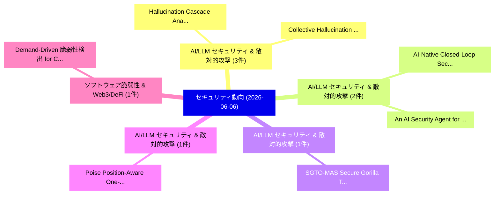

# 📅 02_daily: 日次エグゼクティブサマリー報告書 (2026-06-06)

**集計日時**: 2026-10-02 23:06:14 UTC  
**対象日付**: 2026-06-06  
**本日収集論文数**: 22 件  

---

## 💡 主要セキュリティ動向・脅威インサイト (Executive Insights)

本日の収集論文（計 22 件）において、以下の重点セキュリティ領域で活発な研究動向が確認されました：
- **AI/LLM セキュリティ & 敵対的攻撃** (3 件): 注目論文として 「Hallucination Cascade: Analyzi...」、「Collective Hallucination in Mu...」 等が発表され、実務防御および攻撃検証の進展が見られます。
- **AI/LLM セキュリティ & 敵対的攻撃** (2 件): 注目論文として 「AI-Native Closed-Loop Security...」、「An AI Security Agent for Unive...」 等が発表され、実務防御および攻撃検証の進展が見られます。
- **AI/LLM セキュリティ & 敵対的攻撃** (1 件): 注目論文として 「SGTO-MAS: Secure Gorilla Troop...」 等が発表され、実務防御および攻撃検証の進展が見られます。
- **AI/LLM セキュリティ & 敵対的攻撃** (1 件): 注目論文として 「Poise: Position-Aware One-Inst...」 等が発表され、実務防御および攻撃検証の進展が見られます。
- **ソフトウェア脆弱性 & Web3/DeFi** (1 件): 注目論文として 「Demand-Driven 脆弱性検出 for Cloud ...」 等が発表され、実務防御および攻撃検証の進展が見られます。

### 🗺️ 技術・脅威トピックマインドマップ

---

## 📌 日次セキュリティ論文一覧 (日本語表形式)

| No | arXiv ID | 論文タイトル (日本語訳) | 重要キーワード | 構造化エグゼクティブ要約 (背景・提案・影響) | 脅威分類 | 詳細リンク |
|---|---|---|---|---|---|---|
| 1 | `2606.07937v1` | [Hallucination Cascade: Analyzing Error Propagation in Multi-Agent LLM Systems（セキュリティ分析論文）](../../okf/papers/2026-06-06/2606.07937.md) | `Analyzing Error Propagation`, `Hallucination Cascade`, `Multi-Agent LLM` | 【提案】概要 (Overview & Key Finding) 本論文「Hallucination Cascade: Analyzing Error Propagation in M...。実証評価により経営層・セキュリティ管理者向け推奨アクション (E... | `arXiv` | [arXiv](https://arxiv.org/abs/2606.07937v1) &#124; [OKF](../../okf/papers/2026-06-06/2606.07937.md) |
| 2 | `2606.07940v1` | [SGTO-MAS: Secure Gorilla Troops Optimization for Multi-Agent LLM Systems（セキュリティ分析論文）](../../okf/papers/2026-06-06/2606.07940.md) | `Secure Gorilla Troops Optimization`, `Multi-Agent LLM`, `Saeid Jamshidi` | 【提案】概要 (Overview & Key Finding) 本論文「SGTO-MAS: Secure Gorilla Troops Optimization for Multi-...。実証評価により経営層・セキュリティ管理者向け推奨アクション (E... | `arXiv` | [arXiv](https://arxiv.org/abs/2606.07940v1) &#124; [OKF](../../okf/papers/2026-06-06/2606.07940.md) |
| 3 | `2606.07941v2` | [Collective Hallucination in Multi-Agent LLMs:Modeling and Defense（セキュリティ分析論文）](../../okf/papers/2026-06-06/2606.07941.md) | `Collective Hallucination`, `Multi-Agent LLMs`, `Saeid Jamshidi` | 【提案】概要 (Overview & Key Finding) 本論文「Collective Hallucination in Multi-Agent LLMs:Modeling a...。実証評価により経営層・セキュリティ管理者向け推奨アクション (E... | `AI/ML Security` | [arXiv](https://arxiv.org/abs/2606.07941v2) &#124; [OKF](../../okf/papers/2026-06-06/2606.07941.md) |
| 4 | `2606.07943v2` | [Poise: Position-Aware One-Instruction Skill Injection for Silent Execution on LLMエージェント](../../okf/papers/2026-06-06/2606.07943.md) | `Instruction Skill Injection`, `Aware One`, `Position-Aware One` | 【提案】概要 (Overview & Key Finding) 本論文「Poise: Position-Aware One-Instruction Skill Injection f...。実証評価により経営層・セキュリティ管理者向け推奨アクション (E... | `arXiv` | [arXiv](https://arxiv.org/abs/2606.07943v2) &#124; [OKF](../../okf/papers/2026-06-06/2606.07943.md) |
| 5 | `2606.07957v2` | [Demand-Driven 脆弱性検出 for Cloud Security Posture Management: Removing Human Rule Authoring from the Disclosure-to-Protection Critical Path](../../okf/papers/2026-06-06/2606.07957.md) | `Cloud Security Posture Management`, `Removing Human Rule Authoring`, `Protection Critical Path` | 【提案】概要 (Overview & Key Finding) 本論文「Demand-Driven 脆弱性検出 for Cloud Security Posture Manageme...。実証評価により経営層・セキュリティ管理者向け推奨アクション (E... | `arXiv` | [arXiv](https://arxiv.org/abs/2606.07957v2) &#124; [OKF](../../okf/papers/2026-06-06/2606.07957.md) |
| 6 | `2606.07968v1` | [RecurGuard: Runtime Monitoring for Reasoning-Token Consumption Attacks（セキュリティ分析論文）](../../okf/papers/2026-06-06/2606.07968.md) | `Token Consumption Attacks`, `Runtime Monitoring`, `Reasoning-Token Consumption` | 【提案】概要 (Overview & Key Finding) 本論文「RecurGuard: Runtime Monitoring for Reasoning-Token Cons...。実証評価により経営層・セキュリティ管理者向け推奨アクション (E... | `arXiv` | [arXiv](https://arxiv.org/abs/2606.07968v1) &#124; [OKF](../../okf/papers/2026-06-06/2606.07968.md) |
| 7 | `2606.07992v1` | [VATS: Exploiting Implicit Authority in Error-Path Injection via Systematic Mutation（セキュリティ分析論文）](../../okf/papers/2026-06-06/2606.07992.md) | `Exploiting Implicit Authority`, `Path Injection`, `Systematic Mutation` | 【提案】概要 (Overview & Key Finding) 本論文「VATS: Exploiting Implicit Authority in Error-Path Injec...。実証評価により経営層・セキュリティ管理者向け推奨アクション (E... | `arXiv` | [arXiv](https://arxiv.org/abs/2606.07992v1) &#124; [OKF](../../okf/papers/2026-06-06/2606.07992.md) |
| 8 | `2606.08012v2` | [The Dodona Protocol: A Living Design Science Experiment on Blockchain Oracles（セキュリティ分析論文）](../../okf/papers/2026-06-06/2606.08012.md) | `Blockchain Oracles`, `Giulio Caldarelli`, `Raw Meta` | 【提案】概要 (Overview & Key Finding) 本論文「The Dodona Protocol: A Living Design Science Experiment...。実証評価により経営層・セキュリティ管理者向け推奨アクション (E... | `arXiv` | [arXiv](https://arxiv.org/abs/2606.08012v2) &#124; [OKF](../../okf/papers/2026-06-06/2606.08012.md) |
| 9 | `2606.08060v1` | [TOMOYO Linux: A Mandatory Access Control Method Based on Application Execution State（セキュリティ分析論文）](../../okf/papers/2026-06-06/2606.08060.md) | `Application Execution State`, `Toshiharu Harada`, `Tetsuo Handa` | 【提案】概要 (Overview & Key Finding) 本論文「TOMOYO Linux: A Mandatory アクセス制御 Method Based on Applic...。実証評価により経営層・セキュリティ管理者向け推奨アクション (E... | `arXiv` | [arXiv](https://arxiv.org/abs/2606.08060v1) &#124; [OKF](../../okf/papers/2026-06-06/2606.08060.md) |
| 10 | `2606.08062v1` | [Multidimensional Resilience for Electrical Power Systems: Systematic Review, Integrated Index, and Validation under Real-World Cyber-Physical Attack Scenarios（セキュリティ分析論文）](../../okf/papers/2026-06-06/2606.08062.md) | `Electrical Power Systems`, `Physical Attack Scenarios`, `Multidimensional Resilience` | 【提案】概要 (Overview & Key Finding) 本論文「Multidimensional Resilience for Electrical Power System...。実証評価により経営層・セキュリティ管理者向け推奨アクション (E... | `arXiv` | [arXiv](https://arxiv.org/abs/2606.08062v1) &#124; [OKF](../../okf/papers/2026-06-06/2606.08062.md) |
| 11 | `2606.08119v1` | [Policy Description Language for Authorization using Logic-Based Programming（セキュリティ分析論文）](../../okf/papers/2026-06-06/2606.08119.md) | `Policy Description Language`, `Based Programming`, `Logic-Based Programming` | 【提案】概要 (Overview & Key Finding) 本論文「Policy Description Language for Authorization using Log...。実証評価により経営層・セキュリティ管理者向け推奨アクション (E... | `arXiv` | [arXiv](https://arxiv.org/abs/2606.08119v1) &#124; [OKF](../../okf/papers/2026-06-06/2606.08119.md) |
| 12 | `2606.08168v1` | [Closing the Sim-to-Real Gap: An Evaluation Framework for Autonomous Cyber Defense Configuration of Commercial EDR（セキュリティ分析論文）](../../okf/papers/2026-06-06/2606.08168.md) | `Autonomous Cyber Defense Configuration`, `Real Gap`, `Kerri Prinos` | 【提案】概要 (Overview & Key Finding) 本論文「Closing the Sim-to-Real Gap: An Evaluation Framework fo...。実証評価により経営層・セキュリティ管理者向け推奨アクション (E... | `arXiv` | [arXiv](https://arxiv.org/abs/2606.08168v1) &#124; [OKF](../../okf/papers/2026-06-06/2606.08168.md) |
| 13 | `2606.08173v1` | [AI-Native Closed-Loop Security for 6G-Enabled Cyber-Physical Systems: From Edge Detection to Network-Wide Mitigation（セキュリティ分析論文）](../../okf/papers/2026-06-06/2606.08173.md) | `Native Closed`, `Loop Security`, `Enabled Cyber` | 【提案】概要 (Overview & Key Finding) 本論文「AI-Native Closed-Loop Security for 6G-Enabled Cyber-Phy...。実証評価により経営層・セキュリティ管理者向け推奨アクション (E... | `arXiv` | [arXiv](https://arxiv.org/abs/2606.08173v1) &#124; [OKF](../../okf/papers/2026-06-06/2606.08173.md) |
| 14 | `2606.08179v1` | [Differentially Private Range Subgraph Counting（セキュリティ分析論文）](../../okf/papers/2026-06-06/2606.08179.md) | `Differentially Private Range Subgraph Counting`, `Xian Chen`, `Ruobing Bai` | 【提案】概要 (Overview & Key Finding) 本論文「Differentially Private Range Subgraph Counting（セキュリティ分析...。実証評価により経営層・セキュリティ管理者向け推奨アクション (E... | `arXiv` | [arXiv](https://arxiv.org/abs/2606.08179v1) &#124; [OKF](../../okf/papers/2026-06-06/2606.08179.md) |
| 15 | `2606.08211v1` | [LPOR: A Layered Proof of Reserves Framework for Usable and Publicly Auditable Solvency Verification（セキュリティ分析論文）](../../okf/papers/2026-06-06/2606.08211.md) | `Publicly Auditable Solvency Verification`, `Layered Proof`, `Donggoo Kim` | 【提案】概要 (Overview & Key Finding) 本論文「LPOR: A Layered Proof of Reserves Framework for Usable ...。実証評価により経営層・セキュリティ管理者向け推奨アクション (E... | `arXiv` | [arXiv](https://arxiv.org/abs/2606.08211v1) &#124; [OKF](../../okf/papers/2026-06-06/2606.08211.md) |
| 16 | `2606.08252v1` | [Quantifying and Defending against the Privacy Risk in Logit-based 連合学習](../../okf/papers/2026-06-06/2606.08252.md) | `Privacy Risk`, `Federated Learning`, `Logit-based Federated` | 【提案】概要 (Overview & Key Finding) 本論文「Quantifying and Defending against the Privacy Risk in L...。実証評価により経営層・セキュリティ管理者向け推奨アクション (E... | `arXiv` | [arXiv](https://arxiv.org/abs/2606.08252v1) &#124; [OKF](../../okf/papers/2026-06-06/2606.08252.md) |
| 17 | `2606.08270v3` | [An AI Security Agent for University ACMIS: Multi-Vector Threat Detection and Automated Response（セキュリティ分析論文）](../../okf/papers/2026-06-06/2606.08270.md) | `Vector Threat Detection`, `Security Agent`, `Automated Response` | 【提案】概要 (Overview & Key Finding) 本論文「An AI Security Agent for University ACMIS: Multi-Vector...。実証評価により経営層・セキュリティ管理者向け推奨アクション (E... | `arXiv` | [arXiv](https://arxiv.org/abs/2606.08270v3) &#124; [OKF](../../okf/papers/2026-06-06/2606.08270.md) |
| 18 | `2606.08372v1` | [SoK: Reconstruction Attacks on Synthetic Tabular Data (Insights from Winning the NIST CRC)（セキュリティ分析論文）](../../okf/papers/2026-06-06/2606.08372.md) | `Synthetic Tabular Data`, `Reconstruction Attacks`, `Martine De Cock` | 【提案】概要 (Overview & Key Finding) 本論文「SoK: Reconstruction Attacks on Synthetic Tabular Data (...。実証評価により経営層・セキュリティ管理者向け推奨アクション (E... | `arXiv` | [arXiv](https://arxiv.org/abs/2606.08372v1) &#124; [OKF](../../okf/papers/2026-06-06/2606.08372.md) |
| 19 | `2606.09908v1` | [IDP-Bench: ability of LLMs to protect personal information in interdependent privacy contextsのベンチマーク評価](../../okf/papers/2026-06-06/2606.09908.md) | `Ayana Hussain`, `Soumya Sharma`, `Golnoosh Farnadi` | 【提案】概要 (Overview & Key Finding) 本論文「IDP-Bench: ability of LLMs to protect personal informat...。実証評価により経営層・セキュリティ管理者向け推奨アクション (E... | `arXiv` | [arXiv](https://arxiv.org/abs/2606.09908v1) &#124; [OKF](../../okf/papers/2026-06-06/2606.09908.md) |
| 20 | `2606.09909v1` | [Bypassing Copyright Protection in Diffusion-based Customization via Two-Stage Latent Feature Optimization（セキュリティ分析論文）](../../okf/papers/2026-06-06/2606.09909.md) | `Stage Latent Feature Optimization`, `Bypassing Copyright Protection`, `Diffusion-based Customization` | 【提案】概要 (Overview & Key Finding) 本論文「Bypassing Copyright Protection in Diffusion-based Custo...。実証評価により経営層・セキュリティ管理者向け推奨アクション (E... | `arXiv` | [arXiv](https://arxiv.org/abs/2606.09909v1) &#124; [OKF](../../okf/papers/2026-06-06/2606.09909.md) |
| 21 | `2606.09915v1` | [ARTA: Adaptive Reinforcement-Learning-Based Throttling Agent for RowHammer Vulnerabilities（セキュリティ分析論文）](../../okf/papers/2026-06-06/2606.09915.md) | `Based Throttling Agent`, `Adaptive Reinforcement`, `Based Throttling Agen` | 【提案】概要 (Overview & Key Finding) 本論文「ARTA: Adaptive Reinforcement-Learning-Based Throttling ...。実証評価により経営層・セキュリティ管理者向け推奨アクション (E... | `arXiv` | [arXiv](https://arxiv.org/abs/2606.09915v1) &#124; [OKF](../../okf/papers/2026-06-06/2606.09915.md) |
| 22 | `2606.26127v1` | [Account-History Features for Social Bot Detection in the Era of 大規模言語モデル](../../okf/papers/2026-06-06/2606.26127.md) | `Social Bot Detection`, `History Features`, `Account-History Features` | 【提案】概要 (Overview & Key Finding) 本論文「Account-History Features for Social Bot Detection in th...。実証評価により経営層・セキュリティ管理者向け推奨アクション (E... | `arXiv` | [arXiv](https://arxiv.org/abs/2606.26127v1) &#124; [OKF](../../okf/papers/2026-06-06/2606.26127.md) |

