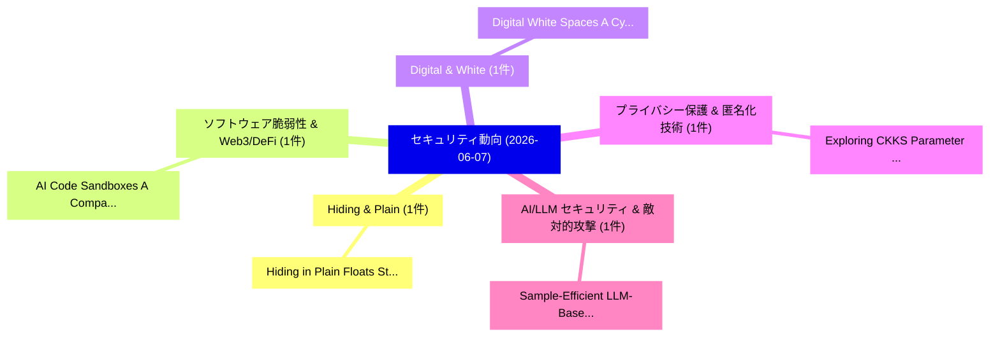

# 📅 02_daily: 日次エグゼクティブサマリー報告書 (2026-06-07)

**集計日時**: 2026-10-02 23:06:14 UTC  
**対象日付**: 2026-06-07  
**本日収集論文数**: 15 件  

---

## 💡 主要セキュリティ動向・脅威インサイト (Executive Insights)

本日の収集論文（計 15 件）において、以下の重点セキュリティ領域で活発な研究動向が確認されました：
- **Hiding & Plain** (1 件): 注目論文として 「Hiding in Plain Floats: Stegan...」 等が発表され、実務防御および攻撃検証の進展が見られます。
- **ソフトウェア脆弱性 & Web3/DeFi** (1 件): 注目論文として 「AI Code Sandboxes: A Comparati...」 等が発表され、実務防御および攻撃検証の進展が見られます。
- **Digital & White** (1 件): 注目論文として 「Digital White Spaces: A Cyberp...」 等が発表され、実務防御および攻撃検証の進展が見られます。
- **プライバシー保護 & 匿名化技術** (1 件): 注目論文として 「Exploring CKKS Parameter Trade...」 等が発表され、実務防御および攻撃検証の進展が見られます。
- **AI/LLM セキュリティ & 敵対的攻撃** (1 件): 注目論文として 「Sample-Efficient LLM-Based Mal...」 等が発表され、実務防御および攻撃検証の進展が見られます。

### 🗺️ 技術・脅威トピックマインドマップ

---

## 📌 日次セキュリティ論文一覧 (日本語表形式)

| No | arXiv ID | 論文タイトル (日本語訳) | 重要キーワード | 構造化エグゼクティブ要約 (背景・提案・影響) | 脅威分類 | 詳細リンク |
|---|---|---|---|---|---|---|
| 1 | `2606.08403v1` | [Hiding in Plain Floats: Steganographic Carriers for Indirect Prompt and Content Injection（セキュリティ分析論文）](../../okf/papers/2026-06-07/2606.08403.md) | `Plain Floats`, `Steganographic Carriers`, `Indirect Prompt` | 【提案】概要 (Overview & Key Finding) 本論文「Hiding in Plain Floats: Steganographic Carriers for Ind...。実証評価により経営層・セキュリティ管理者向け推奨アクション (E... | `arXiv` | [arXiv](https://arxiv.org/abs/2606.08403v1) &#124; [OKF](../../okf/papers/2026-06-07/2606.08403.md) |
| 2 | `2606.08433v1` | [AI Code Sandboxes: A Comparative Security Study. Part 1 of 2 -- Engine-Level Properties (Attack Surface, Leakage, Stackability, CVE History, Patch Cadence, Fuzzing)（セキュリティ分析論文）](../../okf/papers/2026-06-07/2606.08433.md) | `Code Sandboxes`, `Level Properties`, `Attack Surface` | 【提案】Part 1 of 2 -- Engine-Level Properties (Attack Surface, Leakage, Stackability, CVE Hist...。実証評価により経営層・セキュリティ管理者向け推奨アクション (E... | `arXiv` | [arXiv](https://arxiv.org/abs/2606.08433v1) &#124; [OKF](../../okf/papers/2026-06-07/2606.08433.md) |
| 3 | `2606.08472v4` | [Digital White Spaces: A Cyberpsychology-Informed Framework to Mobile Phone Addiction（セキュリティ分析論文）](../../okf/papers/2026-06-07/2606.08472.md) | `Digital White Spaces`, `Mobile Phone Addiction`, `Leandros Maglaras` | 【提案】概要 (Overview & Key Finding) 本論文「Digital White Spaces: A Cyberpsychology-Informed Framew...。実証評価により経営層・セキュリティ管理者向け推奨アクション (E... | `arXiv` | [arXiv](https://arxiv.org/abs/2606.08472v4) &#124; [OKF](../../okf/papers/2026-06-07/2606.08472.md) |
| 4 | `2606.08521v1` | [Exploring CKKS Parameter Trade-offs for Privacy-Preserving Personalized 連合学習](../../okf/papers/2026-06-07/2606.08521.md) | `Parameter Trade`, `Privacy-Preserving Personalized`, `Preserving Personalized Federated Learning` | 【提案】概要 (Overview & Key Finding) 本論文「Exploring CKKS Parameter Trade-offs for Privacy-Preserv...。実証評価により経営層・セキュリティ管理者向け推奨アクション (E... | `arXiv` | [arXiv](https://arxiv.org/abs/2606.08521v1) &#124; [OKF](../../okf/papers/2026-06-07/2606.08521.md) |
| 5 | `2606.08649v1` | [Sample-Efficient LLM-Based Malicious Web Server Logs with Forensically Explainable Reasoningの検出](../../okf/papers/2026-06-07/2606.08649.md) | `Sample-Efficient LLM`, `Based Malicious Web Server Logs`, `Malicious Web Server Logs` | 【提案】概要 (Overview & Key Finding) 本論文「Sample-Efficient LLM-Based Malicious Web Server Logs wi...。実証評価により経営層・セキュリティ管理者向け推奨アクション (E... | `arXiv` | [arXiv](https://arxiv.org/abs/2606.08649v1) &#124; [OKF](../../okf/papers/2026-06-07/2606.08649.md) |
| 6 | `2606.08661v1` | [Data Agents Under Attack: Vulnerabilities in LLM-Driven Analytical Systems（セキュリティ分析論文）](../../okf/papers/2026-06-07/2606.08661.md) | `Driven Analytical Systems`, `LLM-Driven Analytical`, `Driven Analytical Syste` | 【提案】概要 (Overview & Key Finding) 本論文「Data Agents Under Attack: Vulnerabilities in LLM-Driven...。実証評価により経営層・セキュリティ管理者向け推奨アクション (E... | `arXiv` | [arXiv](https://arxiv.org/abs/2606.08661v1) &#124; [OKF](../../okf/papers/2026-06-07/2606.08661.md) |
| 7 | `2606.08662v1` | [Uncertainty Principles for the Number Theoretic Transform（セキュリティ分析論文）](../../okf/papers/2026-06-07/2606.08662.md) | `Number Theoretic Transform`, `Uncertainty Principles`, `Giulio Malavolta` | 【提案】概要 (Overview & Key Finding) 本論文「Uncertainty Principles for the Number Theoretic Transfo...。実証評価により経営層・セキュリティ管理者向け推奨アクション (E... | `arXiv` | [arXiv](https://arxiv.org/abs/2606.08662v1) &#124; [OKF](../../okf/papers/2026-06-07/2606.08662.md) |
| 8 | `2606.08667v2` | [X-rated Compliance Theater: An Empirical Evaluation of European Age Verification Systems in Adult Websites（セキュリティ分析論文）](../../okf/papers/2026-06-07/2606.08667.md) | `European Age Verification Systems`, `Compliance Theater`, `X-rated Compliance` | 【提案】概要 (Overview & Key Finding) 本論文「X-rated Compliance Theater: An Empirical Evaluation of ...。実証評価により経営層・セキュリティ管理者向け推奨アクション (E... | `arXiv` | [arXiv](https://arxiv.org/abs/2606.08667v2) &#124; [OKF](../../okf/papers/2026-06-07/2606.08667.md) |
| 9 | `2606.08681v1` | [Asymptotic Optimality of the High-Dimensional Gaussian Mechanism and Improved Low-Dimensional Mechanisms for Differential Privacy（セキュリティ分析論文）](../../okf/papers/2026-06-07/2606.08681.md) | `Dimensional Gaussian Mechanism`, `Asymptotic Optimality`, `Improved Low` | 【提案】概要 (Overview & Key Finding) 本論文「Asymptotic Optimality of the High-Dimensional Gaussian ...。実証評価により経営層・セキュリティ管理者向け推奨アクション (E... | `arXiv` | [arXiv](https://arxiv.org/abs/2606.08681v1) &#124; [OKF](../../okf/papers/2026-06-07/2606.08681.md) |
| 10 | `2606.08700v2` | [AutoSUT: The Environment Semantics Gap in Structured CTI for Adversary Emulation（セキュリティ分析論文）](../../okf/papers/2026-06-07/2606.08700.md) | `Adversary Emulation`, `Lopes Roth Ferraz`, `Sidnei Barbieri` | 【提案】概要 (Overview & Key Finding) 本論文「AutoSUT: The Environment Semantics Gap in Structured CT...。実証評価により経営層・セキュリティ管理者向け推奨アクション (E... | `arXiv` | [arXiv](https://arxiv.org/abs/2606.08700v2) &#124; [OKF](../../okf/papers/2026-06-07/2606.08700.md) |
| 11 | `2606.08726v1` | [Evaluating Multimodal Steganalysis for Split-Payload Audiovisual Steganography（セキュリティ分析論文）](../../okf/papers/2026-06-07/2606.08726.md) | `Evaluating Multimodal Steganalysis`, `Payload Audiovisual Steganography`, `Split-Payload Audiovisual` | 【提案】概要 (Overview & Key Finding) 本論文「Evaluating Multimodal Steganalysis for Split-Payload Au...。実証評価により経営層・セキュリティ管理者向け推奨アクション (E... | `arXiv` | [arXiv](https://arxiv.org/abs/2606.08726v1) &#124; [OKF](../../okf/papers/2026-06-07/2606.08726.md) |
| 12 | `2606.08790v1` | [RAILS: Verification-Native Clearing For Agentic Commerce（セキュリティ分析論文）](../../okf/papers/2026-06-07/2606.08790.md) | `Verification-Native Clearing`, `Alex Bogdan`, `Raw Meta` | 【提案】概要 (Overview & Key Finding) 本論文「RAILS: Verification-Native Clearing For Agentic Commerc...。実証評価により経営層・セキュリティ管理者向け推奨アクション (E... | `arXiv` | [arXiv](https://arxiv.org/abs/2606.08790v1) &#124; [OKF](../../okf/papers/2026-06-07/2606.08790.md) |
| 13 | `2606.09934v1` | [nCMD: Benign-Anchored Feature Selection for Imbalanced Network Intrusion Detection（セキュリティ分析論文）](../../okf/papers/2026-06-07/2606.09934.md) | `Imbalanced Network Intrusion Detection`, `Anchored Feature Selection`, `Benign-Anchored Feature` | 【提案】概要 (Overview & Key Finding) 本論文「nCMD: Benign-Anchored Feature Selection for Imbalanced ...。実証評価により経営層・セキュリティ管理者向け推奨アクション (E... | `arXiv` | [arXiv](https://arxiv.org/abs/2606.09934v1) &#124; [OKF](../../okf/papers/2026-06-07/2606.09934.md) |
| 14 | `2606.09935v1` | [GitInject: Real-World Prompt Injection Attacks in AI-Powered CI/CD Pipelines（セキュリティ分析論文）](../../okf/papers/2026-06-07/2606.09935.md) | `World Prompt Injection Attacks`, `Real-World Prompt`, `AI-Powered CI` | 【提案】概要 (Overview & Key Finding) 本論文「GitInject: Real-World プロンプトインジェクション Attacks in AI-Power...。実証評価により経営層・セキュリティ管理者向け推奨アクション (E... | `arXiv` | [arXiv](https://arxiv.org/abs/2606.09935v1) &#124; [OKF](../../okf/papers/2026-06-07/2606.09935.md) |
| 15 | `2608.18093v1` | [Abliteration Mitigation via Refusal Aliases（セキュリティ分析論文）](../../okf/papers/2026-06-07/2608.18093.md) | `Abliteration Mitigation`, `Refusal Aliases`, `General Cyber Security` | 【提案】概要 (Overview & Key Finding) 本論文「Abliteration Mitigation via Refusal Aliases（セキュリティ分析論文）...。実証評価により経営層・セキュリティ管理者向け推奨アクション (E... | `General Cyber Security` | [arXiv](https://arxiv.org/abs/2608.18093v1) &#124; [OKF](../../okf/papers/2026-06-07/2608.18093.md) |

