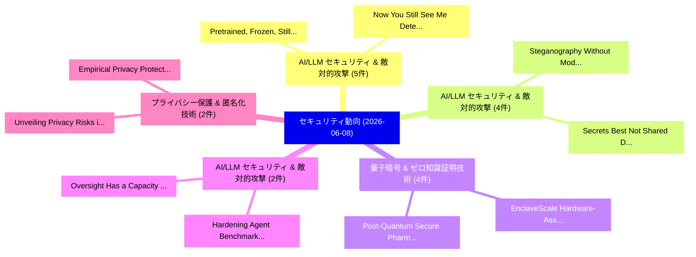

# 📅 02_daily: 日次エグゼクティブサマリー報告書 (2026-06-08)

**集計日時**: 2026-10-02 23:06:14 UTC  
**対象日付**: 2026-06-08  
**本日収集論文数**: 42 件  

---

## 💡 主要セキュリティ動向・脅威インサイト (Executive Insights)

本日の収集論文（計 42 件）において、以下の重点セキュリティ領域で活発な研究動向が確認されました：
- **AI/LLM セキュリティ & 敵対的攻撃** (5 件): 注目論文として 「Pretrained, Frozen, Still Leak...」、「Now You (Still) See Me: Detect...」 等が発表され、実務防御および攻撃検証の進展が見られます。
- **AI/LLM セキュリティ & 敵対的攻撃** (4 件): 注目論文として 「Steganography Without Modifica...」、「Secrets Best Not Shared: DNS P...」 等が発表され、実務防御および攻撃検証の進展が見られます。
- **量子暗号 & ゼロ知識証明技術** (4 件): 注目論文として 「EnclaveScale: Hardware-Assiste...」、「Post-Quantum Secure Pharmacovi...」 等が発表され、実務防御および攻撃検証の進展が見られます。
- **AI/LLM セキュリティ & 敵対的攻撃** (2 件): 注目論文として 「Oversight Has a Capacity: Cali...」、「Hardening Agent Benchmarks wit...」 等が発表され、実務防御および攻撃検証の進展が見られます。
- **プライバシー保護 & 匿名化技術** (2 件): 注目論文として 「Unveiling Privacy Risks in Mul...」、「Empirical Privacy Protection f...」 等が発表され、実務防御および攻撃検証の進展が見られます。

### 🗺️ 技術・脅威トピックマインドマップ

---

## 📌 日次セキュリティ論文一覧 (日本語表形式)

| No | arXiv ID | 論文タイトル (日本語訳) | 重要キーワード | 構造化エグゼクティブ要約 (背景・提案・影響) | 脅威分類 | 詳細リンク |
|---|---|---|---|---|---|---|
| 1 | `2606.08886v1` | [Block-A-Mole: The Sustainability Frontier of Moving-Target Censorship Resistance（セキュリティ分析論文）](../../okf/papers/2026-06-08/2606.08886.md) | `Target Censorship Resistance`, `Moving-Target Censorship`, `Anindya Maiti` | 【提案】概要 (Overview & Key Finding) 本論文「Block-A-Mole: The Sustainability Frontier of Moving-Tar...。実証評価により経営層・セキュリティ管理者向け推奨アクション (E... | `arXiv` | [arXiv](https://arxiv.org/abs/2606.08886v1) &#124; [OKF](../../okf/papers/2026-06-08/2606.08886.md) |
| 2 | `2606.08893v1` | [Cheap Reward Hacking Detection（セキュリティ分析論文）](../../okf/papers/2026-06-08/2606.08893.md) | `Cheap Reward Hacking Detection`, `Steven Johns`, `Raw Meta` | 【提案】概要 (Overview & Key Finding) 本論文「Cheap Reward Hacking Detection（セキュリティ分析論文）」（原題: Cheap R...。実証評価により経営層・セキュリティ管理者向け推奨アクション (E... | `arXiv` | [arXiv](https://arxiv.org/abs/2606.08893v1) &#124; [OKF](../../okf/papers/2026-06-08/2606.08893.md) |
| 3 | `2606.08919v1` | [Oversight Has a Capacity: Calibrating Agent Guards to a Subjective, Fatiguing Human（セキュリティ分析論文）](../../okf/papers/2026-06-08/2606.08919.md) | `Calibrating Agent Guards`, `Fatiguing Human`, `Emre Turan` | 【提案】概要 (Overview & Key Finding) 本論文「Oversight Has a Capacity: Calibrating Agent Guards to a...。実証評価により経営層・セキュリティ管理者向け推奨アクション (E... | `arXiv` | [arXiv](https://arxiv.org/abs/2606.08919v1) &#124; [OKF](../../okf/papers/2026-06-08/2606.08919.md) |
| 4 | `2606.08960v1` | [Hardening Agent Benchmarks with Adversarial Hacker-Fixer Loops（セキュリティ分析論文）](../../okf/papers/2026-06-08/2606.08960.md) | `Hardening Agent Benchmarks`, `Adversarial Hacker`, `Fixer Loops` | 【提案】概要 (Overview & Key Finding) 本論文「Hardening Agent Benchmarks with Adversarial Hacker-Fixe...。実証評価により経営層・セキュリティ管理者向け推奨アクション (E... | `arXiv` | [arXiv](https://arxiv.org/abs/2606.08960v1) &#124; [OKF](../../okf/papers/2026-06-08/2606.08960.md) |
| 5 | `2606.09005v1` | [Document-Authored Control-Signal Impersonation: A Low-Cost Indirect Prompt Attack on RAG Safety Boundaries（セキュリティ分析論文）](../../okf/papers/2026-06-08/2606.09005.md) | `Cost Indirect Prompt Attack`, `Authored Control`, `Signal Impersonation` | 【提案】概要 (Overview & Key Finding) 本論文「Document-Authored Control-Signal Impersonation: A Low-C...。実証評価により経営層・セキュリティ管理者向け推奨アクション (E... | `arXiv` | [arXiv](https://arxiv.org/abs/2606.09005v1) &#124; [OKF](../../okf/papers/2026-06-08/2606.09005.md) |
| 6 | `2606.09062v1` | [Security-First Approach to API Pipeline Development with Zero-Trust Architecture（セキュリティ分析論文）](../../okf/papers/2026-06-08/2606.09062.md) | `Pipeline Development`, `Trust Architecture`, `Zero-Trust Architecture` | 【提案】概要 (Overview & Key Finding) 本論文「Security-First Approach to API Pipeline Development wit...。実証評価により経営層・セキュリティ管理者向け推奨アクション (E... | `arXiv` | [arXiv](https://arxiv.org/abs/2606.09062v1) &#124; [OKF](../../okf/papers/2026-06-08/2606.09062.md) |
| 7 | `2606.09084v1` | [Context-Fractured Decomposition Attacks on Tool-Using LLMエージェント: Exploiting Artifact Provenance Gaps](../../okf/papers/2026-06-08/2606.09084.md) | `Fractured Decomposition Attacks`, `Exploiting Artifact Provenance Gaps`, `Context-Fractured Decomposition` | 【提案】概要 (Overview & Key Finding) 本論文「Context-Fractured Decomposition Attacks on Tool-Using L...。実証評価により経営層・セキュリティ管理者向け推奨アクション (E... | `arXiv` | [arXiv](https://arxiv.org/abs/2606.09084v1) &#124; [OKF](../../okf/papers/2026-06-08/2606.09084.md) |
| 8 | `2606.09125v1` | [Unveiling Privacy Risks in Multi-modal 大規模言語モデル: Task-specific Vulnerabilities and Mitigation Challenges](../../okf/papers/2026-06-08/2606.09125.md) | `Unveiling Privacy Risks`, `Mitigation Challenges`, `Task-specific Vulnerabilities` | 【提案】概要 (Overview & Key Finding) 本論文「Unveiling Privacy Risks in Multi-modal 大規模言語モデル: Task-s...。実証評価により経営層・セキュリティ管理者向け推奨アクション (E... | `arXiv` | [arXiv](https://arxiv.org/abs/2606.09125v1) &#124; [OKF](../../okf/papers/2026-06-08/2606.09125.md) |
| 9 | `2606.09135v1` | [Steganography Without Modification: Hidden Communication via LLM Seeds（セキュリティ分析論文）](../../okf/papers/2026-06-08/2606.09135.md) | `Steganography Without Modification`, `Hidden Communication`, `Jonas Sander` | 【提案】背景とセキュリティ上の課題 (Background & Problem) 本研究はサイバー脅威環境におけるセキュリティ構造・脆弱性の検証を目的としています。(主要検出項目: ...。実証評価により経営層・セキュリティ管理者向け推奨アクション (E... | `arXiv` | [arXiv](https://arxiv.org/abs/2606.09135v1) &#124; [OKF](../../okf/papers/2026-06-08/2606.09135.md) |
| 10 | `2606.09145v1` | [PrivCode++: Latent-Conditioned Differentially Private Code Generation for Comprehensive Guarantees（セキュリティ分析論文）](../../okf/papers/2026-06-08/2606.09145.md) | `Conditioned Differentially Private Code Generation`, `Comprehensive Guarantees`, `Latent-Conditioned Differentially` | 【提案】概要 (Overview & Key Finding) 本論文「PrivCode++: Latent-Conditioned Differentially Private C...。実証評価により経営層・セキュリティ管理者向け推奨アクション (E... | `arXiv` | [arXiv](https://arxiv.org/abs/2606.09145v1) &#124; [OKF](../../okf/papers/2026-06-08/2606.09145.md) |
| 11 | `2606.09151v1` | [Customization under Fire: Plugin Poisoning in Text-to-Image Ecosystem（セキュリティ分析論文）](../../okf/papers/2026-06-08/2606.09151.md) | `Plugin Poisoning`, `Image Ecosystem`, `Jiahao Chen` | 【提案】概要 (Overview & Key Finding) 本論文「Customization under Fire: Plugin Poisoning in Text-to-I...。実証評価により経営層・セキュリティ管理者向け推奨アクション (E... | `arXiv` | [arXiv](https://arxiv.org/abs/2606.09151v1) &#124; [OKF](../../okf/papers/2026-06-08/2606.09151.md) |
| 12 | `2606.09163v1` | [EnclaveScale: Hardware-Assisted Edge-DP for Secure Data Centre Power Telemetry（セキュリティ分析論文）](../../okf/papers/2026-06-08/2606.09163.md) | `Secure Data Centre Power Telemetry`, `Assisted Edge`, `Hardware-Assisted Edge` | 【提案】概要 (Overview & Key Finding) 本論文「EnclaveScale: Hardware-Assisted Edge-DP for Secure Data...。実証評価により経営層・セキュリティ管理者向け推奨アクション (E... | `arXiv` | [arXiv](https://arxiv.org/abs/2606.09163v1) &#124; [OKF](../../okf/papers/2026-06-08/2606.09163.md) |
| 13 | `2606.09189v1` | [Pretrained, Frozen, Still Leaking: Auditing Cross-Encoder Attribute Transfer in EEG Foundation Models（セキュリティ分析論文）](../../okf/papers/2026-06-08/2606.09189.md) | `Encoder Attribute Transfer`, `Still Leaking`, `Auditing Cross` | 【提案】概要 (Overview & Key Finding) 本論文「Pretrained, Frozen, Still Leaking: Auditing Cross-Encod...。実証評価により経営層・セキュリティ管理者向け推奨アクション (E... | `arXiv` | [arXiv](https://arxiv.org/abs/2606.09189v1) &#124; [OKF](../../okf/papers/2026-06-08/2606.09189.md) |
| 14 | `2606.09204v2` | [The Injection Paradox: Brand-Level Suppression in Safety-Trained LLM Recommendations via RAG Context Injection（セキュリティ分析論文）](../../okf/papers/2026-06-08/2606.09204.md) | `Level Suppression`, `Brand-Level Suppression`, `Safety-Trained LLM` | 【提案】概要 (Overview & Key Finding) 本論文「The Injection Paradox: Brand-Level Suppression in Safet...。実証評価により経営層・セキュリティ管理者向け推奨アクション (E... | `arXiv` | [arXiv](https://arxiv.org/abs/2606.09204v2) &#124; [OKF](../../okf/papers/2026-06-08/2606.09204.md) |
| 15 | `2606.09227v1` | [Trustworthy Smart Fabs via Professional Proxies: Scaling Safe and Sustainable by Design (SSbD) through Industrial Data Spaces（セキュリティ分析論文）](../../okf/papers/2026-06-08/2606.09227.md) | `Trustworthy Smart Fabs`, `Industrial Data Spaces`, `Professional Proxies` | 【提案】概要 (Overview & Key Finding) 本論文「Trustworthy Smart Fabs via Professional Proxies: Scalin...。実証評価により経営層・セキュリティ管理者向け推奨アクション (E... | `arXiv` | [arXiv](https://arxiv.org/abs/2606.09227v1) &#124; [OKF](../../okf/papers/2026-06-08/2606.09227.md) |
| 16 | `2606.09315v1` | [Brain-Prompt Injection: A Route-Safety Audit for BCI-LLMエージェント](../../okf/papers/2026-06-08/2606.09315.md) | `Prompt Injection`, `Safety Audit`, `Brain-Prompt Injection` | 【提案】概要 (Overview & Key Finding) 本論文「Brain-プロンプトインジェクション: A Route-Safety Audit for BCI-LLMエー...。実証評価により経営層・セキュリティ管理者向け推奨アクション (E... | `arXiv` | [arXiv](https://arxiv.org/abs/2606.09315v1) &#124; [OKF](../../okf/papers/2026-06-08/2606.09315.md) |
| 17 | `2606.09401v1` | [Empirical Privacy Protection for Adaptations of Large Language Modelsのベンチマーク評価](../../okf/papers/2026-06-08/2606.09401.md) | `Benchmarking Empirical Privacy Protection`, `Empirical Privacy Protection`, `Large Language` | 【提案】概要 (Overview & Key Finding) 本論文「Empirical Privacy Protection for Adaptations of Large L...。実証評価により経営層・セキュリティ管理者向け推奨アクション (E... | `arXiv` | [arXiv](https://arxiv.org/abs/2606.09401v1) &#124; [OKF](../../okf/papers/2026-06-08/2606.09401.md) |
| 18 | `2606.09402v1` | [Fully Oblivious Differential Privacy for Frequency Estimation in the Augmented Shuffle Model with Trusted Processors（セキュリティ分析論文）](../../okf/papers/2026-06-08/2606.09402.md) | `Fully Oblivious Differential Privacy`, `Augmented Shuffle Model`, `Frequency Estimation` | 【提案】概要 (Overview & Key Finding) 本論文「Fully Oblivious 差分プライバシー for Frequency Estimation in th...。実証評価により経営層・セキュリティ管理者向け推奨アクション (E... | `arXiv` | [arXiv](https://arxiv.org/abs/2606.09402v1) &#124; [OKF](../../okf/papers/2026-06-08/2606.09402.md) |
| 19 | `2606.09411v1` | [Now You (Still) See Me: Detecting Evasive Steganographic Payloads in LLMs（セキュリティ分析論文）](../../okf/papers/2026-06-08/2606.09411.md) | `Detecting Evasive Steganographic Payloads`, `Charles Westphal`, `Timothy Douglas` | 【提案】概要 (Overview & Key Finding) 本論文「Now You (Still) See Me: Detecting Evasive Steganographi...。実証評価により経営層・セキュリティ管理者向け推奨アクション (E... | `arXiv` | [arXiv](https://arxiv.org/abs/2606.09411v1) &#124; [OKF](../../okf/papers/2026-06-08/2606.09411.md) |
| 20 | `2606.09412v1` | [Post-Quantum Secure Pharmacovigilance with ML-KEM and ML-DSAに向けて](../../okf/papers/2026-06-08/2606.09412.md) | `Quantum Secure Pharmacovigilance`, `Post-Quantum Secure`, `Towards Post` | 【提案】概要 (Overview & Key Finding) 本論文「Post-量子 Secure Pharmacovigilance with ML-KEM and ML-DSA...。実証評価により経営層・セキュリティ管理者向け推奨アクション (E... | `arXiv` | [arXiv](https://arxiv.org/abs/2606.09412v1) &#124; [OKF](../../okf/papers/2026-06-08/2606.09412.md) |
| 21 | `2606.09469v1` | [Hardware-Aware QAOA for Honeypot Traffic Partitioning on 100+ Qubit IBM Quantum Processors（セキュリティ分析論文）](../../okf/papers/2026-06-08/2606.09469.md) | `Honeypot Traffic Partitioning`, `Hardware-Aware QAOA`, `Quantum Processors` | 【提案】概要 (Overview & Key Finding) 本論文「Hardware-Aware QAOA for Honeypot Traffic Partitioning o...。実証評価により経営層・セキュリティ管理者向け推奨アクション (E... | `arXiv` | [arXiv](https://arxiv.org/abs/2606.09469v1) &#124; [OKF](../../okf/papers/2026-06-08/2606.09469.md) |
| 22 | `2606.09499v1` | [Targeting World Models to Compromise Robot Learning Pipelines（セキュリティ分析論文）](../../okf/papers/2026-06-08/2606.09499.md) | `Compromise Robot Learning Pipelines`, `Targeting World Models`, `Ethan Rathbun` | 【提案】概要 (Overview & Key Finding) 本論文「Targeting World Models to Compromise Robot Learning Pip...。実証評価により経営層・セキュリティ管理者向け推奨アクション (E... | `arXiv` | [arXiv](https://arxiv.org/abs/2606.09499v1) &#124; [OKF](../../okf/papers/2026-06-08/2606.09499.md) |
| 23 | `2606.09548v1` | [Model Poisoning Against Federated Model Adaptation with Chain of Bit-Flips（セキュリティ分析論文）](../../okf/papers/2026-06-08/2606.09548.md) | `Bastien Vuillod`, `Kevin Hector`, `Alain Moellic` | 【提案】概要 (Overview & Key Finding) 本論文「モデル汚染 Against Federated Model Adaptation with Chain of ...。実証評価により経営層・セキュリティ管理者向け推奨アクション (E... | `arXiv` | [arXiv](https://arxiv.org/abs/2606.09548v1) &#124; [OKF](../../okf/papers/2026-06-08/2606.09548.md) |
| 24 | `2606.09549v1` | [SecureClaw: Clawing Back Control of LLMエージェント](../../okf/papers/2026-06-08/2606.09549.md) | `Clawing Back Control`, `Yuhan Ma`, `Stefan Schmid` | 【提案】概要 (Overview & Key Finding) 本論文「SecureClaw: Clawing Back Control of LLMエージェント」（原題: Secu...。実証評価により経営層・セキュリティ管理者向け推奨アクション (E... | `arXiv` | [arXiv](https://arxiv.org/abs/2606.09549v1) &#124; [OKF](../../okf/papers/2026-06-08/2606.09549.md) |
| 25 | `2606.09551v1` | [FuseFSS: Efficient Secure LLM Inference with Function Secret Sharing（セキュリティ分析論文）](../../okf/papers/2026-06-08/2606.09551.md) | `Function Secret Sharing`, `Efficient Secure`, `Yuhan Ma` | 【提案】概要 (Overview & Key Finding) 本論文「FuseFSS: Efficient Secure LLM Inference with Function S...。実証評価により経営層・セキュリティ管理者向け推奨アクション (E... | `arXiv` | [arXiv](https://arxiv.org/abs/2606.09551v1) &#124; [OKF](../../okf/papers/2026-06-08/2606.09551.md) |
| 26 | `2606.09559v1` | [Safe-RULE: Safe Reinforcement UnLEarning（セキュリティ分析論文）](../../okf/papers/2026-06-08/2606.09559.md) | `Safe Reinforcement`, `Shixiong Jiang`, `Taozheng Zhu` | 【提案】概要 (Overview & Key Finding) 本論文「Safe-RULE: Safe Reinforcement UnLEarning（セキュリティ分析論文）」（原...。実証評価により経営層・セキュリティ管理者向け推奨アクション (E... | `arXiv` | [arXiv](https://arxiv.org/abs/2606.09559v1) &#124; [OKF](../../okf/papers/2026-06-08/2606.09559.md) |
| 27 | `2606.09590v1` | [Clinically Grounded Privacy Evaluation of Medical LMs（セキュリティ分析論文）](../../okf/papers/2026-06-08/2606.09590.md) | `Jordan Li Cahoon`, `Sasha Ronaghi`, `Sana Tonekaboni` | 【提案】概要 (Overview & Key Finding) 本論文「Clinically Grounded Privacy Evaluation of Medical LMs（セ...。実証評価により経営層・セキュリティ管理者向け推奨アクション (E... | `arXiv` | [arXiv](https://arxiv.org/abs/2606.09590v1) &#124; [OKF](../../okf/papers/2026-06-08/2606.09590.md) |
| 28 | `2606.09593v1` | [Parent-Hash DAG: A Cost Constant-Time Append for On-Chain Registriesの分析](../../okf/papers/2026-06-08/2606.09593.md) | `Time Append`, `Parent-Hash DAG`, `Constant-Time Append` | 【提案】概要 (Overview & Key Finding) 本論文「Parent-Hash DAG: A Cost Constant-Time Append for On-Cha...。実証評価によりMoore, Fernando Paredes G... | `arXiv` | [arXiv](https://arxiv.org/abs/2606.09593v1) &#124; [OKF](../../okf/papers/2026-06-08/2606.09593.md) |
| 29 | `2606.09692v1` | [Observability for Delegated Execution in Agentic AI Systems（セキュリティ分析論文）](../../okf/papers/2026-06-08/2606.09692.md) | `Delegated Execution`, `Abhinav Mishra`, `Kumar Sharad` | 【提案】概要 (Overview & Key Finding) 本論文「Observability for Delegated Execution in Agentic AI Sys...。実証評価により経営層・セキュリティ管理者向け推奨アクション (E... | `arXiv` | [arXiv](https://arxiv.org/abs/2606.09692v1) &#124; [OKF](../../okf/papers/2026-06-08/2606.09692.md) |
| 30 | `2606.09700v2` | [What the Eyes See, the LLMs Miss: Exploiting Human Perception for Adversarial Text Attacks（セキュリティ分析論文）](../../okf/papers/2026-06-08/2606.09700.md) | `Exploiting Human Perception`, `Adversarial Text Attacks`, `Eyes See` | 【提案】概要 (Overview & Key Finding) 本論文「What the Eyes See, the LLMs Miss: Exploiting Human Perc...。実証評価により経営層・セキュリティ管理者向け推奨アクション (E... | `arXiv` | [arXiv](https://arxiv.org/abs/2606.09700v2) &#124; [OKF](../../okf/papers/2026-06-08/2606.09700.md) |
| 31 | `2606.09723v1` | [A Bell-State Extension of Loop-Back Quantum Key Distribution（セキュリティ分析論文）](../../okf/papers/2026-06-08/2606.09723.md) | `Back Quantum Key Distribution`, `State Extension`, `Bell-State Extension` | 【提案】概要 (Overview & Key Finding) 本論文「A Bell-State Extension of Loop-Back 量子鍵配送（セキュリティ分析論文）」（...。実証評価により経営層・セキュリティ管理者向け推奨アクション (E... | `arXiv` | [arXiv](https://arxiv.org/abs/2606.09723v1) &#124; [OKF](../../okf/papers/2026-06-08/2606.09723.md) |
| 32 | `2606.09754v1` | [Human-Centred Risk Mitigation for AI-Mediated Information Manipulation: A SOCMINT Framework Based on Information Manipulation Sets（セキュリティ分析論文）](../../okf/papers/2026-06-08/2606.09754.md) | `Centred Risk Mitigation`, `Mediated Information Manipulation`, `Information Manipulation Sets` | 【提案】概要 (Overview & Key Finding) 本論文「Human-Centred Risk Mitigation for AI-Mediated Informati...。実証評価により経営層・セキュリティ管理者向け推奨アクション (E... | `arXiv` | [arXiv](https://arxiv.org/abs/2606.09754v1) &#124; [OKF](../../okf/papers/2026-06-08/2606.09754.md) |
| 33 | `2606.10031v1` | [The Chronicles of Radio Frequency Fingerprinting（セキュリティ分析論文）](../../okf/papers/2026-06-08/2606.10031.md) | `Radio Frequency Fingerprinting`, `Abdul Aziz`, `Ingrid Huso` | 【提案】概要 (Overview & Key Finding) 本論文「The Chronicles of Radio Frequency Fingerprinting（セキュリティ...。実証評価により経営層・セキュリティ管理者向け推奨アクション (E... | `arXiv` | [arXiv](https://arxiv.org/abs/2606.10031v1) &#124; [OKF](../../okf/papers/2026-06-08/2606.10031.md) |
| 34 | `2606.10083v1` | [The Human Vulnerabilities & Exploits (HVE) Framework（セキュリティ分析論文）](../../okf/papers/2026-06-08/2606.10083.md) | `Avichai Ben`, `Tom Rahav`, `Daniel Illaev` | 【提案】概要 (Overview & Key Finding) 本論文「The Human Vulnerabilities & Exploits (HVE) Framework（セキ...。実証評価により経営層・セキュリティ管理者向け推奨アクション (E... | `arXiv` | [arXiv](https://arxiv.org/abs/2606.10083v1) &#124; [OKF](../../okf/papers/2026-06-08/2606.10083.md) |
| 35 | `2606.10091v1` | [SoK: Colluding Adversaries in Machine Learning Pipelines（セキュリティ分析論文）](../../okf/papers/2026-06-08/2606.10091.md) | `Machine Learning Pipelines`, `Colluding Adversaries`, `Vasisht Duddu` | 【提案】概要 (Overview & Key Finding) 本論文「SoK: Colluding Adversaries in Machine Learning Pipeline...。実証評価によりAsokan - **公開日時**: `2026-... | `arXiv` | [arXiv](https://arxiv.org/abs/2606.10091v1) &#124; [OKF](../../okf/papers/2026-06-08/2606.10091.md) |
| 36 | `2606.10097v1` | [Secrets Best Not Shared: DNS Privacy Enhancements for the Constrained IoT（セキュリティ分析論文）](../../okf/papers/2026-06-08/2606.10097.md) | `Privacy Enhancements`, `Raw Meta`, `Executive Summary` | 【提案】背景とセキュリティ上の課題 (Background & Problem) 本研究はサイバー脅威環境におけるセキュリティ構造・脆弱性の検証を目的としています。(主要検出項目: ...。実証評価によりLenders, Thomas C.。 | `arXiv` | [arXiv](https://arxiv.org/abs/2606.10097v1) &#124; [OKF](../../okf/papers/2026-06-08/2606.10097.md) |
| 37 | `2606.10148v1` | [RadKey: An LLM-Guided RF Backscatter System for Through-Wall Keystroke Inference（セキュリティ分析論文）](../../okf/papers/2026-06-08/2606.10148.md) | `Wall Keystroke Inference`, `Backscatter System`, `LLM-Guided RF` | 【提案】概要 (Overview & Key Finding) 本論文「RadKey: An LLM-Guided RF Backscatter System for Through...。実証評価により経営層・セキュリティ管理者向け推奨アクション (E... | `arXiv` | [arXiv](https://arxiv.org/abs/2606.10148v1) &#124; [OKF](../../okf/papers/2026-06-08/2606.10148.md) |
| 38 | `2606.10154v1` | [Quality Is Not a Safety Proxy Under Quantization（セキュリティ分析論文）](../../okf/papers/2026-06-08/2606.10154.md) | `Sahil Kadadekar`, `Raw Meta`, `Executive Summary` | 【提案】背景とセキュリティ上の課題 (Background & Problem) 本研究はサイバー脅威環境におけるセキュリティ構造・脆弱性の検証を目的としています。(主要検出項目: ...。実証評価により経営層・セキュリティ管理者向け推奨アクション (E... | `arXiv` | [arXiv](https://arxiv.org/abs/2606.10154v1) &#124; [OKF](../../okf/papers/2026-06-08/2606.10154.md) |
| 39 | `2606.10163v1` | [GRAFT: Graphlet-Triggered Backdoor Attack on GNN-Based Hardware Security Systems（セキュリティ分析論文）](../../okf/papers/2026-06-08/2606.10163.md) | `Based Hardware Security Systems`, `Triggered Backdoor Attack`, `Graphlet-Triggered Backdoor` | 【提案】概要 (Overview & Key Finding) 本論文「GRAFT: Graphlet-Triggered Backdoor Attack on GNN-Based ...。実証評価により経営層・セキュリティ管理者向け推奨アクション (E... | `arXiv` | [arXiv](https://arxiv.org/abs/2606.10163v1) &#124; [OKF](../../okf/papers/2026-06-08/2606.10163.md) |
| 40 | `2606.10172v1` | [Proof of Source of Funds: Efficient On-chain Provenance of Cryptoassets（セキュリティ分析論文）](../../okf/papers/2026-06-08/2606.10172.md) | `On-chain Provenance`, `Alireza Kavousi`, `Zhipeng Wang` | 【提案】概要 (Overview & Key Finding) 本論文「Proof of Source of Funds: Efficient On-chain Provenance...。実証評価により経営層・セキュリティ管理者向け推奨アクション (E... | `arXiv` | [arXiv](https://arxiv.org/abs/2606.10172v1) &#124; [OKF](../../okf/papers/2026-06-08/2606.10172.md) |
| 41 | `2606.10173v1` | [Local Is Not a Sufficient Privacy Boundary: Governing OS-Integrated On-Device AI（セキュリティ分析論文）](../../okf/papers/2026-06-08/2606.10173.md) | `Sufficient Privacy Boundary`, `Jonghyun Chung`, `Sanket Badhe` | 【提案】背景とセキュリティ上の課題 (Background & Problem) 本研究はサイバー脅威環境におけるセキュリティ構造・脆弱性の検証を目的としています。(主要検出項目: ...。実証評価により経営層・セキュリティ管理者向け推奨アクション (E... | `arXiv` | [arXiv](https://arxiv.org/abs/2606.10173v1) &#124; [OKF](../../okf/papers/2026-06-08/2606.10173.md) |
| 42 | `2606.10217v1` | [Alignment Defends LLMs from Property Inference Attacks（セキュリティ分析論文）](../../okf/papers/2026-06-08/2606.10217.md) | `Property Inference Attacks`, `Alignment Defends`, `Pengrun Huang` | 【提案】概要 (Overview & Key Finding) 本論文「Alignment Defends LLMs from Property Inference Attacks（...。実証評価により経営層・セキュリティ管理者向け推奨アクション (E... | `arXiv` | [arXiv](https://arxiv.org/abs/2606.10217v1) &#124; [OKF](../../okf/papers/2026-06-08/2606.10217.md) |

