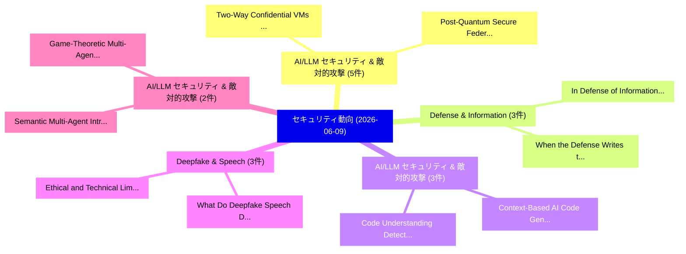

# 📅 02_daily: 日次エグゼクティブサマリー報告書 (2026-06-09)

**集計日時**: 2026-10-02 23:06:14 UTC  
**対象日付**: 2026-06-09  
**本日収集論文数**: 50 件  

---

## 💡 主要セキュリティ動向・脅威インサイト (Executive Insights)

本日の収集論文（計 50 件）において、以下の重点セキュリティ領域で活発な研究動向が確認されました：
- **AI/LLM セキュリティ & 敵対的攻撃** (5 件): 注目論文として 「Two-Way Confidential VMs (2cVM...」、「Post-Quantum Secure Federated ...」 等が発表され、実務防御および攻撃検証の進展が見られます。
- **Defense & Information** (3 件): 注目論文として 「In Defense of Information Leak...」、「When the Defense Writes the Re...」 等が発表され、実務防御および攻撃検証の進展が見られます。
- **AI/LLM セキュリティ & 敵対的攻撃** (3 件): 注目論文として 「Code Understanding: Detecting ...」、「Context-Based AI Code Generato...」 等が発表され、実務防御および攻撃検証の進展が見られます。
- **Deepfake & Speech** (3 件): 注目論文として 「Ethical and Technical Limits o...」、「What Do Deepfake Speech Detect...」 等が発表され、実務防御および攻撃検証の進展が見られます。
- **AI/LLM セキュリティ & 敵対的攻撃** (2 件): 注目論文として 「Game-Theoretic Multi-Agent Con...」、「Semantic Multi-Agent Intrusion...」 等が発表され、実務防御および攻撃検証の進展が見られます。

### 🗺️ 技術・脅威トピックマインドマップ

---

## 📌 日次セキュリティ論文一覧 (日本語表形式)

| No | arXiv ID | 論文タイトル (日本語訳) | 重要キーワード | 構造化エグゼクティブ要約 (背景・提案・影響) | 脅威分類 | 詳細リンク |
|---|---|---|---|---|---|---|
| 1 | `2606.10264v1` | [RECON: An LLM-Enhanced Backward Constraint Analysis Framework（セキュリティ分析論文）](../../okf/papers/2026-06-09/2606.10264.md) | `LLM-Enhanced Backward`, `Babangida Bappah`, `Lamine Noureddine` | 【提案】概要 (Overview & Key Finding) 本論文「RECON: An LLM-Enhanced Backward Constraint Analysis Fra...。実証評価により経営層・セキュリティ管理者向け推奨アクション (E... | `arXiv` | [arXiv](https://arxiv.org/abs/2606.10264v1) &#124; [OKF](../../okf/papers/2026-06-09/2606.10264.md) |
| 2 | `2606.10281v1` | [and Exploring the Capabilities of LLMs for Attack Investigationsのベンチマーク評価](../../okf/papers/2026-06-09/2606.10281.md) | `Attack Investigations`, `Aniket Anand`, `Yiwei Hou` | 【提案】概要 (Overview & Key Finding) 本論文「and Exploring the Capabilities of LLMs for Attack Inves...。実証評価により経営層・セキュリティ管理者向け推奨アクション (E... | `arXiv` | [arXiv](https://arxiv.org/abs/2606.10281v1) &#124; [OKF](../../okf/papers/2026-06-09/2606.10281.md) |
| 3 | `2606.10290v1` | [The Linux IOCTL Census: A Source-Derived Database of the Linux Kernel Control-Code Surface（セキュリティ分析論文）](../../okf/papers/2026-06-09/2606.10290.md) | `Linux Kernel Control`, `Derived Database`, `Code Surface` | 【提案】概要 (Overview & Key Finding) 本論文「The Linux IOCTL Census: A Source-Derived Database of th...。実証評価により経営層・セキュリティ管理者向け推奨アクション (E... | `arXiv` | [arXiv](https://arxiv.org/abs/2606.10290v1) &#124; [OKF](../../okf/papers/2026-06-09/2606.10290.md) |
| 4 | `2606.10322v2` | [Game-Theoretic Multi-Agent Control for Robust Contextual Reasoning in LLMs（セキュリティ分析論文）](../../okf/papers/2026-06-09/2606.10322.md) | `Robust Contextual Reasoning`, `Theoretic Multi`, `Agent Control` | 【提案】概要 (Overview & Key Finding) 本論文「Game-Theoretic Multi-Agent Control for Robust Contextua...。実証評価により経営層・セキュリティ管理者向け推奨アクション (E... | `arXiv` | [arXiv](https://arxiv.org/abs/2606.10322v2) &#124; [OKF](../../okf/papers/2026-06-09/2606.10322.md) |
| 5 | `2606.10323v1` | [Semantic Multi-Agent Intrusion Detection for IoT:Zero-Day and Adversarial Threats with Risk-Aware Reasoning（セキュリティ分析論文）](../../okf/papers/2026-06-09/2606.10323.md) | `Agent Intrusion Detection`, `Semantic Multi`, `Adversarial Threats` | 【提案】概要 (Overview & Key Finding) 本論文「Semantic Multi-Agent Intrusion Detection for IoT:Zero-D...。実証評価により経営層・セキュリティ管理者向け推奨アクション (E... | `arXiv` | [arXiv](https://arxiv.org/abs/2606.10323v1) &#124; [OKF](../../okf/papers/2026-06-09/2606.10323.md) |
| 6 | `2606.10333v1` | [Privacy-Preserving Credit Risk Prediction with Alternative Data（セキュリティ分析論文）](../../okf/papers/2026-06-09/2606.10333.md) | `Preserving Credit Risk Prediction`, `Alternative Data`, `Privacy-Preserving Credit` | 【提案】概要 (Overview & Key Finding) 本論文「Privacy-Preserving Credit Risk Prediction with Alternat...。実証評価により経営層・セキュリティ管理者向け推奨アクション (E... | `arXiv` | [arXiv](https://arxiv.org/abs/2606.10333v1) &#124; [OKF](../../okf/papers/2026-06-09/2606.10333.md) |
| 7 | `2606.10456v2` | [The Distributed Detectability Band Against Marginal-Preserving Attacks（セキュリティ分析論文）](../../okf/papers/2026-06-09/2606.10456.md) | `Preserving Attacks`, `Marginal-Preserving Attacks`, `Zhang Qinqin` | 【提案】概要 (Overview & Key Finding) 本論文「The Distributed Detectability Band Against Marginal-Pre...。実証評価により経営層・セキュリティ管理者向け推奨アクション (E... | `arXiv` | [arXiv](https://arxiv.org/abs/2606.10456v2) &#124; [OKF](../../okf/papers/2026-06-09/2606.10456.md) |
| 8 | `2606.10477v1` | [HE-DAP: Homomorphic Encryption-based Dynamic Adaptive Parameter Optimization for Statistical Computation（セキュリティ分析論文）](../../okf/papers/2026-06-09/2606.10477.md) | `Dynamic Adaptive Parameter Optimization`, `Homomorphic Encryption`, `Encryption-based Dynamic` | 【提案】概要 (Overview & Key Finding) 本論文「HE-DAP: 準同型暗号-based Dynamic Adaptive Parameter Optimiza...。実証評価により経営層・セキュリティ管理者向け推奨アクション (E... | `arXiv` | [arXiv](https://arxiv.org/abs/2606.10477v1) &#124; [OKF](../../okf/papers/2026-06-09/2606.10477.md) |
| 9 | `2606.10481v1` | [Advancing the State-of-the-Art in Empirical Privacy Auditing（セキュリティ分析論文）](../../okf/papers/2026-06-09/2606.10481.md) | `Empirical Privacy Auditing`, `Nicole Mitchell`, `Galen Andrew` | 【提案】背景とセキュリティ上の課題 (Background & Problem) 本研究はサイバー脅威環境におけるセキュリティ構造・脆弱性の検証を目的としています。(主要検出項目: ...。実証評価により経営層・セキュリティ管理者向け推奨アクション (E... | `arXiv` | [arXiv](https://arxiv.org/abs/2606.10481v1) &#124; [OKF](../../okf/papers/2026-06-09/2606.10481.md) |
| 10 | `2606.10484v1` | [AgentCanary: A Security Evaluation Framework for Autonomous AI Agents in Real Executable Environments（セキュリティ分析論文）](../../okf/papers/2026-06-09/2606.10484.md) | `Real Executable Environments`, `Peiyang Li`, `Songping Wang` | 【提案】概要 (Overview & Key Finding) 本論文「AgentCanary: A Security Evaluation Framework for Autono...。実証評価により経営層・セキュリティ管理者向け推奨アクション (E... | `arXiv` | [arXiv](https://arxiv.org/abs/2606.10484v1) &#124; [OKF](../../okf/papers/2026-06-09/2606.10484.md) |
| 11 | `2606.10502v1` | [When VR Meets BCI: (Un)Observable Brainwave-aware Privacy Reconstruction in the Metaverse via Unrestricted Inbuilt Motion Sensors（セキュリティ分析論文）](../../okf/papers/2026-06-09/2606.10502.md) | `Unrestricted Inbuilt Motion Sensors`, `Observable Brainwave`, `Privacy Reconstruction` | 【提案】概要 (Overview & Key Finding) 本論文「When VR Meets BCI: (Un)Observable Brainwave-aware Priva...。実証評価により経営層・セキュリティ管理者向け推奨アクション (E... | `arXiv` | [arXiv](https://arxiv.org/abs/2606.10502v1) &#124; [OKF](../../okf/papers/2026-06-09/2606.10502.md) |
| 12 | `2606.10508v2` | [A Deployment-Oriented Framework for Explainable AI-Assisted eBPF/XDP Mitigation at the IoT Edge（セキュリティ分析論文）](../../okf/papers/2026-06-09/2606.10508.md) | `AI-Assisted eBPF`, `Abdurrahman Tolay`, `Raw Meta` | 【提案】概要 (Overview & Key Finding) 本論文「A Deployment-Oriented Framework for Explainable AI-Assi...。実証評価により経営層・セキュリティ管理者向け推奨アクション (E... | `arXiv` | [arXiv](https://arxiv.org/abs/2606.10508v2) &#124; [OKF](../../okf/papers/2026-06-09/2606.10508.md) |
| 13 | `2606.10525v1` | [Assessing Automated Prompt Injection Attacks in Agentic Environments（セキュリティ分析論文）](../../okf/papers/2026-06-09/2606.10525.md) | `Assessing Automated Prompt Injection Attacks`, `Agentic Environments`, `David Hofer` | 【提案】概要 (Overview & Key Finding) 本論文「Assessing Automated プロンプトインジェクション Attacks in Agentic En...。実証評価により経営層・セキュリティ管理者向け推奨アクション (E... | `arXiv` | [arXiv](https://arxiv.org/abs/2606.10525v1) &#124; [OKF](../../okf/papers/2026-06-09/2606.10525.md) |
| 14 | `2606.10536v1` | [A Hybrid Edge-Cloud Architecture for Low-Latency Entitlement Verification in Resource-Constrained Devices（セキュリティ分析論文）](../../okf/papers/2026-06-09/2606.10536.md) | `Latency Entitlement Verification`, `Hybrid Edge`, `Cloud Architecture` | 【提案】概要 (Overview & Key Finding) 本論文「A Hybrid Edge-Cloud Architecture for Low-Latency Entitl...。実証評価により経営層・セキュリティ管理者向け推奨アクション (E... | `arXiv` | [arXiv](https://arxiv.org/abs/2606.10536v1) &#124; [OKF](../../okf/papers/2026-06-09/2606.10536.md) |
| 15 | `2606.10571v1` | [Improving Adversarial Transferability on Vision-Language Pre-training Models via Surrogate-Specific Bias Correction（セキュリティ分析論文）](../../okf/papers/2026-06-09/2606.10571.md) | `Improving Adversarial Transferability`, `Specific Bias Correction`, `Language Pre` | 【提案】概要 (Overview & Key Finding) 本論文「Improving Adversarial Transferability on Vision-Languag...。実証評価により経営層・セキュリティ管理者向け推奨アクション (E... | `arXiv` | [arXiv](https://arxiv.org/abs/2606.10571v1) &#124; [OKF](../../okf/papers/2026-06-09/2606.10571.md) |
| 16 | `2606.10595v1` | [From Data Heterogeneity to Convergence: A Data-Centric Review of 連合学習](../../okf/papers/2026-06-09/2606.10595.md) | `Centric Review`, `Data-Centric Review`, `Federated Learning` | 【提案】概要 (Overview & Key Finding) 本論文「From Data Heterogeneity to Convergence: A Data-Centric ...。実証評価により経営層・セキュリティ管理者向け推奨アクション (E... | `arXiv` | [arXiv](https://arxiv.org/abs/2606.10595v1) &#124; [OKF](../../okf/papers/2026-06-09/2606.10595.md) |
| 17 | `2606.10615v2` | [Two-Way Confidential VMs (2cVM): Collaborative Confidential Computing for Mutually Distrustful Parties（セキュリティ分析論文）](../../okf/papers/2026-06-09/2606.10615.md) | `Collaborative Confidential Computing`, `Mutually Distrustful Parties`, `Way Confidential` | 【提案】概要 (Overview & Key Finding) 本論文「Two-Way Confidential VMs (2cVM): Collaborative Confiden...。実証評価により経営層・セキュリティ管理者向け推奨アクション (E... | `arXiv` | [arXiv](https://arxiv.org/abs/2606.10615v2) &#124; [OKF](../../okf/papers/2026-06-09/2606.10615.md) |
| 18 | `2606.10625v1` | [snaproot: Decentralized File Integrity Verification Using Blockchain-Anchored Cryptographic Hashing（セキュリティ分析論文）](../../okf/papers/2026-06-09/2606.10625.md) | `Decentralized File Integrity Verification Using Blockchain`, `Anchored Cryptographic Hashing`, `Blockchain-Anchored Cryptographic` | 【提案】概要 (Overview & Key Finding) 本論文「snaproot: Decentralized File Integrity Verification Usi...。実証評価により経営層・セキュリティ管理者向け推奨アクション (E... | `arXiv` | [arXiv](https://arxiv.org/abs/2606.10625v1) &#124; [OKF](../../okf/papers/2026-06-09/2606.10625.md) |
| 19 | `2606.10631v1` | [From Transactions to Records: Reconceptualizing Blockchain Systems through a Lifecycle Lens（セキュリティ分析論文）](../../okf/papers/2026-06-09/2606.10631.md) | `Reconceptualizing Blockchain Systems`, `Lifecycle Lens`, `Tom Barbereau` | 【提案】概要 (Overview & Key Finding) 本論文「From Transactions to Records: Reconceptualizing Blockch...。実証評価により経営層・セキュリティ管理者向け推奨アクション (E... | `arXiv` | [arXiv](https://arxiv.org/abs/2606.10631v1) &#124; [OKF](../../okf/papers/2026-06-09/2606.10631.md) |
| 20 | `2606.10649v1` | [Layer Order Semantics for Automata-Based サイバーセキュリティ](../../okf/papers/2026-06-09/2606.10649.md) | `Layer Order Semantics`, `Based Cybersecurity`, `Automata-Based Cybersecurity` | 【提案】概要 (Overview & Key Finding) 本論文「Layer Order Semantics for Automata-Based サイバーセキュリティ」（原題...。実証評価により経営層・セキュリティ管理者向け推奨アクション (E... | `arXiv` | [arXiv](https://arxiv.org/abs/2606.10649v1) &#124; [OKF](../../okf/papers/2026-06-09/2606.10649.md) |
| 21 | `2606.10658v1` | [Post-Quantum Secure Federated DeFi for Inclusive Banking（セキュリティ分析論文）](../../okf/papers/2026-06-09/2606.10658.md) | `Quantum Secure Federated`, `Inclusive Banking`, `Post-Quantum Secure` | 【提案】概要 (Overview & Key Finding) 本論文「Post-量子 Secure Federated DeFi for Inclusive Banking（セキュ...。実証評価により経営層・セキュリティ管理者向け推奨アクション (E... | `arXiv` | [arXiv](https://arxiv.org/abs/2606.10658v1) &#124; [OKF](../../okf/papers/2026-06-09/2606.10658.md) |
| 22 | `2606.10669v1` | [In Defense of Information Leakage in Concept-based Models（セキュリティ分析論文）](../../okf/papers/2026-06-09/2606.10669.md) | `Information Leakage`, `Concept-based Models`, `Mateo Espinosa Zarlenga` | 【提案】概要 (Overview & Key Finding) 本論文「In Defense of Information Leakage in Concept-based Mode...。実証評価により経営層・セキュリティ管理者向け推奨アクション (E... | `arXiv` | [arXiv](https://arxiv.org/abs/2606.10669v1) &#124; [OKF](../../okf/papers/2026-06-09/2606.10669.md) |
| 23 | `2606.10692v1` | [Do LLMsMakeNeural Distinguishers Wise?（セキュリティ分析論文）](../../okf/papers/2026-06-09/2606.10692.md) | `Distinguishers Wise`, `Tatsuya Sakagami`, `Masashi Hisai` | 【提案】### (日本語題名: Do LLMsMakeNeural Distinguishers Wise?（セキュリティ分析論文）)  > [!NOTE] > **OKF Meta...。実証評価により経営層・セキュリティ管理者向け推奨アクション (E... | `arXiv` | [arXiv](https://arxiv.org/abs/2606.10692v1) &#124; [OKF](../../okf/papers/2026-06-09/2606.10692.md) |
| 24 | `2606.10724v1` | [Fingerprinting All AI Cluster I/O Without Mutually Trusted Processors（セキュリティ分析論文）](../../okf/papers/2026-06-09/2606.10724.md) | `Without Mutually Trusted Processors`, `Naci Cankaya`, `Jonathan Ng` | 【提案】背景とセキュリティ上の課題 (Background & Problem) 本研究はサイバー脅威環境におけるセキュリティ構造・脆弱性の検証を目的としています。(主要検出項目: ...。実証評価により経営層・セキュリティ管理者向け推奨アクション (E... | `arXiv` | [arXiv](https://arxiv.org/abs/2606.10724v1) &#124; [OKF](../../okf/papers/2026-06-09/2606.10724.md) |
| 25 | `2606.10742v1` | [MemVenom: Triggered Poisoning of Multimodal Memories in Web Agents（セキュリティ分析論文）](../../okf/papers/2026-06-09/2606.10742.md) | `Triggered Poisoning`, `Multimodal Memories`, `Web Agents` | 【提案】概要 (Overview & Key Finding) 本論文「MemVenom: Triggered Poisoning of Multimodal Memories in...。実証評価により経営層・セキュリティ管理者向け推奨アクション (E... | `arXiv` | [arXiv](https://arxiv.org/abs/2606.10742v1) &#124; [OKF](../../okf/papers/2026-06-09/2606.10742.md) |
| 26 | `2606.10749v1` | [Toward Secure LLMエージェント: Threat Surfaces, Attacks, Defenses, and Evaluation](../../okf/papers/2026-06-09/2606.10749.md) | `Toward Secure`, `Threat Surfaces`, `Yuchen Ling` | 【提案】概要 (Overview & Key Finding) 本論文「Toward Secure LLMエージェント: 脅威 Surfaces, Attacks, Defenses...。実証評価により経営層・セキュリティ管理者向け推奨アクション (E... | `arXiv` | [arXiv](https://arxiv.org/abs/2606.10749v1) &#124; [OKF](../../okf/papers/2026-06-09/2606.10749.md) |
| 27 | `2606.10780v1` | [Secure Aggregation with Top-K Sparsification in Decentralized 連合学習](../../okf/papers/2026-06-09/2606.10780.md) | `Secure Aggregation`, `Top-K Sparsification`, `Decentralized Federated Learning` | 【提案】概要 (Overview & Key Finding) 本論文「Secure Aggregation with Top-K Sparsification in Decentr...。実証評価により経営層・セキュリティ管理者向け推奨アクション (E... | `arXiv` | [arXiv](https://arxiv.org/abs/2606.10780v1) &#124; [OKF](../../okf/papers/2026-06-09/2606.10780.md) |
| 28 | `2606.10782v1` | [A Bayesian Network Approach for Enhancing Security-Focused Decision Support Systems（セキュリティ分析論文）](../../okf/papers/2026-06-09/2606.10782.md) | `Focused Decision Support Systems`, `Enhancing Security`, `Security-Focused Decision` | 【提案】概要 (Overview & Key Finding) 本論文「A Bayesian Network Approach for Enhancing Security-Focu...。実証評価により経営層・セキュリティ管理者向け推奨アクション (E... | `arXiv` | [arXiv](https://arxiv.org/abs/2606.10782v1) &#124; [OKF](../../okf/papers/2026-06-09/2606.10782.md) |
| 29 | `2606.10813v3` | [RedAct: Redacting Agent Capability Traces for Procedural Skill Protection（セキュリティ分析論文）](../../okf/papers/2026-06-09/2606.10813.md) | `Redacting Agent Capability Traces`, `Procedural Skill Protection`, `Shuwen Xu` | 【提案】概要 (Overview & Key Finding) 本論文「RedAct: Redacting Agent Capability Traces for Procedura...。実証評価により経営層・セキュリティ管理者向け推奨アクション (E... | `arXiv` | [arXiv](https://arxiv.org/abs/2606.10813v3) &#124; [OKF](../../okf/papers/2026-06-09/2606.10813.md) |
| 30 | `2606.10846v1` | [Code Understanding: Detecting Natural Backdoor Vulnerability in Code Language Modelsのセキュリティ強化](../../okf/papers/2026-06-09/2606.10846.md) | `Detecting Natural Backdoor Vulnerability`, `Securing Code Understanding`, `Code Language Models` | 【提案】概要 (Overview & Key Finding) 本論文「Code Understanding: Detecting Natural Backdoor 脆弱性 in C...。実証評価により経営層・セキュリティ管理者向け推奨アクション (E... | `arXiv` | [arXiv](https://arxiv.org/abs/2606.10846v1) &#124; [OKF](../../okf/papers/2026-06-09/2606.10846.md) |
| 31 | `2606.10860v1` | [Training LLMs to Enforce Multi-Level Instruction Hierarchies via Gravity-Weighted Direct Preference Optimization（セキュリティ分析論文）](../../okf/papers/2026-06-09/2606.10860.md) | `Level Instruction Hierarchies`, `Weighted Direct Preference Optimization`, `Enforce Multi` | 【提案】概要 (Overview & Key Finding) 本論文「Training LLMs to Enforce Multi-Level Instruction Hierar...。実証評価により経営層・セキュリティ管理者向け推奨アクション (E... | `arXiv` | [arXiv](https://arxiv.org/abs/2606.10860v1) &#124; [OKF](../../okf/papers/2026-06-09/2606.10860.md) |
| 32 | `2606.10904v4` | [When the Defense Writes the Refusal: Auditing Keyword-Scored Evaluation of Inference-Time Defenses for Multimodal 大規模言語モデル](../../okf/papers/2026-06-09/2606.10904.md) | `Defense Writes`, `Auditing Keyword`, `Time Defenses` | 【提案】概要 (Overview & Key Finding) 本論文「When the Defense Writes the Refusal: Auditing Keyword-S...。実証評価により経営層・セキュリティ管理者向け推奨アクション (E... | `arXiv` | [arXiv](https://arxiv.org/abs/2606.10904v4) &#124; [OKF](../../okf/papers/2026-06-09/2606.10904.md) |
| 33 | `2606.10908v1` | [RAT: Reference-Augmented Training for ASV Anti-Spoofing（セキュリティ分析論文）](../../okf/papers/2026-06-09/2606.10908.md) | `Augmented Training`, `Reference-Augmented Training`, `Anton Firc` | 【提案】概要 (Overview & Key Finding) 本論文「RAT: Reference-Augmented Training for ASV Anti-Spoofing...。実証評価により経営層・セキュリティ管理者向け推奨アクション (E... | `arXiv` | [arXiv](https://arxiv.org/abs/2606.10908v1) &#124; [OKF](../../okf/papers/2026-06-09/2606.10908.md) |
| 34 | `2606.10911v1` | [Ethical and Technical Limits of Deepfake Speech Datasets（セキュリティ分析論文）](../../okf/papers/2026-06-09/2606.10911.md) | `Deepfake Speech Datasets`, `Technical Limits`, `Kamil Malinka` | 【提案】概要 (Overview & Key Finding) 本論文「Ethical and Technical Limits of Deepfake Speech Dataset...。実証評価により経営層・セキュリティ管理者向け推奨アクション (E... | `arXiv` | [arXiv](https://arxiv.org/abs/2606.10911v1) &#124; [OKF](../../okf/papers/2026-06-09/2606.10911.md) |
| 35 | `2606.10912v1` | [What Do Deepfake Speech Detectors Actually Hear?（セキュリティ分析論文）](../../okf/papers/2026-06-09/2606.10912.md) | `Anton Firc`, `Kamil Malinka`, `Raw Meta` | 【提案】### (日本語題名: What Do Deepfake Speech Detectors Actually Hear?（セキュリティ分析論文）)  > [!NOTE] > ...。実証評価により経営層・セキュリティ管理者向け推奨アクション (E... | `arXiv` | [arXiv](https://arxiv.org/abs/2606.10912v1) &#124; [OKF](../../okf/papers/2026-06-09/2606.10912.md) |
| 36 | `2606.10945v1` | [Context-Based AI Code Generators: Vulnerability Analysis and Implicationsに対する敵対的攻撃](../../okf/papers/2026-06-09/2606.10945.md) | `Code Generators`, `Based Adversarial Attacks`, `Context-Based Adversarial` | 【提案】概要 (Overview & Key Finding) 本論文「Context-Based AI Code Generators: 脆弱性 Analysis and Impl...。実証評価により経営層・セキュリティ管理者向け推奨アクション (E... | `arXiv` | [arXiv](https://arxiv.org/abs/2606.10945v1) &#124; [OKF](../../okf/papers/2026-06-09/2606.10945.md) |
| 37 | `2606.11007v1` | [Understanding and mitigating the risks of OpenClaw for non-technical users: A practical guide with Skill（セキュリティ分析論文）](../../okf/papers/2026-06-09/2606.11007.md) | `non-technical users`, `Junchang Zheng`, `Junfeng Tan` | 【提案】概要 (Overview & Key Finding) 本論文「Understanding and mitigating the risks of OpenClaw for ...。実証評価により経営層・セキュリティ管理者向け推奨アクション (E... | `arXiv` | [arXiv](https://arxiv.org/abs/2606.11007v1) &#124; [OKF](../../okf/papers/2026-06-09/2606.11007.md) |
| 38 | `2606.11022v1` | [When Discovery Outpaces Remediation: Modeling AI-Accelerated Vulnerability Discovery in Interconnected Systems（セキュリティ分析論文）](../../okf/papers/2026-06-09/2606.11022.md) | `Accelerated Vulnerability Discovery`, `AI-Accelerated Vulnerability`, `Interconnected Systems` | 【提案】概要 (Overview & Key Finding) 本論文「When Discovery Outpaces Remediation: Modeling AI-Accele...。実証評価により経営層・セキュリティ管理者向け推奨アクション (E... | `arXiv` | [arXiv](https://arxiv.org/abs/2606.11022v1) &#124; [OKF](../../okf/papers/2026-06-09/2606.11022.md) |
| 39 | `2606.11098v2` | [Do Transformers Actually Help Intrusion Detection? A Temporal Sequence Evaluation on CIC-IDS2017（セキュリティ分析論文）](../../okf/papers/2026-06-09/2606.11098.md) | `Zach Moczkodan`, `Hany Ragab`, `Raw Meta` | 【提案】A Temporal Sequence Evaluation on CIC-IDS2017 ### (日本語題名: Do Transformers Actually Help...。実証評価により経営層・セキュリティ管理者向け推奨アクション (E... | `arXiv` | [arXiv](https://arxiv.org/abs/2606.11098v2) &#124; [OKF](../../okf/papers/2026-06-09/2606.11098.md) |
| 40 | `2606.11111v1` | [A Longitudinal Study of Recently Observed Malicious Domains: Characteristics, Infrastructure, and Abuse Patterns（セキュリティ分析論文）](../../okf/papers/2026-06-09/2606.11111.md) | `Recently Observed Malicious Domains`, `Abuse Patterns`, `Fathima Mashood` | 【提案】概要 (Overview & Key Finding) 本論文「A Longitudinal Study of Recently Observed Malicious Dom...。実証評価により経営層・セキュリティ管理者向け推奨アクション (E... | `arXiv` | [arXiv](https://arxiv.org/abs/2606.11111v1) &#124; [OKF](../../okf/papers/2026-06-09/2606.11111.md) |
| 41 | `2606.11145v1` | [OpenPCC: Open and Confidential LLM Serving on Commodity TEEs（セキュリティ分析論文）](../../okf/papers/2026-06-09/2606.11145.md) | `Haoling Zhou`, `Shixuan Zhao`, `Chao Wang` | 【提案】概要 (Overview & Key Finding) 本論文「OpenPCC: Open and Confidential LLM Serving on Commodity...。実証評価により経営層・セキュリティ管理者向け推奨アクション (E... | `arXiv` | [arXiv](https://arxiv.org/abs/2606.11145v1) &#124; [OKF](../../okf/papers/2026-06-09/2606.11145.md) |
| 42 | `2606.11175v1` | [Anchors that Don't Lift: Understanding Supply Chain Driven Kernel Lock-In and Governance-Mediated Mitigation Strategies in SOHO Devices（セキュリティ分析論文）](../../okf/papers/2026-06-09/2606.11175.md) | `Understanding Supply Chain Driven Kernel Lock`, `Mediated Mitigation Strategies`, `Governance-Mediated Mitigation` | 【提案】概要 (Overview & Key Finding) 本論文「Anchors that Don't Lift: Understanding Supply Chain Dri...。実証評価により経営層・セキュリティ管理者向け推奨アクション (E... | `arXiv` | [arXiv](https://arxiv.org/abs/2606.11175v1) &#124; [OKF](../../okf/papers/2026-06-09/2606.11175.md) |
| 43 | `2606.11265v1` | [When Poison Fails After Retrieval: Revisiting Corpus Poisoning under Chunking and Reranking Pipelines（セキュリティ分析論文）](../../okf/papers/2026-06-09/2606.11265.md) | `Revisiting Corpus Poisoning`, `Reranking Pipelines`, `Revisiting Corpus Poisoni` | 【提案】概要 (Overview & Key Finding) 本論文「When Poison Fails After Retrieval: Revisiting Corpus Po...。実証評価により経営層・セキュリティ管理者向け推奨アクション (E... | `arXiv` | [arXiv](https://arxiv.org/abs/2606.11265v1) &#124; [OKF](../../okf/papers/2026-06-09/2606.11265.md) |
| 44 | `2606.11267v1` | [A prior-free blind information leakage from model predictionsの検出](../../okf/papers/2026-06-09/2606.11267.md) | `prior-free blind`, `Raw Meta`, `Executive Summary` | 【提案】概要 (Overview & Key Finding) 本論文「A prior-free blind information leakage from model predi...。実証評価によりJacobs - **公開日時**: `2026-... | `arXiv` | [arXiv](https://arxiv.org/abs/2606.11267v1) &#124; [OKF](../../okf/papers/2026-06-09/2606.11267.md) |
| 45 | `2606.11409v1` | [Risk Under Pressure: Compute-Aware Evaluation of Adversarial Robustness in Language Models（セキュリティ分析論文）](../../okf/papers/2026-06-09/2606.11409.md) | `Adversarial Robustness`, `Language Models`, `Malikeh Ehghaghi` | 【提案】概要 (Overview & Key Finding) 本論文「Risk Under Pressure: Compute-Aware Evaluation of Advers...。実証評価により経営層・セキュリティ管理者向け推奨アクション (E... | `arXiv` | [arXiv](https://arxiv.org/abs/2606.11409v1) &#124; [OKF](../../okf/papers/2026-06-09/2606.11409.md) |
| 46 | `2606.11416v1` | [MPC-Patch-Bench: Security-Aware LLM Code Patch for Multi-Party Computation（セキュリティ分析論文）](../../okf/papers/2026-06-09/2606.11416.md) | `Code Patch`, `Party Computation`, `Security-Aware LLM` | 【提案】概要 (Overview & Key Finding) 本論文「MPC-Patch-Bench: Security-Aware LLM Code Patch for Mult...。実証評価により経営層・セキュリティ管理者向け推奨アクション (E... | `arXiv` | [arXiv](https://arxiv.org/abs/2606.11416v1) &#124; [OKF](../../okf/papers/2026-06-09/2606.11416.md) |
| 47 | `2606.11425v1` | [JailbreakOPT: Tool-Assisted Iterative Jailbreak Prompt Optimization（セキュリティ分析論文）](../../okf/papers/2026-06-09/2606.11425.md) | `Assisted Iterative Jailbreak Prompt Optimization`, `Tool-Assisted Iterative`, `Ge Shi` | 【提案】概要 (Overview & Key Finding) 本論文「ジェイルブレイクOPT: Tool-Assisted Iterative ジェイルブレイク Prompt Op...。実証評価により経営層・セキュリティ管理者向け推奨アクション (E... | `arXiv` | [arXiv](https://arxiv.org/abs/2606.11425v1) &#124; [OKF](../../okf/papers/2026-06-09/2606.11425.md) |
| 48 | `2606.11471v1` | [Evaluating and Combating the Impact of Concept Drift on the Performance of Machine Learning-Based Phishing Detection Systems（セキュリティ分析論文）](../../okf/papers/2026-06-09/2606.11471.md) | `Based Phishing Detection Systems`, `Concept Drift`, `Machine Learning` | 【提案】概要 (Overview & Key Finding) 本論文「Evaluating and Combating the Impact of Concept Drift on...。実証評価により経営層・セキュリティ管理者向け推奨アクション (E... | `arXiv` | [arXiv](https://arxiv.org/abs/2606.11471v1) &#124; [OKF](../../okf/papers/2026-06-09/2606.11471.md) |
| 49 | `2606.11505v1` | [On the Study of Biometric Spoofing Detection using Deep Learning（セキュリティ分析論文）](../../okf/papers/2026-06-09/2606.11505.md) | `Biometric Spoofing Detection`, `Deep Learning`, `Kumar Kartikey` | 【提案】概要 (Overview & Key Finding) 本論文「On the Study of Biometric Spoofing Detection using Deep...。実証評価により経営層・セキュリティ管理者向け推奨アクション (E... | `arXiv` | [arXiv](https://arxiv.org/abs/2606.11505v1) &#124; [OKF](../../okf/papers/2026-06-09/2606.11505.md) |
| 50 | `2606.12469v1` | [Influence Factors on RAG Poisoning（セキュリティ分析論文）](../../okf/papers/2026-06-09/2606.12469.md) | `Influence Factors`, `Pedro Pereira`, `Eva Maia` | 【提案】概要 (Overview & Key Finding) 本論文「Influence Factors on RAG Poisoning（セキュリティ分析論文）」（原題: Inf...。実証評価により経営層・セキュリティ管理者向け推奨アクション (E... | `arXiv` | [arXiv](https://arxiv.org/abs/2606.12469v1) &#124; [OKF](../../okf/papers/2026-06-09/2606.12469.md) |

