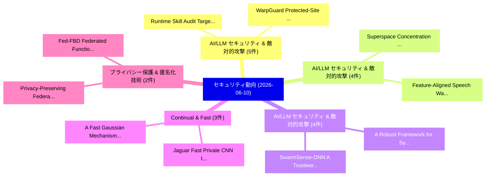

# 📅 02_daily: 日次エグゼクティブサマリー報告書 (2026-06-10)

**集計日時**: 2026-10-02 23:06:14 UTC  
**対象日付**: 2026-06-10  
**本日収集論文数**: 52 件  

---

## 💡 主要セキュリティ動向・脅威インサイト (Executive Insights)

本日の収集論文（計 52 件）において、以下の重点セキュリティ領域で活発な研究動向が確認されました：
- **AI/LLM セキュリティ & 敵対的攻撃** (5 件): 注目論文として 「Runtime Skill Audit: Targeted ...」、「WarpGuard: Protected-Site Cont...」 等が発表され、実務防御および攻撃検証の進展が見られます。
- **AI/LLM セキュリティ & 敵対的攻撃** (4 件): 注目論文として 「Superspace Concentration and A...」、「Feature-Aligned Speech Waterma...」 等が発表され、実務防御および攻撃検証の進展が見られます。
- **AI/LLM セキュリティ & 敵対的攻撃** (4 件): 注目論文として 「A Robust Framework for Sybil A...」、「SwarmSense-DNN: A Trustworthy ...」 等が発表され、実務防御および攻撃検証の進展が見られます。
- **Continual & Fast** (3 件): 注目論文として 「A Fast Gaussian Mechanism unde...」、「Jaguar: Fast Private CNN Infer...」 等が発表され、実務防御および攻撃検証の進展が見られます。
- **プライバシー保護 & 匿名化技術** (2 件): 注目論文として 「Privacy-Preserving Federated A...」、「Fed-FBD: Federated Functional ...」 等が発表され、実務防御および攻撃検証の進展が見られます。

### 🗺️ 技術・脅威トピックマインドマップ

---

## 📌 日次セキュリティ論文一覧 (日本語表形式)

| No | arXiv ID | 論文タイトル (日本語訳) | 重要キーワード | 構造化エグゼクティブ要約 (背景・提案・影響) | 脅威分類 | 詳細リンク |
|---|---|---|---|---|---|---|
| 1 | `2606.11532v1` | [Hiding the Trees in the Forest: Building Network Covert Channels with Hash-Based Covert Carrier Filtering（セキュリティ分析論文）](../../okf/papers/2026-06-10/2606.11532.md) | `Building Network Covert Channels`, `Based Covert Carrier Filtering`, `Hash-Based Covert` | 【提案】概要 (Overview & Key Finding) 本論文「Hiding the Trees in the Forest: Building Network Covert...。実証評価により経営層・セキュリティ管理者向け推奨アクション (E... | `arXiv` | [arXiv](https://arxiv.org/abs/2606.11532v1) &#124; [OKF](../../okf/papers/2026-06-10/2606.11532.md) |
| 2 | `2606.11536v1` | [VIPIR: A Versatile GPU Framework for Integrating Private Information Retrieval Protocols（セキュリティ分析論文）](../../okf/papers/2026-06-10/2606.11536.md) | `Integrating Private Information Retrieval Protocols`, `Jung Ho Ahn`, `Jongmin Kim` | 【提案】概要 (Overview & Key Finding) 本論文「VIPIR: A Versatile GPU Framework for Integrating Privat...。実証評価により経営層・セキュリティ管理者向け推奨アクション (E... | `arXiv` | [arXiv](https://arxiv.org/abs/2606.11536v1) &#124; [OKF](../../okf/papers/2026-06-10/2606.11536.md) |
| 3 | `2606.11539v1` | [PriME-Deal: Privacy-Preserving Bilateral Data Trading with Efficient Matchmaking and Auditable Fair Exchange on Blockchain（セキュリティ分析論文）](../../okf/papers/2026-06-10/2606.11539.md) | `Preserving Bilateral Data Trading`, `Auditable Fair Exchange`, `Efficient Matchmaking` | 【提案】概要 (Overview & Key Finding) 本論文「PriME-Deal: Privacy-Preserving Bilateral Data Trading w...。実証評価により経営層・セキュリティ管理者向け推奨アクション (E... | `arXiv` | [arXiv](https://arxiv.org/abs/2606.11539v1) &#124; [OKF](../../okf/papers/2026-06-10/2606.11539.md) |
| 4 | `2606.11541v1` | [WHET: Welding Homomorphic Encryption to Accelerator Architectures（セキュリティ分析論文）](../../okf/papers/2026-06-10/2606.11541.md) | `Welding Homomorphic Encryption`, `Accelerator Architectures`, `Jung Ho Ahn` | 【提案】概要 (Overview & Key Finding) 本論文「WHET: Welding 準同型暗号 to Accelerator Architectures（セキュリティ...。実証評価により経営層・セキュリティ管理者向け推奨アクション (E... | `arXiv` | [arXiv](https://arxiv.org/abs/2606.11541v1) &#124; [OKF](../../okf/papers/2026-06-10/2606.11541.md) |
| 5 | `2606.11556v1` | [Privacy-Preserving Federated Autoencoder for ECG Anomaly Detection on Edge Devices（セキュリティ分析論文）](../../okf/papers/2026-06-10/2606.11556.md) | `Preserving Federated Autoencoder`, `Anomaly Detection`, `Edge Devices` | 【提案】概要 (Overview & Key Finding) 本論文「Privacy-Preserving Federated Autoencoder for ECG Anomal...。実証評価により経営層・セキュリティ管理者向け推奨アクション (E... | `arXiv` | [arXiv](https://arxiv.org/abs/2606.11556v1) &#124; [OKF](../../okf/papers/2026-06-10/2606.11556.md) |
| 6 | `2606.11565v1` | [A Deterministic Forensic Preprocessing Framework for Heterogeneous Network Datasets: Formal Foundations, Implementation, and Empirical Validation（セキュリティ分析論文）](../../okf/papers/2026-06-10/2606.11565.md) | `Heterogeneous Network Datasets`, `Formal Foundations`, `Empirical Validation` | 【提案】概要 (Overview & Key Finding) 本論文「A Deterministic Forensic Preprocessing Framework for He...。実証評価により経営層・セキュリティ管理者向け推奨アクション (E... | `arXiv` | [arXiv](https://arxiv.org/abs/2606.11565v1) &#124; [OKF](../../okf/papers/2026-06-10/2606.11565.md) |
| 7 | `2606.11580v1` | [Superspace Concentration and Adversarial Robustness in Quantum Algorithms（セキュリティ分析論文）](../../okf/papers/2026-06-10/2606.11580.md) | `Superspace Concentration`, `Adversarial Robustness`, `Quantum Algorithms` | 【提案】概要 (Overview & Key Finding) 本論文「Superspace Concentration and Adversarial Robustness in ...。実証評価により経営層・セキュリティ管理者向け推奨アクション (E... | `arXiv` | [arXiv](https://arxiv.org/abs/2606.11580v1) &#124; [OKF](../../okf/papers/2026-06-10/2606.11580.md) |
| 8 | `2606.11592v1` | [Defense Against Prompt Inversion Attacks: An Information-Theoretic Approach for LLM Collaborative Inference（セキュリティ分析論文）](../../okf/papers/2026-06-10/2606.11592.md) | `Collaborative Inference`, `Sayedeh Leila Noorbakhsh`, `Hossein Khalili` | 【提案】概要 (Overview & Key Finding) 本論文「Defense Against Prompt Inversion Attacks: An Informatio...。実証評価により経営層・セキュリティ管理者向け推奨アクション (E... | `arXiv` | [arXiv](https://arxiv.org/abs/2606.11592v1) &#124; [OKF](../../okf/papers/2026-06-10/2606.11592.md) |
| 9 | `2606.11615v2` | [Adv-TGD: Adversarial Text-Guided Diffusion for Face Recognition Impersonation Attacks（セキュリティ分析論文）](../../okf/papers/2026-06-10/2606.11615.md) | `Face Recognition Impersonation Attacks`, `Adversarial Text`, `Guided Diffusion` | 【提案】概要 (Overview & Key Finding) 本論文「Adv-TGD: Adversarial Text-Guided Diffusion for Face Rec...。実証評価により経営層・セキュリティ管理者向け推奨アクション (E... | `arXiv` | [arXiv](https://arxiv.org/abs/2606.11615v2) &#124; [OKF](../../okf/papers/2026-06-10/2606.11615.md) |
| 10 | `2606.11632v1` | [Sovereign Assurance Boundary: Certificate-Bound Admission for Agentic Infrastructure（セキュリティ分析論文）](../../okf/papers/2026-06-10/2606.11632.md) | `Sovereign Assurance Boundary`, `Bound Admission`, `Agentic Infrastructure` | 【提案】概要 (Overview & Key Finding) 本論文「Sovereign Assurance Boundary: Certificate-Bound Admissi...。実証評価により経営層・セキュリティ管理者向け推奨アクション (E... | `arXiv` | [arXiv](https://arxiv.org/abs/2606.11632v1) &#124; [OKF](../../okf/papers/2026-06-10/2606.11632.md) |
| 11 | `2606.11648v1` | [Dummy Backdoor as a Defense: Removing Unknown Backdoors via Shared Internal Mechanisms for Generative LLMs（セキュリティ分析論文）](../../okf/papers/2026-06-10/2606.11648.md) | `Removing Unknown Backdoors`, `Shared Internal Mechanisms`, `Dummy Backdoor` | 【提案】概要 (Overview & Key Finding) 本論文「Dummy Backdoor as a Defense: Removing Unknown Backdoors...。実証評価により経営層・セキュリティ管理者向け推奨アクション (E... | `arXiv` | [arXiv](https://arxiv.org/abs/2606.11648v1) &#124; [OKF](../../okf/papers/2026-06-10/2606.11648.md) |
| 12 | `2606.11667v1` | [A Robust Framework for Sybil Attack Detection in Vehicular Ad Hoc Networks（セキュリティ分析論文）](../../okf/papers/2026-06-10/2606.11667.md) | `Vehicular Ad Hoc Networks`, `Sybil Attack Detection`, `Sadmin Tahmid Khan` | 【提案】概要 (Overview & Key Finding) 本論文「A Robust Framework for Sybil Attack Detection in Vehicu...。実証評価によりSaim Ahmmed U。 | `arXiv` | [arXiv](https://arxiv.org/abs/2606.11667v1) &#124; [OKF](../../okf/papers/2026-06-10/2606.11667.md) |
| 13 | `2606.11671v1` | [Runtime Skill Audit: Targeted Runtime Probing for Agent Skill Security（セキュリティ分析論文）](../../okf/papers/2026-06-10/2606.11671.md) | `Runtime Skill Audit`, `Targeted Runtime Probing`, `Agent Skill Security` | 【提案】概要 (Overview & Key Finding) 本論文「Runtime Skill Audit: Targeted Runtime Probing for Agent...。実証評価により経営層・セキュリティ管理者向け推奨アクション (E... | `arXiv` | [arXiv](https://arxiv.org/abs/2606.11671v1) &#124; [OKF](../../okf/papers/2026-06-10/2606.11671.md) |
| 14 | `2606.11672v1` | [Can Open-Source LLMエージェント Replace Static Application Security Testing Tools? An Empirical Assessment](../../okf/papers/2026-06-10/2606.11672.md) | `Can Open`, `Replace Static Application Security Testing Tools`, `Agents Replace Static Application Security Testing Tools` | 【提案】An Empirical Assessment ### (日本語題名: Can Open-Source LLMエージェント Replace Static Applicatio...。実証評価により経営層・セキュリティ管理者向け推奨アクション (E... | `arXiv` | [arXiv](https://arxiv.org/abs/2606.11672v1) &#124; [OKF](../../okf/papers/2026-06-10/2606.11672.md) |
| 15 | `2606.11698v1` | [T2S: A Rehearsal-Based Approach for Extraction-Resistant Model Watermarking（セキュリティ分析論文）](../../okf/papers/2026-06-10/2606.11698.md) | `Resistant Model Watermarking`, `Extraction-Resistant Model`, `Ping Mei` | 【提案】概要 (Overview & Key Finding) 本論文「T2S: A Rehearsal-Based Approach for Extraction-Resistan...。実証評価により経営層・セキュリティ管理者向け推奨アクション (E... | `arXiv` | [arXiv](https://arxiv.org/abs/2606.11698v1) &#124; [OKF](../../okf/papers/2026-06-10/2606.11698.md) |
| 16 | `2606.11729v1` | [A VPN-as-a-Service Tailored Enabler for Computing-constrained Environments（セキュリティ分析論文）](../../okf/papers/2026-06-10/2606.11729.md) | `Service Tailored Enabler`, `a-Service Tailored`, `Computing-constrained Environments` | 【提案】概要 (Overview & Key Finding) 本論文「A VPN-as-a-Service Tailored Enabler for Computing-const...。実証評価により経営層・セキュリティ管理者向け推奨アクション (E... | `arXiv` | [arXiv](https://arxiv.org/abs/2606.11729v1) &#124; [OKF](../../okf/papers/2026-06-10/2606.11729.md) |
| 17 | `2606.11736v1` | [MHOT: Height-Optimized Authenticated Data Structure for Blockchain State Commitment（セキュリティ分析論文）](../../okf/papers/2026-06-10/2606.11736.md) | `Optimized Authenticated Data Structure`, `Blockchain State Commitment`, `Height-Optimized Authenticated` | 【提案】概要 (Overview & Key Finding) 本論文「MHOT: Height-Optimized Authenticated Data Structure for...。実証評価により経営層・セキュリティ管理者向け推奨アクション (E... | `arXiv` | [arXiv](https://arxiv.org/abs/2606.11736v1) &#124; [OKF](../../okf/papers/2026-06-10/2606.11736.md) |
| 18 | `2606.11760v1` | [A Fast Gaussian Mechanism under Continual Observation, with Applications（セキュリティ分析論文）](../../okf/papers/2026-06-10/2606.11760.md) | `Fast Gaussian Mechanism`, `Continual Observation`, `Rasmus Pagh` | 【提案】概要 (Overview & Key Finding) 本論文「A Fast Gaussian Mechanism under Continual Observation, ...。実証評価により経営層・セキュリティ管理者向け推奨アクション (E... | `arXiv` | [arXiv](https://arxiv.org/abs/2606.11760v1) &#124; [OKF](../../okf/papers/2026-06-10/2606.11760.md) |
| 19 | `2606.11803v1` | [SwarmSense-DNN: A Trustworthy and Decentralized Neural Framework for Proactive Anomaly Defense in Consumer IoT（セキュリティ分析論文）](../../okf/papers/2026-06-10/2606.11803.md) | `Proactive Anomaly Defense`, `Zaffar Ahmed Shaikh`, `Lip Yee Por` | 【提案】概要 (Overview & Key Finding) 本論文「SwarmSense-DNN: A Trustworthy and Decentralized Neural ...。実証評価により経営層・セキュリティ管理者向け推奨アクション (E... | `arXiv` | [arXiv](https://arxiv.org/abs/2606.11803v1) &#124; [OKF](../../okf/papers/2026-06-10/2606.11803.md) |
| 20 | `2606.11804v1` | [Toward Trustworthy AI: Multi-Target Adversarial Attacks and Robust Defenses for Continuous Data Summarization（セキュリティ分析論文）](../../okf/papers/2026-06-10/2606.11804.md) | `Target Adversarial Attacks`, `Continuous Data Summarization`, `Toward Trustworthy` | 【提案】概要 (Overview & Key Finding) 本論文「Toward Trustworthy AI: Multi-Target 敵対的攻撃s and Robust D...。実証評価により経営層・セキュリティ管理者向け推奨アクション (E... | `arXiv` | [arXiv](https://arxiv.org/abs/2606.11804v1) &#124; [OKF](../../okf/papers/2026-06-10/2606.11804.md) |
| 21 | `2606.11817v1` | [Grammar-Constrained Decoding Can Jailbreak LLMs into Generating Malicious Code（セキュリティ分析論文）](../../okf/papers/2026-06-10/2606.11817.md) | `Constrained Decoding Can Jailbreak`, `Generating Malicious Code`, `Grammar-Constrained Decoding` | 【提案】概要 (Overview & Key Finding) 本論文「Grammar-Constrained Decoding Can ジェイルブレイク LLMs into Gen...。実証評価により経営層・セキュリティ管理者向け推奨アクション (E... | `arXiv` | [arXiv](https://arxiv.org/abs/2606.11817v1) &#124; [OKF](../../okf/papers/2026-06-10/2606.11817.md) |
| 22 | `2606.11827v1` | [Jaguar: Fast Private CNN Inference with Power-of-Two Homomorphic Arithmetic（セキュリティ分析論文）](../../okf/papers/2026-06-10/2606.11827.md) | `Two Homomorphic Arithmetic`, `Fast Private`, `Yewon Jeong` | 【提案】概要 (Overview & Key Finding) 本論文「Jaguar: Fast Private CNN Inference with Power-of-Two Ho...。実証評価により経営層・セキュリティ管理者向け推奨アクション (E... | `arXiv` | [arXiv](https://arxiv.org/abs/2606.11827v1) &#124; [OKF](../../okf/papers/2026-06-10/2606.11827.md) |
| 23 | `2606.11828v1` | [Feature-Aligned Speech Watermarking for Robustness to Reconstruction Distortions（セキュリティ分析論文）](../../okf/papers/2026-06-10/2606.11828.md) | `Aligned Speech Watermarking`, `Reconstruction Distortions`, `Feature-Aligned Speech` | 【提案】概要 (Overview & Key Finding) 本論文「Feature-Aligned Speech Watermarking for Robustness to R...。実証評価により経営層・セキュリティ管理者向け推奨アクション (E... | `arXiv` | [arXiv](https://arxiv.org/abs/2606.11828v1) &#124; [OKF](../../okf/papers/2026-06-10/2606.11828.md) |
| 24 | `2606.11839v2` | [Systematic Cybersecurity Risk European Rail Traffic Management Systemの分析](../../okf/papers/2026-06-10/2606.11839.md) | `Systematic Cybersecurity Risk European Rail Traffic Management`, `European Rail Traffic Management System`, `Kacper Darowski` | 【提案】概要 (Overview & Key Finding) 本論文「Systematic Cybersecurity Risk European Rail Traffic Man...。実証評価により経営層・セキュリティ管理者向け推奨アクション (E... | `arXiv` | [arXiv](https://arxiv.org/abs/2606.11839v2) &#124; [OKF](../../okf/papers/2026-06-10/2606.11839.md) |
| 25 | `2606.11871v1` | [WarpGuard: Protected-Site Control-Flow Integrity for CUDA SASS Binaries（セキュリティ分析論文）](../../okf/papers/2026-06-10/2606.11871.md) | `Site Control`, `Flow Integrity`, `Protected-Site Control` | 【提案】概要 (Overview & Key Finding) 本論文「WarpGuard: Protected-Site Control-Flow Integrity for CU...。実証評価により経営層・セキュリティ管理者向け推奨アクション (E... | `arXiv` | [arXiv](https://arxiv.org/abs/2606.11871v1) &#124; [OKF](../../okf/papers/2026-06-10/2606.11871.md) |
| 26 | `2606.11878v1` | [Gerrymandering the Warp: Non-Control-Data Attacks on CUDA Collective Decision（セキュリティ分析論文）](../../okf/papers/2026-06-10/2606.11878.md) | `Data Attacks`, `Collective Decision`, `Igor Santos` | 【提案】概要 (Overview & Key Finding) 本論文「Gerrymandering the Warp: Non-Control-Data Attacks on CU...。実証評価により経営層・セキュリティ管理者向け推奨アクション (E... | `arXiv` | [arXiv](https://arxiv.org/abs/2606.11878v1) &#124; [OKF](../../okf/papers/2026-06-10/2606.11878.md) |
| 27 | `2606.11884v2` | [Image Quality Assessment of Identity Cards Using Measures from Open Face Image Quality（セキュリティ分析論文）](../../okf/papers/2026-06-10/2606.11884.md) | `Identity Cards Using Measures`, `Open Face Image Quality`, `Image Quality Assessment` | 【提案】概要 (Overview & Key Finding) 本論文「Image Quality Assessment of Identity Cards Using Measur...。実証評価により経営層・セキュリティ管理者向け推奨アクション (E... | `arXiv` | [arXiv](https://arxiv.org/abs/2606.11884v2) &#124; [OKF](../../okf/papers/2026-06-10/2606.11884.md) |
| 28 | `2606.11949v4` | [Online Shift Detection and Conformal Adaptation for Deployed Safety Classifiers（セキュリティ分析論文）](../../okf/papers/2026-06-10/2606.11949.md) | `Online Shift Detection`, `Deployed Safety Classifiers`, `Conformal Adaptation` | 【提案】概要 (Overview & Key Finding) 本論文「Online Shift Detection and Conformal Adaptation for Dep...。実証評価により経営層・セキュリティ管理者向け推奨アクション (E... | `arXiv` | [arXiv](https://arxiv.org/abs/2606.11949v4) &#124; [OKF](../../okf/papers/2026-06-10/2606.11949.md) |
| 29 | `2606.11967v2` | [Quadratic APN Functions in Dimension 8 via Gröbner Basis Search in a Self-Equivalence Subspace（セキュリティ分析論文）](../../okf/papers/2026-06-10/2606.11967.md) | `Basis Search`, `Equivalence Subspace`, `Self-Equivalence Subspace` | 【提案】概要 (Overview & Key Finding) 本論文「Quadratic APN Functions in Dimension 8 via Gröbner Basi...。実証評価により経営層・セキュリティ管理者向け推奨アクション (E... | `arXiv` | [arXiv](https://arxiv.org/abs/2606.11967v2) &#124; [OKF](../../okf/papers/2026-06-10/2606.11967.md) |
| 30 | `2606.12011v1` | [InjectV: Modeling Fault Injection Attacks in RISC-V Simulation Environment（セキュリティ分析論文）](../../okf/papers/2026-06-10/2606.12011.md) | `Modeling Fault Injection Attacks`, `Simulation Environment`, `RISC-V Simulation` | 【提案】概要 (Overview & Key Finding) 本論文「InjectV: Modeling フォールト注入攻撃 Attacks in RISC-V Simulatio...。実証評価により経営層・セキュリティ管理者向け推奨アクション (E... | `arXiv` | [arXiv](https://arxiv.org/abs/2606.12011v1) &#124; [OKF](../../okf/papers/2026-06-10/2606.12011.md) |
| 31 | `2606.12064v1` | [Undefined Behavior in C and C++: An Experiment With Desktop Use Cases（セキュリティ分析論文）](../../okf/papers/2026-06-10/2606.12064.md) | `Undefined Behavior`, `Jukka Ruohonen`, `Krzysztof Sierszecki` | 【提案】概要 (Overview & Key Finding) 本論文「Undefined Behavior in C and C++: An Experiment With Des...。実証評価により経営層・セキュリティ管理者向け推奨アクション (E... | `arXiv` | [arXiv](https://arxiv.org/abs/2606.12064v1) &#124; [OKF](../../okf/papers/2026-06-10/2606.12064.md) |
| 32 | `2606.12075v1` | [Categorical Robustness Assessment for Machine Learning based Network Intrusion Detection Systems（セキュリティ分析論文）](../../okf/papers/2026-06-10/2606.12075.md) | `Network Intrusion Detection Systems`, `Categorical Robustness Assessment`, `Machine Learning` | 【提案】概要 (Overview & Key Finding) 本論文「Categorical Robustness Assessment for Machine Learning ...。実証評価により経営層・セキュリティ管理者向け推奨アクション (E... | `arXiv` | [arXiv](https://arxiv.org/abs/2606.12075v1) &#124; [OKF](../../okf/papers/2026-06-10/2606.12075.md) |
| 33 | `2606.12212v3` | [Mind your key: LLM API Credential Leakage in iOS Appsの実証研究](../../okf/papers/2026-06-10/2606.12212.md) | `Credential Leakage`, `Pinran Gao`, `Lingxiang Wang` | 【提案】概要 (Overview & Key Finding) 本論文「Mind your key: LLM API Credential Leakage in iOS Appsの実...。実証評価により経営層・セキュリティ管理者向け推奨アクション (E... | `arXiv` | [arXiv](https://arxiv.org/abs/2606.12212v3) &#124; [OKF](../../okf/papers/2026-06-10/2606.12212.md) |
| 34 | `2606.12225v1` | [Bridging the Smart City サイバーセキュリティ Data Gap Through AI-Driven Synthetic Dataset Generation](../../okf/papers/2026-06-10/2606.12225.md) | `Driven Synthetic Dataset Generation`, `AI-Driven Synthetic`, `Smart City` | 【提案】概要 (Overview & Key Finding) 本論文「Bridging the Smart City サイバーセキュリティ Data Gap Through AI-...。実証評価により経営層・セキュリティ管理者向け推奨アクション (E... | `arXiv` | [arXiv](https://arxiv.org/abs/2606.12225v1) &#124; [OKF](../../okf/papers/2026-06-10/2606.12225.md) |
| 35 | `2606.12251v1` | [Reinforcement Learning Disrupts Gradient-Based Adversarial Optimization（セキュリティ分析論文）](../../okf/papers/2026-06-10/2606.12251.md) | `Reinforcement Learning Disrupts Gradient`, `Based Adversarial Optimization`, `Gradient-Based Adversarial` | 【提案】概要 (Overview & Key Finding) 本論文「Reinforcement Learning Disrupts Gradient-Based Adversar...。実証評価により経営層・セキュリティ管理者向け推奨アクション (E... | `arXiv` | [arXiv](https://arxiv.org/abs/2606.12251v1) &#124; [OKF](../../okf/papers/2026-06-10/2606.12251.md) |
| 36 | `2606.12259v1` | [Partitioned Tags, Shared Data: Reconciling Strict Cache Isolation with Write-Shared Coherence（セキュリティ分析論文）](../../okf/papers/2026-06-10/2606.12259.md) | `Reconciling Strict Cache Isolation`, `Partitioned Tags`, `Shared Data` | 【提案】概要 (Overview & Key Finding) 本論文「Partitioned Tags, Shared Data: Reconciling Strict Cache...。実証評価により経営層・セキュリティ管理者向け推奨アクション (E... | `arXiv` | [arXiv](https://arxiv.org/abs/2606.12259v1) &#124; [OKF](../../okf/papers/2026-06-10/2606.12259.md) |
| 37 | `2606.12290v1` | [Selection Integrity for LLM Graph Memory: An Accumulability Criterion for Information-Flow-Blind Retrieval（セキュリティ分析論文）](../../okf/papers/2026-06-10/2606.12290.md) | `Selection Integrity`, `Graph Memory`, `Blind Retrieval` | 【提案】概要 (Overview & Key Finding) 本論文「Selection Integrity for LLM Graph Memory: An Accumulabi...。実証評価により経営層・セキュリティ管理者向け推奨アクション (E... | `arXiv` | [arXiv](https://arxiv.org/abs/2606.12290v1) &#124; [OKF](../../okf/papers/2026-06-10/2606.12290.md) |
| 38 | `2606.12320v1` | [A Five-Plane Reference Architecture for Runtime Governance of Production AI Agents（セキュリティ分析論文）](../../okf/papers/2026-06-10/2606.12320.md) | `Plane Reference Architecture`, `Runtime Governance`, `Five-Plane Reference` | 【提案】概要 (Overview & Key Finding) 本論文「A Five-Plane Reference Architecture for Runtime Governa...。実証評価により経営層・セキュリティ管理者向け推奨アクション (E... | `arXiv` | [arXiv](https://arxiv.org/abs/2606.12320v1) &#124; [OKF](../../okf/papers/2026-06-10/2606.12320.md) |
| 39 | `2606.12341v1` | [OCELOT: Inference-Leakage Budgets for Privacy-Preserving LLMエージェント](../../okf/papers/2026-06-10/2606.12341.md) | `Leakage Budgets`, `Inference-Leakage Budgets`, `Privacy-Preserving LLM` | 【提案】概要 (Overview & Key Finding) 本論文「OCELOT: Inference-Leakage Budgets for Privacy-Preservin...。実証評価により経営層・セキュリティ管理者向け推奨アクション (E... | `arXiv` | [arXiv](https://arxiv.org/abs/2606.12341v1) &#124; [OKF](../../okf/papers/2026-06-10/2606.12341.md) |
| 40 | `2606.12354v1` | [ECYSAP EYE: From Cyber Situational Awareness to Mission-Centric Decision Support for Enhanced Cyberspace Operations（セキュリティ分析論文）](../../okf/papers/2026-06-10/2606.12354.md) | `Centric Decision Support`, `Enhanced Cyberspace Operations`, `Mission-Centric Decision` | 【提案】概要 (Overview & Key Finding) 本論文「ECYSAP EYE: From Cyber Situational Awareness to Mission...。実証評価により経営層・セキュリティ管理者向け推奨アクション (E... | `arXiv` | [arXiv](https://arxiv.org/abs/2606.12354v1) &#124; [OKF](../../okf/papers/2026-06-10/2606.12354.md) |
| 41 | `2606.12395v1` | [MARCIM-WG: A cyber wargame proposal based on math modeling applied in a naval scenario（セキュリティ分析論文）](../../okf/papers/2026-06-10/2606.12395.md) | `Diego Cabuya`, `Carlos Castaneda`, `Raw Meta` | 【提案】概要 (Overview & Key Finding) 本論文「MARCIM-WG: A cyber wargame proposal based on math model...。実証評価により経営層・セキュリティ管理者向け推奨アクション (E... | `arXiv` | [arXiv](https://arxiv.org/abs/2606.12395v1) &#124; [OKF](../../okf/papers/2026-06-10/2606.12395.md) |
| 42 | `2606.12474v1` | [SAIGuard: Communication-State Simulation for Proactive Defense of LLM Multi-Agent Systems（セキュリティ分析論文）](../../okf/papers/2026-06-10/2606.12474.md) | `State Simulation`, `Proactive Defense`, `Agent Systems` | 【提案】概要 (Overview & Key Finding) 本論文「SAIGuard: Communication-State Simulation for Proactive ...。実証評価により経営層・セキュリティ管理者向け推奨アクション (E... | `arXiv` | [arXiv](https://arxiv.org/abs/2606.12474v1) &#124; [OKF](../../okf/papers/2026-06-10/2606.12474.md) |
| 43 | `2606.12498v1` | [From Parameters to Feature Space: Task Arithmetic for Backdoor Mitigation in Model Merging（セキュリティ分析論文）](../../okf/papers/2026-06-10/2606.12498.md) | `Feature Space`, `Task Arithmetic`, `Backdoor Mitigation` | 【提案】概要 (Overview & Key Finding) 本論文「From Parameters to Feature Space: Task Arithmetic for B...。実証評価により経営層・セキュリティ管理者向け推奨アクション (E... | `arXiv` | [arXiv](https://arxiv.org/abs/2606.12498v1) &#124; [OKF](../../okf/papers/2026-06-10/2606.12498.md) |
| 44 | `2606.12586v1` | [Beyond Attack Success Rate: Examining Trigger Leakage in Vision-Language Agentic Systems（セキュリティ分析論文）](../../okf/papers/2026-06-10/2606.12586.md) | `Beyond Attack Success Rate`, `Examining Trigger Leakage`, `Language Agentic Systems` | 【提案】概要 (Overview & Key Finding) 本論文「Beyond Attack Success Rate: Examining Trigger Leakage i...。実証評価により経営層・セキュリティ管理者向け推奨アクション (E... | `arXiv` | [arXiv](https://arxiv.org/abs/2606.12586v1) &#124; [OKF](../../okf/papers/2026-06-10/2606.12586.md) |
| 45 | `2606.12655v1` | [Amnesia: A Stealthy Replay Attack on Continual Learning Dreams（セキュリティ分析論文）](../../okf/papers/2026-06-10/2606.12655.md) | `Stealthy Replay Attack`, `Continual Learning Dreams`, `Naveen Kumar Kummari` | 【提案】概要 (Overview & Key Finding) 本論文「Amnesia: A Stealthy Replay Attack on Continual Learning...。実証評価により経営層・セキュリティ管理者向け推奨アクション (E... | `arXiv` | [arXiv](https://arxiv.org/abs/2606.12655v1) &#124; [OKF](../../okf/papers/2026-06-10/2606.12655.md) |
| 46 | `2606.12666v2` | [CAPED: Context-Aware Privacy Exposure Defense for Mobile GUI Agents（セキュリティ分析論文）](../../okf/papers/2026-06-10/2606.12666.md) | `Aware Privacy Exposure Defense`, `Context-Aware Privacy`, `Siyu Shen` | 【提案】概要 (Overview & Key Finding) 本論文「CAPED: Context-Aware Privacy Exposure Defense for Mobil...。実証評価により経営層・セキュリティ管理者向け推奨アクション (E... | `arXiv` | [arXiv](https://arxiv.org/abs/2606.12666v2) &#124; [OKF](../../okf/papers/2026-06-10/2606.12666.md) |
| 47 | `2606.12679v1` | [Fed-FBD: Federated Functional Block Diversification for Isolation, Privacy, and Surgical Unlearning（セキュリティ分析論文）](../../okf/papers/2026-06-10/2606.12679.md) | `Federated Functional Block Diversification`, `Surgical Unlearning`, `Weijie Chen` | 【提案】概要 (Overview & Key Finding) 本論文「Fed-FBD: Federated Functional Block Diversification for...。実証評価により経営層・セキュリティ管理者向け推奨アクション (E... | `arXiv` | [arXiv](https://arxiv.org/abs/2606.12679v1) &#124; [OKF](../../okf/papers/2026-06-10/2606.12679.md) |
| 48 | `2606.12703v1` | [SMSR: Certified Defence Against Runtime Memory Poisoning in Persistent LLM Agent Systems（セキュリティ分析論文）](../../okf/papers/2026-06-10/2606.12703.md) | `Agent Systems`, `Tarun Sharma`, `Raw Meta` | 【提案】概要 (Overview & Key Finding) 本論文「SMSR: Certified Defence Against Runtime Memory Poisonin...。実証評価により経営層・セキュリティ管理者向け推奨アクション (E... | `arXiv` | [arXiv](https://arxiv.org/abs/2606.12703v1) &#124; [OKF](../../okf/papers/2026-06-10/2606.12703.md) |
| 49 | `2606.12709v1` | [Smarter Saboteurs, Better Fixers: Scaling & Security in Linear Multi-Agent Workflows（セキュリティ分析論文）](../../okf/papers/2026-06-10/2606.12709.md) | `Smarter Saboteurs`, `Better Fixers`, `Linear Multi` | 【提案】概要 (Overview & Key Finding) 本論文「Smarter Saboteurs, Better Fixers: Scaling & Security in...。実証評価により経営層・セキュリティ管理者向け推奨アクション (E... | `arXiv` | [arXiv](https://arxiv.org/abs/2606.12709v1) &#124; [OKF](../../okf/papers/2026-06-10/2606.12709.md) |
| 50 | `2606.12737v1` | [PI-Hunter: Automated Red-Teaming for Exposing and Localizing Prompt Injections（セキュリティ分析論文）](../../okf/papers/2026-06-10/2606.12737.md) | `Localizing Prompt Injections`, `Automated Red`, `Lesly Miculicich` | 【提案】概要 (Overview & Key Finding) 本論文「PI-Hunter: Automated Red-Teaming for Exposing and Local...。実証評価により経営層・セキュリティ管理者向け推奨アクション (E... | `arXiv` | [arXiv](https://arxiv.org/abs/2606.12737v1) &#124; [OKF](../../okf/papers/2026-06-10/2606.12737.md) |
| 51 | `2606.14783v1` | [The Vision Encoder as a Privacy Boundary: Visual-Token Side Channels in Encoder-Free Vision-Language Models（セキュリティ分析論文）](../../okf/papers/2026-06-10/2606.14783.md) | `Token Side Channels`, `Privacy Boundary`, `Visual-Token Side` | 【提案】概要 (Overview & Key Finding) 本論文「The Vision Encoder as a Privacy Boundary: Visual-Token ...。実証評価により経営層・セキュリティ管理者向け推奨アクション (E... | `arXiv` | [arXiv](https://arxiv.org/abs/2606.14783v1) &#124; [OKF](../../okf/papers/2026-06-10/2606.14783.md) |
| 52 | `2606.14787v1` | [Vision-Encoder Behavioral Fingerprints of Image-to-Image Generative Models: A Training-Paradigm-Driven Taxonomy of Six Commercial APIs（セキュリティ分析論文）](../../okf/papers/2026-06-10/2606.14787.md) | `Encoder Behavioral Fingerprints`, `Image Generative Models`, `Driven Taxonomy` | 【提案】概要 (Overview & Key Finding) 本論文「Vision-Encoder Behavioral Fingerprints of Image-to-Imag...。実証評価により経営層・セキュリティ管理者向け推奨アクション (E... | `arXiv` | [arXiv](https://arxiv.org/abs/2606.14787v1) &#124; [OKF](../../okf/papers/2026-06-10/2606.14787.md) |

