# 📅 02_daily: 日次エグゼクティブサマリー報告書 (2026-06-11)

**集計日時**: 2026-10-02 23:06:14 UTC  
**対象日付**: 2026-06-11  
**本日収集論文数**: 31 件  

---

## 💡 主要セキュリティ動向・脅威インサイト (Executive Insights)

本日の収集論文（計 31 件）において、以下の重点セキュリティ領域で活発な研究動向が確認されました：
- **AI/LLM セキュリティ & 敵対的攻撃** (3 件): 注目論文として 「Beyond the IT Checklist: Engin...」、「Beyond Runtime Enforcement: Sh...」 等が発表され、実務防御および攻撃検証の進展が見られます。
- **ソフトウェア脆弱性 & Web3/DeFi** (2 件): 注目論文として 「ViPER: Vision-based Packing-Aw...」、「Efficient, Robust, and Anti-Co...」 等が発表され、実務防御および攻撃検証の進展が見られます。
- **Cryptographic & Assessment** (2 件): 注目論文として 「An Assessment Framework for Ap...」、「Intent-Based Cryptographic API...」 等が発表され、実務防御および攻撃検証の進展が見られます。
- **Detecting & Functional** (1 件): 注目論文として 「Detecting Functional Memorizat...」 等が発表され、実務防御および攻撃検証の進展が見られます。
- **Semantic & Identification** (1 件): 注目論文として 「Semantic Identification of IoT...」 等が発表され、実務防御および攻撃検証の進展が見られます。

### 🗺️ 技術・脅威トピックマインドマップ

```mermaid
mindmap
  root["セキュリティ動向 (2026-06-11)"]
    ["AI/LLM セキュリティ & 敵対的攻撃 (3件)"]
      ["Beyond the IT Checklist E..."]
      ["Beyond Runtime Enforcemen..."]
    ["ソフトウェア脆弱性 & Web3/DeFi (2件)"]
      ["ViPER Vision-based Packin..."]
      ["Efficient, Robust, and An..."]
    ["Cryptographic & Assessment (2件)"]
      ["An Assessment Framework f..."]
      ["Intent-Based Cryptographi..."]
    ["Detecting & Functional (1件)"]
      ["Detecting Functional Memo..."]
    ["Semantic & Identification (1件)"]
      ["Semantic Identification o..."]
```

---

## 📌 日次セキュリティ論文一覧 (日本語表形式)

| No | arXiv ID | 論文タイトル (日本語訳) | 重要キーワード | 構造化エグゼクティブ要約 (背景・提案・影響) | 脅威分類 | 詳細リンク |
|---|---|---|---|---|---|---|
| 1 | `2606.12764v1` | [Detecting Functional Memorization in Code Language Models（セキュリティ分析論文）](../../okf/papers/2026-06-11/2606.12764.md) | `Detecting Functional Memorization`, `Code Language Models`, `Matthieu Meeus` | 【提案】概要 (Overview & Key Finding) 本論文「Detecting Functional Memorization in Code Language Mode...。実証評価により経営層・セキュリティ管理者向け推奨アクション (E... | `arXiv` | [arXiv](https://arxiv.org/abs/2606.12764v1) &#124; [OKF](../../okf/papers/2026-06-11/2606.12764.md) |
| 2 | `2606.12793v1` | [Semantic Identification of IoT Devices from Behavioral Primitives（セキュリティ分析論文）](../../okf/papers/2026-06-11/2606.12793.md) | `Semantic Identification`, `Behavioral Primitives`, `Hassan Habibi Gharakheili` | 【提案】概要 (Overview & Key Finding) 本論文「Semantic Identification of IoT Devices from Behavioral ...。実証評価により経営層・セキュリティ管理者向け推奨アクション (E... | `arXiv` | [arXiv](https://arxiv.org/abs/2606.12793v1) &#124; [OKF](../../okf/papers/2026-06-11/2606.12793.md) |
| 3 | `2606.12845v1` | [A Privacy-Preserving Framework Using Remote Data Science for Inter-Institutional Student Retention Prediction（セキュリティ分析論文）](../../okf/papers/2026-06-11/2606.12845.md) | `Institutional Student Retention Prediction`, `Inter-Institutional Student`, `John Fields` | 【提案】概要 (Overview & Key Finding) 本論文「A Privacy-Preserving Framework Using Remote Data Scienc...。実証評価により経営層・セキュリティ管理者向け推奨アクション (E... | `arXiv` | [arXiv](https://arxiv.org/abs/2606.12845v1) &#124; [OKF](../../okf/papers/2026-06-11/2606.12845.md) |
| 4 | `2606.12887v1` | [LNTest: A Testbed for Evaluating Bitcoin Lightning Network-Based Botnets（セキュリティ分析論文）](../../okf/papers/2026-06-11/2606.12887.md) | `Evaluating Bitcoin Lightning Network`, `Based Botnets`, `Network-Based Botnets` | 【提案】概要 (Overview & Key Finding) 本論文「LNTest: A Testbed for Evaluating Bitcoin Lightning Netw...。実証評価により経営層・セキュリティ管理者向け推奨アクション (E... | `arXiv` | [arXiv](https://arxiv.org/abs/2606.12887v1) &#124; [OKF](../../okf/papers/2026-06-11/2606.12887.md) |
| 5 | `2606.12896v2` | [PolicyGuard: Test-time and Step-level Adversary (Backdoor) Defense for Reinforcement Learning Agentに向けて](../../okf/papers/2026-06-11/2606.12896.md) | `Step-level Adversary`, `Towards Test`, `Reinforcement Learning` | 【提案】概要 (Overview & Key Finding) 本論文「PolicyGuard: Test-time and Step-level Adversary (Backdo...。実証評価により経営層・セキュリティ管理者向け推奨アクション (E... | `arXiv` | [arXiv](https://arxiv.org/abs/2606.12896v2) &#124; [OKF](../../okf/papers/2026-06-11/2606.12896.md) |
| 6 | `2606.12918v2` | [MAStrike: Shapley-Guided Collusive Red-Teaming on Multi-Agent Systems（セキュリティ分析論文）](../../okf/papers/2026-06-11/2606.12918.md) | `Guided Collusive Red`, `Agent Systems`, `Shapley-Guided Collusive` | 【提案】概要 (Overview & Key Finding) 本論文「MAStrike: Shapley-Guided Collusive Red-Teaming on Multi...。実証評価により経営層・セキュリティ管理者向け推奨アクション (E... | `arXiv` | [arXiv](https://arxiv.org/abs/2606.12918v2) &#124; [OKF](../../okf/papers/2026-06-11/2606.12918.md) |
| 7 | `2606.12949v1` | [ViPER: Vision-based Packing-Aware Encoder for Robust マルウェア検出](../../okf/papers/2026-06-11/2606.12949.md) | `Aware Encoder`, `Vision-based Packing`, `Robust Malware Detection` | 【提案】概要 (Overview & Key Finding) 本論文「ViPER: Vision-based Packing-Aware Encoder for Robust マル...。実証評価により経営層・セキュリティ管理者向け推奨アクション (E... | `arXiv` | [arXiv](https://arxiv.org/abs/2606.12949v1) &#124; [OKF](../../okf/papers/2026-06-11/2606.12949.md) |
| 8 | `2606.12977v1` | [Efficient, Robust, and Anti-Collusion Fingerprinting of Image Diffusion Models（セキュリティ分析論文）](../../okf/papers/2026-06-11/2606.12977.md) | `Image Diffusion Models`, `Collusion Fingerprinting`, `Anti-Collusion Fingerprinting` | 【提案】概要 (Overview & Key Finding) 本論文「Efficient, Robust, and Anti-Collusion Fingerprinting of...。実証評価により経営層・セキュリティ管理者向け推奨アクション (E... | `arXiv` | [arXiv](https://arxiv.org/abs/2606.12977v1) &#124; [OKF](../../okf/papers/2026-06-11/2606.12977.md) |
| 9 | `2606.13000v1` | [SoK: The Constant Time Model（セキュリティ分析論文）](../../okf/papers/2026-06-11/2606.13000.md) | `Billy Bob Brumley`, `Raw Meta`, `Executive Summary` | 【提案】概要 (Overview & Key Finding) 本論文「SoK: The Constant Time Model（セキュリティ分析論文）」（原題: SoK: The ...。実証評価により経営層・セキュリティ管理者向け推奨アクション (E... | `arXiv` | [arXiv](https://arxiv.org/abs/2606.13000v1) &#124; [OKF](../../okf/papers/2026-06-11/2606.13000.md) |
| 10 | `2606.13037v1` | [DIG: Oracle-Guided Directed Input Generation for One-Day Vulnerabilities（セキュリティ分析論文）](../../okf/papers/2026-06-11/2606.13037.md) | `Guided Directed Input Generation`, `Day Vulnerabilities`, `Oracle-Guided Directed` | 【提案】概要 (Overview & Key Finding) 本論文「DIG: Oracle-Guided Directed Input Generation for One-Da...。実証評価により経営層・セキュリティ管理者向け推奨アクション (E... | `arXiv` | [arXiv](https://arxiv.org/abs/2606.13037v1) &#124; [OKF](../../okf/papers/2026-06-11/2606.13037.md) |
| 11 | `2606.13079v2` | [The Emergence of Autonomous Penetration Capabilities in Large Language Model-Powered AI Systems（セキュリティ分析論文）](../../okf/papers/2026-06-11/2606.13079.md) | `Autonomous Penetration Capabilities`, `Large Language Model`, `Model-Powered AI` | 【提案】概要 (Overview & Key Finding) 本論文「The Emergence of Autonomous Penetration Capabilities in...。実証評価により経営層・セキュリティ管理者向け推奨アクション (E... | `arXiv` | [arXiv](https://arxiv.org/abs/2606.13079v2) &#124; [OKF](../../okf/papers/2026-06-11/2606.13079.md) |
| 12 | `2606.13107v1` | [The Invisible Ink of the Android Malware World: A Longitudinal Study on the Usage of Covert Communication Channels（セキュリティ分析論文）](../../okf/papers/2026-06-11/2606.13107.md) | `Android Malware World`, `Covert Communication Channels`, `Zeya Umayya` | 【提案】概要 (Overview & Key Finding) 本論文「The Invisible Ink of the Android マルウェア World: A Longitu...。実証評価により経営層・セキュリティ管理者向け推奨アクション (E... | `arXiv` | [arXiv](https://arxiv.org/abs/2606.13107v1) &#124; [OKF](../../okf/papers/2026-06-11/2606.13107.md) |
| 13 | `2606.13272v1` | [Split Tallies: A Discrete Certificate Calculus for Auditing Dynamic Ordered Sets in Constant Memory（セキュリティ分析論文）](../../okf/papers/2026-06-11/2606.13272.md) | `Auditing Dynamic Ordered Sets`, `Discrete Certificate Calculus`, `Split Tallies` | 【提案】概要 (Overview & Key Finding) 本論文「Split Tallies: A Discrete Certificate Calculus for Audi...。実証評価により経営層・セキュリティ管理者向け推奨アクション (E... | `arXiv` | [arXiv](https://arxiv.org/abs/2606.13272v1) &#124; [OKF](../../okf/papers/2026-06-11/2606.13272.md) |
| 14 | `2606.13385v2` | [Who Pays the Price? Stakeholder-Centric Prompt Injection for Real-world Web Agentsのベンチマーク評価](../../okf/papers/2026-06-11/2606.13385.md) | `Stakeholder-Centric Prompt`, `Real-world Web`, `Centric Prompt Injection Benchmarking` | 【提案】Stakeholder-Centric プロンプトインジェクション Benchmarking for Real-world Web Agents ### (日本語題名: Wh...。実証評価により経営層・セキュリティ管理者向け推奨アクション (E... | `arXiv` | [arXiv](https://arxiv.org/abs/2606.13385v2) &#124; [OKF](../../okf/papers/2026-06-11/2606.13385.md) |
| 15 | `2606.13425v1` | [An Assessment Framework for Application-Level Cryptographic Agility（セキュリティ分析論文）](../../okf/papers/2026-06-11/2606.13425.md) | `Level Cryptographic Agility`, `Application-Level Cryptographic`, `Navaneeth Rameshan` | 【提案】概要 (Overview & Key Finding) 本論文「An Assessment Framework for Application-Level Cryptogra...。実証評価により経営層・セキュリティ管理者向け推奨アクション (E... | `arXiv` | [arXiv](https://arxiv.org/abs/2606.13425v1) &#124; [OKF](../../okf/papers/2026-06-11/2606.13425.md) |
| 16 | `2606.13445v1` | [Intent-Based Cryptographic API Design for Cryptographic Agility（セキュリティ分析論文）](../../okf/papers/2026-06-11/2606.13445.md) | `Based Cryptographic`, `Cryptographic Agility`, `Intent-Based Cryptographic` | 【提案】概要 (Overview & Key Finding) 本論文「Intent-Based Cryptographic API Design for Cryptographic...。実証評価により経営層・セキュリティ管理者向け推奨アクション (E... | `arXiv` | [arXiv](https://arxiv.org/abs/2606.13445v1) &#124; [OKF](../../okf/papers/2026-06-11/2606.13445.md) |
| 17 | `2606.13563v1` | [Differentially Private Hierarchical Heavy Hitters（セキュリティ分析論文）](../../okf/papers/2026-06-11/2606.13563.md) | `Differentially Private Hierarchical Heavy Hitters`, `Ari Biswas`, `Graham Cormode` | 【提案】概要 (Overview & Key Finding) 本論文「Differentially Private Hierarchical Heavy Hitters（セキュリテ...。実証評価により経営層・セキュリティ管理者向け推奨アクション (E... | `arXiv` | [arXiv](https://arxiv.org/abs/2606.13563v1) &#124; [OKF](../../okf/papers/2026-06-11/2606.13563.md) |
| 18 | `2606.13612v1` | [Beyond the IT Checklist: Engineering a Reasonable Standard of Care for Cyber Safety（セキュリティ分析論文）](../../okf/papers/2026-06-11/2606.13612.md) | `Reasonable Standard`, `Cyber Safety`, `Linton Wells` | 【提案】概要 (Overview & Key Finding) 本論文「Beyond the IT Checklist: Engineering a Reasonable Stand...。実証評価により経営層・セキュリティ管理者向け推奨アクション (E... | `arXiv` | [arXiv](https://arxiv.org/abs/2606.13612v1) &#124; [OKF](../../okf/papers/2026-06-11/2606.13612.md) |
| 19 | `2606.13621v1` | [Beyond Runtime Enforcement: Shield Synthesis as Defensibility Analysis for Adversarial Networks（セキュリティ分析論文）](../../okf/papers/2026-06-11/2606.13621.md) | `Beyond Runtime Enforcement`, `Shield Synthesis`, `Adversarial Networks` | 【提案】概要 (Overview & Key Finding) 本論文「Beyond Runtime Enforcement: Shield Synthesis as Defensi...。実証評価により経営層・セキュリティ管理者向け推奨アクション (E... | `arXiv` | [arXiv](https://arxiv.org/abs/2606.13621v1) &#124; [OKF](../../okf/papers/2026-06-11/2606.13621.md) |
| 20 | `2606.13725v1` | [A Modern Large-Scale Memory Characterization Laboratory（セキュリティ分析論文）](../../okf/papers/2026-06-11/2606.13725.md) | `Scale Memory Characterization Laboratory`, `Modern Large`, `Large-Scale Memory` | 【提案】概要 (Overview & Key Finding) 本論文「A Modern Large-Scale Memory Characterization Laboratory...。実証評価によりGiray Yaglikci, Onur Mutl... | `arXiv` | [arXiv](https://arxiv.org/abs/2606.13725v1) &#124; [OKF](../../okf/papers/2026-06-11/2606.13725.md) |
| 21 | `2606.13737v1` | [FreoStream:Enhancing Stream Guardrails via Future-Aware Reasoning and Safety-Aligned Optimization（セキュリティ分析論文）](../../okf/papers/2026-06-11/2606.13737.md) | `Enhancing Stream Guardrails`, `Aware Reasoning`, `Aligned Optimization` | 【提案】概要 (Overview & Key Finding) 本論文「FreoStream:Enhancing Stream Guardrails via Future-Aware...。実証評価により経営層・セキュリティ管理者向け推奨アクション (E... | `arXiv` | [arXiv](https://arxiv.org/abs/2606.13737v1) &#124; [OKF](../../okf/papers/2026-06-11/2606.13737.md) |
| 22 | `2606.13757v2` | [SEVRA-BENCH: Social Engineering of Vulnerabilities in Review Agents（セキュリティ分析論文）](../../okf/papers/2026-06-11/2606.13757.md) | `Social Engineering`, `Review Agents`, `Zhiwei Steven Wu` | 【提案】概要 (Overview & Key Finding) 本論文「SEVRA-BENCH: Social Engineering of Vulnerabilities in R...。実証評価により経営層・セキュリティ管理者向け推奨アクション (E... | `arXiv` | [arXiv](https://arxiv.org/abs/2606.13757v2) &#124; [OKF](../../okf/papers/2026-06-11/2606.13757.md) |
| 23 | `2606.13798v1` | [Smart Blockchain-Based Access Control for the Internet of Things（セキュリティ分析論文）](../../okf/papers/2026-06-11/2606.13798.md) | `Based Access Control`, `Smart Blockchain`, `Blockchain-Based Access` | 【提案】概要 (Overview & Key Finding) 本論文「Smart Blockchain-Based アクセス制御 for the Internet of Thing...。実証評価により経営層・セキュリティ管理者向け推奨アクション (E... | `arXiv` | [arXiv](https://arxiv.org/abs/2606.13798v1) &#124; [OKF](../../okf/papers/2026-06-11/2606.13798.md) |
| 24 | `2606.13832v1` | [Safety-Contract Graph Multi-Agent Reinforcement Learning for Autonomous Network Security Response（セキュリティ分析論文）](../../okf/papers/2026-06-11/2606.13832.md) | `Autonomous Network Security Response`, `Contract Graph Multi`, `Agent Reinforcement Learning` | 【提案】概要 (Overview & Key Finding) 本論文「Safety-Contract Graph Multi-Agent Reinforcement Learnin...。実証評価により経営層・セキュリティ管理者向け推奨アクション (E... | `arXiv` | [arXiv](https://arxiv.org/abs/2606.13832v1) &#124; [OKF](../../okf/papers/2026-06-11/2606.13832.md) |
| 25 | `2606.13860v1` | [Information Flow Paths from RTL Traces（セキュリティ分析論文）](../../okf/papers/2026-06-11/2606.13860.md) | `Information Flow Paths`, `Calvin Deutschbein`, `Owyn Wyatt` | 【提案】概要 (Overview & Key Finding) 本論文「Information Flow Paths from RTL Traces（セキュリティ分析論文）」（原題:...。実証評価により経営層・セキュリティ管理者向け推奨アクション (E... | `arXiv` | [arXiv](https://arxiv.org/abs/2606.13860v1) &#124; [OKF](../../okf/papers/2026-06-11/2606.13860.md) |
| 26 | `2606.13865v1` | [RTL-Arrow: Hardware-to-Cloud Bridge（セキュリティ分析論文）](../../okf/papers/2026-06-11/2606.13865.md) | `Cloud Bridge`, `Calvin Deutschbein`, `Jimmy Ostler` | 【提案】概要 (Overview & Key Finding) 本論文「RTL-Arrow: Hardware-to-Cloud Bridge（セキュリティ分析論文）」（原題: RT...。実証評価により経営層・セキュリティ管理者向け推奨アクション (E... | `arXiv` | [arXiv](https://arxiv.org/abs/2606.13865v1) &#124; [OKF](../../okf/papers/2026-06-11/2606.13865.md) |
| 27 | `2606.13892v1` | [Crypto x AI, AI x Crypto: A Survey（セキュリティ分析論文）](../../okf/papers/2026-06-11/2606.13892.md) | `Sarah Allen`, `Pranay Anchuri`, `James Austgen` | 【提案】概要 (Overview & Key Finding) 本論文「Crypto x AI, AI x Crypto: A Survey（セキュリティ分析論文）」（原題: Cry...。実証評価により経営層・セキュリティ管理者向け推奨アクション (E... | `arXiv` | [arXiv](https://arxiv.org/abs/2606.13892v1) &#124; [OKF](../../okf/papers/2026-06-11/2606.13892.md) |
| 28 | `2606.13918v1` | [Bayesian-Calibrated Hallucinated Package Imports in AI-Assisted Codeの検出](../../okf/papers/2026-06-11/2606.13918.md) | `Calibrated Hallucinated Package Imports`, `Hallucinated Package Imports`, `Calibrated Detection` | 【提案】概要 (Overview & Key Finding) 本論文「Bayesian-Calibrated Hallucinated Package Imports in AI-...。実証評価によりHillah, Jean-Marc Ri。 | `arXiv` | [arXiv](https://arxiv.org/abs/2606.13918v1) &#124; [OKF](../../okf/papers/2026-06-11/2606.13918.md) |
| 29 | `2606.13952v2` | [Side-Channel Attacks Survive Noise Cancellation in 3D Printers（セキュリティ分析論文）](../../okf/papers/2026-06-11/2606.13952.md) | `Channel Attacks Survive Noise Cancellation`, `Side-Channel Attacks`, `Eric Yocam` | 【提案】概要 (Overview & Key Finding) 本論文「サイドチャネル攻撃 Attacks Survive Noise Cancellation in 3D Prin...。実証評価により経営層・セキュリティ管理者向け推奨アクション (E... | `arXiv` | [arXiv](https://arxiv.org/abs/2606.13952v2) &#124; [OKF](../../okf/papers/2026-06-11/2606.13952.md) |
| 30 | `2606.13966v1` | [Software Dark Matter: Gazing at Uncharted Files to Navigate SBOM Integrations（セキュリティ分析論文）](../../okf/papers/2026-06-11/2606.13966.md) | `Software Dark Matter`, `Uncharted Files`, `Abhishek Reddypalle` | 【提案】概要 (Overview & Key Finding) 本論文「Software Dark Matter: Gazing at Uncharted Files to Navi...。実証評価により経営層・セキュリティ管理者向け推奨アクション (E... | `arXiv` | [arXiv](https://arxiv.org/abs/2606.13966v1) &#124; [OKF](../../okf/papers/2026-06-11/2606.13966.md) |
| 31 | `2606.13967v1` | [Choric Masking in Ambient Release Systems: A Finite Certificate Calculus for Trace Indistinguishability under Bounded Audiences（セキュリティ分析論文）](../../okf/papers/2026-06-11/2606.13967.md) | `Ambient Release Systems`, `Finite Certificate Calculus`, `Choric Masking` | 【提案】概要 (Overview & Key Finding) 本論文「Choric Masking in Ambient Release Systems: A Finite Cer...。実証評価により経営層・セキュリティ管理者向け推奨アクション (E... | `arXiv` | [arXiv](https://arxiv.org/abs/2606.13967v1) &#124; [OKF](../../okf/papers/2026-06-11/2606.13967.md) |

