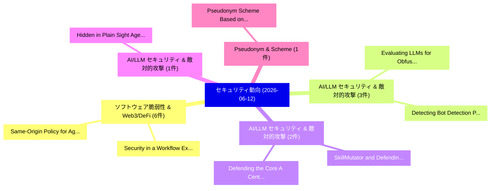

# 📅 02_daily: 日次エグゼクティブサマリー報告書 (2026-06-12)

**集計日時**: 2026-10-02 23:06:15 UTC  
**対象日付**: 2026-06-12  
**本日収集論文数**: 29 件  

---

## 💡 主要セキュリティ動向・脅威インサイト (Executive Insights)

本日の収集論文（計 29 件）において、以下の重点セキュリティ領域で活発な研究動向が確認されました：
- **ソフトウェア脆弱性 & Web3/DeFi** (6 件): 注目論文として 「Same-Origin Policy for Agentic...」、「Security in a Workflow: Explor...」 等が発表され、実務防御および攻撃検証の進展が見られます。
- **AI/LLM セキュリティ & 敵対的攻撃** (3 件): 注目論文として 「Evaluating LLMs for Obfuscatio...」、「Detecting Bot Detection: Preva...」 等が発表され、実務防御および攻撃検証の進展が見られます。
- **AI/LLM セキュリティ & 敵対的攻撃** (2 件): 注目論文として 「Defending the Core: A Centrali...」、「SkillMutator: and Defending La...」 等が発表され、実務防御および攻撃検証の進展が見られます。
- **AI/LLM セキュリティ & 敵対的攻撃** (1 件): 注目論文として 「Hidden in Plain Sight: Agent S...」 等が発表され、実務防御および攻撃検証の進展が見られます。
- **Pseudonym & Scheme** (1 件): 注目論文として 「Pseudonym Scheme Based on Hybr...」 等が発表され、実務防御および攻撃検証の進展が見られます。

### 🗺️ 技術・脅威トピックマインドマップ

---

## 📌 日次セキュリティ論文一覧 (日本語表形式)

| No | arXiv ID | 論文タイトル (日本語訳) | 重要キーワード | 構造化エグゼクティブ要約 (背景・提案・影響) | 脅威分類 | 詳細リンク |
|---|---|---|---|---|---|---|
| 1 | `2606.13994v1` | [Hidden in Plain Sight: Agent Safety Against Decomposition Attacks with DECOMPBENCHのベンチマーク評価](../../okf/papers/2026-06-12/2606.13994.md) | `Plain Sight`, `Vikhyath Kothamasu`, `Virginia Smith` | 【提案】概要 (Overview & Key Finding) 本論文「Hidden in Plain Sight: Agent Safety Against Decompositi...。実証評価により経営層・セキュリティ管理者向け推奨アクション (E... | `arXiv` | [arXiv](https://arxiv.org/abs/2606.13994v1) &#124; [OKF](../../okf/papers/2026-06-12/2606.13994.md) |
| 2 | `2606.14008v1` | [Pseudonym Scheme Based on Hybrid Certificates for Security Credential Management System in Vehicular Communications（セキュリティ分析論文）](../../okf/papers/2026-06-12/2606.14008.md) | `Security Credential Management System`, `Pseudonym Scheme Based`, `Hybrid Certificates` | 【提案】概要 (Overview & Key Finding) 本論文「Pseudonym Scheme Based on Hybrid Certificates for Secur...。実証評価により経営層・セキュリティ管理者向け推奨アクション (E... | `arXiv` | [arXiv](https://arxiv.org/abs/2606.14008v1) &#124; [OKF](../../okf/papers/2026-06-12/2606.14008.md) |
| 3 | `2606.14027v3` | [Same-Origin Policy for Agentic Browsers（セキュリティ分析論文）](../../okf/papers/2026-06-12/2606.14027.md) | `Origin Policy`, `Agentic Browsers`, `Same-Origin Policy` | 【提案】概要 (Overview & Key Finding) 本論文「Same-Origin Policy for Agentic Browsers（セキュリティ分析論文）」（原題...。実証評価により経営層・セキュリティ管理者向け推奨アクション (E... | `arXiv` | [arXiv](https://arxiv.org/abs/2606.14027v3) &#124; [OKF](../../okf/papers/2026-06-12/2606.14027.md) |
| 4 | `2606.14036v1` | [Defending the Core: A Centrality-Based Protection Strategy for Supply Chain Security in npm Dependency Network（セキュリティ分析論文）](../../okf/papers/2026-06-12/2606.14036.md) | `Based Protection Strategy`, `Supply Chain Security`, `Centrality-Based Protection` | 【提案】概要 (Overview & Key Finding) 本論文「Defending the Core: A Centrality-Based Protection Strat...。実証評価により経営層・セキュリティ管理者向け推奨アクション (E... | `arXiv` | [arXiv](https://arxiv.org/abs/2606.14036v1) &#124; [OKF](../../okf/papers/2026-06-12/2606.14036.md) |
| 5 | `2606.14090v1` | [Hierarchical Identity-Based Signature with Designated Aggregator from Lattices（セキュリティ分析論文）](../../okf/papers/2026-06-12/2606.14090.md) | `Hierarchical Identity`, `Based Signature`, `Designated Aggregator` | 【提案】概要 (Overview & Key Finding) 本論文「Hierarchical Identity-Based Signature with Designated A...。実証評価により経営層・セキュリティ管理者向け推奨アクション (E... | `arXiv` | [arXiv](https://arxiv.org/abs/2606.14090v1) &#124; [OKF](../../okf/papers/2026-06-12/2606.14090.md) |
| 6 | `2606.14154v1` | [SkillMutator: and Defending Language-and-Code Cross-modal Attacks on LLM Agent Skillsのベンチマーク評価](../../okf/papers/2026-06-12/2606.14154.md) | `Defending Language`, `Code Cross`, `Cross-modal Attacks` | 【提案】概要 (Overview & Key Finding) 本論文「SkillMutator: and Defending Language-and-Code Cross-mod...。実証評価により経営層・セキュリティ管理者向け推奨アクション (E... | `arXiv` | [arXiv](https://arxiv.org/abs/2606.14154v1) &#124; [OKF](../../okf/papers/2026-06-12/2606.14154.md) |
| 7 | `2606.14164v1` | [Investigating Metamorphic Fuzz Oracle Enhancement via 大規模言語モデル](../../okf/papers/2026-06-12/2606.14164.md) | `Investigating Metamorphic Fuzz Oracle Enhancement`, `Large Language Models`, `Ruixiang Qian` | 【提案】概要 (Overview & Key Finding) 本論文「Investigating Metamorphic Fuzz Oracle Enhancement via 大...。実証評価により経営層・セキュリティ管理者向け推奨アクション (E... | `arXiv` | [arXiv](https://arxiv.org/abs/2606.14164v1) &#124; [OKF](../../okf/papers/2026-06-12/2606.14164.md) |
| 8 | `2606.14165v1` | [Security Evaluation of Mobile Banking Applications in Sudan（セキュリティ分析論文）](../../okf/papers/2026-06-12/2606.14165.md) | `Mobile Banking Applications`, `Abdelmonim Naway`, `Raw Meta` | 【提案】概要 (Overview & Key Finding) 本論文「Security Evaluation of Mobile Banking Applications in S...。実証評価により経営層・セキュリティ管理者向け推奨アクション (E... | `arXiv` | [arXiv](https://arxiv.org/abs/2606.14165v1) &#124; [OKF](../../okf/papers/2026-06-12/2606.14165.md) |
| 9 | `2606.14210v1` | [From Prompts to Responses: Dual-Sided Data Leakage and Defense in Split 大規模言語モデル](../../okf/papers/2026-06-12/2606.14210.md) | `Sided Data Leakage`, `Dual-Sided Data`, `Split Large Language Models` | 【提案】概要 (Overview & Key Finding) 本論文「From Prompts to Responses: Dual-Sided Data Leakage and ...。実証評価により経営層・セキュリティ管理者向け推奨アクション (E... | `arXiv` | [arXiv](https://arxiv.org/abs/2606.14210v1) &#124; [OKF](../../okf/papers/2026-06-12/2606.14210.md) |
| 10 | `2606.14233v1` | [Evaluating LLMs for Obfuscation Detection and Classification in Android Apps（セキュリティ分析論文）](../../okf/papers/2026-06-12/2606.14233.md) | `Obfuscation Detection`, `Android Apps`, `Luca Ferrari` | 【提案】概要 (Overview & Key Finding) 本論文「Evaluating LLMs for Obfuscation Detection and Classific...。実証評価により経営層・セキュリティ管理者向け推奨アクション (E... | `arXiv` | [arXiv](https://arxiv.org/abs/2606.14233v1) &#124; [OKF](../../okf/papers/2026-06-12/2606.14233.md) |
| 11 | `2606.14261v1` | [Security in a Workflow: Exploring Role-Based Agentic Architectures for Vulnerability Handling（セキュリティ分析論文）](../../okf/papers/2026-06-12/2606.14261.md) | `Based Agentic Architectures`, `Exploring Role`, `Role-Based Agentic` | 【提案】概要 (Overview & Key Finding) 本論文「Security in a Workflow: Exploring Role-Based Agentic Ar...。実証評価により経営層・セキュリティ管理者向け推奨アクション (E... | `arXiv` | [arXiv](https://arxiv.org/abs/2606.14261v1) &#124; [OKF](../../okf/papers/2026-06-12/2606.14261.md) |
| 12 | `2606.14295v2` | [AgentCyberRange: Frontier AI Systems in Realistic Cyber Rangesのベンチマーク評価](../../okf/papers/2026-06-12/2606.14295.md) | `Realistic Cyber`, `Realistic Cyber Ranges`, `Benchmarking Frontier` | 【提案】概要 (Overview & Key Finding) 本論文「AgentCyberRange: Frontier AI Systems in Realistic Cyber...。実証評価により経営層・セキュリティ管理者向け推奨アクション (E... | `arXiv` | [arXiv](https://arxiv.org/abs/2606.14295v2) &#124; [OKF](../../okf/papers/2026-06-12/2606.14295.md) |
| 13 | `2606.14395v1` | [REPOSE: Quantifying the Price of Security in Weakly-Hard Real-Time Cyber-Physical Systems（セキュリティ分析論文）](../../okf/papers/2026-06-12/2606.14395.md) | `Hard Real`, `Time Cyber`, `Physical Systems` | 【提案】概要 (Overview & Key Finding) 本論文「REPOSE: Quantifying the Price of Security in Weakly-Har...。実証評価により経営層・セキュリティ管理者向け推奨アクション (E... | `arXiv` | [arXiv](https://arxiv.org/abs/2606.14395v1) &#124; [OKF](../../okf/papers/2026-06-12/2606.14395.md) |
| 14 | `2606.14427v1` | [Breaking TinyML: Why Quantized Neural Networks Need Domain-Specific Security Analysis（セキュリティ分析論文）](../../okf/papers/2026-06-12/2606.14427.md) | `Domain-Specific Security`, `Andrea Mattia Garavagno`, `Vijay Janapa Reddi` | 【提案】概要 (Overview & Key Finding) 本論文「Breaking TinyML: Why Quantized Neural Networks Need Dom...。実証評価により経営層・セキュリティ管理者向け推奨アクション (E... | `arXiv` | [arXiv](https://arxiv.org/abs/2606.14427v1) &#124; [OKF](../../okf/papers/2026-06-12/2606.14427.md) |
| 15 | `2606.14515v1` | [the Future of IoMT in the Post-Quantum Era: An Edge-Native Federated Learning Approachのセキュリティ強化](../../okf/papers/2026-06-12/2606.14515.md) | `Quantum Era`, `Post-Quantum Era`, `Edge-Native Federated` | 【提案】概要 (Overview & Key Finding) 本論文「the Future of IoMT in the Post-量子 Era: An Edge-Native F...。実証評価により経営層・セキュリティ管理者向け推奨アクション (E... | `arXiv` | [arXiv](https://arxiv.org/abs/2606.14515v1) &#124; [OKF](../../okf/papers/2026-06-12/2606.14515.md) |
| 16 | `2606.14517v2` | [From Shield to Target: Denial-of-Service Attacks on LLM-Based Agent Guardrails（セキュリティ分析論文）](../../okf/papers/2026-06-12/2606.14517.md) | `Based Agent Guardrails`, `Service Attacks`, `LLM-Based Agent` | 【提案】概要 (Overview & Key Finding) 本論文「From Shield to Target: Denial-of-Service Attacks on LLM...。実証評価により経営層・セキュリティ管理者向け推奨アクション (E... | `arXiv` | [arXiv](https://arxiv.org/abs/2606.14517v2) &#124; [OKF](../../okf/papers/2026-06-12/2606.14517.md) |
| 17 | `2606.14525v1` | [Detecting Bot Detection: Prevalence, Techniques, and Implications for Web Measurement Research（セキュリティ分析論文）](../../okf/papers/2026-06-12/2606.14525.md) | `Detecting Bot Detection`, `Web Measurement Research`, `Detecting Bot Detecti` | 【提案】概要 (Overview & Key Finding) 本論文「Detecting Bot Detection: Prevalence, Techniques, and Im...。実証評価により経営層・セキュリティ管理者向け推奨アクション (E... | `arXiv` | [arXiv](https://arxiv.org/abs/2606.14525v1) &#124; [OKF](../../okf/papers/2026-06-12/2606.14525.md) |
| 18 | `2606.14554v1` | [Security Threats and Their Impact on Blockchain Interoperability: Identification and Countermeasures（セキュリティ分析論文）](../../okf/papers/2026-06-12/2606.14554.md) | `Security Threats`, `Blockchain Interoperability`, `Hassan Reza` | 【提案】概要 (Overview & Key Finding) 本論文「Security Threats and Their Impact on Blockchain Interop...。実証評価により経営層・セキュリティ管理者向け推奨アクション (E... | `arXiv` | [arXiv](https://arxiv.org/abs/2606.14554v1) &#124; [OKF](../../okf/papers/2026-06-12/2606.14554.md) |
| 19 | `2606.14629v1` | [When Good Verifiers Go Bad: Self-Improving VLMs Can Regress on New Tasks（セキュリティ分析論文）](../../okf/papers/2026-06-12/2606.14629.md) | `Can Regress`, `New Tasks`, `Self-Improving VLMs` | 【提案】概要 (Overview & Key Finding) 本論文「When Good Verifiers Go Bad: Self-Improving VLMs Can Reg...。実証評価により経営層・セキュリティ管理者向け推奨アクション (E... | `arXiv` | [arXiv](https://arxiv.org/abs/2606.14629v1) &#124; [OKF](../../okf/papers/2026-06-12/2606.14629.md) |
| 20 | `2606.14816v1` | [A Security Long-Horizon Agentic AI Systems: Threats, Evaluation, and Framework Developmentの分析](../../okf/papers/2026-06-12/2606.14816.md) | `Horizon Agentic`, `Long-Horizon Agentic`, `Security Long` | 【提案】概要 (Overview & Key Finding) 本論文「A Security Long-Horizon Agentic AI Systems: Threats, Ev...。実証評価により経営層・セキュリティ管理者向け推奨アクション (E... | `arXiv` | [arXiv](https://arxiv.org/abs/2606.14816v1) &#124; [OKF](../../okf/papers/2026-06-12/2606.14816.md) |
| 21 | `2606.14831v1` | [Is Your Agent Playing Dead? Deployed LLMエージェント Exhibit Constraint-Evasive Fabrication and Thanatosis](../../okf/papers/2026-06-12/2606.14831.md) | `Evasive Fabrication`, `Constraint-Evasive Fabrication`, `Exhibit Constraint` | 【提案】Deployed LLM Agents Exhibit Constraint-Evasive Fabrication and Thanatosis ### (日本語題名: I...。実証評価により経営層・セキュリティ管理者向け推奨アクション (E... | `arXiv` | [arXiv](https://arxiv.org/abs/2606.14831v1) &#124; [OKF](../../okf/papers/2026-06-12/2606.14831.md) |
| 22 | `2606.14939v1` | [Censorship-Resistant Sealed-Bid Auctions on Blockchains（セキュリティ分析論文）](../../okf/papers/2026-06-12/2606.14939.md) | `Resistant Sealed`, `Bid Auctions`, `Censorship-Resistant Sealed` | 【提案】概要 (Overview & Key Finding) 本論文「Censorship-Resistant Sealed-Bid Auctions on Blockchains...。実証評価により経営層・セキュリティ管理者向け推奨アクション (E... | `arXiv` | [arXiv](https://arxiv.org/abs/2606.14939v1) &#124; [OKF](../../okf/papers/2026-06-12/2606.14939.md) |
| 23 | `2606.14951v1` | [Differentially Private Submodular Maximization with a Knapsack Constraint（セキュリティ分析論文）](../../okf/papers/2026-06-12/2606.14951.md) | `Differentially Private Submodular Maximization`, `Knapsack Constraint`, `Ron Zadicario` | 【提案】概要 (Overview & Key Finding) 本論文「Differentially Private Submodular Maximization with a K...。実証評価により経営層・セキュリティ管理者向け推奨アクション (E... | `arXiv` | [arXiv](https://arxiv.org/abs/2606.14951v1) &#124; [OKF](../../okf/papers/2026-06-12/2606.14951.md) |
| 24 | `2606.14987v1` | [Continual Backdoor Training in IoT/CPS（セキュリティ分析論文）](../../okf/papers/2026-06-12/2606.14987.md) | `Continual Backdoor Training`, `Oxana Salish`, `Raw Meta` | 【提案】概要 (Overview & Key Finding) 本論文「Continual Backdoor Training in IoT/CPS（セキュリティ分析論文）」（原題:...。実証評価により経営層・セキュリティ管理者向け推奨アクション (E... | `arXiv` | [arXiv](https://arxiv.org/abs/2606.14987v1) &#124; [OKF](../../okf/papers/2026-06-12/2606.14987.md) |
| 25 | `2606.15008v1` | [Security Engineering of OpenClaw: Analyzing Attack Surface Expansion and Trust-Boundary Violations（セキュリティ分析論文）](../../okf/papers/2026-06-12/2606.15008.md) | `Analyzing Attack Surface Expansion`, `Security Engineering`, `Boundary Violations` | 【提案】概要 (Overview & Key Finding) 本論文「Security Engineering of OpenClaw: Analyzing Attack Surf...。実証評価により経営層・セキュリティ管理者向け推奨アクション (E... | `arXiv` | [arXiv](https://arxiv.org/abs/2606.15008v1) &#124; [OKF](../../okf/papers/2026-06-12/2606.15008.md) |
| 26 | `2606.15020v1` | [Semantic Integrity Failures in Document-to-LLM Supply Chains（セキュリティ分析論文）](../../okf/papers/2026-06-12/2606.15020.md) | `Semantic Integrity Failures`, `Supply Chains`, `Side Liu` | 【提案】概要 (Overview & Key Finding) 本論文「Semantic Integrity Failures in Document-to-LLM Supply C...。実証評価により経営層・セキュリティ管理者向け推奨アクション (E... | `arXiv` | [arXiv](https://arxiv.org/abs/2606.15020v1) &#124; [OKF](../../okf/papers/2026-06-12/2606.15020.md) |
| 27 | `2606.17089v1` | [Security and Human-Centered Assessment of BACnet-Controlled DALI Infrastructure in an Educational Building Automation Testbed（セキュリティ分析論文）](../../okf/papers/2026-06-12/2606.17089.md) | `Educational Building Automation Testbed`, `Centered Assessment`, `Human-Centered Assessment` | 【提案】概要 (Overview & Key Finding) 本論文「Security and Human-Centered Assessment of BACnet-Contro...。実証評価により経営層・セキュリティ管理者向け推奨アクション (E... | `arXiv` | [arXiv](https://arxiv.org/abs/2606.17089v1) &#124; [OKF](../../okf/papers/2026-06-12/2606.17089.md) |
| 28 | `2606.20668v1` | [BELLS-O: Evaluating the Operational Trade-offs of LLM Supervision Systems（セキュリティ分析論文）](../../okf/papers/2026-06-12/2606.20668.md) | `Operational Trade`, `Supervision Systems`, `Leonhard Waibl` | 【提案】概要 (Overview & Key Finding) 本論文「BELLS-O: Evaluating the Operational Trade-offs of LLM S...。実証評価により経営層・セキュリティ管理者向け推奨アクション (E... | `arXiv` | [arXiv](https://arxiv.org/abs/2606.20668v1) &#124; [OKF](../../okf/papers/2026-06-12/2606.20668.md) |
| 29 | `2607.20494v1` | [Isolating LLM Alignment from Regex: Zero Coverage and Metric-Dependent Divergence Under Adversarial Mutation（セキュリティ分析論文）](../../okf/papers/2026-06-12/2607.20494.md) | `Zero Coverage`, `Metric-Dependent Divergence`, `Raw Meta` | 【提案】概要 (Overview & Key Finding) 本論文「Isolating LLM Alignment from Regex: Zero Coverage and M...。実証評価により経営層・セキュリティ管理者向け推奨アクション (E... | `arXiv` | [arXiv](https://arxiv.org/abs/2607.20494v1) &#124; [OKF](../../okf/papers/2026-06-12/2607.20494.md) |

