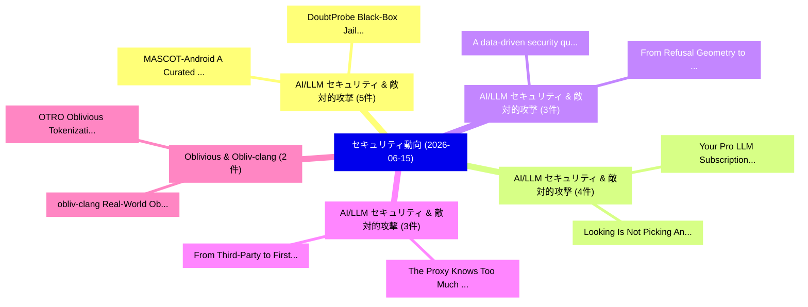

# 📅 02_daily: 日次エグゼクティブサマリー報告書 (2026-06-15)

**集計日時**: 2026-10-02 23:06:15 UTC  
**対象日付**: 2026-06-15  
**本日収集論文数**: 41 件  

---

## 💡 主要セキュリティ動向・脅威インサイト (Executive Insights)

本日の収集論文（計 41 件）において、以下の重点セキュリティ領域で活発な研究動向が確認されました：
- **AI/LLM セキュリティ & 敵対的攻撃** (5 件): 注目論文として 「MASCOT-Android: A Curated Data...」、「DoubtProbe: Black-Box Jailbrea...」 等が発表され、実務防御および攻撃検証の進展が見られます。
- **AI/LLM セキュリティ & 敵対的攻撃** (4 件): 注目論文として 「Your "Pro" LLM Subscription Ma...」、「Looking Is Not Picking: An Att...」 等が発表され、実務防御および攻撃検証の進展が見られます。
- **AI/LLM セキュリティ & 敵対的攻撃** (3 件): 注目論文として 「From Refusal Geometry to Safet...」、「A data-driven security quantif...」 等が発表され、実務防御および攻撃検証の進展が見られます。
- **AI/LLM セキュリティ & 敵対的攻撃** (3 件): 注目論文として 「The Proxy Knows Too Much: Seal...」、「From Third-Party to First-Part...」 等が発表され、実務防御および攻撃検証の進展が見られます。
- **Oblivious & Obliv-clang** (2 件): 注目論文として 「obliv-clang: Real-World Oblivi...」、「OTRO: Oblivious Tokenization P...」 等が発表され、実務防御および攻撃検証の進展が見られます。

### 🗺️ 技術・脅威トピックマインドマップ

---

## 📌 日次セキュリティ論文一覧 (日本語表形式)

| No | arXiv ID | 論文タイトル (日本語訳) | 重要キーワード | 構造化エグゼクティブ要約 (背景・提案・影響) | 脅威分類 | 詳細リンク |
|---|---|---|---|---|---|---|
| 1 | `2606.16072v2` | [MASCOT-Android: A Curated Dataset and Automated Collection Pipeline for Android Malware Source Code Specimens（セキュリティ分析論文）](../../okf/papers/2026-06-15/2606.16072.md) | `Android Malware Source Code Specimens`, `Automated Collection Pipeline`, `Curated Dataset` | 【提案】概要 (Overview & Key Finding) 本論文「MASCOT-Android: A Curated Dataset and Automated Collect...。実証評価により経営層・セキュリティ管理者向け推奨アクション (E... | `arXiv` | [arXiv](https://arxiv.org/abs/2606.16072v2) &#124; [OKF](../../okf/papers/2026-06-15/2606.16072.md) |
| 2 | `2606.16100v1` | [Your "Pro" LLM Subscription May Actually Be "Free": Exposing Fingerprint Spoofing Risks in LLM Inference Services（セキュリティ分析論文）](../../okf/papers/2026-06-15/2606.16100.md) | `Exposing Fingerprint Spoofing Risks`, `Inference Services`, `Jiahao Zhang` | 【提案】概要 (Overview & Key Finding) 本論文「Your "Pro" LLM Subscription May Actually Be "Free": Exp...。実証評価により経営層・セキュリティ管理者向け推奨アクション (E... | `arXiv` | [arXiv](https://arxiv.org/abs/2606.16100v1) &#124; [OKF](../../okf/papers/2026-06-15/2606.16100.md) |
| 3 | `2606.16121v1` | [Invisible Manipulation Channels in AI-Assisted Financial Advisory: Implications for Market Integrity and Regulatory Design（セキュリティ分析論文）](../../okf/papers/2026-06-15/2606.16121.md) | `Invisible Manipulation Channels`, `Assisted Financial Advisory`, `Market Integrity` | 【提案】概要 (Overview & Key Finding) 本論文「Invisible Manipulation Channels in AI-Assisted Financia...。実証評価により経営層・セキュリティ管理者向け推奨アクション (E... | `arXiv` | [arXiv](https://arxiv.org/abs/2606.16121v1) &#124; [OKF](../../okf/papers/2026-06-15/2606.16121.md) |
| 4 | `2606.16187v1` | [obliv-clang: Real-World Oblivious Programming in C++（セキュリティ分析論文）](../../okf/papers/2026-06-15/2606.16187.md) | `World Oblivious Programming`, `Real-World Oblivious`, `Yunqian Luo` | 【提案】概要 (Overview & Key Finding) 本論文「obliv-clang: Real-World Oblivious Programming in C++（セキ...。実証評価により経営層・セキュリティ管理者向け推奨アクション (E... | `arXiv` | [arXiv](https://arxiv.org/abs/2606.16187v1) &#124; [OKF](../../okf/papers/2026-06-15/2606.16187.md) |
| 5 | `2606.16191v1` | [Scalable Malware Family Classification Using Quantum Kernel Based Machine Learning（セキュリティ分析論文）](../../okf/papers/2026-06-15/2606.16191.md) | `Scalable Malware Family Classification Using Quantum Kernel Based Machine Learning`, `Scalable Malware Family Classification Using Quantum Kernel Based Mach`, `Christopher Gabriel Pedraza Pohlenz` | 【提案】概要 (Overview & Key Finding) 本論文「Scalable マルウェア Family Classification Using 量子 Kernel Ba...。実証評価により経営層・セキュリティ管理者向け推奨アクション (E... | `arXiv` | [arXiv](https://arxiv.org/abs/2606.16191v1) &#124; [OKF](../../okf/papers/2026-06-15/2606.16191.md) |
| 6 | `2606.16223v1` | [did:crdt: Coordination-Free Decentralised Identifiers via Signed CRDTs（セキュリティ分析論文）](../../okf/papers/2026-06-15/2606.16223.md) | `Free Decentralised Identifiers`, `Coordination-Free Decentralised`, `Claire Barnes` | 【提案】概要 (Overview & Key Finding) 本論文「did:crdt: Coordination-Free Decentralised Identifiers v...。実証評価により経営層・セキュリティ管理者向け推奨アクション (E... | `arXiv` | [arXiv](https://arxiv.org/abs/2606.16223v1) &#124; [OKF](../../okf/papers/2026-06-15/2606.16223.md) |
| 7 | `2606.16244v1` | [SPARK: Security Knowledge Priming and Representation-Guided Knowledge Activation for LLM-based Secure Code Generation（セキュリティ分析論文）](../../okf/papers/2026-06-15/2606.16244.md) | `Security Knowledge Priming`, `Guided Knowledge Activation`, `Secure Code Generation` | 【提案】概要 (Overview & Key Finding) 本論文「SPARK: Security Knowledge Priming and Representation-Gu...。実証評価により経営層・セキュリティ管理者向け推奨アクション (E... | `arXiv` | [arXiv](https://arxiv.org/abs/2606.16244v1) &#124; [OKF](../../okf/papers/2026-06-15/2606.16244.md) |
| 8 | `2606.16287v2` | [Dynamic Malicious Skills in Agentic AI（セキュリティ分析論文）](../../okf/papers/2026-06-15/2606.16287.md) | `Dynamic Malicious Skills`, `Neil Zhenqiang Gong`, `Tianhao Chen` | 【提案】概要 (Overview & Key Finding) 本論文「Dynamic Malicious Skills in Agentic AI（セキュリティ分析論文）」（原題:...。実証評価により経営層・セキュリティ管理者向け推奨アクション (E... | `arXiv` | [arXiv](https://arxiv.org/abs/2606.16287v2) &#124; [OKF](../../okf/papers/2026-06-15/2606.16287.md) |
| 9 | `2606.16349v3` | [From Refusal Geometry to Safety Geometry: Harmfulness--Refusal Coupling under Dynamic Adversarial Fine-Tuning（セキュリティ分析論文）](../../okf/papers/2026-06-15/2606.16349.md) | `Dynamic Adversarial Fine`, `Safety Geometry`, `Refusal Coupling` | 【提案】概要 (Overview & Key Finding) 本論文「From Refusal Geometry to Safety Geometry: Harmfulness--...。実証評価により経営層・セキュリティ管理者向け推奨アクション (E... | `arXiv` | [arXiv](https://arxiv.org/abs/2606.16349v3) &#124; [OKF](../../okf/papers/2026-06-15/2606.16349.md) |
| 10 | `2606.16358v1` | [The Proxy Knows Too Much: Sealing LLM API Routers with Attested TEEs（セキュリティ分析論文）](../../okf/papers/2026-06-15/2606.16358.md) | `Sipeng Xie`, `Qianhong Wu`, `Hengrun Lu` | 【提案】概要 (Overview & Key Finding) 本論文「The Proxy Knows Too Much: Sealing LLM API Routers with ...。実証評価により経営層・セキュリティ管理者向け推奨アクション (E... | `arXiv` | [arXiv](https://arxiv.org/abs/2606.16358v1) &#124; [OKF](../../okf/papers/2026-06-15/2606.16358.md) |
| 11 | `2606.16359v1` | [FEnc$^2$: Unifying Data Packing for Efficient Private Inference via Convolution and Architecture-Aware Fragment Encoding（セキュリティ分析論文）](../../okf/papers/2026-06-15/2606.16359.md) | `Unifying Data Packing`, `Efficient Private Inference`, `Aware Fragment Encoding` | 【提案】概要 (Overview & Key Finding) 本論文「FEnc$^2$: Unifying Data Packing for Efficient Private I...。実証評価により経営層・セキュリティ管理者向け推奨アクション (E... | `arXiv` | [arXiv](https://arxiv.org/abs/2606.16359v1) &#124; [OKF](../../okf/papers/2026-06-15/2606.16359.md) |
| 12 | `2606.16364v2` | [Looking Is Not Picking: An Attention-Segment Account of Tool-Selection Failures in LLMエージェント](../../okf/papers/2026-06-15/2606.16364.md) | `Segment Account`, `Selection Failures`, `Attention-Segment Account` | 【提案】背景とセキュリティ上の課題 (Background & Problem) 本研究はサイバー脅威環境におけるセキュリティ構造・脆弱性の検証を目的としています。(主要検出項目: ...。実証評価により経営層・セキュリティ管理者向け推奨アクション (E... | `arXiv` | [arXiv](https://arxiv.org/abs/2606.16364v2) &#124; [OKF](../../okf/papers/2026-06-15/2606.16364.md) |
| 13 | `2606.16372v2` | [MIPSBLEED: Uncovering Microarchitectural Timing Leaks in Pervasive Embedded Processors（セキュリティ分析論文）](../../okf/papers/2026-06-15/2606.16372.md) | `Uncovering Microarchitectural Timing Leaks`, `Pervasive Embedded Processors`, `Billy Bob Brumley` | 【提案】概要 (Overview & Key Finding) 本論文「MIPSBLEED: Uncovering Microarchitectural Timing Leaks i...。実証評価により経営層・セキュリティ管理者向け推奨アクション (E... | `arXiv` | [arXiv](https://arxiv.org/abs/2606.16372v2) &#124; [OKF](../../okf/papers/2026-06-15/2606.16372.md) |
| 14 | `2606.16394v1` | [MPX: A Unified Systolic Array for Matrix and Polynomial Multiplication（セキュリティ分析論文）](../../okf/papers/2026-06-15/2606.16394.md) | `Unified Systolic Array`, `Polynomial Multiplication`, `George Alexakis` | 【提案】概要 (Overview & Key Finding) 本論文「MPX: A Unified Systolic Array for Matrix and Polynomial...。実証評価により経営層・セキュリティ管理者向け推奨アクション (E... | `arXiv` | [arXiv](https://arxiv.org/abs/2606.16394v1) &#124; [OKF](../../okf/papers/2026-06-15/2606.16394.md) |
| 15 | `2606.16420v1` | [Transferable Self-Evolving Playbooks for Agentic Security Auditing（セキュリティ分析論文）](../../okf/papers/2026-06-15/2606.16420.md) | `Agentic Security Auditing`, `Transferable Self`, `Evolving Playbooks` | 【提案】概要 (Overview & Key Finding) 本論文「Transferable Self-Evolving Playbooks for Agentic Securi...。実証評価により経営層・セキュリティ管理者向け推奨アクション (E... | `arXiv` | [arXiv](https://arxiv.org/abs/2606.16420v1) &#124; [OKF](../../okf/papers/2026-06-15/2606.16420.md) |
| 16 | `2606.16467v2` | [A Formal Resilience Framework for Cyber-Physical Embodied Systems under Device-Level Cyberattacks（セキュリティ分析論文）](../../okf/papers/2026-06-15/2606.16467.md) | `Physical Embodied Systems`, `Level Cyberattacks`, `Cyber-Physical Embodied` | 【提案】概要 (Overview & Key Finding) 本論文「A Formal Resilience Framework for Cyber-Physical Embodi...。実証評価により経営層・セキュリティ管理者向け推奨アクション (E... | `arXiv` | [arXiv](https://arxiv.org/abs/2606.16467v2) &#124; [OKF](../../okf/papers/2026-06-15/2606.16467.md) |
| 17 | `2606.16473v1` | [Measurement Study of Post-Quantum Readiness of Internet: 2026（セキュリティ分析論文）](../../okf/papers/2026-06-15/2606.16473.md) | `Quantum Readiness`, `Post-Quantum Readiness`, `Vanishka Mohan Dubey` | 【提案】概要 (Overview & Key Finding) 本論文「Measurement Study of Post-量子 Readiness of Internet: 202...。実証評価により経営層・セキュリティ管理者向け推奨アクション (E... | `arXiv` | [arXiv](https://arxiv.org/abs/2606.16473v1) &#124; [OKF](../../okf/papers/2026-06-15/2606.16473.md) |
| 18 | `2606.16527v1` | [DoubtProbe: Black-Box Jailbreak Defense via Structural Verification and Semantic Auditing（セキュリティ分析論文）](../../okf/papers/2026-06-15/2606.16527.md) | `Box Jailbreak Defense`, `Structural Verification`, `Semantic Auditing` | 【提案】概要 (Overview & Key Finding) 本論文「DoubtProbe: Black-Box ジェイルブレイク Defense via Structural V...。実証評価により経営層・セキュリティ管理者向け推奨アクション (E... | `arXiv` | [arXiv](https://arxiv.org/abs/2606.16527v1) &#124; [OKF](../../okf/papers/2026-06-15/2606.16527.md) |
| 19 | `2606.16561v1` | [A data-driven security quantification framework for IoT-based systems（セキュリティ分析論文）](../../okf/papers/2026-06-15/2606.16561.md) | `data-driven security`, `IoT-based systems`, `Alhassan Abdulhamid` | 【提案】概要 (Overview & Key Finding) 本論文「A data-driven security quantification framework for IoT...。実証評価により経営層・セキュリティ管理者向け推奨アクション (E... | `arXiv` | [arXiv](https://arxiv.org/abs/2606.16561v1) &#124; [OKF](../../okf/papers/2026-06-15/2606.16561.md) |
| 20 | `2606.16646v1` | [SoK: Taxonomizing the Low-Level Attack Surface of Modern Web Browsers（セキュリティ分析論文）](../../okf/papers/2026-06-15/2606.16646.md) | `Level Attack Surface`, `Modern Web Browsers`, `Low-Level Attack` | 【提案】概要 (Overview & Key Finding) 本論文「SoK: Taxonomizing the Low-Level Attack Surface of Moder...。実証評価により経営層・セキュリティ管理者向け推奨アクション (E... | `arXiv` | [arXiv](https://arxiv.org/abs/2606.16646v1) &#124; [OKF](../../okf/papers/2026-06-15/2606.16646.md) |
| 21 | `2606.16720v1` | [From Third-Party to First-Party: Measuring and Protecting Against Modern Web Tracking Mechanisms（セキュリティ分析論文）](../../okf/papers/2026-06-15/2606.16720.md) | `Tareq Khouja`, `Norbert Pohlmann`, `Nurullah Demir` | 【提案】概要 (Overview & Key Finding) 本論文「From Third-Party to First-Party: Measuring and Protecti...。実証評価により経営層・セキュリティ管理者向け推奨アクション (E... | `arXiv` | [arXiv](https://arxiv.org/abs/2606.16720v1) &#124; [OKF](../../okf/papers/2026-06-15/2606.16720.md) |
| 22 | `2606.16740v1` | [Robust and Automated Reconfiguration of Byzantine Wide-Area Replication（セキュリティ分析論文）](../../okf/papers/2026-06-15/2606.16740.md) | `Automated Reconfiguration`, `Byzantine Wide`, `Area Replication` | 【提案】概要 (Overview & Key Finding) 本論文「Robust and Automated Reconfiguration of Byzantine Wide-...。実証評価により経営層・セキュリティ管理者向け推奨アクション (E... | `arXiv` | [arXiv](https://arxiv.org/abs/2606.16740v1) &#124; [OKF](../../okf/papers/2026-06-15/2606.16740.md) |
| 23 | `2606.16751v1` | [Automated jailbreak attack targeting multiple defense strategies（セキュリティ分析論文）](../../okf/papers/2026-06-15/2606.16751.md) | `Qi Wang`, `Chengcheng Wan`, `Yanqing Li` | 【提案】概要 (Overview & Key Finding) 本論文「Automated ジェイルブレイク attack targeting multiple defense st...。実証評価により経営層・セキュリティ管理者向け推奨アクション (E... | `arXiv` | [arXiv](https://arxiv.org/abs/2606.16751v1) &#124; [OKF](../../okf/papers/2026-06-15/2606.16751.md) |
| 24 | `2606.16763v1` | [Cross-Silo De-Anonymization Under Local Differential Privacy: Threat Model, Phase Transition, and Coordination Necessity（セキュリティ分析論文）](../../okf/papers/2026-06-15/2606.16763.md) | `Silo De`, `Cross-Silo De`, `Threat Model` | 【提案】概要 (Overview & Key Finding) 本論文「Cross-Silo De-Anonymization Under Local 差分プライバシー: 脅威 Mo...。実証評価により経営層・セキュリティ管理者向け推奨アクション (E... | `arXiv` | [arXiv](https://arxiv.org/abs/2606.16763v1) &#124; [OKF](../../okf/papers/2026-06-15/2606.16763.md) |
| 25 | `2606.16821v2` | [How Much Can We Trust LLM Search Agents? Measuring Endorsement Vulnerability to Web Content Manipulation（セキュリティ分析論文）](../../okf/papers/2026-06-15/2606.16821.md) | `Measuring Endorsement Vulnerability`, `Web Content Manipulation`, `Search Agents` | 【提案】Measuring Endorsement 脆弱性 to Web Content Manipulation ### (日本語題名: How Much Can We Trust...。実証評価により経営層・セキュリティ管理者向け推奨アクション (E... | `arXiv` | [arXiv](https://arxiv.org/abs/2606.16821v2) &#124; [OKF](../../okf/papers/2026-06-15/2606.16821.md) |
| 26 | `2606.16852v1` | [The Ghosts of Polymarket: When Off-Chain Matches Meet On-Chain Reverts（セキュリティ分析論文）](../../okf/papers/2026-06-15/2606.16852.md) | `Chain Reverts`, `Off-Chain Matches`, `On-Chain Reverts` | 【提案】概要 (Overview & Key Finding) 本論文「The Ghosts of Polymarket: When Off-Chain Matches Meet O...。実証評価により経営層・セキュリティ管理者向け推奨アクション (E... | `arXiv` | [arXiv](https://arxiv.org/abs/2606.16852v1) &#124; [OKF](../../okf/papers/2026-06-15/2606.16852.md) |
| 27 | `2606.16943v2` | [Di5Guise: 5G Privacy with vSIM（セキュリティ分析論文）](../../okf/papers/2026-06-15/2606.16943.md) | `Shirin Ebadi`, `Zach Moolman`, `Eric Keller` | 【提案】概要 (Overview & Key Finding) 本論文「Di5Guise: 5G Privacy with vSIM（セキュリティ分析論文）」（原題: Di5Guis...。実証評価により経営層・セキュリティ管理者向け推奨アクション (E... | `arXiv` | [arXiv](https://arxiv.org/abs/2606.16943v2) &#124; [OKF](../../okf/papers/2026-06-15/2606.16943.md) |
| 28 | `2606.17035v2` | [Your Privacy My Cloak: Backdoor Attacks on Differentially Private 連合学習](../../okf/papers/2026-06-15/2606.17035.md) | `Backdoor Attacks`, `Differentially Private Federated Learning`, `Differentially Private` | 【提案】概要 (Overview & Key Finding) 本論文「Your Privacy My Cloak: Backdoor Attacks on Differential...。実証評価により経営層・セキュリティ管理者向け推奨アクション (E... | `AI/ML Security` | [arXiv](https://arxiv.org/abs/2606.17035v2) &#124; [OKF](../../okf/papers/2026-06-15/2606.17035.md) |
| 29 | `2606.17109v1` | [Timestamp-Aware Spatio-Temporal Graph Contrastive Learning for Network Intrusion Detection（セキュリティ分析論文）](../../okf/papers/2026-06-15/2606.17109.md) | `Temporal Graph Contrastive Learning`, `Network Intrusion Detection`, `Aware Spatio` | 【提案】概要 (Overview & Key Finding) 本論文「Timestamp-Aware Spatio-Temporal Graph Contrastive Learn...。実証評価により経営層・セキュリティ管理者向け推奨アクション (E... | `arXiv` | [arXiv](https://arxiv.org/abs/2606.17109v1) &#124; [OKF](../../okf/papers/2026-06-15/2606.17109.md) |
| 30 | `2606.17110v2` | [Loss Landscape Poisoning: Targeted Extraction of Unseen Training Data from LLMs（セキュリティ分析論文）](../../okf/papers/2026-06-15/2606.17110.md) | `Loss Landscape Poisoning`, `Unseen Training Data`, `Targeted Extraction` | 【提案】概要 (Overview & Key Finding) 本論文「Loss Landscape Poisoning: Targeted Extraction of Unseen...。実証評価により経営層・セキュリティ管理者向け推奨アクション (E... | `arXiv` | [arXiv](https://arxiv.org/abs/2606.17110v2) &#124; [OKF](../../okf/papers/2026-06-15/2606.17110.md) |
| 31 | `2606.17111v1` | [Fractional Verkle Trees: A Hypertree Decomposition and Verified Proof Serialization Architecture for High-Performance Blockchain State Accumulators（セキュリティ分析論文）](../../okf/papers/2026-06-15/2606.17111.md) | `Verified Proof Serialization Architecture`, `Performance Blockchain State Accumulators`, `Fractional Verkle Trees` | 【提案】概要 (Overview & Key Finding) 本論文「Fractional Verkle Trees: A Hypertree Decomposition and ...。実証評価により経営層・セキュリティ管理者向け推奨アクション (E... | `arXiv` | [arXiv](https://arxiv.org/abs/2606.17111v1) &#124; [OKF](../../okf/papers/2026-06-15/2606.17111.md) |
| 32 | `2606.17114v1` | [An Evaluation of Data Leakage Risks in Tool-Using LLMエージェント in Realistic Scenarios](../../okf/papers/2026-06-15/2606.17114.md) | `Data Leakage Risks`, `Realistic Scenarios`, `Tool-Using LLM` | 【提案】概要 (Overview & Key Finding) 本論文「An Evaluation of Data Leakage Risks in Tool-Using LLMエー...。実証評価により経営層・セキュリティ管理者向け推奨アクション (E... | `arXiv` | [arXiv](https://arxiv.org/abs/2606.17114v1) &#124; [OKF](../../okf/papers/2026-06-15/2606.17114.md) |
| 33 | `2606.17116v1` | [Quantifying quantum risk: a measure of crypto agility（セキュリティ分析論文）](../../okf/papers/2026-06-15/2606.17116.md) | `Coryan Wilson`, `Raw Meta`, `Executive Summary` | 【提案】概要 (Overview & Key Finding) 本論文「Quantifying 量子 risk: a measure of crypto agility（セキュリティ...。実証評価により経営層・セキュリティ管理者向け推奨アクション (E... | `arXiv` | [arXiv](https://arxiv.org/abs/2606.17116v1) &#124; [OKF](../../okf/papers/2026-06-15/2606.17116.md) |
| 34 | `2606.17119v1` | [Graph neural networks at war: integrating サイバーセキュリティ and drone intelligence in the Israeli-Iranian conflict](../../okf/papers/2026-06-15/2606.17119.md) | `Israeli-Iranian conflict`, `Sozan Sulaiman Maghdid`, `Tarik Ahmed Rashid` | 【提案】概要 (Overview & Key Finding) 本論文「Graph neural networks at war: integrating サイバーセキュリティ an...。実証評価により経営層・セキュリティ管理者向け推奨アクション (E... | `arXiv` | [arXiv](https://arxiv.org/abs/2606.17119v1) &#124; [OKF](../../okf/papers/2026-06-15/2606.17119.md) |
| 35 | `2606.17122v1` | [TrustErase: Auditable Instant Machine Unlearning with Passport-Embedded Representations（セキュリティ分析論文）](../../okf/papers/2026-06-15/2606.17122.md) | `Auditable Instant Machine Unlearning`, `Embedded Representations`, `Passport-Embedded Representations` | 【提案】概要 (Overview & Key Finding) 本論文「TrustErase: Auditable Instant Machine Unlearning with P...。実証評価により経営層・セキュリティ管理者向け推奨アクション (E... | `arXiv` | [arXiv](https://arxiv.org/abs/2606.17122v1) &#124; [OKF](../../okf/papers/2026-06-15/2606.17122.md) |
| 36 | `2606.17123v1` | [LineageMark: Multi-user White-box Watermarking for Contribution Tracing in Model Derivation Chains（セキュリティ分析論文）](../../okf/papers/2026-06-15/2606.17123.md) | `Model Derivation Chains`, `Contribution Tracing`, `Multi-user White` | 【提案】概要 (Overview & Key Finding) 本論文「LineageMark: Multi-user White-box Watermarking for Cont...。実証評価により経営層・セキュリティ管理者向け推奨アクション (E... | `arXiv` | [arXiv](https://arxiv.org/abs/2606.17123v1) &#124; [OKF](../../okf/papers/2026-06-15/2606.17123.md) |
| 37 | `2606.17223v1` | [Safety, Security, and Cognitive Risks in Neuro-Symbolic AI（セキュリティ分析論文）](../../okf/papers/2026-06-15/2606.17223.md) | `Cognitive Risks`, `Neuro-Symbolic AI`, `Manoj Parmar` | 【提案】概要 (Overview & Key Finding) 本論文「Safety, Security, and Cognitive Risks in Neuro-Symbolic...。実証評価により経営層・セキュリティ管理者向け推奨アクション (E... | `arXiv` | [arXiv](https://arxiv.org/abs/2606.17223v1) &#124; [OKF](../../okf/papers/2026-06-15/2606.17223.md) |
| 38 | `2606.17245v2` | [Cache to the Future: A Distributed Webpage Archive for Internet Blackouts（セキュリティ分析論文）](../../okf/papers/2026-06-15/2606.17245.md) | `Distributed Webpage Archive`, `Internet Blackouts`, `Ross Evans` | 【提案】概要 (Overview & Key Finding) 本論文「Cache to the Future: A Distributed Webpage Archive for ...。実証評価により経営層・セキュリティ管理者向け推奨アクション (E... | `arXiv` | [arXiv](https://arxiv.org/abs/2606.17245v2) &#124; [OKF](../../okf/papers/2026-06-15/2606.17245.md) |
| 39 | `2606.17275v1` | [Syntactic Systems Cannot See Semantic Invariants（セキュリティ分析論文）](../../okf/papers/2026-06-15/2606.17275.md) | `Raw Meta`, `Executive Summary`, `Key Finding` | 【提案】背景とセキュリティ上の課題 (Background & Problem) 本研究はサイバー脅威環境におけるセキュリティ構造・脆弱性の検証を目的としています。(主要検出項目: ...。実証評価によりBuono - **公開日時**: `2026-0... | `arXiv` | [arXiv](https://arxiv.org/abs/2606.17275v1) &#124; [OKF](../../okf/papers/2026-06-15/2606.17275.md) |
| 40 | `2606.17283v2` | [ARVO: Atlas of Reproducible Vulnerabilities for Open-Source Software（セキュリティ分析論文）](../../okf/papers/2026-06-15/2606.17283.md) | `Reproducible Vulnerabilities`, `Source Software`, `Open-Source Software` | 【提案】概要 (Overview & Key Finding) 本論文「ARVO: Atlas of Reproducible Vulnerabilities for Open-So...。実証評価により経営層・セキュリティ管理者向け推奨アクション (E... | `arXiv` | [arXiv](https://arxiv.org/abs/2606.17283v2) &#124; [OKF](../../okf/papers/2026-06-15/2606.17283.md) |
| 41 | `2606.17358v2` | [OTRO: Oblivious Tokenization Path with Square-Root ORAM（セキュリティ分析論文）](../../okf/papers/2026-06-15/2606.17358.md) | `Oblivious Tokenization Path`, `Square-Root ORAM`, `Jonghyun Lee` | 【提案】概要 (Overview & Key Finding) 本論文「OTRO: Oblivious Tokenization Path with Square-Root ORAM...。実証評価により経営層・セキュリティ管理者向け推奨アクション (E... | `arXiv` | [arXiv](https://arxiv.org/abs/2606.17358v2) &#124; [OKF](../../okf/papers/2026-06-15/2606.17358.md) |

