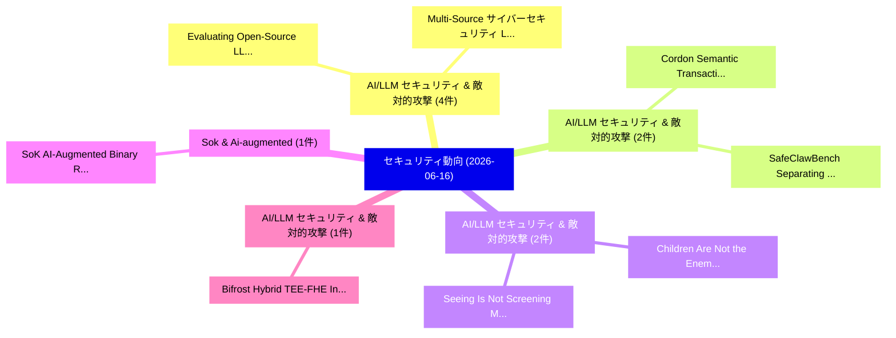

# 📅 02_daily: 日次エグゼクティブサマリー報告書 (2026-06-16)

**集計日時**: 2026-10-02 23:06:15 UTC  
**対象日付**: 2026-06-16  
**本日収集論文数**: 39 件  

---

## 💡 主要セキュリティ動向・脅威インサイト (Executive Insights)

本日の収集論文（計 39 件）において、以下の重点セキュリティ領域で活発な研究動向が確認されました：
- **AI/LLM セキュリティ & 敵対的攻撃** (4 件): 注目論文として 「Evaluating Open-Source LLMs fo...」、「Multi-Source サイバーセキュリティ Logs: ...」 等が発表され、実務防御および攻撃検証の進展が見られます。
- **AI/LLM セキュリティ & 敵対的攻撃** (2 件): 注目論文として 「Cordon: Semantic Transactions ...」、「SafeClawBench: Separating Sema...」 等が発表され、実務防御および攻撃検証の進展が見られます。
- **AI/LLM セキュリティ & 敵対的攻撃** (2 件): 注目論文として 「Children Are Not the Enemy: Ch...」、「Seeing Is Not Screening: Multi...」 等が発表され、実務防御および攻撃検証の進展が見られます。
- **Sok & Ai-augmented** (1 件): 注目論文として 「SoK: AI-Augmented Binary Rever...」 等が発表され、実務防御および攻撃検証の進展が見られます。
- **AI/LLM セキュリティ & 敵対的攻撃** (1 件): 注目論文として 「Bifrost: Hybrid TEE-FHE Infere...」 等が発表され、実務防御および攻撃検証の進展が見られます。

### 🗺️ 技術・脅威トピックマインドマップ

---

## 📌 日次セキュリティ論文一覧 (日本語表形式)

| No | arXiv ID | 論文タイトル (日本語訳) | 重要キーワード | 構造化エグゼクティブ要約 (背景・提案・影響) | 脅威分類 | 詳細リンク |
|---|---|---|---|---|---|---|
| 1 | `2606.17398v1` | [SoK: AI-Augmented Binary Reversing（セキュリティ分析論文）](../../okf/papers/2026-06-16/2606.17398.md) | `Augmented Binary Reversing`, `AI-Augmented Binary`, `Yujeong Kwon` | 【提案】概要 (Overview & Key Finding) 本論文「SoK: AI-Augmented Binary Reversing（セキュリティ分析論文）」（原題: SoK...。実証評価により経営層・セキュリティ管理者向け推奨アクション (E... | `arXiv` | [arXiv](https://arxiv.org/abs/2606.17398v1) &#124; [OKF](../../okf/papers/2026-06-16/2606.17398.md) |
| 2 | `2606.17421v1` | [Bifrost: Hybrid TEE-FHE Inference for Privacy-Preserving Transformer and LLM Serving（セキュリティ分析論文）](../../okf/papers/2026-06-16/2606.17421.md) | `Preserving Transformer`, `TEE-FHE Inference`, `Privacy-Preserving Transformer` | 【提案】概要 (Overview & Key Finding) 本論文「Bifrost: Hybrid TEE-FHE Inference for Privacy-Preservin...。実証評価により経営層・セキュリティ管理者向け推奨アクション (E... | `arXiv` | [arXiv](https://arxiv.org/abs/2606.17421v1) &#124; [OKF](../../okf/papers/2026-06-16/2606.17421.md) |
| 3 | `2606.17467v2` | [PARSE: Provenance-Aware Retrieval Sanitization for Professional Domain LLMエージェント](../../okf/papers/2026-06-16/2606.17467.md) | `Aware Retrieval Sanitization`, `Professional Domain`, `Provenance-Aware Retrieval` | 【提案】概要 (Overview & Key Finding) 本論文「PARSE: Provenance-Aware Retrieval Sanitization for Prof...。実証評価により経営層・セキュリティ管理者向け推奨アクション (E... | `arXiv` | [arXiv](https://arxiv.org/abs/2606.17467v2) &#124; [OKF](../../okf/papers/2026-06-16/2606.17467.md) |
| 4 | `2606.17533v1` | [SNAS: A Multi-Layer Defense-in-Depth Architecture for Secure Egress in Sandboxed Workloads（セキュリティ分析論文）](../../okf/papers/2026-06-16/2606.17533.md) | `Layer Defense`, `Depth Architecture`, `Secure Egress` | 【提案】概要 (Overview & Key Finding) 本論文「SNAS: A Multi-Layer Defense-in-Depth Architecture for S...。実証評価により経営層・セキュリティ管理者向け推奨アクション (E... | `arXiv` | [arXiv](https://arxiv.org/abs/2606.17533v1) &#124; [OKF](../../okf/papers/2026-06-16/2606.17533.md) |
| 5 | `2606.17555v2` | [An AI Security Agent for Banking: Multi-Vector Fraud and AML Detection Across Retail and Corporate Accounts（セキュリティ分析論文）](../../okf/papers/2026-06-16/2606.17555.md) | `Detection Across Retail`, `Security Agent`, `Vector Fraud` | 【提案】概要 (Overview & Key Finding) 本論文「An AI Security Agent for Banking: Multi-Vector Fraud an...。実証評価により経営層・セキュリティ管理者向け推奨アクション (E... | `arXiv` | [arXiv](https://arxiv.org/abs/2606.17555v2) &#124; [OKF](../../okf/papers/2026-06-16/2606.17555.md) |
| 6 | `2606.17562v1` | [Anywhere, Any-Stymie: Remote Activation of Trojan Malware on LiDAR with Modulated Signals（セキュリティ分析論文）](../../okf/papers/2026-06-16/2606.17562.md) | `Remote Activation`, `Trojan Malware`, `Modulated Signals` | 【提案】概要 (Overview & Key Finding) 本論文「Anywhere, Any-Stymie: Remote Activation of Trojan マルウェア...。実証評価により経営層・セキュリティ管理者向け推奨アクション (E... | `arXiv` | [arXiv](https://arxiv.org/abs/2606.17562v1) &#124; [OKF](../../okf/papers/2026-06-16/2606.17562.md) |
| 7 | `2606.17573v1` | [Cordon: Semantic Transactions for Tool-Using LLMエージェント](../../okf/papers/2026-06-16/2606.17573.md) | `Semantic Transactions`, `Tool-Using LLM`, `Zheng Chen` | 【提案】概要 (Overview & Key Finding) 本論文「Cordon: Semantic Transactions for Tool-Using LLMエージェント」...。実証評価により経営層・セキュリティ管理者向け推奨アクション (E... | `arXiv` | [arXiv](https://arxiv.org/abs/2606.17573v1) &#124; [OKF](../../okf/papers/2026-06-16/2606.17573.md) |
| 8 | `2606.17815v1` | [Beyond Native Success: Auditing Deployment-Interface Exposure of CLIP Backdoors（セキュリティ分析論文）](../../okf/papers/2026-06-16/2606.17815.md) | `Beyond Native Success`, `Auditing Deployment`, `Interface Exposure` | 【提案】概要 (Overview & Key Finding) 本論文「Beyond Native Success: Auditing Deployment-Interface Ex...。実証評価により経営層・セキュリティ管理者向け推奨アクション (E... | `arXiv` | [arXiv](https://arxiv.org/abs/2606.17815v1) &#124; [OKF](../../okf/papers/2026-06-16/2606.17815.md) |
| 9 | `2606.17957v1` | [Children Are Not the Enemy: Child-Fit Security as an Alternative to Bans and Surveillance（セキュリティ分析論文）](../../okf/papers/2026-06-16/2606.17957.md) | `Fit Security`, `Child-Fit Security`, `Rui Huan` | 【提案】背景とセキュリティ上の課題 (Background & Problem) 本研究はサイバー脅威環境におけるセキュリティ構造・脆弱性の検証を目的としています。(主要検出項目: ...。実証評価により経営層・セキュリティ管理者向け推奨アクション (E... | `arXiv` | [arXiv](https://arxiv.org/abs/2606.17957v1) &#124; [OKF](../../okf/papers/2026-06-16/2606.17957.md) |
| 10 | `2606.17986v1` | [ShellGames: Speculative LLM-Driven SSH Deception（セキュリティ分析論文）](../../okf/papers/2026-06-16/2606.17986.md) | `LLM-Driven SSH`, `Fabio De Gaspari`, `Luigi Vincenzo Mancini` | 【提案】概要 (Overview & Key Finding) 本論文「ShellGames: Speculative LLM-Driven SSH Deception（セキュリティ...。実証評価により経営層・セキュリティ管理者向け推奨アクション (E... | `arXiv` | [arXiv](https://arxiv.org/abs/2606.17986v1) &#124; [OKF](../../okf/papers/2026-06-16/2606.17986.md) |
| 11 | `2606.17987v1` | [Security-Induced Braess Paradoxes in Service Function Chain Orchestration（セキュリティ分析論文）](../../okf/papers/2026-06-16/2606.17987.md) | `Service Function Chain Orchestration`, `Induced Braess Paradoxes`, `Security-Induced Braess` | 【提案】概要 (Overview & Key Finding) 本論文「Security-Induced Braess Paradoxes in Service Function C...。実証評価により経営層・セキュリティ管理者向け推奨アクション (E... | `arXiv` | [arXiv](https://arxiv.org/abs/2606.17987v1) &#124; [OKF](../../okf/papers/2026-06-16/2606.17987.md) |
| 12 | `2606.17995v1` | [Differential Privacy of Gaussian Process Posterior Sampling（セキュリティ分析論文）](../../okf/papers/2026-06-16/2606.17995.md) | `Gaussian Process Posterior Sampling`, `Differential Privacy`, `Tomasz Maciazek` | 【提案】概要 (Overview & Key Finding) 本論文「差分プライバシー of Gaussian Process Posterior Sampling（セキュリティ分...。実証評価により経営層・セキュリティ管理者向け推奨アクション (E... | `arXiv` | [arXiv](https://arxiv.org/abs/2606.17995v1) &#124; [OKF](../../okf/papers/2026-06-16/2606.17995.md) |
| 13 | `2606.18052v1` | [An Empirical AI Slop in Music Streamingの分析](../../okf/papers/2026-06-16/2606.18052.md) | `Music Streaming`, `Stanley Wu`, `Josephine Passananti` | 【提案】概要 (Overview & Key Finding) 本論文「An Empirical AI Slop in Music Streamingの分析」（原題: An Empi...。実証評価によりZhao - **公開日時**: `2026-06... | `arXiv` | [arXiv](https://arxiv.org/abs/2606.18052v1) &#124; [OKF](../../okf/papers/2026-06-16/2606.18052.md) |
| 14 | `2606.18062v1` | [Security and Privacy Prompts in the Wild: What Users Ask LLMs and How LLMs Respond（セキュリティ分析論文）](../../okf/papers/2026-06-16/2606.18062.md) | `Privacy Prompts`, `Hobin Kim`, `Xiaoyuan Wu` | 【提案】概要 (Overview & Key Finding) 本論文「Security and Privacy Prompts in the Wild: What Users As...。実証評価により経営層・セキュリティ管理者向け推奨アクション (E... | `arXiv` | [arXiv](https://arxiv.org/abs/2606.18062v1) &#124; [OKF](../../okf/papers/2026-06-16/2606.18062.md) |
| 15 | `2606.18109v1` | [Verifiable computations for dynamic encrypted control（セキュリティ分析論文）](../../okf/papers/2026-06-16/2606.18109.md) | `Sebastian Schlor`, `Raw Meta`, `Executive Summary` | 【提案】概要 (Overview & Key Finding) 本論文「Verifiable computations for dynamic encrypted control（セ...。実証評価により経営層・セキュリティ管理者向け推奨アクション (E... | `arXiv` | [arXiv](https://arxiv.org/abs/2606.18109v1) &#124; [OKF](../../okf/papers/2026-06-16/2606.18109.md) |
| 16 | `2606.18120v1` | [Structural Role Injection in Handlebars-Templated LLM Prompts: Triple-Brace Interpolation, Delimiter Family, and the Limits of HTML Auto-Escaping（セキュリティ分析論文）](../../okf/papers/2026-06-16/2606.18120.md) | `Structural Role Injection`, `Brace Interpolation`, `Delimiter Family` | 【提案】概要 (Overview & Key Finding) 本論文「Structural Role Injection in Handlebars-Templated LLM P...。実証評価により経営層・セキュリティ管理者向け推奨アクション (E... | `arXiv` | [arXiv](https://arxiv.org/abs/2606.18120v1) &#124; [OKF](../../okf/papers/2026-06-16/2606.18120.md) |
| 17 | `2606.18166v1` | [Evaluating Open-Source LLMs for Multi-Label ATT&CK Technique Classification on CTI Reports（セキュリティ分析論文）](../../okf/papers/2026-06-16/2606.18166.md) | `Evaluating Open`, `Technique Classification`, `Open-Source LLMs` | 【提案】概要 (Overview & Key Finding) 本論文「Evaluating Open-Source LLMs for Multi-Label ATT&CK Tech...。実証評価により経営層・セキュリティ管理者向け推奨アクション (E... | `arXiv` | [arXiv](https://arxiv.org/abs/2606.18166v1) &#124; [OKF](../../okf/papers/2026-06-16/2606.18166.md) |
| 18 | `2606.18190v1` | [Multi-Source サイバーセキュリティ Logs: An ATT&CK-Labeled Dataset and SLM Evaluation](../../okf/papers/2026-06-16/2606.18190.md) | `Labeled Dataset`, `CK-Labeled Dataset`, `Source Cybersecurity Logs` | 【提案】概要 (Overview & Key Finding) 本論文「Multi-Source サイバーセキュリティ Logs: An ATT&CK-Labeled Dataset...。実証評価により経営層・セキュリティ管理者向け推奨アクション (E... | `arXiv` | [arXiv](https://arxiv.org/abs/2606.18190v1) &#124; [OKF](../../okf/papers/2026-06-16/2606.18190.md) |
| 19 | `2606.18193v1` | [A Red-Team Study of Anthropic Fable 5 & Opus 4.8 Models（セキュリティ分析論文）](../../okf/papers/2026-06-16/2606.18193.md) | `Anthropic Fable`, `Nicola Franco`, `Raw Meta` | 【提案】概要 (Overview & Key Finding) 本論文「A Red-Team Study of Anthropic Fable 5 & Opus 4.8 Models...。実証評価により経営層・セキュリティ管理者向け推奨アクション (E... | `arXiv` | [arXiv](https://arxiv.org/abs/2606.18193v1) &#124; [OKF](../../okf/papers/2026-06-16/2606.18193.md) |
| 20 | `2606.18198v1` | [Seeing Is Not Screening: Multimodal Hidden Instruction Attacks on Agent Skill Scanners（セキュリティ分析論文）](../../okf/papers/2026-06-16/2606.18198.md) | `Multimodal Hidden Instruction Attacks`, `Agent Skill Scanners`, `Xiaojun Jia` | 【提案】背景とセキュリティ上の課題 (Background & Problem) 本研究はサイバー脅威環境におけるセキュリティ構造・脆弱性の検証を目的としています。(主要検出項目: ...。実証評価により経営層・セキュリティ管理者向け推奨アクション (E... | `arXiv` | [arXiv](https://arxiv.org/abs/2606.18198v1) &#124; [OKF](../../okf/papers/2026-06-16/2606.18198.md) |
| 21 | `2606.18220v1` | [Gatling: Rapid-Fire Consensus from Parallel Composition（セキュリティ分析論文）](../../okf/papers/2026-06-16/2606.18220.md) | `Fire Consensus`, `Parallel Composition`, `Rapid-Fire Consensus` | 【提案】概要 (Overview & Key Finding) 本論文「Gatling: Rapid-Fire Consensus from Parallel Composition...。実証評価により経営層・セキュリティ管理者向け推奨アクション (E... | `arXiv` | [arXiv](https://arxiv.org/abs/2606.18220v1) &#124; [OKF](../../okf/papers/2026-06-16/2606.18220.md) |
| 22 | `2606.18223v2` | [Learning Red Agent Policy from Observations for Neurosymbolic Autonomous Cyber Agents（セキュリティ分析論文）](../../okf/papers/2026-06-16/2606.18223.md) | `Learning Red Agent Policy`, `Neurosymbolic Autonomous Cyber Agents`, `Learning Red Agent` | 【提案】概要 (Overview & Key Finding) 本論文「Learning Red Agent Policy from Observations for Neurosy...。実証評価により経営層・セキュリティ管理者向け推奨アクション (E... | `arXiv` | [arXiv](https://arxiv.org/abs/2606.18223v2) &#124; [OKF](../../okf/papers/2026-06-16/2606.18223.md) |
| 23 | `2606.18310v1` | [Conflict-Aware Retriever Editing for Knowledge Injection Attacks on LLM-Based RAG Systems（セキュリティ分析論文）](../../okf/papers/2026-06-16/2606.18310.md) | `Aware Retriever Editing`, `Knowledge Injection Attacks`, `Conflict-Aware Retriever` | 【提案】概要 (Overview & Key Finding) 本論文「Conflict-Aware Retriever Editing for Knowledge Injectio...。実証評価により経営層・セキュリティ管理者向け推奨アクション (E... | `arXiv` | [arXiv](https://arxiv.org/abs/2606.18310v1) &#124; [OKF](../../okf/papers/2026-06-16/2606.18310.md) |
| 24 | `2606.18312v1` | [TIGER: Inverting Transformer Gradients via Embedding-Subspace Distance Optimization（セキュリティ分析論文）](../../okf/papers/2026-06-16/2606.18312.md) | `Inverting Transformer Gradients`, `Subspace Distance Optimization`, `Embedding-Subspace Distance` | 【提案】概要 (Overview & Key Finding) 本論文「TIGER: Inverting Transformer Gradients via Embedding-Su...。実証評価により経営層・セキュリティ管理者向け推奨アクション (E... | `arXiv` | [arXiv](https://arxiv.org/abs/2606.18312v1) &#124; [OKF](../../okf/papers/2026-06-16/2606.18312.md) |
| 25 | `2606.18318v1` | [Budget-Aware Adaptive Adversarial Patches for Black-Box Object Detection（セキュリティ分析論文）](../../okf/papers/2026-06-16/2606.18318.md) | `Aware Adaptive Adversarial Patches`, `Box Object Detection`, `Budget-Aware Adaptive` | 【提案】概要 (Overview & Key Finding) 本論文「Budget-Aware Adaptive Adversarial Patches for Black-Box...。実証評価により経営層・セキュリティ管理者向け推奨アクション (E... | `arXiv` | [arXiv](https://arxiv.org/abs/2606.18318v1) &#124; [OKF](../../okf/papers/2026-06-16/2606.18318.md) |
| 26 | `2606.18320v1` | [TopVenues: A Reproducible Corpus and Tooling Substrate for サイバーセキュリティ Literature Reviews](../../okf/papers/2026-06-16/2606.18320.md) | `Reproducible Corpus`, `Tooling Substrate`, `Cybersecurity Literature Reviews` | 【提案】概要 (Overview & Key Finding) 本論文「TopVenues: A Reproducible Corpus and Tooling Substrate ...。実証評価により経営層・セキュリティ管理者向け推奨アクション (E... | `arXiv` | [arXiv](https://arxiv.org/abs/2606.18320v1) &#124; [OKF](../../okf/papers/2026-06-16/2606.18320.md) |
| 27 | `2606.18325v2` | [Agentra: A Supervisable Multi-Agent Framework for Enterprise Intrusion Response（セキュリティ分析論文）](../../okf/papers/2026-06-16/2606.18325.md) | `Enterprise Intrusion Response`, `Supervisable Multi`, `Raj Patel` | 【提案】概要 (Overview & Key Finding) 本論文「Agentra: A Supervisable Multi-Agent Framework for Enter...。実証評価により経営層・セキュリティ管理者向け推奨アクション (E... | `arXiv` | [arXiv](https://arxiv.org/abs/2606.18325v2) &#124; [OKF](../../okf/papers/2026-06-16/2606.18325.md) |
| 28 | `2606.18356v1` | [SafeClawBench: Separating Semantic, Audit-Evidence, and Sandbox Harm in Tool-Using LLMエージェント](../../okf/papers/2026-06-16/2606.18356.md) | `Separating Semantic`, `Sandbox Harm`, `Tool-Using LLM` | 【提案】概要 (Overview & Key Finding) 本論文「SafeClawBench: Separating Semantic, Audit-Evidence, and...。実証評価により経営層・セキュリティ管理者向け推奨アクション (E... | `arXiv` | [arXiv](https://arxiv.org/abs/2606.18356v1) &#124; [OKF](../../okf/papers/2026-06-16/2606.18356.md) |
| 29 | `2606.18400v1` | [CloakLM: Obfuscating GPU Memory Layout to Mitigate Model Ex-filtration for Serving（セキュリティ分析論文）](../../okf/papers/2026-06-16/2606.18400.md) | `Mitigate Model Ex`, `Memory Layout`, `Kunal Jain` | 【提案】概要 (Overview & Key Finding) 本論文「CloakLM: Obfuscating GPU Memory Layout to Mitigate Mode...。実証評価により経営層・セキュリティ管理者向け推奨アクション (E... | `arXiv` | [arXiv](https://arxiv.org/abs/2606.18400v1) &#124; [OKF](../../okf/papers/2026-06-16/2606.18400.md) |
| 30 | `2606.18405v1` | [Evaluating the Effectiveness of LLMs in Aiding Compliance Testing of PKCS#1-v1.5（セキュリティ分析論文）](../../okf/papers/2026-06-16/2606.18405.md) | `Aiding Compliance Testing`, `Polina Kozyreva`, `Endadul Hoque` | 【提案】概要 (Overview & Key Finding) 本論文「Evaluating the Effectiveness of LLMs in Aiding Complian...。実証評価により経営層・セキュリティ管理者向け推奨アクション (E... | `arXiv` | [arXiv](https://arxiv.org/abs/2606.18405v1) &#124; [OKF](../../okf/papers/2026-06-16/2606.18405.md) |
| 31 | `2606.18427v1` | [Understanding the "Airport" Censorship Circumvention Ecosystem in China（セキュリティ分析論文）](../../okf/papers/2026-06-16/2606.18427.md) | `Censorship Circumvention Ecosystem`, `Rumaisa Habib`, `Mingshi Wu` | 【提案】概要 (Overview & Key Finding) 本論文「Understanding the "Airport" Censorship Circumvention Ec...。実証評価により経営層・セキュリティ管理者向け推奨アクション (E... | `arXiv` | [arXiv](https://arxiv.org/abs/2606.18427v1) &#124; [OKF](../../okf/papers/2026-06-16/2606.18427.md) |
| 32 | `2606.18430v2` | [Signature filtering: a lightweight enhancement for statistical watermark detection in 大規模言語モデル](../../okf/papers/2026-06-16/2606.18430.md) | `Duo Hong`, `Pang Chen`, `Fang Yu` | 【提案】概要 (Overview & Key Finding) 本論文「Signature filtering: a lightweight enhancement for stat...。実証評価により経営層・セキュリティ管理者向け推奨アクション (E... | `arXiv` | [arXiv](https://arxiv.org/abs/2606.18430v2) &#124; [OKF](../../okf/papers/2026-06-16/2606.18430.md) |
| 33 | `2606.18497v1` | [Ghost Vectors: Soft-Deleted Embeddings Remain Reconstructible in HNSW Vector Databases（セキュリティ分析論文）](../../okf/papers/2026-06-16/2606.18497.md) | `Deleted Embeddings Remain Reconstructible`, `Ghost Vectors`, `Vector Databases` | 【提案】概要 (Overview & Key Finding) 本論文「Ghost Vectors: Soft-Deleted Embeddings Remain Reconstru...。実証評価により経営層・セキュリティ管理者向け推奨アクション (E... | `arXiv` | [arXiv](https://arxiv.org/abs/2606.18497v1) &#124; [OKF](../../okf/papers/2026-06-16/2606.18497.md) |
| 34 | `2606.18510v1` | [Architectural Bias in Face Presentation Attack Detection: A Comparative Study of Vision Transformers and Convolutional Neural Networks（セキュリティ分析論文）](../../okf/papers/2026-06-16/2606.18510.md) | `Face Presentation Attack Detection`, `Convolutional Neural Networks`, `Architectural Bias` | 【提案】概要 (Overview & Key Finding) 本論文「Architectural Bias in Face Presentation Attack Detectio...。実証評価により経営層・セキュリティ管理者向け推奨アクション (E... | `arXiv` | [arXiv](https://arxiv.org/abs/2606.18510v1) &#124; [OKF](../../okf/papers/2026-06-16/2606.18510.md) |
| 35 | `2606.18526v1` | [From Bits to Mixed-Radix Keys: Horner Decomposition, Uniform Sampling, and the Information-Theoretic QKD Interface of the MR-OTP（セキュリティ分析論文）](../../okf/papers/2026-06-16/2606.18526.md) | `Radix Keys`, `Horner Decomposition`, `Uniform Sampling` | 【提案】概要 (Overview & Key Finding) 本論文「From Bits to Mixed-Radix Keys: Horner Decomposition, Un...。実証評価により経営層・セキュリティ管理者向け推奨アクション (E... | `arXiv` | [arXiv](https://arxiv.org/abs/2606.18526v1) &#124; [OKF](../../okf/papers/2026-06-16/2606.18526.md) |
| 36 | `2606.18530v1` | [Evaluating Prompting-Based Defenses Against Domain-Camouflaged Injection Attacks（セキュリティ分析論文）](../../okf/papers/2026-06-16/2606.18530.md) | `Camouflaged Injection Attacks`, `Evaluating Prompting`, `Prompting-Based Defenses` | 【提案】概要 (Overview & Key Finding) 本論文「Evaluating Prompting-Based Defenses Against Domain-Camo...。実証評価により経営層・セキュリティ管理者向け推奨アクション (E... | `arXiv` | [arXiv](https://arxiv.org/abs/2606.18530v1) &#124; [OKF](../../okf/papers/2026-06-16/2606.18530.md) |
| 37 | `2606.18532v1` | [AI Sandboxes: A Threat Model, Taxonomy, and Measurement Framework（セキュリティ分析論文）](../../okf/papers/2026-06-16/2606.18532.md) | `Threat Model`, `Inderjeet Singh`, `Haitham Mahmoud` | 【提案】概要 (Overview & Key Finding) 本論文「AI Sandboxes: A 脅威 Model, Taxonomy, and Measurement Fra...。実証評価により経営層・セキュリティ管理者向け推奨アクション (E... | `arXiv` | [arXiv](https://arxiv.org/abs/2606.18532v1) &#124; [OKF](../../okf/papers/2026-06-16/2606.18532.md) |
| 38 | `2606.18541v1` | [Confident yet Concerned: Inconsistencies in Computing Students' Attitudes on サイバーセキュリティ](../../okf/papers/2026-06-16/2606.18541.md) | `Computing Students`, `Victor Adama`, `Robert Biddle` | 【提案】概要 (Overview & Key Finding) 本論文「Confident yet Concerned: Inconsistencies in Computing S...。実証評価により経営層・セキュリティ管理者向け推奨アクション (E... | `arXiv` | [arXiv](https://arxiv.org/abs/2606.18541v1) &#124; [OKF](../../okf/papers/2026-06-16/2606.18541.md) |
| 39 | `2606.20717v1` | [MIRAGE: Stealthy Visual Prompt Injection for 脆弱性検出 in Web Agents](../../okf/papers/2026-06-16/2606.20717.md) | `Stealthy Visual Prompt Injection`, `Web Agents`, `Vulnerability Detection` | 【提案】概要 (Overview & Key Finding) 本論文「MIRAGE: Stealthy Visual プロンプトインジェクション for 脆弱性検出 in Web ...。実証評価により経営層・セキュリティ管理者向け推奨アクション (E... | `arXiv` | [arXiv](https://arxiv.org/abs/2606.20717v1) &#124; [OKF](../../okf/papers/2026-06-16/2606.20717.md) |

