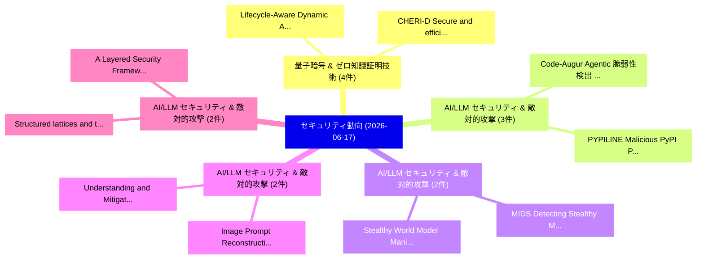

# 📅 02_daily: 日次エグゼクティブサマリー報告書 (2026-06-17)

**集計日時**: 2026-10-02 23:06:15 UTC  
**対象日付**: 2026-06-17  
**本日収集論文数**: 29 件  

---

## 💡 主要セキュリティ動向・脅威インサイト (Executive Insights)

本日の収集論文（計 29 件）において、以下の重点セキュリティ領域で活発な研究動向が確認されました：
- **量子暗号 & ゼロ知識証明技術** (4 件): 注目論文として 「Lifecycle-Aware Dynamic Analys...」、「CHERI-D: Secure and efficient ...」 等が発表され、実務防御および攻撃検証の進展が見られます。
- **AI/LLM セキュリティ & 敵対的攻撃** (3 件): 注目論文として 「Code-Augur: Agentic 脆弱性検出 via ...」、「PYPILINE: Malicious PyPI Packa...」 等が発表され、実務防御および攻撃検証の進展が見られます。
- **AI/LLM セキュリティ & 敵対的攻撃** (2 件): 注目論文として 「MIDS: Detecting Stealthy Masqu...」、「Stealthy World Model Manipulat...」 等が発表され、実務防御および攻撃検証の進展が見られます。
- **AI/LLM セキュリティ & 敵対的攻撃** (2 件): 注目論文として 「Understanding and Mitigating P...」、「Image Prompt Reconstruction At...」 等が発表され、実務防御および攻撃検証の進展が見られます。
- **AI/LLM セキュリティ & 敵対的攻撃** (2 件): 注目論文として 「Structured lattices and their ...」、「A Layered Security Framework A...」 等が発表され、実務防御および攻撃検証の進展が見られます。

### 🗺️ 技術・脅威トピックマインドマップ

---

## 📌 日次セキュリティ論文一覧 (日本語表形式)

| No | arXiv ID | 論文タイトル (日本語訳) | 重要キーワード | 構造化エグゼクティブ要約 (背景・提案・影響) | 脅威分類 | 詳細リンク |
|---|---|---|---|---|---|---|
| 1 | `2606.18550v1` | [The Gate Is Only as Honest as Its Contracts: ContractGuard for the Contract Layer of Risk-Aware Causal Gating（セキュリティ分析論文）](../../okf/papers/2026-06-17/2606.18550.md) | `Aware Causal Gating`, `Contract Layer`, `Risk-Aware Causal` | 【提案】概要 (Overview & Key Finding) 本論文「The Gate Is Only as Honest as Its Contracts: ContractGu...。実証評価により経営層・セキュリティ管理者向け推奨アクション (E... | `arXiv` | [arXiv](https://arxiv.org/abs/2606.18550v1) &#124; [OKF](../../okf/papers/2026-06-17/2606.18550.md) |
| 2 | `2606.18599v1` | [MIDS: Detecting Stealthy Masquerade and Tampering Attacks on CAN Bus via Bidirectional Mamba（セキュリティ分析論文）](../../okf/papers/2026-06-17/2606.18599.md) | `Detecting Stealthy Masquerade`, `Tampering Attacks`, `Bidirectional Mamba` | 【提案】概要 (Overview & Key Finding) 本論文「MIDS: Detecting Stealthy Masquerade and Tampering Attac...。実証評価により経営層・セキュリティ管理者向け推奨アクション (E... | `arXiv` | [arXiv](https://arxiv.org/abs/2606.18599v1) &#124; [OKF](../../okf/papers/2026-06-17/2606.18599.md) |
| 3 | `2606.18619v1` | [Code-Augur: Agentic 脆弱性検出 via Specification Inference](../../okf/papers/2026-06-17/2606.18619.md) | `Specification Inference`, `Agentic Vulnerability Detection`, `Zhengxiong Luo` | 【提案】概要 (Overview & Key Finding) 本論文「Code-Augur: Agentic 脆弱性検出 via Specification Inference」（...。実証評価により経営層・セキュリティ管理者向け推奨アクション (E... | `arXiv` | [arXiv](https://arxiv.org/abs/2606.18619v1) &#124; [OKF](../../okf/papers/2026-06-17/2606.18619.md) |
| 4 | `2606.18651v2` | [TGCM: Topic-Guided Consistency Modeling for One-Step Disentanglement of Interleaved APT Technique Sequences（セキュリティ分析論文）](../../okf/papers/2026-06-17/2606.18651.md) | `Guided Consistency Modeling`, `Topic-Guided Consistency`, `Step Disentanglement` | 【提案】概要 (Overview & Key Finding) 本論文「TGCM: Topic-Guided Consistency Modeling for One-Step Di...。実証評価により経営層・セキュリティ管理者向け推奨アクション (E... | `arXiv` | [arXiv](https://arxiv.org/abs/2606.18651v2) &#124; [OKF](../../okf/papers/2026-06-17/2606.18651.md) |
| 5 | `2606.18673v1` | [Understanding and Mitigating Prompt Leaking Attacks in Real-World LLM-Based Applications（セキュリティ分析論文）](../../okf/papers/2026-06-17/2606.18673.md) | `Mitigating Prompt Leaking Attacks`, `Real-World LLM`, `Based Applications` | 【提案】概要 (Overview & Key Finding) 本論文「Understanding and Mitigating Prompt Leaking Attacks in ...。実証評価により経営層・セキュリティ管理者向け推奨アクション (E... | `arXiv` | [arXiv](https://arxiv.org/abs/2606.18673v1) &#124; [OKF](../../okf/papers/2026-06-17/2606.18673.md) |
| 6 | `2606.18697v2` | [Stealthy World Model Manipulation via Data Poisoning（セキュリティ分析論文）](../../okf/papers/2026-06-17/2606.18697.md) | `Stealthy World Model Manipulation`, `Data Poisoning`, `Yibin Hu` | 【提案】概要 (Overview & Key Finding) 本論文「Stealthy World Model Manipulation via Data Poisoning（セキ...。実証評価により経営層・セキュリティ管理者向け推奨アクション (E... | `arXiv` | [arXiv](https://arxiv.org/abs/2606.18697v2) &#124; [OKF](../../okf/papers/2026-06-17/2606.18697.md) |
| 7 | `2606.18710v1` | [Image Prompt Reconstruction Attacks on Distributed MLLM Inference Frameworks（セキュリティ分析論文）](../../okf/papers/2026-06-17/2606.18710.md) | `Image Prompt Reconstruction Attacks`, `Inference Frameworks`, `Xinjian Luo` | 【提案】概要 (Overview & Key Finding) 本論文「Image Prompt Reconstruction Attacks on Distributed MLLM...。実証評価により経営層・セキュリティ管理者向け推奨アクション (E... | `arXiv` | [arXiv](https://arxiv.org/abs/2606.18710v1) &#124; [OKF](../../okf/papers/2026-06-17/2606.18710.md) |
| 8 | `2606.18771v1` | [A Predictive Neural Network Architecture for Early Low-Rate Cyberattacksの検出](../../okf/papers/2026-06-17/2606.18771.md) | `Predictive Neural Network Architecture`, `Early Detection`, `Rate Cyberattacks` | 【提案】概要 (Overview & Key Finding) 本論文「A Predictive Neural Network Architecture for Early Low-...。実証評価により経営層・セキュリティ管理者向け推奨アクション (E... | `arXiv` | [arXiv](https://arxiv.org/abs/2606.18771v1) &#124; [OKF](../../okf/papers/2026-06-17/2606.18771.md) |
| 9 | `2606.18920v1` | [Structured lattices and their applications to security（セキュリティ分析論文）](../../okf/papers/2026-06-17/2606.18920.md) | `Lenny Fukshansky`, `Camilla Hollanti`, `Njah Nchiwo` | 【提案】概要 (Overview & Key Finding) 本論文「Structured lattices and their applications to security（...。実証評価によりNjah Nchiwo - **公開日時**: `... | `arXiv` | [arXiv](https://arxiv.org/abs/2606.18920v1) &#124; [OKF](../../okf/papers/2026-06-17/2606.18920.md) |
| 10 | `2606.18966v3` | [A Composable CRDT Layer for Byzantine-Resilient Deterministic Reconstruction（セキュリティ分析論文）](../../okf/papers/2026-06-17/2606.18966.md) | `Resilient Deterministic Reconstruction`, `Byzantine-Resilient Deterministic`, `Amos Brocco` | 【提案】概要 (Overview & Key Finding) 本論文「A Composable CRDT Layer for Byzantine-Resilient Determi...。実証評価により経営層・セキュリティ管理者向け推奨アクション (E... | `arXiv` | [arXiv](https://arxiv.org/abs/2606.18966v3) &#124; [OKF](../../okf/papers/2026-06-17/2606.18966.md) |
| 11 | `2606.18996v2` | [TRAP: Benchmark for Task-completion and Resistance to Active Privacy-extraction（セキュリティ分析論文）](../../okf/papers/2026-06-17/2606.18996.md) | `Active Privacy`, `Moon Ye`, `Nam Hyeon` | 【提案】概要 (Overview & Key Finding) 本論文「TRAP: Benchmark for Task-completion and Resistance to A...。実証評価により経営層・セキュリティ管理者向け推奨アクション (E... | `arXiv` | [arXiv](https://arxiv.org/abs/2606.18996v2) &#124; [OKF](../../okf/papers/2026-06-17/2606.18996.md) |
| 12 | `2606.19023v1` | [Lifecycle-Aware Dynamic Analysis for Secure ML Model Execution（セキュリティ分析論文）](../../okf/papers/2026-06-17/2606.19023.md) | `Model Execution`, `Lifecycle-Aware Dynamic`, `Marco Di Gennaro` | 【提案】概要 (Overview & Key Finding) 本論文「Lifecycle-Aware Dynamic Analysis for Secure ML Model Ex...。実証評価により経営層・セキュリティ管理者向け推奨アクション (E... | `arXiv` | [arXiv](https://arxiv.org/abs/2606.19023v1) &#124; [OKF](../../okf/papers/2026-06-17/2606.19023.md) |
| 13 | `2606.19055v1` | [CHERI-D: Secure and efficient inline object ID for CHERI temporal memory safety（セキュリティ分析論文）](../../okf/papers/2026-06-17/2606.19055.md) | `Yuecheng Wang`, `Jonathan Woodruff`, `Alfredo Mazzinghi` | 【提案】概要 (Overview & Key Finding) 本論文「CHERI-D: Secure and efficient inline object ID for CHER...。実証評価により経営層・セキュリティ管理者向け推奨アクション (E... | `arXiv` | [arXiv](https://arxiv.org/abs/2606.19055v1) &#124; [OKF](../../okf/papers/2026-06-17/2606.19055.md) |
| 14 | `2606.19063v3` | [PYPILINE: Malicious PyPI Package Detection via Suspicious API Knowledge and Agent Workflow（セキュリティ分析論文）](../../okf/papers/2026-06-17/2606.19063.md) | `Package Detection`, `Agent Workflow`, `Siyuan Pang` | 【提案】概要 (Overview & Key Finding) 本論文「PYPILINE: Malicious PyPI Package Detection via Suspicio...。実証評価により経営層・セキュリティ管理者向け推奨アクション (E... | `arXiv` | [arXiv](https://arxiv.org/abs/2606.19063v3) &#124; [OKF](../../okf/papers/2026-06-17/2606.19063.md) |
| 15 | `2606.19076v1` | [Compute-Budgeted Exploitability Evidence Graphs for Prospective Vulnerability Triage（セキュリティ分析論文）](../../okf/papers/2026-06-17/2606.19076.md) | `Budgeted Exploitability Evidence Graphs`, `Prospective Vulnerability Triage`, `Compute-Budgeted Exploitability` | 【提案】概要 (Overview & Key Finding) 本論文「Compute-Budgeted Exploitability Evidence Graphs for Pro...。実証評価により経営層・セキュリティ管理者向け推奨アクション (E... | `arXiv` | [arXiv](https://arxiv.org/abs/2606.19076v1) &#124; [OKF](../../okf/papers/2026-06-17/2606.19076.md) |
| 16 | `2606.19106v1` | [Quantifying Compromise Risk in Exceptional Access Architectures Under Sparse and Indirect Evidence（セキュリティ分析論文）](../../okf/papers/2026-06-17/2606.19106.md) | `Quantifying Compromise Risk`, `Indirect Evidence`, `Alan Woodward` | 【提案】概要 (Overview & Key Finding) 本論文「Quantifying Compromise Risk in Exceptional Access Archi...。実証評価により経営層・セキュリティ管理者向け推奨アクション (E... | `arXiv` | [arXiv](https://arxiv.org/abs/2606.19106v1) &#124; [OKF](../../okf/papers/2026-06-17/2606.19106.md) |
| 17 | `2606.19129v1` | [Giskard : Byzantine Robust and Confidential Aggregation for Large-Scale Decentralized Learning（セキュリティ分析論文）](../../okf/papers/2026-06-17/2606.19129.md) | `Scale Decentralized Learning`, `Byzantine Robust`, `Confidential Aggregation` | 【提案】概要 (Overview & Key Finding) 本論文「Giskard : Byzantine Robust and Confidential Aggregation...。実証評価により経営層・セキュリティ管理者向け推奨アクション (E... | `arXiv` | [arXiv](https://arxiv.org/abs/2606.19129v1) &#124; [OKF](../../okf/papers/2026-06-17/2606.19129.md) |
| 18 | `2606.19149v2` | [OpenAnt: LLM-Powered Vulnerability Discovery Through Code Decomposition, Adversarial Verification, and Dynamic Testing（セキュリティ分析論文）](../../okf/papers/2026-06-17/2606.19149.md) | `LLM-Powered Vulnerability`, `Adversarial Verification`, `Dynamic Testing` | 【提案】概要 (Overview & Key Finding) 本論文「OpenAnt: LLM-Powered 脆弱性 Discovery Through Code Decompo...。実証評価により経営層・セキュリティ管理者向け推奨アクション (E... | `arXiv` | [arXiv](https://arxiv.org/abs/2606.19149v2) &#124; [OKF](../../okf/papers/2026-06-17/2606.19149.md) |
| 19 | `2606.19191v1` | [PhantomSkill: Malicious Code Injection in Agent Skill Ecosystems（セキュリティ分析論文）](../../okf/papers/2026-06-17/2606.19191.md) | `Malicious Code Injection`, `Agent Skill Ecosystems`, `Ting Lin` | 【提案】概要 (Overview & Key Finding) 本論文「PhantomSkill: Malicious Code Injection in Agent Skill E...。実証評価により経営層・セキュリティ管理者向け推奨アクション (E... | `arXiv` | [arXiv](https://arxiv.org/abs/2606.19191v1) &#124; [OKF](../../okf/papers/2026-06-17/2606.19191.md) |
| 20 | `2606.19235v1` | [CodeSentinel: A Three-Layer Defense Against Indirect Prompt Injection in Code Contexts（セキュリティ分析論文）](../../okf/papers/2026-06-17/2606.19235.md) | `Three-Layer Defense`, `Code Contexts`, `Han Cheng` | 【提案】概要 (Overview & Key Finding) 本論文「CodeSentinel: A Three-Layer Defense Against Indirect プロ...。実証評価により経営層・セキュリティ管理者向け推奨アクション (E... | `arXiv` | [arXiv](https://arxiv.org/abs/2606.19235v1) &#124; [OKF](../../okf/papers/2026-06-17/2606.19235.md) |
| 21 | `2606.19474v1` | [Secure Coding Drift in LLM-Assisted Post-Quantum Cryptography Development: A Gamified Fix（セキュリティ分析論文）](../../okf/papers/2026-06-17/2606.19474.md) | `Secure Coding Drift`, `Quantum Cryptography Development`, `Assisted Post` | 【提案】概要 (Overview & Key Finding) 本論文「Secure Coding Drift in LLM-Assisted ポスト量子暗号 Development...。実証評価により経営層・セキュリティ管理者向け推奨アクション (E... | `arXiv` | [arXiv](https://arxiv.org/abs/2606.19474v1) &#124; [OKF](../../okf/papers/2026-06-17/2606.19474.md) |
| 22 | `2606.19535v1` | [FloatDoor: Platform-Triggered Backdoors in LLMs（セキュリティ分析論文）](../../okf/papers/2026-06-17/2606.19535.md) | `Triggered Backdoors`, `Platform-Triggered Backdoors`, `Nils Loose` | 【提案】概要 (Overview & Key Finding) 本論文「FloatDoor: Platform-Triggered Backdoors in LLMs（セキュリティ分...。実証評価により経営層・セキュリティ管理者向け推奨アクション (E... | `arXiv` | [arXiv](https://arxiv.org/abs/2606.19535v1) &#124; [OKF](../../okf/papers/2026-06-17/2606.19535.md) |
| 23 | `2606.19551v1` | [Passive-User Bell-State Loop-Back Key Establishment without Quantum Detectors at the User Nodes（セキュリティ分析論文）](../../okf/papers/2026-06-17/2606.19551.md) | `Back Key Establishment`, `User Bell`, `State Loop` | 【提案】背景とセキュリティ上の課題 (Background & Problem) 本研究はサイバー脅威環境におけるセキュリティ構造・脆弱性の検証を目的としています。(主要検出項目: ...。実証評価により経営層・セキュリティ管理者向け推奨アクション (E... | `arXiv` | [arXiv](https://arxiv.org/abs/2606.19551v1) &#124; [OKF](../../okf/papers/2026-06-17/2606.19551.md) |
| 24 | `2606.19588v1` | [Analyzing the Narration Gap in LLM-Solver Loops（セキュリティ分析論文）](../../okf/papers/2026-06-17/2606.19588.md) | `Narration Gap`, `Solver Loops`, `LLM-Solver Loops` | 【提案】概要 (Overview & Key Finding) 本論文「Analyzing the Narration Gap in LLM-Solver Loops（セキュリティ分...。実証評価により経営層・セキュリティ管理者向け推奨アクション (E... | `arXiv` | [arXiv](https://arxiv.org/abs/2606.19588v1) &#124; [OKF](../../okf/papers/2026-06-17/2606.19588.md) |
| 25 | `2606.19620v1` | [G-Lox: Group-Adaptive, Privacy-Preserving Bridge Distribution with Two-Party Computation（セキュリティ分析論文）](../../okf/papers/2026-06-17/2606.19620.md) | `Preserving Bridge Distribution`, `Party Computation`, `Privacy-Preserving Bridge` | 【提案】概要 (Overview & Key Finding) 本論文「G-Lox: Group-Adaptive, Privacy-Preserving Bridge Distri...。実証評価により経営層・セキュリティ管理者向け推奨アクション (E... | `arXiv` | [arXiv](https://arxiv.org/abs/2606.19620v1) &#124; [OKF](../../okf/papers/2026-06-17/2606.19620.md) |
| 26 | `2606.19654v1` | [PUFFERDOS: Efficient and Effective Attack String Generation for Regular Expression Denial of Service Vulnerabilities（セキュリティ分析論文）](../../okf/papers/2026-06-17/2606.19654.md) | `Effective Attack String Generation`, `Regular Expression Denial`, `Service Vulnerabilities` | 【提案】概要 (Overview & Key Finding) 本論文「PUFFERDOS: Efficient and Effective Attack String Genera...。実証評価により経営層・セキュリティ管理者向け推奨アクション (E... | `arXiv` | [arXiv](https://arxiv.org/abs/2606.19654v1) &#124; [OKF](../../okf/papers/2026-06-17/2606.19654.md) |
| 27 | `2606.19660v1` | [A Layered Security Framework Against Prompt Injection in RAG-Based Chatbots（セキュリティ分析論文）](../../okf/papers/2026-06-17/2606.19660.md) | `Based Chatbots`, `RAG-Based Chatbots`, `Muhammad Imran Zaman` | 【提案】概要 (Overview & Key Finding) 本論文「A Layered Security Framework Against プロンプトインジェクション in R...。実証評価により経営層・セキュリティ管理者向け推奨アクション (E... | `arXiv` | [arXiv](https://arxiv.org/abs/2606.19660v1) &#124; [OKF](../../okf/papers/2026-06-17/2606.19660.md) |
| 28 | `2606.20746v1` | [Amplify, Don't Create: Temporal Accumulation for Slow-Burn Prompt Injection（セキュリティ分析論文）](../../okf/papers/2026-06-17/2606.20746.md) | `Burn Prompt Injection`, `Temporal Accumulation`, `Slow-Burn Prompt` | 【提案】概要 (Overview & Key Finding) 本論文「Amplify, Don't Create: Temporal Accumulation for Slow-B...。実証評価により経営層・セキュリティ管理者向け推奨アクション (E... | `arXiv` | [arXiv](https://arxiv.org/abs/2606.20746v1) &#124; [OKF](../../okf/papers/2026-06-17/2606.20746.md) |
| 29 | `2607.13046v1` | [What Your Model Threw Away and Why You'll Want It Back: Masking, Fingerprinting, and Privacy from Discarded Geometry（セキュリティ分析論文）](../../okf/papers/2026-06-17/2607.13046.md) | `Discarded Geometry`, `Raw Meta`, `Executive Summary` | 【提案】概要 (Overview & Key Finding) 本論文「What Your Model Threw Away and Why You'll Want It Back:...。実証評価により経営層・セキュリティ管理者向け推奨アクション (E... | `arXiv` | [arXiv](https://arxiv.org/abs/2607.13046v1) &#124; [OKF](../../okf/papers/2026-06-17/2607.13046.md) |

