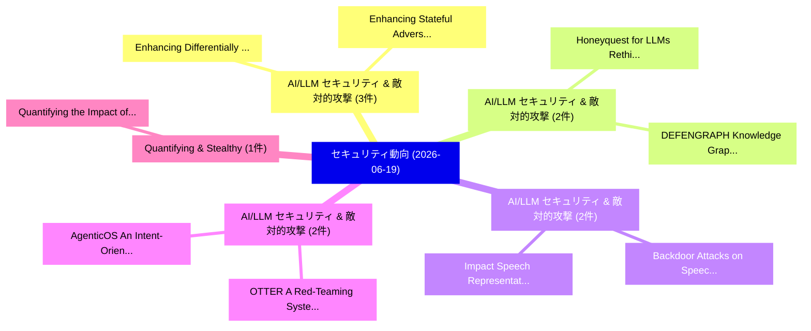

# 📅 02_daily: 日次エグゼクティブサマリー報告書 (2026-06-19)

**集計日時**: 2026-10-02 23:06:16 UTC  
**対象日付**: 2026-06-19  
**本日収集論文数**: 30 件  

---

## 💡 主要セキュリティ動向・脅威インサイト (Executive Insights)

本日の収集論文（計 30 件）において、以下の重点セキュリティ領域で活発な研究動向が確認されました：
- **AI/LLM セキュリティ & 敵対的攻撃** (3 件): 注目論文として 「Enhancing Differentially Priva...」、「Enhancing Stateful Adversarial...」 等が発表され、実務防御および攻撃検証の進展が見られます。
- **AI/LLM セキュリティ & 敵対的攻撃** (2 件): 注目論文として 「Honeyquest for LLMs: Rethinkin...」、「DEFENGRAPH: Knowledge Graph-En...」 等が発表され、実務防御および攻撃検証の進展が見られます。
- **AI/LLM セキュリティ & 敵対的攻撃** (2 件): 注目論文として 「Backdoor Attacks on Speech Emo...」、「Impact Speech Representation L...」 等が発表され、実務防御および攻撃検証の進展が見られます。
- **AI/LLM セキュリティ & 敵対的攻撃** (2 件): 注目論文として 「OTTER: A Red-Teaming System fo...」、「AgenticOS: An Intent-Oriented ...」 等が発表され、実務防御および攻撃検証の進展が見られます。
- **Quantifying & Stealthy** (1 件): 注目論文として 「Quantifying the Impact of Stea...」 等が発表され、実務防御および攻撃検証の進展が見られます。

### 🗺️ 技術・脅威トピックマインドマップ

---

## 📌 日次セキュリティ論文一覧 (日本語表形式)

| No | arXiv ID | 論文タイトル (日本語訳) | 重要キーワード | 構造化エグゼクティブ要約 (背景・提案・影響) | 脅威分類 | 詳細リンク |
|---|---|---|---|---|---|---|
| 1 | `2606.21016v1` | [Quantifying the Impact of Stealthy BLE Spam & Flooding Attacks on IoT Environments（セキュリティ分析論文）](../../okf/papers/2026-06-19/2606.21016.md) | `Flooding Attacks`, `Usman Rauf`, `Adalynn Martinez` | 【提案】概要 (Overview & Key Finding) 本論文「Quantifying the Impact of Stealthy BLE Spam & Flooding ...。実証評価により経営層・セキュリティ管理者向け推奨アクション (E... | `arXiv` | [arXiv](https://arxiv.org/abs/2606.21016v1) &#124; [OKF](../../okf/papers/2026-06-19/2606.21016.md) |
| 2 | `2606.21037v2` | [Honeyquest for LLMs: Rethinking Cyber Deception for AI Attackers（セキュリティ分析論文）](../../okf/papers/2026-06-19/2606.21037.md) | `Rethinking Cyber Deception`, `Kerri Prinos`, `Lilianne Brush` | 【提案】概要 (Overview & Key Finding) 本論文「Honeyquest for LLMs: Rethinking Cyber Deception for AI ...。実証評価により経営層・セキュリティ管理者向け推奨アクション (E... | `AI/ML Security` | [arXiv](https://arxiv.org/abs/2606.21037v2) &#124; [OKF](../../okf/papers/2026-06-19/2606.21037.md) |
| 3 | `2606.21045v1` | [OVIG: Optimistic Verification of AI Training Integrity via Gradient Signals（セキュリティ分析論文）](../../okf/papers/2026-06-19/2606.21045.md) | `Optimistic Verification`, `Training Integrity`, `Gradient Signals` | 【提案】概要 (Overview & Key Finding) 本論文「OVIG: Optimistic Verification of AI Training Integrity ...。実証評価により経営層・セキュリティ管理者向け推奨アクション (E... | `arXiv` | [arXiv](https://arxiv.org/abs/2606.21045v1) &#124; [OKF](../../okf/papers/2026-06-19/2606.21045.md) |
| 4 | `2606.21052v1` | [Backdoor Attacks on Speech Emotion Recognition via TTS-Generated Poisoning（セキュリティ分析論文）](../../okf/papers/2026-06-19/2606.21052.md) | `Speech Emotion Recognition`, `Backdoor Attacks`, `Generated Poisoning` | 【提案】概要 (Overview & Key Finding) 本論文「Backdoor Attacks on Speech Emotion Recognition via TTS-...。実証評価により経営層・セキュリティ管理者向け推奨アクション (E... | `arXiv` | [arXiv](https://arxiv.org/abs/2606.21052v1) &#124; [OKF](../../okf/papers/2026-06-19/2606.21052.md) |
| 5 | `2606.21059v1` | [DEFENGRAPH: Knowledge Graph-Enhanced LLMs for Blue Team Cyber Defense（セキュリティ分析論文）](../../okf/papers/2026-06-19/2606.21059.md) | `Blue Team Cyber Defense`, `Knowledge Graph`, `Graph-Enhanced LLMs` | 【提案】概要 (Overview & Key Finding) 本論文「DEFENGRAPH: Knowledge Graph-Enhanced LLMs for Blue Team...。実証評価により経営層・セキュリティ管理者向け推奨アクション (E... | `arXiv` | [arXiv](https://arxiv.org/abs/2606.21059v1) &#124; [OKF](../../okf/papers/2026-06-19/2606.21059.md) |
| 6 | `2606.21060v1` | [A Blockchain Consensus Mechanism for Distributed Electricity Trading（セキュリティ分析論文）](../../okf/papers/2026-06-19/2606.21060.md) | `Blockchain Consensus Mechanism`, `Distributed Electricity Trading`, `Shanglin Yang` | 【提案】概要 (Overview & Key Finding) 本論文「A Blockchain Consensus Mechanism for Distributed Electr...。実証評価により経営層・セキュリティ管理者向け推奨アクション (E... | `arXiv` | [arXiv](https://arxiv.org/abs/2606.21060v1) &#124; [OKF](../../okf/papers/2026-06-19/2606.21060.md) |
| 7 | `2606.21067v1` | [Snatcher: Apple Find My Network Exposes Your Lost Devices To Strangers（セキュリティ分析論文）](../../okf/papers/2026-06-19/2606.21067.md) | `Zhenyu Ren`, `Yanbo Zhang`, `Boya Liu` | 【提案】概要 (Overview & Key Finding) 本論文「Snatcher: Apple Find My Network Exposes Your Lost Devic...。実証評価により経営層・セキュリティ管理者向け推奨アクション (E... | `arXiv` | [arXiv](https://arxiv.org/abs/2606.21067v1) &#124; [OKF](../../okf/papers/2026-06-19/2606.21067.md) |
| 8 | `2606.21071v1` | [Local LLMエージェント as Vulnerable Runtimes:A Source-Code Audit of the Agent Runtime Layer](../../okf/papers/2026-06-19/2606.21071.md) | `Agent Runtime Layer`, `Vulnerable Runtimes`, `Code Audit` | 【提案】概要 (Overview & Key Finding) 本論文「Local LLMエージェント as Vulnerable Runtimes:A Source-Code Au...。実証評価により経営層・セキュリティ管理者向け推奨アクション (E... | `arXiv` | [arXiv](https://arxiv.org/abs/2606.21071v1) &#124; [OKF](../../okf/papers/2026-06-19/2606.21071.md) |
| 9 | `2606.21077v1` | [OTTER: A Red-Teaming System for Toxicity-Evading Jailbreak Prompt Optimization（セキュリティ分析論文）](../../okf/papers/2026-06-19/2606.21077.md) | `Evading Jailbreak Prompt Optimization`, `Teaming System`, `Red-Teaming System` | 【提案】概要 (Overview & Key Finding) 本論文「OTTER: A Red-Teaming System for Toxicity-Evading ジェイルブレ...。実証評価により経営層・セキュリティ管理者向け推奨アクション (E... | `arXiv` | [arXiv](https://arxiv.org/abs/2606.21077v1) &#124; [OKF](../../okf/papers/2026-06-19/2606.21077.md) |
| 10 | `2606.21082v1` | [Scalable Hierarchical Attention Transformers for Multi-Turn Jailbreak Detection in Long Conversations（セキュリティ分析論文）](../../okf/papers/2026-06-19/2606.21082.md) | `Scalable Hierarchical Attention Transformers`, `Turn Jailbreak Detection`, `Long Conversations` | 【提案】概要 (Overview & Key Finding) 本論文「Scalable Hierarchical Attention Transformers for Multi-...。実証評価により経営層・セキュリティ管理者向け推奨アクション (E... | `arXiv` | [arXiv](https://arxiv.org/abs/2606.21082v1) &#124; [OKF](../../okf/papers/2026-06-19/2606.21082.md) |
| 11 | `2606.21107v1` | [Enhancing Differentially Private Mechanisms via Empirical Bayes（セキュリティ分析論文）](../../okf/papers/2026-06-19/2606.21107.md) | `Enhancing Differentially Private Mechanisms`, `Empirical Bayes`, `Minwoo Kim` | 【提案】概要 (Overview & Key Finding) 本論文「Enhancing Differentially Private Mechanisms via Empiric...。実証評価により経営層・セキュリティ管理者向け推奨アクション (E... | `arXiv` | [arXiv](https://arxiv.org/abs/2606.21107v1) &#124; [OKF](../../okf/papers/2026-06-19/2606.21107.md) |
| 12 | `2606.21129v1` | [AgenticOS: An Intent-Oriented Secure Operating System Architecture for Autonomous AI Agents（セキュリティ分析論文）](../../okf/papers/2026-06-19/2606.21129.md) | `Oriented Secure Operating System Architecture`, `Intent-Oriented Secure`, `Zhen Zhao` | 【提案】概要 (Overview & Key Finding) 本論文「AgenticOS: An Intent-Oriented Secure Operating System A...。実証評価により経営層・セキュリティ管理者向け推奨アクション (E... | `arXiv` | [arXiv](https://arxiv.org/abs/2606.21129v1) &#124; [OKF](../../okf/papers/2026-06-19/2606.21129.md) |
| 13 | `2606.21210v2` | [Impact Speech Representation Learning Models for Acoustic Side-Channel Attackの分析](../../okf/papers/2026-06-19/2606.21210.md) | `Acoustic Side`, `Impact Speech Representation Learning Models`, `Speech Representation Learning Models` | 【提案】概要 (Overview & Key Finding) 本論文「Impact Speech Representation Learning Models for Acoust...。実証評価により経営層・セキュリティ管理者向け推奨アクション (E... | `arXiv` | [arXiv](https://arxiv.org/abs/2606.21210v2) &#124; [OKF](../../okf/papers/2026-06-19/2606.21210.md) |
| 14 | `2606.21240v1` | [DIPBox: A Multi-scale Testing Framework for Tracking Dataset Regeneration（セキュリティ分析論文）](../../okf/papers/2026-06-19/2606.21240.md) | `Tracking Dataset Regeneration`, `Multi-scale Testing`, `Tian Dong` | 【提案】概要 (Overview & Key Finding) 本論文「DIPBox: A Multi-scale Testing Framework for Tracking Da...。実証評価により経営層・セキュリティ管理者向け推奨アクション (E... | `arXiv` | [arXiv](https://arxiv.org/abs/2606.21240v1) &#124; [OKF](../../okf/papers/2026-06-19/2606.21240.md) |
| 15 | `2606.21282v1` | [Differential Zonotopes for Verifying Global Robustness of DNNs（セキュリティ分析論文）](../../okf/papers/2026-06-19/2606.21282.md) | `Verifying Global Robustness`, `Differential Zonotopes`, `Anagha Athavale` | 【提案】概要 (Overview & Key Finding) 本論文「Differential Zonotopes for Verifying Global Robustness ...。実証評価により経営層・セキュリティ管理者向け推奨アクション (E... | `arXiv` | [arXiv](https://arxiv.org/abs/2606.21282v1) &#124; [OKF](../../okf/papers/2026-06-19/2606.21282.md) |
| 16 | `2606.21338v1` | ["What Happens Locally, Leaks Globally": Detecting Privacy Leakage Risks in MCP Servers（セキュリティ分析論文）](../../okf/papers/2026-06-19/2606.21338.md) | `Detecting Privacy Leakage Risks`, `Leaks Globally`, `Biwei Yan` | 【提案】概要 (Overview & Key Finding) 本論文「"What Happens Locally, Leaks Globally": Detecting Priva...。実証評価により経営層・セキュリティ管理者向け推奨アクション (E... | `arXiv` | [arXiv](https://arxiv.org/abs/2606.21338v1) &#124; [OKF](../../okf/papers/2026-06-19/2606.21338.md) |
| 17 | `2606.21349v2` | [LLM-assisted Generation of Pseudo-C2 Servers for IoT Malware Dynamic Analysis（セキュリティ分析論文）](../../okf/papers/2026-06-19/2606.21349.md) | `C2 Servers`, `LLM-assisted Generation`, `Pseudo-C2 Servers` | 【提案】概要 (Overview & Key Finding) 本論文「LLM-assisted Generation of Pseudo-C2 Servers for IoT マル...。実証評価により経営層・セキュリティ管理者向け推奨アクション (E... | `arXiv` | [arXiv](https://arxiv.org/abs/2606.21349v2) &#124; [OKF](../../okf/papers/2026-06-19/2606.21349.md) |
| 18 | `2606.21353v2` | [Beyond Classification Accuracy: An Exploration-Range Evaluation of Adaptive Crawling for Fake Shopping Sites（セキュリティ分析論文）](../../okf/papers/2026-06-19/2606.21353.md) | `Beyond Classification Accuracy`, `Fake Shopping Sites`, `Adaptive Crawling` | 【提案】概要 (Overview & Key Finding) 本論文「Beyond Classification Accuracy: An Exploration-Range Ev...。実証評価により# Beyond Classification A... | `arXiv` | [arXiv](https://arxiv.org/abs/2606.21353v2) &#124; [OKF](../../okf/papers/2026-06-19/2606.21353.md) |
| 19 | `2606.21377v1` | [ARENA: An Architecture for Measuring the Transferability of Autonomous Cyber Defense（セキュリティ分析論文）](../../okf/papers/2026-06-19/2606.21377.md) | `Autonomous Cyber Defense`, `Lopes Roth Ferraz`, `Wagner Comin Sonaglio` | 【提案】概要 (Overview & Key Finding) 本論文「ARENA: An Architecture for Measuring the Transferabilit...。実証評価により経営層・セキュリティ管理者向け推奨アクション (E... | `arXiv` | [arXiv](https://arxiv.org/abs/2606.21377v1) &#124; [OKF](../../okf/papers/2026-06-19/2606.21377.md) |
| 20 | `2606.21389v1` | [From Production SIEM to Reusable サイバーセキュリティ Artifacts](../../okf/papers/2026-06-19/2606.21389.md) | `Reusable Cybersecurity Artifacts`, `Lopes Roth Ferraz`, `Wagner Comin Sonaglio` | 【提案】概要 (Overview & Key Finding) 本論文「From Production SIEM to Reusable サイバーセキュリティ Artifacts」（...。実証評価により経営層・セキュリティ管理者向け推奨アクション (E... | `arXiv` | [arXiv](https://arxiv.org/abs/2606.21389v1) &#124; [OKF](../../okf/papers/2026-06-19/2606.21389.md) |
| 21 | `2606.21397v1` | [Evaluating LLMs for Real-World Web 脆弱性検出](../../okf/papers/2026-06-19/2606.21397.md) | `Real-World Web`, `World Web Vulnerability Detection`, `World Web` | 【提案】概要 (Overview & Key Finding) 本論文「Evaluating LLMs for Real-World Web 脆弱性検出」（原題: Evaluatin...。実証評価により経営層・セキュリティ管理者向け推奨アクション (E... | `arXiv` | [arXiv](https://arxiv.org/abs/2606.21397v1) &#124; [OKF](../../okf/papers/2026-06-19/2606.21397.md) |
| 22 | `2606.21487v1` | [A Longitudinal Study of Android Apps Signing Key Protection（セキュリティ分析論文）](../../okf/papers/2026-06-19/2606.21487.md) | `Android Apps Signing Key Protection`, `Mark Huasong Meng`, `Qing Zhang` | 【提案】概要 (Overview & Key Finding) 本論文「A Longitudinal Study of Android Apps Signing Key Protec...。実証評価により経営層・セキュリティ管理者向け推奨アクション (E... | `arXiv` | [arXiv](https://arxiv.org/abs/2606.21487v1) &#124; [OKF](../../okf/papers/2026-06-19/2606.21487.md) |
| 23 | `2606.21592v1` | [Enhancing Stateful Adversarial Attacks with Soft-labels' Temporality and Robust Similarity Approximationsの検出](../../okf/papers/2026-06-19/2606.21592.md) | `Enhancing Stateful Adversarial Attacks`, `Robust Similarity Approximations`, `Enhancing Stateful Detection` | 【提案】概要 (Overview & Key Finding) 本論文「Enhancing Stateful 敵対的攻撃s with Soft-labels' Temporality...。実証評価により経営層・セキュリティ管理者向け推奨アクション (E... | `arXiv` | [arXiv](https://arxiv.org/abs/2606.21592v1) &#124; [OKF](../../okf/papers/2026-06-19/2606.21592.md) |
| 24 | `2606.21638v1` | [Toward Open Weight Models Without Risks: Separating Public and Private Capabilities in LLMs（セキュリティ分析論文）](../../okf/papers/2026-06-19/2606.21638.md) | `Toward Open Weight Models Without Risks`, `Separating Public`, `Private Capabilities` | 【提案】背景とセキュリティ上の課題 (Background & Problem) 本研究はサイバー脅威環境におけるセキュリティ構造・脆弱性の検証を目的としています。(主要検出項目: ...。実証評価により経営層・セキュリティ管理者向け推奨アクション (E... | `arXiv` | [arXiv](https://arxiv.org/abs/2606.21638v1) &#124; [OKF](../../okf/papers/2026-06-19/2606.21638.md) |
| 25 | `2606.21690v2` | [A Hybrid, Multi-Layered Pipeline for Phishing and Threat Classification: Independently Validated URL and NLP Engines with a Calibrated Multi-Channel Fusion Stage（セキュリティ分析論文）](../../okf/papers/2026-06-19/2606.21690.md) | `Channel Fusion Stage`, `Layered Pipeline`, `Threat Classification` | 【提案】概要 (Overview & Key Finding) 本論文「A Hybrid, Multi-Layered Pipeline for Phishing and 脅威 Cl...。実証評価により経営層・セキュリティ管理者向け推奨アクション (E... | `arXiv` | [arXiv](https://arxiv.org/abs/2606.21690v2) &#124; [OKF](../../okf/papers/2026-06-19/2606.21690.md) |
| 26 | `2606.21732v1` | [Safe to Check, Unsafe to Use: Relinking at the Compression Boundary of LLMエージェント](../../okf/papers/2026-06-19/2606.21732.md) | `Compression Boundary`, `Zesen Liu`, `Zihan Zhang` | 【提案】概要 (Overview & Key Finding) 本論文「Safe to Check, Unsafe to Use: Relinking at the Compress...。実証評価により経営層・セキュリティ管理者向け推奨アクション (E... | `arXiv` | [arXiv](https://arxiv.org/abs/2606.21732v1) &#124; [OKF](../../okf/papers/2026-06-19/2606.21732.md) |
| 27 | `2606.21757v1` | [AdaPrivate-TS: Private Thompson Sampling for Contextual Bandits with Privacy Amplification（セキュリティ分析論文）](../../okf/papers/2026-06-19/2606.21757.md) | `Private Thompson Sampling`, `Contextual Bandits`, `Privacy Amplification` | 【提案】概要 (Overview & Key Finding) 本論文「AdaPrivate-TS: Private Thompson Sampling for Contextual...。実証評価により経営層・セキュリティ管理者向け推奨アクション (E... | `arXiv` | [arXiv](https://arxiv.org/abs/2606.21757v1) &#124; [OKF](../../okf/papers/2026-06-19/2606.21757.md) |
| 28 | `2606.21763v1` | [From Gradient Clipping to Structural Refinement: Improving DPSGD for Medical Image Segmentation（セキュリティ分析論文）](../../okf/papers/2026-06-19/2606.21763.md) | `Medical Image Segmentation`, `Structural Refinement`, `Shiva Parsarad` | 【提案】概要 (Overview & Key Finding) 本論文「From Gradient Clipping to Structural Refinement: Improv...。実証評価により経営層・セキュリティ管理者向け推奨アクション (E... | `arXiv` | [arXiv](https://arxiv.org/abs/2606.21763v1) &#124; [OKF](../../okf/papers/2026-06-19/2606.21763.md) |
| 29 | `2606.21779v1` | [FrogBard-512: Design and Experimental Evaluation of a Four-Voice Permutation-Based Hash Function（セキュリティ分析論文）](../../okf/papers/2026-06-19/2606.21779.md) | `Based Hash Function`, `Voice Permutation`, `Four-Voice Permutation` | 【提案】概要 (Overview & Key Finding) 本論文「FrogBard-512: Design and Experimental Evaluation of a F...。実証評価により経営層・セキュリティ管理者向け推奨アクション (E... | `arXiv` | [arXiv](https://arxiv.org/abs/2606.21779v1) &#124; [OKF](../../okf/papers/2026-06-19/2606.21779.md) |
| 30 | `2606.21799v1` | [a Doubly Efficient IP=PSPACEに向けて](../../okf/papers/2026-06-19/2606.21799.md) | `Doubly Efficient`, `Yael Tauman Kalai`, `Liyan Chen` | 【提案】概要 (Overview & Key Finding) 本論文「a Doubly Efficient IP=PSPACEに向けて」（原題: Towards a Doubly ...。実証評価によりHong, Yael Tauman Kalai, ... | `arXiv` | [arXiv](https://arxiv.org/abs/2606.21799v1) &#124; [OKF](../../okf/papers/2026-06-19/2606.21799.md) |

