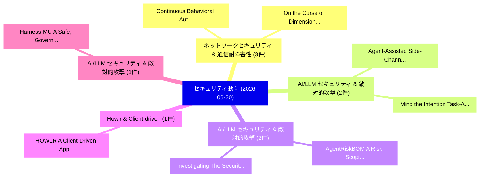

# 📅 02_daily: 日次エグゼクティブサマリー報告書 (2026-06-20)

**集計日時**: 2026-10-02 23:06:16 UTC  
**対象日付**: 2026-06-20  
**本日収集論文数**: 15 件  

---

## 💡 主要セキュリティ動向・脅威インサイト (Executive Insights)

本日の収集論文（計 15 件）において、以下の重点セキュリティ領域で活発な研究動向が確認されました：
- **ネットワークセキュリティ & 通信耐障害性** (3 件): 注目論文として 「Continuous Behavioral Authenti...」、「On the Curse of Dimensionality...」 等が発表され、実務防御および攻撃検証の進展が見られます。
- **AI/LLM セキュリティ & 敵対的攻撃** (2 件): 注目論文として 「Agent-Assisted Side-Channel At...」、「Mind the Intention: Task-Aware...」 等が発表され、実務防御および攻撃検証の進展が見られます。
- **AI/LLM セキュリティ & 敵対的攻撃** (2 件): 注目論文として 「AgentRiskBOM: A Risk-Scoping S...」、「Investigating The Security of ...」 等が発表され、実務防御および攻撃検証の進展が見られます。
- **Howlr & Client-driven** (1 件): 注目論文として 「HOWLR: A Client-Driven Approac...」 等が発表され、実務防御および攻撃検証の進展が見られます。
- **AI/LLM セキュリティ & 敵対的攻撃** (1 件): 注目論文として 「Harness-MU: A Safe, Governed, ...」 等が発表され、実務防御および攻撃検証の進展が見られます。

### 🗺️ 技術・脅威トピックマインドマップ

---

## 📌 日次セキュリティ論文一覧 (日本語表形式)

| No | arXiv ID | 論文タイトル (日本語訳) | 重要キーワード | 構造化エグゼクティブ要約 (背景・提案・影響) | 脅威分類 | 詳細リンク |
|---|---|---|---|---|---|---|
| 1 | `2606.21842v1` | [Agent-Assisted Side-Channel Attacks on Non-Prefix KV Cache in RAG（セキュリティ分析論文）](../../okf/papers/2026-06-20/2606.21842.md) | `Assisted Side`, `Channel Attacks`, `Agent-Assisted Side` | 【提案】概要 (Overview & Key Finding) 本論文「Agent-Assisted サイドチャネル攻撃 Attacks on Non-Prefix KV Cache...。実証評価により経営層・セキュリティ管理者向け推奨アクション (E... | `arXiv` | [arXiv](https://arxiv.org/abs/2606.21842v1) &#124; [OKF](../../okf/papers/2026-06-20/2606.21842.md) |
| 2 | `2606.21845v1` | [HOWLR: A Client-Driven Approach to BGP Hijack Detection（セキュリティ分析論文）](../../okf/papers/2026-06-20/2606.21845.md) | `Hijack Detection`, `Constantine Doumanidis`, `Anya Kalogerakos` | 【提案】概要 (Overview & Key Finding) 本論文「HOWLR: A Client-Driven Approach to BGP Hijack Detection...。実証評価により経営層・セキュリティ管理者向け推奨アクション (E... | `arXiv` | [arXiv](https://arxiv.org/abs/2606.21845v1) &#124; [OKF](../../okf/papers/2026-06-20/2606.21845.md) |
| 3 | `2606.21846v1` | [Mind the Intention: Task-Aware Backdoor Attacks for Forecast-Driven Distribution Network Operations（セキュリティ分析論文）](../../okf/papers/2026-06-20/2606.21846.md) | `Aware Backdoor Attacks`, `Driven Distribution Network Operations`, `Task-Aware Backdoor` | 【提案】概要 (Overview & Key Finding) 本論文「Mind the Intention: Task-Aware Backdoor Attacks for For...。実証評価により経営層・セキュリティ管理者向け推奨アクション (E... | `arXiv` | [arXiv](https://arxiv.org/abs/2606.21846v1) &#124; [OKF](../../okf/papers/2026-06-20/2606.21846.md) |
| 4 | `2606.21856v1` | [Harness-MU: A Safe, Governed, and Effective Harness for Multi-User LLMエージェント](../../okf/papers/2026-06-20/2606.21856.md) | `Effective Harness`, `Multi-User LLM`, `Wangxuan Fan` | 【提案】概要 (Overview & Key Finding) 本論文「Harness-MU: A Safe, Governed, and Effective Harness for...。実証評価により経営層・セキュリティ管理者向け推奨アクション (E... | `arXiv` | [arXiv](https://arxiv.org/abs/2606.21856v1) &#124; [OKF](../../okf/papers/2026-06-20/2606.21856.md) |
| 5 | `2606.21877v1` | [AgentRiskBOM: A Risk-Scoping Security Bill of Materials for Agentic AI Systems（セキュリティ分析論文）](../../okf/papers/2026-06-20/2606.21877.md) | `Scoping Security Bill`, `Risk-Scoping Security`, `Akshata Kishore Moharir` | 【提案】概要 (Overview & Key Finding) 本論文「AgentRiskBOM: A Risk-Scoping Security Bill of Materials...。実証評価により経営層・セキュリティ管理者向け推奨アクション (E... | `arXiv` | [arXiv](https://arxiv.org/abs/2606.21877v1) &#124; [OKF](../../okf/papers/2026-06-20/2606.21877.md) |
| 6 | `2606.21900v1` | [Continuous Behavioral Authentication via Multi-Expert BERT Log Analysis for Secure Data Sharing（セキュリティ分析論文）](../../okf/papers/2026-06-20/2606.21900.md) | `Continuous Behavioral Authentication`, `Secure Data Sharing`, `Multi-Expert BERT` | 【提案】概要 (Overview & Key Finding) 本論文「Continuous Behavioral Authentication via Multi-Expert B...。実証評価により経営層・セキュリティ管理者向け推奨アクション (E... | `arXiv` | [arXiv](https://arxiv.org/abs/2606.21900v1) &#124; [OKF](../../okf/papers/2026-06-20/2606.21900.md) |
| 7 | `2606.21951v1` | [On the Curse of Dimensionality in Private Sparse Covariance Estimation and PCA（セキュリティ分析論文）](../../okf/papers/2026-06-20/2606.21951.md) | `Private Sparse Covariance Estimation`, `Syamantak Kumar`, `Shourya Pandey` | 【提案】概要 (Overview & Key Finding) 本論文「On the Curse of Dimensionality in Private Sparse Covari...。実証評価により経営層・セキュリティ管理者向け推奨アクション (E... | `math.ST` | [arXiv](https://arxiv.org/abs/2606.21951v1) &#124; [OKF](../../okf/papers/2026-06-20/2606.21951.md) |
| 8 | `2606.22034v1` | [Auditing Combinatorial Randomness from Finite Transcripts（セキュリティ分析論文）](../../okf/papers/2026-06-20/2606.22034.md) | `Auditing Combinatorial Randomness`, `Finite Transcripts`, `Faruk Alpay` | 【提案】概要 (Overview & Key Finding) 本論文「Auditing Combinatorial Randomness from Finite Transcrip...。実証評価により経営層・セキュリティ管理者向け推奨アクション (E... | `arXiv` | [arXiv](https://arxiv.org/abs/2606.22034v1) &#124; [OKF](../../okf/papers/2026-06-20/2606.22034.md) |
| 9 | `2606.22063v2` | [Guarded Equivalence Predicates for Scalable Formal Hardware Information-Flow Verification（セキュリティ分析論文）](../../okf/papers/2026-06-20/2606.22063.md) | `Scalable Formal Hardware Information`, `Guarded Equivalence Predicates`, `Flow Verification` | 【提案】概要 (Overview & Key Finding) 本論文「Guarded Equivalence Predicates for Scalable Formal Hard...。実証評価により経営層・セキュリティ管理者向け推奨アクション (E... | `arXiv` | [arXiv](https://arxiv.org/abs/2606.22063v2) &#124; [OKF](../../okf/papers/2026-06-20/2606.22063.md) |
| 10 | `2606.22115v1` | [Game-Theoretic Framework for Private Data Sharing in Vehicular Networks（セキュリティ分析論文）](../../okf/papers/2026-06-20/2606.22115.md) | `Private Data Sharing`, `Vehicular Networks`, `Yinan Zhou` | 【提案】概要 (Overview & Key Finding) 本論文「Game-Theoretic Framework for Private Data Sharing in Ve...。実証評価により経営層・セキュリティ管理者向け推奨アクション (E... | `arXiv` | [arXiv](https://arxiv.org/abs/2606.22115v1) &#124; [OKF](../../okf/papers/2026-06-20/2606.22115.md) |
| 11 | `2606.22153v1` | [$π$-RAG: Oblivious Retrieval via Semantic Quantization and Transcendental Addressing for 大規模言語モデル](../../okf/papers/2026-06-20/2606.22153.md) | `Oblivious Retrieval`, `Semantic Quantization`, `Transcendental Addressing` | 【提案】概要 (Overview & Key Finding) 本論文「$π$-RAG: Oblivious Retrieval via Semantic Quantization ...。実証評価により経営層・セキュリティ管理者向け推奨アクション (E... | `arXiv` | [arXiv](https://arxiv.org/abs/2606.22153v1) &#124; [OKF](../../okf/papers/2026-06-20/2606.22153.md) |
| 12 | `2606.22198v1` | [2.5D Root of Trust: the Chiplet Ecosystemのセキュリティ強化](../../okf/papers/2026-06-20/2606.22198.md) | `Chiplet Ecosystem`, `Charles Williams`, `Mohammed Nabeel` | 【提案】概要 (Overview & Key Finding) 本論文「2.5D Root of Trust: the Chiplet Ecosystemのセキュリティ強化」（原題:...。実証評価によりGratz, Johann Knechtel - ... | `arXiv` | [arXiv](https://arxiv.org/abs/2606.22198v1) &#124; [OKF](../../okf/papers/2026-06-20/2606.22198.md) |
| 13 | `2606.22214v1` | [TRACE: A Threat Modelling Methodology for Distributed, Cloud-First, and Decentralized Organisations（セキュリティ分析論文）](../../okf/papers/2026-06-20/2606.22214.md) | `Threat Modelling Methodology`, `Decentralized Organisations`, `Stefan Beyer` | 【提案】概要 (Overview & Key Finding) 本論文「TRACE: A 脅威 Modelling Methodology for Distributed, Clou...。実証評価により経営層・セキュリティ管理者向け推奨アクション (E... | `arXiv` | [arXiv](https://arxiv.org/abs/2606.22214v1) &#124; [OKF](../../okf/papers/2026-06-20/2606.22214.md) |
| 14 | `2606.22237v1` | [Investigating The Security of Modern AI and Cloud Infrastructure（セキュリティ分析論文）](../../okf/papers/2026-06-20/2606.22237.md) | `Cloud Infrastructure`, `Andrew Adiletta`, `Raw Meta` | 【提案】概要 (Overview & Key Finding) 本論文「Investigating The Security of Modern AI and Cloud Infra...。実証評価により経営層・セキュリティ管理者向け推奨アクション (E... | `arXiv` | [arXiv](https://arxiv.org/abs/2606.22237v1) &#124; [OKF](../../okf/papers/2026-06-20/2606.22237.md) |
| 15 | `2606.22263v1` | [Revelio: Cost-Efficient Agentic Memory Safety 脆弱性検出 For Repository-Scale Codebases](../../okf/papers/2026-06-20/2606.22263.md) | `Cost-Efficient Agentic`, `Scale Codebases`, `Repository-Scale Codebases` | 【提案】概要 (Overview & Key Finding) 本論文「Revelio: Cost-Efficient Agentic メモリ安全性 脆弱性検出 For Reposi...。実証評価により経営層・セキュリティ管理者向け推奨アクション (E... | `arXiv` | [arXiv](https://arxiv.org/abs/2606.22263v1) &#124; [OKF](../../okf/papers/2026-06-20/2606.22263.md) |

