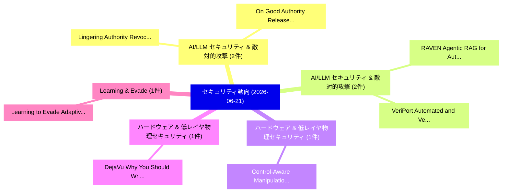

# 📅 02_daily: 日次エグゼクティブサマリー報告書 (2026-06-21)

**集計日時**: 2026-10-02 23:06:16 UTC  
**対象日付**: 2026-06-21  
**本日収集論文数**: 21 件  

---

## 💡 主要セキュリティ動向・脅威インサイト (Executive Insights)

本日の収集論文（計 21 件）において、以下の重点セキュリティ領域で活発な研究動向が確認されました：
- **AI/LLM セキュリティ & 敵対的攻撃** (2 件): 注目論文として 「Lingering Authority: Revocable...」、「On Good Authority: Release-Aut...」 等が発表され、実務防御および攻撃検証の進展が見られます。
- **AI/LLM セキュリティ & 敵対的攻撃** (2 件): 注目論文として 「RAVEN: Agentic RAG for Automat...」、「VeriPort: Automated and Verifi...」 等が発表され、実務防御および攻撃検証の進展が見られます。
- **ハードウェア & 低レイヤ物理セキュリティ** (1 件): 注目論文として 「Control-Aware Manipulation of ...」 等が発表され、実務防御および攻撃検証の進展が見られます。
- **ハードウェア & 低レイヤ物理セキュリティ** (1 件): 注目論文として 「DejaVu: Why You Should Write t...」 等が発表され、実務防御および攻撃検証の進展が見られます。
- **Learning & Evade** (1 件): 注目論文として 「Learning to Evade: Adaptive At...」 等が発表され、実務防御および攻撃検証の進展が見られます。

### 🗺️ 技術・脅威トピックマインドマップ

---

## 📌 日次セキュリティ論文一覧 (日本語表形式)

| No | arXiv ID | 論文タイトル (日本語訳) | 重要キーワード | 構造化エグゼクティブ要約 (背景・提案・影響) | 脅威分類 | 詳細リンク |
|---|---|---|---|---|---|---|
| 1 | `2606.22289v1` | [Control-Aware Manipulation of ArduPilot via Legitimate MAVLink Commands: Simulation and Hardware Validation（セキュリティ分析論文）](../../okf/papers/2026-06-21/2606.22289.md) | `Aware Manipulation`, `Hardware Validation`, `Control-Aware Manipulation` | 【提案】概要 (Overview & Key Finding) 本論文「Control-Aware Manipulation of ArduPilot via Legitimate ...。実証評価により経営層・セキュリティ管理者向け推奨アクション (E... | `arXiv` | [arXiv](https://arxiv.org/abs/2606.22289v1) &#124; [OKF](../../okf/papers/2026-06-21/2606.22289.md) |
| 2 | `2606.22297v1` | [DejaVu: Why You Should Write to Your DRAM Rows Twice, Carefully（セキュリティ分析論文）](../../okf/papers/2026-06-21/2606.22297.md) | `Rows Twice`, `Haocong Luo`, `Ataberk Olgun` | 【提案】概要 (Overview & Key Finding) 本論文「DejaVu: Why You Should Write to Your DRAM Rows Twice, C...。実証評価により経営層・セキュリティ管理者向け推奨アクション (E... | `arXiv` | [arXiv](https://arxiv.org/abs/2606.22297v1) &#124; [OKF](../../okf/papers/2026-06-21/2606.22297.md) |
| 3 | `2606.22310v1` | [Learning to Evade: Adaptive Attacks on Audio Watermarking（セキュリティ分析論文）](../../okf/papers/2026-06-21/2606.22310.md) | `Adaptive Attacks`, `Audio Watermarking`, `Weikang Ding` | 【提案】概要 (Overview & Key Finding) 本論文「Learning to Evade: Adaptive Attacks on Audio Watermarki...。実証評価により経営層・セキュリティ管理者向け推奨アクション (E... | `arXiv` | [arXiv](https://arxiv.org/abs/2606.22310v1) &#124; [OKF](../../okf/papers/2026-06-21/2606.22310.md) |
| 4 | `2606.22311v1` | [Semantic Non-Assembly: Privacy by Architectural Inertness Under Component Exposure（セキュリティ分析論文）](../../okf/papers/2026-06-21/2606.22311.md) | `Semantic Non`, `Sam Ryan`, `Raw Meta` | 【提案】概要 (Overview & Key Finding) 本論文「Semantic Non-Assembly: Privacy by Architectural Inertne...。実証評価により経営層・セキュリティ管理者向け推奨アクション (E... | `arXiv` | [arXiv](https://arxiv.org/abs/2606.22311v1) &#124; [OKF](../../okf/papers/2026-06-21/2606.22311.md) |
| 5 | `2606.22340v1` | [A Post-Quantum Secure Lattice-Based Forward-Secure Identity Based Encryption with Applications to Internet of Things Architecture（セキュリティ分析論文）](../../okf/papers/2026-06-21/2606.22340.md) | `Secure Identity Based Encryption`, `Quantum Secure Lattice`, `Based Forward` | 【提案】概要 (Overview & Key Finding) 本論文「A Post-量子 Secure Lattice-Based Forward-Secure Identity ...。実証評価により経営層・セキュリティ管理者向け推奨アクション (E... | `arXiv` | [arXiv](https://arxiv.org/abs/2606.22340v1) &#124; [OKF](../../okf/papers/2026-06-21/2606.22340.md) |
| 6 | `2606.22450v1` | [Cross-Layer Intrusion Detection in 5G O-RAN: Gains and Limits of Fusing Radio Telemetry with Network Flow Records（セキュリティ分析論文）](../../okf/papers/2026-06-21/2606.22450.md) | `Layer Intrusion Detection`, `Fusing Radio Telemetry`, `Network Flow Records` | 【提案】概要 (Overview & Key Finding) 本論文「Cross-Layer Intrusion Detection in 5G O-RAN: Gains and ...。実証評価により経営層・セキュリティ管理者向け推奨アクション (E... | `arXiv` | [arXiv](https://arxiv.org/abs/2606.22450v1) &#124; [OKF](../../okf/papers/2026-06-21/2606.22450.md) |
| 7 | `2606.22504v1` | [Lingering Authority: Revocable Resource-and-Effect Capabilities for Coding Agents（セキュリティ分析論文）](../../okf/papers/2026-06-21/2606.22504.md) | `Lingering Authority`, `Revocable Resource`, `Effect Capabilities` | 【提案】概要 (Overview & Key Finding) 本論文「Lingering Authority: Revocable Resource-and-Effect Capa...。実証評価により経営層・セキュリティ管理者向け推奨アクション (E... | `arXiv` | [arXiv](https://arxiv.org/abs/2606.22504v1) &#124; [OKF](../../okf/papers/2026-06-21/2606.22504.md) |
| 8 | `2606.22516v1` | [The Scissors Effect: When Resize-Based Input Diversity Helps or Hurts Transfer Attacks（セキュリティ分析論文）](../../okf/papers/2026-06-21/2606.22516.md) | `Based Input Diversity Helps`, `Hurts Transfer Attacks`, `Resize-Based Input` | 【提案】概要 (Overview & Key Finding) 本論文「The Scissors Effect: When Resize-Based Input Diversity ...。実証評価により経営層・セキュリティ管理者向け推奨アクション (E... | `arXiv` | [arXiv](https://arxiv.org/abs/2606.22516v1) &#124; [OKF](../../okf/papers/2026-06-21/2606.22516.md) |
| 9 | `2606.22519v1` | [Detecting and Understanding Vulnerabilities in Fully Homomorphic Encryption Frameworks（セキュリティ分析論文）](../../okf/papers/2026-06-21/2606.22519.md) | `Fully Homomorphic Encryption Frameworks`, `Understanding Vulnerabilities`, `Yiteng Peng` | 【提案】概要 (Overview & Key Finding) 本論文「Detecting and Understanding Vulnerabilities in Fully 準同...。実証評価により経営層・セキュリティ管理者向け推奨アクション (E... | `arXiv` | [arXiv](https://arxiv.org/abs/2606.22519v1) &#124; [OKF](../../okf/papers/2026-06-21/2606.22519.md) |
| 10 | `2606.22560v1` | [Evidence-Bound Gateway-Path Provenance for Third-Party LLM Inference（セキュリティ分析論文）](../../okf/papers/2026-06-21/2606.22560.md) | `Bound Gateway`, `Path Provenance`, `Evidence-Bound Gateway` | 【提案】概要 (Overview & Key Finding) 本論文「Evidence-Bound Gateway-Path Provenance for Third-Party ...。実証評価により経営層・セキュリティ管理者向け推奨アクション (E... | `arXiv` | [arXiv](https://arxiv.org/abs/2606.22560v1) &#124; [OKF](../../okf/papers/2026-06-21/2606.22560.md) |
| 11 | `2606.22581v1` | [From CVE to CWE: Syscall-Based HIDS Generalisation（セキュリティ分析論文）](../../okf/papers/2026-06-21/2606.22581.md) | `Syscall-Based HIDS`, `Raw Meta`, `Executive Summary` | 【提案】概要 (Overview & Key Finding) 本論文「From CVE to CWE: Syscall-Based HIDS Generalisation（セキュリ...。実証評価によりMagomedov - **公開日時**: `20... | `arXiv` | [arXiv](https://arxiv.org/abs/2606.22581v1) &#124; [OKF](../../okf/papers/2026-06-21/2606.22581.md) |
| 12 | `2606.22588v1` | [Non-Uniform L2 Cache Latency Across the Streaming Multiprocessors of an NVIDIA L40（セキュリティ分析論文）](../../okf/papers/2026-06-21/2606.22588.md) | `Uniform L2 Cache Latency Across`, `Streaming Multiprocessors`, `Non-Uniform L2` | 【提案】概要 (Overview & Key Finding) 本論文「Non-Uniform L2 Cache Latency Across the Streaming Multi...。実証評価により経営層・セキュリティ管理者向け推奨アクション (E... | `arXiv` | [arXiv](https://arxiv.org/abs/2606.22588v1) &#124; [OKF](../../okf/papers/2026-06-21/2606.22588.md) |
| 13 | `2606.22593v2` | [On Good Authority: Release-Authority Measurement for Registry-Mediated Package Ecosystems（セキュリティ分析論文）](../../okf/papers/2026-06-21/2606.22593.md) | `Mediated Package Ecosystems`, `Authority Measurement`, `Release-Authority Measurement` | 【提案】概要 (Overview & Key Finding) 本論文「On Good Authority: Release-Authority Measurement for Re...。実証評価により経営層・セキュリティ管理者向け推奨アクション (E... | `arXiv` | [arXiv](https://arxiv.org/abs/2606.22593v2) &#124; [OKF](../../okf/papers/2026-06-21/2606.22593.md) |
| 14 | `2606.22632v2` | [ColumnKeeper: Efficient Solutions to the ColumnDisturb Vulnerability in DRAM-based Systems（セキュリティ分析論文）](../../okf/papers/2026-06-21/2606.22632.md) | `Efficient Solutions`, `DRAM-based Systems`, `Andreas Kosmas Kakolyris` | 【提案】概要 (Overview & Key Finding) 本論文「ColumnKeeper: Efficient Solutions to the ColumnDisturb ...。実証評価により経営層・セキュリティ管理者向け推奨アクション (E... | `arXiv` | [arXiv](https://arxiv.org/abs/2606.22632v2) &#124; [OKF](../../okf/papers/2026-06-21/2606.22632.md) |
| 15 | `2606.22647v1` | [RAVEN: Agentic RAG for Automated Vulnerability Repair（セキュリティ分析論文）](../../okf/papers/2026-06-21/2606.22647.md) | `Automated Vulnerability Repair`, `Varun Gadey`, `Zijie Liu` | 【提案】概要 (Overview & Key Finding) 本論文「RAVEN: Agentic RAG for Automated 脆弱性 Repair（セキュリティ分析論文）...。実証評価により経営層・セキュリティ管理者向け推奨アクション (E... | `arXiv` | [arXiv](https://arxiv.org/abs/2606.22647v1) &#124; [OKF](../../okf/papers/2026-06-21/2606.22647.md) |
| 16 | `2606.22659v1` | [Confidently Wrong: Severity-Aware Calibration of Prompt-Injection Detectors under Attack Shift（セキュリティ分析論文）](../../okf/papers/2026-06-21/2606.22659.md) | `Confidently Wrong`, `Aware Calibration`, `Severity-Aware Calibration` | 【提案】概要 (Overview & Key Finding) 本論文「Confidently Wrong: Severity-Aware Calibration of Prompt...。実証評価により経営層・セキュリティ管理者向け推奨アクション (E... | `arXiv` | [arXiv](https://arxiv.org/abs/2606.22659v1) &#124; [OKF](../../okf/papers/2026-06-21/2606.22659.md) |
| 17 | `2606.22686v2` | [The Geometry of Refusal: Linear Instability in Safety-Aligned LLMs（セキュリティ分析論文）](../../okf/papers/2026-06-21/2606.22686.md) | `Linear Instability`, `Safety-Aligned LLMs`, `Shivam Ratnakar` | 【提案】概要 (Overview & Key Finding) 本論文「The Geometry of Refusal: Linear Instability in Safety-A...。実証評価により経営層・セキュリティ管理者向け推奨アクション (E... | `arXiv` | [arXiv](https://arxiv.org/abs/2606.22686v2) &#124; [OKF](../../okf/papers/2026-06-21/2606.22686.md) |
| 18 | `2606.22698v1` | [Black-Box Forensics for Conversational LLMエージェント](../../okf/papers/2026-06-21/2606.22698.md) | `Box Forensics`, `Black-Box Forensics`, `Isadora White` | 【提案】概要 (Overview & Key Finding) 本論文「Black-Box Forensics for Conversational LLMエージェント」（原題: B...。実証評価により経営層・セキュリティ管理者向け推奨アクション (E... | `arXiv` | [arXiv](https://arxiv.org/abs/2606.22698v1) &#124; [OKF](../../okf/papers/2026-06-21/2606.22698.md) |
| 19 | `2606.22700v1` | [SCRUB-FL: Sanitizing and Cleansing Representations via Unlearning of Backdoors（セキュリティ分析論文）](../../okf/papers/2026-06-21/2606.22700.md) | `Cleansing Representations`, `Omar Abdel Wahab`, `Osama Wehbi` | 【提案】概要 (Overview & Key Finding) 本論文「SCRUB-FL: Sanitizing and Cleansing Representations via ...。実証評価により経営層・セキュリティ管理者向け推奨アクション (E... | `arXiv` | [arXiv](https://arxiv.org/abs/2606.22700v1) &#124; [OKF](../../okf/papers/2026-06-21/2606.22700.md) |
| 20 | `2606.22704v1` | [VeriPort: Automated and Verified Patch Backporting at Scale（セキュリティ分析論文）](../../okf/papers/2026-06-21/2606.22704.md) | `Verified Patch Backporting`, `Benjamin Barslev Nielsen`, `Jonah Ghebremichael` | 【提案】概要 (Overview & Key Finding) 本論文「VeriPort: Automated and Verified Patch Backporting at S...。実証評価により経営層・セキュリティ管理者向け推奨アクション (E... | `arXiv` | [arXiv](https://arxiv.org/abs/2606.22704v1) &#124; [OKF](../../okf/papers/2026-06-21/2606.22704.md) |
| 21 | `2606.22717v1` | [One-Prompt Censorship Evasion via Generative Diffusion Models（セキュリティ分析論文）](../../okf/papers/2026-06-21/2606.22717.md) | `Prompt Censorship Evasion`, `Generative Diffusion Models`, `One-Prompt Censorship` | 【提案】概要 (Overview & Key Finding) 本論文「One-Prompt Censorship Evasion via Generative Diffusion ...。実証評価により経営層・セキュリティ管理者向け推奨アクション (E... | `arXiv` | [arXiv](https://arxiv.org/abs/2606.22717v1) &#124; [OKF](../../okf/papers/2026-06-21/2606.22717.md) |

