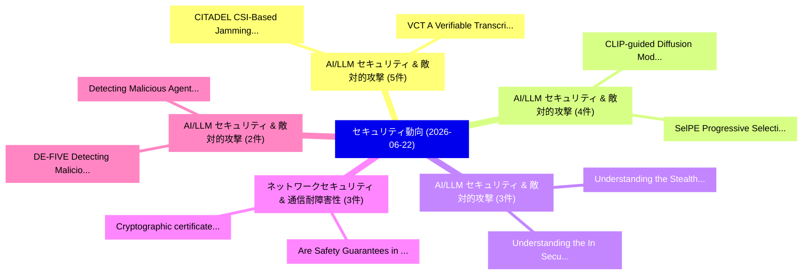

# 📅 02_daily: 日次エグゼクティブサマリー報告書 (2026-06-22)

**集計日時**: 2026-10-02 23:06:16 UTC  
**対象日付**: 2026-06-22  
**本日収集論文数**: 40 件  

---

## 💡 主要セキュリティ動向・脅威インサイト (Executive Insights)

本日の収集論文（計 40 件）において、以下の重点セキュリティ領域で活発な研究動向が確認されました：
- **AI/LLM セキュリティ & 敵対的攻撃** (5 件): 注目論文として 「CITADEL: CSI-Based Jamming Det...」、「VCT: A Verifiable Transcript S...」 等が発表され、実務防御および攻撃検証の進展が見られます。
- **AI/LLM セキュリティ & 敵対的攻撃** (4 件): 注目論文として 「SelPE: Progressive Selection f...」、「CLIP-guided Diffusion Model fo...」 等が発表され、実務防御および攻撃検証の進展が見られます。
- **AI/LLM セキュリティ & 敵対的攻撃** (3 件): 注目論文として 「Understanding the Stealthy BGP...」、「Understanding the (In)Security...」 等が発表され、実務防御および攻撃検証の進展が見られます。
- **ネットワークセキュリティ & 通信耐障害性** (3 件): 注目論文として 「Cryptographic certificates of ...」、「Are Safety Guarantees in Neura...」 等が発表され、実務防御および攻撃検証の進展が見られます。
- **AI/LLM セキュリティ & 敵対的攻撃** (2 件): 注目論文として 「DE-FIVE: Detecting Malicious I...」、「Detecting Malicious Agent Skil...」 等が発表され、実務防御および攻撃検証の進展が見られます。

### 🗺️ 技術・脅威トピックマインドマップ

---

## 📌 日次セキュリティ論文一覧 (日本語表形式)

| No | arXiv ID | 論文タイトル (日本語訳) | 重要キーワード | 構造化エグゼクティブ要約 (背景・提案・影響) | 脅威分類 | 詳細リンク |
|---|---|---|---|---|---|---|
| 1 | `2606.22779v1` | [DE-FIVE: Detecting Malicious Image Prompts via Fourier Features and Image Vector Embeddings（セキュリティ分析論文）](../../okf/papers/2026-06-22/2606.22779.md) | `Detecting Malicious Image Prompts`, `Image Vector Embeddings`, `Fourier Features` | 【提案】概要 (Overview & Key Finding) 本論文「DE-FIVE: Detecting Malicious Image Prompts via Fourier ...。実証評価により経営層・セキュリティ管理者向け推奨アクション (E... | `arXiv` | [arXiv](https://arxiv.org/abs/2606.22779v1) &#124; [OKF](../../okf/papers/2026-06-22/2606.22779.md) |
| 2 | `2606.22782v1` | [Robust Personalized Federated Learning: Vulnerability Assessment and Defense Co-Designに向けて](../../okf/papers/2026-06-22/2606.22782.md) | `Vulnerability Assessment`, `Defense Co`, `Towards Robust Personalized Federated Learning` | 【提案】概要 (Overview & Key Finding) 本論文「Robust Personalized Federated Learning: 脆弱性 Assessment ...。実証評価により経営層・セキュリティ管理者向け推奨アクション (E... | `arXiv` | [arXiv](https://arxiv.org/abs/2606.22782v1) &#124; [OKF](../../okf/papers/2026-06-22/2606.22782.md) |
| 3 | `2606.22785v1` | [Cross-National Information Attacks: A Two-Decade Troll Behavior in Koreaの分析](../../okf/papers/2026-06-22/2606.22785.md) | `National Information Attacks`, `Cross-National Information`, `Decade Troll Behavior` | 【提案】概要 (Overview & Key Finding) 本論文「Cross-National Information Attacks: A Two-Decade Troll ...。実証評価により経営層・セキュリティ管理者向け推奨アクション (E... | `arXiv` | [arXiv](https://arxiv.org/abs/2606.22785v1) &#124; [OKF](../../okf/papers/2026-06-22/2606.22785.md) |
| 4 | `2606.22817v1` | [SelPE: Progressive Selection for Private Structured Text Synthesis（セキュリティ分析論文）](../../okf/papers/2026-06-22/2606.22817.md) | `Private Structured Text Synthesis`, `Progressive Selection`, `Xuancheng Zhu` | 【提案】概要 (Overview & Key Finding) 本論文「SelPE: Progressive Selection for Private Structured Tex...。実証評価により経営層・セキュリティ管理者向け推奨アクション (E... | `arXiv` | [arXiv](https://arxiv.org/abs/2606.22817v1) &#124; [OKF](../../okf/papers/2026-06-22/2606.22817.md) |
| 5 | `2606.22827v2` | [What You See Is Not What You Execute: Memory-Based Runtime SBOM Generation for Supply Chain Security（セキュリティ分析論文）](../../okf/papers/2026-06-22/2606.22827.md) | `Supply Chain Security`, `Based Runtime`, `Memory-Based Runtime` | 【提案】背景とセキュリティ上の課題 (Background & Problem) 本研究はサイバー脅威環境におけるセキュリティ構造・脆弱性の検証を目的としています。(主要検出項目: ...。実証評価により経営層・セキュリティ管理者向け推奨アクション (E... | `arXiv` | [arXiv](https://arxiv.org/abs/2606.22827v2) &#124; [OKF](../../okf/papers/2026-06-22/2606.22827.md) |
| 6 | `2606.22837v1` | [CLIP-guided Diffusion Model for Backdoor Generation in Sensor-based Human Activity Recognition（セキュリティ分析論文）](../../okf/papers/2026-06-22/2606.22837.md) | `Human Activity Recognition`, `CLIP-guided Diffusion`, `Diffusion Model` | 【提案】概要 (Overview & Key Finding) 本論文「CLIP-guided Diffusion Model for Backdoor Generation in ...。実証評価により経営層・セキュリティ管理者向け推奨アクション (E... | `arXiv` | [arXiv](https://arxiv.org/abs/2606.22837v1) &#124; [OKF](../../okf/papers/2026-06-22/2606.22837.md) |
| 7 | `2606.22843v1` | [When the Learning With Errors Problem Meets the Coherent Ising Machine: A Penalty-Free Algorithm-Hardware Co-Design（セキュリティ分析論文）](../../okf/papers/2026-06-22/2606.22843.md) | `Coherent Ising Machine`, `Free Algorithm`, `Hardware Co` | 【提案】概要 (Overview & Key Finding) 本論文「When the Learning With Errors Problem Meets the Coheren...。実証評価により経営層・セキュリティ管理者向け推奨アクション (E... | `arXiv` | [arXiv](https://arxiv.org/abs/2606.22843v1) &#124; [OKF](../../okf/papers/2026-06-22/2606.22843.md) |
| 8 | `2606.22928v1` | [HADES: Privacy-Preserving 連合学習 via Selective Feature Encryption and Hybrid Model Fusion](../../okf/papers/2026-06-22/2606.22928.md) | `Selective Feature Encryption`, `Hybrid Model Fusion`, `Preserving Federated Learning` | 【提案】概要 (Overview & Key Finding) 本論文「HADES: Privacy-Preserving 連合学習 via Selective Feature En...。実証評価により経営層・セキュリティ管理者向け推奨アクション (E... | `arXiv` | [arXiv](https://arxiv.org/abs/2606.22928v1) &#124; [OKF](../../okf/papers/2026-06-22/2606.22928.md) |
| 9 | `2606.22939v1` | [CITADEL: CSI-Based Jamming Detection and Open-Set Classification for IIoT Networks（セキュリティ分析論文）](../../okf/papers/2026-06-22/2606.22939.md) | `Based Jamming Detection`, `CSI-Based Jamming`, `Set Classification` | 【提案】概要 (Overview & Key Finding) 本論文「CITADEL: CSI-Based Jamming Detection and Open-Set Class...。実証評価により経営層・セキュリティ管理者向け推奨アクション (E... | `arXiv` | [arXiv](https://arxiv.org/abs/2606.22939v1) &#124; [OKF](../../okf/papers/2026-06-22/2606.22939.md) |
| 10 | `2606.22966v1` | [Attacking the Trusted Imagination: Oracle-Level Integrity Attacks on Imagine-then-Act World Models（セキュリティ分析論文）](../../okf/papers/2026-06-22/2606.22966.md) | `Level Integrity Attacks`, `Act World Models`, `Trusted Imagination` | 【提案】概要 (Overview & Key Finding) 本論文「Attacking the Trusted Imagination: Oracle-Level Integri...。実証評価により経営層・セキュリティ管理者向け推奨アクション (E... | `arXiv` | [arXiv](https://arxiv.org/abs/2606.22966v1) &#124; [OKF](../../okf/papers/2026-06-22/2606.22966.md) |
| 11 | `2606.22988v1` | [Public Diffusion Models, Private Images: Key-Controlled Inversion for Conditional Reconstruction（セキュリティ分析論文）](../../okf/papers/2026-06-22/2606.22988.md) | `Public Diffusion Models`, `Private Images`, `Controlled Inversion` | 【提案】概要 (Overview & Key Finding) 本論文「Public Diffusion Models, Private Images: Key-Controlled...。実証評価により経営層・セキュリティ管理者向け推奨アクション (E... | `arXiv` | [arXiv](https://arxiv.org/abs/2606.22988v1) &#124; [OKF](../../okf/papers/2026-06-22/2606.22988.md) |
| 12 | `2606.23003v1` | [VCT: A Verifiable Transcript System for LLM Conversations（セキュリティ分析論文）](../../okf/papers/2026-06-22/2606.23003.md) | `Verifiable Transcript System`, `Ruilin Xing`, `Feihong Li` | 【提案】概要 (Overview & Key Finding) 本論文「VCT: A Verifiable Transcript System for LLM Conversatio...。実証評価により経営層・セキュリティ管理者向け推奨アクション (E... | `arXiv` | [arXiv](https://arxiv.org/abs/2606.23003v1) &#124; [OKF](../../okf/papers/2026-06-22/2606.23003.md) |
| 13 | `2606.23071v1` | [Understanding the Stealthy BGP Hijacking Risk in the ROV Era（セキュリティ分析論文）](../../okf/papers/2026-06-22/2606.23071.md) | `Hijacking Risk`, `Yihao Chen`, `Qi Li` | 【提案】概要 (Overview & Key Finding) 本論文「Understanding the Stealthy BGP Hijacking Risk in the RO...。実証評価により経営層・セキュリティ管理者向け推奨アクション (E... | `arXiv` | [arXiv](https://arxiv.org/abs/2606.23071v1) &#124; [OKF](../../okf/papers/2026-06-22/2606.23071.md) |
| 14 | `2606.23075v1` | [Safety in Self-Evolving LLM Agent Systems: Threats, Amplification, and Case Studies（セキュリティ分析論文）](../../okf/papers/2026-06-22/2606.23075.md) | `Agent Systems`, `Case Studies`, `Self-Evolving LLM` | 【提案】概要 (Overview & Key Finding) 本論文「Safety in Self-Evolving LLM Agent Systems: Threats, Amp...。実証評価により経営層・セキュリティ管理者向け推奨アクション (E... | `arXiv` | [arXiv](https://arxiv.org/abs/2606.23075v1) &#124; [OKF](../../okf/papers/2026-06-22/2606.23075.md) |
| 15 | `2606.23130v2` | [Understanding the (In)Security of Vibe-Coded Applications（セキュリティ分析論文）](../../okf/papers/2026-06-22/2606.23130.md) | `Coded Applications`, `Vibe-Coded Applications`, `Junquan Deng` | 【提案】概要 (Overview & Key Finding) 本論文「Understanding the (In)Security of Vibe-Coded Applicatio...。実証評価により経営層・セキュリティ管理者向け推奨アクション (E... | `arXiv` | [arXiv](https://arxiv.org/abs/2606.23130v2) &#124; [OKF](../../okf/papers/2026-06-22/2606.23130.md) |
| 16 | `2606.23138v1` | [Rising From the Ashes: How Agentic AI is Unblocking Challenges in サイバーセキュリティ](../../okf/papers/2026-06-22/2606.23138.md) | `Unblocking Challenges`, `Kathrin Grosse`, `Somesh Jha` | 【提案】概要 (Overview & Key Finding) 本論文「Rising From the Ashes: How Agentic AI is Unblocking Cha...。実証評価によりCiocarlie, Kathrin Grosse... | `arXiv` | [arXiv](https://arxiv.org/abs/2606.23138v1) &#124; [OKF](../../okf/papers/2026-06-22/2606.23138.md) |
| 17 | `2606.23197v1` | [The EVerest Dataset for Secure Software Engineering（セキュリティ分析論文）](../../okf/papers/2026-06-22/2606.23197.md) | `Secure Software Engineering`, `Sophie Corallo`, `Debora Grupp` | 【提案】概要 (Overview & Key Finding) 本論文「The EVerest Dataset for Secure Software Engineering（セキュ...。実証評価により経営層・セキュリティ管理者向け推奨アクション (E... | `arXiv` | [arXiv](https://arxiv.org/abs/2606.23197v1) &#124; [OKF](../../okf/papers/2026-06-22/2606.23197.md) |
| 18 | `2606.23236v2` | [A Hybrid Intrusion Detection System for Electric Vehicle Charging Infrastructure（セキュリティ分析論文）](../../okf/papers/2026-06-22/2606.23236.md) | `Hybrid Intrusion Detection System`, `Electric Vehicle Charging Infrastructure`, `Charukeshi Joglekar` | 【提案】概要 (Overview & Key Finding) 本論文「A Hybrid Intrusion Detection System for Electric Vehicl...。実証評価により経営層・セキュリティ管理者向け推奨アクション (E... | `arXiv` | [arXiv](https://arxiv.org/abs/2606.23236v2) &#124; [OKF](../../okf/papers/2026-06-22/2606.23236.md) |
| 19 | `2606.23239v1` | [Quantum Key Distribution Without Shared Reference Frame Under Unital Noise（セキュリティ分析論文）](../../okf/papers/2026-06-22/2606.23239.md) | `Shehbaz Tariq`, `Symeon Chatzinotas`, `Raw Meta` | 【提案】背景とセキュリティ上の課題 (Background & Problem) 本研究はサイバー脅威環境におけるセキュリティ構造・脆弱性の検証を目的としています。(主要検出項目: ...。実証評価により経営層・セキュリティ管理者向け推奨アクション (E... | `arXiv` | [arXiv](https://arxiv.org/abs/2606.23239v1) &#124; [OKF](../../okf/papers/2026-06-22/2606.23239.md) |
| 20 | `2606.23276v2` | [Exposing the Illusion of Erasure in Knowledge Editing for LLMs（セキュリティ分析論文）](../../okf/papers/2026-06-22/2606.23276.md) | `Knowledge Editing`, `Advik Raj Basani`, `Anshuman Chhabra` | 【提案】概要 (Overview & Key Finding) 本論文「Exposing the Illusion of Erasure in Knowledge Editing f...。実証評価により経営層・セキュリティ管理者向け推奨アクション (E... | `arXiv` | [arXiv](https://arxiv.org/abs/2606.23276v2) &#124; [OKF](../../okf/papers/2026-06-22/2606.23276.md) |
| 21 | `2606.23362v1` | [TooBad: Backdoor Diffusion Models with Ultra-Low Poison Rate and Imperceptible Trigger（セキュリティ分析論文）](../../okf/papers/2026-06-22/2606.23362.md) | `Backdoor Diffusion Models`, `Low Poison Rate`, `Imperceptible Trigger` | 【提案】概要 (Overview & Key Finding) 本論文「TooBad: Backdoor Diffusion Models with Ultra-Low Poison...。実証評価により経営層・セキュリティ管理者向け推奨アクション (E... | `arXiv` | [arXiv](https://arxiv.org/abs/2606.23362v1) &#124; [OKF](../../okf/papers/2026-06-22/2606.23362.md) |
| 22 | `2606.23370v2` | [FlexServe: A Fast and Secure LLM Serving System for Mobile Devices with Flexible Resource Isolation（セキュリティ分析論文）](../../okf/papers/2026-06-22/2606.23370.md) | `Flexible Resource Isolation`, `Serving System`, `Mobile Devices` | 【提案】概要 (Overview & Key Finding) 本論文「FlexServe: A Fast and Secure LLM Serving System for Mob...。実証評価により経営層・セキュリティ管理者向け推奨アクション (E... | `arXiv` | [arXiv](https://arxiv.org/abs/2606.23370v2) &#124; [OKF](../../okf/papers/2026-06-22/2606.23370.md) |
| 23 | `2606.23405v1` | [OptChain: Achieving Optimal Throughput of Permissionless Blockchains（セキュリティ分析論文）](../../okf/papers/2026-06-22/2606.23405.md) | `Achieving Optimal Throughput`, `Permissionless Blockchains`, `Chunjiang Che` | 【提案】概要 (Overview & Key Finding) 本論文「OptChain: Achieving Optimal Throughput of Permissionles...。実証評価により経営層・セキュリティ管理者向け推奨アクション (E... | `arXiv` | [arXiv](https://arxiv.org/abs/2606.23405v1) &#124; [OKF](../../okf/papers/2026-06-22/2606.23405.md) |
| 24 | `2606.23416v1` | [Detecting Malicious Agent Skills in the Wild using Attention（セキュリティ分析論文）](../../okf/papers/2026-06-22/2606.23416.md) | `Detecting Malicious Agent Skills`, `Bacem Etteib`, `Daniele Lunghi` | 【提案】概要 (Overview & Key Finding) 本論文「Detecting Malicious Agent Skills in the Wild using Atte...。実証評価によりBissyandé - **公開日時**: `20... | `arXiv` | [arXiv](https://arxiv.org/abs/2606.23416v1) &#124; [OKF](../../okf/papers/2026-06-22/2606.23416.md) |
| 25 | `2606.23464v1` | [An Automated Framework for Input Alphabet Construction in Stateful Protocol Implementation Learning（セキュリティ分析論文）](../../okf/papers/2026-06-22/2606.23464.md) | `Stateful Protocol Implementation Learning`, `Input Alphabet Construction`, `Raw Meta` | 【提案】概要 (Overview & Key Finding) 本論文「An Automated Framework for Input Alphabet Construction ...。実証評価により経営層・セキュリティ管理者向け推奨アクション (E... | `arXiv` | [arXiv](https://arxiv.org/abs/2606.23464v1) &#124; [OKF](../../okf/papers/2026-06-22/2606.23464.md) |
| 26 | `2606.23496v1` | [TROPT: An Open Framework for Unifying and Advancing Discrete Text Optimization（セキュリティ分析論文）](../../okf/papers/2026-06-22/2606.23496.md) | `Advancing Discrete Text Optimization`, `Matan Ben`, `Mahmood Sharif` | 【提案】概要 (Overview & Key Finding) 本論文「TROPT: An Open Framework for Unifying and Advancing Dis...。実証評価により経営層・セキュリティ管理者向け推奨アクション (E... | `arXiv` | [arXiv](https://arxiv.org/abs/2606.23496v1) &#124; [OKF](../../okf/papers/2026-06-22/2606.23496.md) |
| 27 | `2606.23574v1` | [A Watermark for Vision-Language-Action and World Action Models（セキュリティ分析論文）](../../okf/papers/2026-06-22/2606.23574.md) | `World Action Models`, `Yule Liu`, `Shuai Liu` | 【提案】概要 (Overview & Key Finding) 本論文「A Watermark for Vision-Language-Action and World Action...。実証評価により経営層・セキュリティ管理者向け推奨アクション (E... | `arXiv` | [arXiv](https://arxiv.org/abs/2606.23574v1) &#124; [OKF](../../okf/papers/2026-06-22/2606.23574.md) |
| 28 | `2606.23579v1` | [Optimal Small Set Expanders and Their Codes（セキュリティ分析論文）](../../okf/papers/2026-06-22/2606.23579.md) | `Optimal Small Set Expanders`, `Tristram Bogart`, `Marcelo Fiori` | 【提案】概要 (Overview & Key Finding) 本論文「Optimal Small Set Expanders and Their Codes（セキュリティ分析論文）...。実証評価により経営層・セキュリティ管理者向け推奨アクション (E... | `arXiv` | [arXiv](https://arxiv.org/abs/2606.23579v1) &#124; [OKF](../../okf/papers/2026-06-22/2606.23579.md) |
| 29 | `2606.23612v1` | [A quantum algorithm for one-shot signatures（セキュリティ分析論文）](../../okf/papers/2026-06-22/2606.23612.md) | `one-shot signatures`, `Minh Thuy Truc Pham`, `Gopikrishnan Muraleedharan` | 【提案】概要 (Overview & Key Finding) 本論文「A 量子 algorithm for one-shot signatures（セキュリティ分析論文）」（原題:...。実証評価によりBrennen - **公開日。 | `arXiv` | [arXiv](https://arxiv.org/abs/2606.23612v1) &#124; [OKF](../../okf/papers/2026-06-22/2606.23612.md) |
| 30 | `2606.23768v1` | [Cryptographic certificates of validity for trustworthy AI（セキュリティ分析論文）](../../okf/papers/2026-06-22/2606.23768.md) | `Raw Meta`, `Executive Summary`, `Key Finding` | 【提案】概要 (Overview & Key Finding) 本論文「Cryptographic certificates of validity for trustworthy ...。実証評価によりGabbay - **公開日時**: `2026-... | `arXiv` | [arXiv](https://arxiv.org/abs/2606.23768v1) &#124; [OKF](../../okf/papers/2026-06-22/2606.23768.md) |
| 31 | `2606.23858v1` | [Are Safety Guarantees in Neural Networks Safe? How to Compute Trustworthy Robustness Certifications（セキュリティ分析論文）](../../okf/papers/2026-06-22/2606.23858.md) | `Neural Networks Safe`, `Compute Trustworthy Robustness Certifications`, `Merkouris Papamichail` | 【提案】How to Compute Trustworthy Robustness Certifications ### (日本語題名: Are Safety Guarantees ...。実証評価により経営層・セキュリティ管理者向け推奨アクション (E... | `arXiv` | [arXiv](https://arxiv.org/abs/2606.23858v1) &#124; [OKF](../../okf/papers/2026-06-22/2606.23858.md) |
| 32 | `2606.23905v1` | [AutoPRAC: Automating Attack Discovery for PRAC-Based Rowhammer Defenses using Model Checkers（セキュリティ分析論文）](../../okf/papers/2026-06-22/2606.23905.md) | `Automating Attack Discovery`, `Based Rowhammer Defenses`, `PRAC-Based Rowhammer` | 【提案】概要 (Overview & Key Finding) 本論文「AutoPRAC: Automating Attack Discovery for PRAC-Based Ro...。実証評価により経営層・セキュリティ管理者向け推奨アクション (E... | `arXiv` | [arXiv](https://arxiv.org/abs/2606.23905v1) &#124; [OKF](../../okf/papers/2026-06-22/2606.23905.md) |
| 33 | `2606.23941v1` | [BipBipCache: Pipeline-Aware Integration of Low-Latency Tweakable Encryption in an Embedded Cache Controller（セキュリティ分析論文）](../../okf/papers/2026-06-22/2606.23941.md) | `Latency Tweakable Encryption`, `Embedded Cache Controller`, `Aware Integration` | 【提案】概要 (Overview & Key Finding) 本論文「BipBipCache: Pipeline-Aware Integration of Low-Latency ...。実証評価により経営層・セキュリティ管理者向け推奨アクション (E... | `arXiv` | [arXiv](https://arxiv.org/abs/2606.23941v1) &#124; [OKF](../../okf/papers/2026-06-22/2606.23941.md) |
| 34 | `2606.23969v2` | [The Serialized Bridge: Understanding and Recovering LLM Serving Performance under Blackwell GPU Confidential Computing（セキュリティ分析論文）](../../okf/papers/2026-06-22/2606.23969.md) | `Serving Performance`, `Confidential Computing`, `Hang Yin` | 【提案】概要 (Overview & Key Finding) 本論文「The Serialized Bridge: Understanding and Recovering LLM...。実証評価により経営層・セキュリティ管理者向け推奨アクション (E... | `arXiv` | [arXiv](https://arxiv.org/abs/2606.23969v2) &#124; [OKF](../../okf/papers/2026-06-22/2606.23969.md) |
| 35 | `2606.23983v1` | [Maestro Order: A Model-Agnostic Orchestration Harness（セキュリティ分析論文）](../../okf/papers/2026-06-22/2606.23983.md) | `Agnostic Orchestration Harness`, `Maestro Order`, `Model-Agnostic Orchestration` | 【提案】概要 (Overview & Key Finding) 本論文「Maestro Order: A Model-Agnostic Orchestration Harness（セ...。実証評価により経営層・セキュリティ管理者向け推奨アクション (E... | `arXiv` | [arXiv](https://arxiv.org/abs/2606.23983v1) &#124; [OKF](../../okf/papers/2026-06-22/2606.23983.md) |
| 36 | `2606.24000v1` | [Cyclic Denoising Reveals Ultrastable Memories in Diffusion Models（セキュリティ分析論文）](../../okf/papers/2026-06-22/2606.24000.md) | `Cyclic Denoising Reveals Ultrastable Memories`, `Diffusion Models`, `Rishabh Sharma` | 【提案】概要 (Overview & Key Finding) 本論文「Cyclic Denoising Reveals Ultrastable Memories in Diffus...。実証評価により経営層・セキュリティ管理者向け推奨アクション (E... | `arXiv` | [arXiv](https://arxiv.org/abs/2606.24000v1) &#124; [OKF](../../okf/papers/2026-06-22/2606.24000.md) |
| 37 | `2606.24934v1` | [Unprivileged Topology Certificates for Cloud GPU Attestation（セキュリティ分析論文）](../../okf/papers/2026-06-22/2606.24934.md) | `Unprivileged Topology Certificates`, `Faruk Alpay`, `Taylan Alpay` | 【提案】概要 (Overview & Key Finding) 本論文「Unprivileged Topology Certificates for Cloud GPU Attest...。実証評価により経営層・セキュリティ管理者向け推奨アクション (E... | `arXiv` | [arXiv](https://arxiv.org/abs/2606.24934v1) &#124; [OKF](../../okf/papers/2026-06-22/2606.24934.md) |
| 38 | `2606.24942v1` | [Quantum-Resilient Decentralized AI Economies: Proof-of-Useful-Work and Post-Quantum Security（セキュリティ分析論文）](../../okf/papers/2026-06-22/2606.24942.md) | `Resilient Decentralized`, `Quantum-Resilient Decentralized`, `Quantum Security` | 【提案】概要 (Overview & Key Finding) 本論文「量子-Resilient Decentralized AI Economies: Proof-of-Usefu...。実証評価により経営層・セキュリティ管理者向け推奨アクション (E... | `arXiv` | [arXiv](https://arxiv.org/abs/2606.24942v1) &#124; [OKF](../../okf/papers/2026-06-22/2606.24942.md) |
| 39 | `2607.05415v1` | [How Stable Is a PNT Resilience Score? Decision-Instability of Single-Number Resilience Ratings under Framework-Aligned Weighting（セキュリティ分析論文）](../../okf/papers/2026-06-22/2607.05415.md) | `Number Resilience Ratings`, `Resilience Score`, `Aligned Weighting` | 【提案】Decision-Instability of Single-Number Resilience Ratings under Framework-Aligned Weight...。実証評価により経営層・セキュリティ管理者向け推奨アクション (E... | `arXiv` | [arXiv](https://arxiv.org/abs/2607.05415v1) &#124; [OKF](../../okf/papers/2026-06-22/2607.05415.md) |
| 40 | `2608.14589v1` | [Comparing UPF Dataplane I/O Modes in a Cloud-Native 5G Core: AF_PACKET, AF_XDP, CNDP, and DPDK on SD-Core BESS-UPF（セキュリティ分析論文）](../../okf/papers/2026-06-22/2608.14589.md) | `Cloud-Native 5G`, `SD-Core BESS`, `Shiva Valia` | 【提案】概要 (Overview & Key Finding) 本論文「Comparing UPF Dataplane I/O Modes in a Cloud-Native 5G ...。実証評価により経営層・セキュリティ管理者向け推奨アクション (E... | `AI/ML Security` | [arXiv](https://arxiv.org/abs/2608.14589v1) &#124; [OKF](../../okf/papers/2026-06-22/2608.14589.md) |

