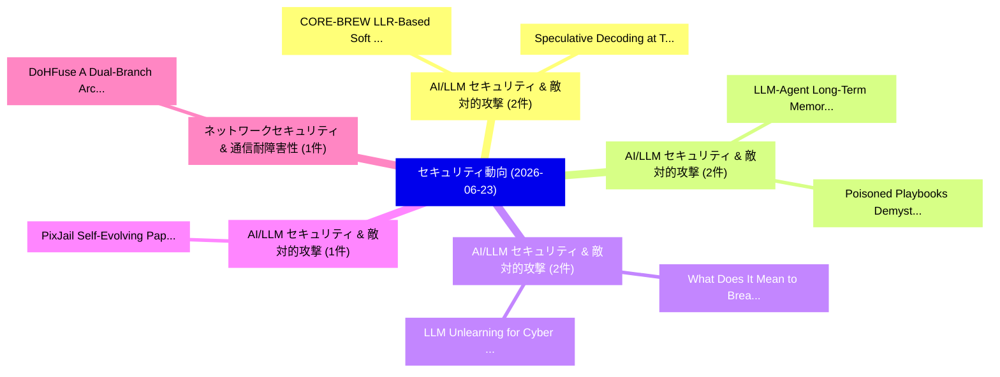

# 📅 02_daily: 日次エグゼクティブサマリー報告書 (2026-06-23)

**集計日時**: 2026-10-02 23:06:16 UTC  
**対象日付**: 2026-06-23  
**本日収集論文数**: 26 件  

---

## 💡 主要セキュリティ動向・脅威インサイト (Executive Insights)

本日の収集論文（計 26 件）において、以下の重点セキュリティ領域で活発な研究動向が確認されました：
- **AI/LLM セキュリティ & 敵対的攻撃** (2 件): 注目論文として 「CORE-BREW: LLR-Based Soft Deco...」、「Speculative Decoding at Temper...」 等が発表され、実務防御および攻撃検証の進展が見られます。
- **AI/LLM セキュリティ & 敵対的攻撃** (2 件): 注目論文として 「LLM-Agent Long-Term Memory Aga...」、「Poisoned Playbooks: Demystifyi...」 等が発表され、実務防御および攻撃検証の進展が見られます。
- **AI/LLM セキュリティ & 敵対的攻撃** (2 件): 注目論文として 「What Does It Mean to Break a D...」、「LLM Unlearning for Cyber Defen...」 等が発表され、実務防御および攻撃検証の進展が見られます。
- **AI/LLM セキュリティ & 敵対的攻撃** (1 件): 注目論文として 「PixJail: Self-Evolving Paper-t...」 等が発表され、実務防御および攻撃検証の進展が見られます。
- **ネットワークセキュリティ & 通信耐障害性** (1 件): 注目論文として 「DoHFuse: A Dual-Branch Archite...」 等が発表され、実務防御および攻撃検証の進展が見られます。

### 🗺️ 技術・脅威トピックマインドマップ

---

## 📌 日次セキュリティ論文一覧 (日本語表形式)

| No | arXiv ID | 論文タイトル (日本語訳) | 重要キーワード | 構造化エグゼクティブ要約 (背景・提案・影響) | 脅威分類 | 詳細リンク |
|---|---|---|---|---|---|---|
| 1 | `2606.24081v1` | [PixJail: Self-Evolving Paper-to-Pipeline Reproduction for Text-to-Image Jailbreak Evaluation（セキュリティ分析論文）](../../okf/papers/2026-06-23/2606.24081.md) | `Pipeline Reproduction`, `to-Pipeline Reproduction`, `Image Jailbreak Evaluatio` | 【提案】概要 (Overview & Key Finding) 本論文「PixJail: Self-Evolving Paper-to-Pipeline Reproduction f...。実証評価により経営層・セキュリティ管理者向け推奨アクション (E... | `arXiv` | [arXiv](https://arxiv.org/abs/2606.24081v1) &#124; [OKF](../../okf/papers/2026-06-23/2606.24081.md) |
| 2 | `2606.24105v1` | [DoHFuse: A Dual-Branch Architecture with DMAGLSTM for Website Fingerprinting over DNS over HTTPS/3（セキュリティ分析論文）](../../okf/papers/2026-06-23/2606.24105.md) | `Branch Architecture`, `Website Fingerprinting`, `Dual-Branch Architecture` | 【提案】概要 (Overview & Key Finding) 本論文「DoHFuse: A Dual-Branch Architecture with DMAGLSTM for W...。実証評価により経営層・セキュリティ管理者向け推奨アクション (E... | `arXiv` | [arXiv](https://arxiv.org/abs/2606.24105v1) &#124; [OKF](../../okf/papers/2026-06-23/2606.24105.md) |
| 3 | `2606.24163v1` | [CORE-BREW: LLR-Based Soft Decoding for Robust Multi-Bit LLM Watermarking（セキュリティ分析論文）](../../okf/papers/2026-06-23/2606.24163.md) | `Based Soft Decoding`, `Robust Multi`, `LLR-Based Soft` | 【提案】概要 (Overview & Key Finding) 本論文「CORE-BREW: LLR-Based Soft Decoding for Robust Multi-Bit...。実証評価により経営層・セキュリティ管理者向け推奨アクション (E... | `arXiv` | [arXiv](https://arxiv.org/abs/2606.24163v1) &#124; [OKF](../../okf/papers/2026-06-23/2606.24163.md) |
| 4 | `2606.24210v1` | [A Conditional Timing Protection Level: Holdover-Limited Undetected Time Error Under GNSS Spoofing（セキュリティ分析論文）](../../okf/papers/2026-06-23/2606.24210.md) | `Conditional Timing Protection Level`, `Holdover-Limited Undetected`, `Chakshu Baweja` | 【提案】概要 (Overview & Key Finding) 本論文「A Conditional Timing Protection Level: Holdover-Limited...。実証評価により経営層・セキュリティ管理者向け推奨アクション (E... | `arXiv` | [arXiv](https://arxiv.org/abs/2606.24210v1) &#124; [OKF](../../okf/papers/2026-06-23/2606.24210.md) |
| 5 | `2606.24213v1` | [Kops: Safely Extending the eBPF Compilation Pipeline with Native Operations（セキュリティ分析論文）](../../okf/papers/2026-06-23/2606.24213.md) | `Safely Extending`, `Compilation Pipeline`, `Native Operations` | 【提案】概要 (Overview & Key Finding) 本論文「Kops: Safely Extending the eBPF Compilation Pipeline wi...。実証評価により経営層・セキュリティ管理者向け推奨アクション (E... | `arXiv` | [arXiv](https://arxiv.org/abs/2606.24213v1) &#124; [OKF](../../okf/papers/2026-06-23/2606.24213.md) |
| 6 | `2606.24219v1` | [Decoherence as Defence and the Magnitude of Noise Regularisation: A Rigorous N -Qubit Theory of Stochastic Quantum Neural Networks for Adversarially Robust Network Intrusion Detection（セキュリティ分析論文）](../../okf/papers/2026-06-23/2606.24219.md) | `Adversarially Robust Network Intrusion Detection`, `Stochastic Quantum Neural Networks`, `Noise Regularisation` | 【提案】概要 (Overview & Key Finding) 本論文「Decoherence as Defence and the Magnitude of Noise Regul...。実証評価により経営層・セキュリティ管理者向け推奨アクション。 | `arXiv` | [arXiv](https://arxiv.org/abs/2606.24219v1) &#124; [OKF](../../okf/papers/2026-06-23/2606.24219.md) |
| 7 | `2606.24226v1` | [Inside Crypter-as-a-Service: An Ecosystem the exploit.in Underground Forum Research Talksの分析](../../okf/papers/2026-06-23/2606.24226.md) | `Inside Crypter`, `Underground Forum Research`, `Underground Forum Research Talks` | 【提案】概要 (Overview & Key Finding) 本論文「Inside Crypter-as-a-Service: An Ecosystem the エクスプロイト.i...。実証評価により経営層・セキュリティ管理者向け推奨アクション (E... | `arXiv` | [arXiv](https://arxiv.org/abs/2606.24226v1) &#124; [OKF](../../okf/papers/2026-06-23/2606.24226.md) |
| 8 | `2606.24245v3` | [AutoSpec: Safety Rule Evolution for LLMエージェント via Inductive Logic Programming](../../okf/papers/2026-06-23/2606.24245.md) | `Safety Rule Evolution`, `Inductive Logic Programming`, `Inductive Logic Progra` | 【提案】概要 (Overview & Key Finding) 本論文「AutoSpec: Safety Rule Evolution for LLMエージェント via Induc...。実証評価により経営層・セキュリティ管理者向け推奨アクション (E... | `arXiv` | [arXiv](https://arxiv.org/abs/2606.24245v3) &#124; [OKF](../../okf/papers/2026-06-23/2606.24245.md) |
| 9 | `2606.24322v1` | [LLM-Agent Long-Term Memory Against Poisoning: Non-Malleable, Origin-Bound Authority with Machine-Checked Guaranteesのセキュリティ強化](../../okf/papers/2026-06-23/2606.24322.md) | `Agent Long`, `Bound Authority`, `LLM-Agent Long` | 【提案】概要 (Overview & Key Finding) 本論文「LLM-Agent Long-Term Memory Against Poisoning: Non-Malle...。実証評価により経営層・セキュリティ管理者向け推奨アクション (E... | `arXiv` | [arXiv](https://arxiv.org/abs/2606.24322v1) &#124; [OKF](../../okf/papers/2026-06-23/2606.24322.md) |
| 10 | `2606.24379v1` | [ComputeFHE: A Privacy-Preserving General-Purpose Computation Library（セキュリティ分析論文）](../../okf/papers/2026-06-23/2606.24379.md) | `Purpose Computation Library`, `Preserving General`, `Privacy-Preserving General` | 【提案】概要 (Overview & Key Finding) 本論文「ComputeFHE: A Privacy-Preserving General-Purpose Comput...。実証評価により経営層・セキュリティ管理者向け推奨アクション (E... | `arXiv` | [arXiv](https://arxiv.org/abs/2606.24379v1) &#124; [OKF](../../okf/papers/2026-06-23/2606.24379.md) |
| 11 | `2606.24402v1` | [Poisoned Playbooks: Demystifying Knowledge Poisoning Effects on AI Security Agents（セキュリティ分析論文）](../../okf/papers/2026-06-23/2606.24402.md) | `Demystifying Knowledge Poisoning Effects`, `Poisoned Playbooks`, `Security Agents` | 【提案】概要 (Overview & Key Finding) 本論文「Poisoned Playbooks: Demystifying Knowledge Poisoning Ef...。実証評価により経営層・セキュリティ管理者向け推奨アクション (E... | `arXiv` | [arXiv](https://arxiv.org/abs/2606.24402v1) &#124; [OKF](../../okf/papers/2026-06-23/2606.24402.md) |
| 12 | `2606.24438v1` | [A Comparison of Kubernetes Compliance Standards and Configuration Scanners（セキュリティ分析論文）](../../okf/papers/2026-06-23/2606.24438.md) | `Kubernetes Compliance Standards`, `Configuration Scanners`, `Michael Krieger` | 【提案】概要 (Overview & Key Finding) 本論文「A Comparison of Kubernetes Compliance Standards and Con...。実証評価により経営層・セキュリティ管理者向け推奨アクション (E... | `arXiv` | [arXiv](https://arxiv.org/abs/2606.24438v1) &#124; [OKF](../../okf/papers/2026-06-23/2606.24438.md) |
| 13 | `2606.24471v1` | [Discrepancy for Random Linear Codes（セキュリティ分析論文）](../../okf/papers/2026-06-23/2606.24471.md) | `Random Linear Codes`, `Dean Doron`, `Tal Leonov` | 【提案】概要 (Overview & Key Finding) 本論文「Discrepancy for Random Linear Codes（セキュリティ分析論文）」（原題: Di...。実証評価により経営層・セキュリティ管理者向け推奨アクション (E... | `arXiv` | [arXiv](https://arxiv.org/abs/2606.24471v1) &#124; [OKF](../../okf/papers/2026-06-23/2606.24471.md) |
| 14 | `2606.24496v2` | [Red-Teaming the Agentic Red-Team（セキュリティ分析論文）](../../okf/papers/2026-06-23/2606.24496.md) | `Agentic Red`, `Dario Pasquini`, `Michal Bazyli` | 【提案】概要 (Overview & Key Finding) 本論文「Red-Teaming the Agentic Red-Team（セキュリティ分析論文）」（原題: Red-T...。実証評価により経営層・セキュリティ管理者向け推奨アクション (E... | `AI/ML Security` | [arXiv](https://arxiv.org/abs/2606.24496v2) &#124; [OKF](../../okf/papers/2026-06-23/2606.24496.md) |
| 15 | `2606.24549v1` | [FirmCure:Autonomous and Adaptive Rehosting of Linux-Based Firmwareに向けて](../../okf/papers/2026-06-23/2606.24549.md) | `Adaptive Rehosting`, `Towards Autonomous`, `Based Firmware` | 【提案】概要 (Overview & Key Finding) 本論文「FirmCure:Autonomous and Adaptive Rehosting of Linux-Bas...。実証評価により経営層・セキュリティ管理者向け推奨アクション (E... | `arXiv` | [arXiv](https://arxiv.org/abs/2606.24549v1) &#124; [OKF](../../okf/papers/2026-06-23/2606.24549.md) |
| 16 | `2606.24692v1` | [PowerFuzz: Power-Based Black-Box Firmware Fuzzing（セキュリティ分析論文）](../../okf/papers/2026-06-23/2606.24692.md) | `Box Firmware Fuzzing`, `Based Black`, `Power-Based Black` | 【提案】概要 (Overview & Key Finding) 本論文「PowerFuzz: Power-Based Black-Box Firmware Fuzzing（セキュリテ...。実証評価により経営層・セキュリティ管理者向け推奨アクション (E... | `arXiv` | [arXiv](https://arxiv.org/abs/2606.24692v1) &#124; [OKF](../../okf/papers/2026-06-23/2606.24692.md) |
| 17 | `2606.24736v1` | [On the Limits of Stretching Quantum Pseudorandomness（セキュリティ分析論文）](../../okf/papers/2026-06-23/2606.24736.md) | `Stretching Quantum Pseudorandomness`, `Boyang Chen`, `Andrea Coladangelo` | 【提案】概要 (Overview & Key Finding) 本論文「On the Limits of Stretching 量子 Pseudorandomness（セキュリティ分...。実証評価により経営層・セキュリティ管理者向け推奨アクション (E... | `arXiv` | [arXiv](https://arxiv.org/abs/2606.24736v1) &#124; [OKF](../../okf/papers/2026-06-23/2606.24736.md) |
| 18 | `2606.24778v1` | [Burnyard: Future of Malware Analysis（セキュリティ分析論文）](../../okf/papers/2026-06-23/2606.24778.md) | `Rama Ramana Sharma Parnandi`, `Carter Yagemann`, `Raw Meta` | 【提案】概要 (Overview & Key Finding) 本論文「Burnyard: Future of マルウェア Analysis（セキュリティ分析論文）」（原題: Bur...。実証評価により経営層・セキュリティ管理者向け推奨アクション (E... | `arXiv` | [arXiv](https://arxiv.org/abs/2606.24778v1) &#124; [OKF](../../okf/papers/2026-06-23/2606.24778.md) |
| 19 | `2606.24819v1` | [HelpBench: Assessing the Ability of LLMs to Provide Privacy, Safety, and Security Advice（セキュリティ分析論文）](../../okf/papers/2026-06-23/2606.24819.md) | `Provide Privacy`, `Security Advice`, `Patrick Gage Kelley` | 【提案】概要 (Overview & Key Finding) 本論文「HelpBench: Assessing the Ability of LLMs to Provide Pri...。実証評価により経営層・セキュリティ管理者向け推奨アクション (E... | `arXiv` | [arXiv](https://arxiv.org/abs/2606.24819v1) &#124; [OKF](../../okf/papers/2026-06-23/2606.24819.md) |
| 20 | `2606.25004v1` | [Certification of Machine Learning Models via Directional Sharpness（セキュリティ分析論文）](../../okf/papers/2026-06-23/2606.25004.md) | `Machine Learning Models`, `Directional Sharpness`, `Gefei Tan` | 【提案】概要 (Overview & Key Finding) 本論文「Certification of Machine Learning Models via Directiona...。実証評価により経営層・セキュリティ管理者向け推奨アクション (E... | `arXiv` | [arXiv](https://arxiv.org/abs/2606.25004v1) &#124; [OKF](../../okf/papers/2026-06-23/2606.25004.md) |
| 21 | `2606.25059v2` | [What Does It Mean to Break a Distillation Defense?（セキュリティ分析論文）](../../okf/papers/2026-06-23/2606.25059.md) | `Distillation Defense`, `Lena Libon`, `Pura Peetathawatchai` | 【提案】### (日本語題名: What Does It Mean to Break a Distillation Defense?（セキュリティ分析論文）)  > [!NOTE] ...。実証評価により経営層・セキュリティ管理者向け推奨アクション (E... | `arXiv` | [arXiv](https://arxiv.org/abs/2606.25059v2) &#124; [OKF](../../okf/papers/2026-06-23/2606.25059.md) |
| 22 | `2606.25097v1` | [Speculative Decoding at Temperature Zero: A Scoped Safety-Invariance Screen with a 48,072-Sample Expansion（セキュリティ分析論文）](../../okf/papers/2026-06-23/2606.25097.md) | `Speculative Decoding`, `Temperature Zero`, `Scoped Safety` | 【提案】概要 (Overview & Key Finding) 本論文「Speculative Decoding at Temperature Zero: A Scoped Safe...。実証評価により経営層・セキュリティ管理者向け推奨アクション (E... | `arXiv` | [arXiv](https://arxiv.org/abs/2606.25097v1) &#124; [OKF](../../okf/papers/2026-06-23/2606.25097.md) |
| 23 | `2606.25195v1` | [SoK: AI Secure Code Generation: Progress, Pitfalls, and Paths Forward（セキュリティ分析論文）](../../okf/papers/2026-06-23/2606.25195.md) | `Secure Code Generation`, `Paths Forward`, `Rupam Patir` | 【提案】概要 (Overview & Key Finding) 本論文「SoK: AI Secure Code Generation: Progress, Pitfalls, and...。実証評価により経営層・セキュリティ管理者向け推奨アクション (E... | `arXiv` | [arXiv](https://arxiv.org/abs/2606.25195v1) &#124; [OKF](../../okf/papers/2026-06-23/2606.25195.md) |
| 24 | `2606.25216v1` | [Homomorphic Encryptions for Privacy Preserving Vision（セキュリティ分析論文）](../../okf/papers/2026-06-23/2606.25216.md) | `Privacy Preserving Vision`, `Homomorphic Encryptions`, `Preey Shah` | 【提案】概要 (Overview & Key Finding) 本論文「Homomorphic Encryptions for Privacy Preserving Vision（セ...。実証評価により経営層・セキュリティ管理者向け推奨アクション (E... | `arXiv` | [arXiv](https://arxiv.org/abs/2606.25216v1) &#124; [OKF](../../okf/papers/2026-06-23/2606.25216.md) |
| 25 | `2607.16227v1` | [LLM Unlearning for Cyber Defense: A Survey on Methods, Challenges, and Emerging Threats（セキュリティ分析論文）](../../okf/papers/2026-06-23/2607.16227.md) | `Cyber Defense`, `Emerging Threats`, `Ruppikha Sree Shankar` | 【提案】概要 (Overview & Key Finding) 本論文「LLM Unlearning for Cyber Defense: A Survey on Methods, ...。実証評価により経営層・セキュリティ管理者向け推奨アクション (E... | `arXiv` | [arXiv](https://arxiv.org/abs/2607.16227v1) &#124; [OKF](../../okf/papers/2026-06-23/2607.16227.md) |
| 26 | `2607.26069v1` | [AI Security Priorities: A Field-Wide Agenda（セキュリティ分析論文）](../../okf/papers/2026-06-23/2607.26069.md) | `Security Priorities`, `Wide Agenda`, `Field-Wide Agenda` | 【提案】概要 (Overview & Key Finding) 本論文「AI Security Priorities: A Field-Wide Agenda（セキュリティ分析論文）...。実証評価により経営層・セキュリティ管理者向け推奨アクション (E... | `arXiv` | [arXiv](https://arxiv.org/abs/2607.26069v1) &#124; [OKF](../../okf/papers/2026-06-23/2607.26069.md) |

