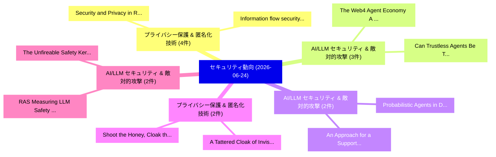

# 📅 02_daily: 日次エグゼクティブサマリー報告書 (2026-06-24)

**集計日時**: 2026-10-02 23:06:16 UTC  
**対象日付**: 2026-06-24  
**本日収集論文数**: 46 件  

---

## 💡 主要セキュリティ動向・脅威インサイト (Executive Insights)

本日の収集論文（計 46 件）において、以下の重点セキュリティ領域で活発な研究動向が確認されました：
- **プライバシー保護 & 匿名化技術** (4 件): 注目論文として 「Information flow security on p...」、「Security and Privacy in Retrie...」 等が発表され、実務防御および攻撃検証の進展が見られます。
- **AI/LLM セキュリティ & 敵対的攻撃** (3 件): 注目論文として 「The Web4 Agent Economy: A Larg...」、「Can Trustless Agents Be Truste...」 等が発表され、実務防御および攻撃検証の進展が見られます。
- **AI/LLM セキュリティ & 敵対的攻撃** (2 件): 注目論文として 「An Approach for a Supporting M...」、「Probabilistic Agents in Determ...」 等が発表され、実務防御および攻撃検証の進展が見られます。
- **プライバシー保護 & 匿名化技術** (2 件): 注目論文として 「Shoot the Honey, Cloak the Pla...」、「A Tattered Cloak of Invisibili...」 等が発表され、実務防御および攻撃検証の進展が見られます。
- **AI/LLM セキュリティ & 敵対的攻撃** (2 件): 注目論文として 「RAS: Measuring LLM Safety Thro...」、「The Unfireable Safety Kernel: ...」 等が発表され、実務防御および攻撃検証の進展が見られます。

### 🗺️ 技術・脅威トピックマインドマップ

---

## 📌 日次セキュリティ論文一覧 (日本語表形式)

| No | arXiv ID | 論文タイトル (日本語訳) | 重要キーワード | 構造化エグゼクティブ要約 (背景・提案・影響) | 脅威分類 | 詳細リンク |
|---|---|---|---|---|---|---|
| 1 | `2606.25248v1` | [Sponsored Group Signature and its Application to Privacy-preserving Guest Access in Smart Environments（セキュリティ分析論文）](../../okf/papers/2026-06-24/2606.25248.md) | `Sponsored Group Signature`, `Guest Access`, `Privacy-preserving Guest` | 【提案】概要 (Overview & Key Finding) 本論文「Sponsored Group Signature and its Application to Privac...。実証評価により経営層・セキュリティ管理者向け推奨アクション (E... | `arXiv` | [arXiv](https://arxiv.org/abs/2606.25248v1) &#124; [OKF](../../okf/papers/2026-06-24/2606.25248.md) |
| 2 | `2606.25332v1` | [Decoupling Reconnaissance and Exploitation: Measuring the Capability Boundaries of LLM-Based Web Penetration Testing（セキュリティ分析論文）](../../okf/papers/2026-06-24/2606.25332.md) | `Based Web Penetration Testing`, `Decoupling Reconnaissance`, `Capability Boundaries` | 【提案】概要 (Overview & Key Finding) 本論文「Decoupling Reconnaissance and Exploitation: Measuring t...。実証評価により経営層・セキュリティ管理者向け推奨アクション (E... | `arXiv` | [arXiv](https://arxiv.org/abs/2606.25332v1) &#124; [OKF](../../okf/papers/2026-06-24/2606.25332.md) |
| 3 | `2606.25349v2` | [General Techniques for Reducing Key-Switching Overhead in Privacy-Preserving Two-Party Transformer Inference（セキュリティ分析論文）](../../okf/papers/2026-06-24/2606.25349.md) | `Party Transformer Inference`, `General Techniques`, `Reducing Key` | 【提案】概要 (Overview & Key Finding) 本論文「General Techniques for Reducing Key-Switching Overhead ...。実証評価により経営層・セキュリティ管理者向け推奨アクション (E... | `arXiv` | [arXiv](https://arxiv.org/abs/2606.25349v2) &#124; [OKF](../../okf/papers/2026-06-24/2606.25349.md) |
| 4 | `2606.25356v1` | [Representation Matters: Program Representations for LLM Vulnerability Reasoningの実証研究](../../okf/papers/2026-06-24/2606.25356.md) | `Representation Matters`, `Program Representations`, `Vulnerability Reasoning` | 【提案】概要 (Overview & Key Finding) 本論文「Representation Matters: Program Representations for LLM...。実証評価により経営層・セキュリティ管理者向け推奨アクション (E... | `arXiv` | [arXiv](https://arxiv.org/abs/2606.25356v1) &#124; [OKF](../../okf/papers/2026-06-24/2606.25356.md) |
| 5 | `2606.25422v1` | [Information flow security on persistent memory（セキュリティ分析論文）](../../okf/papers/2026-06-24/2606.25422.md) | `Graeme Smith`, `Raw Meta`, `Executive Summary` | 【提案】概要 (Overview & Key Finding) 本論文「Information flow security on persistent memory（セキュリティ分析...。実証評価により経営層・セキュリティ管理者向け推奨アクション (E... | `arXiv` | [arXiv](https://arxiv.org/abs/2606.25422v1) &#124; [OKF](../../okf/papers/2026-06-24/2606.25422.md) |
| 6 | `2606.25487v2` | [How Reliable Is Your Jailbreak Judge? Calibration and Adversarial Robustness of Automated ASR Scoring（セキュリティ分析論文）](../../okf/papers/2026-06-24/2606.25487.md) | `Adversarial Robustness`, `Yang Gao`, `Raw Meta` | 【提案】Calibration and Adversarial Robustness of Automated ASR Scoring ### (日本語題名: How Reliabl...。実証評価により経営層・セキュリティ管理者向け推奨アクション (E... | `arXiv` | [arXiv](https://arxiv.org/abs/2606.25487v2) &#124; [OKF](../../okf/papers/2026-06-24/2606.25487.md) |
| 7 | `2606.25533v1` | [Security and Privacy in Retrieval-Augmented Generation: Architectures, Threats, Defenses, and Future Directions for Building Trustworthy Systems（セキュリティ分析論文）](../../okf/papers/2026-06-24/2606.25533.md) | `Building Trustworthy Systems`, `Augmented Generation`, `Future Directions` | 【提案】概要 (Overview & Key Finding) 本論文「Security and Privacy in Retrieval-Augmented Generation:...。実証評価により経営層・セキュリティ管理者向け推奨アクション (E... | `arXiv` | [arXiv](https://arxiv.org/abs/2606.25533v1) &#124; [OKF](../../okf/papers/2026-06-24/2606.25533.md) |
| 8 | `2606.25561v1` | [CrypFormBench: Formal Analysis Capability of Large Language Models for Cryptographic Schemesのベンチマーク評価](../../okf/papers/2026-06-24/2606.25561.md) | `Large Language Models`, `Cryptographic Schemes`, `Zhaoxuan Li` | 【提案】概要 (Overview & Key Finding) 本論文「CrypFormBench: Formal Analysis Capability of Large Lang...。実証評価により経営層・セキュリティ管理者向け推奨アクション (E... | `arXiv` | [arXiv](https://arxiv.org/abs/2606.25561v1) &#124; [OKF](../../okf/papers/2026-06-24/2606.25561.md) |
| 9 | `2606.25589v1` | [Leaking Circuit Secrets: Gradient Leakage Attacks on Graph Neural Networks（セキュリティ分析論文）](../../okf/papers/2026-06-24/2606.25589.md) | `Leaking Circuit Secrets`, `Gradient Leakage Attacks`, `Graph Neural Networks` | 【提案】概要 (Overview & Key Finding) 本論文「Leaking Circuit Secrets: Gradient Leakage Attacks on Gr...。実証評価により経営層・セキュリティ管理者向け推奨アクション (E... | `arXiv` | [arXiv](https://arxiv.org/abs/2606.25589v1) &#124; [OKF](../../okf/papers/2026-06-24/2606.25589.md) |
| 10 | `2606.25608v1` | [An Approach for a Supporting Multi-LLM System for Automated Certification Based on the German IT-Grundschutz（セキュリティ分析論文）](../../okf/papers/2026-06-24/2606.25608.md) | `Automated Certification Based`, `Supporting Multi`, `Multi-LLM System` | 【提案】概要 (Overview & Key Finding) 本論文「An Approach for a Supporting Multi-LLM System for Autom...。実証評価により経営層・セキュリティ管理者向け推奨アクション (E... | `arXiv` | [arXiv](https://arxiv.org/abs/2606.25608v1) &#124; [OKF](../../okf/papers/2026-06-24/2606.25608.md) |
| 11 | `2606.25622v1` | [Probabilistic Agents in Deterministic Audits: Evaluating Multi-Agent Systems for Automated Audits Based on the German IT-Grundschutz（セキュリティ分析論文）](../../okf/papers/2026-06-24/2606.25622.md) | `Automated Audits Based`, `Probabilistic Agents`, `Deterministic Audits` | 【提案】概要 (Overview & Key Finding) 本論文「Probabilistic Agents in Deterministic Audits: Evaluatin...。実証評価により経営層・セキュリティ管理者向け推奨アクション (E... | `arXiv` | [arXiv](https://arxiv.org/abs/2606.25622v1) &#124; [OKF](../../okf/papers/2026-06-24/2606.25622.md) |
| 12 | `2606.25627v1` | [TL++: Accuracy and Privacy Preserving Traversal Learning for Distributed Intelligent Systems（セキュリティ分析論文）](../../okf/papers/2026-06-24/2606.25627.md) | `Privacy Preserving Traversal Learning`, `Distributed Intelligent Systems`, `Erdenebileg Batbaatar` | 【提案】概要 (Overview & Key Finding) 本論文「TL++: Accuracy and Privacy Preserving Traversal Learnin...。実証評価により経営層・セキュリティ管理者向け推奨アクション (E... | `arXiv` | [arXiv](https://arxiv.org/abs/2606.25627v1) &#124; [OKF](../../okf/papers/2026-06-24/2606.25627.md) |
| 13 | `2606.25645v1` | [Taxonomy of Risks on Automated Fact-Checking Systems Considering its Propagation（セキュリティ分析論文）](../../okf/papers/2026-06-24/2606.25645.md) | `Checking Systems Considering`, `Automated Fact`, `Fact-Checking Systems` | 【提案】概要 (Overview & Key Finding) 本論文「Taxonomy of Risks on Automated Fact-Checking Systems Co...。実証評価により経営層・セキュリティ管理者向け推奨アクション (E... | `arXiv` | [arXiv](https://arxiv.org/abs/2606.25645v1) &#124; [OKF](../../okf/papers/2026-06-24/2606.25645.md) |
| 14 | `2606.25721v1` | [Tracing Target Answers in Poisoned Retrieval Corpora via Token Influence Attribution（セキュリティ分析論文）](../../okf/papers/2026-06-24/2606.25721.md) | `Tracing Target Answers`, `Poisoned Retrieval Corpora`, `Token Influence Attribution` | 【提案】概要 (Overview & Key Finding) 本論文「Tracing Target Answers in Poisoned Retrieval Corpora vi...。実証評価により経営層・セキュリティ管理者向け推奨アクション (E... | `arXiv` | [arXiv](https://arxiv.org/abs/2606.25721v1) &#124; [OKF](../../okf/papers/2026-06-24/2606.25721.md) |
| 15 | `2606.25734v1` | [Shoot the Honey, Cloak the Player: Zero-Runtime-Overhead Proactive Defense and Detection for Visual Game Cheatingに向けて](../../okf/papers/2026-06-24/2606.25734.md) | `Overhead Proactive Defense`, `Visual Game Cheating`, `Towards Zero` | 【提案】概要 (Overview & Key Finding) 本論文「Shoot the Honey, Cloak the Player: Zero-Runtime-Overhea...。実証評価により経営層・セキュリティ管理者向け推奨アクション (E... | `arXiv` | [arXiv](https://arxiv.org/abs/2606.25734v1) &#124; [OKF](../../okf/papers/2026-06-24/2606.25734.md) |
| 16 | `2606.25750v1` | [RAS: Measuring LLM Safety Through Refusal Alignment（セキュリティ分析論文）](../../okf/papers/2026-06-24/2606.25750.md) | `Chieh Huang`, `Lun Chen`, `Mu Yu` | 【提案】概要 (Overview & Key Finding) 本論文「RAS: Measuring LLM Safety Through Refusal Alignment（セキュ...。実証評価により経営層・セキュリティ管理者向け推奨アクション (E... | `arXiv` | [arXiv](https://arxiv.org/abs/2606.25750v1) &#124; [OKF](../../okf/papers/2026-06-24/2606.25750.md) |
| 17 | `2606.25756v1` | [Space-based Missile Defense（セキュリティ分析論文）](../../okf/papers/2026-06-24/2606.25756.md) | `Missile Defense`, `Space-based Missile`, `David Wright` | 【提案】概要 (Overview & Key Finding) 本論文「Space-based Missile Defense（セキュリティ分析論文）」（原題: Space-base...。実証評価により経営層・セキュリティ管理者向け推奨アクション (E... | `arXiv` | [arXiv](https://arxiv.org/abs/2606.25756v1) &#124; [OKF](../../okf/papers/2026-06-24/2606.25756.md) |
| 18 | `2606.25788v1` | [Can Machine Learning Break Wi-Fi Privacy? A Study on MAC Address Randomization（セキュリティ分析論文）](../../okf/papers/2026-06-24/2606.25788.md) | `Can Machine Learning Break Wi`, `Fi Privacy`, `Wi-Fi Privacy` | 【提案】A Study on MAC Address Randomization ### (日本語題名: Can Machine Learning Break Wi-Fi Privacy?。実証評価により経営層・セキュリティ管理者向け推奨アクション (E... | `arXiv` | [arXiv](https://arxiv.org/abs/2606.25788v1) &#124; [OKF](../../okf/papers/2026-06-24/2606.25788.md) |
| 19 | `2606.25858v1` | [Color Matters: Trigger Color Affects Success in Federated Backdoor Attacks（セキュリティ分析論文）](../../okf/papers/2026-06-24/2606.25858.md) | `Trigger Color Affects Success`, `Federated Backdoor Attacks`, `Color Matters` | 【提案】概要 (Overview & Key Finding) 本論文「Color Matters: Trigger Color Affects Success in Federat...。実証評価により経営層・セキュリティ管理者向け推奨アクション (E... | `arXiv` | [arXiv](https://arxiv.org/abs/2606.25858v1) &#124; [OKF](../../okf/papers/2026-06-24/2606.25858.md) |
| 20 | `2606.25863v1` | [Automated Configuration-Specific Security Vulnerabilities via Patch Analysisの検出](../../okf/papers/2026-06-24/2606.25863.md) | `Specific Security Vulnerabilities`, `Configuration-Specific Security`, `Automated Configuration` | 【提案】概要 (Overview & Key Finding) 本論文「Automated Configuration-Specific Security Vulnerabiliti...。実証評価により経営層・セキュリティ管理者向け推奨アクション (E... | `arXiv` | [arXiv](https://arxiv.org/abs/2606.25863v1) &#124; [OKF](../../okf/papers/2026-06-24/2606.25863.md) |
| 21 | `2606.25876v1` | [The Web4 Agent Economy: A Large-Scale Empirical Study of the Landscape, Challenges, and Opportunities（セキュリティ分析論文）](../../okf/papers/2026-06-24/2606.25876.md) | `Large-Scale Empirical`, `Yuhan Jin`, `Shuohan Wu` | 【提案】概要 (Overview & Key Finding) 本論文「The Web4 Agent Economy: A Large-Scale Empirical Study o...。実証評価により経営層・セキュリティ管理者向け推奨アクション (E... | `arXiv` | [arXiv](https://arxiv.org/abs/2606.25876v1) &#124; [OKF](../../okf/papers/2026-06-24/2606.25876.md) |
| 22 | `2606.25926v1` | [A Tattered Cloak of Invisibility: Measuring Anonymity Loss in Railgun on Ethereum（セキュリティ分析論文）](../../okf/papers/2026-06-24/2606.25926.md) | `Measuring Anonymity Loss`, `Tattered Cloak`, `Kanan Huseynov` | 【提案】概要 (Overview & Key Finding) 本論文「A Tattered Cloak of Invisibility: Measuring Anonymity L...。実証評価により経営層・セキュリティ管理者向け推奨アクション (E... | `arXiv` | [arXiv](https://arxiv.org/abs/2606.25926v1) &#124; [OKF](../../okf/papers/2026-06-24/2606.25926.md) |
| 23 | `2606.25950v1` | [Do (Not) Tell Me About My Insecurities: Assessing the Status Quo of Coordinated Vulnerability Disclosure in Germany Amid New EU サイバーセキュリティ Regulations](../../okf/papers/2026-06-24/2606.25950.md) | `Coordinated Vulnerability Disclosure`, `Germany Amid New`, `Status Quo` | 【提案】背景とセキュリティ上の課題 (Background & Problem) 本研究はサイバー脅威環境におけるセキュリティ構造・脆弱性の検証を目的としています。(主要検出項目: ...。実証評価により経営層・セキュリティ管理者向け推奨アクション (E... | `arXiv` | [arXiv](https://arxiv.org/abs/2606.25950v1) &#124; [OKF](../../okf/papers/2026-06-24/2606.25950.md) |
| 24 | `2606.25998v2` | [BlowLive: Blow-Based Multi-Factor Biometrics with Liveness Detection and Revocability（セキュリティ分析論文）](../../okf/papers/2026-06-24/2606.25998.md) | `Based Multi`, `Factor Biometrics`, `Blow-Based Multi` | 【提案】概要 (Overview & Key Finding) 本論文「BlowLive: Blow-Based Multi-Factor Biometrics with Liven...。実証評価により経営層・セキュリティ管理者向け推奨アクション (E... | `arXiv` | [arXiv](https://arxiv.org/abs/2606.25998v2) &#124; [OKF](../../okf/papers/2026-06-24/2606.25998.md) |
| 25 | `2606.26021v1` | [Privacy Vulnerabilities of Attention Layers in Tabular Foundation Models and Protection of High-Risk Queries（セキュリティ分析論文）](../../okf/papers/2026-06-24/2606.26021.md) | `Tabular Foundation Models`, `Privacy Vulnerabilities`, `Attention Layers` | 【提案】概要 (Overview & Key Finding) 本論文「Privacy Vulnerabilities of Attention Layers in Tabular ...。実証評価により経営層・セキュリティ管理者向け推奨アクション (E... | `arXiv` | [arXiv](https://arxiv.org/abs/2606.26021v1) &#124; [OKF](../../okf/papers/2026-06-24/2606.26021.md) |
| 26 | `2606.26028v2` | [Can Trustless Agents Be Trusted? the ERC-8004 Decentralized AI Agent Ecosystemの実証研究](../../okf/papers/2026-06-24/2606.26028.md) | `ERC-8004 Decentralized`, `Agent Ecosystem`, `Xihan Xiong` | 【提案】An Empirical Study of the ERC-8004 Decentralized AI Agent Ecosystem ### (日本語題名: Can Tru...。実証評価により経営層・セキュリティ管理者向け推奨アクション (E... | `arXiv` | [arXiv](https://arxiv.org/abs/2606.26028v2) &#124; [OKF](../../okf/papers/2026-06-24/2606.26028.md) |
| 27 | `2606.26036v1` | [Detect, Unlearn, Restore: Defending Text Summarization Models Against Data Poisoning（セキュリティ分析論文）](../../okf/papers/2026-06-24/2606.26036.md) | `Poojitha Thota`, `Shirin Nilizadeh`, `Raw Meta` | 【提案】概要 (Overview & Key Finding) 本論文「Detect, Unlearn, Restore: Defending Text Summarization ...。実証評価により経営層・セキュリティ管理者向け推奨アクション (E... | `arXiv` | [arXiv](https://arxiv.org/abs/2606.26036v1) &#124; [OKF](../../okf/papers/2026-06-24/2606.26036.md) |
| 28 | `2606.26057v1` | [The Unfireable Safety Kernel: Execution-Time AI Alignment for AI Agents and Other Escapable AI Systems（セキュリティ分析論文）](../../okf/papers/2026-06-24/2606.26057.md) | `Execution-Time AI`, `Seth Dobrin`, `Raw Meta` | 【提案】概要 (Overview & Key Finding) 本論文「The Unfireable Safety Kernel: Execution-Time AI Alignme...。実証評価により経営層・セキュリティ管理者向け推奨アクション (E... | `arXiv` | [arXiv](https://arxiv.org/abs/2606.26057v1) &#124; [OKF](../../okf/papers/2026-06-24/2606.26057.md) |
| 29 | `2606.26192v1` | [Federated Hash Projected Latent Factor Learning（セキュリティ分析論文）](../../okf/papers/2026-06-24/2606.26192.md) | `Federated Hash Projected Latent Factor Learning`, `Raw Meta`, `Executive Summary` | 【提案】概要 (Overview & Key Finding) 本論文「Federated Hash Projected Latent Factor Learning（セキュリティ分...。実証評価により経営層・セキュリティ管理者向け推奨アクション (E... | `arXiv` | [arXiv](https://arxiv.org/abs/2606.26192v1) &#124; [OKF](../../okf/papers/2026-06-24/2606.26192.md) |
| 30 | `2606.26199v2` | [MIRAGE: Protecting against Malicious Image Editing via False Moderation（セキュリティ分析論文）](../../okf/papers/2026-06-24/2606.26199.md) | `Malicious Image Editing`, `False Moderation`, `Anshul Nasery` | 【提案】概要 (Overview & Key Finding) 本論文「MIRAGE: Protecting against Malicious Image Editing via ...。実証評価により経営層・セキュリティ管理者向け推奨アクション (E... | `arXiv` | [arXiv](https://arxiv.org/abs/2606.26199v2) &#124; [OKF](../../okf/papers/2026-06-24/2606.26199.md) |
| 31 | `2606.26207v1` | [The Role of Input Dimensionality in the Emergence and Targeted Control of Adversarial Examples（セキュリティ分析論文）](../../okf/papers/2026-06-24/2606.26207.md) | `Input Dimensionality`, `Targeted Control`, `Adversarial Examples` | 【提案】概要 (Overview & Key Finding) 本論文「The Role of Input Dimensionality in the Emergence and T...。実証評価により経営層・セキュリティ管理者向け推奨アクション (E... | `arXiv` | [arXiv](https://arxiv.org/abs/2606.26207v1) &#124; [OKF](../../okf/papers/2026-06-24/2606.26207.md) |
| 32 | `2606.26211v1` | [Data Facts: A Metadata Schema for Structured Data Exchange in the NANDini Multi-Agent Ecosystem（セキュリティ分析論文）](../../okf/papers/2026-06-24/2606.26211.md) | `Structured Data Exchange`, `Data Facts`, `Metadata Schema` | 【提案】概要 (Overview & Key Finding) 本論文「Data Facts: A Metadata Schema for Structured Data Excha...。実証評価により経営層・セキュリティ管理者向け推奨アクション (E... | `arXiv` | [arXiv](https://arxiv.org/abs/2606.26211v1) &#124; [OKF](../../okf/papers/2026-06-24/2606.26211.md) |
| 33 | `2606.26216v1` | [CyberChainBench: Can AI Agents Secure Smart Contracts Against Real-World On-Chain Vulnerabilities?（セキュリティ分析論文）](../../okf/papers/2026-06-24/2606.26216.md) | `Chain Vulnerabilities`, `Jintao Huang`, `Fengqing Jiang` | 【提案】### (日本語題名: CyberChainBench: Can AI Agents Secure スマートコントラクトs Against Real-World On-Cha...。実証評価により経営層・セキュリティ管理者向け推奨アクション (E... | `arXiv` | [arXiv](https://arxiv.org/abs/2606.26216v1) &#124; [OKF](../../okf/papers/2026-06-24/2606.26216.md) |
| 34 | `2606.26276v3` | [Expecting (Targeted Ads)? Network User Health Data Leakage in Fertility Tracking Appsの分析](../../okf/papers/2026-06-24/2606.26276.md) | `Targeted Ads`, `Network User Health Data Leakage`, `User Health Data Leakage` | 【提案】Network Analysis of User Health Data Leakage in Fertility Tracking Apps ### (日本語題名: Exp...。実証評価により経営層・セキュリティ管理者向け推奨アクション (E... | `arXiv` | [arXiv](https://arxiv.org/abs/2606.26276v3) &#124; [OKF](../../okf/papers/2026-06-24/2606.26276.md) |
| 35 | `2606.26285v1` | [TEMPO-Diffusion: Temporally Exposed Malicious Poisoning of Diffusion Models（セキュリティ分析論文）](../../okf/papers/2026-06-24/2606.26285.md) | `Temporally Exposed Malicious Poisoning`, `Diffusion Models`, `William Aiken` | 【提案】概要 (Overview & Key Finding) 本論文「TEMPO-Diffusion: Temporally Exposed Malicious Poisoning...。実証評価により経営層・セキュリティ管理者向け推奨アクション (E... | `arXiv` | [arXiv](https://arxiv.org/abs/2606.26285v1) &#124; [OKF](../../okf/papers/2026-06-24/2606.26285.md) |
| 36 | `2606.26291v1` | [Beyond Takedown: Measuring Malicious Go Module Persistence in the Wild（セキュリティ分析論文）](../../okf/papers/2026-06-24/2606.26291.md) | `Measuring Malicious Go Module Persistence`, `Beyond Takedown`, `Minjae Bae` | 【提案】概要 (Overview & Key Finding) 本論文「Beyond Takedown: Measuring Malicious Go Module Persiste...。実証評価により経営層・セキュリティ管理者向け推奨アクション (E... | `arXiv` | [arXiv](https://arxiv.org/abs/2606.26291v1) &#124; [OKF](../../okf/papers/2026-06-24/2606.26291.md) |
| 37 | `2606.26298v1` | [Governing Actions, Not Agents: Institutional Attestation as a Governance Model for Autonomous AI Systems（セキュリティ分析論文）](../../okf/papers/2026-06-24/2606.26298.md) | `Governing Actions`, `Institutional Attestation`, `Governance Model` | 【提案】背景とセキュリティ上の課題 (Background & Problem) 本研究はサイバー脅威環境におけるセキュリティ構造・脆弱性の検証を目的としています。(主要検出項目: ...。実証評価により経営層・セキュリティ管理者向け推奨アクション (E... | `arXiv` | [arXiv](https://arxiv.org/abs/2606.26298v1) &#124; [OKF](../../okf/papers/2026-06-24/2606.26298.md) |
| 38 | `2606.26373v4` | [Hybrid privacy-aware semantic search: SVD-truncated document geometry and CKKS-encrypted query reranking under a restricted threat model（セキュリティ分析論文）](../../okf/papers/2026-06-24/2606.26373.md) | `privacy-aware semantic`, `SVD-truncated document`, `CKKS-encrypted query` | 【提案】概要 (Overview & Key Finding) 本論文「Hybrid privacy-aware semantic search: SVD-truncated doc...。実証評価により経営層・セキュリティ管理者向け推奨アクション (E... | `arXiv` | [arXiv](https://arxiv.org/abs/2606.26373v4) &#124; [OKF](../../okf/papers/2026-06-24/2606.26373.md) |
| 39 | `2606.26377v1` | [Verifying Intent and Harm: A Unified Defense Against LLM-Generated Threats（セキュリティ分析論文）](../../okf/papers/2026-06-24/2606.26377.md) | `Verifying Intent`, `Generated Threats`, `LLM-Generated Threats` | 【提案】概要 (Overview & Key Finding) 本論文「Verifying Intent and Harm: A Unified Defense Against LL...。実証評価により経営層・セキュリティ管理者向け推奨アクション (E... | `arXiv` | [arXiv](https://arxiv.org/abs/2606.26377v1) &#124; [OKF](../../okf/papers/2026-06-24/2606.26377.md) |
| 40 | `2606.26385v1` | [Query Cost Model Calibration in Confidential Virtual Machines（セキュリティ分析論文）](../../okf/papers/2026-06-24/2606.26385.md) | `Query Cost Model Calibration`, `Confidential Virtual Machines`, `Qihan Zhang` | 【提案】概要 (Overview & Key Finding) 本論文「Query Cost Model Calibration in Confidential Virtual Ma...。実証評価により経営層・セキュリティ管理者向け推奨アクション (E... | `arXiv` | [arXiv](https://arxiv.org/abs/2606.26385v1) &#124; [OKF](../../okf/papers/2026-06-24/2606.26385.md) |
| 41 | `2606.26390v1` | [Lessons from the Adoption and Deprecation of the Privacy Sandbox Web APIs（セキュリティ分析論文）](../../okf/papers/2026-06-24/2606.26390.md) | `Privacy Sandbox Web`, `Yohan Beugin`, `Paul Barford` | 【提案】概要 (Overview & Key Finding) 本論文「Lessons from the Adoption and Deprecation of the Privac...。実証評価により経営層・セキュリティ管理者向け推奨アクション (E... | `arXiv` | [arXiv](https://arxiv.org/abs/2606.26390v1) &#124; [OKF](../../okf/papers/2026-06-24/2606.26390.md) |
| 42 | `2606.26412v1` | [What Browsers Do in the Shaders: A Measurement Study of WebGPU Privacy（セキュリティ分析論文）](../../okf/papers/2026-06-24/2606.26412.md) | `Igor Santos`, `Raw Meta`, `Executive Summary` | 【提案】概要 (Overview & Key Finding) 本論文「What Browsers Do in the Shaders: A Measurement Study of...。実証評価により経営層・セキュリティ管理者向け推奨アクション (E... | `arXiv` | [arXiv](https://arxiv.org/abs/2606.26412v1) &#124; [OKF](../../okf/papers/2026-06-24/2606.26412.md) |
| 43 | `2606.26426v1` | [Nanoelectromechanical Systems (NEMS) for Hardware Security in Advanced Packaging（セキュリティ分析論文）](../../okf/papers/2026-06-24/2606.26426.md) | `Nanoelectromechanical Systems`, `Hardware Security`, `Advanced Packaging` | 【提案】概要 (Overview & Key Finding) 本論文「Nanoelectromechanical Systems (NEMS) for Hardware Secur...。実証評価により経営層・セキュリティ管理者向け推奨アクション (E... | `arXiv` | [arXiv](https://arxiv.org/abs/2606.26426v1) &#124; [OKF](../../okf/papers/2026-06-24/2606.26426.md) |
| 44 | `2606.26449v1` | [ProvenAI: Provenance-Native Traces of Evidence in Generated Answers（セキュリティ分析論文）](../../okf/papers/2026-06-24/2606.26449.md) | `Native Traces`, `Generated Answers`, `Provenance-Native Traces` | 【提案】概要 (Overview & Key Finding) 本論文「ProvenAI: Provenance-Native Traces of Evidence in Gener...。実証評価により経営層・セキュリティ管理者向け推奨アクション (E... | `arXiv` | [arXiv](https://arxiv.org/abs/2606.26449v1) &#124; [OKF](../../okf/papers/2026-06-24/2606.26449.md) |
| 45 | `2606.28403v1` | [Reinforcement Learning for Software Vulnerability Analysis: A Systematic Review with Emphasis on C/C++ Source Code and Static Analysis（セキュリティ分析論文）](../../okf/papers/2026-06-24/2606.28403.md) | `Reinforcement Learning`, `Systematic Review`, `Source Code` | 【提案】概要 (Overview & Key Finding) 本論文「Reinforcement Learning for Software 脆弱性 Analysis: A Sys...。実証評価により経営層・セキュリティ管理者向け推奨アクション (E... | `arXiv` | [arXiv](https://arxiv.org/abs/2606.28403v1) &#124; [OKF](../../okf/papers/2026-06-24/2606.28403.md) |
| 46 | `2608.14592v1` | [Low-Latency Spatial-Provenance Recovery Methods for Privacy-Constrained Vehicular Networks（セキュリティ分析論文）](../../okf/papers/2026-06-24/2608.14592.md) | `Provenance Recovery Methods`, `Constrained Vehicular Networks`, `Latency Spatial` | 【提案】概要 (Overview & Key Finding) 本論文「Low-Latency Spatial-Provenance Recovery Methods for Pri...。実証評価により経営層・セキュリティ管理者向け推奨アクション (E... | `Network Security` | [arXiv](https://arxiv.org/abs/2608.14592v1) &#124; [OKF](../../okf/papers/2026-06-24/2608.14592.md) |

