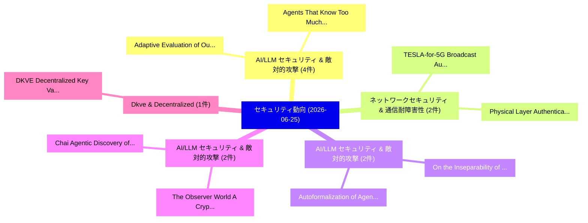

# 📅 02_daily: 日次エグゼクティブサマリー報告書 (2026-06-25)

**集計日時**: 2026-10-02 23:06:16 UTC  
**対象日付**: 2026-06-25  
**本日収集論文数**: 33 件  

---

## 💡 主要セキュリティ動向・脅威インサイト (Executive Insights)

本日の収集論文（計 33 件）において、以下の重点セキュリティ領域で活発な研究動向が確認されました：
- **AI/LLM セキュリティ & 敵対的攻撃** (4 件): 注目論文として 「Adaptive Evaluation of Out-of-...」、「Agents That Know Too Much: A D...」 等が発表され、実務防御および攻撃検証の進展が見られます。
- **ネットワークセキュリティ & 通信耐障害性** (2 件): 注目論文として 「TESLA-for-5G: Broadcast Authen...」、「Physical Layer Authentication ...」 等が発表され、実務防御および攻撃検証の進展が見られます。
- **AI/LLM セキュリティ & 敵対的攻撃** (2 件): 注目論文として 「Autoformalization of Agent Ins...」、「On the Inseparability of Instr...」 等が発表され、実務防御および攻撃検証の進展が見られます。
- **AI/LLM セキュリティ & 敵対的攻撃** (2 件): 注目論文として 「Chai: Agentic Discovery of Cry...」、「The Observer World: A Cryptogr...」 等が発表され、実務防御および攻撃検証の進展が見られます。
- **Dkve & Decentralized** (1 件): 注目論文として 「DKVE: Decentralized Key Valida...」 等が発表され、実務防御および攻撃検証の進展が見られます。

### 🗺️ 技術・脅威トピックマインドマップ

---

## 📌 日次セキュリティ論文一覧 (日本語表形式)

| No | arXiv ID | 論文タイトル (日本語訳) | 重要キーワード | 構造化エグゼクティブ要約 (背景・提案・影響) | 脅威分類 | 詳細リンク |
|---|---|---|---|---|---|---|
| 1 | `2606.26479v1` | [Adaptive Evaluation of Out-of-Band Defenses Against Prompt Injection in LLMエージェント](../../okf/papers/2026-06-25/2606.26479.md) | `Shiva Nagendra Babu Kore`, `Uday Kumar Reddy Kattamanchi`, `Praneeth Narisetty` | 【提案】概要 (Overview & Key Finding) 本論文「Adaptive Evaluation of Out-of-Band Defenses Against プロン...。実証評価により経営層・セキュリティ管理者向け推奨アクション (E... | `arXiv` | [arXiv](https://arxiv.org/abs/2606.26479v1) &#124; [OKF](../../okf/papers/2026-06-25/2606.26479.md) |
| 2 | `2606.26486v1` | [DKVE: Decentralized Key Validation for End-to-End Encrypted Messaging（セキュリティ分析論文）](../../okf/papers/2026-06-25/2606.26486.md) | `Decentralized Key Validation`, `End Encrypted Messaging`, `Subin Song` | 【提案】概要 (Overview & Key Finding) 本論文「DKVE: Decentralized Key Validation for End-to-End Encry...。実証評価により経営層・セキュリティ管理者向け推奨アクション (E... | `arXiv` | [arXiv](https://arxiv.org/abs/2606.26486v1) &#124; [OKF](../../okf/papers/2026-06-25/2606.26486.md) |
| 3 | `2606.26524v1` | [VIGIL: Runtime Enforcement of Behavioral Specifications in AI Agent Skills（セキュリティ分析論文）](../../okf/papers/2026-06-25/2606.26524.md) | `Runtime Enforcement`, `Behavioral Specifications`, `Agent Skills` | 【提案】概要 (Overview & Key Finding) 本論文「VIGIL: Runtime Enforcement of Behavioral Specifications...。実証評価により経営層・セキュリティ管理者向け推奨アクション (E... | `arXiv` | [arXiv](https://arxiv.org/abs/2606.26524v1) &#124; [OKF](../../okf/papers/2026-06-25/2606.26524.md) |
| 4 | `2606.26528v1` | [TESLA-for-5G: Broadcast Authentication for 5G Networks Using TESLA（セキュリティ分析論文）](../../okf/papers/2026-06-25/2606.26528.md) | `Broadcast Authentication`, `Networks Using`, `Subin Song` | 【提案】概要 (Overview & Key Finding) 本論文「TESLA-for-5G: Broadcast Authentication for 5G Networks ...。実証評価によりReiter, Taekyoung Kwon - ... | `arXiv` | [arXiv](https://arxiv.org/abs/2606.26528v1) &#124; [OKF](../../okf/papers/2026-06-25/2606.26528.md) |
| 5 | `2606.26566v1` | [Adversarial Diffusion Across Modalities: A Fusion Survey of Attacks, Defenses, and Evaluation for Text, Vision, and Vision-Language Models（セキュリティ分析論文）](../../okf/papers/2026-06-25/2606.26566.md) | `Adversarial Diffusion Across Modalities`, `Fusion Survey`, `Language Models` | 【提案】概要 (Overview & Key Finding) 本論文「Adversarial Diffusion Across Modalities: A Fusion Surve...。実証評価により経営層・セキュリティ管理者向け推奨アクション (E... | `arXiv` | [arXiv](https://arxiv.org/abs/2606.26566v1) &#124; [OKF](../../okf/papers/2026-06-25/2606.26566.md) |
| 6 | `2606.26590v1` | [Empirical Software Engineering TerraProbe: A Layered-Oracle Framework for Detecting Deceptive Fixes in LLM-Assisted Terraform（セキュリティ分析論文）](../../okf/papers/2026-06-25/2606.26590.md) | `Empirical Software Engineering`, `Detecting Deceptive Fixes`, `Assisted Terraform` | 【提案】概要 (Overview & Key Finding) 本論文「Empirical Software Engineering TerraProbe: A Layered-Or...。実証評価により経営層・セキュリティ管理者向け推奨アクション (E... | `arXiv` | [arXiv](https://arxiv.org/abs/2606.26590v1) &#124; [OKF](../../okf/papers/2026-06-25/2606.26590.md) |
| 7 | `2606.26627v1` | [Agents That Know Too Much: A Data-Centric Survey of Privacy in LLMエージェント](../../okf/papers/2026-06-25/2606.26627.md) | `Centric Survey`, `Data-Centric Survey`, `Ashwin Gerard Colaco` | 【提案】概要 (Overview & Key Finding) 本論文「Agents That Know Too Much: A Data-Centric Survey of Pri...。実証評価により経営層・セキュリティ管理者向け推奨アクション (E... | `arXiv` | [arXiv](https://arxiv.org/abs/2606.26627v1) &#124; [OKF](../../okf/papers/2026-06-25/2606.26627.md) |
| 8 | `2606.26649v1` | [Autoformalization of Agent Instructions into Policy-as-Code（セキュリティ分析論文）](../../okf/papers/2026-06-25/2606.26649.md) | `Agent Instructions`, `Adam Mondl`, `Matthew Maisel` | 【提案】概要 (Overview & Key Finding) 本論文「Autoformalization of Agent Instructions into Policy-as-...。実証評価によりBrock - **公開日時**: `2026-0... | `arXiv` | [arXiv](https://arxiv.org/abs/2606.26649v1) &#124; [OKF](../../okf/papers/2026-06-25/2606.26649.md) |
| 9 | `2606.26664v1` | [TGHE: Template-based Graph Homomorphic Encryption for Privacy-Preserving GNN Inference in Edge-Cloud Systems（セキュリティ分析論文）](../../okf/papers/2026-06-25/2606.26664.md) | `Graph Homomorphic Encryption`, `Template-based Graph`, `Cloud Systems` | 【提案】概要 (Overview & Key Finding) 本論文「TGHE: Template-based Graph 準同型暗号 for Privacy-Preserving...。実証評価により経営層・セキュリティ管理者向け推奨アクション (E... | `arXiv` | [arXiv](https://arxiv.org/abs/2606.26664v1) &#124; [OKF](../../okf/papers/2026-06-25/2606.26664.md) |
| 10 | `2606.26704v1` | [The Fungible Reserve Standard: A Deterministic Framework for Encoding Carrying Costs in Asset-Backed Tokens（セキュリティ分析論文）](../../okf/papers/2026-06-25/2606.26704.md) | `Encoding Carrying Costs`, `Backed Tokens`, `Asset-Backed Tokens` | 【提案】概要 (Overview & Key Finding) 本論文「The Fungible Reserve Standard: A Deterministic Framewor...。実証評価により経営層・セキュリティ管理者向け推奨アクション (E... | `arXiv` | [arXiv](https://arxiv.org/abs/2606.26704v1) &#124; [OKF](../../okf/papers/2026-06-25/2606.26704.md) |
| 11 | `2606.26707v1` | [DroidBreaker: Practical and Functional Problem-Space Attacks on Machine-Learning Android Malware Detectors（セキュリティ分析論文）](../../okf/papers/2026-06-25/2606.26707.md) | `Learning Android Malware Detectors`, `Functional Problem`, `Space Attacks` | 【提案】概要 (Overview & Key Finding) 本論文「DroidBreaker: Practical and Functional Problem-Space At...。実証評価により経営層・セキュリティ管理者向け推奨アクション (E... | `arXiv` | [arXiv](https://arxiv.org/abs/2606.26707v1) &#124; [OKF](../../okf/papers/2026-06-25/2606.26707.md) |
| 12 | `2606.26784v2` | [MergeLLL: A Hierarchical Divide-and-Conquer Framework for LLL-Based Lattice Reduction（セキュリティ分析論文）](../../okf/papers/2026-06-25/2606.26784.md) | `Based Lattice Reduction`, `Hierarchical Divide`, `LLL-Based Lattice` | 【提案】概要 (Overview & Key Finding) 本論文「MergeLLL: A Hierarchical Divide-and-Conquer Framework f...。実証評価により経営層・セキュリティ管理者向け推奨アクション (E... | `arXiv` | [arXiv](https://arxiv.org/abs/2606.26784v2) &#124; [OKF](../../okf/papers/2026-06-25/2606.26784.md) |
| 13 | `2606.26793v1` | [MIRROR: Novelty-Constrained Memory-Guided MCTS Red-Teaming for Agentic RAG（セキュリティ分析論文）](../../okf/papers/2026-06-25/2606.26793.md) | `Constrained Memory`, `Novelty-Constrained Memory`, `Inderjeet Singh` | 【提案】概要 (Overview & Key Finding) 本論文「MIRROR: Novelty-Constrained Memory-Guided MCTS Red-Team...。実証評価により経営層・セキュリティ管理者向け推奨アクション (E... | `arXiv` | [arXiv](https://arxiv.org/abs/2606.26793v1) &#124; [OKF](../../okf/papers/2026-06-25/2606.26793.md) |
| 14 | `2606.26841v1` | [SpikeTimer: Exploring Active Copyright Protection in Spiking Neural Networks via Temporal Backdoor Regularization（セキュリティ分析論文）](../../okf/papers/2026-06-25/2606.26841.md) | `Exploring Active Copyright Protection`, `Spiking Neural Networks`, `Temporal Backdoor Regularization` | 【提案】概要 (Overview & Key Finding) 本論文「SpikeTimer: Exploring Active Copyright Protection in Sp...。実証評価により経営層・セキュリティ管理者向け推奨アクション (E... | `arXiv` | [arXiv](https://arxiv.org/abs/2606.26841v1) &#124; [OKF](../../okf/papers/2026-06-25/2606.26841.md) |
| 15 | `2606.26866v1` | [Fortress and Gatekeeper: Theorizing Transitive Trust in Third-Party サイバーセキュリティ Risk Governance](../../okf/papers/2026-06-25/2606.26866.md) | `Theorizing Transitive Trust`, `Party Cybersecurity Risk Governance`, `Risk Governance` | 【提案】概要 (Overview & Key Finding) 本論文「Fortress and Gatekeeper: Theorizing Transitive Trust in...。実証評価により経営層・セキュリティ管理者向け推奨アクション (E... | `arXiv` | [arXiv](https://arxiv.org/abs/2606.26866v1) &#124; [OKF](../../okf/papers/2026-06-25/2606.26866.md) |
| 16 | `2606.26924v1` | [A Deterministic Control Plane for LLM Coding Agents（セキュリティ分析論文）](../../okf/papers/2026-06-25/2606.26924.md) | `Deterministic Control Plane`, `Coding Agents`, `Padmaraj Madatha` | 【提案】概要 (Overview & Key Finding) 本論文「A Deterministic Control Plane for LLM Coding Agents（セキュ...。実証評価により経営層・セキュリティ管理者向け推奨アクション (E... | `arXiv` | [arXiv](https://arxiv.org/abs/2606.26924v1) &#124; [OKF](../../okf/papers/2026-06-25/2606.26924.md) |
| 17 | `2606.26933v1` | [Chai: Agentic Discovery of Cryptographic Misuse Vulnerabilities（セキュリティ分析論文）](../../okf/papers/2026-06-25/2606.26933.md) | `Cryptographic Misuse Vulnerabilities`, `Agentic Discovery`, `Raluca Ada Popa` | 【提案】概要 (Overview & Key Finding) 本論文「Chai: Agentic Discovery of Cryptographic Misuse Vulnera...。実証評価により経営層・セキュリティ管理者向け推奨アクション (E... | `arXiv` | [arXiv](https://arxiv.org/abs/2606.26933v1) &#124; [OKF](../../okf/papers/2026-06-25/2606.26933.md) |
| 18 | `2606.26936v1` | [Jailbreaking for the Average Jane: Choosing Optimal Jailbreaks via Bandit Algorithms for Automatically Enhanced Queries（セキュリティ分析論文）](../../okf/papers/2026-06-25/2606.26936.md) | `Choosing Optimal Jailbreaks`, `Automatically Enhanced Queries`, `Average Jane` | 【提案】概要 (Overview & Key Finding) 本論文「ジェイルブレイクing for the Average Jane: Choosing Optimal ジェイル...。実証評価により経営層・セキュリティ管理者向け推奨アクション (E... | `arXiv` | [arXiv](https://arxiv.org/abs/2606.26936v1) &#124; [OKF](../../okf/papers/2026-06-25/2606.26936.md) |
| 19 | `2606.26967v1` | [Protocol Prying: Systematic Vulnerability Research in the Apple AirDrop and Android Quick Share Proximity Transfer Protocols（セキュリティ分析論文）](../../okf/papers/2026-06-25/2606.26967.md) | `Android Quick Share Proximity Transfer Protocols`, `Systematic Vulnerability Research`, `Protocol Prying` | 【提案】概要 (Overview & Key Finding) 本論文「Protocol Prying: Systematic 脆弱性 Research in the Apple A...。実証評価により経営層・セキュリティ管理者向け推奨アクション (E... | `arXiv` | [arXiv](https://arxiv.org/abs/2606.26967v1) &#124; [OKF](../../okf/papers/2026-06-25/2606.26967.md) |
| 20 | `2606.27027v1` | [ShareLock: A Stealthy Multi-Tool Threshold Poisoning Attack Against MCP（セキュリティ分析論文）](../../okf/papers/2026-06-25/2606.27027.md) | `Stealthy Multi`, `Multi-Tool Threshold`, `Liwei Liu` | 【提案】概要 (Overview & Key Finding) 本論文「ShareLock: A Stealthy Multi-Tool Threshold Poisoning At...。実証評価により経営層・セキュリティ管理者向け推奨アクション (E... | `arXiv` | [arXiv](https://arxiv.org/abs/2606.27027v1) &#124; [OKF](../../okf/papers/2026-06-25/2606.27027.md) |
| 21 | `2606.27028v1` | [Design and Performance Evaluation of Secure RF and WiFi-Based Communication in Drone Swarms via Testbed Implementation（セキュリティ分析論文）](../../okf/papers/2026-06-25/2606.27028.md) | `Based Communication`, `Drone Swarms`, `Testbed Implementation` | 【提案】概要 (Overview & Key Finding) 本論文「Design and Performance Evaluation of Secure RF and WiFi...。実証評価により経営層・セキュリティ管理者向け推奨アクション (E... | `arXiv` | [arXiv](https://arxiv.org/abs/2606.27028v1) &#124; [OKF](../../okf/papers/2026-06-25/2606.27028.md) |
| 22 | `2606.27044v1` | [Physical Layer Authentication With Channel Knowledge Maps in Indoor Environments（セキュリティ分析論文）](../../okf/papers/2026-06-25/2606.27044.md) | `Indoor Environments`, `Luca Bonaventura`, `Francesco Ardizzon` | 【提案】概要 (Overview & Key Finding) 本論文「Physical Layer Authentication With Channel Knowledge Ma...。実証評価により経営層・セキュリティ管理者向け推奨アクション (E... | `arXiv` | [arXiv](https://arxiv.org/abs/2606.27044v1) &#124; [OKF](../../okf/papers/2026-06-25/2606.27044.md) |
| 23 | `2606.27059v1` | [Type-based information flow analysis for $π$-calculus with a dynamically extensible security lattice（セキュリティ分析論文）](../../okf/papers/2026-06-25/2606.27059.md) | `Type-based information`, `Yukihiro Oda`, `Eijiro Sumii` | 【提案】概要 (Overview & Key Finding) 本論文「Type-based information flow analysis for $π$-calculus w...。実証評価により経営層・セキュリティ管理者向け推奨アクション (E... | `arXiv` | [arXiv](https://arxiv.org/abs/2606.27059v1) &#124; [OKF](../../okf/papers/2026-06-25/2606.27059.md) |
| 24 | `2606.27091v1` | [Inherited Circuits, Learned Semantics: How Fine-Tuning Creates Evasion Vulnerabilities Invisible to Standard Evaluation（セキュリティ分析論文）](../../okf/papers/2026-06-25/2606.27091.md) | `Tuning Creates Evasion Vulnerabilities Invisible`, `Inherited Circuits`, `Learned Semantics` | 【提案】概要 (Overview & Key Finding) 本論文「Inherited Circuits, Learned Semantics: How Fine-Tuning ...。実証評価により経営層・セキュリティ管理者向け推奨アクション (E... | `arXiv` | [arXiv](https://arxiv.org/abs/2606.27091v1) &#124; [OKF](../../okf/papers/2026-06-25/2606.27091.md) |
| 25 | `2606.27092v1` | [zQR: A Verifiable QR-Driven zkSNARK Proof Verification Framework for Mobile Platforms（セキュリティ分析論文）](../../okf/papers/2026-06-25/2606.27092.md) | `Mobile Platforms`, `QR-Driven zkSNARK`, `Goshgar Can Ismayilov` | 【提案】概要 (Overview & Key Finding) 本論文「zQR: A Verifiable QR-Driven zkSNARK Proof Verification ...。実証評価により経営層・セキュリティ管理者向け推奨アクション (E... | `arXiv` | [arXiv](https://arxiv.org/abs/2606.27092v1) &#124; [OKF](../../okf/papers/2026-06-25/2606.27092.md) |
| 26 | `2606.27106v2` | [Application of LLMs to Threat Assessment of Foreign Peacekeeping Missions（セキュリティ分析論文）](../../okf/papers/2026-06-25/2606.27106.md) | `Foreign Peacekeeping Missions`, `Threat Assessment`, `Gerhard Backfried` | 【提案】概要 (Overview & Key Finding) 本論文「Application of LLMs to 脅威 Assessment of Foreign Peaceke...。実証評価により経営層・セキュリティ管理者向け推奨アクション (E... | `arXiv` | [arXiv](https://arxiv.org/abs/2606.27106v2) &#124; [OKF](../../okf/papers/2026-06-25/2606.27106.md) |
| 27 | `2606.27109v1` | [PRISM: PE Relational Inter-Section Matrix. A 2D Section-Aware Dataset for Static PE マルウェア検出](../../okf/papers/2026-06-25/2606.27109.md) | `Relational Inter`, `Section Matrix`, `Aware Dataset` | 【提案】A 2D Section-Aware Dataset for Static PE マルウェア Detection ### (日本語題名: PRISM: PE Relation...。実証評価により経営層・セキュリティ管理者向け推奨アクション (E... | `arXiv` | [arXiv](https://arxiv.org/abs/2606.27109v1) &#124; [OKF](../../okf/papers/2026-06-25/2606.27109.md) |
| 28 | `2606.27139v1` | [The Observer World: A Cryptographic Extension of Impagliazzo's Five Worlds（セキュリティ分析論文）](../../okf/papers/2026-06-25/2606.27139.md) | `Cryptographic Extension`, `Five Worlds`, `Raw Meta` | 【提案】概要 (Overview & Key Finding) 本論文「The Observer World: A Cryptographic Extension of Impagl...。実証評価によりBuono - **公開日時**: `2026-0... | `arXiv` | [arXiv](https://arxiv.org/abs/2606.27139v1) &#124; [OKF](../../okf/papers/2026-06-25/2606.27139.md) |
| 29 | `2606.27250v1` | [Tilikum: Transaction Fair Ordering on a DAG without Weak Edges（セキュリティ分析論文）](../../okf/papers/2026-06-25/2606.27250.md) | `Transaction Fair Ordering`, `Weak Edges`, `Giulio Segalini` | 【提案】背景とセキュリティ上の課題 (Background & Problem) 本研究はサイバー脅威環境におけるセキュリティ構造・脆弱性の検証を目的としています。(主要検出項目: ...。実証評価により経営層・セキュリティ管理者向け推奨アクション (E... | `arXiv` | [arXiv](https://arxiv.org/abs/2606.27250v1) &#124; [OKF](../../okf/papers/2026-06-25/2606.27250.md) |
| 30 | `2606.27511v1` | [When the Aggregator Cheats: Data-Free Backdoors in Federated LLM-based QA Systems（セキュリティ分析論文）](../../okf/papers/2026-06-25/2606.27511.md) | `Aggregator Cheats`, `Free Backdoors`, `Data-Free Backdoors` | 【提案】概要 (Overview & Key Finding) 本論文「When the Aggregator Cheats: Data-Free Backdoors in Fede...。実証評価により経営層・セキュリティ管理者向け推奨アクション (E... | `arXiv` | [arXiv](https://arxiv.org/abs/2606.27511v1) &#124; [OKF](../../okf/papers/2026-06-25/2606.27511.md) |
| 31 | `2606.27558v1` | [Productionized Fairness Measurement Under Privacy Constraints（セキュリティ分析論文）](../../okf/papers/2026-06-25/2606.27558.md) | `Saikrishna Badrinarayanan`, `Varun Mithal`, `Sakshi Jain` | 【提案】概要 (Overview & Key Finding) 本論文「Productionized Fairness Measurement Under Privacy Const...。実証評価によりOsoba, Yuzi He, Saikrishn... | `arXiv` | [arXiv](https://arxiv.org/abs/2606.27558v1) &#124; [OKF](../../okf/papers/2026-06-25/2606.27558.md) |
| 32 | `2606.27567v1` | [On the Inseparability of Instructions and Data in Shared-Embedding Sequence Models（セキュリティ分析論文）](../../okf/papers/2026-06-25/2606.27567.md) | `Embedding Sequence Models`, `Shared-Embedding Sequence`, `Dewank Pant` | 【提案】概要 (Overview & Key Finding) 本論文「On the Inseparability of Instructions and Data in Share...。実証評価により経営層・セキュリティ管理者向け推奨アクション (E... | `arXiv` | [arXiv](https://arxiv.org/abs/2606.27567v1) &#124; [OKF](../../okf/papers/2026-06-25/2606.27567.md) |
| 33 | `2606.28425v1` | [Tool Use Enables Undetectable Steganography in Multi-Agent LLM Systems（セキュリティ分析論文）](../../okf/papers/2026-06-25/2606.28425.md) | `Tool Use Enables Undetectable Steganography`, `Multi-Agent LLM`, `Jimmy Laurence Rippin` | 【提案】概要 (Overview & Key Finding) 本論文「Tool Use Enables Undetectable Steganography in Multi-Ag...。実証評価によりMarshall, Dav。 | `arXiv` | [arXiv](https://arxiv.org/abs/2606.28425v1) &#124; [OKF](../../okf/papers/2026-06-25/2606.28425.md) |

