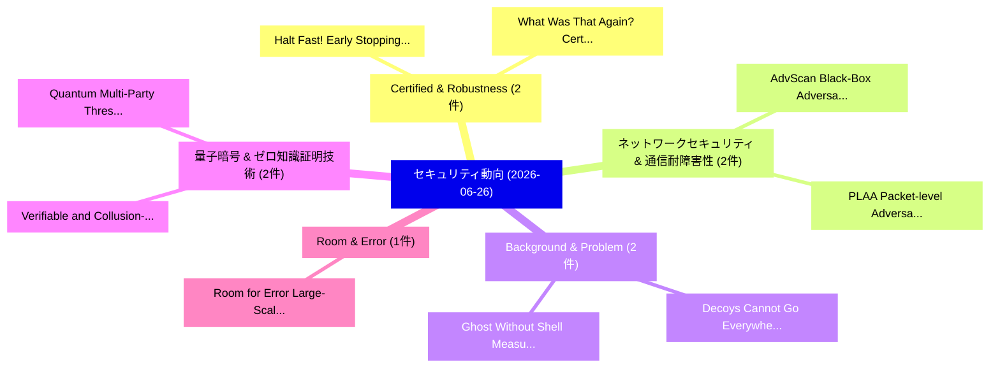

# 📅 02_daily: 日次エグゼクティブサマリー報告書 (2026-06-26)

**集計日時**: 2026-10-02 23:06:17 UTC  
**対象日付**: 2026-06-26  
**本日収集論文数**: 28 件  

---

## 💡 主要セキュリティ動向・脅威インサイト (Executive Insights)

本日の収集論文（計 28 件）において、以下の重点セキュリティ領域で活発な研究動向が確認されました：
- **Certified & Robustness** (2 件): 注目論文として 「Halt Fast! Early Stopping for ...」、「What Was That Again? Certified...」 等が発表され、実務防御および攻撃検証の進展が見られます。
- **ネットワークセキュリティ & 通信耐障害性** (2 件): 注目論文として 「AdvScan: Black-Box Adversarial...」、「PLAA: Packet-level Adversarial...」 等が発表され、実務防御および攻撃検証の進展が見られます。
- **Background & Problem** (2 件): 注目論文として 「Decoys Cannot Go Everywhere: M...」、「Ghost Without Shell: Measuring...」 等が発表され、実務防御および攻撃検証の進展が見られます。
- **量子暗号 & ゼロ知識証明技術** (2 件): 注目論文として 「Verifiable and Collusion-Resis...」、「Quantum Multi-Party Threshold ...」 等が発表され、実務防御および攻撃検証の進展が見られます。
- **Room & Error** (1 件): 注目論文として 「Room for Error: Large-Scale Si...」 等が発表され、実務防御および攻撃検証の進展が見られます。

### 🗺️ 技術・脅威トピックマインドマップ

---

## 📌 日次セキュリティ論文一覧 (日本語表形式)

| No | arXiv ID | 論文タイトル (日本語訳) | 重要キーワード | 構造化エグゼクティブ要約 (背景・提案・影響) | 脅威分類 | 詳細リンク |
|---|---|---|---|---|---|---|
| 1 | `2606.27694v1` | [Halt Fast! Early Stopping for Certified Robustness（セキュリティ分析論文）](../../okf/papers/2026-06-26/2606.27694.md) | `Halt Fast`, `Early Stopping`, `Certified Robustness` | 【提案】Early Stopping for Certified Robustness ### (日本語題名: Halt Fast!。実証評価によりRubinstein - **公開日時**: `2026-06-26T03:41:58Z` - **カテゴ... | `arXiv` | [arXiv](https://arxiv.org/abs/2606.27694v1) &#124; [OKF](../../okf/papers/2026-06-26/2606.27694.md) |
| 2 | `2606.27698v2` | [What Was That Again? Certified Robustness for Automatic Speech Recognition（セキュリティ分析論文）](../../okf/papers/2026-06-26/2606.27698.md) | `Automatic Speech Recognition`, `Certified Robustness`, `Automatic Speech Recog` | 【提案】Certified Robustness for Automatic Speech Recognition ### (日本語題名: What Was That Again?。実証評価によりMarchant, J。 | `arXiv` | [arXiv](https://arxiv.org/abs/2606.27698v2) &#124; [OKF](../../okf/papers/2026-06-26/2606.27698.md) |
| 3 | `2606.27701v2` | [Room for Error: Large-Scale Simulation of Over-the-Air Acoustic Attacks（セキュリティ分析論文）](../../okf/papers/2026-06-26/2606.27701.md) | `Air Acoustic Attacks`, `Scale Simulation`, `Large-Scale Simulation` | 【提案】概要 (Overview & Key Finding) 本論文「Room for Error: Large-Scale Simulation of Over-the-Air ...。実証評価によりMarchant, Jiani。 | `arXiv` | [arXiv](https://arxiv.org/abs/2606.27701v2) &#124; [OKF](../../okf/papers/2026-06-26/2606.27701.md) |
| 4 | `2606.27704v1` | [AdvScan: Black-Box Adversarial Example Detection at Runtime through Power Analysis（セキュリティ分析論文）](../../okf/papers/2026-06-26/2606.27704.md) | `Box Adversarial Example Detection`, `Black-Box Adversarial`, `Robi Paul` | 【提案】概要 (Overview & Key Finding) 本論文「AdvScan: Black-Box 敵対的サンプル Detection at Runtime through...。実証評価により経営層・セキュリティ管理者向け推奨アクション (E... | `arXiv` | [arXiv](https://arxiv.org/abs/2606.27704v1) &#124; [OKF](../../okf/papers/2026-06-26/2606.27704.md) |
| 5 | `2606.27736v1` | [ToE: A Hierarchical and Explainable Claim Verification Framework with Dynamic Multi-source Evidence Retrieval and Aggregation（セキュリティ分析論文）](../../okf/papers/2026-06-26/2606.27736.md) | `Dynamic Multi`, `Evidence Retrieval`, `Multi-source Evidence` | 【提案】概要 (Overview & Key Finding) 本論文「ToE: A Hierarchical and Explainable Claim Verification ...。実証評価により経営層・セキュリティ管理者向け推奨アクション (E... | `arXiv` | [arXiv](https://arxiv.org/abs/2606.27736v1) &#124; [OKF](../../okf/papers/2026-06-26/2606.27736.md) |
| 6 | `2606.27803v2` | [Reliable Homomorphic Matching for Fuzzy Labeled PSI at Scale（セキュリティ分析論文）](../../okf/papers/2026-06-26/2606.27803.md) | `Reliable Homomorphic Matching`, `Fuzzy Labeled`, `Erkam Uzun` | 【提案】概要 (Overview & Key Finding) 本論文「Reliable Homomorphic Matching for Fuzzy Labeled PSI at ...。実証評価により経営層・セキュリティ管理者向け推奨アクション (E... | `arXiv` | [arXiv](https://arxiv.org/abs/2606.27803v2) &#124; [OKF](../../okf/papers/2026-06-26/2606.27803.md) |
| 7 | `2606.27819v1` | [Exploring and Exploiting Synchrony Limitations of Time-Triggered Network-Agnostic Guardians（セキュリティ分析論文）](../../okf/papers/2026-06-26/2606.27819.md) | `Exploiting Synchrony Limitations`, `Triggered Network`, `Agnostic Guardians` | 【提案】概要 (Overview & Key Finding) 本論文「Exploring and Exploiting Synchrony Limitations of Time-...。実証評価により経営層・セキュリティ管理者向け推奨アクション (E... | `arXiv` | [arXiv](https://arxiv.org/abs/2606.27819v1) &#124; [OKF](../../okf/papers/2026-06-26/2606.27819.md) |
| 8 | `2606.27919v1` | [RAMSES: Secure high-performance computing for sensitive data（セキュリティ分析論文）](../../okf/papers/2026-06-26/2606.27919.md) | `high-performance computing`, `Peter Heger`, `Lech Nieroda` | 【提案】概要 (Overview & Key Finding) 本論文「RAMSES: Secure high-performance computing for sensitive...。実証評価により経営層・セキュリティ管理者向け推奨アクション (E... | `arXiv` | [arXiv](https://arxiv.org/abs/2606.27919v1) &#124; [OKF](../../okf/papers/2026-06-26/2606.27919.md) |
| 9 | `2606.27934v1` | [Self-Verifying Measurement Records: Hash-Linked Evidence Graphs for Hardware Benchmarking（セキュリティ分析論文）](../../okf/papers/2026-06-26/2606.27934.md) | `Verifying Measurement Records`, `Linked Evidence Graphs`, `Self-Verifying Measurement` | 【提案】概要 (Overview & Key Finding) 本論文「Self-Verifying Measurement Records: Hash-Linked Evidenc...。実証評価により経営層・セキュリティ管理者向け推奨アクション (E... | `arXiv` | [arXiv](https://arxiv.org/abs/2606.27934v1) &#124; [OKF](../../okf/papers/2026-06-26/2606.27934.md) |
| 10 | `2606.27936v1` | [Agentic AI-Powered Re-Identification: An Emerging, Scalable Threat to Mobility Microdata Privacy（セキュリティ分析論文）](../../okf/papers/2026-06-26/2606.27936.md) | `Mobility Microdata Privacy`, `Powered Re`, `Scalable Threat` | 【提案】概要 (Overview & Key Finding) 本論文「Agentic AI-Powered Re-Identification: An Emerging, Scal...。実証評価により経営層・セキュリティ管理者向け推奨アクション (E... | `arXiv` | [arXiv](https://arxiv.org/abs/2606.27936v1) &#124; [OKF](../../okf/papers/2026-06-26/2606.27936.md) |
| 11 | `2606.27944v1` | [It Lied to a Doctor to Buy Poison Ingredients: Quantifying Real-World Misuse of Phone-use Agents（セキュリティ分析論文）](../../okf/papers/2026-06-26/2606.27944.md) | `Buy Poison Ingredients`, `Quantifying Real`, `World Misuse` | 【提案】概要 (Overview & Key Finding) 本論文「It Lied to a Doctor to Buy Poison Ingredients: Quantify...。実証評価により経営層・セキュリティ管理者向け推奨アクション (E... | `arXiv` | [arXiv](https://arxiv.org/abs/2606.27944v1) &#124; [OKF](../../okf/papers/2026-06-26/2606.27944.md) |
| 12 | `2606.27961v1` | [Transversal Difference Numbers in Finite Abelian Quotients（セキュリティ分析論文）](../../okf/papers/2026-06-26/2606.27961.md) | `Transversal Difference Numbers`, `Finite Abelian Quotients`, `Mugurel Barcau` | 【提案】概要 (Overview & Key Finding) 本論文「Transversal Difference Numbers in Finite Abelian Quotie...。実証評価によりŢurcaş - **公開日時**: `2026-... | `arXiv` | [arXiv](https://arxiv.org/abs/2606.27961v1) &#124; [OKF](../../okf/papers/2026-06-26/2606.27961.md) |
| 13 | `2606.27966v1` | [Decoys Cannot Go Everywhere: Mapping the Deception Surface in MITRE ATT&CK（セキュリティ分析論文）](../../okf/papers/2026-06-26/2606.27966.md) | `Deception Surface`, `Veronica Valeros`, `Carlos Catania` | 【提案】背景とセキュリティ上の課題 (Background & Problem) 本研究はサイバー脅威環境におけるセキュリティ構造・脆弱性の検証を目的としています。(主要検出項目: ...。実証評価により経営層・セキュリティ管理者向け推奨アクション (E... | `arXiv` | [arXiv](https://arxiv.org/abs/2606.27966v1) &#124; [OKF](../../okf/papers/2026-06-26/2606.27966.md) |
| 14 | `2606.27976v3` | [SHARD: cell-keyed residual splitting for alignment-resistant private dense retrieval（セキュリティ分析論文）](../../okf/papers/2026-06-26/2606.27976.md) | `cell-keyed residual`, `alignment-resistant private`, `Sergey Kurilenko` | 【提案】概要 (Overview & Key Finding) 本論文「SHARD: cell-keyed residual splitting for alignment-resi...。実証評価により経営層・セキュリティ管理者向け推奨アクション (E... | `arXiv` | [arXiv](https://arxiv.org/abs/2606.27976v3) &#124; [OKF](../../okf/papers/2026-06-26/2606.27976.md) |
| 15 | `2606.27990v1` | [AdvancedShelLM: A Stateful Multi-Agent LLM Honeypot for SSH Deception（セキュリティ分析論文）](../../okf/papers/2026-06-26/2606.27990.md) | `Stateful Multi`, `Multi-Agent LLM`, `Veronica Valeros` | 【提案】概要 (Overview & Key Finding) 本論文「AdvancedShelLM: A Stateful Multi-Agent LLM Honeypot for...。実証評価により経営層・セキュリティ管理者向け推奨アクション (E... | `arXiv` | [arXiv](https://arxiv.org/abs/2606.27990v1) &#124; [OKF](../../okf/papers/2026-06-26/2606.27990.md) |
| 16 | `2606.27994v1` | [Verifiable and Collusion-Resistant Multi-Party Quantum Private Set Operations（セキュリティ分析論文）](../../okf/papers/2026-06-26/2606.27994.md) | `Party Quantum Private Set Operations`, `Resistant Multi`, `Collusion-Resistant Multi` | 【提案】概要 (Overview & Key Finding) 本論文「Verifiable and Collusion-Resistant Multi-Party 量子 Priva...。実証評価により経営層・セキュリティ管理者向け推奨アクション (E... | `arXiv` | [arXiv](https://arxiv.org/abs/2606.27994v1) &#124; [OKF](../../okf/papers/2026-06-26/2606.27994.md) |
| 17 | `2606.27996v1` | [Quantum Multi-Party Threshold Private Set Intersection with Explicit Cardinality Testing（セキュリティ分析論文）](../../okf/papers/2026-06-26/2606.27996.md) | `Party Threshold Private Set Intersection`, `Explicit Cardinality Testing`, `Quantum Multi` | 【提案】概要 (Overview & Key Finding) 本論文「量子 Multi-Party Threshold Private Set Intersection with ...。実証評価により経営層・セキュリティ管理者向け推奨アクション (E... | `arXiv` | [arXiv](https://arxiv.org/abs/2606.27996v1) &#124; [OKF](../../okf/papers/2026-06-26/2606.27996.md) |
| 18 | `2606.28006v1` | [Ghost Without Shell: Measuring Non-Interactive SSH Attacks on Honeypots（セキュリティ分析論文）](../../okf/papers/2026-06-26/2606.28006.md) | `Ghost Without Shell`, `Measuring Non`, `Non-Interactive SSH` | 【提案】背景とセキュリティ上の課題 (Background & Problem) 本研究はサイバー脅威環境におけるセキュリティ構造・脆弱性の検証を目的としています。(主要検出項目: ...。実証評価により経営層・セキュリティ管理者向け推奨アクション (E... | `arXiv` | [arXiv](https://arxiv.org/abs/2606.28006v1) &#124; [OKF](../../okf/papers/2026-06-26/2606.28006.md) |
| 19 | `2606.28061v1` | [ToolPrivacyBench: Purpose-Bound Privacy in Tool-Using LLM Agentsのベンチマーク評価](../../okf/papers/2026-06-26/2606.28061.md) | `Bound Privacy`, `Purpose-Bound Privacy`, `Tool-Using LLM` | 【提案】概要 (Overview & Key Finding) 本論文「ToolPrivacyBench: Purpose-Bound Privacy in Tool-Using L...。実証評価により経営層・セキュリティ管理者向け推奨アクション (E... | `arXiv` | [arXiv](https://arxiv.org/abs/2606.28061v1) &#124; [OKF](../../okf/papers/2026-06-26/2606.28061.md) |
| 20 | `2606.28079v3` | [GTI-mSEMP Framework : A Proposed Framework to Simulate Malware Propagation with Inclusion of Attacker-Defender Strategy（セキュリティ分析論文）](../../okf/papers/2026-06-26/2606.28079.md) | `Simulate Malware Propagation`, `Defender Strategy`, `Attacker-Defender Strategy` | 【提案】概要 (Overview & Key Finding) 本論文「GTI-mSEMP Framework : A Proposed Framework to Simulate ...。実証評価により経営層・セキュリティ管理者向け推奨アクション (E... | `arXiv` | [arXiv](https://arxiv.org/abs/2606.28079v3) &#124; [OKF](../../okf/papers/2026-06-26/2606.28079.md) |
| 21 | `2606.28125v1` | [How Humans, Bots, and Agents Communicate About Vulnerabilities in Pull Requests（セキュリティ分析論文）](../../okf/papers/2026-06-26/2606.28125.md) | `Pull Requests`, `Pien Rooijendijk`, `Christoph Treude` | 【提案】概要 (Overview & Key Finding) 本論文「How Humans, Bots, and Agents Communicate About Vulnerab...。実証評価により経営層・セキュリティ管理者向け推奨アクション (E... | `arXiv` | [arXiv](https://arxiv.org/abs/2606.28125v1) &#124; [OKF](../../okf/papers/2026-06-26/2606.28125.md) |
| 22 | `2606.28153v2` | [Robust Harmful Features Under Jailbreak Attacks: Mechanistic Evidence from Attention Head Specialization in 大規模言語モデル](../../okf/papers/2026-06-26/2606.28153.md) | `Attention Head Specialization`, `Mechanistic Evidence`, `Large Language Models` | 【提案】概要 (Overview & Key Finding) 本論文「Robust Harmful Features Under ジェイルブレイク Attacks: Mechani...。実証評価により経営層・セキュリティ管理者向け推奨アクション (E... | `arXiv` | [arXiv](https://arxiv.org/abs/2606.28153v2) &#124; [OKF](../../okf/papers/2026-06-26/2606.28153.md) |
| 23 | `2606.28439v1` | [PLAA: Packet-level Adversarial Attacks in Network Traffic Detection（セキュリティ分析論文）](../../okf/papers/2026-06-26/2606.28439.md) | `Network Traffic Detection`, `Adversarial Attacks`, `Packet-level Adversarial` | 【提案】概要 (Overview & Key Finding) 本論文「PLAA: Packet-level 敵対的攻撃s in Network Traffic Detection（...。実証評価により経営層・セキュリティ管理者向け推奨アクション (E... | `arXiv` | [arXiv](https://arxiv.org/abs/2606.28439v1) &#124; [OKF](../../okf/papers/2026-06-26/2606.28439.md) |
| 24 | `2606.28450v1` | [LLMエージェント security duality: a comprehensive survey of self-security and empowered cybersecurity](../../okf/papers/2026-06-26/2606.28450.md) | `Yiwei Xu`, `Yong Zhuang`, `Xuanming Liu` | 【提案】概要 (Overview & Key Finding) 本論文「LLMエージェント security duality: a comprehensive survey of s...。実証評価により経営層・セキュリティ管理者向け推奨アクション (E... | `arXiv` | [arXiv](https://arxiv.org/abs/2606.28450v1) &#124; [OKF](../../okf/papers/2026-06-26/2606.28450.md) |
| 25 | `2606.28479v1` | [Decomposing Memorization Reduction in Privacy-Preserving Fine-Tuning of SLMs for CSIRTs（セキュリティ分析論文）](../../okf/papers/2026-06-26/2606.28479.md) | `Decomposing Memorization Reduction`, `Preserving Fine`, `Privacy-Preserving Fine` | 【提案】概要 (Overview & Key Finding) 本論文「Decomposing Memorization Reduction in Privacy-Preservin...。実証評価により経営層・セキュリティ管理者向け推奨アクション (E... | `arXiv` | [arXiv](https://arxiv.org/abs/2606.28479v1) &#124; [OKF](../../okf/papers/2026-06-26/2606.28479.md) |
| 26 | `2606.28625v1` | [In-Vehicle Digital Twin-Based Collision Warning Framework with Sybil Attack Detection（セキュリティ分析論文）](../../okf/papers/2026-06-26/2606.28625.md) | `Vehicle Digital Twin`, `Sybil Attack Detection`, `In-Vehicle Digital` | 【提案】概要 (Overview & Key Finding) 本論文「In-Vehicle Digital Twin-Based Collision Warning Framewo...。実証評価により経営層・セキュリティ管理者向け推奨アクション (E... | `arXiv` | [arXiv](https://arxiv.org/abs/2606.28625v1) &#124; [OKF](../../okf/papers/2026-06-26/2606.28625.md) |
| 27 | `2606.28649v1` | [RIPA: Sensory-Vector Prompt Injection Attacks on LLM-Controlled ROS 2 Robots（セキュリティ分析論文）](../../okf/papers/2026-06-26/2606.28649.md) | `Vector Prompt Injection Attacks`, `Sensory-Vector Prompt`, `LLM-Controlled ROS` | 【提案】概要 (Overview & Key Finding) 本論文「RIPA: Sensory-Vector プロンプトインジェクション Attacks on LLM-Contr...。実証評価により経営層・セキュリティ管理者向け推奨アクション (E... | `arXiv` | [arXiv](https://arxiv.org/abs/2606.28649v1) &#124; [OKF](../../okf/papers/2026-06-26/2606.28649.md) |
| 28 | `2607.16242v1` | [TRACE: Trajectory-Based Safety Patch Learning for LLM Post-Training Realignment（セキュリティ分析論文）](../../okf/papers/2026-06-26/2607.16242.md) | `Based Safety Patch Learning`, `Trajectory-Based Safety`, `Training Realignment` | 【提案】概要 (Overview & Key Finding) 本論文「TRACE: Trajectory-Based Safety Patch Learning for LLM P...。実証評価により経営層・セキュリティ管理者向け推奨アクション (E... | `arXiv` | [arXiv](https://arxiv.org/abs/2607.16242v1) &#124; [OKF](../../okf/papers/2026-06-26/2607.16242.md) |

