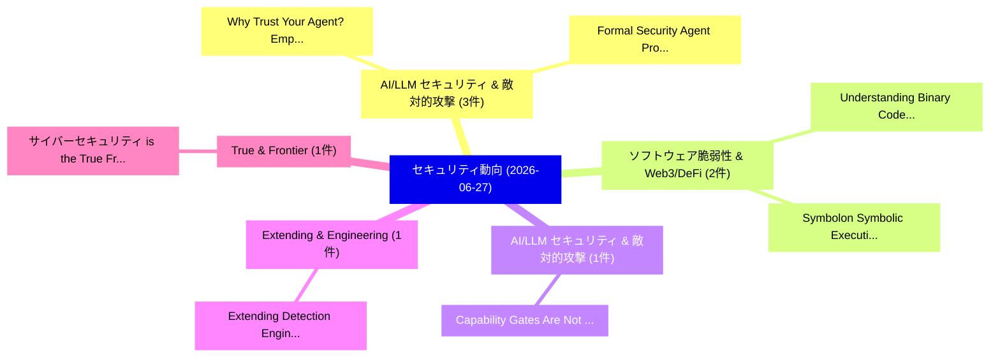

# 📅 02_daily: 日次エグゼクティブサマリー報告書 (2026-06-27)

**集計日時**: 2026-10-02 23:06:17 UTC  
**対象日付**: 2026-06-27  
**本日収集論文数**: 12 件  

---

## 💡 主要セキュリティ動向・脅威インサイト (Executive Insights)

本日の収集論文（計 12 件）において、以下の重点セキュリティ領域で活発な研究動向が確認されました：
- **AI/LLM セキュリティ & 敵対的攻撃** (3 件): 注目論文として 「Why Trust Your Agent? Empirica...」、「Formal Security Agent Protocol...」 等が発表され、実務防御および攻撃検証の進展が見られます。
- **ソフトウェア脆弱性 & Web3/DeFi** (2 件): 注目論文として 「Understanding Binary Code Simi...」、「Symbolon: Symbolic Execution b...」 等が発表され、実務防御および攻撃検証の進展が見られます。
- **AI/LLM セキュリティ & 敵対的攻撃** (1 件): 注目論文として 「Capability Gates Are Not Autho...」 等が発表され、実務防御および攻撃検証の進展が見られます。
- **Extending & Engineering** (1 件): 注目論文として 「Extending Detection Engineerin...」 等が発表され、実務防御および攻撃検証の進展が見られます。
- **True & Frontier** (1 件): 注目論文として 「サイバーセキュリティ is the True Frontie...」 等が発表され、実務防御および攻撃検証の進展が見られます。

### 🗺️ 技術・脅威トピックマインドマップ

---

## 📌 日次セキュリティ論文一覧 (日本語表形式)

| No | arXiv ID | 論文タイトル (日本語訳) | 重要キーワード | 構造化エグゼクティブ要約 (背景・提案・影響) | 脅威分類 | 詳細リンク |
|---|---|---|---|---|---|---|
| 1 | `2606.28666v1` | [Why Trust Your Agent? Empirical Security Gains from TRiSM-Guided Agentic Workflows in Healthcare（セキュリティ分析論文）](../../okf/papers/2026-06-27/2606.28666.md) | `Empirical Security Gains`, `Guided Agentic Workflows`, `TRiSM-Guided Agentic` | 【提案】Empirical Security Gains from TRiSM-Guided Agentic Workflows in Healthcare ### (日本語題名: ...。実証評価により経営層・セキュリティ管理者向け推奨アクション (E... | `arXiv` | [arXiv](https://arxiv.org/abs/2606.28666v1) &#124; [OKF](../../okf/papers/2026-06-27/2606.28666.md) |
| 2 | `2606.28679v1` | [Capability Gates Are Not Authorization: Confused-Deputy Failures in LLM Agent Frameworks（セキュリティ分析論文）](../../okf/papers/2026-06-27/2606.28679.md) | `Deputy Failures`, `Agent Frameworks`, `Confused-Deputy Failures` | 【提案】背景とセキュリティ上の課題 (Background & Problem) 本研究はサイバー脅威環境におけるセキュリティ構造・脆弱性の検証を目的としています。(主要検出項目: ...。実証評価により経営層・セキュリティ管理者向け推奨アクション (E... | `arXiv` | [arXiv](https://arxiv.org/abs/2606.28679v1) &#124; [OKF](../../okf/papers/2026-06-27/2606.28679.md) |
| 3 | `2606.28690v1` | [Formal Security Agent Protocol Compositionの分析](../../okf/papers/2026-06-27/2606.28690.md) | `Formal Security Agent Protocol`, `Agent Protocol Composition`, `Shenghan Zheng` | 【提案】概要 (Overview & Key Finding) 本論文「Formal Security Agent Protocol Compositionの分析」（原題: Form...。実証評価により経営層・セキュリティ管理者向け推奨アクション (E... | `arXiv` | [arXiv](https://arxiv.org/abs/2606.28690v1) &#124; [OKF](../../okf/papers/2026-06-27/2606.28690.md) |
| 4 | `2606.28812v1` | [Extending Detection Engineering to Digital Forensics: The Velociraptor Unified Detection-Forensics Methodology（セキュリティ分析論文）](../../okf/papers/2026-06-27/2606.28812.md) | `Extending Detection Engineering`, `Digital Forensics`, `Forensics Methodology` | 【提案】概要 (Overview & Key Finding) 本論文「Extending Detection Engineering to Digital Forensics: T...。実証評価により経営層・セキュリティ管理者向け推奨アクション (E... | `arXiv` | [arXiv](https://arxiv.org/abs/2606.28812v1) &#124; [OKF](../../okf/papers/2026-06-27/2606.28812.md) |
| 5 | `2606.28870v1` | [Understanding Binary Code Similarity for Real-World 脆弱性検出: A Large-Scale Empirical Study](../../okf/papers/2026-06-27/2606.28870.md) | `Understanding Binary Code Similarity`, `Large-Scale Empirical`, `World Vulnerability Detection` | 【提案】概要 (Overview & Key Finding) 本論文「Understanding Binary Code Similarity for Real-World 脆弱性...。実証評価により経営層・セキュリティ管理者向け推奨アクション (E... | `arXiv` | [arXiv](https://arxiv.org/abs/2606.28870v1) &#124; [OKF](../../okf/papers/2026-06-27/2606.28870.md) |
| 6 | `2606.28929v1` | [サイバーセキュリティ is the True Frontier for Generative AI Success or Failure](../../okf/papers/2026-06-27/2606.28929.md) | `True Frontier`, `Edward Raff`, `Maor Ashkenazi` | 【提案】概要 (Overview & Key Finding) 本論文「サイバーセキュリティ is the True Frontier for Generative AI Succe...。実証評価により経営層・セキュリティ管理者向け推奨アクション (E... | `arXiv` | [arXiv](https://arxiv.org/abs/2606.28929v1) &#124; [OKF](../../okf/papers/2026-06-27/2606.28929.md) |
| 7 | `2606.28962v1` | [FlipGuard: Defending 大規模言語モデル Against Quantization-Conditioned Backdoor Attacks](../../okf/papers/2026-06-27/2606.28962.md) | `Conditioned Backdoor Attacks`, `Quantization-Conditioned Backdoor`, `Aoying Zheng` | 【提案】概要 (Overview & Key Finding) 本論文「FlipGuard: Defending 大規模言語モデル Against Quantization-Cond...。実証評価により経営層・セキュリティ管理者向け推奨アクション (E... | `arXiv` | [arXiv](https://arxiv.org/abs/2606.28962v1) &#124; [OKF](../../okf/papers/2026-06-27/2606.28962.md) |
| 8 | `2606.28968v2` | [Beyond Her: Safety Dynamics in Role-play AI Companions（セキュリティ分析論文）](../../okf/papers/2026-06-27/2606.28968.md) | `Safety Dynamics`, `Role-play AI`, `Zehang Deng` | 【提案】概要 (Overview & Key Finding) 本論文「Beyond Her: Safety Dynamics in Role-play AI Companions（...。実証評価により経営層・セキュリティ管理者向け推奨アクション (E... | `arXiv` | [arXiv](https://arxiv.org/abs/2606.28968v2) &#124; [OKF](../../okf/papers/2026-06-27/2606.28968.md) |
| 9 | `2606.28994v1` | [Arbitrary Reduction of Validation Error for AI Decision Tests using Homomorphic AI and Repetition Codes（セキュリティ分析論文）](../../okf/papers/2026-06-27/2606.28994.md) | `Arbitrary Reduction`, `Validation Error`, `Decision Tests` | 【提案】概要 (Overview & Key Finding) 本論文「Arbitrary Reduction of Validation Error for AI Decision...。実証評価により経営層・セキュリティ管理者向け推奨アクション (E... | `arXiv` | [arXiv](https://arxiv.org/abs/2606.28994v1) &#124; [OKF](../../okf/papers/2026-06-27/2606.28994.md) |
| 10 | `2606.29073v1` | [From Tool Connection to Execution Control: Security Invariants in MCP-Style Agent Runtimesのベンチマーク評価](../../okf/papers/2026-06-27/2606.29073.md) | `Execution Control`, `MCP-Style Agent`, `Benchmarking Security Invariants` | 【提案】概要 (Overview & Key Finding) 本論文「From Tool Connection to Execution Control: Security Inv...。実証評価により経営層・セキュリティ管理者向け推奨アクション (E... | `arXiv` | [arXiv](https://arxiv.org/abs/2606.29073v1) &#124; [OKF](../../okf/papers/2026-06-27/2606.29073.md) |
| 11 | `2606.29077v1` | [A Usable and Secure Bengali CAPTCHA（セキュリティ分析論文）](../../okf/papers/2026-06-27/2606.29077.md) | `Secure Bengali`, `Md Neyamul Islam Shibbir`, `Md Hasibur Rahman` | 【提案】概要 (Overview & Key Finding) 本論文「A Usable and Secure Bengali CAPTCHA（セキュリティ分析論文）」（原題: A ...。実証評価により経営層・セキュリティ管理者向け推奨アクション (E... | `arXiv` | [arXiv](https://arxiv.org/abs/2606.29077v1) &#124; [OKF](../../okf/papers/2026-06-27/2606.29077.md) |
| 12 | `2606.29108v2` | [Symbolon: Symbolic Execution by Learning Code Transformation（セキュリティ分析論文）](../../okf/papers/2026-06-27/2606.29108.md) | `Learning Code Transformation`, `Symbolic Execution`, `Jie Zhu` | 【提案】概要 (Overview & Key Finding) 本論文「Symbolon: Symbolic Execution by Learning Code Transform...。実証評価により経営層・セキュリティ管理者向け推奨アクション (E... | `arXiv` | [arXiv](https://arxiv.org/abs/2606.29108v2) &#124; [OKF](../../okf/papers/2026-06-27/2606.29108.md) |

