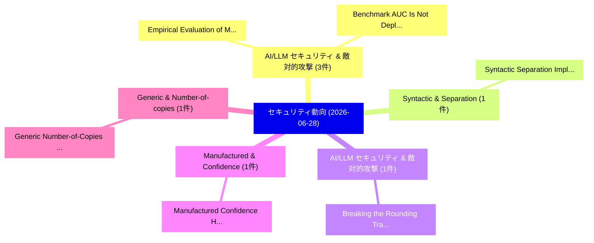

# 📅 02_daily: 日次エグゼクティブサマリー報告書 (2026-06-28)

**集計日時**: 2026-10-02 23:06:17 UTC  
**対象日付**: 2026-06-28  
**本日収集論文数**: 14 件  

---

## 💡 主要セキュリティ動向・脅威インサイト (Executive Insights)

本日の収集論文（計 14 件）において、以下の重点セキュリティ領域で活発な研究動向が確認されました：
- **AI/LLM セキュリティ & 敵対的攻撃** (3 件): 注目論文として 「Empirical Evaluation of Multi-...」、「Benchmark AUC Is Not Deployabl...」 等が発表され、実務防御および攻撃検証の進展が見られます。
- **Syntactic & Separation** (1 件): 注目論文として 「Syntactic Separation Implies C...」 等が発表され、実務防御および攻撃検証の進展が見られます。
- **AI/LLM セキュリティ & 敵対的攻撃** (1 件): 注目論文として 「Breaking the Rounding Trap: LL...」 等が発表され、実務防御および攻撃検証の進展が見られます。
- **Manufactured & Confidence** (1 件): 注目論文として 「Manufactured Confidence: How M...」 等が発表され、実務防御および攻撃検証の進展が見られます。
- **Generic & Number-of-copies** (1 件): 注目論文として 「Generic Number-of-Copies Ampli...」 等が発表され、実務防御および攻撃検証の進展が見られます。

### 🗺️ 技術・脅威トピックマインドマップ

---

## 📌 日次セキュリティ論文一覧 (日本語表形式)

| No | arXiv ID | 論文タイトル (日本語訳) | 重要キーワード | 構造化エグゼクティブ要約 (背景・提案・影響) | 脅威分類 | 詳細リンク |
|---|---|---|---|---|---|---|
| 1 | `2606.29177v1` | [Syntactic Separation Implies Computational Indistinguishability: An Abstract Obstruction Theorem（セキュリティ分析論文）](../../okf/papers/2026-06-28/2606.29177.md) | `Syntactic Separation Implies Computational Indistinguishability`, `Syntactic Separation Implies Computational Indistinguishab`, `Raw Meta` | 【提案】概要 (Overview & Key Finding) 本論文「Syntactic Separation Implies Computational Indistinguis...。実証評価により経営層・セキュリティ管理者向け推奨アクション (E... | `arXiv` | [arXiv](https://arxiv.org/abs/2606.29177v1) &#124; [OKF](../../okf/papers/2026-06-28/2606.29177.md) |
| 2 | `2606.29239v2` | [Breaking the Rounding Trap: LLMs against Quantization-Conditioned Backdoorsのセキュリティ強化](../../okf/papers/2026-06-28/2606.29239.md) | `Rounding Trap`, `Conditioned Backdoors`, `Quantization-Conditioned Backdoors` | 【提案】概要 (Overview & Key Finding) 本論文「Breaking the Rounding Trap: LLMs against Quantization-C...。実証評価により経営層・セキュリティ管理者向け推奨アクション (E... | `arXiv` | [arXiv](https://arxiv.org/abs/2606.29239v2) &#124; [OKF](../../okf/papers/2026-06-28/2606.29239.md) |
| 3 | `2606.29279v1` | [Manufactured Confidence: How Memory Consolidation Turns Hearsay into Confident Facts（セキュリティ分析論文）](../../okf/papers/2026-06-28/2606.29279.md) | `Manufactured Confidence`, `Confident Facts`, `Alex Kwon` | 【提案】概要 (Overview & Key Finding) 本論文「Manufactured Confidence: How Memory Consolidation Turns...。実証評価により経営層・セキュリティ管理者向け推奨アクション (E... | `arXiv` | [arXiv](https://arxiv.org/abs/2606.29279v1) &#124; [OKF](../../okf/papers/2026-06-28/2606.29279.md) |
| 4 | `2606.29325v1` | [Generic Number-of-Copies Amplification for Pseudorandom States（セキュリティ分析論文）](../../okf/papers/2026-06-28/2606.29325.md) | `Generic Number`, `Copies Amplification`, `Pseudorandom States` | 【提案】概要 (Overview & Key Finding) 本論文「Generic Number-of-Copies Amplification for Pseudorandom...。実証評価により経営層・セキュリティ管理者向け推奨アクション (E... | `arXiv` | [arXiv](https://arxiv.org/abs/2606.29325v1) &#124; [OKF](../../okf/papers/2026-06-28/2606.29325.md) |
| 5 | `2606.29389v1` | [Exploring the Cryptographic Limits of Transformer Networks（セキュリティ分析論文）](../../okf/papers/2026-06-28/2606.29389.md) | `Cryptographic Limits`, `Transformer Networks`, `Stefan Domunco` | 【提案】概要 (Overview & Key Finding) 本論文「Exploring the Cryptographic Limits of Transformer Netwo...。実証評価により経営層・セキュリティ管理者向け推奨アクション (E... | `arXiv` | [arXiv](https://arxiv.org/abs/2606.29389v1) &#124; [OKF](../../okf/papers/2026-06-28/2606.29389.md) |
| 6 | `2606.29393v1` | [The Role of Online Forums in Developer Understanding of Privacy Law -- A Reddit Case Study（セキュリティ分析論文）](../../okf/papers/2026-06-28/2606.29393.md) | `Online Forums`, `Developer Understanding`, `Privacy Law` | 【提案】概要 (Overview & Key Finding) 本論文「The Role of Online Forums in Developer Understanding of...。実証評価により経営層・セキュリティ管理者向け推奨アクション (E... | `arXiv` | [arXiv](https://arxiv.org/abs/2606.29393v1) &#124; [OKF](../../okf/papers/2026-06-28/2606.29393.md) |
| 7 | `2606.29417v1` | [Bit-ViP: Leveraging Bit-planes to Preserve Visual Privacy in Images through Obfuscation（セキュリティ分析論文）](../../okf/papers/2026-06-28/2606.29417.md) | `Preserve Visual Privacy`, `Leveraging Bit`, `Vishesh Kumar Tanwar` | 【提案】概要 (Overview & Key Finding) 本論文「Bit-ViP: Leveraging Bit-planes to Preserve Visual Priva...。実証評価により経営層・セキュリティ管理者向け推奨アクション (E... | `arXiv` | [arXiv](https://arxiv.org/abs/2606.29417v1) &#124; [OKF](../../okf/papers/2026-06-28/2606.29417.md) |
| 8 | `2606.29441v1` | [Closing the Activation-Cone Blind Spot: Response-Time Probing and Unified Defense（セキュリティ分析論文）](../../okf/papers/2026-06-28/2606.29441.md) | `Cone Blind Spot`, `Time Probing`, `Unified Defense` | 【提案】概要 (Overview & Key Finding) 本論文「Closing the Activation-Cone Blind Spot: Response-Time P...。実証評価により経営層・セキュリティ管理者向け推奨アクション (E... | `arXiv` | [arXiv](https://arxiv.org/abs/2606.29441v1) &#124; [OKF](../../okf/papers/2026-06-28/2606.29441.md) |
| 9 | `2606.29451v1` | [The Platonic Defense: Backdoor Defense for Self-Supervised Encoders in the Era of Large Scale Pre-training（セキュリティ分析論文）](../../okf/papers/2026-06-28/2606.29451.md) | `Large Scale Pre`, `Backdoor Defense`, `Supervised Encoders` | 【提案】概要 (Overview & Key Finding) 本論文「The Platonic Defense: Backdoor Defense for Self-Supervi...。実証評価により経営層・セキュリティ管理者向け推奨アクション (E... | `arXiv` | [arXiv](https://arxiv.org/abs/2606.29451v1) &#124; [OKF](../../okf/papers/2026-06-28/2606.29451.md) |
| 10 | `2606.29484v2` | [The Calibrated Deepfake Trust Score (CDTS): Competence-Coupled Trust Degradation Across Deepfake Detectors（セキュリティ分析論文）](../../okf/papers/2026-06-28/2606.29484.md) | `Coupled Trust Degradation Across Deepfake Detectors`, `Competence-Coupled Trust`, `Md Anas Biswas` | 【提案】概要 (Overview & Key Finding) 本論文「The Calibrated Deepfake Trust Score (CDTS): Competence-...。実証評価により経営層・セキュリティ管理者向け推奨アクション (E... | `arXiv` | [arXiv](https://arxiv.org/abs/2606.29484v2) &#124; [OKF](../../okf/papers/2026-06-28/2606.29484.md) |
| 11 | `2606.29504v1` | [Empirical Evaluation of Multi-Modal Touch Detection in Over-the-Shoulder Video Surveillance（セキュリティ分析論文）](../../okf/papers/2026-06-28/2606.29504.md) | `Modal Touch Detection`, `Shoulder Video Surveillance`, `Multi-Modal Touch` | 【提案】概要 (Overview & Key Finding) 本論文「Empirical Evaluation of Multi-Modal Touch Detection in ...。実証評価により経営層・セキュリティ管理者向け推奨アクション (E... | `arXiv` | [arXiv](https://arxiv.org/abs/2606.29504v1) &#124; [OKF](../../okf/papers/2026-06-28/2606.29504.md) |
| 12 | `2606.29506v1` | [Benchmark AUC Is Not Deployable Reliability: A Cross-Dataset Audit of Off-the-Shelf Features for Surveillance Video Anomaly Detection（セキュリティ分析論文）](../../okf/papers/2026-06-28/2606.29506.md) | `Surveillance Video Anomaly Detection`, `Dataset Audit`, `Shelf Features` | 【提案】背景とセキュリティ上の課題 (Background & Problem) 本研究はサイバー脅威環境におけるセキュリティ構造・脆弱性の検証を目的としています。(主要検出項目: ...。実証評価により経営層・セキュリティ管理者向け推奨アクション (E... | `arXiv` | [arXiv](https://arxiv.org/abs/2606.29506v1) &#124; [OKF](../../okf/papers/2026-06-28/2606.29506.md) |
| 13 | `2606.29567v1` | [SurrogateShield: Beyond Redaction for High-Utility, Privacy-Preserving LLM Interactions（セキュリティ分析論文）](../../okf/papers/2026-06-28/2606.29567.md) | `Beyond Redaction`, `Privacy-Preserving LLM`, `Sherwin Vishesh Jathanna` | 【提案】概要 (Overview & Key Finding) 本論文「SurrogateShield: Beyond Redaction for High-Utility, Pri...。実証評価により経営層・セキュリティ管理者向け推奨アクション (E... | `arXiv` | [arXiv](https://arxiv.org/abs/2606.29567v1) &#124; [OKF](../../okf/papers/2026-06-28/2606.29567.md) |
| 14 | `2606.29602v1` | [An Empirical Evaluation of Prompt Injection Vulnerabilities in 大規模言語モデル Across Multilingual and Obfuscated Attack Scenarios](../../okf/papers/2026-06-28/2606.29602.md) | `Prompt Injection Vulnerabilities`, `Obfuscated Attack Scenarios`, `Large Language Models Across Multilingual` | 【提案】概要 (Overview & Key Finding) 本論文「An Empirical Evaluation of プロンプトインジェクション Vulnerabilitie...。実証評価により経営層・セキュリティ管理者向け推奨アクション (E... | `arXiv` | [arXiv](https://arxiv.org/abs/2606.29602v1) &#124; [OKF](../../okf/papers/2026-06-28/2606.29602.md) |

