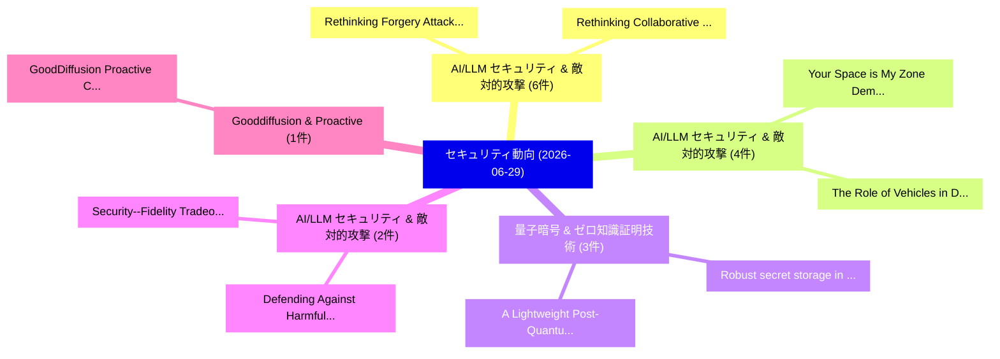

# 📅 02_daily: 日次エグゼクティブサマリー報告書 (2026-06-29)

**集計日時**: 2026-10-02 23:06:17 UTC  
**対象日付**: 2026-06-29  
**本日収集論文数**: 35 件  

---

## 💡 主要セキュリティ動向・脅威インサイト (Executive Insights)

本日の収集論文（計 35 件）において、以下の重点セキュリティ領域で活発な研究動向が確認されました：
- **AI/LLM セキュリティ & 敵対的攻撃** (6 件): 注目論文として 「Rethinking Forgery Attacks on ...」、「Rethinking Collaborative Trust...」 等が発表され、実務防御および攻撃検証の進展が見られます。
- **AI/LLM セキュリティ & 敵対的攻撃** (4 件): 注目論文として 「Your Space is My Zone: Demysti...」、「The Role of Vehicles in Digita...」 等が発表され、実務防御および攻撃検証の進展が見られます。
- **量子暗号 & ゼロ知識証明技術** (3 件): 注目論文として 「Robust secret storage in netwo...」、「A Lightweight Post-Quantum Aut...」 等が発表され、実務防御および攻撃検証の進展が見られます。
- **AI/LLM セキュリティ & 敵対的攻撃** (2 件): 注目論文として 「Defending Against Harmful Supe...」、「Security--Fidelity Tradeoffs: ...」 等が発表され、実務防御および攻撃検証の進展が見られます。
- **Gooddiffusion & Proactive** (1 件): 注目論文として 「GoodDiffusion: Proactive Copyr...」 等が発表され、実務防御および攻撃検証の進展が見られます。

### 🗺️ 技術・脅威トピックマインドマップ

---

## 📌 日次セキュリティ論文一覧 (日本語表形式)

| No | arXiv ID | 論文タイトル (日本語訳) | 重要キーワード | 構造化エグゼクティブ要約 (背景・提案・影響) | 脅威分類 | 詳細リンク |
|---|---|---|---|---|---|---|
| 1 | `2606.29759v1` | [GoodDiffusion: Proactive Copyright Protection for Diffusion Bridge Models via Learnable Sample-specific Signatures（セキュリティ分析論文）](../../okf/papers/2026-06-29/2606.29759.md) | `Proactive Copyright Protection`, `Diffusion Bridge Models`, `Learnable Sample` | 【提案】概要 (Overview & Key Finding) 本論文「GoodDiffusion: Proactive Copyright Protection for Diffu...。実証評価により経営層・セキュリティ管理者向け推奨アクション (E... | `arXiv` | [arXiv](https://arxiv.org/abs/2606.29759v1) &#124; [OKF](../../okf/papers/2026-06-29/2606.29759.md) |
| 2 | `2606.29797v1` | [Multi-Level Distributional Entropy for Explainable Network Intrusion Detection（セキュリティ分析論文）](../../okf/papers/2026-06-29/2606.29797.md) | `Explainable Network Intrusion Detection`, `Level Distributional Entropy`, `Multi-Level Distributional` | 【提案】概要 (Overview & Key Finding) 本論文「Multi-Level Distributional Entropy for Explainable Netw...。実証評価により経営層・セキュリティ管理者向け推奨アクション (E... | `arXiv` | [arXiv](https://arxiv.org/abs/2606.29797v1) &#124; [OKF](../../okf/papers/2026-06-29/2606.29797.md) |
| 3 | `2606.29807v1` | [Rethinking Forgery Attacks on Semantic Watermarks in Black-Box Settings: A Geometric Distortion Perspective（セキュリティ分析論文）](../../okf/papers/2026-06-29/2606.29807.md) | `Rethinking Forgery Attacks`, `Geometric Distortion Perspective`, `Semantic Watermarks` | 【提案】概要 (Overview & Key Finding) 本論文「Rethinking Forgery Attacks on Semantic Watermarks in Bl...。実証評価により経営層・セキュリティ管理者向け推奨アクション (E... | `arXiv` | [arXiv](https://arxiv.org/abs/2606.29807v1) &#124; [OKF](../../okf/papers/2026-06-29/2606.29807.md) |
| 4 | `2606.29826v1` | [Rethinking Collaborative Trust for Verifiably Decentralized Blockchain Systems（セキュリティ分析論文）](../../okf/papers/2026-06-29/2606.29826.md) | `Verifiably Decentralized Blockchain Systems`, `Rethinking Collaborative Trust`, `Shaileshh Bojja Venkatakrishnan` | 【提案】概要 (Overview & Key Finding) 本論文「Rethinking Collaborative Trust for Verifiably Decentral...。実証評価により経営層・セキュリティ管理者向け推奨アクション (E... | `arXiv` | [arXiv](https://arxiv.org/abs/2606.29826v1) &#124; [OKF](../../okf/papers/2026-06-29/2606.29826.md) |
| 5 | `2606.29835v1` | [A Sieve-Accelerated Quadrature Method for Exact Privacy Accounting in the 2020 U.S. Decennial Census（セキュリティ分析論文）](../../okf/papers/2026-06-29/2606.29835.md) | `Exact Privacy Accounting`, `Sieve-Accelerated Quadrature`, `Decennial Census` | 【提案】Decennial Census ### (日本語題名: A Sieve-Accelerated Quadrature Method for Exact Privacy Ac...。実証評価により経営層・セキュリティ管理者向け推奨アクション (E... | `arXiv` | [arXiv](https://arxiv.org/abs/2606.29835v1) &#124; [OKF](../../okf/papers/2026-06-29/2606.29835.md) |
| 6 | `2606.29962v1` | [BPBO: Blindness-Preserving Brickwork Optimization by Certified Region Resynthesis（セキュリティ分析論文）](../../okf/papers/2026-06-29/2606.29962.md) | `Preserving Brickwork Optimization`, `Certified Region Resynthesis`, `Blindness-Preserving Brickwork` | 【提案】概要 (Overview & Key Finding) 本論文「BPBO: Blindness-Preserving Brickwork Optimization by Ce...。実証評価により経営層・セキュリティ管理者向け推奨アクション (E... | `arXiv` | [arXiv](https://arxiv.org/abs/2606.29962v1) &#124; [OKF](../../okf/papers/2026-06-29/2606.29962.md) |
| 7 | `2606.29963v2` | [Explainability-Aware Frustum Attack: Exposing Structural Vulnerabilities in LiDAR-Based 3D Object Detectors（セキュリティ分析論文）](../../okf/papers/2026-06-29/2606.29963.md) | `Aware Frustum Attack`, `Exposing Structural Vulnerabilities`, `Explainability-Aware Frustum` | 【提案】概要 (Overview & Key Finding) 本論文「Explainability-Aware Frustum Attack: Exposing Structura...。実証評価により経営層・セキュリティ管理者向け推奨アクション (E... | `arXiv` | [arXiv](https://arxiv.org/abs/2606.29963v2) &#124; [OKF](../../okf/papers/2026-06-29/2606.29963.md) |
| 8 | `2606.29981v1` | [Hephaestus: Toward a サイバーセキュリティ AI Scientist](../../okf/papers/2026-06-29/2606.29981.md) | `Jiaqi Li`, `Yang Zhao`, `Wen Lu` | 【提案】概要 (Overview & Key Finding) 本論文「Hephaestus: Toward a サイバーセキュリティ AI Scientist」（原題: Hepha...。実証評価により経営層・セキュリティ管理者向け推奨アクション (E... | `arXiv` | [arXiv](https://arxiv.org/abs/2606.29981v1) &#124; [OKF](../../okf/papers/2026-06-29/2606.29981.md) |
| 9 | `2606.30081v1` | [Discard the Dross and Select the Essential: Pre-query Sample Selection for Black-box Membership Inference Attacks（セキュリティ分析論文）](../../okf/papers/2026-06-29/2606.30081.md) | `Membership Inference Attacks`, `Sample Selection`, `Pre-query Sample` | 【提案】概要 (Overview & Key Finding) 本論文「Discard the Dross and Select the Essential: Pre-query S...。実証評価により経営層・セキュリティ管理者向け推奨アクション (E... | `arXiv` | [arXiv](https://arxiv.org/abs/2606.30081v1) &#124; [OKF](../../okf/papers/2026-06-29/2606.30081.md) |
| 10 | `2606.30119v1` | [On the Internet, Nobody Knows You're an LLM Bot: Unmasking Web Agents with Multi-Layer Fingerprinting（セキュリティ分析論文）](../../okf/papers/2026-06-29/2606.30119.md) | `Unmasking Web Agents`, `Layer Fingerprinting`, `Multi-Layer Fingerprinting` | 【提案】概要 (Overview & Key Finding) 本論文「On the Internet, Nobody Knows You're an LLM Bot: Unmask...。実証評価により経営層・セキュリティ管理者向け推奨アクション (E... | `arXiv` | [arXiv](https://arxiv.org/abs/2606.30119v1) &#124; [OKF](../../okf/papers/2026-06-29/2606.30119.md) |
| 11 | `2606.30153v1` | [The Spectrum Strikes Back: Infrared POV Attacks on Traffic Sign Classification（セキュリティ分析論文）](../../okf/papers/2026-06-29/2606.30153.md) | `Traffic Sign Classification`, `Maximilian Luedecke`, `Mohammad Hamad` | 【提案】概要 (Overview & Key Finding) 本論文「The Spectrum Strikes Back: Infrared POV Attacks on Traf...。実証評価により経営層・セキュリティ管理者向け推奨アクション (E... | `arXiv` | [arXiv](https://arxiv.org/abs/2606.30153v1) &#124; [OKF](../../okf/papers/2026-06-29/2606.30153.md) |
| 12 | `2606.30261v1` | [Robust secret storage in networks（セキュリティ分析論文）](../../okf/papers/2026-06-29/2606.30261.md) | `Raw Meta`, `Executive Summary`, `Key Finding` | 【提案】概要 (Overview & Key Finding) 本論文「Robust secret storage in networks（セキュリティ分析論文）」（原題: Robu...。実証評価により経営層・セキュリティ管理者向け推奨アクション (E... | `arXiv` | [arXiv](https://arxiv.org/abs/2606.30261v1) &#124; [OKF](../../okf/papers/2026-06-29/2606.30261.md) |
| 13 | `2606.30263v1` | [Defending Against Harmful Supervision Hidden in Benign Samples（セキュリティ分析論文）](../../okf/papers/2026-06-29/2606.30263.md) | `Benign Samples`, `Yibo Yang`, `Dandan Guo` | 【提案】概要 (Overview & Key Finding) 本論文「Defending Against Harmful Supervision Hidden in Benign ...。実証評価により経営層・セキュリティ管理者向け推奨アクション (E... | `arXiv` | [arXiv](https://arxiv.org/abs/2606.30263v1) &#124; [OKF](../../okf/papers/2026-06-29/2606.30263.md) |
| 14 | `2606.30281v1` | [Quantum Lazy Sampling and Path Recording for Any Group（セキュリティ分析論文）](../../okf/papers/2026-06-29/2606.30281.md) | `Quantum Lazy Sampling`, `Path Recording`, `Ben Foxman` | 【提案】概要 (Overview & Key Finding) 本論文「量子 Lazy Sampling and Path Recording for Any Group（セキュリテ...。実証評価により経営層・セキュリティ管理者向け推奨アクション (E... | `arXiv` | [arXiv](https://arxiv.org/abs/2606.30281v1) &#124; [OKF](../../okf/papers/2026-06-29/2606.30281.md) |
| 15 | `2606.30373v1` | [Your Space is My Zone: Demystifying the Security Risks of AI-Powered Applications on Pre-Trained Model Hubs（セキュリティ分析論文）](../../okf/papers/2026-06-29/2606.30373.md) | `Trained Model Hubs`, `Security Risks`, `Powered Applications` | 【提案】概要 (Overview & Key Finding) 本論文「Your Space is My Zone: Demystifying the Security Risks ...。実証評価により経営層・セキュリティ管理者向け推奨アクション (E... | `arXiv` | [arXiv](https://arxiv.org/abs/2606.30373v1) &#124; [OKF](../../okf/papers/2026-06-29/2606.30373.md) |
| 16 | `2606.30423v1` | [Proofs of Ownership for Machine Learning Models（セキュリティ分析論文）](../../okf/papers/2026-06-29/2606.30423.md) | `Machine Learning Models`, `Ran Canetti`, `Shafi Goldwasser` | 【提案】概要 (Overview & Key Finding) 本論文「Proofs of Ownership for Machine Learning Models（セキュリティ分...。実証評価により経営層・セキュリティ管理者向け推奨アクション (E... | `arXiv` | [arXiv](https://arxiv.org/abs/2606.30423v1) &#124; [OKF](../../okf/papers/2026-06-29/2606.30423.md) |
| 17 | `2606.30430v1` | [CAN We Trust Your Results? A Cross-Dataset Study of Automotive IDS Evaluation（セキュリティ分析論文）](../../okf/papers/2026-06-29/2606.30430.md) | `Beatrix Koltai`, `Gergely Acs`, `Andras Gazdag` | 【提案】A Cross-Dataset Study of Automotive IDS Evaluation ### (日本語題名: CAN We Trust Your Results?。実証評価によりA Cross-Dataset Study of A... | `arXiv` | [arXiv](https://arxiv.org/abs/2606.30430v1) &#124; [OKF](../../okf/papers/2026-06-29/2606.30430.md) |
| 18 | `2606.30479v1` | [COHORT: Collaborative Orchestration for Hardening via Offensive Replay on Emulated Topologies（セキュリティ分析論文）](../../okf/papers/2026-06-29/2606.30479.md) | `Collaborative Orchestration`, `Offensive Replay`, `Emulated Topologies` | 【提案】概要 (Overview & Key Finding) 本論文「COHORT: Collaborative Orchestration for Hardening via O...。実証評価により経営層・セキュリティ管理者向け推奨アクション (E... | `arXiv` | [arXiv](https://arxiv.org/abs/2606.30479v1) &#124; [OKF](../../okf/papers/2026-06-29/2606.30479.md) |
| 19 | `2606.30493v1` | [Between Zeros and Ones: Behavioral Characterization Beyond Binary Labeling Across Public ICS Datasets（セキュリティ分析論文）](../../okf/papers/2026-06-29/2606.30493.md) | `Behavioral Characterization Beyond Binary Labeling Across Public`, `Behavioral Characterization Beyond Binary`, `Vyron Kampourakis` | 【提案】概要 (Overview & Key Finding) 本論文「Between Zeros and Ones: Behavioral Characterization Bey...。実証評価により経営層・セキュリティ管理者向け推奨アクション (E... | `arXiv` | [arXiv](https://arxiv.org/abs/2606.30493v1) &#124; [OKF](../../okf/papers/2026-06-29/2606.30493.md) |
| 20 | `2606.30542v1` | [A Lightweight Post-Quantum Authentication Framework for 5G Base Station Bootstrapping（セキュリティ分析論文）](../../okf/papers/2026-06-29/2606.30542.md) | `Base Station Bootstrapping`, `Lightweight Post`, `Post-Quantum Authentication` | 【提案】概要 (Overview & Key Finding) 本論文「A Lightweight Post-量子 Authentication Framework for 5G B...。実証評価により経営層・セキュリティ管理者向け推奨アクション (E... | `arXiv` | [arXiv](https://arxiv.org/abs/2606.30542v1) &#124; [OKF](../../okf/papers/2026-06-29/2606.30542.md) |
| 21 | `2606.30564v1` | [The Role of Vehicles in Digital Forensic Investigations: A Structured Synthesis of Digital Vehicle Forensic Characteristics（セキュリティ分析論文）](../../okf/papers/2026-06-29/2606.30564.md) | `Digital Forensic Investigations`, `Digital Vehicle Forensic Characteristics`, `Structured Synthesis` | 【提案】概要 (Overview & Key Finding) 本論文「The Role of Vehicles in Digital Forensic Investigations...。実証評価により経営層・セキュリティ管理者向け推奨アクション (E... | `arXiv` | [arXiv](https://arxiv.org/abs/2606.30564v1) &#124; [OKF](../../okf/papers/2026-06-29/2606.30564.md) |
| 22 | `2606.30566v2` | [Forensic Trajectory Signatures for Agent Memory Poisoning Detection（セキュリティ分析論文）](../../okf/papers/2026-06-29/2606.30566.md) | `Agent Memory Poisoning Detection`, `Forensic Trajectory Signatures`, `Jun Wen Leong` | 【提案】概要 (Overview & Key Finding) 本論文「Forensic Trajectory Signatures for Agent Memory Poisoni...。実証評価により経営層・セキュリティ管理者向け推奨アクション (E... | `arXiv` | [arXiv](https://arxiv.org/abs/2606.30566v2) &#124; [OKF](../../okf/papers/2026-06-29/2606.30566.md) |
| 23 | `2606.30572v1` | [A Multi-task Mixture of Experts Framework for Malware Classification, Packing Detection, and Family Attribution（セキュリティ分析論文）](../../okf/papers/2026-06-29/2606.30572.md) | `Malware Classification`, `Packing Detection`, `Family Attribution` | 【提案】概要 (Overview & Key Finding) 本論文「A Multi-task Mixture of Experts Framework for マルウェア Cla...。実証評価により経営層・セキュリティ管理者向け推奨アクション (E... | `arXiv` | [arXiv](https://arxiv.org/abs/2606.30572v1) &#124; [OKF](../../okf/papers/2026-06-29/2606.30572.md) |
| 24 | `2606.30586v1` | [A Hybrid Framework For Crypto-Ransomware Detection In Enterprise Shared Storage（セキュリティ分析論文）](../../okf/papers/2026-06-29/2606.30586.md) | `Crypto-Ransomware Detection`, `Mohammad Jabed Morshed Chowdhury`, `Abdun Naser Mahmood` | 【提案】概要 (Overview & Key Finding) 本論文「A Hybrid Framework For Crypto-ランサムウェア Detection In Ente...。実証評価により経営層・セキュリティ管理者向け推奨アクション (E... | `arXiv` | [arXiv](https://arxiv.org/abs/2606.30586v1) &#124; [OKF](../../okf/papers/2026-06-29/2606.30586.md) |
| 25 | `2606.30587v1` | [Words Speak Louder Than Code: Investigating Cognitive Heuristics in LLM-Based Code 脆弱性検出](../../okf/papers/2026-06-29/2606.30587.md) | `Investigating Cognitive Heuristics`, `LLM-Based Code`, `Based Code Vulnerability Detection` | 【提案】概要 (Overview & Key Finding) 本論文「Words Speak Louder Than Code: Investigating Cognitive H...。実証評価により経営層・セキュリティ管理者向け推奨アクション (E... | `arXiv` | [arXiv](https://arxiv.org/abs/2606.30587v1) &#124; [OKF](../../okf/papers/2026-06-29/2606.30587.md) |
| 26 | `2606.30595v1` | [Wireless Backdoor Attack and Defense for Semantic Communications over Multiple Access Channel（セキュリティ分析論文）](../../okf/papers/2026-06-29/2606.30595.md) | `Wireless Backdoor Attack`, `Multiple Access Channel`, `Semantic Communications` | 【提案】概要 (Overview & Key Finding) 本論文「Wireless Backdoor Attack and Defense for Semantic Commu...。実証評価により経営層・セキュリティ管理者向け推奨アクション (E... | `arXiv` | [arXiv](https://arxiv.org/abs/2606.30595v1) &#124; [OKF](../../okf/papers/2026-06-29/2606.30595.md) |
| 27 | `2606.30602v1` | [MESA: Prioritizing Vulnerable Communication Channels for Multi-Agent Systemsのセキュリティ強化](../../okf/papers/2026-06-29/2606.30602.md) | `Prioritizing Vulnerable Communication Channels`, `Securing Multi`, `Agent Systems` | 【提案】概要 (Overview & Key Finding) 本論文「MESA: Prioritizing Vulnerable Communication Channels fo...。実証評価により経営層・セキュリティ管理者向け推奨アクション (E... | `arXiv` | [arXiv](https://arxiv.org/abs/2606.30602v1) &#124; [OKF](../../okf/papers/2026-06-29/2606.30602.md) |
| 28 | `2606.30636v1` | [Authentication in Quantum Networks（セキュリティ分析論文）](../../okf/papers/2026-06-29/2606.30636.md) | `Quantum Networks`, `Christopher Battarbee`, `Suchetana Goswami` | 【提案】概要 (Overview & Key Finding) 本論文「Authentication in 量子 Networks（セキュリティ分析論文）」（原題: Authenti...。実証評価により経営層・セキュリティ管理者向け推奨アクション (E... | `arXiv` | [arXiv](https://arxiv.org/abs/2606.30636v1) &#124; [OKF](../../okf/papers/2026-06-29/2606.30636.md) |
| 29 | `2606.30701v1` | [An AI-Based Solution for Secure Service Provisioning in IoT（セキュリティ分析論文）](../../okf/papers/2026-06-29/2606.30701.md) | `Secure Service Provisioning`, `Based Solution`, `AI-Based Solution` | 【提案】概要 (Overview & Key Finding) 本論文「An AI-Based Solution for Secure Service Provisioning in...。実証評価により経営層・セキュリティ管理者向け推奨アクション (E... | `arXiv` | [arXiv](https://arxiv.org/abs/2606.30701v1) &#124; [OKF](../../okf/papers/2026-06-29/2606.30701.md) |
| 30 | `2606.30755v1` | [Understanding and Evaluating Claw-like Agent Security Through a Computer-Systems Lens（セキュリティ分析論文）](../../okf/papers/2026-06-29/2606.30755.md) | `Evaluating Claw`, `Systems Lens`, `Claw-like Agent` | 【提案】概要 (Overview & Key Finding) 本論文「Understanding and Evaluating Claw-like Agent Security T...。実証評価により経営層・セキュリティ管理者向け推奨アクション (E... | `arXiv` | [arXiv](https://arxiv.org/abs/2606.30755v1) &#124; [OKF](../../okf/papers/2026-06-29/2606.30755.md) |
| 31 | `2606.30783v1` | [Security--Fidelity Tradeoffs: The Hidden Cost of Prompt Injection Defense（セキュリティ分析論文）](../../okf/papers/2026-06-29/2606.30783.md) | `Prompt Injection Defense`, `Fidelity Tradeoffs`, `Mitchell Hermon` | 【提案】概要 (Overview & Key Finding) 本論文「Security--Fidelity Tradeoffs: The Hidden Cost of プロンプトイ...。実証評価により経営層・セキュリティ管理者向け推奨アクション (E... | `arXiv` | [arXiv](https://arxiv.org/abs/2606.30783v1) &#124; [OKF](../../okf/papers/2026-06-29/2606.30783.md) |
| 32 | `2606.30788v1` | [Revocable Learned State via Process Sidecars（セキュリティ分析論文）](../../okf/papers/2026-06-29/2606.30788.md) | `Revocable Learned State`, `Process Sidecars`, `John Sweeney` | 【提案】概要 (Overview & Key Finding) 本論文「Revocable Learned State via Process Sidecars（セキュリティ分析論文...。実証評価により経営層・セキュリティ管理者向け推奨アクション (E... | `arXiv` | [arXiv](https://arxiv.org/abs/2606.30788v1) &#124; [OKF](../../okf/papers/2026-06-29/2606.30788.md) |
| 33 | `2606.30807v1` | [Off the Rails: Hijacking the Scoring Head in Generative End-to-End Driving Planners with Safety-Violating Adversarial Perturbations（セキュリティ分析論文）](../../okf/papers/2026-06-29/2606.30807.md) | `End Driving Planners`, `Violating Adversarial Perturbations`, `Scoring Head` | 【提案】概要 (Overview & Key Finding) 本論文「Off the Rails: Hijacking the Scoring Head in Generative...。実証評価により経営層・セキュリティ管理者向け推奨アクション (E... | `arXiv` | [arXiv](https://arxiv.org/abs/2606.30807v1) &#124; [OKF](../../okf/papers/2026-06-29/2606.30807.md) |
| 34 | `2606.30819v1` | [AI-Generated PowerShell Malware: An Experimental Framework and Dataset（セキュリティ分析論文）](../../okf/papers/2026-06-29/2606.30819.md) | `AI-Generated PowerShell`, `Luciano Pianese`, `Vittorio Orbinato` | 【提案】概要 (Overview & Key Finding) 本論文「AI-Generated PowerShell マルウェア: An Experimental Framewor...。実証評価により経営層・セキュリティ管理者向け推奨アクション (E... | `arXiv` | [arXiv](https://arxiv.org/abs/2606.30819v1) &#124; [OKF](../../okf/papers/2026-06-29/2606.30819.md) |
| 35 | `2606.30899v1` | [Curvature-Guided Module Localization for Low-Rank Detoxification of Backdoored 大規模言語モデル](../../okf/papers/2026-06-29/2606.30899.md) | `Guided Module Localization`, `Curvature-Guided Module`, `Rank Detoxification` | 【提案】概要 (Overview & Key Finding) 本論文「Curvature-Guided Module Localization for Low-Rank Detox...。実証評価により経営層・セキュリティ管理者向け推奨アクション (E... | `arXiv` | [arXiv](https://arxiv.org/abs/2606.30899v1) &#124; [OKF](../../okf/papers/2026-06-29/2606.30899.md) |

