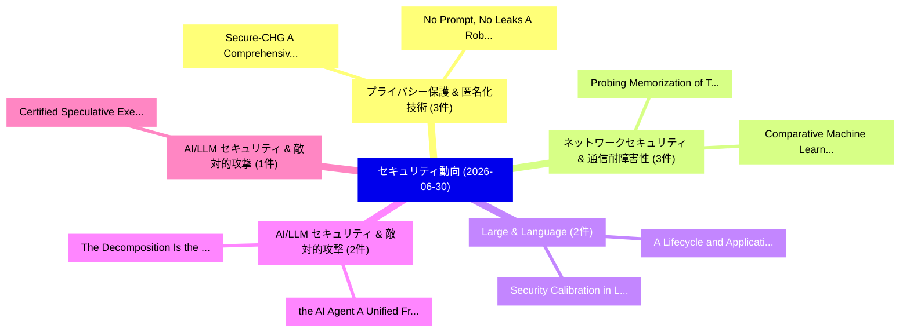

# 📅 02_daily: 日次エグゼクティブサマリー報告書 (2026-06-30)

**集計日時**: 2026-10-02 23:06:17 UTC  
**対象日付**: 2026-06-30  
**本日収集論文数**: 24 件  

---

## 💡 主要セキュリティ動向・脅威インサイト (Executive Insights)

本日の収集論文（計 24 件）において、以下の重点セキュリティ領域で活発な研究動向が確認されました：
- **プライバシー保護 & 匿名化技術** (3 件): 注目論文として 「Secure-CHG: A Comprehensive Fr...」、「No Prompt, No Leaks: A Robust ...」 等が発表され、実務防御および攻撃検証の進展が見られます。
- **ネットワークセキュリティ & 通信耐障害性** (3 件): 注目論文として 「Probing Memorization of Tabula...」、「Comparative Machine Learning b...」 等が発表され、実務防御および攻撃検証の進展が見られます。
- **Large & Language** (2 件): 注目論文として 「Security Calibration in Large ...」、「A Lifecycle and Application-St...」 等が発表され、実務防御および攻撃検証の進展が見られます。
- **AI/LLM セキュリティ & 敵対的攻撃** (2 件): 注目論文として 「the AI Agent: A Unified Framew...」、「The Decomposition Is the Finge...」 等が発表され、実務防御および攻撃検証の進展が見られます。
- **AI/LLM セキュリティ & 敵対的攻撃** (1 件): 注目論文として 「Certified Speculative Executio...」 等が発表され、実務防御および攻撃検証の進展が見られます。

### 🗺️ 技術・脅威トピックマインドマップ

---

## 📌 日次セキュリティ論文一覧 (日本語表形式)

| No | arXiv ID | 論文タイトル (日本語訳) | 重要キーワード | 構造化エグゼクティブ要約 (背景・提案・影響) | 脅威分類 | 詳細リンク |
|---|---|---|---|---|---|---|
| 1 | `2606.31023v1` | [Certified Speculative Execution for Untrusted AI Agents（セキュリティ分析論文）](../../okf/papers/2026-06-30/2606.31023.md) | `Certified Speculative Execution`, `Chenyu Zhou`, `Qiliang Jiang` | 【提案】概要 (Overview & Key Finding) 本論文「Certified Speculative Execution for Untrusted AI Agents...。実証評価により経営層・セキュリティ管理者向け推奨アクション (E... | `arXiv` | [arXiv](https://arxiv.org/abs/2606.31023v1) &#124; [OKF](../../okf/papers/2026-06-30/2606.31023.md) |
| 2 | `2606.31066v1` | [Secure-CHG: A Comprehensive Framework for Robust and Fair 連合学習 via Hybrid Defense and Contribution-Aware Trust](../../okf/papers/2026-06-30/2606.31066.md) | `Hybrid Defense`, `Aware Trust`, `Contribution-Aware Trust` | 【提案】概要 (Overview & Key Finding) 本論文「Secure-CHG: A Comprehensive Framework for Robust and Fa...。実証評価により経営層・セキュリティ管理者向け推奨アクション (E... | `arXiv` | [arXiv](https://arxiv.org/abs/2606.31066v1) &#124; [OKF](../../okf/papers/2026-06-30/2606.31066.md) |
| 3 | `2606.31159v1` | [Security Calibration in Large Language Models for Codeの実証研究](../../okf/papers/2026-06-30/2606.31159.md) | `Large Language Models`, `Security Calibration`, `Mohammed Latif Siddiq` | 【提案】概要 (Overview & Key Finding) 本論文「Security Calibration in Large Language Models for Codeの...。実証評価によりSantos - **。 | `arXiv` | [arXiv](https://arxiv.org/abs/2606.31159v1) &#124; [OKF](../../okf/papers/2026-06-30/2606.31159.md) |
| 4 | `2606.31168v1` | [Probe Choice Changes Canary-Memorization Verdicts: Three Post-Hoc Disagreement Case Studies in a Text-Dominant LoRA-Tuned Autoregressive Testbed（セキュリティ分析論文）](../../okf/papers/2026-06-30/2606.31168.md) | `Probe Choice Changes Canary`, `Hoc Disagreement Case Studies`, `Tuned Autoregressive Testbed` | 【提案】概要 (Overview & Key Finding) 本論文「Probe Choice Changes Canary-Memorization Verdicts: Thre...。実証評価により経営層・セキュリティ管理者向け推奨アクション (E... | `arXiv` | [arXiv](https://arxiv.org/abs/2606.31168v1) &#124; [OKF](../../okf/papers/2026-06-30/2606.31168.md) |
| 5 | `2606.31208v1` | [Probing Memorization of Tabular In-Context Learning（セキュリティ分析論文）](../../okf/papers/2026-06-30/2606.31208.md) | `Probing Memorization`, `Context Learning`, `In-Context Learning` | 【提案】概要 (Overview & Key Finding) 本論文「Probing Memorization of Tabular In-Context Learning（セキュ...。実証評価により経営層・セキュリティ管理者向け推奨アクション (E... | `arXiv` | [arXiv](https://arxiv.org/abs/2606.31208v1) &#124; [OKF](../../okf/papers/2026-06-30/2606.31208.md) |
| 6 | `2606.31227v1` | [the AI Agent: A Unified Framework for Multi-Layer Agent Red Teamingのセキュリティ強化](../../okf/papers/2026-06-30/2606.31227.md) | `Multi-Layer Agent`, `Layer Agent Red`, `Layer Agent Red Teaming` | 【提案】概要 (Overview & Key Finding) 本論文「the AI Agent: A Unified Framework for Multi-Layer Agent...。実証評価により経営層・セキュリティ管理者向け推奨アクション (E... | `arXiv` | [arXiv](https://arxiv.org/abs/2606.31227v1) &#124; [OKF](../../okf/papers/2026-06-30/2606.31227.md) |
| 7 | `2606.31272v1` | [The Decomposition Is the Fingerprint: Per-Component Identity for Agent Skills（セキュリティ分析論文）](../../okf/papers/2026-06-30/2606.31272.md) | `Component Identity`, `Agent Skills`, `Per-Component Identity` | 【提案】概要 (Overview & Key Finding) 本論文「The Decomposition Is the Fingerprint: Per-Component Ide...。実証評価により経営層・セキュリティ管理者向け推奨アクション (E... | `arXiv` | [arXiv](https://arxiv.org/abs/2606.31272v1) &#124; [OKF](../../okf/papers/2026-06-30/2606.31272.md) |
| 8 | `2606.31309v1` | [CSO-LLM: Class Subspace Orthogonalization for Post-Training Backdoor Detection and Trigger Inversion in LLMs（セキュリティ分析論文）](../../okf/papers/2026-06-30/2606.31309.md) | `Class Subspace Orthogonalization`, `Training Backdoor Detection`, `Trigger Inversion` | 【提案】概要 (Overview & Key Finding) 本論文「CSO-LLM: Class Subspace Orthogonalization for Post-Trai...。実証評価により経営層・セキュリティ管理者向け推奨アクション (E... | `arXiv` | [arXiv](https://arxiv.org/abs/2606.31309v1) &#124; [OKF](../../okf/papers/2026-06-30/2606.31309.md) |
| 9 | `2606.31345v1` | [Automated High-Precision Extraction and Forensic Verification of Data-Bearing Vector Figures（セキュリティ分析論文）](../../okf/papers/2026-06-30/2606.31345.md) | `Bearing Vector Figures`, `Automated High`, `Precision Extraction` | 【提案】概要 (Overview & Key Finding) 本論文「Automated High-Precision Extraction and Forensic Verifi...。実証評価により経営層・セキュリティ管理者向け推奨アクション (E... | `arXiv` | [arXiv](https://arxiv.org/abs/2606.31345v1) &#124; [OKF](../../okf/papers/2026-06-30/2606.31345.md) |
| 10 | `2606.31370v1` | [Witness Complexity of Short Descriptions: A Cryptographic Perspective（セキュリティ分析論文）](../../okf/papers/2026-06-30/2606.31370.md) | `Witness Complexity`, `Short Descriptions`, `Cryptographic Perspective` | 【提案】概要 (Overview & Key Finding) 本論文「Witness Complexity of Short Descriptions: A Cryptograph...。実証評価によりBuono - **公開日時**: `2026-0... | `arXiv` | [arXiv](https://arxiv.org/abs/2606.31370v1) &#124; [OKF](../../okf/papers/2026-06-30/2606.31370.md) |
| 11 | `2606.31408v1` | [EnclaveX: End-to-End Confidential AI with CPU/GPU TEEs（セキュリティ分析論文）](../../okf/papers/2026-06-30/2606.31408.md) | `End Confidential`, `Robert Schambach`, `Sergei Arnautov` | 【提案】概要 (Overview & Key Finding) 本論文「EnclaveX: End-to-End Confidential AI with CPU/GPU TEEs（...。実証評価により経営層・セキュリティ管理者向け推奨アクション (E... | `arXiv` | [arXiv](https://arxiv.org/abs/2606.31408v1) &#124; [OKF](../../okf/papers/2026-06-30/2606.31408.md) |
| 12 | `2606.31427v1` | [No Prompt, No Leaks: A Robust Generative Steganography Framework via Prompt-Free Diffusion（セキュリティ分析論文）](../../okf/papers/2026-06-30/2606.31427.md) | `Free Diffusion`, `Prompt-Free Diffusion`, `Robust Generative St` | 【提案】概要 (Overview & Key Finding) 本論文「No Prompt, No Leaks: A Robust Generative Steganography ...。実証評価により経営層・セキュリティ管理者向け推奨アクション (E... | `arXiv` | [arXiv](https://arxiv.org/abs/2606.31427v1) &#124; [OKF](../../okf/papers/2026-06-30/2606.31427.md) |
| 13 | `2606.31462v1` | [A forgery attack on the Block.co blockchain-based digital credential certification system（セキュリティ分析論文）](../../okf/papers/2026-06-30/2606.31462.md) | `blockchain-based digital`, `Giacomo Zonneveld`, `Giulia Rafaiani` | 【提案】概要 (Overview & Key Finding) 本論文「A forgery attack on the Block.co blockchain-based digit...。実証評価により経営層・セキュリティ管理者向け推奨アクション (E... | `arXiv` | [arXiv](https://arxiv.org/abs/2606.31462v1) &#124; [OKF](../../okf/papers/2026-06-30/2606.31462.md) |
| 14 | `2606.31557v2` | [CVE-TTP KG: Knowledge Graph Linking Software Vulnerabilities to Attack Behaviors（セキュリティ分析論文）](../../okf/papers/2026-06-30/2606.31557.md) | `Knowledge Graph Linking Software Vulnerabilities`, `CVE-TTP KG`, `Attack Behaviors` | 【提案】概要 (Overview & Key Finding) 本論文「CVE-TTP KG: Knowledge Graph Linking Software Vulnerabil...。実証評価により経営層・セキュリティ管理者向け推奨アクション (E... | `arXiv` | [arXiv](https://arxiv.org/abs/2606.31557v2) &#124; [OKF](../../okf/papers/2026-06-30/2606.31557.md) |
| 15 | `2606.31594v1` | [Comparative Machine Learning based Intrusion Detection in Realistic IoT Networksの分析](../../okf/papers/2026-06-30/2606.31594.md) | `Intrusion Detection`, `Comparative Machine Learning`, `Machine Learning` | 【提案】概要 (Overview & Key Finding) 本論文「Comparative Machine Learning based Intrusion Detection ...。実証評価により経営層・セキュリティ管理者向け推奨アクション (E... | `arXiv` | [arXiv](https://arxiv.org/abs/2606.31594v1) &#124; [OKF](../../okf/papers/2026-06-30/2606.31594.md) |
| 16 | `2606.31601v1` | [Digital signature schemes based on code equivalence and syndrome decoding from restricted errors（セキュリティ分析論文）](../../okf/papers/2026-06-30/2606.31601.md) | `Sarah Arpin`, `Raw Meta`, `Executive Summary` | 【提案】概要 (Overview & Key Finding) 本論文「Digital signature schemes based on code equivalence and...。実証評価により経営層・セキュリティ管理者向け推奨アクション (E... | `arXiv` | [arXiv](https://arxiv.org/abs/2606.31601v1) &#124; [OKF](../../okf/papers/2026-06-30/2606.31601.md) |
| 17 | `2606.31602v2` | [Robust Text Watermarking for 大規模言語モデル via Dual Semantic Embeddings](../../okf/papers/2026-06-30/2606.31602.md) | `Robust Text Watermarking`, `Dual Semantic Embeddings`, `Large Language Models` | 【提案】概要 (Overview & Key Finding) 本論文「Robust Text Watermarking for 大規模言語モデル via Dual Semantic...。実証評価により経営層・セキュリティ管理者向け推奨アクション (E... | `arXiv` | [arXiv](https://arxiv.org/abs/2606.31602v2) &#124; [OKF](../../okf/papers/2026-06-30/2606.31602.md) |
| 18 | `2606.31619v1` | [Hybrid Topological Data Analysis and LSTM Networks for Enhanced Network Intrusion Detection Using CIC-IDS2017 Dataset（セキュリティ分析論文）](../../okf/papers/2026-06-30/2606.31619.md) | `Enhanced Network Intrusion Detection Using`, `CIC-IDS2017 Dataset`, `Bhaskar Ranjan Karn` | 【提案】概要 (Overview & Key Finding) 本論文「Hybrid Topological Data Analysis and LSTM Networks for ...。実証評価により経営層・セキュリティ管理者向け推奨アクション (E... | `arXiv` | [arXiv](https://arxiv.org/abs/2606.31619v1) &#124; [OKF](../../okf/papers/2026-06-30/2606.31619.md) |
| 19 | `2606.31639v1` | [A Lifecycle and Application-Stack Survey of Large Language Model Vulnerabilities: Attacks, Risks, Defenses, and Open Problems（セキュリティ分析論文）](../../okf/papers/2026-06-30/2606.31639.md) | `Large Language Model Vulnerabilities`, `Stack Survey`, `Open Problems` | 【提案】概要 (Overview & Key Finding) 本論文「A Lifecycle and Application-Stack Survey of Large Langu...。実証評価により経営層・セキュリティ管理者向け推奨アクション (E... | `arXiv` | [arXiv](https://arxiv.org/abs/2606.31639v1) &#124; [OKF](../../okf/papers/2026-06-30/2606.31639.md) |
| 20 | `2606.31681v1` | [Exploring Side-Channel Protections in Hardware Implementations of PQC ML-KEM Verification（セキュリティ分析論文）](../../okf/papers/2026-06-30/2606.31681.md) | `Exploring Side`, `Channel Protections`, `Side-Channel Protections` | 【提案】概要 (Overview & Key Finding) 本論文「Exploring サイドチャネル攻撃 Protections in Hardware Implementat...。実証評価により経営層・セキュリティ管理者向け推奨アクション (E... | `arXiv` | [arXiv](https://arxiv.org/abs/2606.31681v1) &#124; [OKF](../../okf/papers/2026-06-30/2606.31681.md) |
| 21 | `2606.31790v1` | [Robocalls: A Worldwide or US-only Problem? Analyzing Spam and Fraud in International Phone Calls（セキュリティ分析論文）](../../okf/papers/2026-06-30/2606.31790.md) | `International Phone Calls`, `Analyzing Spam`, `US-only Problem` | 【提案】Analyzing Spam and Fraud in International Phone Calls ### (日本語題名: Robocalls: A Worldwid...。実証評価により経営層・セキュリティ管理者向け推奨アクション (E... | `arXiv` | [arXiv](https://arxiv.org/abs/2606.31790v1) &#124; [OKF](../../okf/papers/2026-06-30/2606.31790.md) |
| 22 | `2606.31973v1` | [Semantic Leakage and Privacy Preservation in Relay-Assisted Semantic Communications（セキュリティ分析論文）](../../okf/papers/2026-06-30/2606.31973.md) | `Assisted Semantic Communications`, `Semantic Leakage`, `Privacy Preservation` | 【提案】概要 (Overview & Key Finding) 本論文「Semantic Leakage and Privacy Preservation in Relay-Assi...。実証評価により経営層・セキュリティ管理者向け推奨アクション (E... | `arXiv` | [arXiv](https://arxiv.org/abs/2606.31973v1) &#124; [OKF](../../okf/papers/2026-06-30/2606.31973.md) |
| 23 | `2607.00186v1` | [A Non-Line-of-Sight, Multi-Modality-based Side-Channel IP Theft Attack on Additive Manufacturing Using Dual Smartphones（セキュリティ分析論文）](../../okf/papers/2026-06-30/2607.00186.md) | `Additive Manufacturing Using Dual Smartphones`, `Theft Attack`, `Side-Channel IP` | 【提案】概要 (Overview & Key Finding) 本論文「A Non-Line-of-Sight, Multi-Modality-based サイドチャネル攻撃 IP ...。実証評価により経営層・セキュリティ管理者向け推奨アクション (E... | `arXiv` | [arXiv](https://arxiv.org/abs/2607.00186v1) &#124; [OKF](../../okf/papers/2026-06-30/2607.00186.md) |
| 24 | `2607.00213v1` | [Federated Sovereign Transport Protocol (FSTP): Verifiable Coordination Without Disclosure（セキュリティ分析論文）](../../okf/papers/2026-06-30/2607.00213.md) | `Federated Sovereign Transport Protocol`, `Verifiable Coordination Without Disclosure`, `Liz Soto` | 【提案】背景とセキュリティ上の課題 (Background & Problem) 本研究はサイバー脅威環境におけるセキュリティ構造・脆弱性の検証を目的としています。(主要検出項目: ...。実証評価により経営層・セキュリティ管理者向け推奨アクション (E... | `arXiv` | [arXiv](https://arxiv.org/abs/2607.00213v1) &#124; [OKF](../../okf/papers/2026-06-30/2607.00213.md) |

