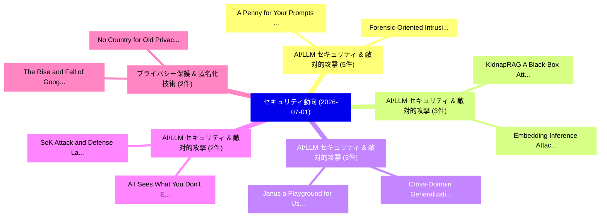

# 📅 02_daily: 日次エグゼクティブサマリー報告書 (2026-07-01)

**集計日時**: 2026-10-02 23:06:17 UTC  
**対象日付**: 2026-07-01  
**本日収集論文数**: 35 件  

---

## 💡 主要セキュリティ動向・脅威インサイト (Executive Insights)

本日の収集論文（計 35 件）において、以下の重点セキュリティ領域で活発な研究動向が確認されました：
- **AI/LLM セキュリティ & 敵対的攻撃** (5 件): 注目論文として 「A Penny for Your Prompts: Expe...」、「Forensic-Oriented Intrusion De...」 等が発表され、実務防御および攻撃検証の進展が見られます。
- **AI/LLM セキュリティ & 敵対的攻撃** (3 件): 注目論文として 「KidnapRAG: A Black-Box Attack ...」、「Embedding Inference Attack（セキュ...」 等が発表され、実務防御および攻撃検証の進展が見られます。
- **AI/LLM セキュリティ & 敵対的攻撃** (3 件): 注目論文として 「Cross-Domain Generalization Fa...」、「Janus: a Playground for User-I...」 等が発表され、実務防御および攻撃検証の進展が見られます。
- **AI/LLM セキュリティ & 敵対的攻撃** (2 件): 注目論文として 「(A)I Sees What You Don't: Expl...」、「SoK: Attack and Defense Landsc...」 等が発表され、実務防御および攻撃検証の進展が見られます。
- **プライバシー保護 & 匿名化技術** (2 件): 注目論文として 「The Rise and Fall of Google's ...」、「No Country for Old Privacy: Th...」 等が発表され、実務防御および攻撃検証の進展が見られます。

### 🗺️ 技術・脅威トピックマインドマップ

---

## 📌 日次セキュリティ論文一覧 (日本語表形式)

| No | arXiv ID | 論文タイトル (日本語訳) | 重要キーワード | 構造化エグゼクティブ要約 (背景・提案・影響) | 脅威分類 | 詳細リンク |
|---|---|---|---|---|---|---|
| 1 | `2607.00333v2` | [(A)I Sees What You Don't: Exploiting New Attack Surfaces in Third-Party Mobile Agents（セキュリティ分析論文）](../../okf/papers/2026-07-01/2607.00333.md) | `Exploiting New Attack Surfaces`, `Party Mobile Agents`, `Third-Party Mobile` | 【提案】概要 (Overview & Key Finding) 本論文「(A)I Sees What You Don't: Exploiting New Attack Surface...。実証評価により経営層・セキュリティ管理者向け推奨アクション (E... | `arXiv` | [arXiv](https://arxiv.org/abs/2607.00333v2) &#124; [OKF](../../okf/papers/2026-07-01/2607.00333.md) |
| 2 | `2607.00361v1` | [ReShift: Aha-Moment-Driven Reasoning-Level Backdoor Attacks on Vision-Language Models（セキュリティ分析論文）](../../okf/papers/2026-07-01/2607.00361.md) | `Level Backdoor Attacks`, `Driven Reasoning`, `Reasoning-Level Backdoor` | 【提案】概要 (Overview & Key Finding) 本論文「ReShift: Aha-Moment-Driven Reasoning-Level Backdoor Att...。実証評価により経営層・セキュリティ管理者向け推奨アクション (E... | `arXiv` | [arXiv](https://arxiv.org/abs/2607.00361v1) &#124; [OKF](../../okf/papers/2026-07-01/2607.00361.md) |
| 3 | `2607.00362v1` | [SoK: Attack and Defense Landscape of Mobile On-device AI Systems（セキュリティ分析論文）](../../okf/papers/2026-07-01/2607.00362.md) | `Defense Landscape`, `On-device AI`, `Yujin Huang` | 【提案】概要 (Overview & Key Finding) 本論文「SoK: Attack and Defense Landscape of Mobile On-device A...。実証評価により経営層・セキュリティ管理者向け推奨アクション (E... | `arXiv` | [arXiv](https://arxiv.org/abs/2607.00362v1) &#124; [OKF](../../okf/papers/2026-07-01/2607.00362.md) |
| 4 | `2607.00403v1` | [A Penny for Your Prompts: Experiments Detecting and Mitigating LLM Usage by Survey Respondents（セキュリティ分析論文）](../../okf/papers/2026-07-01/2607.00403.md) | `Experiments Detecting`, `Survey Respondents`, `Zane Xu` | 【提案】概要 (Overview & Key Finding) 本論文「A Penny for Your Prompts: Experiments Detecting and Mit...。実証評価により経営層・セキュリティ管理者向け推奨アクション (E... | `arXiv` | [arXiv](https://arxiv.org/abs/2607.00403v1) &#124; [OKF](../../okf/papers/2026-07-01/2607.00403.md) |
| 5 | `2607.00422v1` | [KidnapRAG: A Black-Box Attack for Hijacking Reasoning in Agentic Retrieval-Augmented Generation Systems（セキュリティ分析論文）](../../okf/papers/2026-07-01/2607.00422.md) | `Augmented Generation Systems`, `Box Attack`, `Hijacking Reasoning` | 【提案】概要 (Overview & Key Finding) 本論文「KidnapRAG: A Black-Box Attack for Hijacking Reasoning i...。実証評価により経営層・セキュリティ管理者向け推奨アクション (E... | `arXiv` | [arXiv](https://arxiv.org/abs/2607.00422v1) &#124; [OKF](../../okf/papers/2026-07-01/2607.00422.md) |
| 6 | `2607.00440v1` | [Minos: A Multi-Agent Collaborative Framework for Provenance-Based Backward Tracking（セキュリティ分析論文）](../../okf/papers/2026-07-01/2607.00440.md) | `Based Backward Tracking`, `Multi-Agent Collaborative`, `Provenance-Based Backward` | 【提案】概要 (Overview & Key Finding) 本論文「Minos: A Multi-Agent Collaborative Framework for Proven...。実証評価により経営層・セキュリティ管理者向け推奨アクション (E... | `arXiv` | [arXiv](https://arxiv.org/abs/2607.00440v1) &#124; [OKF](../../okf/papers/2026-07-01/2607.00440.md) |
| 7 | `2607.00481v1` | [Beyond the Prompt: Jailbreaking Function-Calling LLMs via Simulated Moderation Traces（セキュリティ分析論文）](../../okf/papers/2026-07-01/2607.00481.md) | `Simulated Moderation Traces`, `Jailbreaking Function`, `Function-Calling LLMs` | 【提案】概要 (Overview & Key Finding) 本論文「Beyond the Prompt: ジェイルブレイクing Function-Calling LLMs vi...。実証評価により経営層・セキュリティ管理者向け推奨アクション (E... | `arXiv` | [arXiv](https://arxiv.org/abs/2607.00481v1) &#124; [OKF](../../okf/papers/2026-07-01/2607.00481.md) |
| 8 | `2607.00553v1` | [Cross-Domain Generalization Failure in Lightweight Intrusion Detection Models for IIoT Networks（セキュリティ分析論文）](../../okf/papers/2026-07-01/2607.00553.md) | `Lightweight Intrusion Detection Models`, `Domain Generalization Failure`, `Cross-Domain Generalization` | 【提案】概要 (Overview & Key Finding) 本論文「Cross-Domain Generalization Failure in Lightweight Intr...。実証評価により経営層・セキュリティ管理者向け推奨アクション (E... | `arXiv` | [arXiv](https://arxiv.org/abs/2607.00553v1) &#124; [OKF](../../okf/papers/2026-07-01/2607.00553.md) |
| 9 | `2607.00572v3` | [HARC: Coupling Harmfulness and Refusal Directions for Robust Safety Alignment（セキュリティ分析論文）](../../okf/papers/2026-07-01/2607.00572.md) | `Robust Safety Alignment`, `Coupling Harmfulness`, `Refusal Directions` | 【提案】概要 (Overview & Key Finding) 本論文「HARC: Coupling Harmfulness and Refusal Directions for R...。実証評価により経営層・セキュリティ管理者向け推奨アクション (E... | `arXiv` | [arXiv](https://arxiv.org/abs/2607.00572v3) &#124; [OKF](../../okf/papers/2026-07-01/2607.00572.md) |
| 10 | `2607.00576v1` | [Safe Alone, Unsafe Together: Safeguarding Against Implicit Toxicity When Benign Images Combine（セキュリティ分析論文）](../../okf/papers/2026-07-01/2607.00576.md) | `Safe Alone`, `Unsafe Together`, `Jiaxian Lv` | 【提案】概要 (Overview & Key Finding) 本論文「Safe Alone, Unsafe Together: Safeguarding Against Impli...。実証評価により経営層・セキュリティ管理者向け推奨アクション (E... | `arXiv` | [arXiv](https://arxiv.org/abs/2607.00576v1) &#124; [OKF](../../okf/papers/2026-07-01/2607.00576.md) |
| 11 | `2607.00621v1` | [High-Performance NTT Accelerators for PQC leveraging Unified Redundant Arithmetic and Fine-Tuned Microarchitecture（セキュリティ分析論文）](../../okf/papers/2026-07-01/2607.00621.md) | `Unified Redundant Arithmetic`, `High-Performance NTT`, `Tuned Microarchitecture` | 【提案】概要 (Overview & Key Finding) 本論文「High-Performance NTT Accelerators for PQC leveraging Un...。実証評価により経営層・セキュリティ管理者向け推奨アクション (E... | `arXiv` | [arXiv](https://arxiv.org/abs/2607.00621v1) &#124; [OKF](../../okf/papers/2026-07-01/2607.00621.md) |
| 12 | `2607.00693v2` | [The Rise and Fall of Google's Privacy Sandbox（セキュリティ分析論文）](../../okf/papers/2026-07-01/2607.00693.md) | `Privacy Sandbox`, `Rachid Youssef Grib`, `Alberto Verna` | 【提案】概要 (Overview & Key Finding) 本論文「The Rise and Fall of Google's Privacy Sandbox（セキュリティ分析論...。実証評価により経営層・セキュリティ管理者向け推奨アクション (E... | `arXiv` | [arXiv](https://arxiv.org/abs/2607.00693v2) &#124; [OKF](../../okf/papers/2026-07-01/2607.00693.md) |
| 13 | `2607.00695v1` | [Know Thy Neighbor: Cross-TEE Mutual Attestation（セキュリティ分析論文）](../../okf/papers/2026-07-01/2607.00695.md) | `Know Thy Neighbor`, `Mutual Attestation`, `Cross-TEE Mutual` | 【提案】概要 (Overview & Key Finding) 本論文「Know Thy Neighbor: Cross-TEE Mutual Attestation（セキュリティ分...。実証評価によりCorreia - **公開日時**: `2026... | `arXiv` | [arXiv](https://arxiv.org/abs/2607.00695v1) &#124; [OKF](../../okf/papers/2026-07-01/2607.00695.md) |
| 14 | `2607.00751v1` | [SessionBound: Turning Enterprise Task Approval into Budgeted Database Sessions（セキュリティ分析論文）](../../okf/papers/2026-07-01/2607.00751.md) | `Turning Enterprise Task Approval`, `Budgeted Database Sessions`, `Minmin Wu` | 【提案】概要 (Overview & Key Finding) 本論文「SessionBound: Turning Enterprise Task Approval into Bud...。実証評価により経営層・セキュリティ管理者向け推奨アクション (E... | `arXiv` | [arXiv](https://arxiv.org/abs/2607.00751v1) &#124; [OKF](../../okf/papers/2026-07-01/2607.00751.md) |
| 15 | `2607.00763v1` | [Forensic-Oriented Intrusion Detection Using Synthetic Network Traffic Data and Explainable Artificial Intelligence（セキュリティ分析論文）](../../okf/papers/2026-07-01/2607.00763.md) | `Oriented Intrusion Detection Using Synthetic Network Traffic Data`, `Explainable Artificial Intelligence`, `Forensic-Oriented Intrusion` | 【提案】概要 (Overview & Key Finding) 本論文「Forensic-Oriented Intrusion Detection Using Synthetic N...。実証評価により経営層・セキュリティ管理者向け推奨アクション (E... | `arXiv` | [arXiv](https://arxiv.org/abs/2607.00763v1) &#124; [OKF](../../okf/papers/2026-07-01/2607.00763.md) |
| 16 | `2607.00772v2` | [No Country for Old Privacy: The Evolving Challenges of Anonymity in Bitcoin（セキュリティ分析論文）](../../okf/papers/2026-07-01/2607.00772.md) | `Old Privacy`, `Ben Hawkins`, `Joshua Levett` | 【提案】概要 (Overview & Key Finding) 本論文「No Country for Old Privacy: The Evolving Challenges of ...。実証評価により経営層・セキュリティ管理者向け推奨アクション (E... | `arXiv` | [arXiv](https://arxiv.org/abs/2607.00772v2) &#124; [OKF](../../okf/papers/2026-07-01/2607.00772.md) |
| 17 | `2607.00876v2` | [The Binary Tree Mechanism is Optimal for Approximate Differentially Private Continual Counting（セキュリティ分析論文）](../../okf/papers/2026-07-01/2607.00876.md) | `Approximate Differentially Private Continual Counting`, `Kasper Green Larsen`, `Konstantina Bairaktari` | 【提案】概要 (Overview & Key Finding) 本論文「The Binary Tree Mechanism is Optimal for Approximate Di...。実証評価により経営層・セキュリティ管理者向け推奨アクション (E... | `arXiv` | [arXiv](https://arxiv.org/abs/2607.00876v2) &#124; [OKF](../../okf/papers/2026-07-01/2607.00876.md) |
| 18 | `2607.01019v1` | [Toward a Unified Security and Privacy Framework for AI-Native 6G Networks（セキュリティ分析論文）](../../okf/papers/2026-07-01/2607.01019.md) | `Unified Security`, `AI-Native 6G`, `Bidushi Barua` | 【提案】概要 (Overview & Key Finding) 本論文「Toward a Unified Security and Privacy Framework for AI-...。実証評価により経営層・セキュリティ管理者向け推奨アクション (E... | `arXiv` | [arXiv](https://arxiv.org/abs/2607.01019v1) &#124; [OKF](../../okf/papers/2026-07-01/2607.01019.md) |
| 19 | `2607.01138v1` | [Antaeus: Hunting Repository-Level Logic Vulnerabilities via Context-Grounded LLM Reasoning（セキュリティ分析論文）](../../okf/papers/2026-07-01/2607.01138.md) | `Level Logic Vulnerabilities`, `Hunting Repository`, `Repository-Level Logic` | 【提案】概要 (Overview & Key Finding) 本論文「Antaeus: Hunting Repository-Level Logic Vulnerabilities...。実証評価により経営層・セキュリティ管理者向け推奨アクション (E... | `arXiv` | [arXiv](https://arxiv.org/abs/2607.01138v1) &#124; [OKF](../../okf/papers/2026-07-01/2607.01138.md) |
| 20 | `2607.01194v1` | [Detecting Adversarial Evasion Attacks Against Autoencoder-Based Network Intrusion Detection Systems（セキュリティ分析論文）](../../okf/papers/2026-07-01/2607.01194.md) | `Based Network Intrusion Detection Systems`, `Autoencoder-Based Network`, `Detecting Adversarial Evasion Att` | 【提案】概要 (Overview & Key Finding) 本論文「Detecting Adversarial Evasion Attacks Against Autoencod...。実証評価により経営層・セキュリティ管理者向け推奨アクション (E... | `arXiv` | [arXiv](https://arxiv.org/abs/2607.01194v1) &#124; [OKF](../../okf/papers/2026-07-01/2607.01194.md) |
| 21 | `2607.01209v3` | [All-out Attack: Optimal Block Withholding Under Pay-Per-Share Scheme（セキュリティ分析論文）](../../okf/papers/2026-07-01/2607.01209.md) | `Share Scheme`, `All-out Attack`, `Mustafa Doger` | 【提案】概要 (Overview & Key Finding) 本論文「All-out Attack: Optimal Block Withholding Under Pay-Per...。実証評価により経営層・セキュリティ管理者向け推奨アクション (E... | `Cryptography` | [arXiv](https://arxiv.org/abs/2607.01209v3) &#124; [OKF](../../okf/papers/2026-07-01/2607.01209.md) |
| 22 | `2607.01276v1` | [Embedding Inference Attack（セキュリティ分析論文）](../../okf/papers/2026-07-01/2607.01276.md) | `Embedding Inference Attack`, `Cedric Fitiavana Raelijohn`, `Francois Rajotte` | 【提案】概要 (Overview & Key Finding) 本論文「Embedding Inference Attack（セキュリティ分析論文）」（原題: Embedding I...。実証評価により経営層・セキュリティ管理者向け推奨アクション (E... | `arXiv` | [arXiv](https://arxiv.org/abs/2607.01276v1) &#124; [OKF](../../okf/papers/2026-07-01/2607.01276.md) |
| 23 | `2607.01277v1` | [Cognitive Firewall: A Proactive, Zero-Trust, Multi-Gate Framework for LLM Safety（セキュリティ分析論文）](../../okf/papers/2026-07-01/2607.01277.md) | `Cognitive Firewall`, `Noorbakhsh Amiri Golilarz`, `Michele Guida` | 【提案】概要 (Overview & Key Finding) 本論文「Cognitive Firewall: A Proactive, ゼロトラスト, Multi-Gate Fra...。実証評価により経営層・セキュリティ管理者向け推奨アクション (E... | `arXiv` | [arXiv](https://arxiv.org/abs/2607.01277v1) &#124; [OKF](../../okf/papers/2026-07-01/2607.01277.md) |
| 24 | `2607.01305v1` | [Generative AI and 連合学習 for Intrusion Detection Systems: A Survey](../../okf/papers/2026-07-01/2607.01305.md) | `Intrusion Detection Systems`, `Federated Learning`, `Abu Saleh Md Tayeen` | 【提案】概要 (Overview & Key Finding) 本論文「Generative AI and 連合学習 for Intrusion Detection Systems:...。実証評価により経営層・セキュリティ管理者向け推奨アクション (E... | `arXiv` | [arXiv](https://arxiv.org/abs/2607.01305v1) &#124; [OKF](../../okf/papers/2026-07-01/2607.01305.md) |
| 25 | `2607.01313v1` | [Black-Box Inference of LLM Architectural Properties with Restrictive API Access（セキュリティ分析論文）](../../okf/papers/2026-07-01/2607.01313.md) | `Box Inference`, `Black-Box Inference`, `Architectural Properties` | 【提案】概要 (Overview & Key Finding) 本論文「Black-Box Inference of LLM Architectural Properties wit...。実証評価により経営層・セキュリティ管理者向け推奨アクション (E... | `arXiv` | [arXiv](https://arxiv.org/abs/2607.01313v1) &#124; [OKF](../../okf/papers/2026-07-01/2607.01313.md) |
| 26 | `2607.01340v2` | [Extensions of root-based attacks against PLWE via isomorphisms of rings（セキュリティ分析論文）](../../okf/papers/2026-07-01/2607.01340.md) | `root-based attacks`, `Raw Meta`, `Executive Summary` | 【提案】概要 (Overview & Key Finding) 本論文「Extensions of root-based attacks against PLWE via isomo...。実証評価により経営層・セキュリティ管理者向け推奨アクション (E... | `arXiv` | [arXiv](https://arxiv.org/abs/2607.01340v2) &#124; [OKF](../../okf/papers/2026-07-01/2607.01340.md) |
| 27 | `2607.01356v1` | [Chameleon: Recovering Cyber-Physical Systems from Memory Corruption Attacks via ML Surrogates（セキュリティ分析論文）](../../okf/papers/2026-07-01/2607.01356.md) | `Memory Corruption Attacks`, `Recovering Cyber`, `Physical Systems` | 【提案】概要 (Overview & Key Finding) 本論文「Chameleon: Recovering Cyber-Physical Systems from Memor...。実証評価により経営層・セキュリティ管理者向け推奨アクション (E... | `arXiv` | [arXiv](https://arxiv.org/abs/2607.01356v1) &#124; [OKF](../../okf/papers/2026-07-01/2607.01356.md) |
| 28 | `2607.01435v2` | [Sign in the Air to Unlock: An Interface for authentication in Virtual and Augmented Reality Powered by Point-Voxel Cross-Attention Network（セキュリティ分析論文）](../../okf/papers/2026-07-01/2607.01435.md) | `Augmented Reality Powered`, `Voxel Cross`, `Attention Network` | 【提案】概要 (Overview & Key Finding) 本論文「Sign in the Air to Unlock: An Interface for authenticat...。実証評価により経営層・セキュリティ管理者向け推奨アクション (E... | `arXiv` | [arXiv](https://arxiv.org/abs/2607.01435v2) &#124; [OKF](../../okf/papers/2026-07-01/2607.01435.md) |
| 29 | `2607.01442v1` | [From Forgeries to Foundation Models: A Systematic Survey of Identity Document Attack and Detection（セキュリティ分析論文）](../../okf/papers/2026-07-01/2607.01442.md) | `Identity Document Attack`, `Foundation Models`, `Systematic Survey` | 【提案】概要 (Overview & Key Finding) 本論文「From Forgeries to Foundation Models: A Systematic Surve...。実証評価により経営層・セキュリティ管理者向け推奨アクション (E... | `arXiv` | [arXiv](https://arxiv.org/abs/2607.01442v1) &#124; [OKF](../../okf/papers/2026-07-01/2607.01442.md) |
| 30 | `2607.01445v1` | [Hamm-Grams: An Algorithm for Mining Regular Expressions of Bytes（セキュリティ分析論文）](../../okf/papers/2026-07-01/2607.01445.md) | `Mining Regular Expressions`, `Derek Everett`, `Edward Raff` | 【提案】概要 (Overview & Key Finding) 本論文「Hamm-Grams: An Algorithm for Mining Regular Expressions...。実証評価により経営層・セキュリティ管理者向け推奨アクション (E... | `arXiv` | [arXiv](https://arxiv.org/abs/2607.01445v1) &#124; [OKF](../../okf/papers/2026-07-01/2607.01445.md) |
| 31 | `2607.01492v1` | [Unveiling the Non-Monotonic Effect of Privacy on Generalization under Byzantine Robustness（セキュリティ分析論文）](../../okf/papers/2026-07-01/2607.01492.md) | `Monotonic Effect`, `Byzantine Robustness`, `Non-Monotonic Effect` | 【提案】概要 (Overview & Key Finding) 本論文「Unveiling the Non-Monotonic Effect of Privacy on Genera...。実証評価により経営層・セキュリティ管理者向け推奨アクション (E... | `arXiv` | [arXiv](https://arxiv.org/abs/2607.01492v1) &#124; [OKF](../../okf/papers/2026-07-01/2607.01492.md) |
| 32 | `2607.01510v1` | [Janus: a Playground for User-Involved Agentic Permission Management（セキュリティ分析論文）](../../okf/papers/2026-07-01/2607.01510.md) | `Involved Agentic Permission Management`, `User-Involved Agentic`, `Natalie Grace Brigham` | 【提案】概要 (Overview & Key Finding) 本論文「Janus: a Playground for User-Involved Agentic Permissio...。実証評価により経営層・セキュリティ管理者向け推奨アクション (E... | `arXiv` | [arXiv](https://arxiv.org/abs/2607.01510v1) &#124; [OKF](../../okf/papers/2026-07-01/2607.01510.md) |
| 33 | `2607.01518v1` | [Overthink-Triggered Slowdown Attacks on LVLM-Based Robotic Systems（セキュリティ分析論文）](../../okf/papers/2026-07-01/2607.01518.md) | `Triggered Slowdown Attacks`, `Based Robotic Systems`, `Overthink-Triggered Slowdown` | 【提案】概要 (Overview & Key Finding) 本論文「Overthink-Triggered Slowdown Attacks on LVLM-Based Robo...。実証評価により経営層・セキュリティ管理者向け推奨アクション (E... | `arXiv` | [arXiv](https://arxiv.org/abs/2607.01518v1) &#124; [OKF](../../okf/papers/2026-07-01/2607.01518.md) |
| 34 | `2607.01526v1` | [LIB-TRAP: Standard Cell Library Hardware Trojan Risk Assessment and Prevention（セキュリティ分析論文）](../../okf/papers/2026-07-01/2607.01526.md) | `Standard Cell Library Hardware Trojan Risk Assessment`, `Md Muhtasim Alam Chowdhury`, `Harish Kumar Dharavath` | 【提案】概要 (Overview & Key Finding) 本論文「LIB-TRAP: Standard Cell Library Hardware Trojan Risk As...。実証評価により経営層・セキュリティ管理者向け推奨アクション (E... | `arXiv` | [arXiv](https://arxiv.org/abs/2607.01526v1) &#124; [OKF](../../okf/papers/2026-07-01/2607.01526.md) |
| 35 | `2607.02615v2` | [TAG: A Lightweight Framework for Test-Driven Agentic Artifact Generation（セキュリティ分析論文）](../../okf/papers/2026-07-01/2607.02615.md) | `Driven Agentic Artifact Generation`, `Test-Driven Agentic`, `Yaniv Melamed` | 【提案】概要 (Overview & Key Finding) 本論文「TAG: A Lightweight Framework for Test-Driven Agentic Ar...。実証評価により経営層・セキュリティ管理者向け推奨アクション (E... | `arXiv` | [arXiv](https://arxiv.org/abs/2607.02615v2) &#124; [OKF](../../okf/papers/2026-07-01/2607.02615.md) |

