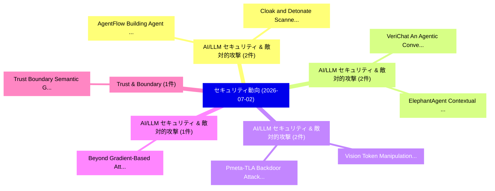

# 📅 02_daily: 日次エグゼクティブサマリー報告書 (2026-07-02)

**集計日時**: 2026-10-02 23:06:17 UTC  
**対象日付**: 2026-07-02  
**本日収集論文数**: 24 件  

---

## 💡 主要セキュリティ動向・脅威インサイト (Executive Insights)

本日の収集論文（計 24 件）において、以下の重点セキュリティ領域で活発な研究動向が確認されました：
- **AI/LLM セキュリティ & 敵対的攻撃** (2 件): 注目論文として 「AgentFlow: Building Agent Depe...」、「Cloak and Detonate: Scanner Ev...」 等が発表され、実務防御および攻撃検証の進展が見られます。
- **AI/LLM セキュリティ & 敵対的攻撃** (2 件): 注目論文として 「VeriChat: An Agentic Conversat...」、「ElephantAgent: Contextual Stat...」 等が発表され、実務防御および攻撃検証の進展が見られます。
- **AI/LLM セキュリティ & 敵対的攻撃** (2 件): 注目論文として 「Pmeta-TLA: Backdoor Attacks fo...」、「Vision Token Manipulation Atta...」 等が発表され、実務防御および攻撃検証の進展が見られます。
- **AI/LLM セキュリティ & 敵対的攻撃** (1 件): 注目論文として 「Beyond Gradient-Based Attacks:...」 等が発表され、実務防御および攻撃検証の進展が見られます。
- **Trust & Boundary** (1 件): 注目論文として 「Trust Boundary Semantic Gaps: ...」 等が発表され、実務防御および攻撃検証の進展が見られます。

### 🗺️ 技術・脅威トピックマインドマップ

---

## 📌 日次セキュリティ論文一覧 (日本語表形式)

| No | arXiv ID | 論文タイトル (日本語訳) | 重要キーワード | 構造化エグゼクティブ要約 (背景・提案・影響) | 脅威分類 | 詳細リンク |
|---|---|---|---|---|---|---|
| 1 | `2607.01640v1` | [AgentFlow: Building Agent Dependency Graphs for Static Agent Programsの分析](../../okf/papers/2026-07-02/2607.01640.md) | `Building Agent Dependency Graphs`, `Agent Programs`, `Static Agent` | 【提案】概要 (Overview & Key Finding) 本論文「AgentFlow: Building Agent Dependency Graphs for Static ...。実証評価により経営層・セキュリティ管理者向け推奨アクション (E... | `arXiv` | [arXiv](https://arxiv.org/abs/2607.01640v1) &#124; [OKF](../../okf/papers/2026-07-02/2607.01640.md) |
| 2 | `2607.01668v1` | [VeriChat: An Agentic Conversational AI Assistant for Hardware Security Verification（セキュリティ分析論文）](../../okf/papers/2026-07-02/2607.01668.md) | `Hardware Security Verification`, `Khan Thamid Hasan`, `Sujan Kumar Saha` | 【提案】概要 (Overview & Key Finding) 本論文「VeriChat: An Agentic Conversational AI Assistant for Ha...。実証評価により経営層・セキュリティ管理者向け推奨アクション (E... | `arXiv` | [arXiv](https://arxiv.org/abs/2607.01668v1) &#124; [OKF](../../okf/papers/2026-07-02/2607.01668.md) |
| 3 | `2607.01679v1` | [Beyond Gradient-Based Attacks: Adversarial Robustness and Explainability Stability in サイバーセキュリティ Classifiers](../../okf/papers/2026-07-02/2607.01679.md) | `Beyond Gradient`, `Based Attacks`, `Adversarial Robustness` | 【提案】概要 (Overview & Key Finding) 本論文「Beyond Gradient-Based Attacks: Adversarial Robustness a...。実証評価により経営層・セキュリティ管理者向け推奨アクション (E... | `arXiv` | [arXiv](https://arxiv.org/abs/2607.01679v1) &#124; [OKF](../../okf/papers/2026-07-02/2607.01679.md) |
| 4 | `2607.01702v1` | [Pmeta-TLA: Backdoor Attacks for Speech Classification Models via Meta-Learning with Timbre Leakage Attack（セキュリティ分析論文）](../../okf/papers/2026-07-02/2607.01702.md) | `Speech Classification Models`, `Timbre Leakage Attack`, `Backdoor Attacks` | 【提案】概要 (Overview & Key Finding) 本論文「Pmeta-TLA: Backdoor Attacks for Speech Classification M...。実証評価により経営層・セキュリティ管理者向け推奨アクション (E... | `arXiv` | [arXiv](https://arxiv.org/abs/2607.01702v1) &#124; [OKF](../../okf/papers/2026-07-02/2607.01702.md) |
| 5 | `2607.01711v1` | [Trust Boundary Semantic Gaps: A Multi-dimensional Analysis and Mitigation for Security-by-Design（セキュリティ分析論文）](../../okf/papers/2026-07-02/2607.01711.md) | `Trust Boundary Semantic Gaps`, `Doyeon Kim`, `Young Choi` | 【提案】概要 (Overview & Key Finding) 本論文「Trust Boundary Semantic Gaps: A Multi-dimensional Analy...。実証評価により経営層・セキュリティ管理者向け推奨アクション (E... | `arXiv` | [arXiv](https://arxiv.org/abs/2607.01711v1) &#124; [OKF](../../okf/papers/2026-07-02/2607.01711.md) |
| 6 | `2607.01730v2` | [Resilient Liquid Democracy: Secure Delegation NetworksによるVoting Power Imbalancesの軽減](../../okf/papers/2026-07-02/2607.01730.md) | `Resilient Liquid Democracy`, `Mitigating Voting Power Imbalances`, `Secure Delegation Networks` | 【提案】概要 (Overview & Key Finding) 本論文「Resilient Liquid Democracy: Secure Delegation Networksに...。実証評価により経営層・セキュリティ管理者向け推奨アクション (E... | `arXiv` | [arXiv](https://arxiv.org/abs/2607.01730v2) &#124; [OKF](../../okf/papers/2026-07-02/2607.01730.md) |
| 7 | `2607.01742v1` | [Knowledge Over Parameters: Evolving Smart Contract 脆弱性検出](../../okf/papers/2026-07-02/2607.01742.md) | `Evolving Smart Contract Vulnerability Detection`, `Evolving Smart Contract`, `Yuqiang Sun` | 【提案】概要 (Overview & Key Finding) 本論文「Knowledge Over Parameters: Evolving スマートコントラクト 脆弱性検出」（原...。実証評価により経営層・セキュリティ管理者向け推奨アクション (E... | `arXiv` | [arXiv](https://arxiv.org/abs/2607.01742v1) &#124; [OKF](../../okf/papers/2026-07-02/2607.01742.md) |
| 8 | `2607.01854v2` | [Has This Checkpoint Been Abliterated? A Two-Signal Audit and Its Failure Map（セキュリティ分析論文）](../../okf/papers/2026-07-02/2607.01854.md) | `Signal Audit`, `Two-Signal Audit`, `General Cyber Security` | 【提案】A Two-Signal Audit and Its Failure Map ### (日本語題名: Has This Checkpoint Been Abliterated?。実証評価により経営層・セキュリティ管理者向け推奨アクション (Exe... | `General Cyber Security` | [arXiv](https://arxiv.org/abs/2607.01854v2) &#124; [OKF](../../okf/papers/2026-07-02/2607.01854.md) |
| 9 | `2607.01919v1` | [ElephantAgent: Contextual State Continuity in Agentic Systems（セキュリティ分析論文）](../../okf/papers/2026-07-02/2607.01919.md) | `Contextual State Continuity`, `Agentic Systems`, `Jiankai Jin` | 【提案】概要 (Overview & Key Finding) 本論文「ElephantAgent: Contextual State Continuity in Agentic S...。実証評価により経営層・セキュリティ管理者向け推奨アクション (E... | `arXiv` | [arXiv](https://arxiv.org/abs/2607.01919v1) &#124; [OKF](../../okf/papers/2026-07-02/2607.01919.md) |
| 10 | `2607.02072v2` | [kNNGuard: Turning LLM Hidden Activations into a Training-Free Configurable Guardrail（セキュリティ分析論文）](../../okf/papers/2026-07-02/2607.02072.md) | `Free Configurable Guardrail`, `Hidden Activations`, `Training-Free Configurable` | 【提案】概要 (Overview & Key Finding) 本論文「kNNGuard: Turning LLM Hidden Activations into a Trainin...。実証評価により経営層・セキュリティ管理者向け推奨アクション (E... | `arXiv` | [arXiv](https://arxiv.org/abs/2607.02072v2) &#124; [OKF](../../okf/papers/2026-07-02/2607.02072.md) |
| 11 | `2607.02079v1` | [HaloGuard 1.0: An Open Weights Constitutional Classifier for Multilingual AI Safety（セキュリティ分析論文）](../../okf/papers/2026-07-02/2607.02079.md) | `Navaneeth Sangameswaran`, `Ashmiya Lenin`, `Raw Meta` | 【提案】概要 (Overview & Key Finding) 本論文「HaloGuard 1.0: An Open Weights Constitutional Classifie...。実証評価により経営層・セキュリティ管理者向け推奨アクション (E... | `arXiv` | [arXiv](https://arxiv.org/abs/2607.02079v1) &#124; [OKF](../../okf/papers/2026-07-02/2607.02079.md) |
| 12 | `2607.02121v1` | [Behind the Refusal: Determining Guardrail Activation via Behavioral Monitoring（セキュリティ分析論文）](../../okf/papers/2026-07-02/2607.02121.md) | `Determining Guardrail Activation`, `Behavioral Monitoring`, `William Hackett` | 【提案】概要 (Overview & Key Finding) 本論文「Behind the Refusal: Determining Guardrail Activation vi...。実証評価により経営層・セキュリティ管理者向け推奨アクション (E... | `arXiv` | [arXiv](https://arxiv.org/abs/2607.02121v1) &#124; [OKF](../../okf/papers/2026-07-02/2607.02121.md) |
| 13 | `2607.02187v1` | [Privacy-Preserving and Verifiable Approximate Distributed Coded Computing（セキュリティ分析論文）](../../okf/papers/2026-07-02/2607.02187.md) | `Verifiable Approximate Distributed Coded Computing`, `Alba Gude`, `Raw Meta` | 【提案】概要 (Overview & Key Finding) 本論文「Privacy-Preserving and Verifiable Approximate Distribut...。実証評価により経営層・セキュリティ管理者向け推奨アクション (E... | `arXiv` | [arXiv](https://arxiv.org/abs/2607.02187v1) &#124; [OKF](../../okf/papers/2026-07-02/2607.02187.md) |
| 14 | `2607.02197v1` | [Overview of Risk Assessment and Management for Intelligent Systems under the AI Act and Beyond（セキュリティ分析論文）](../../okf/papers/2026-07-02/2607.02197.md) | `Risk Assessment`, `Intelligent Systems`, `Javier Irigoyen` | 【提案】概要 (Overview & Key Finding) 本論文「Overview of Risk Assessment and Management for Intellig...。実証評価により経営層・セキュリティ管理者向け推奨アクション (E... | `arXiv` | [arXiv](https://arxiv.org/abs/2607.02197v1) &#124; [OKF](../../okf/papers/2026-07-02/2607.02197.md) |
| 15 | `2607.02304v1` | [People and their Machines Against Major Faultsのセキュリティ強化](../../okf/papers/2026-07-02/2607.02304.md) | `Securing People`, `Ohad Eitan`, `Idit Keidar` | 【提案】概要 (Overview & Key Finding) 本論文「People and their Machines Against Major Faultsのセキュリティ強化...。実証評価により経営層・セキュリティ管理者向け推奨アクション (E... | `arXiv` | [arXiv](https://arxiv.org/abs/2607.02304v1) &#124; [OKF](../../okf/papers/2026-07-02/2607.02304.md) |
| 16 | `2607.02357v2` | [Cloak and Detonate: Scanner Evasion and Dynamic Agent Skill Malwareの検出](../../okf/papers/2026-07-02/2607.02357.md) | `Scanner Evasion`, `Agent Skill Malware`, `Dynamic Agent Skill` | 【提案】概要 (Overview & Key Finding) 本論文「Cloak and Detonate: Scanner Evasion and Dynamic Agent S...。実証評価により経営層・セキュリティ管理者向け推奨アクション (E... | `arXiv` | [arXiv](https://arxiv.org/abs/2607.02357v2) &#124; [OKF](../../okf/papers/2026-07-02/2607.02357.md) |
| 17 | `2607.02389v1` | [Steerability via constraints: a substrate for scalable oversight of coding agents（セキュリティ分析論文）](../../okf/papers/2026-07-02/2607.02389.md) | `Thomas Winninger`, `Raw Meta`, `Executive Summary` | 【提案】概要 (Overview & Key Finding) 本論文「Steerability via constraints: a substrate for scalable ...。実証評価により経営層・セキュリティ管理者向け推奨アクション (E... | `arXiv` | [arXiv](https://arxiv.org/abs/2607.02389v1) &#124; [OKF](../../okf/papers/2026-07-02/2607.02389.md) |
| 18 | `2607.02442v1` | [HTTP REST API Structure Learning（セキュリティ分析論文）](../../okf/papers/2026-07-02/2607.02442.md) | `Structure Learning`, `Ran Dubin`, `Amit Dvir` | 【提案】概要 (Overview & Key Finding) 本論文「HTTP REST API Structure Learning（セキュリティ分析論文）」（原題: HTTP ...。実証評価により経営層・セキュリティ管理者向け推奨アクション (E... | `arXiv` | [arXiv](https://arxiv.org/abs/2607.02442v1) &#124; [OKF](../../okf/papers/2026-07-02/2607.02442.md) |
| 19 | `2607.02451v1` | [SoK: A Taxonomy for サイバーセキュリティ Incident Response Influence Factors](../../okf/papers/2026-07-02/2607.02451.md) | `Cybersecurity Incident Response Influence Factors`, `Incident Response Influence Factors`, `Thomas Biege` | 【提案】概要 (Overview & Key Finding) 本論文「SoK: A Taxonomy for サイバーセキュリティ Incident Response Influe...。実証評価により経営層・セキュリティ管理者向け推奨アクション (E... | `arXiv` | [arXiv](https://arxiv.org/abs/2607.02451v1) &#124; [OKF](../../okf/papers/2026-07-02/2607.02451.md) |
| 20 | `2607.02687v1` | [RES-DARE: Failure-Aware Expert Adaptation and Rollback-Safe Self-Repair for Intrusion Detection（セキュリティ分析論文）](../../okf/papers/2026-07-02/2607.02687.md) | `Aware Expert Adaptation`, `Safe Self`, `Failure-Aware Expert` | 【提案】概要 (Overview & Key Finding) 本論文「RES-DARE: Failure-Aware Expert Adaptation and Rollback-...。実証評価により経営層・セキュリティ管理者向け推奨アクション (E... | `arXiv` | [arXiv](https://arxiv.org/abs/2607.02687v1) &#124; [OKF](../../okf/papers/2026-07-02/2607.02687.md) |
| 21 | `2607.02714v2` | [Not All Refusals Are Equal: How Safety Alignment Fails サイバーセキュリティ at Scale](../../okf/papers/2026-07-02/2607.02714.md) | `Vadym Hadetskyi`, `Dario Pasquini`, `Artem Sorokin` | 【提案】背景とセキュリティ上の課題 (Background & Problem) 本研究はサイバー脅威環境におけるセキュリティ構造・脆弱性の検証を目的としています。(主要検出項目: ...。実証評価により経営層・セキュリティ管理者向け推奨アクション (E... | `arXiv` | [arXiv](https://arxiv.org/abs/2607.02714v2) &#124; [OKF](../../okf/papers/2026-07-02/2607.02714.md) |
| 22 | `2607.02819v1` | [Vision Token Manipulation Attacks on Cloud-Edge Inference of Large Vision-Language Models（セキュリティ分析論文）](../../okf/papers/2026-07-02/2607.02819.md) | `Vision Token Manipulation Attacks`, `Edge Inference`, `Large Vision` | 【提案】概要 (Overview & Key Finding) 本論文「Vision Token Manipulation Attacks on Cloud-Edge Inferen...。実証評価により経営層・セキュリティ管理者向け推奨アクション (E... | `arXiv` | [arXiv](https://arxiv.org/abs/2607.02819v1) &#124; [OKF](../../okf/papers/2026-07-02/2607.02819.md) |
| 23 | `2607.02820v2` | [Git Hash Chain Malleability（セキュリティ分析論文）](../../okf/papers/2026-07-02/2607.02820.md) | `Git Hash Chain Malleability`, `Jacob Ginesin`, `Raw Meta` | 【提案】概要 (Overview & Key Finding) 本論文「Git Hash Chain Malleability（セキュリティ分析論文）」（原題: Git Hash C...。実証評価により経営層・セキュリティ管理者向け推奨アクション (E... | `arXiv` | [arXiv](https://arxiv.org/abs/2607.02820v2) &#124; [OKF](../../okf/papers/2026-07-02/2607.02820.md) |
| 24 | `2607.02825v1` | [JavaVulBench: A Java Vulnerability Benchmark with Realistic Splits, a Unified Multi-Backend Harness, and a Leakage-Aware Evaluation Mode（セキュリティ分析論文）](../../okf/papers/2026-07-02/2607.02825.md) | `Java Vulnerability Benchmark`, `Realistic Splits`, `Unified Multi` | 【提案】概要 (Overview & Key Finding) 本論文「JavaVulBench: A Java 脆弱性 Benchmark with Realistic Split...。実証評価により経営層・セキュリティ管理者向け推奨アクション (E... | `arXiv` | [arXiv](https://arxiv.org/abs/2607.02825v1) &#124; [OKF](../../okf/papers/2026-07-02/2607.02825.md) |

