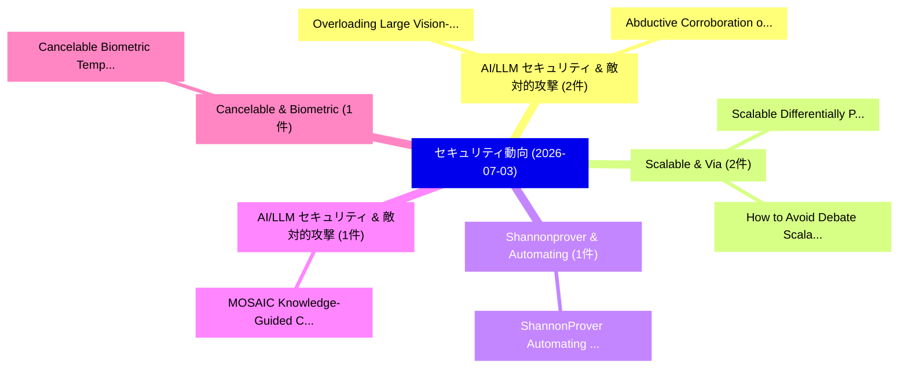

# 📅 02_daily: 日次エグゼクティブサマリー報告書 (2026-07-03)

**集計日時**: 2026-10-02 23:06:17 UTC  
**対象日付**: 2026-07-03  
**本日収集論文数**: 29 件  

---

## 💡 主要セキュリティ動向・脅威インサイト (Executive Insights)

本日の収集論文（計 29 件）において、以下の重点セキュリティ領域で活発な研究動向が確認されました：
- **AI/LLM セキュリティ & 敵対的攻撃** (2 件): 注目論文として 「Overloading Large Vision-Langu...」、「Abductive Corroboration of Pro...」 等が発表され、実務防御および攻撃検証の進展が見られます。
- **Scalable & Via** (2 件): 注目論文として 「Scalable Differentially Privat...」、「How to Avoid Debate: Scalable ...」 等が発表され、実務防御および攻撃検証の進展が見られます。
- **Shannonprover & Automating** (1 件): 注目論文として 「ShannonProver: Automating Form...」 等が発表され、実務防御および攻撃検証の進展が見られます。
- **AI/LLM セキュリティ & 敵対的攻撃** (1 件): 注目論文として 「MOSAIC: Knowledge-Guided CLI C...」 等が発表され、実務防御および攻撃検証の進展が見られます。
- **Cancelable & Biometric** (1 件): 注目論文として 「Cancelable Biometric Template ...」 等が発表され、実務防御および攻撃検証の進展が見られます。

### 🗺️ 技術・脅威トピックマインドマップ

---

## 📌 日次セキュリティ論文一覧 (日本語表形式)

| No | arXiv ID | 論文タイトル (日本語訳) | 重要キーワード | 構造化エグゼクティブ要約 (背景・提案・影響) | 脅威分類 | 詳細リンク |
|---|---|---|---|---|---|---|
| 1 | `2607.02847v2` | [ShannonProver: Automating Formal Cryptographic Proofsに向けて](../../okf/papers/2026-07-03/2607.02847.md) | `Towards Automating Formal Cryptographic Proofs`, `Automating Formal Cryptographic`, `Raluca Ada Popa` | 【提案】概要 (Overview & Key Finding) 本論文「ShannonProver: Automating Formal Cryptographic Proofsに向...。実証評価により経営層・セキュリティ管理者向け推奨アクション (E... | `arXiv` | [arXiv](https://arxiv.org/abs/2607.02847v2) &#124; [OKF](../../okf/papers/2026-07-03/2607.02847.md) |
| 2 | `2607.02857v1` | [MOSAIC: Knowledge-Guided CLI Command Composition Attack in LLM Coding Agents（セキュリティ分析論文）](../../okf/papers/2026-07-03/2607.02857.md) | `Command Composition Attack`, `Coding Agents`, `Knowledge-Guided CLI` | 【提案】概要 (Overview & Key Finding) 本論文「MOSAIC: Knowledge-Guided CLI Command Composition Attack...。実証評価により経営層・セキュリティ管理者向け推奨アクション (E... | `arXiv` | [arXiv](https://arxiv.org/abs/2607.02857v1) &#124; [OKF](../../okf/papers/2026-07-03/2607.02857.md) |
| 3 | `2607.02860v1` | [Cancelable Biometric Template Protection Based on Multi-Instance Fusion: A Contralateral Iris Approach（セキュリティ分析論文）](../../okf/papers/2026-07-03/2607.02860.md) | `Cancelable Biometric Template Protection Based`, `Instance Fusion`, `Multi-Instance Fusion` | 【提案】概要 (Overview & Key Finding) 本論文「Cancelable Biometric Template Protection Based on Multi...。実証評価により経営層・セキュリティ管理者向け推奨アクション (E... | `arXiv` | [arXiv](https://arxiv.org/abs/2607.02860v1) &#124; [OKF](../../okf/papers/2026-07-03/2607.02860.md) |
| 4 | `2607.02873v1` | [Determinants and Limits of LLM Security-Tool Orchestration: A Study with HexStrike-AI（セキュリティ分析論文）](../../okf/papers/2026-07-03/2607.02873.md) | `Tool Orchestration`, `Security-Tool Orchestration`, `Romain Gerard` | 【提案】概要 (Overview & Key Finding) 本論文「Determinants and Limits of LLM Security-Tool Orchestrat...。実証評価により経営層・セキュリティ管理者向け推奨アクション (E... | `arXiv` | [arXiv](https://arxiv.org/abs/2607.02873v1) &#124; [OKF](../../okf/papers/2026-07-03/2607.02873.md) |
| 5 | `2607.02875v1` | [Overprivilege Security Policies in Serverless Cloud Applicationsの分析](../../okf/papers/2026-07-03/2607.02875.md) | `Serverless Cloud Applications`, `Overprivilege Security Policies`, `Security Policies` | 【提案】概要 (Overview & Key Finding) 本論文「Overprivilege Security Policies in Serverless Cloud App...。実証評価により経営層・セキュリティ管理者向け推奨アクション (E... | `arXiv` | [arXiv](https://arxiv.org/abs/2607.02875v1) &#124; [OKF](../../okf/papers/2026-07-03/2607.02875.md) |
| 6 | `2607.02897v1` | [PPE-Bench: A Benchmark for Evaluating MLLM Unlearning under Private-Public Entanglement（セキュリティ分析論文）](../../okf/papers/2026-07-03/2607.02897.md) | `Public Entanglement`, `Private-Public Entanglement`, `Delvin Ce Zhang` | 【提案】概要 (Overview & Key Finding) 本論文「PPE-Bench: A Benchmark for Evaluating MLLM Unlearning u...。実証評価により経営層・セキュリティ管理者向け推奨アクション (E... | `arXiv` | [arXiv](https://arxiv.org/abs/2607.02897v1) &#124; [OKF](../../okf/papers/2026-07-03/2607.02897.md) |
| 7 | `2607.02903v1` | [TIER: Trajectory-Invariant Explanation Regularization for Membership Privacy（セキュリティ分析論文）](../../okf/papers/2026-07-03/2607.02903.md) | `Invariant Explanation Regularization`, `Membership Privacy`, `Trajectory-Invariant Explanation` | 【提案】概要 (Overview & Key Finding) 本論文「TIER: Trajectory-Invariant Explanation Regularization f...。実証評価により経営層・セキュリティ管理者向け推奨アクション (E... | `arXiv` | [arXiv](https://arxiv.org/abs/2607.02903v1) &#124; [OKF](../../okf/papers/2026-07-03/2607.02903.md) |
| 8 | `2607.02932v1` | [PromptPET: Privacy-Utility Optimized Prompt Obfuscation（セキュリティ分析論文）](../../okf/papers/2026-07-03/2607.02932.md) | `Utility Optimized Prompt Obfuscation`, `Privacy-Utility Optimized`, `Ke Yang` | 【提案】概要 (Overview & Key Finding) 本論文「PromptPET: Privacy-Utility Optimized Prompt Obfuscation...。実証評価により経営層・セキュリティ管理者向け推奨アクション (E... | `arXiv` | [arXiv](https://arxiv.org/abs/2607.02932v1) &#124; [OKF](../../okf/papers/2026-07-03/2607.02932.md) |
| 9 | `2607.02961v1` | [Overloading Large Vision-Language Models for Jailbreaking（セキュリティ分析論文）](../../okf/papers/2026-07-03/2607.02961.md) | `Overloading Large Vision`, `Language Models`, `Vision-Language Models` | 【提案】概要 (Overview & Key Finding) 本論文「Overloading Large Vision-Language Models for ジェイルブレイクin...。実証評価により経営層・セキュリティ管理者向け推奨アクション (E... | `arXiv` | [arXiv](https://arxiv.org/abs/2607.02961v1) &#124; [OKF](../../okf/papers/2026-07-03/2607.02961.md) |
| 10 | `2607.02981v1` | [Enhanced Feature Extraction for IoT Network Intrusion Detection Using GNNs and KAN（セキュリティ分析論文）](../../okf/papers/2026-07-03/2607.02981.md) | `Network Intrusion Detection Using`, `Enhanced Feature Extraction`, `Long Zhao` | 【提案】概要 (Overview & Key Finding) 本論文「Enhanced Feature Extraction for IoT Network Intrusion D...。実証評価により経営層・セキュリティ管理者向け推奨アクション (E... | `arXiv` | [arXiv](https://arxiv.org/abs/2607.02981v1) &#124; [OKF](../../okf/papers/2026-07-03/2607.02981.md) |
| 11 | `2607.03056v1` | [A Measurement Study on the Adoption of Pledges and Unveils in the OpenBSD Operating System（セキュリティ分析論文）](../../okf/papers/2026-07-03/2607.03056.md) | `Operating System`, `Jukka Ruohonen`, `Krzysztof Sierszecki` | 【提案】概要 (Overview & Key Finding) 本論文「A Measurement Study on the Adoption of Pledges and Unve...。実証評価により経営層・セキュリティ管理者向け推奨アクション (E... | `arXiv` | [arXiv](https://arxiv.org/abs/2607.03056v1) &#124; [OKF](../../okf/papers/2026-07-03/2607.03056.md) |
| 12 | `2607.03149v1` | [A Binary and System Integrated Analysis Approach for the QUIC Protocolのセキュリティ強化](../../okf/papers/2026-07-03/2607.03149.md) | `Maitha Alshaali`, `Wanqing Tu`, `Gaofei Huang` | 【提案】概要 (Overview & Key Finding) 本論文「A Binary and System Integrated Analysis Approach for th...。実証評価により経営層・セキュリティ管理者向け推奨アクション (E... | `arXiv` | [arXiv](https://arxiv.org/abs/2607.03149v1) &#124; [OKF](../../okf/papers/2026-07-03/2607.03149.md) |
| 13 | `2607.03215v1` | [Builder, Defender, Breaker: The Case Against Removing the Human from the AI-Driven Security Lifecycle（セキュリティ分析論文）](../../okf/papers/2026-07-03/2607.03215.md) | `Driven Security Lifecycle`, `AI-Driven Security`, `Mohamed Chahine Ghanem` | 【提案】概要 (Overview & Key Finding) 本論文「Builder, Defender, Breaker: The Case Against Removing t...。実証評価により経営層・セキュリティ管理者向け推奨アクション (E... | `arXiv` | [arXiv](https://arxiv.org/abs/2607.03215v1) &#124; [OKF](../../okf/papers/2026-07-03/2607.03215.md) |
| 14 | `2607.03220v1` | [CONTRA: Red-Teaming Configurations of Personalizable Agents（セキュリティ分析論文）](../../okf/papers/2026-07-03/2607.03220.md) | `Teaming Configurations`, `Personalizable Agents`, `Red-Teaming Configurations` | 【提案】概要 (Overview & Key Finding) 本論文「CONTRA: Red-Teaming Configurations of Personalizable Ag...。実証評価により経営層・セキュリティ管理者向け推奨アクション (E... | `arXiv` | [arXiv](https://arxiv.org/abs/2607.03220v1) &#124; [OKF](../../okf/papers/2026-07-03/2607.03220.md) |
| 15 | `2607.03233v1` | [Agentic and Generative AI for Open-Source Intelligence and Cyber Investigations: Taxonomy, Evaluation, Challenges, and Future Directions（セキュリティ分析論文）](../../okf/papers/2026-07-03/2607.03233.md) | `Source Intelligence`, `Cyber Investigations`, `Future Directions` | 【提案】概要 (Overview & Key Finding) 本論文「Agentic and Generative AI for Open-Source Intelligence ...。実証評価により経営層・セキュリティ管理者向け推奨アクション (E... | `arXiv` | [arXiv](https://arxiv.org/abs/2607.03233v1) &#124; [OKF](../../okf/papers/2026-07-03/2607.03233.md) |
| 16 | `2607.03288v1` | [Security Analysis for SCONE Logic Locking（セキュリティ分析論文）](../../okf/papers/2026-07-03/2607.03288.md) | `Logic Locking`, `Akashdeep Saha`, `Mohammed Nabeel` | 【提案】概要 (Overview & Key Finding) 本論文「Security Analysis for SCONE Logic Locking（セキュリティ分析論文）」（...。実証評価により経営層・セキュリティ管理者向け推奨アクション (E... | `arXiv` | [arXiv](https://arxiv.org/abs/2607.03288v1) &#124; [OKF](../../okf/papers/2026-07-03/2607.03288.md) |
| 17 | `2607.03350v1` | [LLM-Enhanced Hierarchical Heterogeneous Graph Representation Learning for Malicious Python Package Detection（セキュリティ分析論文）](../../okf/papers/2026-07-03/2607.03350.md) | `Enhanced Hierarchical Heterogeneous Graph Representation Learning`, `Malicious Python Package Detection`, `LLM-Enhanced Hierarchical` | 【提案】概要 (Overview & Key Finding) 本論文「LLM-Enhanced Hierarchical Heterogeneous Graph Represent...。実証評価により経営層・セキュリティ管理者向け推奨アクション (E... | `arXiv` | [arXiv](https://arxiv.org/abs/2607.03350v1) &#124; [OKF](../../okf/papers/2026-07-03/2607.03350.md) |
| 18 | `2607.03376v2` | [Exact Stratification and Affine Mass Formulas for Split Richelot Data over Finite Fields（セキュリティ分析論文）](../../okf/papers/2026-07-03/2607.03376.md) | `Affine Mass Formulas`, `Split Richelot Data`, `Exact Stratification` | 【提案】概要 (Overview & Key Finding) 本論文「Exact Stratification and Affine Mass Formulas for Split...。実証評価により経営層・セキュリティ管理者向け推奨アクション (E... | `arXiv` | [arXiv](https://arxiv.org/abs/2607.03376v2) &#124; [OKF](../../okf/papers/2026-07-03/2607.03376.md) |
| 19 | `2607.03392v1` | [Scalable Differentially Private Data Compression via Diffusion and Stochastic Codes（セキュリティ分析論文）](../../okf/papers/2026-07-03/2607.03392.md) | `Scalable Differentially Private Data Compression`, `Stochastic Codes`, `Gergely Flamich` | 【提案】概要 (Overview & Key Finding) 本論文「Scalable Differentially Private Data Compression via Di...。実証評価により経営層・セキュリティ管理者向け推奨アクション (E... | `arXiv` | [arXiv](https://arxiv.org/abs/2607.03392v1) &#124; [OKF](../../okf/papers/2026-07-03/2607.03392.md) |
| 20 | `2607.03396v1` | [Execution Divergence Graphs:Effective Discovery of Control-Flows from Execution Traces as Fuzzing Feedback（セキュリティ分析論文）](../../okf/papers/2026-07-03/2607.03396.md) | `Execution Divergence Graphs`, `Effective Discovery`, `Execution Traces` | 【提案】概要 (Overview & Key Finding) 本論文「Execution Divergence Graphs:Effective Discovery of Cont...。実証評価により経営層・セキュリティ管理者向け推奨アクション (E... | `arXiv` | [arXiv](https://arxiv.org/abs/2607.03396v1) &#124; [OKF](../../okf/papers/2026-07-03/2607.03396.md) |
| 21 | `2607.03406v2` | [LeanDY: Type-Based and Trace-Based Symbolic Protocol Verification in Lean（セキュリティ分析論文）](../../okf/papers/2026-07-03/2607.03406.md) | `Based Symbolic Protocol Verification`, `Trace-Based Symbolic`, `Simon Jeanteur` | 【提案】概要 (Overview & Key Finding) 本論文「LeanDY: Type-Based and Trace-Based Symbolic Protocol Ve...。実証評価により経営層・セキュリティ管理者向け推奨アクション (E... | `arXiv` | [arXiv](https://arxiv.org/abs/2607.03406v2) &#124; [OKF](../../okf/papers/2026-07-03/2607.03406.md) |
| 22 | `2607.03423v1` | [Multi-Tool AI Agent Chains With Dynamic, Real-Time Compositional Policiesのセキュリティ強化](../../okf/papers/2026-07-03/2607.03423.md) | `Multi-Tool AI`, `Real-Time Compositional`, `Time Compositional Policies` | 【提案】概要 (Overview & Key Finding) 本論文「Multi-Tool AI Agent Chains With Dynamic, Real-Time Comp...。実証評価により経営層・セキュリティ管理者向け推奨アクション (E... | `arXiv` | [arXiv](https://arxiv.org/abs/2607.03423v1) &#124; [OKF](../../okf/papers/2026-07-03/2607.03423.md) |
| 23 | `2607.03462v1` | [Calculating the floor of y**(1/m)（セキュリティ分析論文）](../../okf/papers/2026-07-03/2607.03462.md) | `Raw Meta`, `Executive Summary`, `Key Finding` | 【提案】概要 (Overview & Key Finding) 本論文「Calculating the floor of y**(1/m)（セキュリティ分析論文）」（原題: Calc...。実証評価によりGerbessiotis - **公開日時**: ... | `arXiv` | [arXiv](https://arxiv.org/abs/2607.03462v1) &#124; [OKF](../../okf/papers/2026-07-03/2607.03462.md) |
| 24 | `2607.03561v1` | [How to Avoid Debate: Scalable AI Safety via Doubly-Efficient Interactive Proofs（セキュリティ分析論文）](../../okf/papers/2026-07-03/2607.03561.md) | `Efficient Interactive Proofs`, `Avoid Debate`, `Doubly-Efficient Interactive` | 【提案】概要 (Overview & Key Finding) 本論文「How to Avoid Debate: Scalable AI Safety via Doubly-Effi...。実証評価により経営層・セキュリティ管理者向け推奨アクション (E... | `arXiv` | [arXiv](https://arxiv.org/abs/2607.03561v1) &#124; [OKF](../../okf/papers/2026-07-03/2607.03561.md) |
| 25 | `2607.03610v1` | [Observer-Quotient Security: Composable Leakage Bounds for Hidden State Continuations（セキュリティ分析論文）](../../okf/papers/2026-07-03/2607.03610.md) | `Composable Leakage Bounds`, `Hidden State Continuations`, `Quotient Security` | 【提案】概要 (Overview & Key Finding) 本論文「Observer-Quotient Security: Composable Leakage Bounds f...。実証評価により経営層・セキュリティ管理者向け推奨アクション (E... | `arXiv` | [arXiv](https://arxiv.org/abs/2607.03610v1) &#124; [OKF](../../okf/papers/2026-07-03/2607.03610.md) |
| 26 | `2607.03628v1` | [Swarm-Driven Multi-Agent Reasoning for Smart City Security（セキュリティ分析論文）](../../okf/papers/2026-07-03/2607.03628.md) | `Smart City Security`, `Driven Multi`, `Agent Reasoning` | 【提案】概要 (Overview & Key Finding) 本論文「Swarm-Driven Multi-Agent Reasoning for Smart City Secur...。実証評価により経営層・セキュリティ管理者向け推奨アクション (E... | `arXiv` | [arXiv](https://arxiv.org/abs/2607.03628v1) &#124; [OKF](../../okf/papers/2026-07-03/2607.03628.md) |
| 27 | `2607.03631v1` | [Rotation-Optimal Noncommutative Prefix Scans in Bit-Reversed Homomorphic Layouts（セキュリティ分析論文）](../../okf/papers/2026-07-03/2607.03631.md) | `Optimal Noncommutative Prefix Scans`, `Reversed Homomorphic Layouts`, `Rotation-Optimal Noncommutative` | 【提案】概要 (Overview & Key Finding) 本論文「Rotation-Optimal Noncommutative Prefix Scans in Bit-Rev...。実証評価により経営層・セキュリティ管理者向け推奨アクション (E... | `arXiv` | [arXiv](https://arxiv.org/abs/2607.03631v1) &#124; [OKF](../../okf/papers/2026-07-03/2607.03631.md) |
| 28 | `2607.05434v1` | [Abductive Corroboration of Probabilistic AI Models for Forensic Synthetic Media Detection（セキュリティ分析論文）](../../okf/papers/2026-07-03/2607.05434.md) | `Forensic Synthetic Media Detection`, `Abductive Corroboration`, `Junade Ali` | 【提案】概要 (Overview & Key Finding) 本論文「Abductive Corroboration of Probabilistic AI Models for ...。実証評価により経営層・セキュリティ管理者向け推奨アクション (E... | `arXiv` | [arXiv](https://arxiv.org/abs/2607.05434v1) &#124; [OKF](../../okf/papers/2026-07-03/2607.05434.md) |
| 29 | `2607.09744v1` | [A Theory of Least Autonomy in AI（セキュリティ分析論文）](../../okf/papers/2026-07-03/2607.09744.md) | `Least Autonomy`, `Christophe Parisel`, `Raw Meta` | 【提案】概要 (Overview & Key Finding) 本論文「A Theory of Least Autonomy in AI（セキュリティ分析論文）」（原題: A The...。実証評価により経営層・セキュリティ管理者向け推奨アクション (E... | `arXiv` | [arXiv](https://arxiv.org/abs/2607.09744v1) &#124; [OKF](../../okf/papers/2026-07-03/2607.09744.md) |

