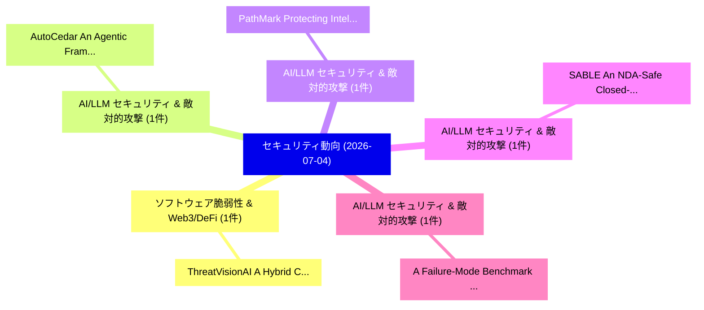

# 📅 02_daily: 日次エグゼクティブサマリー報告書 (2026-07-04)

**集計日時**: 2026-10-02 23:06:18 UTC  
**対象日付**: 2026-07-04  
**本日収集論文数**: 12 件  

---

## 💡 主要セキュリティ動向・脅威インサイト (Executive Insights)

本日の収集論文（計 12 件）において、以下の重点セキュリティ領域で活発な研究動向が確認されました：
- **ソフトウェア脆弱性 & Web3/DeFi** (1 件): 注目論文として 「ThreatVisionAI: A Hybrid CNN-V...」 等が発表され、実務防御および攻撃検証の進展が見られます。
- **AI/LLM セキュリティ & 敵対的攻撃** (1 件): 注目論文として 「AutoCedar: An Agentic Framewor...」 等が発表され、実務防御および攻撃検証の進展が見られます。
- **AI/LLM セキュリティ & 敵対的攻撃** (1 件): 注目論文として 「PathMark: Protecting Intellect...」 等が発表され、実務防御および攻撃検証の進展が見られます。
- **AI/LLM セキュリティ & 敵対的攻撃** (1 件): 注目論文として 「SABLE: An NDA-Safe Closed-Loop...」 等が発表され、実務防御および攻撃検証の進展が見られます。
- **AI/LLM セキュリティ & 敵対的攻撃** (1 件): 注目論文として 「A Failure-Mode Benchmark for P...」 等が発表され、実務防御および攻撃検証の進展が見られます。

### 🗺️ 技術・脅威トピックマインドマップ

---

## 📌 日次セキュリティ論文一覧 (日本語表形式)

| No | arXiv ID | 論文タイトル (日本語訳) | 重要キーワード | 構造化エグゼクティブ要約 (背景・提案・影響) | 脅威分類 | 詳細リンク |
|---|---|---|---|---|---|---|
| 1 | `2607.03653v1` | [ThreatVisionAI: A Hybrid CNN-ViT Framework for Image-Based Malware Classification（セキュリティ分析論文）](../../okf/papers/2026-07-04/2607.03653.md) | `Based Malware Classification`, `Image-Based Malware`, `Allyson Taylor` | 【提案】概要 (Overview & Key Finding) 本論文「ThreatVisionAI: A Hybrid CNN-ViT Framework for Image-Ba...。実証評価により経営層・セキュリティ管理者向け推奨アクション (E... | `arXiv` | [arXiv](https://arxiv.org/abs/2607.03653v1) &#124; [OKF](../../okf/papers/2026-07-04/2607.03653.md) |
| 2 | `2607.03656v1` | [AutoCedar: An Agentic Framework for Verifier-Guided Access Control Policy Synthesis（セキュリティ分析論文）](../../okf/papers/2026-07-04/2607.03656.md) | `Guided Access Control Policy Synthesis`, `Verifier-Guided Access`, `Guided Access Contro` | 【提案】概要 (Overview & Key Finding) 本論文「AutoCedar: An Agentic Framework for Verifier-Guided アクセ...。実証評価により経営層・セキュリティ管理者向け推奨アクション (E... | `arXiv` | [arXiv](https://arxiv.org/abs/2607.03656v1) &#124; [OKF](../../okf/papers/2026-07-04/2607.03656.md) |
| 3 | `2607.03688v1` | [PathMark: Protecting Intellectual Property of Mixture-of-Expert LLMs via Path Watermarks（セキュリティ分析論文）](../../okf/papers/2026-07-04/2607.03688.md) | `Protecting Intellectual Property`, `Path Watermarks`, `Yudong Gao` | 【提案】概要 (Overview & Key Finding) 本論文「PathMark: Protecting Intellectual Property of Mixture-o...。実証評価により経営層・セキュリティ管理者向け推奨アクション (E... | `arXiv` | [arXiv](https://arxiv.org/abs/2607.03688v1) &#124; [OKF](../../okf/papers/2026-07-04/2607.03688.md) |
| 4 | `2607.03701v1` | [SABLE: An NDA-Safe Closed-Loop LLM Framework for Analog Circuit Optimization in Industrial EDA Flows（セキュリティ分析論文）](../../okf/papers/2026-07-04/2607.03701.md) | `Analog Circuit Optimization`, `Safe Closed`, `NDA-Safe Closed` | 【提案】概要 (Overview & Key Finding) 本論文「SABLE: An NDA-Safe Closed-Loop LLM Framework for Analog...。実証評価により経営層・セキュリティ管理者向け推奨アクション (E... | `arXiv` | [arXiv](https://arxiv.org/abs/2607.03701v1) &#124; [OKF](../../okf/papers/2026-07-04/2607.03701.md) |
| 5 | `2607.03739v1` | [A Failure-Mode Benchmark for Polymorphic Sybil Poisoning in RAG（セキュリティ分析論文）](../../okf/papers/2026-07-04/2607.03739.md) | `Polymorphic Sybil Poisoning`, `Mode Benchmark`, `Failure-Mode Benchmark` | 【提案】概要 (Overview & Key Finding) 本論文「A Failure-Mode Benchmark for Polymorphic Sybil Poisonin...。実証評価により経営層・セキュリティ管理者向け推奨アクション (E... | `arXiv` | [arXiv](https://arxiv.org/abs/2607.03739v1) &#124; [OKF](../../okf/papers/2026-07-04/2607.03739.md) |
| 6 | `2607.03758v1` | [Occluding the Solution Space: Planner-Agnostic Tolerance-Aware Manipulationに対する敵対的攻撃](../../okf/papers/2026-07-04/2607.03758.md) | `Solution Space`, `Agnostic Tolerance`, `Planner-Agnostic Tolerance` | 【提案】概要 (Overview & Key Finding) 本論文「Occluding the Solution Space: Planner-Agnostic Toleranc...。実証評価により経営層・セキュリティ管理者向け推奨アクション (E... | `arXiv` | [arXiv](https://arxiv.org/abs/2607.03758v1) &#124; [OKF](../../okf/papers/2026-07-04/2607.03758.md) |
| 7 | `2607.03821v1` | [DualView: Preventing Indirect Prompt Injection in Personal AI Agents（セキュリティ分析論文）](../../okf/papers/2026-07-04/2607.03821.md) | `Preventing Indirect Prompt Injection`, `Juhee Kim`, `Woohyuk Choi` | 【提案】概要 (Overview & Key Finding) 本論文「DualView: Preventing Indirect プロンプトインジェクション in Personal...。実証評価により経営層・セキュリティ管理者向け推奨アクション (E... | `arXiv` | [arXiv](https://arxiv.org/abs/2607.03821v1) &#124; [OKF](../../okf/papers/2026-07-04/2607.03821.md) |
| 8 | `2607.03887v1` | [Advanced Topic Modeling Techniques for Categorizing Software Vulnerabilities（セキュリティ分析論文）](../../okf/papers/2026-07-04/2607.03887.md) | `Advanced Topic Modeling Techniques`, `Categorizing Software Vulnerabilities`, `Utkarsh Tiwari` | 【提案】概要 (Overview & Key Finding) 本論文「Advanced Topic Modeling Techniques for Categorizing Sof...。実証評価により経営層・セキュリティ管理者向け推奨アクション (E... | `arXiv` | [arXiv](https://arxiv.org/abs/2607.03887v1) &#124; [OKF](../../okf/papers/2026-07-04/2607.03887.md) |
| 9 | `2607.03988v1` | [Energy-Aware System-Level Evaluation of Post-Quantum TLS on Embedded User Equipment over a Disaggregated 5G Network（セキュリティ分析論文）](../../okf/papers/2026-07-04/2607.03988.md) | `Embedded User Equipment`, `Aware System`, `Energy-Aware System` | 【提案】概要 (Overview & Key Finding) 本論文「Energy-Aware System-Level Evaluation of Post-量子 TLS on ...。実証評価により経営層・セキュリティ管理者向け推奨アクション (E... | `arXiv` | [arXiv](https://arxiv.org/abs/2607.03988v1) &#124; [OKF](../../okf/papers/2026-07-04/2607.03988.md) |
| 10 | `2607.04032v1` | [Data Structures for Private Token Transfers in TEE-Based Networks（セキュリティ分析論文）](../../okf/papers/2026-07-04/2607.04032.md) | `Private Token Transfers`, `Data Structures`, `Based Networks` | 【提案】概要 (Overview & Key Finding) 本論文「Data Structures for Private Token Transfers in TEE-Base...。実証評価により経営層・セキュリティ管理者向け推奨アクション (E... | `arXiv` | [arXiv](https://arxiv.org/abs/2607.04032v1) &#124; [OKF](../../okf/papers/2026-07-04/2607.04032.md) |
| 11 | `2607.04042v1` | [An Exploratory Study of Malicious Link Posting on Social Media Applications（セキュリティ分析論文）](../../okf/papers/2026-07-04/2607.04042.md) | `Malicious Link Posting`, `Social Media Applications`, `Muhammad Hassan` | 【提案】概要 (Overview & Key Finding) 本論文「An Exploratory Study of Malicious Link Posting on Socia...。実証評価により経営層・セキュリティ管理者向け推奨アクション (E... | `arXiv` | [arXiv](https://arxiv.org/abs/2607.04042v1) &#124; [OKF](../../okf/papers/2026-07-04/2607.04042.md) |
| 12 | `2607.04055v1` | [Deep Learning Hardware: A Survey of Side-Channel Vulnerabilities and Countermeasuresのセキュリティ強化](../../okf/papers/2026-07-04/2607.04055.md) | `Channel Vulnerabilities`, `Side-Channel Vulnerabilities`, `Securing Deep Learning Hardware` | 【提案】概要 (Overview & Key Finding) 本論文「Deep Learning Hardware: A Survey of サイドチャネル攻撃 Vulnerabi...。実証評価により経営層・セキュリティ管理者向け推奨アクション (E... | `arXiv` | [arXiv](https://arxiv.org/abs/2607.04055v1) &#124; [OKF](../../okf/papers/2026-07-04/2607.04055.md) |

