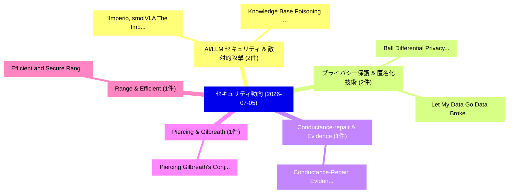

# 📅 02_daily: 日次エグゼクティブサマリー報告書 (2026-07-05)

**集計日時**: 2026-10-02 23:06:18 UTC  
**対象日付**: 2026-07-05  
**本日収集論文数**: 11 件  

---

## 💡 主要セキュリティ動向・脅威インサイト (Executive Insights)

本日の収集論文（計 11 件）において、以下の重点セキュリティ領域で活発な研究動向が確認されました：
- **AI/LLM セキュリティ & 敵対的攻撃** (2 件): 注目論文として 「!Imperio, smolVLA: The Implica...」、「Knowledge Base Poisoning Attac...」 等が発表され、実務防御および攻撃検証の進展が見られます。
- **プライバシー保護 & 匿名化技術** (2 件): 注目論文として 「Ball Differential Privacy: How...」、「Let My Data Go: Data Brokers' ...」 等が発表され、実務防御および攻撃検証の進展が見られます。
- **Conductance-repair & Evidence** (1 件): 注目論文として 「Conductance-Repair Evidence Gr...」 等が発表され、実務防御および攻撃検証の進展が見られます。
- **Piercing & Gilbreath** (1 件): 注目論文として 「Piercing Gilbreath's Conjectur...」 等が発表され、実務防御および攻撃検証の進展が見られます。
- **Range & Efficient** (1 件): 注目論文として 「Efficient and Secure Range Cou...」 等が発表され、実務防御および攻撃検証の進展が見られます。

### 🗺️ 技術・脅威トピックマインドマップ

---

## 📌 日次セキュリティ論文一覧 (日本語表形式)

| No | arXiv ID | 論文タイトル (日本語訳) | 重要キーワード | 構造化エグゼクティブ要約 (背景・提案・影響) | 脅威分類 | 詳細リンク |
|---|---|---|---|---|---|---|
| 1 | `2607.04070v1` | [Conductance-Repair Evidence Graphs for Prospective Security Retrieval（セキュリティ分析論文）](../../okf/papers/2026-07-05/2607.04070.md) | `Repair Evidence Graphs`, `Prospective Security Retrieval`, `Conductance-Repair Evidence` | 【提案】概要 (Overview & Key Finding) 本論文「Conductance-Repair Evidence Graphs for Prospective Secu...。実証評価により経営層・セキュリティ管理者向け推奨アクション (E... | `arXiv` | [arXiv](https://arxiv.org/abs/2607.04070v1) &#124; [OKF](../../okf/papers/2026-07-05/2607.04070.md) |
| 2 | `2607.04146v1` | [!Imperio, smolVLA: The Implications of Data Poisoning on Open Source Robotics（セキュリティ分析論文）](../../okf/papers/2026-07-05/2607.04146.md) | `Open Source Robotics`, `Data Poisoning`, `Mark Schutera` | 【提案】概要 (Overview & Key Finding) 本論文「!Imperio, smolVLA: The Implications of Data Poisoning o...。実証評価により経営層・セキュリティ管理者向け推奨アクション (E... | `arXiv` | [arXiv](https://arxiv.org/abs/2607.04146v1) &#124; [OKF](../../okf/papers/2026-07-05/2607.04146.md) |
| 3 | `2607.04166v3` | [Piercing Gilbreath's Conjecture: From Deep Number Theory Insights to Fintech and サイバーセキュリティ](../../okf/papers/2026-07-05/2607.04166.md) | `Piercing Gilbreath`, `Vincent Granville`, `Raw Meta` | 【提案】概要 (Overview & Key Finding) 本論文「Piercing Gilbreath's Conjecture: From Deep Number Theor...。実証評価により経営層・セキュリティ管理者向け推奨アクション (E... | `arXiv` | [arXiv](https://arxiv.org/abs/2607.04166v3) &#124; [OKF](../../okf/papers/2026-07-05/2607.04166.md) |
| 4 | `2607.04194v1` | [Efficient and Secure Range Counting over Distributed Geographic Data with Query Range Protection（セキュリティ分析論文）](../../okf/papers/2026-07-05/2607.04194.md) | `Secure Range Counting`, `Distributed Geographic Data`, `Query Range Protection` | 【提案】概要 (Overview & Key Finding) 本論文「Efficient and Secure Range Counting over Distributed Ge...。実証評価により経営層・セキュリティ管理者向け推奨アクション (E... | `arXiv` | [arXiv](https://arxiv.org/abs/2607.04194v1) &#124; [OKF](../../okf/papers/2026-07-05/2607.04194.md) |
| 5 | `2607.04209v2` | [Ball Differential Privacy: How to Mitigate Data Reconstruction with Less Noise（セキュリティ分析論文）](../../okf/papers/2026-07-05/2607.04209.md) | `Ball Differential Privacy`, `Mitigate Data Reconstruction`, `Less Noise` | 【提案】概要 (Overview & Key Finding) 本論文「Ball 差分プライバシー: How to Mitigate Data Reconstruction with...。実証評価により経営層・セキュリティ管理者向け推奨アクション (E... | `arXiv` | [arXiv](https://arxiv.org/abs/2607.04209v2) &#124; [OKF](../../okf/papers/2026-07-05/2607.04209.md) |
| 6 | `2607.04292v1` | [Agentic SABRE: An Uncertainty-Aware Neuro-Symbolic Multi-Agent Framework for Adaptive Ransomware Detection（セキュリティ分析論文）](../../okf/papers/2026-07-05/2607.04292.md) | `Adaptive Ransomware Detection`, `Aware Neuro`, `Symbolic Multi` | 【提案】概要 (Overview & Key Finding) 本論文「Agentic SABRE: An Uncertainty-Aware Neuro-Symbolic Mult...。実証評価により経営層・セキュリティ管理者向け推奨アクション (E... | `arXiv` | [arXiv](https://arxiv.org/abs/2607.04292v1) &#124; [OKF](../../okf/papers/2026-07-05/2607.04292.md) |
| 7 | `2607.04339v1` | [One Framework for All: Cross-Modal Membership Inference for Generative Models（セキュリティ分析論文）](../../okf/papers/2026-07-05/2607.04339.md) | `Modal Membership Inference`, `Generative Models`, `Cross-Modal Membership` | 【提案】概要 (Overview & Key Finding) 本論文「One Framework for All: Cross-Modal Membership Inference...。実証評価により経営層・セキュリティ管理者向け推奨アクション (E... | `arXiv` | [arXiv](https://arxiv.org/abs/2607.04339v1) &#124; [OKF](../../okf/papers/2026-07-05/2607.04339.md) |
| 8 | `2607.04379v1` | [Knowledge Base Poisoning Attacks and Defense for Policy-Aware LLM-RAG Framework（セキュリティ分析論文）](../../okf/papers/2026-07-05/2607.04379.md) | `Knowledge Base Poisoning Attacks`, `Policy-Aware LLM`, `Om Solanki` | 【提案】概要 (Overview & Key Finding) 本論文「Knowledge Base Poisoning Attacks and Defense for Policy...。実証評価により経営層・セキュリティ管理者向け推奨アクション (E... | `arXiv` | [arXiv](https://arxiv.org/abs/2607.04379v1) &#124; [OKF](../../okf/papers/2026-07-05/2607.04379.md) |
| 9 | `2607.04474v1` | [AMRM-Pure: Semantic-Preserving Adversarial Purification（セキュリティ分析論文）](../../okf/papers/2026-07-05/2607.04474.md) | `Preserving Adversarial Purification`, `Semantic-Preserving Adversarial`, `Zhihao Dou` | 【提案】概要 (Overview & Key Finding) 本論文「AMRM-Pure: Semantic-Preserving Adversarial Purification...。実証評価により経営層・セキュリティ管理者向け推奨アクション (E... | `arXiv` | [arXiv](https://arxiv.org/abs/2607.04474v1) &#124; [OKF](../../okf/papers/2026-07-05/2607.04474.md) |
| 10 | `2607.04511v1` | [Mean Time to Remediate Is Not a Fielding Model: A Cadence Audit for Enterprise Vulnerability Management（セキュリティ分析論文）](../../okf/papers/2026-07-05/2607.04511.md) | `Enterprise Vulnerability Management`, `Mean Time`, `Fielding Model` | 【提案】背景とセキュリティ上の課題 (Background & Problem) 本研究はサイバー脅威環境におけるセキュリティ構造・脆弱性の検証を目的としています。(主要検出項目: ...。実証評価により経営層・セキュリティ管理者向け推奨アクション (E... | `arXiv` | [arXiv](https://arxiv.org/abs/2607.04511v1) &#124; [OKF](../../okf/papers/2026-07-05/2607.04511.md) |
| 11 | `2607.04552v1` | [Let My Data Go: Data Brokers' Compliance with Opt-Out and Deletion Requests（セキュリティ分析論文）](../../okf/papers/2026-07-05/2607.04552.md) | `Data Brokers`, `Deletion Requests`, `Gene Tsudik` | 【提案】概要 (Overview & Key Finding) 本論文「Let My Data Go: Data Brokers' Compliance with Opt-Out a...。実証評価により経営層・セキュリティ管理者向け推奨アクション (E... | `arXiv` | [arXiv](https://arxiv.org/abs/2607.04552v1) &#124; [OKF](../../okf/papers/2026-07-05/2607.04552.md) |

