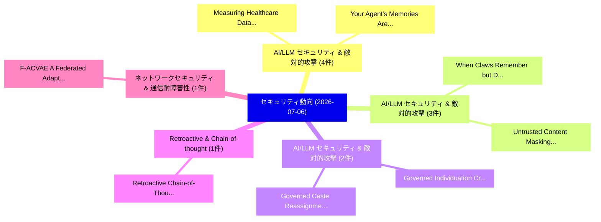

# 📅 02_daily: 日次エグゼクティブサマリー報告書 (2026-07-06)

**集計日時**: 2026-10-02 23:06:18 UTC  
**対象日付**: 2026-07-06  
**本日収集論文数**: 38 件  

---

## 💡 主要セキュリティ動向・脅威インサイト (Executive Insights)

本日の収集論文（計 38 件）において、以下の重点セキュリティ領域で活発な研究動向が確認されました：
- **AI/LLM セキュリティ & 敵対的攻撃** (4 件): 注目論文として 「Measuring Healthcare Data Leak...」、「Your Agent's Memories Are Not ...」 等が発表され、実務防御および攻撃検証の進展が見られます。
- **AI/LLM セキュリティ & 敵対的攻撃** (3 件): 注目論文として 「When Claws Remember but Do Not...」、「Untrusted Content Masking for ...」 等が発表され、実務防御および攻撃検証の進展が見られます。
- **AI/LLM セキュリティ & 敵対的攻撃** (2 件): 注目論文として 「Governed Individuation: Crypto...」、「Governed Caste Reassignment in...」 等が発表され、実務防御および攻撃検証の進展が見られます。
- **Retroactive & Chain-of-thought** (1 件): 注目論文として 「Retroactive Chain-of-Thought (...」 等が発表され、実務防御および攻撃検証の進展が見られます。
- **ネットワークセキュリティ & 通信耐障害性** (1 件): 注目論文として 「F-ACVAE: A Federated Adaptive ...」 等が発表され、実務防御および攻撃検証の進展が見られます。

### 🗺️ 技術・脅威トピックマインドマップ

---

## 📌 日次セキュリティ論文一覧 (日本語表形式)

| No | arXiv ID | 論文タイトル (日本語訳) | 重要キーワード | 構造化エグゼクティブ要約 (背景・提案・影響) | 脅威分類 | 詳細リンク |
|---|---|---|---|---|---|---|
| 1 | `2607.04613v1` | [Governed Individuation: Cryptographically Decoupling an Agent's Learning from Its Authority（セキュリティ分析論文）](../../okf/papers/2026-07-06/2607.04613.md) | `Governed Individuation`, `Cryptographically Decoupling`, `Xue Qin` | 【提案】概要 (Overview & Key Finding) 本論文「Governed Individuation: Cryptographically Decoupling an...。実証評価により経営層・セキュリティ管理者向け推奨アクション (E... | `arXiv` | [arXiv](https://arxiv.org/abs/2607.04613v1) &#124; [OKF](../../okf/papers/2026-07-06/2607.04613.md) |
| 2 | `2607.04634v1` | [Governed Caste Reassignment in Heterogeneous Swarms: An Asymmetric-Trust Protocol with Audited Operator Countersignature（セキュリティ分析論文）](../../okf/papers/2026-07-06/2607.04634.md) | `Governed Caste Reassignment`, `Audited Operator Countersignature`, `Heterogeneous Swarms` | 【提案】概要 (Overview & Key Finding) 本論文「Governed Caste Reassignment in Heterogeneous Swarms: An...。実証評価により経営層・セキュリティ管理者向け推奨アクション (E... | `arXiv` | [arXiv](https://arxiv.org/abs/2607.04634v1) &#124; [OKF](../../okf/papers/2026-07-06/2607.04634.md) |
| 3 | `2607.04645v1` | [Retroactive Chain-of-Thought (RetroCoT): Forensic Reconstruction Prompts as a Safety Diagnostic Across Model Generations（セキュリティ分析論文）](../../okf/papers/2026-07-06/2607.04645.md) | `Safety Diagnostic Across Model Generations`, `Forensic Reconstruction Prompts`, `Retroactive Chain` | 【提案】概要 (Overview & Key Finding) 本論文「Retroactive Chain-of-Thought (RetroCoT): Forensic Recon...。実証評価により経営層・セキュリティ管理者向け推奨アクション (E... | `arXiv` | [arXiv](https://arxiv.org/abs/2607.04645v1) &#124; [OKF](../../okf/papers/2026-07-06/2607.04645.md) |
| 4 | `2607.04698v1` | [F-ACVAE: A Federated Adaptive Conditional Variational Auto-Encoder for Privacy-Preserving Intrusion Detection in IoT Networks（セキュリティ分析論文）](../../okf/papers/2026-07-06/2607.04698.md) | `Federated Adaptive Conditional Variational Auto`, `Preserving Intrusion Detection`, `Privacy-Preserving Intrusion` | 【提案】概要 (Overview & Key Finding) 本論文「F-ACVAE: A Federated Adaptive Conditional Variational A...。実証評価により経営層・セキュリティ管理者向け推奨アクション (E... | `arXiv` | [arXiv](https://arxiv.org/abs/2607.04698v1) &#124; [OKF](../../okf/papers/2026-07-06/2607.04698.md) |
| 5 | `2607.04729v1` | [RustMizan: A Compilable, Contamination-Aware Framework for Rust Vulnerabilitiesのベンチマーク評価](../../okf/papers/2026-07-06/2607.04729.md) | `Rust Vulnerabilities`, `Contamination-Aware Benchmarking`, `Mohammad Omidvar Tehrani` | 【提案】概要 (Overview & Key Finding) 本論文「RustMizan: A Compilable, Contamination-Aware Framework ...。実証評価により経営層・セキュリティ管理者向け推奨アクション (E... | `arXiv` | [arXiv](https://arxiv.org/abs/2607.04729v1) &#124; [OKF](../../okf/papers/2026-07-06/2607.04729.md) |
| 6 | `2607.04772v1` | [HilEnT: Hilbert, Entropy Transformed Image Based マルウェア検出](../../okf/papers/2026-07-06/2607.04772.md) | `Entropy Transformed Image Based Malware Detection`, `Entropy Transformed Image Based`, `Kar Wai Fok` | 【提案】概要 (Overview & Key Finding) 本論文「HilEnT: Hilbert, Entropy Transformed Image Based マルウェア検...。実証評価によりThing - **公開日時**: `2026-0... | `arXiv` | [arXiv](https://arxiv.org/abs/2607.04772v1) &#124; [OKF](../../okf/papers/2026-07-06/2607.04772.md) |
| 7 | `2607.04777v1` | [Personalized Differentially Private Learning for Decentralized Local Graphsに向けて](../../okf/papers/2026-07-06/2607.04777.md) | `Towards Personalized Differentially Private Learning`, `Personalized Differentially Private Learning`, `Decentralized Local` | 【提案】概要 (Overview & Key Finding) 本論文「Personalized Differentially Private Learning for Decent...。実証評価により経営層・セキュリティ管理者向け推奨アクション (E... | `arXiv` | [arXiv](https://arxiv.org/abs/2607.04777v1) &#124; [OKF](../../okf/papers/2026-07-06/2607.04777.md) |
| 8 | `2607.04783v1` | [Ghost Traffic: ICMP Tunneling-Based Billing Bypass in LTE Networks（セキュリティ分析論文）](../../okf/papers/2026-07-06/2607.04783.md) | `Based Billing Bypass`, `Ghost Traffic`, `Tunneling-Based Billing` | 【提案】概要 (Overview & Key Finding) 本論文「Ghost Traffic: ICMP Tunneling-Based Billing Bypass in L...。実証評価により経営層・セキュリティ管理者向け推奨アクション (E... | `arXiv` | [arXiv](https://arxiv.org/abs/2607.04783v1) &#124; [OKF](../../okf/papers/2026-07-06/2607.04783.md) |
| 9 | `2607.04789v2` | [Orcaella: Hybrid Fault Tolerance with Client-Selectable Finality Latency（セキュリティ分析論文）](../../okf/papers/2026-07-06/2607.04789.md) | `Hybrid Fault Tolerance`, `Selectable Finality Latency`, `Client-Selectable Finality` | 【提案】概要 (Overview & Key Finding) 本論文「Orcaella: Hybrid Fault Tolerance with Client-Selectable...。実証評価により経営層・セキュリティ管理者向け推奨アクション (E... | `arXiv` | [arXiv](https://arxiv.org/abs/2607.04789v2) &#124; [OKF](../../okf/papers/2026-07-06/2607.04789.md) |
| 10 | `2607.04819v2` | [Layer-Parallel Inference Reduces Encrypted Nonlinear Depth in Transformers（セキュリティ分析論文）](../../okf/papers/2026-07-06/2607.04819.md) | `Parallel Inference Reduces Encrypted Nonlinear Depth`, `Layer-Parallel Inference`, `Ligong Han` | 【提案】概要 (Overview & Key Finding) 本論文「Layer-Parallel Inference Reduces Encrypted Nonlinear De...。実証評価により経営層・セキュリティ管理者向け推奨アクション (E... | `arXiv` | [arXiv](https://arxiv.org/abs/2607.04819v2) &#124; [OKF](../../okf/papers/2026-07-06/2607.04819.md) |
| 11 | `2607.04936v1` | [Noise-limited secret key agreement with twin optical physically unclonable functions（セキュリティ分析論文）](../../okf/papers/2026-07-06/2607.04936.md) | `Noise-limited secret`, `Raw Meta`, `Executive Summary` | 【提案】概要 (Overview & Key Finding) 本論文「Noise-limited secret key agreement with twin optical ph...。実証評価により経営層・セキュリティ管理者向け推奨アクション (E... | `arXiv` | [arXiv](https://arxiv.org/abs/2607.04936v1) &#124; [OKF](../../okf/papers/2026-07-06/2607.04936.md) |
| 12 | `2607.04958v1` | [Look-Ahead-Freedom as Temporal Non-Interference: A Verifiable Correctness Property for Backtesting and Agentic Trading Pipelines（セキュリティ分析論文）](../../okf/papers/2026-07-06/2607.04958.md) | `Verifiable Correctness Property`, `Agentic Trading Pipelines`, `Temporal Non` | 【提案】概要 (Overview & Key Finding) 本論文「Look-Ahead-Freedom as Temporal Non-Interference: A Veri...。実証評価により経営層・セキュリティ管理者向け推奨アクション (E... | `arXiv` | [arXiv](https://arxiv.org/abs/2607.04958v1) &#124; [OKF](../../okf/papers/2026-07-06/2607.04958.md) |
| 13 | `2607.04965v2` | [Measuring Healthcare Data Leaks and Security Flaws at Internet Scale（セキュリティ分析論文）](../../okf/papers/2026-07-06/2607.04965.md) | `Measuring Healthcare Data Leaks`, `Security Flaws`, `Internet Scale` | 【提案】概要 (Overview & Key Finding) 本論文「Measuring Healthcare Data Leaks and Security Flaws at I...。実証評価により経営層・セキュリティ管理者向け推奨アクション (E... | `arXiv` | [arXiv](https://arxiv.org/abs/2607.04965v2) &#124; [OKF](../../okf/papers/2026-07-06/2607.04965.md) |
| 14 | `2607.05001v2` | [TACTIC-KG: Toward Small Agent Teams for Cyber Threat Intelligence Knowledge Graph Construction（セキュリティ分析論文）](../../okf/papers/2026-07-06/2607.05001.md) | `Cyber Threat Intelligence Knowledge Graph Construction`, `Toward Small Agent Teams`, `Mouhamed Amine Bouchiha` | 【提案】概要 (Overview & Key Finding) 本論文「TACTIC-KG: Toward Small Agent Teams for Cyber 脅威 Intell...。実証評価により経営層・セキュリティ管理者向け推奨アクション (E... | `arXiv` | [arXiv](https://arxiv.org/abs/2607.05001v2) &#124; [OKF](../../okf/papers/2026-07-06/2607.05001.md) |
| 15 | `2607.05016v1` | [Algorithmically Presented Numbers and Canonical Representations in Cryptographic Protocols（セキュリティ分析論文）](../../okf/papers/2026-07-06/2607.05016.md) | `Canonical Representations`, `Cryptographic Protocols`, `Raw Meta` | 【提案】概要 (Overview & Key Finding) 本論文「Algorithmically Presented Numbers and Canonical Represe...。実証評価により経営層・セキュリティ管理者向け推奨アクション (E... | `arXiv` | [arXiv](https://arxiv.org/abs/2607.05016v1) &#124; [OKF](../../okf/papers/2026-07-06/2607.05016.md) |
| 16 | `2607.05029v1` | [Your Agent's Memories Are Not Its Own: Forged Reasoning Attacks on LLM Agent Memory and Defenses（セキュリティ分析論文）](../../okf/papers/2026-07-06/2607.05029.md) | `Forged Reasoning Attacks`, `Agent Memory`, `Neeraj Karamchandani` | 【提案】背景とセキュリティ上の課題 (Background & Problem) 本研究はサイバー脅威環境におけるセキュリティ構造・脆弱性の検証を目的としています。(主要検出項目: ...。実証評価により経営層・セキュリティ管理者向け推奨アクション (E... | `arXiv` | [arXiv](https://arxiv.org/abs/2607.05029v1) &#124; [OKF](../../okf/papers/2026-07-06/2607.05029.md) |
| 17 | `2607.05042v1` | [Security RIS-Assisted Physical-Layer Authentication Over Multipath Channelsの分析](../../okf/papers/2026-07-06/2607.05042.md) | `Assisted Physical`, `RIS-Assisted Physical`, `Linda Senigagliesi` | 【提案】概要 (Overview & Key Finding) 本論文「Security RIS-Assisted Physical-Layer Authentication Ove...。実証評価により経営層・セキュリティ管理者向け推奨アクション (E... | `arXiv` | [arXiv](https://arxiv.org/abs/2607.05042v1) &#124; [OKF](../../okf/papers/2026-07-06/2607.05042.md) |
| 18 | `2607.05111v1` | [From Multiplicity to Vulnerability: Privacy Amplification Risk from One-Dataset-Multiple-Model Exposure（セキュリティ分析論文）](../../okf/papers/2026-07-06/2607.05111.md) | `Privacy Amplification Risk`, `Model Exposure`, `Multiple-Model Exposure` | 【提案】概要 (Overview & Key Finding) 本論文「From Multiplicity to 脆弱性: Privacy Amplification Risk fr...。実証評価により経営層・セキュリティ管理者向け推奨アクション (E... | `arXiv` | [arXiv](https://arxiv.org/abs/2607.05111v1) &#124; [OKF](../../okf/papers/2026-07-06/2607.05111.md) |
| 19 | `2607.05120v1` | [Agent Data Injection Attacks are Realistic Threats to AI Agents（セキュリティ分析論文）](../../okf/papers/2026-07-06/2607.05120.md) | `Agent Data Injection Attacks`, `Realistic Threats`, `Woohyuk Choi` | 【提案】概要 (Overview & Key Finding) 本論文「Agent Data Injection Attacks are Realistic Threats to A...。実証評価により経営層・セキュリティ管理者向け推奨アクション (E... | `arXiv` | [arXiv](https://arxiv.org/abs/2607.05120v1) &#124; [OKF](../../okf/papers/2026-07-06/2607.05120.md) |
| 20 | `2607.05160v1` | [Algebraic Modelings of the Supersingular Isogeny Problem（セキュリティ分析論文）](../../okf/papers/2026-07-06/2607.05160.md) | `Supersingular Isogeny Problem`, `Algebraic Modelings`, `Alessio Caminata` | 【提案】概要 (Overview & Key Finding) 本論文「Algebraic Modelings of the Supersingular Isogeny Proble...。実証評価により経営層・セキュリティ管理者向け推奨アクション (E... | `arXiv` | [arXiv](https://arxiv.org/abs/2607.05160v1) &#124; [OKF](../../okf/papers/2026-07-06/2607.05160.md) |
| 21 | `2607.05189v1` | [When Claws Remember but Do Not Tell: Stealthy Memory Injection in Persistent Personal Agents（セキュリティ分析論文）](../../okf/papers/2026-07-06/2607.05189.md) | `Stealthy Memory Injection`, `Persistent Personal Agents`, `Yechao Zhang` | 【提案】背景とセキュリティ上の課題 (Background & Problem) 本研究はサイバー脅威環境におけるセキュリティ構造・脆弱性の検証を目的としています。(主要検出項目: ...。実証評価により経営層・セキュリティ管理者向け推奨アクション (E... | `arXiv` | [arXiv](https://arxiv.org/abs/2607.05189v1) &#124; [OKF](../../okf/papers/2026-07-06/2607.05189.md) |
| 22 | `2607.05251v1` | [Privacy-Preserving Robustness Verification for Neural Networks（セキュリティ分析論文）](../../okf/papers/2026-07-06/2607.05251.md) | `Preserving Robustness Verification`, `Neural Networks`, `Privacy-Preserving Robustness` | 【提案】概要 (Overview & Key Finding) 本論文「Privacy-Preserving Robustness Verification for Neural N...。実証評価により経営層・セキュリティ管理者向け推奨アクション (E... | `arXiv` | [arXiv](https://arxiv.org/abs/2607.05251v1) &#124; [OKF](../../okf/papers/2026-07-06/2607.05251.md) |
| 23 | `2607.05277v1` | [Untrusted Content Masking for Web Agents with Security Guarantees（セキュリティ分析論文）](../../okf/papers/2026-07-06/2607.05277.md) | `Untrusted Content Masking`, `Web Agents`, `Security Guarantees` | 【提案】概要 (Overview & Key Finding) 本論文「Untrusted Content Masking for Web Agents with Security ...。実証評価により経営層・セキュリティ管理者向け推奨アクション (E... | `arXiv` | [arXiv](https://arxiv.org/abs/2607.05277v1) &#124; [OKF](../../okf/papers/2026-07-06/2607.05277.md) |
| 24 | `2607.05300v1` | [Learning Only What Valid Adapters Can Express: Subspace-Constrained Adaptation Against Fine-Tuning Poisoning（セキュリティ分析論文）](../../okf/papers/2026-07-06/2607.05300.md) | `Tuning Poisoning`, `Subspace-Constrained Adaptation`, `Fine-Tuning Poisoning` | 【提案】概要 (Overview & Key Finding) 本論文「Learning Only What Valid Adapters Can Express: Subspace...。実証評価により経営層・セキュリティ管理者向け推奨アクション (E... | `arXiv` | [arXiv](https://arxiv.org/abs/2607.05300v1) &#124; [OKF](../../okf/papers/2026-07-06/2607.05300.md) |
| 25 | `2607.05318v1` | [PiSAs: Contextual Integrity in Multi-User Agentic Systemsのベンチマーク評価](../../okf/papers/2026-07-06/2607.05318.md) | `Multi-User Agentic`, `Benchmarking Contextual Integrity`, `User Agentic Systems` | 【提案】概要 (Overview & Key Finding) 本論文「PiSAs: Contextual Integrity in Multi-User Agentic Syste...。実証評価により経営層・セキュリティ管理者向け推奨アクション (E... | `arXiv` | [arXiv](https://arxiv.org/abs/2607.05318v1) &#124; [OKF](../../okf/papers/2026-07-06/2607.05318.md) |
| 26 | `2607.05353v1` | [Selective Disclosure Watermarking for 大規模言語モデル](../../okf/papers/2026-07-06/2607.05353.md) | `Selective Disclosure Watermarking`, `Large Language Models`, `Xuyang Chen` | 【提案】概要 (Overview & Key Finding) 本論文「Selective Disclosure Watermarking for 大規模言語モデル」（原題: Sel...。実証評価により経営層・セキュリティ管理者向け推奨アクション (E... | `arXiv` | [arXiv](https://arxiv.org/abs/2607.05353v1) &#124; [OKF](../../okf/papers/2026-07-06/2607.05353.md) |
| 27 | `2607.05462v2` | [BioSecBench-Refusal: A paired metric for performance and alignment in agentic biosecurity risk assessment（セキュリティ分析論文）](../../okf/papers/2026-07-06/2607.05462.md) | `Harmon Bhasin`, `Dianzhuo Wang`, `Evan Seeyave` | 【提案】概要 (Overview & Key Finding) 本論文「BioSecBench-Refusal: A paired metric for performance an...。実証評価により経営層・セキュリティ管理者向け推奨アクション (E... | `arXiv` | [arXiv](https://arxiv.org/abs/2607.05462v2) &#124; [OKF](../../okf/papers/2026-07-06/2607.05462.md) |
| 28 | `2607.05474v1` | [ShadowProbe: Language-Extensible Hidden Algorithmic Complexity Vulnerabilitiesの検出](../../okf/papers/2026-07-06/2607.05474.md) | `Extensible Hidden Algorithmic Complexity`, `Hidden Algorithmic Complexity Vulnerabilities`, `Language-Extensible Hidden` | 【提案】概要 (Overview & Key Finding) 本論文「ShadowProbe: Language-Extensible Hidden Algorithmic Com...。実証評価により経営層・セキュリティ管理者向け推奨アクション (E... | `arXiv` | [arXiv](https://arxiv.org/abs/2607.05474v1) &#124; [OKF](../../okf/papers/2026-07-06/2607.05474.md) |
| 29 | `2607.05479v1` | [Privilege and confidentiality in generative AI workflows（セキュリティ分析論文）](../../okf/papers/2026-07-06/2607.05479.md) | `Thomas Melham`, `Raw Meta`, `Executive Summary` | 【提案】概要 (Overview & Key Finding) 本論文「Privilege and confidentiality in generative AI workflow...。実証評価により経営層・セキュリティ管理者向け推奨アクション (E... | `arXiv` | [arXiv](https://arxiv.org/abs/2607.05479v1) &#124; [OKF](../../okf/papers/2026-07-06/2607.05479.md) |
| 30 | `2607.05481v1` | [Full-range Binary Classifier Calibration for Stable Model Updates in Production（セキュリティ分析論文）](../../okf/papers/2026-07-06/2607.05481.md) | `Binary Classifier Calibration`, `Stable Model Updates`, `Full-range Binary` | 【提案】概要 (Overview & Key Finding) 本論文「Full-range Binary Classifier Calibration for Stable Mod...。実証評価により経営層・セキュリティ管理者向け推奨アクション (E... | `arXiv` | [arXiv](https://arxiv.org/abs/2607.05481v1) &#124; [OKF](../../okf/papers/2026-07-06/2607.05481.md) |
| 31 | `2607.05516v2` | [Statistical Adversaries: Natural Backdoor-like Adversarial Features in Clean Vision Datasets（セキュリティ分析論文）](../../okf/papers/2026-07-06/2607.05516.md) | `Clean Vision Datasets`, `Statistical Adversaries`, `Natural Backdoor` | 【提案】概要 (Overview & Key Finding) 本論文「Statistical Adversaries: Natural Backdoor-like Adversar...。実証評価により経営層・セキュリティ管理者向け推奨アクション (E... | `AI/ML Security` | [arXiv](https://arxiv.org/abs/2607.05516v2) &#124; [OKF](../../okf/papers/2026-07-06/2607.05516.md) |
| 32 | `2607.05518v1` | [aiAuthZ: Off-Host, Identity-Bound Authorization for AI Agents（セキュリティ分析論文）](../../okf/papers/2026-07-06/2607.05518.md) | `Bound Authorization`, `Identity-Bound Authorization`, `Sai Varun Kodathala` | 【提案】概要 (Overview & Key Finding) 本論文「aiAuthZ: Off-Host, Identity-Bound Authorization for AI ...。実証評価により経営層・セキュリティ管理者向け推奨アクション (E... | `arXiv` | [arXiv](https://arxiv.org/abs/2607.05518v1) &#124; [OKF](../../okf/papers/2026-07-06/2607.05518.md) |
| 33 | `2607.05549v1` | [Replicating the Signature: Unsupervised Targeted Impersonation Attack on RF Fingerprinting（セキュリティ分析論文）](../../okf/papers/2026-07-06/2607.05549.md) | `Unsupervised Targeted Impersonation Attack`, `Unsupervised Targeted Impersonation Atta`, `Haytham Albousayri` | 【提案】概要 (Overview & Key Finding) 本論文「Replicating the Signature: Unsupervised Targeted Impers...。実証評価により経営層・セキュリティ管理者向け推奨アクション (E... | `arXiv` | [arXiv](https://arxiv.org/abs/2607.05549v1) &#124; [OKF](../../okf/papers/2026-07-06/2607.05549.md) |
| 34 | `2607.05569v1` | [Complets: Universal Compartmentalisation and Programming Model For Arm Permission Overlay Extension 2（セキュリティ分析論文）](../../okf/papers/2026-07-06/2607.05569.md) | `Universal Compartmentalisation`, `Raw Meta`, `Executive Summary` | 【提案】概要 (Overview & Key Finding) 本論文「Complets: Universal Compartmentalisation and Programmin...。実証評価により経営層・セキュリティ管理者向け推奨アクション (E... | `arXiv` | [arXiv](https://arxiv.org/abs/2607.05569v1) &#124; [OKF](../../okf/papers/2026-07-06/2607.05569.md) |
| 35 | `2607.05670v1` | [The Cathedral and the Bazaar of Software Vulnerabilities: From the NVD to the CNAs（セキュリティ分析論文）](../../okf/papers/2026-07-06/2607.05670.md) | `Software Vulnerabilities`, `Siqi Zhang`, `Fabio Massacci` | 【提案】概要 (Overview & Key Finding) 本論文「The Cathedral and the Bazaar of Software Vulnerabilitie...。実証評価により経営層・セキュリティ管理者向け推奨アクション (E... | `arXiv` | [arXiv](https://arxiv.org/abs/2607.05670v1) &#124; [OKF](../../okf/papers/2026-07-06/2607.05670.md) |
| 36 | `2607.06593v1` | [Blockchain Attacks and Defenses: A Layered and Cross-Domain Survey（セキュリティ分析論文）](../../okf/papers/2026-07-06/2607.06593.md) | `Blockchain Attacks`, `Domain Survey`, `Cross-Domain Survey` | 【提案】概要 (Overview & Key Finding) 本論文「Blockchain Attacks and Defenses: A Layered and Cross-Do...。実証評価により経営層・セキュリティ管理者向け推奨アクション (E... | `arXiv` | [arXiv](https://arxiv.org/abs/2607.06593v1) &#124; [OKF](../../okf/papers/2026-07-06/2607.06593.md) |
| 37 | `2607.06595v1` | [When Agents Remember Too Much: Memory Poisoning Attacks on Large Language Model Agents（セキュリティ分析論文）](../../okf/papers/2026-07-06/2607.06595.md) | `Large Language Model Agents`, `Memory Poisoning Attacks`, `George Torres` | 【提案】概要 (Overview & Key Finding) 本論文「When Agents Remember Too Much: Memory Poisoning Attacks...。実証評価により経営層・セキュリティ管理者向け推奨アクション (E... | `arXiv` | [arXiv](https://arxiv.org/abs/2607.06595v1) &#124; [OKF](../../okf/papers/2026-07-06/2607.06595.md) |
| 38 | `2607.06596v2` | [Calibration-Family Overfit: Why Trusted Sabotage Monitors Don't Transfer Across Lineages（セキュリティ分析論文）](../../okf/papers/2026-07-06/2607.06596.md) | `Transfer Across Lineages`, `Family Overfit`, `Calibration-Family Overfit` | 【提案】概要 (Overview & Key Finding) 本論文「Calibration-Family Overfit: Why Trusted Sabotage Monito...。実証評価により経営層・セキュリティ管理者向け推奨アクション (E... | `arXiv` | [arXiv](https://arxiv.org/abs/2607.06596v2) &#124; [OKF](../../okf/papers/2026-07-06/2607.06596.md) |

