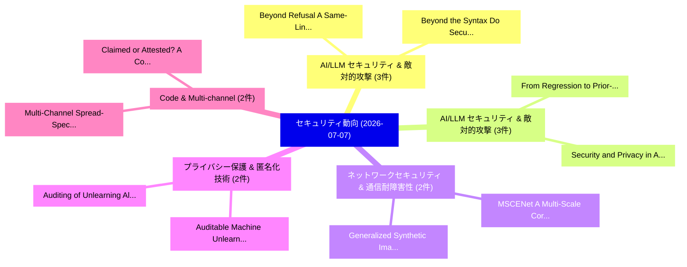

# 📅 02_daily: 日次エグゼクティブサマリー報告書 (2026-07-07)

**集計日時**: 2026-10-02 23:06:18 UTC  
**対象日付**: 2026-07-07  
**本日収集論文数**: 46 件  

---

## 💡 主要セキュリティ動向・脅威インサイト (Executive Insights)

本日の収集論文（計 46 件）において、以下の重点セキュリティ領域で活発な研究動向が確認されました：
- **AI/LLM セキュリティ & 敵対的攻撃** (3 件): 注目論文として 「Beyond Refusal: A Same-Lineage...」、「Beyond the Syntax: Do Security...」 等が発表され、実務防御および攻撃検証の進展が見られます。
- **AI/LLM セキュリティ & 敵対的攻撃** (3 件): 注目論文として 「From Regression to Prior-Aware...」、「Security and Privacy in Agenti...」 等が発表され、実務防御および攻撃検証の進展が見られます。
- **ネットワークセキュリティ & 通信耐障害性** (2 件): 注目論文として 「MSCENet: A Multi-Scale Correla...」、「Generalized Synthetic Image De...」 等が発表され、実務防御および攻撃検証の進展が見られます。
- **プライバシー保護 & 匿名化技術** (2 件): 注目論文として 「Auditing of Unlearning Algorit...」、「Auditable Machine Unlearning f...」 等が発表され、実務防御および攻撃検証の進展が見られます。
- **Code & Multi-channel** (2 件): 注目論文として 「Multi-Channel Spread-Spectrum ...」、「Claimed or Attested? A Commit-...」 等が発表され、実務防御および攻撃検証の進展が見られます。

### 🗺️ 技術・脅威トピックマインドマップ

---

## 📌 日次セキュリティ論文一覧 (日本語表形式)

| No | arXiv ID | 論文タイトル (日本語訳) | 重要キーワード | 構造化エグゼクティブ要約 (背景・提案・影響) | 脅威分類 | 詳細リンク |
|---|---|---|---|---|---|---|
| 1 | `2607.05743v1` | [The Balkanization of Execution-Security Research for AI Coding Agents: Isolation, Access Control, and Time-of-Check-to-Time-of-Use Vulnerabilities（セキュリティ分析論文）](../../okf/papers/2026-07-07/2607.05743.md) | `Security Research`, `Coding Agents`, `Access Control` | 【提案】概要 (Overview & Key Finding) 本論文「The Balkanization of Execution-Security Research for AI...。実証評価により経営層・セキュリティ管理者向け推奨アクション (E... | `arXiv` | [arXiv](https://arxiv.org/abs/2607.05743v1) &#124; [OKF](../../okf/papers/2026-07-07/2607.05743.md) |
| 2 | `2607.05744v1` | [Unicode TAG-Block Concealment of Tool-Metadata Payloads in the Model Context Protocol: An Approval-View Fidelity Gap Across Three Independent Server Implementations（セキュリティ分析論文）](../../okf/papers/2026-07-07/2607.05744.md) | `View Fidelity Gap Across Three Independent Server Implementations`, `Model Context Protocol`, `Block Concealment` | 【提案】概要 (Overview & Key Finding) 本論文「Unicode TAG-Block Concealment of Tool-Metadata Payloads...。実証評価により経営層・セキュリティ管理者向け推奨アクション (E... | `arXiv` | [arXiv](https://arxiv.org/abs/2607.05744v1) &#124; [OKF](../../okf/papers/2026-07-07/2607.05744.md) |
| 3 | `2607.05831v1` | [Withdrawability in Fiat-Shamir with aborts constructions（セキュリティ分析論文）](../../okf/papers/2026-07-07/2607.05831.md) | `Ramses Fernandez`, `Raw Meta`, `Executive Summary` | 【提案】概要 (Overview & Key Finding) 本論文「Withdrawability in Fiat-Shamir with aborts construction...。実証評価により経営層・セキュリティ管理者向け推奨アクション (E... | `arXiv` | [arXiv](https://arxiv.org/abs/2607.05831v1) &#124; [OKF](../../okf/papers/2026-07-07/2607.05831.md) |
| 4 | `2607.05842v1` | [Beyond Refusal: A Same-Lineage Study of Aligned and Abliterated LLMs for Vulnerability Analysis（セキュリティ分析論文）](../../okf/papers/2026-07-07/2607.05842.md) | `Beyond Refusal`, `Mingchen Li`, `Meikang Qiu` | 【提案】概要 (Overview & Key Finding) 本論文「Beyond Refusal: A Same-Lineage Study of Aligned and Abl...。実証評価により経営層・セキュリティ管理者向け推奨アクション (E... | `arXiv` | [arXiv](https://arxiv.org/abs/2607.05842v1) &#124; [OKF](../../okf/papers/2026-07-07/2607.05842.md) |
| 5 | `2607.05864v1` | [MSCENet: A Multi-Scale Correlation Enhanced Network for Anomaly Detection（セキュリティ分析論文）](../../okf/papers/2026-07-07/2607.05864.md) | `Scale Correlation Enhanced Network`, `Anomaly Detection`, `Multi-Scale Correlation` | 【提案】概要 (Overview & Key Finding) 本論文「MSCENet: A Multi-Scale Correlation Enhanced Network for...。実証評価により経営層・セキュリティ管理者向け推奨アクション (E... | `arXiv` | [arXiv](https://arxiv.org/abs/2607.05864v1) &#124; [OKF](../../okf/papers/2026-07-07/2607.05864.md) |
| 6 | `2607.05868v1` | [Code-Level Cost Function Generation for Spatial Image Steganography Using RAG-Enhanced 大規模言語モデル](../../okf/papers/2026-07-07/2607.05868.md) | `Level Cost Function Generation`, `Spatial Image Steganography Using`, `Code-Level Cost` | 【提案】概要 (Overview & Key Finding) 本論文「Code-Level Cost Function Generation for Spatial Image S...。実証評価により経営層・セキュリティ管理者向け推奨アクション (E... | `arXiv` | [arXiv](https://arxiv.org/abs/2607.05868v1) &#124; [OKF](../../okf/papers/2026-07-07/2607.05868.md) |
| 7 | `2607.05888v1` | [i-EXAM: Instructable and Explainable Attack Connectivity Graph Modeler（セキュリティ分析論文）](../../okf/papers/2026-07-07/2607.05888.md) | `Explainable Attack Connectivity Graph Modeler`, `Rakesh Podder`, `Wadia Ganim` | 【提案】概要 (Overview & Key Finding) 本論文「i-EXAM: Instructable and Explainable Attack Connectivit...。実証評価により経営層・セキュリティ管理者向け推奨アクション (E... | `arXiv` | [arXiv](https://arxiv.org/abs/2607.05888v1) &#124; [OKF](../../okf/papers/2026-07-07/2607.05888.md) |
| 8 | `2607.05894v1` | [Hidden Amplifiers: Cross-Level Risk in Software Supply Chains（セキュリティ分析論文）](../../okf/papers/2026-07-07/2607.05894.md) | `Software Supply Chains`, `Hidden Amplifiers`, `Level Risk` | 【提案】概要 (Overview & Key Finding) 本論文「Hidden Amplifiers: Cross-Level Risk in Software Supply ...。実証評価により経営層・セキュリティ管理者向け推奨アクション (E... | `arXiv` | [arXiv](https://arxiv.org/abs/2607.05894v1) &#124; [OKF](../../okf/papers/2026-07-07/2607.05894.md) |
| 9 | `2607.05898v1` | [Auditing of Unlearning Algorithms（セキュリティ分析論文）](../../okf/papers/2026-07-07/2607.05898.md) | `Unlearning Algorithms`, `Sahasrajit Sarmasarkar`, `Anastasia Koloskova` | 【提案】概要 (Overview & Key Finding) 本論文「Auditing of Unlearning Algorithms（セキュリティ分析論文）」（原題: Audi...。実証評価により経営層・セキュリティ管理者向け推奨アクション (E... | `arXiv` | [arXiv](https://arxiv.org/abs/2607.05898v1) &#124; [OKF](../../okf/papers/2026-07-07/2607.05898.md) |
| 10 | `2607.05913v1` | [xDECAF: An Extensible Data Flow Diagram Analysis Framework for Information Security（セキュリティ分析論文）](../../okf/papers/2026-07-07/2607.05913.md) | `Information Security`, `Benjamin Arp`, `Felix Schwickerath` | 【提案】概要 (Overview & Key Finding) 本論文「xDECAF: An Extensible Data Flow Diagram Analysis Framew...。実証評価により経営層・セキュリティ管理者向け推奨アクション (E... | `arXiv` | [arXiv](https://arxiv.org/abs/2607.05913v1) &#124; [OKF](../../okf/papers/2026-07-07/2607.05913.md) |
| 11 | `2607.05914v1` | [Reproducible Validation of Voucher-Based L2 Interoperability: Diagnosing an ERC-4337 Compatibility Issue in an EIL SDK Implementation（セキュリティ分析論文）](../../okf/papers/2026-07-07/2607.05914.md) | `Based L2 Interoperability`, `Reproducible Validation`, `Compatibility Issue` | 【提案】概要 (Overview & Key Finding) 本論文「Reproducible Validation of Voucher-Based L2 Interoperab...。実証評価により経営層・セキュリティ管理者向け推奨アクション (E... | `arXiv` | [arXiv](https://arxiv.org/abs/2607.05914v1) &#124; [OKF](../../okf/papers/2026-07-07/2607.05914.md) |
| 12 | `2607.05916v1` | [Beyond the Syntax: Do Security Experts Trust LLMs for NIDS Rule Engineering?（セキュリティ分析論文）](../../okf/papers/2026-07-07/2607.05916.md) | `Rule Engineering`, `Enkeleda Bardhi`, `Andrea Agiollo` | 【提案】### (日本語題名: Beyond the Syntax: Do Security Experts Trust LLMs for NIDS Rule Engineering...。実証評価により経営層・セキュリティ管理者向け推奨アクション (E... | `arXiv` | [arXiv](https://arxiv.org/abs/2607.05916v1) &#124; [OKF](../../okf/papers/2026-07-07/2607.05916.md) |
| 13 | `2607.05920v3` | [LibFHE: A Numba-Based CUDA-Python Library for Non-RNS CKKS-BGV Fully Homomorphic Encryption on GPUs（セキュリティ分析論文）](../../okf/papers/2026-07-07/2607.05920.md) | `Fully Homomorphic Encryption`, `Python Library`, `Numba-Based CUDA` | 【提案】概要 (Overview & Key Finding) 本論文「LibFHE: A Numba-Based CUDA-Python Library for Non-RNS C...。実証評価により経営層・セキュリティ管理者向け推奨アクション (E... | `arXiv` | [arXiv](https://arxiv.org/abs/2607.05920v3) &#124; [OKF](../../okf/papers/2026-07-07/2607.05920.md) |
| 14 | `2607.05921v3` | [From Regression to Prior-Aware Inference: Solving the ILWE Family in Randomness Leakage Attacks against ML-DSA（セキュリティ分析論文）](../../okf/papers/2026-07-07/2607.05921.md) | `Randomness Leakage Attacks`, `Aware Inference`, `Prior-Aware Inference` | 【提案】概要 (Overview & Key Finding) 本論文「From Regression to Prior-Aware Inference: Solving the I...。実証評価により経営層・セキュリティ管理者向け推奨アクション (E... | `arXiv` | [arXiv](https://arxiv.org/abs/2607.05921v3) &#124; [OKF](../../okf/papers/2026-07-07/2607.05921.md) |
| 15 | `2607.05973v1` | [QUBO Modeling of Module Learning With Errors: Stability and Scaling in Post-Quantum Cryptography（セキュリティ分析論文）](../../okf/papers/2026-07-07/2607.05973.md) | `Quantum Cryptography`, `Post-Quantum Cryptography`, `Durga Pritam Suggisetti` | 【提案】概要 (Overview & Key Finding) 本論文「QUBO Modeling of Module Learning With Errors: Stability...。実証評価により経営層・セキュリティ管理者向け推奨アクション (E... | `arXiv` | [arXiv](https://arxiv.org/abs/2607.05973v1) &#124; [OKF](../../okf/papers/2026-07-07/2607.05973.md) |
| 16 | `2607.05989v1` | [ProvICS: A Provenance-based Intrusion Detection for Industrial Control Systems（セキュリティ分析論文）](../../okf/papers/2026-07-07/2607.05989.md) | `Industrial Control Systems`, `Intrusion Detection`, `Provenance-based Intrusion` | 【提案】概要 (Overview & Key Finding) 本論文「ProvICS: A Provenance-based Intrusion Detection for Ind...。実証評価により経営層・セキュリティ管理者向け推奨アクション (E... | `arXiv` | [arXiv](https://arxiv.org/abs/2607.05989v1) &#124; [OKF](../../okf/papers/2026-07-07/2607.05989.md) |
| 17 | `2607.05993v1` | [Bit2Watt: A Cyber-Physical Vulnerability Exploiting GPU Workloads Across Power and Computing Infrastructures（セキュリティ分析論文）](../../okf/papers/2026-07-07/2607.05993.md) | `Physical Vulnerability Exploiting`, `Workloads Across Power`, `Cyber-Physical Vulnerability` | 【提案】概要 (Overview & Key Finding) 本論文「Bit2Watt: A Cyber-Physical 脆弱性 Exploiting GPU Workloads...。実証評価により経営層・セキュリティ管理者向け推奨アクション (E... | `arXiv` | [arXiv](https://arxiv.org/abs/2607.05993v1) &#124; [OKF](../../okf/papers/2026-07-07/2607.05993.md) |
| 18 | `2607.06000v1` | [Context-to-Execution Integrity for LLMエージェント](../../okf/papers/2026-07-07/2607.06000.md) | `Execution Integrity`, `Igor Santos`, `Raw Meta` | 【提案】概要 (Overview & Key Finding) 本論文「Context-to-Execution Integrity for LLMエージェント」（原題: Conte...。実証評価により経営層・セキュリティ管理者向け推奨アクション (E... | `arXiv` | [arXiv](https://arxiv.org/abs/2607.06000v1) &#124; [OKF](../../okf/papers/2026-07-07/2607.06000.md) |
| 19 | `2607.06009v1` | [Multi-Channel Spread-Spectrum Code Watermarking（セキュリティ分析論文）](../../okf/papers/2026-07-07/2607.06009.md) | `Spectrum Code Watermarking`, `Channel Spread`, `Multi-Channel Spread` | 【提案】概要 (Overview & Key Finding) 本論文「Multi-Channel Spread-Spectrum Code Watermarking（セキュリティ分...。実証評価により経営層・セキュリティ管理者向け推奨アクション (E... | `arXiv` | [arXiv](https://arxiv.org/abs/2607.06009v1) &#124; [OKF](../../okf/papers/2026-07-07/2607.06009.md) |
| 20 | `2607.06037v1` | [REAN: Reconstruction-aware ECG Anonymization Based on Privacy--Utility Orthogonality（セキュリティ分析論文）](../../okf/papers/2026-07-07/2607.06037.md) | `Anonymization Based`, `Reconstruction-aware ECG`, `Utility Orthogonality` | 【提案】概要 (Overview & Key Finding) 本論文「REAN: Reconstruction-aware ECG Anonymization Based on P...。実証評価により経営層・セキュリティ管理者向け推奨アクション (E... | `arXiv` | [arXiv](https://arxiv.org/abs/2607.06037v1) &#124; [OKF](../../okf/papers/2026-07-07/2607.06037.md) |
| 21 | `2607.06068v2` | [A Dual-CRDT Architecture for Decentralized Trust Governance and Evolution（セキュリティ分析論文）](../../okf/papers/2026-07-07/2607.06068.md) | `Decentralized Trust Governance`, `Dual-CRDT Architecture`, `Amos Brocco` | 【提案】概要 (Overview & Key Finding) 本論文「A Dual-CRDT Architecture for Decentralized Trust Govern...。実証評価により経営層・セキュリティ管理者向け推奨アクション (E... | `arXiv` | [arXiv](https://arxiv.org/abs/2607.06068v2) &#124; [OKF](../../okf/papers/2026-07-07/2607.06068.md) |
| 22 | `2607.06115v1` | [6G Sensing Security: Distributed Game-Theoretic RL for Urban Beamforming and Attacker Detection（セキュリティ分析論文）](../../okf/papers/2026-07-07/2607.06115.md) | `Sensing Security`, `Distributed Game`, `Urban Beamforming` | 【提案】概要 (Overview & Key Finding) 本論文「6G Sensing Security: Distributed Game-Theoretic RL for ...。実証評価により経営層・セキュリティ管理者向け推奨アクション (E... | `arXiv` | [arXiv](https://arxiv.org/abs/2607.06115v1) &#124; [OKF](../../okf/papers/2026-07-07/2607.06115.md) |
| 23 | `2607.06125v1` | [Evaluating Fine-Tuning and Metrics for Neural Decompilation of Dart AOT Binaries（セキュリティ分析論文）](../../okf/papers/2026-07-07/2607.06125.md) | `Evaluating Fine`, `Neural Decompilation`, `Raafat Abualazm` | 【提案】概要 (Overview & Key Finding) 本論文「Evaluating Fine-Tuning and Metrics for Neural Decompila...。実証評価により経営層・セキュリティ管理者向け推奨アクション (E... | `arXiv` | [arXiv](https://arxiv.org/abs/2607.06125v1) &#124; [OKF](../../okf/papers/2026-07-07/2607.06125.md) |
| 24 | `2607.06134v1` | [Poster: Mind the Gap -- Characterizing the Temporal Blind Spot Between GSB and DNS Resolution（セキュリティ分析論文）](../../okf/papers/2026-07-07/2607.06134.md) | `Harel Israel Berger`, `Tomer Gal`, `Fujiao Ji` | 【提案】概要 (Overview & Key Finding) 本論文「Poster: Mind the Gap -- Characterizing the Temporal Bli...。実証評価により経営層・セキュリティ管理者向け推奨アクション (E... | `arXiv` | [arXiv](https://arxiv.org/abs/2607.06134v1) &#124; [OKF](../../okf/papers/2026-07-07/2607.06134.md) |
| 25 | `2607.06141v1` | [The Masks We (Think We) Wear: Privacy Threats of Browser-Extension Wallets in the Web3 Ecosystem（セキュリティ分析論文）](../../okf/papers/2026-07-07/2607.06141.md) | `Privacy Threats`, `Extension Wallets`, `Browser-Extension Wallets` | 【提案】概要 (Overview & Key Finding) 本論文「The Masks We (Think We) Wear: Privacy Threats of Browse...。実証評価により経営層・セキュリティ管理者向け推奨アクション (E... | `arXiv` | [arXiv](https://arxiv.org/abs/2607.06141v1) &#124; [OKF](../../okf/papers/2026-07-07/2607.06141.md) |
| 26 | `2607.06194v1` | [Claimed or Attested? A Commit-Signature Dataset and Identity Trust Tiers across the World of Code（セキュリティ分析論文）](../../okf/papers/2026-07-07/2607.06194.md) | `Identity Trust Tiers`, `Signature Dataset`, `Commit-Signature Dataset` | 【提案】A Commit-Signature Dataset and Identity Trust Tiers across the World of Code ### (日本語題名...。実証評価により経営層・セキュリティ管理者向け推奨アクション (E... | `arXiv` | [arXiv](https://arxiv.org/abs/2607.06194v1) &#124; [OKF](../../okf/papers/2026-07-07/2607.06194.md) |
| 27 | `2607.06213v1` | [FDIFormer:Protocol-Aware Transformer Learning for False Data Injection Attack Detection in Smart Grid Networks（セキュリティ分析論文）](../../okf/papers/2026-07-07/2607.06213.md) | `False Data Injection Attack Detection`, `Aware Transformer Learning`, `Smart Grid Networks` | 【提案】概要 (Overview & Key Finding) 本論文「FDIFormer:Protocol-Aware Transformer Learning for False...。実証評価により経営層・セキュリティ管理者向け推奨アクション (E... | `arXiv` | [arXiv](https://arxiv.org/abs/2607.06213v1) &#124; [OKF](../../okf/papers/2026-07-07/2607.06213.md) |
| 28 | `2607.06320v1` | [Dithered Gaussian Mechanism for Randomness-Efficient Differential Privacy（セキュリティ分析論文）](../../okf/papers/2026-07-07/2607.06320.md) | `Dithered Gaussian Mechanism`, `Efficient Differential Privacy`, `Randomness-Efficient Differential` | 【提案】概要 (Overview & Key Finding) 本論文「Dithered Gaussian Mechanism for Randomness-Efficient 差分...。実証評価によりKalinin, Rasmus P。 | `arXiv` | [arXiv](https://arxiv.org/abs/2607.06320v1) &#124; [OKF](../../okf/papers/2026-07-07/2607.06320.md) |
| 29 | `2607.06354v1` | [Generalized Synthetic Image Detection with Enhanced RGB-Noise Representation Learning（セキュリティ分析論文）](../../okf/papers/2026-07-07/2607.06354.md) | `Generalized Synthetic Image Detection`, `Noise Representation Learning`, `RGB-Noise Representation` | 【提案】概要 (Overview & Key Finding) 本論文「Generalized Synthetic Image Detection with Enhanced RGB...。実証評価により経営層・セキュリティ管理者向け推奨アクション (E... | `arXiv` | [arXiv](https://arxiv.org/abs/2607.06354v1) &#124; [OKF](../../okf/papers/2026-07-07/2607.06354.md) |
| 30 | `2607.06364v1` | [Automated Compliance Mapping in Cloud Security with Domain-Adapted Sentence Transformers（セキュリティ分析論文）](../../okf/papers/2026-07-07/2607.06364.md) | `Automated Compliance Mapping`, `Adapted Sentence Transformers`, `Cloud Security` | 【提案】概要 (Overview & Key Finding) 本論文「Automated Compliance Mapping in Cloud Security with Dom...。実証評価により経営層・セキュリティ管理者向け推奨アクション (E... | `arXiv` | [arXiv](https://arxiv.org/abs/2607.06364v1) &#124; [OKF](../../okf/papers/2026-07-07/2607.06364.md) |
| 31 | `2607.06451v2` | [Lower Bounds for PIR with Preprocessing from Blackbox Cryptography（セキュリティ分析論文）](../../okf/papers/2026-07-07/2607.06451.md) | `Lower Bounds`, `Blackbox Cryptography`, `Alexander Hoover` | 【提案】概要 (Overview & Key Finding) 本論文「Lower Bounds for PIR with Preprocessing from Blackbox 暗...。実証評価により経営層・セキュリティ管理者向け推奨アクション (E... | `arXiv` | [arXiv](https://arxiv.org/abs/2607.06451v2) &#124; [OKF](../../okf/papers/2026-07-07/2607.06451.md) |
| 32 | `2607.06484v1` | [Assessing the Operational Impact of Poisoning Attacks over Augmented 3D Point Cloud Public Datasets for Connected and 自動運転車両](../../okf/papers/2026-07-07/2607.06484.md) | `Point Cloud Public Datasets`, `Operational Impact`, `Poisoning Attacks` | 【提案】概要 (Overview & Key Finding) 本論文「Assessing the Operational Impact of Poisoning Attacks o...。実証評価により経営層・セキュリティ管理者向け推奨アクション (E... | `arXiv` | [arXiv](https://arxiv.org/abs/2607.06484v1) &#124; [OKF](../../okf/papers/2026-07-07/2607.06484.md) |
| 33 | `2607.06521v1` | [Differentially private quantum sensor networks（セキュリティ分析論文）](../../okf/papers/2026-07-07/2607.06521.md) | `Kaiyan Shi`, `Gorjan Alagic`, `Raw Meta` | 【提案】概要 (Overview & Key Finding) 本論文「Differentially private 量子 sensor networks（セキュリティ分析論文）」（...。実証評価によりGorshkov - **公開日時**: `202... | `arXiv` | [arXiv](https://arxiv.org/abs/2607.06521v1) &#124; [OKF](../../okf/papers/2026-07-07/2607.06521.md) |
| 34 | `2607.06525v1` | [Crossroads: A Smart Contract Layer for Chain-Abstracted Assets（セキュリティ分析論文）](../../okf/papers/2026-07-07/2607.06525.md) | `Smart Contract Layer`, `Abstracted Assets`, `Chain-Abstracted Assets` | 【提案】概要 (Overview & Key Finding) 本論文「Crossroads: A スマートコントラクト Layer for Chain-Abstracted Ass...。実証評価により経営層・セキュリティ管理者向け推奨アクション (E... | `arXiv` | [arXiv](https://arxiv.org/abs/2607.06525v1) &#124; [OKF](../../okf/papers/2026-07-07/2607.06525.md) |
| 35 | `2607.06602v1` | [Real-Time VPN Traffic over ETSI GS QKD 014 Key Delivery with a LuxQuanta NOVA QKD Platform（セキュリティ分析論文）](../../okf/papers/2026-07-07/2607.06602.md) | `Key Delivery`, `Real-Time VPN`, `Marcus Elias Silva Freire` | 【提案】概要 (Overview & Key Finding) 本論文「Real-Time VPN Traffic over ETSI GS QKD 014 Key Delivery...。実証評価により経営層・セキュリティ管理者向け推奨アクション (E... | `arXiv` | [arXiv](https://arxiv.org/abs/2607.06602v1) &#124; [OKF](../../okf/papers/2026-07-07/2607.06602.md) |
| 36 | `2607.06608v2` | [Security and Privacy in Agentic AI: Grand Challenges and Future Directions（セキュリティ分析論文）](../../okf/papers/2026-07-07/2607.06608.md) | `Grand Challenges`, `Future Directions`, `Gonzalo Gabriel Mendez` | 【提案】概要 (Overview & Key Finding) 本論文「Security and Privacy in Agentic AI: Grand Challenges an...。実証評価により経営層・セキュリティ管理者向け推奨アクション (E... | `arXiv` | [arXiv](https://arxiv.org/abs/2607.06608v2) &#124; [OKF](../../okf/papers/2026-07-07/2607.06608.md) |
| 37 | `2607.06612v1` | [PRoVeFL: Private Robust and Verifiable Aggregation in 連合学習](../../okf/papers/2026-07-07/2607.06612.md) | `Private Robust`, `Verifiable Aggregation`, `Federated Learning` | 【提案】概要 (Overview & Key Finding) 本論文「PRoVeFL: Private Robust and Verifiable Aggregation in 連...。実証評価により経営層・セキュリティ管理者向け推奨アクション (E... | `arXiv` | [arXiv](https://arxiv.org/abs/2607.06612v1) &#124; [OKF](../../okf/papers/2026-07-07/2607.06612.md) |
| 38 | `2607.06643v1` | [The Power of Backdoor Absorption in Community Training（セキュリティ分析論文）](../../okf/papers/2026-07-07/2607.06643.md) | `Backdoor Absorption`, `Community Training`, `Sara Tucci Piergiovanni` | 【提案】概要 (Overview & Key Finding) 本論文「The Power of Backdoor Absorption in Community Training（...。実証評価により経営層・セキュリティ管理者向け推奨アクション (E... | `arXiv` | [arXiv](https://arxiv.org/abs/2607.06643v1) &#124; [OKF](../../okf/papers/2026-07-07/2607.06643.md) |
| 39 | `2607.06647v1` | [ORAN-DEFEND: Subspace Detection and Sanitization of Backdoor DRL xApps in Open RAN（セキュリティ分析論文）](../../okf/papers/2026-07-07/2607.06647.md) | `Subspace Detection`, `Md Raihan Uddin`, `Fatemeh Lotfi` | 【提案】概要 (Overview & Key Finding) 本論文「ORAN-DEFEND: Subspace Detection and Sanitization of Bac...。実証評価により経営層・セキュリティ管理者向け推奨アクション (E... | `arXiv` | [arXiv](https://arxiv.org/abs/2607.06647v1) &#124; [OKF](../../okf/papers/2026-07-07/2607.06647.md) |
| 40 | `2607.06649v1` | [POPS: Recovering Unlearned Multi-Modality Knowledge in MLLMs with Prompt-Optimized Parameter Shaking（セキュリティ分析論文）](../../okf/papers/2026-07-07/2607.06649.md) | `Recovering Unlearned Multi`, `Optimized Parameter Shaking`, `Modality Knowledge` | 【提案】概要 (Overview & Key Finding) 本論文「POPS: Recovering Unlearned Multi-Modality Knowledge in ...。実証評価により経営層・セキュリティ管理者向け推奨アクション (E... | `arXiv` | [arXiv](https://arxiv.org/abs/2607.06649v1) &#124; [OKF](../../okf/papers/2026-07-07/2607.06649.md) |
| 41 | `2607.06804v1` | [ECO/CPO-DAG: A Contradiction-Based Accountability Layer for Adversarial Supply Chains（セキュリティ分析論文）](../../okf/papers/2026-07-07/2607.06804.md) | `Based Accountability Layer`, `Adversarial Supply Chains`, `Contradiction-Based Accountability` | 【提案】概要 (Overview & Key Finding) 本論文「ECO/CPO-DAG: A Contradiction-Based Accountability Layer...。実証評価により経営層・セキュリティ管理者向け推奨アクション (E... | `arXiv` | [arXiv](https://arxiv.org/abs/2607.06804v1) &#124; [OKF](../../okf/papers/2026-07-07/2607.06804.md) |
| 42 | `2607.06807v1` | [When Agents Go Rogue: Activation-Based Malicious Behaviors in Multi-Agent Systemsの検出](../../okf/papers/2026-07-07/2607.06807.md) | `Based Malicious Behaviors`, `Activation-Based Malicious`, `Based Detection` | 【提案】概要 (Overview & Key Finding) 本論文「When Agents Go Rogue: Activation-Based Malicious Behavi...。実証評価により経営層・セキュリティ管理者向け推奨アクション (E... | `arXiv` | [arXiv](https://arxiv.org/abs/2607.06807v1) &#124; [OKF](../../okf/papers/2026-07-07/2607.06807.md) |
| 43 | `2607.06815v1` | [Behavioral Privacy Leakage in Agentic Negotiation: Formalizing and Randomized PoliciesによるInference Attacksの軽減](../../okf/papers/2026-07-07/2607.06815.md) | `Behavioral Privacy Leakage`, `Agentic Negotiation`, `Mitigating Inference Attacks` | 【提案】概要 (Overview & Key Finding) 本論文「Behavioral Privacy Leakage in Agentic Negotiation: Form...。実証評価により経営層・セキュリティ管理者向け推奨アクション (E... | `arXiv` | [arXiv](https://arxiv.org/abs/2607.06815v1) &#124; [OKF](../../okf/papers/2026-07-07/2607.06815.md) |
| 44 | `2607.06860v1` | [Auditable Machine Unlearning for Privacy-Compliant Ransomware Detection Using Multi-Shard SISA and Deep Reinforcement Learning（セキュリティ分析論文）](../../okf/papers/2026-07-07/2607.06860.md) | `Compliant Ransomware Detection Using Multi`, `Auditable Machine Unlearning`, `Deep Reinforcement Learning` | 【提案】概要 (Overview & Key Finding) 本論文「Auditable Machine Unlearning for Privacy-Compliant ランサム...。実証評価により経営層・セキュリティ管理者向け推奨アクション (E... | `arXiv` | [arXiv](https://arxiv.org/abs/2607.06860v1) &#124; [OKF](../../okf/papers/2026-07-07/2607.06860.md) |
| 45 | `2607.07738v2` | [REFORGE: A Method for LLMs' Reverse Engineering Capabilities in Decompiled Binary Function Namingのベンチマーク評価](../../okf/papers/2026-07-07/2607.07738.md) | `Reverse Engineering Capabilities`, `Decompiled Binary Function`, `Decompiled Binary Function Naming` | 【提案】概要 (Overview & Key Finding) 本論文「REFORGE: A Method for LLMs' Reverse Engineering Capabil...。実証評価により経営層・セキュリティ管理者向け推奨アクション (E... | `arXiv` | [arXiv](https://arxiv.org/abs/2607.07738v2) &#124; [OKF](../../okf/papers/2026-07-07/2607.07738.md) |
| 46 | `2607.19403v1` | [Recovering Clinical Utility Under Differential Privacy: Empirical Validation of Adaptive Federated Aggregation on Heterogeneous Cardiovascular Datasets（セキュリティ分析論文）](../../okf/papers/2026-07-07/2607.19403.md) | `Adaptive Federated Aggregation`, `Heterogeneous Cardiovascular Datasets`, `Empirical Validation` | 【提案】概要 (Overview & Key Finding) 本論文「Recovering Clinical Utility Under 差分プライバシー: Empirical V...。実証評価により経営層・セキュリティ管理者向け推奨アクション (E... | `arXiv` | [arXiv](https://arxiv.org/abs/2607.19403v1) &#124; [OKF](../../okf/papers/2026-07-07/2607.19403.md) |

