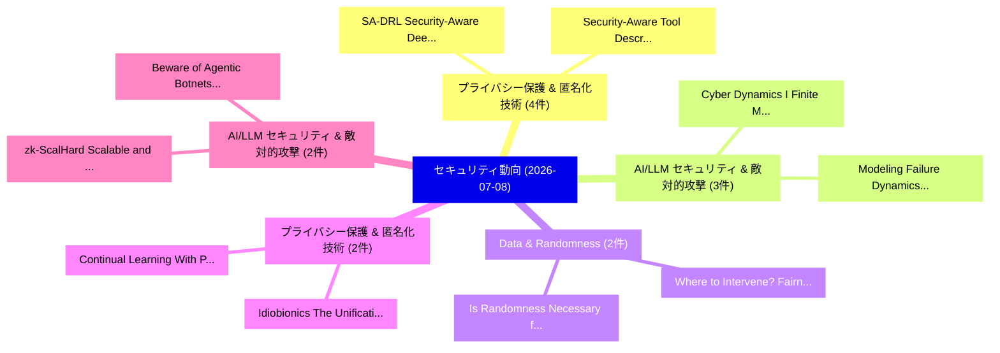

# 📅 02_daily: 日次エグゼクティブサマリー報告書 (2026-07-08)

**集計日時**: 2026-10-02 23:06:18 UTC  
**対象日付**: 2026-07-08  
**本日収集論文数**: 42 件  

---

## 💡 主要セキュリティ動向・脅威インサイト (Executive Insights)

本日の収集論文（計 42 件）において、以下の重点セキュリティ領域で活発な研究動向が確認されました：
- **プライバシー保護 & 匿名化技術** (4 件): 注目論文として 「SA-DRL: Security-Aware Deep Re...」、「Security-Aware Tool Descriptio...」 等が発表され、実務防御および攻撃検証の進展が見られます。
- **AI/LLM セキュリティ & 敵対的攻撃** (3 件): 注目論文として 「Cyber Dynamics I: Finite Macro...」、「Modeling Failure Dynamics in T...」 等が発表され、実務防御および攻撃検証の進展が見られます。
- **Data & Randomness** (2 件): 注目論文として 「Is Randomness Necessary for Ad...」、「Where to Intervene? Fairness-A...」 等が発表され、実務防御および攻撃検証の進展が見られます。
- **プライバシー保護 & 匿名化技術** (2 件): 注目論文として 「Continual Learning With Partic...」、「Idiobionics: The Unification o...」 等が発表され、実務防御および攻撃検証の進展が見られます。
- **AI/LLM セキュリティ & 敵対的攻撃** (2 件): 注目論文として 「zk-ScalHard: Scalable and Hard...」、「Beware of Agentic Botnets: Sca...」 等が発表され、実務防御および攻撃検証の進展が見られます。

### 🗺️ 技術・脅威トピックマインドマップ

---

## 📌 日次セキュリティ論文一覧 (日本語表形式)

| No | arXiv ID | 論文タイトル (日本語訳) | 重要キーワード | 構造化エグゼクティブ要約 (背景・提案・影響) | 脅威分類 | 詳細リンク |
|---|---|---|---|---|---|---|
| 1 | `2607.06880v1` | [SA-DRL: Security-Aware Deep Reinforcement Learning for Ransomware Detection with Asymmetric Reward Design（セキュリティ分析論文）](../../okf/papers/2026-07-08/2607.06880.md) | `Aware Deep Reinforcement Learning`, `Asymmetric Reward Design`, `Ransomware Detection` | 【提案】概要 (Overview & Key Finding) 本論文「SA-DRL: Security-Aware Deep Reinforcement Learning for ...。実証評価により経営層・セキュリティ管理者向け推奨アクション (E... | `arXiv` | [arXiv](https://arxiv.org/abs/2607.06880v1) &#124; [OKF](../../okf/papers/2026-07-08/2607.06880.md) |
| 2 | `2607.06963v1` | [大規模言語モデル (LLMs) and Generative AI in Cybersecurity and Privacy: A Survey of Dual-Use Risks, AI-Generated Malware, Explainability, and Defensive Strategies](../../okf/papers/2026-07-08/2607.06963.md) | `Use Risks`, `Generated Malware`, `Defensive Strategies` | 【提案】概要 (Overview & Key Finding) 本論文「大規模言語モデル (LLMs) and Generative AI in Cybersecurity and ...。実証評価により経営層・セキュリティ管理者向け推奨アクション (E... | `arXiv` | [arXiv](https://arxiv.org/abs/2607.06963v1) &#124; [OKF](../../okf/papers/2026-07-08/2607.06963.md) |
| 3 | `2607.07007v1` | [Thinking More, Harnessing Better: State Machine Guided Harness Automatic Generation with Project Digestion and Workflow Decomposition（セキュリティ分析論文）](../../okf/papers/2026-07-08/2607.07007.md) | `State Machine Guided Harness Automatic Generation`, `Harnessing Better`, `Project Digestion` | 【提案】概要 (Overview & Key Finding) 本論文「Thinking More, Harnessing Better: State Machine Guided ...。実証評価により経営層・セキュリティ管理者向け推奨アクション (E... | `arXiv` | [arXiv](https://arxiv.org/abs/2607.07007v1) &#124; [OKF](../../okf/papers/2026-07-08/2607.07007.md) |
| 4 | `2607.07049v1` | [An Automated Framework for Generating Stealthy Cell-Embedded Hardware Trojans（セキュリティ分析論文）](../../okf/papers/2026-07-08/2607.07049.md) | `Generating Stealthy Cell`, `Embedded Hardware Trojans`, `Cell-Embedded Hardware` | 【提案】概要 (Overview & Key Finding) 本論文「An Automated Framework for Generating Stealthy Cell-Emb...。実証評価により経営層・セキュリティ管理者向け推奨アクション (E... | `arXiv` | [arXiv](https://arxiv.org/abs/2607.07049v1) &#124; [OKF](../../okf/papers/2026-07-08/2607.07049.md) |
| 5 | `2607.07062v1` | [Deanonymizing Monero Transactions in Tor Network（セキュリティ分析論文）](../../okf/papers/2026-07-08/2607.07062.md) | `Deanonymizing Monero Transactions`, `Tor Network`, `Ruisheng Shi` | 【提案】概要 (Overview & Key Finding) 本論文「Deanonymizing Monero Transactions in Tor Network（セキュリティ...。実証評価により経営層・セキュリティ管理者向け推奨アクション (E... | `arXiv` | [arXiv](https://arxiv.org/abs/2607.07062v1) &#124; [OKF](../../okf/papers/2026-07-08/2607.07062.md) |
| 6 | `2607.07075v2` | [Cyber Dynamics I: Finite Macrostates for Behavioral Anomaly Detection in Network Telemetry（セキュリティ分析論文）](../../okf/papers/2026-07-08/2607.07075.md) | `Behavioral Anomaly Detection`, `Cyber Dynamics`, `Finite Macrostates` | 【提案】概要 (Overview & Key Finding) 本論文「Cyber Dynamics I: Finite Macrostates for Behavioral Ano...。実証評価により経営層・セキュリティ管理者向け推奨アクション (E... | `Cryptography` | [arXiv](https://arxiv.org/abs/2607.07075v2) &#124; [OKF](../../okf/papers/2026-07-08/2607.07075.md) |
| 7 | `2607.07085v2` | [Is Randomness Necessary for Adaptive Data Analysis?（セキュリティ分析論文）](../../okf/papers/2026-07-08/2607.07085.md) | `Edith Cohen`, `Haim Kaplan`, `Yishay Mansour` | 【提案】### (日本語題名: Is Randomness Necessary for Adaptive Data Analysis?（セキュリティ分析論文）)  > [!NOTE]...。実証評価により経営層・セキュリティ管理者向け推奨アクション (E... | `arXiv` | [arXiv](https://arxiv.org/abs/2607.07085v2) &#124; [OKF](../../okf/papers/2026-07-08/2607.07085.md) |
| 8 | `2607.07097v1` | [Operational Reframing and Approval-Framed Delegation in Multi-Agent LLM Safety（セキュリティ分析論文）](../../okf/papers/2026-07-08/2607.07097.md) | `Operational Reframing`, `Framed Delegation`, `Approval-Framed Delegation` | 【提案】概要 (Overview & Key Finding) 本論文「Operational Reframing and Approval-Framed Delegation in...。実証評価により経営層・セキュリティ管理者向け推奨アクション (E... | `arXiv` | [arXiv](https://arxiv.org/abs/2607.07097v1) &#124; [OKF](../../okf/papers/2026-07-08/2607.07097.md) |
| 9 | `2607.07109v1` | [Certifying Ghosts: How サイバーセキュリティ AI Agents Break the EU Cyber Resilience Act](../../okf/papers/2026-07-08/2607.07109.md) | `Cyber Resilience Act`, `Certifying Ghosts`, `Agents Break` | 【提案】概要 (Overview & Key Finding) 本論文「Certifying Ghosts: How サイバーセキュリティ AI Agents Break the E...。実証評価により経営層・セキュリティ管理者向け推奨アクション (E... | `arXiv` | [arXiv](https://arxiv.org/abs/2607.07109v1) &#124; [OKF](../../okf/papers/2026-07-08/2607.07109.md) |
| 10 | `2607.07191v1` | [Evaluating Endpoint Detection Robustness Against Genetic Algorithm Driven Code Transformations（セキュリティ分析論文）](../../okf/papers/2026-07-08/2607.07191.md) | `Alvina Rwaichi Minja`, `Jema David Ndibwile`, `Raw Meta` | 【提案】概要 (Overview & Key Finding) 本論文「Evaluating Endpoint Detection Robustness Against Geneti...。実証評価により経営層・セキュリティ管理者向け推奨アクション (E... | `arXiv` | [arXiv](https://arxiv.org/abs/2607.07191v1) &#124; [OKF](../../okf/papers/2026-07-08/2607.07191.md) |
| 11 | `2607.07209v1` | [Continual Learning With Participation Privacy: An Auditable Buffering-Aggregation Recipe（セキュリティ分析論文）](../../okf/papers/2026-07-08/2607.07209.md) | `Aggregation Recipe`, `Buffering-Aggregation Recipe`, `Hubert Chan` | 【提案】概要 (Overview & Key Finding) 本論文「Continual Learning With Participation Privacy: An Audit...。実証評価により経営層・セキュリティ管理者向け推奨アクション (E... | `arXiv` | [arXiv](https://arxiv.org/abs/2607.07209v1) &#124; [OKF](../../okf/papers/2026-07-08/2607.07209.md) |
| 12 | `2607.07217v1` | [Finding and Understanding Miscompilation Bugs in the Solidity Compiler（セキュリティ分析論文）](../../okf/papers/2026-07-08/2607.07217.md) | `Understanding Miscompilation Bugs`, `Solidity Compiler`, `Bhargava Shastry` | 【提案】概要 (Overview & Key Finding) 本論文「Finding and Understanding Miscompilation Bugs in the So...。実証評価により経営層・セキュリティ管理者向け推奨アクション (E... | `arXiv` | [arXiv](https://arxiv.org/abs/2607.07217v1) &#124; [OKF](../../okf/papers/2026-07-08/2607.07217.md) |
| 13 | `2607.07226v1` | [Monitoring Vulnerabilities in Next-Generation Automotive Operating Systems（セキュリティ分析論文）](../../okf/papers/2026-07-08/2607.07226.md) | `Generation Automotive Operating Systems`, `Monitoring Vulnerabilities`, `Next-Generation Automotive` | 【提案】概要 (Overview & Key Finding) 本論文「Monitoring Vulnerabilities in Next-Generation Automotiv...。実証評価により経営層・セキュリティ管理者向け推奨アクション (E... | `arXiv` | [arXiv](https://arxiv.org/abs/2607.07226v1) &#124; [OKF](../../okf/papers/2026-07-08/2607.07226.md) |
| 14 | `2607.07269v1` | [MoLIFE: Methodology, Technologies, and Challenges for Mobile Live Intelligent Forensics Examination（セキュリティ分析論文）](../../okf/papers/2026-07-08/2607.07269.md) | `Mobile Live Intelligent Forensics Examination`, `Silvia Lucia Sanna`, `Mobile Live Intell` | 【提案】概要 (Overview & Key Finding) 本論文「MoLIFE: Methodology, Technologies, and Challenges for M...。実証評価により経営層・セキュリティ管理者向け推奨アクション (E... | `arXiv` | [arXiv](https://arxiv.org/abs/2607.07269v1) &#124; [OKF](../../okf/papers/2026-07-08/2607.07269.md) |
| 15 | `2607.07271v1` | [Safe2Hail: A Forensic-Driven Post-Trip Tracking Framework for Ride-Hailing Safety in Africa（セキュリティ分析論文）](../../okf/papers/2026-07-08/2607.07271.md) | `Driven Post`, `Forensic-Driven Post`, `Hailing Safety` | 【提案】概要 (Overview & Key Finding) 本論文「Safe2Hail: A Forensic-Driven Post-Trip Tracking Framewo...。実証評価により経営層・セキュリティ管理者向け推奨アクション (E... | `arXiv` | [arXiv](https://arxiv.org/abs/2607.07271v1) &#124; [OKF](../../okf/papers/2026-07-08/2607.07271.md) |
| 16 | `2607.07314v1` | [FedCVESA: Taking Away Training Data in 連合学習 via Correlation Value Encoding and Segmented Aggregation](../../okf/papers/2026-07-08/2607.07314.md) | `Taking Away Training Data`, `Correlation Value Encoding`, `Segmented Aggregation` | 【提案】概要 (Overview & Key Finding) 本論文「FedCVESA: Taking Away Training Data in 連合学習 via Correla...。実証評価により経営層・セキュリティ管理者向け推奨アクション (E... | `arXiv` | [arXiv](https://arxiv.org/abs/2607.07314v1) &#124; [OKF](../../okf/papers/2026-07-08/2607.07314.md) |
| 17 | `2607.07359v1` | [The AI Resilience Gap: Bringing Artificial Intelligence Inside the Operational Resilience Perimeter（セキュリティ分析論文）](../../okf/papers/2026-07-08/2607.07359.md) | `Bringing Artificial Intelligence Inside`, `Operational Resilience Perimeter`, `Resilience Gap` | 【提案】概要 (Overview & Key Finding) 本論文「The AI Resilience Gap: Bringing Artificial Intelligence...。実証評価により経営層・セキュリティ管理者向け推奨アクション (E... | `arXiv` | [arXiv](https://arxiv.org/abs/2607.07359v1) &#124; [OKF](../../okf/papers/2026-07-08/2607.07359.md) |
| 18 | `2607.07371v2` | [zk-ScalHard: Scalable and Hardware-Rooted Privacy-Preserving Authentication for Secure OTA Updates in Zonal SDVs（セキュリティ分析論文）](../../okf/papers/2026-07-08/2607.07371.md) | `Rooted Privacy`, `Preserving Authentication`, `Hardware-Rooted Privacy` | 【提案】概要 (Overview & Key Finding) 本論文「zk-ScalHard: Scalable and Hardware-Rooted Privacy-Prese...。実証評価により経営層・セキュリティ管理者向け推奨アクション (E... | `arXiv` | [arXiv](https://arxiv.org/abs/2607.07371v2) &#124; [OKF](../../okf/papers/2026-07-08/2607.07371.md) |
| 19 | `2607.07405v2` | [Reason Less, Verify More: Deterministic Gates Recover a Silent Policy-Violation Failure Mode in Tool-Using LLMエージェント](../../okf/papers/2026-07-08/2607.07405.md) | `Deterministic Gates Recover`, `Violation Failure Mode`, `Reason Less` | 【提案】概要 (Overview & Key Finding) 本論文「Reason Less, Verify More: Deterministic Gates Recover a...。実証評価により経営層・セキュリティ管理者向け推奨アクション (E... | `arXiv` | [arXiv](https://arxiv.org/abs/2607.07405v2) &#124; [OKF](../../okf/papers/2026-07-08/2607.07405.md) |
| 20 | `2607.07414v2` | [How Reliable Is the Multi-Input Heuristic for Bitcoin Address Clustering in Law Enforcement Contexts?（セキュリティ分析論文）](../../okf/papers/2026-07-08/2607.07414.md) | `Bitcoin Address Clustering`, `Law Enforcement Contexts`, `Input Heuristic` | 【提案】### (日本語題名: How Reliable Is the Multi-Input Heuristic for Bitcoin Address Clustering in...。実証評価により経営層・セキュリティ管理者向け推奨アクション (E... | `arXiv` | [arXiv](https://arxiv.org/abs/2607.07414v2) &#124; [OKF](../../okf/papers/2026-07-08/2607.07414.md) |
| 21 | `2607.07433v1` | [Beware of Agentic Botnets: Scalable Untargeted Promptware Attacks via Universal and Transferable Adversarial HalluSquatting（セキュリティ分析論文）](../../okf/papers/2026-07-08/2607.07433.md) | `Scalable Untargeted Promptware Attacks`, `Agentic Botnets`, `Transferable Adversarial` | 【提案】概要 (Overview & Key Finding) 本論文「Beware of Agentic Botnets: Scalable Untargeted Promptwa...。実証評価により経営層・セキュリティ管理者向け推奨アクション (E... | `arXiv` | [arXiv](https://arxiv.org/abs/2607.07433v1) &#124; [OKF](../../okf/papers/2026-07-08/2607.07433.md) |
| 22 | `2607.07436v2` | [The Blind Curator: How a Biased Judge Silently Disables Skill Retirement in Self-Evolving Agents（セキュリティ分析論文）](../../okf/papers/2026-07-08/2607.07436.md) | `Biased Judge Silently Disables Skill Retirement`, `Evolving Agents`, `Self-Evolving Agents` | 【提案】概要 (Overview & Key Finding) 本論文「The Blind Curator: How a Biased Judge Silently Disables...。実証評価により経営層・セキュリティ管理者向け推奨アクション (E... | `AI/ML Security` | [arXiv](https://arxiv.org/abs/2607.07436v2) &#124; [OKF](../../okf/papers/2026-07-08/2607.07436.md) |
| 23 | `2607.07461v1` | [Security-Aware Tool DescriptionsによるTaint-Style Vulnerabilities in MCP Serversの軽減](../../okf/papers/2026-07-08/2607.07461.md) | `Style Vulnerabilities`, `Security-Aware Tool`, `Aware Tool Descriptions` | 【提案】概要 (Overview & Key Finding) 本論文「Security-Aware Tool DescriptionsによるTaint-Style Vulnerab...。実証評価により経営層・セキュリティ管理者向け推奨アクション (E... | `arXiv` | [arXiv](https://arxiv.org/abs/2607.07461v1) &#124; [OKF](../../okf/papers/2026-07-08/2607.07461.md) |
| 24 | `2607.07471v2` | [Where to Intervene? Fairness-Aware Learning on Differentially Private Synthetic Tabular Dataのベンチマーク評価](../../okf/papers/2026-07-08/2607.07471.md) | `Aware Learning`, `Fairness-Aware Learning`, `Differentially Private Synthetic Tabular` | 【提案】Benchmarking Fairness-Aware Learning on Differentially Private Synthetic Tabular Data #...。実証評価により経営層・セキュリティ管理者向け推奨アクション (E... | `arXiv` | [arXiv](https://arxiv.org/abs/2607.07471v2) &#124; [OKF](../../okf/papers/2026-07-08/2607.07471.md) |
| 25 | `2607.07474v1` | [Beyond Attack-Success Rate: Action-Graded Severity Scale for Tool-Using AI Agents（セキュリティ分析論文）](../../okf/papers/2026-07-08/2607.07474.md) | `Graded Severity Scale`, `Beyond Attack`, `Success Rate` | 【提案】概要 (Overview & Key Finding) 本論文「Beyond Attack-Success Rate: Action-Graded Severity Scal...。実証評価により経営層・セキュリティ管理者向け推奨アクション (E... | `arXiv` | [arXiv](https://arxiv.org/abs/2607.07474v1) &#124; [OKF](../../okf/papers/2026-07-08/2607.07474.md) |
| 26 | `2607.07573v1` | [Multi-Class vs. Multi-Label BERT for CVE-to-CWE Mapping: How Taxonomy Structure Shapes the Errors（セキュリティ分析論文）](../../okf/papers/2026-07-08/2607.07573.md) | `Multi-Class vs`, `Multi-Label BERT`, `Ana Schwengber Kelm` | 【提案】概要 (Overview & Key Finding) 本論文「Multi-Class vs. Multi-Label BERT for CVE-to-CWE Mapping...。実証評価により経営層・セキュリティ管理者向け推奨アクション (E... | `arXiv` | [arXiv](https://arxiv.org/abs/2607.07573v1) &#124; [OKF](../../okf/papers/2026-07-08/2607.07573.md) |
| 27 | `2607.07596v1` | [NARAD: Non-colluding Aggregator-oblivious Record-And-Decrypt（セキュリティ分析論文）](../../okf/papers/2026-07-08/2607.07596.md) | `Non-colluding Aggregator`, `Akshit Vakati Venkata`, `Rajat Dugar` | 【提案】概要 (Overview & Key Finding) 本論文「NARAD: Non-colluding Aggregator-oblivious Record-And-De...。実証評価により経営層・セキュリティ管理者向け推奨アクション (E... | `arXiv` | [arXiv](https://arxiv.org/abs/2607.07596v1) &#124; [OKF](../../okf/papers/2026-07-08/2607.07596.md) |
| 28 | `2607.07625v1` | [Embedded Blockchain Infrastructure Management (eBIM): A RISC-V-Empowered Hardware--Software Co-Design Framework Trustworthy Blockchainに向けて](../../okf/papers/2026-07-08/2607.07625.md) | `Embedded Blockchain Infrastructure Management`, `Empowered Hardware`, `Software Co` | 【提案】概要 (Overview & Key Finding) 本論文「Embedded Blockchain Infrastructure Management (eBIM): A...。実証評価により経営層・セキュリティ管理者向け推奨アクション (E... | `arXiv` | [arXiv](https://arxiv.org/abs/2607.07625v1) &#124; [OKF](../../okf/papers/2026-07-08/2607.07625.md) |
| 29 | `2607.07635v2` | [Unlearning to Protect: A Distilled Reinforcement Learning Framework with Privacy-Preserving Feature Unlearning and XAI for IoT Security（セキュリティ分析論文）](../../okf/papers/2026-07-08/2607.07635.md) | `Preserving Feature Unlearning`, `Privacy-Preserving Feature`, `Golam Rabiul Alam` | 【提案】概要 (Overview & Key Finding) 本論文「Unlearning to Protect: A Distilled Reinforcement Learni...。実証評価により経営層・セキュリティ管理者向け推奨アクション (E... | `arXiv` | [arXiv](https://arxiv.org/abs/2607.07635v2) &#124; [OKF](../../okf/papers/2026-07-08/2607.07635.md) |
| 30 | `2607.07650v1` | [Modeling Failure Dynamics in Time-Constrained Authentication Systems: Evidence of a Success Cliff in USSD Workflows（セキュリティ分析論文）](../../okf/papers/2026-07-08/2607.07650.md) | `Modeling Failure Dynamics`, `Constrained Authentication Systems`, `Success Cliff` | 【提案】概要 (Overview & Key Finding) 本論文「Modeling Failure Dynamics in Time-Constrained Authentic...。実証評価により経営層・セキュリティ管理者向け推奨アクション (E... | `arXiv` | [arXiv](https://arxiv.org/abs/2607.07650v1) &#124; [OKF](../../okf/papers/2026-07-08/2607.07650.md) |
| 31 | `2607.07739v1` | [Controllability-Aware Adversarial Examples Against LLM-Based Network Traffic Classifiers（セキュリティ分析論文）](../../okf/papers/2026-07-08/2607.07739.md) | `Based Network Traffic Classifiers`, `Controllability-Aware Adversarial`, `LLM-Based Network` | 【提案】概要 (Overview & Key Finding) 本論文「Controllability-Aware Adversarial Examples Against LLM-...。実証評価により経営層・セキュリティ管理者向け推奨アクション (E... | `arXiv` | [arXiv](https://arxiv.org/abs/2607.07739v1) &#124; [OKF](../../okf/papers/2026-07-08/2607.07739.md) |
| 32 | `2607.07751v1` | [Forensic Schema for Psychological Manipulation in Cyber Fraud: LLM-Driven Victim Reports Analysis（セキュリティ分析論文）](../../okf/papers/2026-07-08/2607.07751.md) | `Forensic Schema`, `Psychological Manipulation`, `Cyber Fraud` | 【提案】概要 (Overview & Key Finding) 本論文「Forensic Schema for Psychological Manipulation in Cyber...。実証評価により経営層・セキュリティ管理者向け推奨アクション (E... | `arXiv` | [arXiv](https://arxiv.org/abs/2607.07751v1) &#124; [OKF](../../okf/papers/2026-07-08/2607.07751.md) |
| 33 | `2607.07774v2` | [ScopeJudge: Cost-Aware Pre-Execution Gating for Offensive Security Agents（セキュリティ分析論文）](../../okf/papers/2026-07-08/2607.07774.md) | `Offensive Security Agents`, `Aware Pre`, `Execution Gating` | 【提案】概要 (Overview & Key Finding) 本論文「ScopeJudge: Cost-Aware Pre-Execution Gating for Offensi...。実証評価により経営層・セキュリティ管理者向け推奨アクション (E... | `arXiv` | [arXiv](https://arxiv.org/abs/2607.07774v2) &#124; [OKF](../../okf/papers/2026-07-08/2607.07774.md) |
| 34 | `2607.07775v1` | [Idiobionics: The Unification of Privacy and Intelligent Robotic Prostheses（セキュリティ分析論文）](../../okf/papers/2026-07-08/2607.07775.md) | `Intelligent Robotic Prostheses`, `Kwesi Afari Darfoor`, `Bailey Kacsmar` | 【提案】概要 (Overview & Key Finding) 本論文「Idiobionics: The Unification of Privacy and Intelligent...。実証評価により経営層・セキュリティ管理者向け推奨アクション (E... | `arXiv` | [arXiv](https://arxiv.org/abs/2607.07775v1) &#124; [OKF](../../okf/papers/2026-07-08/2607.07775.md) |
| 35 | `2607.07827v1` | [Open Models, Open Risks: Measuring Unsafe Generation in Text-to-Image Models In the Wild（セキュリティ分析論文）](../../okf/papers/2026-07-08/2607.07827.md) | `Measuring Unsafe Generation`, `Open Models`, `Open Risks` | 【提案】概要 (Overview & Key Finding) 本論文「Open Models, Open Risks: Measuring Unsafe Generation in...。実証評価により経営層・セキュリティ管理者向け推奨アクション (E... | `arXiv` | [arXiv](https://arxiv.org/abs/2607.07827v1) &#124; [OKF](../../okf/papers/2026-07-08/2607.07827.md) |
| 36 | `2607.07881v1` | [Functional and Secure Code Generation with Task Vectors（セキュリティ分析論文）](../../okf/papers/2026-07-08/2607.07881.md) | `Secure Code Generation`, `Task Vectors`, `Felix Wang` | 【提案】概要 (Overview & Key Finding) 本論文「Functional and Secure Code Generation with Task Vectors...。実証評価によりAsokan - **公開日時**: `2026-... | `arXiv` | [arXiv](https://arxiv.org/abs/2607.07881v1) &#124; [OKF](../../okf/papers/2026-07-08/2607.07881.md) |
| 37 | `2607.07901v1` | [Closed-Loop Dynamic Validator Node Scaling in Private Substrate Blockchains Using Takagi-Sugeno Fuzzy Inference（セキュリティ分析論文）](../../okf/papers/2026-07-08/2607.07901.md) | `Loop Dynamic Validator Node Scaling`, `Private Substrate Blockchains Using Takagi`, `Sugeno Fuzzy Inference` | 【提案】概要 (Overview & Key Finding) 本論文「Closed-Loop Dynamic Validator Node Scaling in Private S...。実証評価により経営層・セキュリティ管理者向け推奨アクション (E... | `arXiv` | [arXiv](https://arxiv.org/abs/2607.07901v1) &#124; [OKF](../../okf/papers/2026-07-08/2607.07901.md) |
| 38 | `2607.07903v1` | [Mechanistic Interpretability of LLM Jailbreaks via Internal Attribution Graphs（セキュリティ分析論文）](../../okf/papers/2026-07-08/2607.07903.md) | `Internal Attribution Graphs`, `Mechanistic Interpretability`, `Ifrat Ikhtear Uddin` | 【提案】概要 (Overview & Key Finding) 本論文「Mechanistic Interpretability of LLM ジェイルブレイクs via Inter...。実証評価により経営層・セキュリティ管理者向け推奨アクション (E... | `arXiv` | [arXiv](https://arxiv.org/abs/2607.07903v1) &#124; [OKF](../../okf/papers/2026-07-08/2607.07903.md) |
| 39 | `2607.07907v1` | [Multimodal Unlearning Across Vision, Language, Video, and Audio: Survey of Methods, Datasets, and Benchmarks（セキュリティ分析論文）](../../okf/papers/2026-07-08/2607.07907.md) | `Multimodal Unlearning Across Vision`, `Shubhashis Roy Dipta`, `Nobin Sarwar` | 【提案】概要 (Overview & Key Finding) 本論文「Multimodal Unlearning Across Vision, Language, Video, a...。実証評価により経営層・セキュリティ管理者向け推奨アクション (E... | `arXiv` | [arXiv](https://arxiv.org/abs/2607.07907v1) &#124; [OKF](../../okf/papers/2026-07-08/2607.07907.md) |
| 40 | `2607.07918v2` | [Efficient Safety Alignment of Language Models via Latent Personality Traits（セキュリティ分析論文）](../../okf/papers/2026-07-08/2607.07918.md) | `Efficient Safety Alignment`, `Latent Personality Traits`, `Language Models` | 【提案】概要 (Overview & Key Finding) 本論文「Efficient Safety Alignment of Language Models via Laten...。実証評価により経営層・セキュリティ管理者向け推奨アクション (E... | `AI/ML Security` | [arXiv](https://arxiv.org/abs/2607.07918v2) &#124; [OKF](../../okf/papers/2026-07-08/2607.07918.md) |
| 41 | `2607.07926v1` | [KS-CFA: Control-Flow Attestation via Symbolic Replay Against Control-Flow Bending Attacks（セキュリティ分析論文）](../../okf/papers/2026-07-08/2607.07926.md) | `Flow Bending Attacks`, `Flow Attestation`, `Control-Flow Attestation` | 【提案】概要 (Overview & Key Finding) 本論文「KS-CFA: Control-Flow Attestation via Symbolic Replay Ag...。実証評価により経営層・セキュリティ管理者向け推奨アクション (E... | `arXiv` | [arXiv](https://arxiv.org/abs/2607.07926v1) &#124; [OKF](../../okf/papers/2026-07-08/2607.07926.md) |
| 42 | `2607.07989v1` | [Who Broke the System? Failure Localization in LLM-Based Multi-Agent Systems（セキュリティ分析論文）](../../okf/papers/2026-07-08/2607.07989.md) | `Failure Localization`, `Based Multi`, `Agent Systems` | 【提案】Failure Localization in LLM-Based Multi-Agent Systems ### (日本語題名: Who Broke the System?。実証評価により経営層・セキュリティ管理者向け推奨アクション (Exec... | `arXiv` | [arXiv](https://arxiv.org/abs/2607.07989v1) &#124; [OKF](../../okf/papers/2026-07-08/2607.07989.md) |

