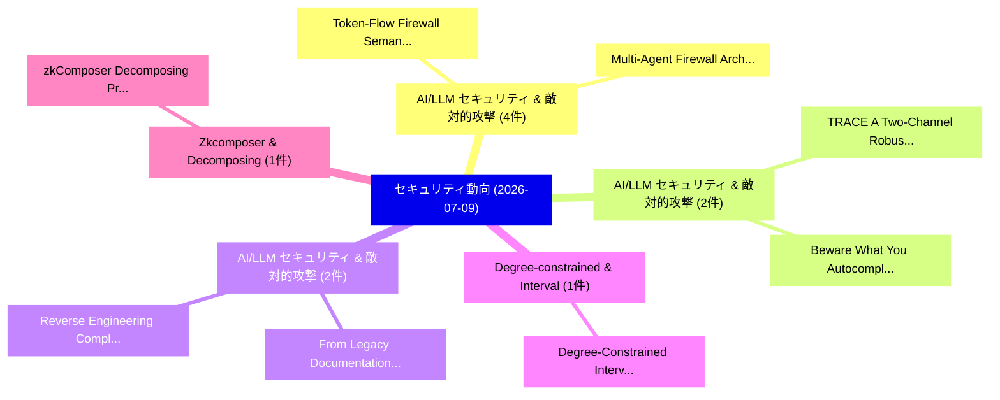

# 📅 02_daily: 日次エグゼクティブサマリー報告書 (2026-07-09)

**集計日時**: 2026-10-02 23:06:18 UTC  
**対象日付**: 2026-07-09  
**本日収集論文数**: 25 件  

---

## 💡 主要セキュリティ動向・脅威インサイト (Executive Insights)

本日の収集論文（計 25 件）において、以下の重点セキュリティ領域で活発な研究動向が確認されました：
- **AI/LLM セキュリティ & 敵対的攻撃** (4 件): 注目論文として 「Multi-Agent Firewall Architect...」、「Token-Flow Firewall: Semantic ...」 等が発表され、実務防御および攻撃検証の進展が見られます。
- **AI/LLM セキュリティ & 敵対的攻撃** (2 件): 注目論文として 「Beware What You Autocomplete: ...」、「TRACE: A Two-Channel Robust At...」 等が発表され、実務防御および攻撃検証の進展が見られます。
- **AI/LLM セキュリティ & 敵対的攻撃** (2 件): 注目論文として 「From Legacy Documentation to O...」、「Reverse Engineering Compliance...」 等が発表され、実務防御および攻撃検証の進展が見られます。
- **Degree-constrained & Interval** (1 件): 注目論文として 「Degree-Constrained Interval Op...」 等が発表され、実務防御および攻撃検証の進展が見られます。
- **Zkcomposer & Decomposing** (1 件): 注目論文として 「zkComposer: Decomposing Proof ...」 等が発表され、実務防御および攻撃検証の進展が見られます。

### 🗺️ 技術・脅威トピックマインドマップ

---

## 📌 日次セキュリティ論文一覧 (日本語表形式)

| No | arXiv ID | 論文タイトル (日本語訳) | 重要キーワード | 構造化エグゼクティブ要約 (背景・提案・影響) | 脅威分類 | 詳細リンク |
|---|---|---|---|---|---|---|
| 1 | `2607.08011v1` | [Beware What You Autocomplete: Forensic Attribution of Backdoored Code Completions（セキュリティ分析論文）](../../okf/papers/2026-07-09/2607.08011.md) | `Backdoored Code Completions`, `Forensic Attribution`, `Anjun Gao` | 【提案】概要 (Overview & Key Finding) 本論文「Beware What You Autocomplete: Forensic Attribution of B...。実証評価により経営層・セキュリティ管理者向け推奨アクション (E... | `arXiv` | [arXiv](https://arxiv.org/abs/2607.08011v1) &#124; [OKF](../../okf/papers/2026-07-09/2607.08011.md) |
| 2 | `2607.08042v1` | [Degree-Constrained Interval Optimization for Minimax Polynomial Approximation in Homomorphic Encryption（セキュリティ分析論文）](../../okf/papers/2026-07-09/2607.08042.md) | `Constrained Interval Optimization`, `Minimax Polynomial Approximation`, `Homomorphic Encryption` | 【提案】概要 (Overview & Key Finding) 本論文「Degree-Constrained Interval Optimization for Minimax Po...。実証評価により経営層・セキュリティ管理者向け推奨アクション (E... | `arXiv` | [arXiv](https://arxiv.org/abs/2607.08042v1) &#124; [OKF](../../okf/papers/2026-07-09/2607.08042.md) |
| 3 | `2607.08095v1` | [zkComposer: Decomposing Proof Construction to Scale zkML（セキュリティ分析論文）](../../okf/papers/2026-07-09/2607.08095.md) | `Decomposing Proof Construction`, `Pawan Kumar Sanjaya`, `Christina Giannoula` | 【提案】概要 (Overview & Key Finding) 本論文「zkComposer: Decomposing Proof Construction to Scale zkM...。実証評価により経営層・セキュリティ管理者向け推奨アクション (E... | `arXiv` | [arXiv](https://arxiv.org/abs/2607.08095v1) &#124; [OKF](../../okf/papers/2026-07-09/2607.08095.md) |
| 4 | `2607.08137v1` | [Autonomous Vehicle Systems via Twin-Aware Federated Reinforcement Learningのセキュリティ強化](../../okf/papers/2026-07-09/2607.08137.md) | `Twin-Aware Federated`, `Autonomous Vehicle Systems`, `Aware Federated Reinforcement` | 【提案】概要 (Overview & Key Finding) 本論文「Autonomous Vehicle Systems via Twin-Aware Federated Rei...。実証評価により経営層・セキュリティ管理者向け推奨アクション (E... | `arXiv` | [arXiv](https://arxiv.org/abs/2607.08137v1) &#124; [OKF](../../okf/papers/2026-07-09/2607.08137.md) |
| 5 | `2607.08147v1` | [Prismata: Confining Cross-Site Prompt Injection in Web Agents（セキュリティ分析論文）](../../okf/papers/2026-07-09/2607.08147.md) | `Site Prompt Injection`, `Confining Cross`, `Web Agents` | 【提案】概要 (Overview & Key Finding) 本論文「Prismata: Confining Cross-Site プロンプトインジェクション in Web Age...。実証評価により経営層・セキュリティ管理者向け推奨アクション (E... | `arXiv` | [arXiv](https://arxiv.org/abs/2607.08147v1) &#124; [OKF](../../okf/papers/2026-07-09/2607.08147.md) |
| 6 | `2607.08180v1` | [Out of Sight: Compression-Aware Content Protection against Agentic Crawlers（セキュリティ分析論文）](../../okf/papers/2026-07-09/2607.08180.md) | `Aware Content Protection`, `Agentic Crawlers`, `Compression-Aware Content` | 【提案】概要 (Overview & Key Finding) 本論文「Out of Sight: Compression-Aware Content Protection agai...。実証評価により経営層・セキュリティ管理者向け推奨アクション (E... | `arXiv` | [arXiv](https://arxiv.org/abs/2607.08180v1) &#124; [OKF](../../okf/papers/2026-07-09/2607.08180.md) |
| 7 | `2607.08197v1` | [MLQENABLER: Enabling Secure Machine Learning Queries over Encrypted Database in Cloud Computing（セキュリティ分析論文）](../../okf/papers/2026-07-09/2607.08197.md) | `Enabling Secure Machine Learning Queries`, `Encrypted Database`, `Cloud Computing` | 【提案】概要 (Overview & Key Finding) 本論文「MLQENABLER: Enabling Secure Machine Learning Queries ov...。実証評価により経営層・セキュリティ管理者向け推奨アクション (E... | `arXiv` | [arXiv](https://arxiv.org/abs/2607.08197v1) &#124; [OKF](../../okf/papers/2026-07-09/2607.08197.md) |
| 8 | `2607.08226v1` | [Threshold Authorization Without Threshold Signatures: Signature-Agnostic MPC Custody（セキュリティ分析論文）](../../okf/papers/2026-07-09/2607.08226.md) | `Threshold Authorization Without Threshold Signatures`, `Signature-Agnostic MPC`, `Dariia Porechna` | 【提案】背景とセキュリティ上の課題 (Background & Problem) 本研究はサイバー脅威環境におけるセキュリティ構造・脆弱性の検証を目的としています。(主要検出項目: ...。実証評価により経営層・セキュリティ管理者向け推奨アクション (E... | `arXiv` | [arXiv](https://arxiv.org/abs/2607.08226v1) &#124; [OKF](../../okf/papers/2026-07-09/2607.08226.md) |
| 9 | `2607.08231v1` | [Simulating the Resident: Generating Executable Smart Home Schedules via LLM Personas（セキュリティ分析論文）](../../okf/papers/2026-07-09/2607.08231.md) | `Generating Executable Smart Home Schedules`, `Xenia Wagner`, `Christoph Jahn` | 【提案】概要 (Overview & Key Finding) 本論文「Simulating the Resident: Generating Executable Smart Ho...。実証評価により経営層・セキュリティ管理者向け推奨アクション (E... | `arXiv` | [arXiv](https://arxiv.org/abs/2607.08231v1) &#124; [OKF](../../okf/papers/2026-07-09/2607.08231.md) |
| 10 | `2607.08232v1` | [Mini-Programs, Mega-Problems: Unveiling OAuth-based Authentication Misuses in Mini-Programs via Dynamic Analysis（セキュリティ分析論文）](../../okf/papers/2026-07-09/2607.08232.md) | `Authentication Misuses`, `OAuth-based Authentication`, `Mini-Programs via` | 【提案】概要 (Overview & Key Finding) 本論文「Mini-Programs, Mega-Problems: Unveiling OAuth-based Aut...。実証評価により経営層・セキュリティ管理者向け推奨アクション (E... | `arXiv` | [arXiv](https://arxiv.org/abs/2607.08232v1) &#124; [OKF](../../okf/papers/2026-07-09/2607.08232.md) |
| 11 | `2607.08282v1` | [Multi-Agent Firewall Architecture for Privacy Protection of Sensitive Data in Interactions with Language Models（セキュリティ分析論文）](../../okf/papers/2026-07-09/2607.08282.md) | `Agent Firewall Architecture`, `Multi-Agent Firewall`, `Privacy Protection` | 【提案】概要 (Overview & Key Finding) 本論文「Multi-Agent Firewall Architecture for Privacy Protectio...。実証評価により経営層・セキュリティ管理者向け推奨アクション (E... | `arXiv` | [arXiv](https://arxiv.org/abs/2607.08282v1) &#124; [OKF](../../okf/papers/2026-07-09/2607.08282.md) |
| 12 | `2607.08288v1` | [From Legacy Documentation to OSCAL: An MCP-Based Agent Pipeline for Threat-Informed Continuous Compliance in Critical Infrastructure（セキュリティ分析論文）](../../okf/papers/2026-07-09/2607.08288.md) | `Based Agent Pipeline`, `Informed Continuous Compliance`, `Critical Infrastructure` | 【提案】概要 (Overview & Key Finding) 本論文「From Legacy Documentation to OSCAL: An MCP-Based Agent ...。実証評価により経営層・セキュリティ管理者向け推奨アクション (E... | `arXiv` | [arXiv](https://arxiv.org/abs/2607.08288v1) &#124; [OKF](../../okf/papers/2026-07-09/2607.08288.md) |
| 13 | `2607.08292v1` | [Reverse Engineering Compliance: A Dual-Graph Verification Framework for Auditing Legacy IT Security Concepts（セキュリティ分析論文）](../../okf/papers/2026-07-09/2607.08292.md) | `Reverse Engineering Compliance`, `Auditing Legacy`, `Dual-Graph Verification` | 【提案】概要 (Overview & Key Finding) 本論文「Reverse Engineering Compliance: A Dual-Graph Verificati...。実証評価により経営層・セキュリティ管理者向け推奨アクション (E... | `arXiv` | [arXiv](https://arxiv.org/abs/2607.08292v1) &#124; [OKF](../../okf/papers/2026-07-09/2607.08292.md) |
| 14 | `2607.08383v1` | [Secure QR Codes: Authenticity Verification via EdDSA Signatures and CBOR Certificates（セキュリティ分析論文）](../../okf/papers/2026-07-09/2607.08383.md) | `Authenticity Verification`, `Wojciech Jonderko`, `Wojciech Wodo` | 【提案】概要 (Overview & Key Finding) 本論文「Secure QR Codes: Authenticity Verification via EdDSA Si...。実証評価により経営層・セキュリティ管理者向け推奨アクション (E... | `arXiv` | [arXiv](https://arxiv.org/abs/2607.08383v1) &#124; [OKF](../../okf/papers/2026-07-09/2607.08383.md) |
| 15 | `2607.08395v1` | [Token-Flow Firewall: Semantic Runtime Auditing for Persistent AI Agents（セキュリティ分析論文）](../../okf/papers/2026-07-09/2607.08395.md) | `Semantic Runtime Auditing`, `Flow Firewall`, `Token-Flow Firewall` | 【提案】概要 (Overview & Key Finding) 本論文「Token-Flow Firewall: Semantic Runtime Auditing for Pers...。実証評価により経営層・セキュリティ管理者向け推奨アクション (E... | `arXiv` | [arXiv](https://arxiv.org/abs/2607.08395v1) &#124; [OKF](../../okf/papers/2026-07-09/2607.08395.md) |
| 16 | `2607.08400v1` | [TRACE: A Two-Channel Robust Attribution Watermark via Complementary Embeddings for LLM-Agent Trajectories（セキュリティ分析論文）](../../okf/papers/2026-07-09/2607.08400.md) | `Channel Robust Attribution Watermark`, `Complementary Embeddings`, `Agent Trajectories` | 【提案】概要 (Overview & Key Finding) 本論文「TRACE: A Two-Channel Robust Attribution Watermark via C...。実証評価により経営層・セキュリティ管理者向け推奨アクション (E... | `arXiv` | [arXiv](https://arxiv.org/abs/2607.08400v1) &#124; [OKF](../../okf/papers/2026-07-09/2607.08400.md) |
| 17 | `2607.08516v1` | [Locality of Curve-Decoding and Improved Proximity Gaps（セキュリティ分析論文）](../../okf/papers/2026-07-09/2607.08516.md) | `Improved Proximity Gaps`, `Rohan Goyal`, `Venkatesan Guruswami` | 【提案】概要 (Overview & Key Finding) 本論文「Locality of Curve-Decoding and Improved Proximity Gaps（...。実証評価により経営層・セキュリティ管理者向け推奨アクション (E... | `arXiv` | [arXiv](https://arxiv.org/abs/2607.08516v1) &#124; [OKF](../../okf/papers/2026-07-09/2607.08516.md) |
| 18 | `2607.08524v1` | [Stablecoins under Stress in a National Economy: Transaction-Level Evidence from Austrian Crypto-Asset Service Providers（セキュリティ分析論文）](../../okf/papers/2026-07-09/2607.08524.md) | `Asset Service Providers`, `National Economy`, `Level Evidence` | 【提案】概要 (Overview & Key Finding) 本論文「Stablecoins under Stress in a National Economy: Transac...。実証評価により経営層・セキュリティ管理者向け推奨アクション (E... | `arXiv` | [arXiv](https://arxiv.org/abs/2607.08524v1) &#124; [OKF](../../okf/papers/2026-07-09/2607.08524.md) |
| 19 | `2607.08666v1` | [TRM-Raft: A Byzantine-Resistant Raft Consensus via Integrated Trust and Reputation Model（セキュリティ分析論文）](../../okf/papers/2026-07-09/2607.08666.md) | `Resistant Raft Consensus`, `Integrated Trust`, `Byzantine-Resistant Raft` | 【提案】概要 (Overview & Key Finding) 本論文「TRM-Raft: A Byzantine-Resistant Raft Consensus via Inte...。実証評価により経営層・セキュリティ管理者向け推奨アクション (E... | `arXiv` | [arXiv](https://arxiv.org/abs/2607.08666v1) &#124; [OKF](../../okf/papers/2026-07-09/2607.08666.md) |
| 20 | `2607.08801v2` | [A Seed for Privacy -- semi-automatic privacy-revealing data detection in databases and data streams（セキュリティ分析論文）](../../okf/papers/2026-07-09/2607.08801.md) | `semi-automatic privacy`, `Thomas Plagemann`, `Vera Goebel` | 【提案】概要 (Overview & Key Finding) 本論文「A Seed for Privacy -- semi-automatic privacy-revealing ...。実証評価により経営層・セキュリティ管理者向け推奨アクション (E... | `arXiv` | [arXiv](https://arxiv.org/abs/2607.08801v2) &#124; [OKF](../../okf/papers/2026-07-09/2607.08801.md) |
| 21 | `2607.08809v1` | [Privacy-Preserving Intent Fulfilment and Assurance for 6G RAN（セキュリティ分析論文）](../../okf/papers/2026-07-09/2607.08809.md) | `Preserving Intent Fulfilment`, `Privacy-Preserving Intent`, `Joss Armstrong` | 【提案】概要 (Overview & Key Finding) 本論文「Privacy-Preserving Intent Fulfilment and Assurance for ...。実証評価により経営層・セキュリティ管理者向け推奨アクション (E... | `arXiv` | [arXiv](https://arxiv.org/abs/2607.08809v1) &#124; [OKF](../../okf/papers/2026-07-09/2607.08809.md) |
| 22 | `2607.08865v1` | [Entropy Bootstrapping for Wireless Embedded Systems（セキュリティ分析論文）](../../okf/papers/2026-07-09/2607.08865.md) | `Wireless Embedded Systems`, `Entropy Bootstrapping`, `Florina Almenares Mendoza` | 【提案】概要 (Overview & Key Finding) 本論文「Entropy Bootstrapping for Wireless Embedded Systems（セキュ...。実証評価により経営層・セキュリティ管理者向け推奨アクション (E... | `arXiv` | [arXiv](https://arxiv.org/abs/2607.08865v1) &#124; [OKF](../../okf/papers/2026-07-09/2607.08865.md) |
| 23 | `2607.08906v1` | [Proof-of-Continuity: A Temporal Model for Authority Propagation in Distributed Systems and AI Agents（セキュリティ分析論文）](../../okf/papers/2026-07-09/2607.08906.md) | `Temporal Model`, `Authority Propagation`, `Distributed Systems` | 【提案】概要 (Overview & Key Finding) 本論文「Proof-of-Continuity: A Temporal Model for Authority Pro...。実証評価により経営層・セキュリティ管理者向け推奨アクション (E... | `arXiv` | [arXiv](https://arxiv.org/abs/2607.08906v1) &#124; [OKF](../../okf/papers/2026-07-09/2607.08906.md) |
| 24 | `2607.08949v2` | [SeedSmith: LLM-Driven Seed Synthesis for Directed Fuzzing（セキュリティ分析論文）](../../okf/papers/2026-07-09/2607.08949.md) | `Driven Seed Synthesis`, `Directed Fuzzing`, `LLM-Driven Seed` | 【提案】概要 (Overview & Key Finding) 本論文「SeedSmith: LLM-Driven Seed Synthesis for Directed Fuzzi...。実証評価により経営層・セキュリティ管理者向け推奨アクション (E... | `arXiv` | [arXiv](https://arxiv.org/abs/2607.08949v2) &#124; [OKF](../../okf/papers/2026-07-09/2607.08949.md) |
| 25 | `2607.09804v1` | [Trivial Prompt Reframing Bypasses Safety Guardrails in Googleś MedGemma-4B（セキュリティ分析論文）](../../okf/papers/2026-07-09/2607.09804.md) | `Trivial Prompt Reframing Bypasses Safety Guardrails`, `Avraam Buskila`, `Raw Meta` | 【提案】概要 (Overview & Key Finding) 本論文「Trivial Prompt Reframing Bypasses Safety Guardrails in ...。実証評価により経営層・セキュリティ管理者向け推奨アクション (E... | `arXiv` | [arXiv](https://arxiv.org/abs/2607.09804v1) &#124; [OKF](../../okf/papers/2026-07-09/2607.09804.md) |

