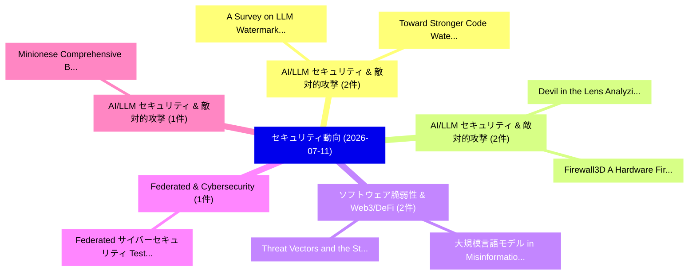

# 📅 02_daily: 日次エグゼクティブサマリー報告書 (2026-07-11)

**集計日時**: 2026-10-02 23:06:19 UTC  
**対象日付**: 2026-07-11  
**本日収集論文数**: 16 件  

---

## 💡 主要セキュリティ動向・脅威インサイト (Executive Insights)

本日の収集論文（計 16 件）において、以下の重点セキュリティ領域で活発な研究動向が確認されました：
- **AI/LLM セキュリティ & 敵対的攻撃** (2 件): 注目論文として 「A Survey on LLM Watermarking: ...」、「Toward Stronger Code Watermark...」 等が発表され、実務防御および攻撃検証の進展が見られます。
- **AI/LLM セキュリティ & 敵対的攻撃** (2 件): 注目論文として 「Devil in the Lens: Analyzing a...」、「Firewall3D: A Hardware Firewal...」 等が発表され、実務防御および攻撃検証の進展が見られます。
- **ソフトウェア脆弱性 & Web3/DeFi** (2 件): 注目論文として 「大規模言語モデル in Misinformation Eco...」、「Threat Vectors and the State o...」 等が発表され、実務防御および攻撃検証の進展が見られます。
- **Federated & Cybersecurity** (1 件): 注目論文として 「Federated サイバーセキュリティ Testbed a...」 等が発表され、実務防御および攻撃検証の進展が見られます。
- **AI/LLM セキュリティ & 敵対的攻撃** (1 件): 注目論文として 「Minionese: Comprehensive Bench...」 等が発表され、実務防御および攻撃検証の進展が見られます。

### 🗺️ 技術・脅威トピックマインドマップ

---

## 📌 日次セキュリティ論文一覧 (日本語表形式)

| No | arXiv ID | 論文タイトル (日本語訳) | 重要キーワード | 構造化エグゼクティブ要約 (背景・提案・影響) | 脅威分類 | 詳細リンク |
|---|---|---|---|---|---|---|
| 1 | `2607.10061v1` | [Federated サイバーセキュリティ Testbed as a Service (FCTaaS): A framework to federate サイバーセキュリティ testbeds](../../okf/papers/2026-07-11/2607.10061.md) | `Federated Cybersecurity Testbed`, `John Paul Martin Encinas`, `Josh Dean` | 【提案】概要 (Overview & Key Finding) 本論文「Federated サイバーセキュリティ Testbed as a Service (FCTaaS): A f...。実証評価により経営層・セキュリティ管理者向け推奨アクション (E... | `arXiv` | [arXiv](https://arxiv.org/abs/2607.10061v1) &#124; [OKF](../../okf/papers/2026-07-11/2607.10061.md) |
| 2 | `2607.10103v1` | [A Survey on LLM Watermarking: Theory and Deployment（セキュリティ分析論文）](../../okf/papers/2026-07-11/2607.10103.md) | `Huy Phan`, `Kieu Dang`, `Ojaswi Dulal` | 【提案】概要 (Overview & Key Finding) 本論文「A Survey on LLM Watermarking: Theory and Deployment（セキュ...。実証評価により経営層・セキュリティ管理者向け推奨アクション (E... | `arXiv` | [arXiv](https://arxiv.org/abs/2607.10103v1) &#124; [OKF](../../okf/papers/2026-07-11/2607.10103.md) |
| 3 | `2607.10112v1` | [Minionese: Comprehensive Benchmark and Mechanistic Study of Multilingual LLM Safety（セキュリティ分析論文）](../../okf/papers/2026-07-11/2607.10112.md) | `Comprehensive Benchmark`, `Chigozirim Ifebi`, `Brent Kong` | 【提案】概要 (Overview & Key Finding) 本論文「Minionese: Comprehensive Benchmark and Mechanistic Stud...。実証評価により経営層・セキュリティ管理者向け推奨アクション (E... | `arXiv` | [arXiv](https://arxiv.org/abs/2607.10112v1) &#124; [OKF](../../okf/papers/2026-07-11/2607.10112.md) |
| 4 | `2607.10210v1` | [Toward Stronger Code Watermarking: A Grammar-Driven Approach to Optimizing the Trade-off Between Quality and Detectability（セキュリティ分析論文）](../../okf/papers/2026-07-11/2607.10210.md) | `Toward Stronger Code Watermarking`, `Licheng Yu`, `Aiwei Liu` | 【提案】概要 (Overview & Key Finding) 本論文「Toward Stronger Code Watermarking: A Grammar-Driven App...。実証評価により経営層・セキュリティ管理者向け推奨アクション (E... | `arXiv` | [arXiv](https://arxiv.org/abs/2607.10210v1) &#124; [OKF](../../okf/papers/2026-07-11/2607.10210.md) |
| 5 | `2607.10221v1` | [Which Neurons Detect Malicious Code? A Probing Study of LLM Security Knowledge（セキュリティ分析論文）](../../okf/papers/2026-07-11/2607.10221.md) | `Security Knowledge`, `Raw Meta`, `Executive Summary` | 【提案】A Probing Study of LLM Security Knowledge ### (日本語題名: Which Neurons Detect Malicious Code?。実証評価により経営層・セキュリティ管理者向け推奨アクション (E... | `arXiv` | [arXiv](https://arxiv.org/abs/2607.10221v1) &#124; [OKF](../../okf/papers/2026-07-11/2607.10221.md) |
| 6 | `2607.10226v1` | [When Are Sparse Feature Interventions Actually Localized? Matched Evaluation for SAE-Based Safety Control（セキュリティ分析論文）](../../okf/papers/2026-07-11/2607.10226.md) | `Based Safety Control`, `SAE-Based Safety`, `Daming Luo` | 【提案】Matched Evaluation for SAE-Based Safety Control ### (日本語題名: When Are Sparse Feature Int...。実証評価により経営層・セキュリティ管理者向け推奨アクション (E... | `arXiv` | [arXiv](https://arxiv.org/abs/2607.10226v1) &#124; [OKF](../../okf/papers/2026-07-11/2607.10226.md) |
| 7 | `2607.10252v1` | [One Token Is Enough: Fingerprinting and Verifying 大規模言語モデル from Single-Token Output Distributions](../../okf/papers/2026-07-11/2607.10252.md) | `Token Output Distributions`, `Single-Token Output`, `Verifying Large Language Models` | 【提案】概要 (Overview & Key Finding) 本論文「One Token Is Enough: Fingerprinting and Verifying 大規模言語...。実証評価により経営層・セキュリティ管理者向け推奨アクション (E... | `arXiv` | [arXiv](https://arxiv.org/abs/2607.10252v1) &#124; [OKF](../../okf/papers/2026-07-11/2607.10252.md) |
| 8 | `2607.10269v1` | [Devil in the Lens: Analyzing and Defending Physical Prompt Injection Against Vision-Language Models on Wearable Devices（セキュリティ分析論文）](../../okf/papers/2026-07-11/2607.10269.md) | `Language Models`, `Wearable Devices`, `Vision-Language Models` | 【提案】概要 (Overview & Key Finding) 本論文「Devil in the Lens: Analyzing and Defending Physical プロン...。実証評価により経営層・セキュリティ管理者向け推奨アクション (E... | `arXiv` | [arXiv](https://arxiv.org/abs/2607.10269v1) &#124; [OKF](../../okf/papers/2026-07-11/2607.10269.md) |
| 9 | `2607.10305v1` | [Byzantine Accountability Without Consensus: Strong Eventual Consistency for Non-Associative, Stochastic, Robust Aggregation（セキュリティ分析論文）](../../okf/papers/2026-07-11/2607.10305.md) | `Byzantine Accountability Without Consensus`, `Strong Eventual Consistency`, `Robust Aggregation` | 【提案】背景とセキュリティ上の課題 (Background & Problem) 本研究はサイバー脅威環境におけるセキュリティ構造・脆弱性の検証を目的としています。(主要検出項目: ...。実証評価により経営層・セキュリティ管理者向け推奨アクション (E... | `arXiv` | [arXiv](https://arxiv.org/abs/2607.10305v1) &#124; [OKF](../../okf/papers/2026-07-11/2607.10305.md) |
| 10 | `2607.10315v1` | [Understanding Implicit Trust Errors in Core Carrier Networks through Multi-Agent Flaw Discovery and Analysis（セキュリティ分析論文）](../../okf/papers/2026-07-11/2607.10315.md) | `Understanding Implicit Trust Errors`, `Core Carrier Networks`, `Agent Flaw Discovery` | 【提案】概要 (Overview & Key Finding) 本論文「Understanding Implicit Trust Errors in Core Carrier Net...。実証評価により経営層・セキュリティ管理者向け推奨アクション (E... | `arXiv` | [arXiv](https://arxiv.org/abs/2607.10315v1) &#124; [OKF](../../okf/papers/2026-07-11/2607.10315.md) |
| 11 | `2607.10392v4` | [Dynamic Rowhammer Threshold Management: Temperature-Aware Threshold for In-DRAM Defenses（セキュリティ分析論文）](../../okf/papers/2026-07-11/2607.10392.md) | `Dynamic Rowhammer Threshold Management`, `Aware Threshold`, `Temperature-Aware Threshold` | 【提案】概要 (Overview & Key Finding) 本論文「Dynamic RowHammer Threshold Management: Temperature-Awa...。実証評価により経営層・セキュリティ管理者向け推奨アクション (E... | `arXiv` | [arXiv](https://arxiv.org/abs/2607.10392v4) &#124; [OKF](../../okf/papers/2026-07-11/2607.10392.md) |
| 12 | `2607.10402v1` | [大規模言語モデル in Misinformation Ecosystems: Misuse, Defense, and Vulnerability](../../okf/papers/2026-07-11/2607.10402.md) | `Misinformation Ecosystems`, `Large Language Models`, `Lingwei Wei` | 【提案】概要 (Overview & Key Finding) 本論文「大規模言語モデル in Misinformation Ecosystems: Misuse, Defense,...。実証評価により経営層・セキュリティ管理者向け推奨アクション (E... | `arXiv` | [arXiv](https://arxiv.org/abs/2607.10402v1) &#124; [OKF](../../okf/papers/2026-07-11/2607.10402.md) |
| 13 | `2607.10451v1` | [Threat Vectors and the State of the Art in Defense Methods for Security in Neurotechnology（セキュリティ分析論文）](../../okf/papers/2026-07-11/2607.10451.md) | `Threat Vectors`, `Defense Methods`, `Allen Bagley` | 【提案】概要 (Overview & Key Finding) 本論文「脅威 Vectors and the State of the Art in Defense Methods ...。実証評価により経営層・セキュリティ管理者向け推奨アクション (E... | `arXiv` | [arXiv](https://arxiv.org/abs/2607.10451v1) &#124; [OKF](../../okf/papers/2026-07-11/2607.10451.md) |
| 14 | `2607.10484v1` | [Firewall3D: A Hardware Firewall for Defending 3D Printers Against Firmware Attacks（セキュリティ分析論文）](../../okf/papers/2026-07-11/2607.10484.md) | `Hardware Firewall`, `Seyed Ali Ghazi Asgar`, `Narasimha Reddy` | 【提案】概要 (Overview & Key Finding) 本論文「Firewall3D: A Hardware Firewall for Defending 3D Printe...。実証評価により経営層・セキュリティ管理者向け推奨アクション (E... | `arXiv` | [arXiv](https://arxiv.org/abs/2607.10484v1) &#124; [OKF](../../okf/papers/2026-07-11/2607.10484.md) |
| 15 | `2607.10487v1` | [Temporary Authority, Permanent Effects: Commit-Time Authorization for LLMエージェント](../../okf/papers/2026-07-11/2607.10487.md) | `Temporary Authority`, `Permanent Effects`, `Time Authorization` | 【提案】概要 (Overview & Key Finding) 本論文「Temporary Authority, Permanent Effects: Commit-Time Aut...。実証評価により経営層・セキュリティ管理者向け推奨アクション (E... | `arXiv` | [arXiv](https://arxiv.org/abs/2607.10487v1) &#124; [OKF](../../okf/papers/2026-07-11/2607.10487.md) |
| 16 | `2607.10490v1` | [NetInjectBench: Indirect Prompt Injection in Tool-Using Large Language Model Agents for Network Operationsのベンチマーク評価](../../okf/papers/2026-07-11/2607.10490.md) | `Using Large Language Model Agents`, `Tool-Using Large`, `Benchmarking Indirect Prompt Injection` | 【提案】概要 (Overview & Key Finding) 本論文「NetInjectBench: Indirect プロンプトインジェクション in Tool-Using La...。実証評価により経営層・セキュリティ管理者向け推奨アクション (E... | `arXiv` | [arXiv](https://arxiv.org/abs/2607.10490v1) &#124; [OKF](../../okf/papers/2026-07-11/2607.10490.md) |

