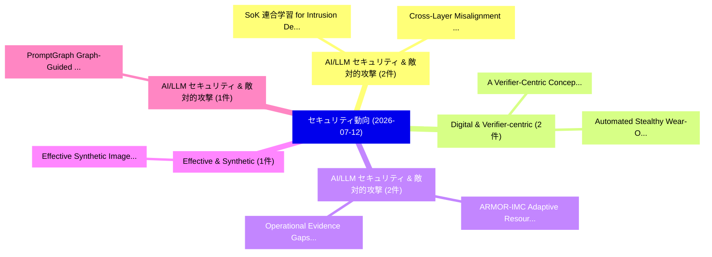

# 📅 02_daily: 日次エグゼクティブサマリー報告書 (2026-07-12)

**集計日時**: 2026-10-02 23:06:19 UTC  
**対象日付**: 2026-07-12  
**本日収集論文数**: 11 件  

---

## 💡 主要セキュリティ動向・脅威インサイト (Executive Insights)

本日の収集論文（計 11 件）において、以下の重点セキュリティ領域で活発な研究動向が確認されました：
- **AI/LLM セキュリティ & 敵対的攻撃** (2 件): 注目論文として 「Cross-Layer Misalignment Detec...」、「SoK: 連合学習 for Intrusion Detect...」 等が発表され、実務防御および攻撃検証の進展が見られます。
- **Digital & Verifier-centric** (2 件): 注目論文として 「A Verifier-Centric Conceptual ...」、「Automated Stealthy Wear-Out At...」 等が発表され、実務防御および攻撃検証の進展が見られます。
- **AI/LLM セキュリティ & 敵対的攻撃** (2 件): 注目論文として 「ARMOR-IMC: Adaptive Resource M...」、「Operational Evidence Gaps for ...」 等が発表され、実務防御および攻撃検証の進展が見られます。
- **Effective & Synthetic** (1 件): 注目論文として 「Effective Synthetic Image Dete...」 等が発表され、実務防御および攻撃検証の進展が見られます。
- **AI/LLM セキュリティ & 敵対的攻撃** (1 件): 注目論文として 「PromptGraph: Graph-Guided Prom...」 等が発表され、実務防御および攻撃検証の進展が見られます。

### 🗺️ 技術・脅威トピックマインドマップ

---

## 📌 日次セキュリティ論文一覧 (日本語表形式)

| No | arXiv ID | 論文タイトル (日本語訳) | 重要キーワード | 構造化エグゼクティブ要約 (背景・提案・影響) | 脅威分類 | 詳細リンク |
|---|---|---|---|---|---|---|
| 1 | `2607.10534v1` | [Cross-Layer Misalignment Detection in Agent Skills: A Progressive Loading-Aware Contrastive Learning Approach（セキュリティ分析論文）](../../okf/papers/2026-07-12/2607.10534.md) | `Layer Misalignment Detection`, `Agent Skills`, `Progressive Loading` | 【提案】概要 (Overview & Key Finding) 本論文「Cross-Layer Misalignment Detection in Agent Skills: A P...。実証評価により経営層・セキュリティ管理者向け推奨アクション (E... | `arXiv` | [arXiv](https://arxiv.org/abs/2607.10534v1) &#124; [OKF](../../okf/papers/2026-07-12/2607.10534.md) |
| 2 | `2607.10695v1` | [Effective Synthetic Image Detection via Noise Residual Clustering（セキュリティ分析論文）](../../okf/papers/2026-07-12/2607.10695.md) | `Effective Synthetic Image Detection`, `Noise Residual Clustering`, `Caihui Yan` | 【提案】概要 (Overview & Key Finding) 本論文「Effective Synthetic Image Detection via Noise Residual ...。実証評価により経営層・セキュリティ管理者向け推奨アクション (E... | `arXiv` | [arXiv](https://arxiv.org/abs/2607.10695v1) &#124; [OKF](../../okf/papers/2026-07-12/2607.10695.md) |
| 3 | `2607.10709v1` | [PromptGraph: Graph-Guided Prompt Sanitization for Balancing Privacy and Utility in LLM Inference（セキュリティ分析論文）](../../okf/papers/2026-07-12/2607.10709.md) | `Guided Prompt Sanitization`, `Balancing Privacy`, `Graph-Guided Prompt` | 【提案】概要 (Overview & Key Finding) 本論文「PromptGraph: Graph-Guided Prompt Sanitization for Balan...。実証評価により経営層・セキュリティ管理者向け推奨アクション (E... | `arXiv` | [arXiv](https://arxiv.org/abs/2607.10709v1) &#124; [OKF](../../okf/papers/2026-07-12/2607.10709.md) |
| 4 | `2607.10712v1` | [Distributed Denial of Science: How Indirect Data Poisoning of AI Systems Can Industrialize Scientific Fraud（セキュリティ分析論文）](../../okf/papers/2026-07-12/2607.10712.md) | `Systems Can Industrialize Scientific Fraud`, `Distributed Denial`, `Atoosa Kasirzadeh` | 【提案】概要 (Overview & Key Finding) 本論文「Distributed Denial of Science: How Indirect Data Poison...。実証評価により経営層・セキュリティ管理者向け推奨アクション (E... | `arXiv` | [arXiv](https://arxiv.org/abs/2607.10712v1) &#124; [OKF](../../okf/papers/2026-07-12/2607.10712.md) |
| 5 | `2607.10747v2` | [A Verifier-Centric Conceptual Model for Digital Credential Ecosystems（セキュリティ分析論文）](../../okf/papers/2026-07-12/2607.10747.md) | `Centric Conceptual Model`, `Digital Credential Ecosystems`, `Verifier-Centric Conceptual` | 【提案】概要 (Overview & Key Finding) 本論文「A Verifier-Centric Conceptual Model for Digital Credent...。実証評価により経営層・セキュリティ管理者向け推奨アクション (E... | `arXiv` | [arXiv](https://arxiv.org/abs/2607.10747v2) &#124; [OKF](../../okf/papers/2026-07-12/2607.10747.md) |
| 6 | `2607.10794v1` | [Can Watermarking Techniques Help Prevent LLM Model Stealing?（セキュリティ分析論文）](../../okf/papers/2026-07-12/2607.10794.md) | `Can Watermarking Techniques Help Prevent`, `Model Stealing`, `Elette Boyle` | 【提案】### (日本語題名: Can Watermarking Techniques Help Prevent LLM Model Stealing?（セキュリティ分析論文）)  ...。実証評価により経営層・セキュリティ管理者向け推奨アクション (E... | `arXiv` | [arXiv](https://arxiv.org/abs/2607.10794v1) &#124; [OKF](../../okf/papers/2026-07-12/2607.10794.md) |
| 7 | `2607.10830v1` | [Automated Stealthy Wear-Out Attack on Digital Twins With Deep Reinforcement Learning（セキュリティ分析論文）](../../okf/papers/2026-07-12/2607.10830.md) | `Automated Stealthy Wear`, `Wear-Out Attack`, `Joshua Haworth` | 【提案】概要 (Overview & Key Finding) 本論文「Automated Stealthy Wear-Out Attack on Digital Twins Wit...。実証評価により経営層・セキュリティ管理者向け推奨アクション (E... | `arXiv` | [arXiv](https://arxiv.org/abs/2607.10830v1) &#124; [OKF](../../okf/papers/2026-07-12/2607.10830.md) |
| 8 | `2607.10914v1` | [SoK: 連合学習 for Intrusion Detection in Vehicular Networks](../../okf/papers/2026-07-12/2607.10914.md) | `Intrusion Detection`, `Vehicular Networks`, `Federated Learning` | 【提案】概要 (Overview & Key Finding) 本論文「SoK: 連合学習 for Intrusion Detection in Vehicular Networks...。実証評価により経営層・セキュリティ管理者向け推奨アクション (E... | `arXiv` | [arXiv](https://arxiv.org/abs/2607.10914v1) &#124; [OKF](../../okf/papers/2026-07-12/2607.10914.md) |
| 9 | `2607.10938v1` | [ARMOR-IMC: Adaptive Resource Mapping for Operational Robustness via Secure In-Memory Computing（セキュリティ分析論文）](../../okf/papers/2026-07-12/2607.10938.md) | `Adaptive Resource Mapping`, `Operational Robustness`, `Memory Computing` | 【提案】概要 (Overview & Key Finding) 本論文「ARMOR-IMC: Adaptive Resource Mapping for Operational Ro...。実証評価により経営層・セキュリティ管理者向け推奨アクション (E... | `arXiv` | [arXiv](https://arxiv.org/abs/2607.10938v1) &#124; [OKF](../../okf/papers/2026-07-12/2607.10938.md) |
| 10 | `2607.13075v1` | [The Entanglement Wall: Activation-Space Probes as Risk Detectors, Not Context Adjudicators（セキュリティ分析論文）](../../okf/papers/2026-07-12/2607.13075.md) | `Space Probes`, `Risk Detectors`, `Activation-Space Probes` | 【提案】背景とセキュリティ上の課題 (Background & Problem) 本研究はサイバー脅威環境におけるセキュリティ構造・脆弱性の検証を目的としています。(主要検出項目: ...。実証評価により経営層・セキュリティ管理者向け推奨アクション (E... | `arXiv` | [arXiv](https://arxiv.org/abs/2607.13075v1) &#124; [OKF](../../okf/papers/2026-07-12/2607.13075.md) |
| 11 | `2607.13078v1` | [Operational Evidence Gaps for LLMs in Fraud Detection and Trust-and-Safety Workflows（セキュリティ分析論文）](../../okf/papers/2026-07-12/2607.13078.md) | `Operational Evidence Gaps`, `Fraud Detection`, `Safety Workflows` | 【提案】概要 (Overview & Key Finding) 本論文「Operational Evidence Gaps for LLMs in Fraud Detection a...。実証評価により経営層・セキュリティ管理者向け推奨アクション (E... | `arXiv` | [arXiv](https://arxiv.org/abs/2607.13078v1) &#124; [OKF](../../okf/papers/2026-07-12/2607.13078.md) |

