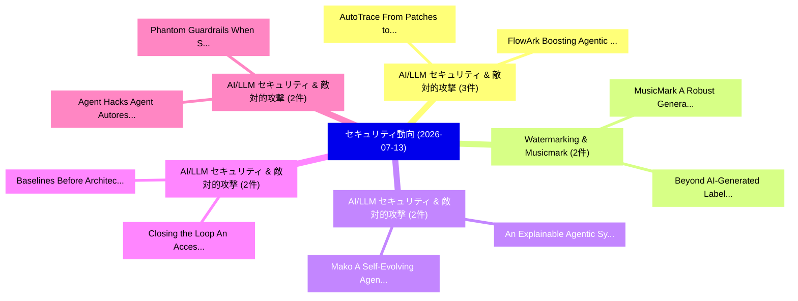

# 📅 02_daily: 日次エグゼクティブサマリー報告書 (2026-07-13)

**集計日時**: 2026-10-02 23:06:19 UTC  
**対象日付**: 2026-07-13  
**本日収集論文数**: 31 件  

---

## 💡 主要セキュリティ動向・脅威インサイト (Executive Insights)

本日の収集論文（計 31 件）において、以下の重点セキュリティ領域で活発な研究動向が確認されました：
- **AI/LLM セキュリティ & 敵対的攻撃** (3 件): 注目論文として 「FlowArk: Boosting Agentic Data...」、「AutoTrace: From Patches to Tri...」 等が発表され、実務防御および攻撃検証の進展が見られます。
- **Watermarking & Musicmark** (2 件): 注目論文として 「MusicMark: A Robust Generative...」、「Beyond AI-Generated Labels: Wa...」 等が発表され、実務防御および攻撃検証の進展が見られます。
- **AI/LLM セキュリティ & 敵対的攻撃** (2 件): 注目論文として 「Mako: A Self-Evolving Agentic ...」、「An Explainable Agentic System ...」 等が発表され、実務防御および攻撃検証の進展が見られます。
- **AI/LLM セキュリティ & 敵対的攻撃** (2 件): 注目論文として 「Closing the Loop: An Access-Co...」、「Baselines Before Architecture:...」 等が発表され、実務防御および攻撃検証の進展が見られます。
- **AI/LLM セキュリティ & 敵対的攻撃** (2 件): 注目論文として 「Agent Hacks Agent: Autoresearc...」、「Phantom Guardrails: When Self-...」 等が発表され、実務防御および攻撃検証の進展が見られます。

### 🗺️ 技術・脅威トピックマインドマップ

---

## 📌 日次セキュリティ論文一覧 (日本語表形式)

| No | arXiv ID | 論文タイトル (日本語訳) | 重要キーワード | 構造化エグゼクティブ要約 (背景・提案・影響) | 脅威分類 | 詳細リンク |
|---|---|---|---|---|---|---|
| 1 | `2607.11086v1` | [Rethinking MCP Security: A Large-Scale Study of Runtime MCP Servers and Security Scanner Reliability（セキュリティ分析論文）](../../okf/papers/2026-07-13/2607.11086.md) | `Security Scanner Reliability`, `Pei Chen`, `Mengying Wu` | 【提案】概要 (Overview & Key Finding) 本論文「Rethinking MCP Security: A Large-Scale Study of Runtime...。実証評価により経営層・セキュリティ管理者向け推奨アクション (E... | `arXiv` | [arXiv](https://arxiv.org/abs/2607.11086v1) &#124; [OKF](../../okf/papers/2026-07-13/2607.11086.md) |
| 2 | `2607.11095v1` | [When cheap gradients fail: the measurement cost of attacking quantum classifiers（セキュリティ分析論文）](../../okf/papers/2026-07-13/2607.11095.md) | `Bacui Li`, `Chandra Thapa`, `Tansu Alpcan` | 【提案】概要 (Overview & Key Finding) 本論文「When cheap gradients fail: the measurement cost of atta...。実証評価により経営層・セキュリティ管理者向け推奨アクション (E... | `arXiv` | [arXiv](https://arxiv.org/abs/2607.11095v1) &#124; [OKF](../../okf/papers/2026-07-13/2607.11095.md) |
| 3 | `2607.11117v1` | [MusicMark: A Robust Generative Watermarking Framework for Music Generation（セキュリティ分析論文）](../../okf/papers/2026-07-13/2607.11117.md) | `Music Generation`, `Seohwan Yun`, `Jeeyoung Yun` | 【提案】概要 (Overview & Key Finding) 本論文「MusicMark: A Robust Generative Watermarking Framework f...。実証評価により経営層・セキュリティ管理者向け推奨アクション (E... | `arXiv` | [arXiv](https://arxiv.org/abs/2607.11117v1) &#124; [OKF](../../okf/papers/2026-07-13/2607.11117.md) |
| 4 | `2607.11151v1` | [AMT-X: Phase-Structured Multi-Turn Red-Teaming with Checklist-Gated Evaluation（セキュリティ分析論文）](../../okf/papers/2026-07-13/2607.11151.md) | `Structured Multi`, `Turn Red`, `Phase-Structured Multi` | 【提案】概要 (Overview & Key Finding) 本論文「AMT-X: Phase-Structured Multi-Turn Red-Teaming with Che...。実証評価により経営層・セキュリティ管理者向け推奨アクション (E... | `arXiv` | [arXiv](https://arxiv.org/abs/2607.11151v1) &#124; [OKF](../../okf/papers/2026-07-13/2607.11151.md) |
| 5 | `2607.11288v1` | [Mako: A Self-Evolving Agentic Operating System (SE-AOS) for Autonomous Web Exploitation（セキュリティ分析論文）](../../okf/papers/2026-07-13/2607.11288.md) | `Evolving Agentic Operating System`, `Autonomous Web Exploitation`, `Self-Evolving Agentic` | 【提案】概要 (Overview & Key Finding) 本論文「Mako: A Self-Evolving Agentic Operating System (SE-AOS)...。実証評価により経営層・セキュリティ管理者向け推奨アクション (E... | `arXiv` | [arXiv](https://arxiv.org/abs/2607.11288v1) &#124; [OKF](../../okf/papers/2026-07-13/2607.11288.md) |
| 6 | `2607.11308v1` | [FlowArk: Boosting Agentic Data-flow Analysis for Android Apps via Context-Aware Knowledge Reuse（セキュリティ分析論文）](../../okf/papers/2026-07-13/2607.11308.md) | `Boosting Agentic Data`, `Aware Knowledge Reuse`, `Android Apps` | 【提案】概要 (Overview & Key Finding) 本論文「FlowArk: Boosting Agentic Data-flow Analysis for Androi...。実証評価により経営層・セキュリティ管理者向け推奨アクション (E... | `arXiv` | [arXiv](https://arxiv.org/abs/2607.11308v1) &#124; [OKF](../../okf/papers/2026-07-13/2607.11308.md) |
| 7 | `2607.11398v1` | [GNSS Spoofing Detection in TDD Networks: A 3GPP Standards-Based Security Framework（セキュリティ分析論文）](../../okf/papers/2026-07-13/2607.11398.md) | `Spoofing Detection`, `Standards-Based Security`, `Ravi Kant Sharma` | 【提案】概要 (Overview & Key Finding) 本論文「GNSS Spoofing Detection in TDD Networks: A 3GPP Standar...。実証評価により経営層・セキュリティ管理者向け推奨アクション (E... | `arXiv` | [arXiv](https://arxiv.org/abs/2607.11398v1) &#124; [OKF](../../okf/papers/2026-07-13/2607.11398.md) |
| 8 | `2607.11466v2` | [Prezta: Provable Remote Execution of Zero-Trust Authorization using SNARKs（セキュリティ分析論文）](../../okf/papers/2026-07-13/2607.11466.md) | `Provable Remote Execution`, `Trust Authorization`, `Zero-Trust Authorization` | 【提案】概要 (Overview & Key Finding) 本論文「Prezta: Provable Remote Execution of ゼロトラスト Authorizati...。実証評価により経営層・セキュリティ管理者向け推奨アクション (E... | `arXiv` | [arXiv](https://arxiv.org/abs/2607.11466v2) &#124; [OKF](../../okf/papers/2026-07-13/2607.11466.md) |
| 9 | `2607.11472v1` | [LLM-Guided Program Evolution for Targeted Black-Box Attacks on Perceptual Hash Algorithms（セキュリティ分析論文）](../../okf/papers/2026-07-13/2607.11472.md) | `Guided Program Evolution`, `Perceptual Hash Algorithms`, `LLM-Guided Program` | 【提案】概要 (Overview & Key Finding) 本論文「LLM-Guided Program Evolution for Targeted Black-Box Att...。実証評価により経営層・セキュリティ管理者向け推奨アクション (E... | `arXiv` | [arXiv](https://arxiv.org/abs/2607.11472v1) &#124; [OKF](../../okf/papers/2026-07-13/2607.11472.md) |
| 10 | `2607.11496v1` | [Time Is Money: Incentivized Causal Transaction Ordering（セキュリティ分析論文）](../../okf/papers/2026-07-13/2607.11496.md) | `Incentivized Causal Transaction Ordering`, `Hongyin Chen`, `Xu Zheng` | 【提案】概要 (Overview & Key Finding) 本論文「Time Is Money: Incentivized Causal Transaction Ordering...。実証評価により経営層・セキュリティ管理者向け推奨アクション (E... | `arXiv` | [arXiv](https://arxiv.org/abs/2607.11496v1) &#124; [OKF](../../okf/papers/2026-07-13/2607.11496.md) |
| 11 | `2607.11517v1` | [Graph-Based Structural Evaluation of LLM-Translated Adversary Emulation Procedures（セキュリティ分析論文）](../../okf/papers/2026-07-13/2607.11517.md) | `Translated Adversary Emulation Procedures`, `Graph-Based Structural`, `LLM-Translated Adversary` | 【提案】概要 (Overview & Key Finding) 本論文「Graph-Based Structural Evaluation of LLM-Translated Adv...。実証評価により経営層・セキュリティ管理者向け推奨アクション (E... | `arXiv` | [arXiv](https://arxiv.org/abs/2607.11517v1) &#124; [OKF](../../okf/papers/2026-07-13/2607.11517.md) |
| 12 | `2607.11563v1` | [Linux disk encryption and self-encrypting drives -- A case study on Opal2 drives security（セキュリティ分析論文）](../../okf/papers/2026-07-13/2607.11563.md) | `self-encrypting drives`, `Raw Meta`, `Executive Summary` | 【提案】概要 (Overview & Key Finding) 本論文「Linux disk encryption and self-encrypting drives -- A c...。実証評価により経営層・セキュリティ管理者向け推奨アクション (E... | `arXiv` | [arXiv](https://arxiv.org/abs/2607.11563v1) &#124; [OKF](../../okf/papers/2026-07-13/2607.11563.md) |
| 13 | `2607.11601v1` | [Cardano's Voltaire Governance: Complete Specification and Research Program（セキュリティ分析論文）](../../okf/papers/2026-07-13/2607.11601.md) | `Voltaire Governance`, `Complete Specification`, `Research Program` | 【提案】概要 (Overview & Key Finding) 本論文「Cardano's Voltaire Governance: Complete Specification a...。実証評価により経営層・セキュリティ管理者向け推奨アクション (E... | `arXiv` | [arXiv](https://arxiv.org/abs/2607.11601v1) &#124; [OKF](../../okf/papers/2026-07-13/2607.11601.md) |
| 14 | `2607.11649v1` | [Closing the Loop: An Access-Control Architecture for Automated, Anomaly-Driven Network Revocation in IoT Deployments（セキュリティ分析論文）](../../okf/papers/2026-07-13/2607.11649.md) | `Driven Network Revocation`, `Control Architecture`, `Access-Control Architecture` | 【提案】概要 (Overview & Key Finding) 本論文「Closing the Loop: An Access-Control Architecture for Au...。実証評価により経営層・セキュリティ管理者向け推奨アクション (E... | `arXiv` | [arXiv](https://arxiv.org/abs/2607.11649v1) &#124; [OKF](../../okf/papers/2026-07-13/2607.11649.md) |
| 15 | `2607.11698v1` | [Agent Hacks Agent: Autoresearch for Production-Agent Red-Teaming（セキュリティ分析論文）](../../okf/papers/2026-07-13/2607.11698.md) | `Agent Hacks Agent`, `Agent Red`, `Production-Agent Red` | 【提案】概要 (Overview & Key Finding) 本論文「Agent Hacks Agent: Autoresearch for Production-Agent Re...。実証評価により経営層・セキュリティ管理者向け推奨アクション (E... | `arXiv` | [arXiv](https://arxiv.org/abs/2607.11698v1) &#124; [OKF](../../okf/papers/2026-07-13/2607.11698.md) |
| 16 | `2607.11707v2` | [An Explainable Agentic System for Conversational Scams with Summary-Based Memoryの検出](../../okf/papers/2026-07-13/2607.11707.md) | `Conversational Scams`, `Based Memory`, `Summary-Based Memory` | 【提案】概要 (Overview & Key Finding) 本論文「An Explainable Agentic System for Conversational Scams ...。実証評価により経営層・セキュリティ管理者向け推奨アクション (E... | `arXiv` | [arXiv](https://arxiv.org/abs/2607.11707v2) &#124; [OKF](../../okf/papers/2026-07-13/2607.11707.md) |
| 17 | `2607.11751v1` | [When Local Monitors Miss Compositional Harm: Diagnosing Distributed Backdoors in Multi-Agent Systems（セキュリティ分析論文）](../../okf/papers/2026-07-13/2607.11751.md) | `Diagnosing Distributed Backdoors`, `Agent Systems`, `Multi-Agent Systems` | 【提案】概要 (Overview & Key Finding) 本論文「When Local Monitors Miss Compositional Harm: Diagnosing...。実証評価により経営層・セキュリティ管理者向け推奨アクション (E... | `arXiv` | [arXiv](https://arxiv.org/abs/2607.11751v1) &#124; [OKF](../../okf/papers/2026-07-13/2607.11751.md) |
| 18 | `2607.12052v1` | [Representation and Reference Selection in Training-Free Synthetic Image Attribution（セキュリティ分析論文）](../../okf/papers/2026-07-13/2607.12052.md) | `Free Synthetic Image Attribution`, `Reference Selection`, `Training-Free Synthetic` | 【提案】概要 (Overview & Key Finding) 本論文「Representation and Reference Selection in Training-Free...。実証評価により経営層・セキュリティ管理者向け推奨アクション (E... | `arXiv` | [arXiv](https://arxiv.org/abs/2607.12052v1) &#124; [OKF](../../okf/papers/2026-07-13/2607.12052.md) |
| 19 | `2607.12058v1` | [AutoTrace: From Patches to Triggers via Agentic Interprocedural Exploration（セキュリティ分析論文）](../../okf/papers/2026-07-13/2607.12058.md) | `Agentic Interprocedural Exploration`, `Arastoo Zibaeirad`, `Marco Vieira` | 【提案】概要 (Overview & Key Finding) 本論文「AutoTrace: From Patches to Triggers via Agentic Interpr...。実証評価により経営層・セキュリティ管理者向け推奨アクション (E... | `arXiv` | [arXiv](https://arxiv.org/abs/2607.12058v1) &#124; [OKF](../../okf/papers/2026-07-13/2607.12058.md) |
| 20 | `2607.12089v1` | [Cross-Cutting Security LLM-Generated Code via Metamorphic Testing and Association Rule Miningの分析](../../okf/papers/2026-07-13/2607.12089.md) | `Cross-Cutting Security`, `Generated Code`, `Metamorphic Testing` | 【提案】概要 (Overview & Key Finding) 本論文「Cross-Cutting Security LLM-Generated Code via Metamorph...。実証評価により経営層・セキュリティ管理者向け推奨アクション (E... | `arXiv` | [arXiv](https://arxiv.org/abs/2607.12089v1) &#124; [OKF](../../okf/papers/2026-07-13/2607.12089.md) |
| 21 | `2607.12148v1` | [MindReader: Using LLMs to Encourage Memorable and Secure Password Replacement（セキュリティ分析論文）](../../okf/papers/2026-07-13/2607.12148.md) | `Secure Password Replacement`, `Encourage Memorable`, `Anna Gerchanovsky` | 【提案】概要 (Overview & Key Finding) 本論文「MindReader: Using LLMs to Encourage Memorable and Secur...。実証評価により経営層・セキュリティ管理者向け推奨アクション (E... | `arXiv` | [arXiv](https://arxiv.org/abs/2607.12148v1) &#124; [OKF](../../okf/papers/2026-07-13/2607.12148.md) |
| 22 | `2607.12174v1` | [Anticipating Decoder Side-channel Attacks in Fault-tolerant Quantum Computers（セキュリティ分析論文）](../../okf/papers/2026-07-13/2607.12174.md) | `Anticipating Decoder Side`, `Quantum Computers`, `Side-channel Attacks` | 【提案】概要 (Overview & Key Finding) 本論文「Anticipating Decoder サイドチャネル攻撃 Attacks in Fault-toleran...。実証評価により経営層・セキュリティ管理者向け推奨アクション (E... | `arXiv` | [arXiv](https://arxiv.org/abs/2607.12174v1) &#124; [OKF](../../okf/papers/2026-07-13/2607.12174.md) |
| 23 | `2607.12199v1` | [MTD-Playground: An Attacker-Aware Evaluation Framework for Network Moving Target Defense（セキュリティ分析論文）](../../okf/papers/2026-07-13/2607.12199.md) | `Network Moving Target Defense`, `Mohoshin Ara Tahera`, `Padam Jung Thapa` | 【提案】概要 (Overview & Key Finding) 本論文「MTD-Playground: An Attacker-Aware Evaluation Framework ...。実証評価により経営層・セキュリティ管理者向け推奨アクション (E... | `arXiv` | [arXiv](https://arxiv.org/abs/2607.12199v1) &#124; [OKF](../../okf/papers/2026-07-13/2607.12199.md) |
| 24 | `2607.12200v1` | [A Threshold Exceedance Framework for CBRN Uplift Evaluation in Frontier Language Models（セキュリティ分析論文）](../../okf/papers/2026-07-13/2607.12200.md) | `Frontier Language Models`, `Gary Anthony Ackerman`, `Rahul Gupta` | 【提案】概要 (Overview & Key Finding) 本論文「A Threshold Exceedance Framework for CBRN Uplift Evalua...。実証評価により経営層・セキュリティ管理者向け推奨アクション (E... | `arXiv` | [arXiv](https://arxiv.org/abs/2607.12200v1) &#124; [OKF](../../okf/papers/2026-07-13/2607.12200.md) |
| 25 | `2607.12203v1` | [Explaining Intrusion Alert Decisions of Deep Learning-based Network Intrusion Detection Systems for Security Analysts（セキュリティ分析論文）](../../okf/papers/2026-07-13/2607.12203.md) | `Explaining Intrusion Alert Decisions`, `Network Intrusion Detection Systems`, `Deep Learning` | 【提案】概要 (Overview & Key Finding) 本論文「Explaining Intrusion Alert Decisions of Deep Learning-b...。実証評価により経営層・セキュリティ管理者向け推奨アクション (E... | `arXiv` | [arXiv](https://arxiv.org/abs/2607.12203v1) &#124; [OKF](../../okf/papers/2026-07-13/2607.12203.md) |
| 26 | `2607.13081v1` | [SingGuard-NSFA: Extensible Guardrails for Agentic AI via Generative Reasoning and Real-Time Classification（セキュリティ分析論文）](../../okf/papers/2026-07-13/2607.13081.md) | `Extensible Guardrails`, `Generative Reasoning`, `Time Classification` | 【提案】概要 (Overview & Key Finding) 本論文「SingGuard-NSFA: Extensible Guardrails for Agentic AI vi...。実証評価により経営層・セキュリティ管理者向け推奨アクション (E... | `arXiv` | [arXiv](https://arxiv.org/abs/2607.13081v1) &#124; [OKF](../../okf/papers/2026-07-13/2607.13081.md) |
| 27 | `2607.13082v1` | [Beyond AI-Generated Labels: Watermarking, Co-Creation, and Conflation of AI-Generation with Disinformation（セキュリティ分析論文）](../../okf/papers/2026-07-13/2607.13082.md) | `Generated Labels`, `AI-Generated Labels`, `Federico Germani` | 【提案】概要 (Overview & Key Finding) 本論文「Beyond AI-Generated Labels: Watermarking, Co-Creation, ...。実証評価により経営層・セキュリティ管理者向け推奨アクション (E... | `arXiv` | [arXiv](https://arxiv.org/abs/2607.13082v1) &#124; [OKF](../../okf/papers/2026-07-13/2607.13082.md) |
| 28 | `2607.13083v1` | [Phantom Guardrails: When Self-Improving Agent Harnesses Fix Failures That Never Happened（セキュリティ分析論文）](../../okf/papers/2026-07-13/2607.13083.md) | `Phantom Guardrails`, `Self-Improving Agent`, `Su Wang` | 【提案】背景とセキュリティ上の課題 (Background & Problem) 本研究はサイバー脅威環境におけるセキュリティ構造・脆弱性の検証を目的としています。(主要検出項目: ...。実証評価により経営層・セキュリティ管理者向け推奨アクション (E... | `arXiv` | [arXiv](https://arxiv.org/abs/2607.13083v1) &#124; [OKF](../../okf/papers/2026-07-13/2607.13083.md) |
| 29 | `2607.13085v1` | [Baselines Before Architecture: Evaluating Coding Agents for Autonomous Penetration Testing（セキュリティ分析論文）](../../okf/papers/2026-07-13/2607.13085.md) | `Evaluating Coding Agents`, `Autonomous Penetration Testing`, `Evaluating Coding Ag` | 【提案】概要 (Overview & Key Finding) 本論文「Baselines Before Architecture: Evaluating Coding Agents...。実証評価により経営層・セキュリティ管理者向け推奨アクション (E... | `arXiv` | [arXiv](https://arxiv.org/abs/2607.13085v1) &#124; [OKF](../../okf/papers/2026-07-13/2607.13085.md) |
| 30 | `2607.13087v1` | [GDM AI Control Roadmap（セキュリティ分析論文）](../../okf/papers/2026-07-13/2607.13087.md) | `Control Roadmap`, `Mary Phuong`, `Erik Jenner` | 【提案】概要 (Overview & Key Finding) 本論文「GDM AI Control Roadmap（セキュリティ分析論文）」（原題: GDM AI Control ...。実証評価により経営層・セキュリティ管理者向け推奨アクション (E... | `arXiv` | [arXiv](https://arxiv.org/abs/2607.13087v1) &#124; [OKF](../../okf/papers/2026-07-13/2607.13087.md) |
| 31 | `2607.13088v1` | [LLMs in the Wild: Privacy and Security Challenges at the Edgeのセキュリティ強化](../../okf/papers/2026-07-13/2607.13088.md) | `Security Challenges`, `Yi Huang`, `Mingchen Li` | 【提案】概要 (Overview & Key Finding) 本論文「LLMs in the Wild: Privacy and Security Challenges at th...。実証評価により経営層・セキュリティ管理者向け推奨アクション (E... | `arXiv` | [arXiv](https://arxiv.org/abs/2607.13088v1) &#124; [OKF](../../okf/papers/2026-07-13/2607.13088.md) |

