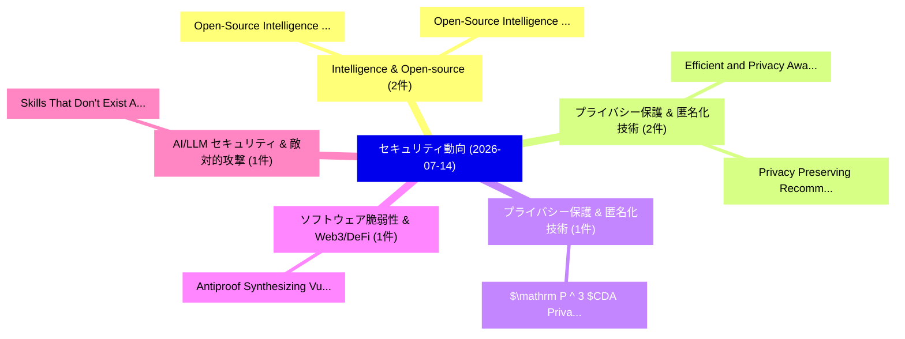

# 📅 02_daily: 日次エグゼクティブサマリー報告書 (2026-07-14)

**集計日時**: 2026-10-02 23:06:19 UTC  
**対象日付**: 2026-07-14  
**本日収集論文数**: 32 件  

---

## 💡 主要セキュリティ動向・脅威インサイト (Executive Insights)

本日の収集論文（計 32 件）において、以下の重点セキュリティ領域で活発な研究動向が確認されました：
- **Intelligence & Open-source** (2 件): 注目論文として 「Open-Source Intelligence and M...」、「Open-Source Intelligence for C...」 等が発表され、実務防御および攻撃検証の進展が見られます。
- **プライバシー保護 & 匿名化技術** (2 件): 注目論文として 「Efficient and Privacy Aware Ed...」、「Privacy Preserving Recommender...」 等が発表され、実務防御および攻撃検証の進展が見られます。
- **プライバシー保護 & 匿名化技術** (1 件): 注目論文として 「$\mathrm{P}^{3}$CDA: Privacy-P...」 等が発表され、実務防御および攻撃検証の進展が見られます。
- **ソフトウェア脆弱性 & Web3/DeFi** (1 件): 注目論文として 「Antiproof: Synthesizing Vulner...」 等が発表され、実務防御および攻撃検証の進展が見られます。
- **AI/LLM セキュリティ & 敵対的攻撃** (1 件): 注目論文として 「Skills That Don't Exist: A Lar...」 等が発表され、実務防御および攻撃検証の進展が見られます。

### 🗺️ 技術・脅威トピックマインドマップ

---

## 📌 日次セキュリティ論文一覧 (日本語表形式)

| No | arXiv ID | 論文タイトル (日本語訳) | 重要キーワード | 構造化エグゼクティブ要約 (背景・提案・影響) | 脅威分類 | 詳細リンク |
|---|---|---|---|---|---|---|
| 1 | `2607.12288v1` | [$\mathrm{P}^{3}$CDA: Privacy-Preserving and Provably Secure Cross Domain Authentication Scheme for Internet of Drones（セキュリティ分析論文）](../../okf/papers/2026-07-14/2607.12288.md) | `Provably Secure Cross Domain Authentication Scheme`, `Chengqi Hou`, `Beibei Li` | 【提案】概要 (Overview & Key Finding) 本論文「$\mathrm{P}^{3}$CDA: Privacy-Preserving and Provably Se...。実証評価により経営層・セキュリティ管理者向け推奨アクション (E... | `arXiv` | [arXiv](https://arxiv.org/abs/2607.12288v1) &#124; [OKF](../../okf/papers/2026-07-14/2607.12288.md) |
| 2 | `2607.12316v1` | [Antiproof: Synthesizing Vulnerability Detectors and Proofs of Exploitability（セキュリティ分析論文）](../../okf/papers/2026-07-14/2607.12316.md) | `Synthesizing Vulnerability Detectors`, `Raluca Ada Popa`, `Alon Shakevsky` | 【提案】概要 (Overview & Key Finding) 本論文「Antiproof: Synthesizing 脆弱性 Detectors and Proofs of Exp...。実証評価により経営層・セキュリティ管理者向け推奨アクション (E... | `arXiv` | [arXiv](https://arxiv.org/abs/2607.12316v1) &#124; [OKF](../../okf/papers/2026-07-14/2607.12316.md) |
| 3 | `2607.12340v1` | [Skills That Don't Exist: A Large-Scale Study of Hallucinated Skill Recommendation in LLMエージェント](../../okf/papers/2026-07-14/2607.12340.md) | `Hallucinated Skill Recommendation`, `Weifeng Yuan`, `Wenbo Guo` | 【提案】概要 (Overview & Key Finding) 本論文「Skills That Don't Exist: A Large-Scale Study of Halluci...。実証評価により経営層・セキュリティ管理者向け推奨アクション (E... | `arXiv` | [arXiv](https://arxiv.org/abs/2607.12340v1) &#124; [OKF](../../okf/papers/2026-07-14/2607.12340.md) |
| 4 | `2607.12341v1` | [Policy-Conditioned Constrained Decoding for Column-Level Access Control in Text-to-SQL（セキュリティ分析論文）](../../okf/papers/2026-07-14/2607.12341.md) | `Conditioned Constrained Decoding`, `Level Access Control`, `Policy-Conditioned Constrained` | 【提案】概要 (Overview & Key Finding) 本論文「Policy-Conditioned Constrained Decoding for Column-Leve...。実証評価により経営層・セキュリティ管理者向け推奨アクション (E... | `arXiv` | [arXiv](https://arxiv.org/abs/2607.12341v1) &#124; [OKF](../../okf/papers/2026-07-14/2607.12341.md) |
| 5 | `2607.12428v2` | [Trust but Verify? Uncovering the Security Debt of Autonomous Coding Agents（セキュリティ分析論文）](../../okf/papers/2026-07-14/2607.12428.md) | `Autonomous Coding Agents`, `Security Debt`, `Nazmus Sakib` | 【提案】Uncovering the Security Debt of Autonomous Coding Agents ### (日本語題名: Trust but Verify?。実証評価により経営層・セキュリティ管理者向け推奨アクション (Execu... | `arXiv` | [arXiv](https://arxiv.org/abs/2607.12428v2) &#124; [OKF](../../okf/papers/2026-07-14/2607.12428.md) |
| 6 | `2607.12504v1` | [On the Security Implications of PQC in TLS: Handshake Exhaustion and IDS Degradation（セキュリティ分析論文）](../../okf/papers/2026-07-14/2607.12504.md) | `Security Implications`, `Handshake Exhaustion`, `Fa Lee` | 【提案】概要 (Overview & Key Finding) 本論文「On the Security Implications of PQC in TLS: Handshake E...。実証評価により経営層・セキュリティ管理者向け推奨アクション (E... | `arXiv` | [arXiv](https://arxiv.org/abs/2607.12504v1) &#124; [OKF](../../okf/papers/2026-07-14/2607.12504.md) |
| 7 | `2607.12507v1` | [When Binaries Talk Back: Representation-Confusion Attacks on LLM-Assisted Reverse Engineering（セキュリティ分析論文）](../../okf/papers/2026-07-14/2607.12507.md) | `Assisted Reverse Engineering`, `Confusion Attacks`, `Representation-Confusion Attacks` | 【提案】概要 (Overview & Key Finding) 本論文「When Binaries Talk Back: Representation-Confusion Attac...。実証評価により経営層・セキュリティ管理者向け推奨アクション (E... | `arXiv` | [arXiv](https://arxiv.org/abs/2607.12507v1) &#124; [OKF](../../okf/papers/2026-07-14/2607.12507.md) |
| 8 | `2607.12517v1` | [Open-Source Intelligence and Music Information Retrieval for Geographic Attribution of Musical Affect and the Ecological Limits of Population Inference（セキュリティ分析論文）](../../okf/papers/2026-07-14/2607.12517.md) | `Music Information Retrieval`, `Source Intelligence`, `Geographic Attribution` | 【提案】概要 (Overview & Key Finding) 本論文「Open-Source Intelligence and Music Information Retrieva...。実証評価により経営層・セキュリティ管理者向け推奨アクション (E... | `arXiv` | [arXiv](https://arxiv.org/abs/2607.12517v1) &#124; [OKF](../../okf/papers/2026-07-14/2607.12517.md) |
| 9 | `2607.12524v1` | [Open-Source Intelligence for Code Provenance and the Security Patterns that Separate Human and Large-Language-Model Implementations of Common Programming Tasks（セキュリティ分析論文）](../../okf/papers/2026-07-14/2607.12524.md) | `Common Programming Tasks`, `Source Intelligence`, `Code Provenance` | 【提案】概要 (Overview & Key Finding) 本論文「Open-Source Intelligence for Code Provenance and the Se...。実証評価により経営層・セキュリティ管理者向け推奨アクション (E... | `arXiv` | [arXiv](https://arxiv.org/abs/2607.12524v1) &#124; [OKF](../../okf/papers/2026-07-14/2607.12524.md) |
| 10 | `2607.12545v1` | [VanillaBench: The Hidden Accuracy Cost of Adversarial Robustness（セキュリティ分析論文）](../../okf/papers/2026-07-14/2607.12545.md) | `Adversarial Robustness`, `Niklas Bunzel`, `Raw Meta` | 【提案】概要 (Overview & Key Finding) 本論文「VanillaBench: The Hidden Accuracy Cost of Adversarial R...。実証評価により経営層・セキュリティ管理者向け推奨アクション (E... | `arXiv` | [arXiv](https://arxiv.org/abs/2607.12545v1) &#124; [OKF](../../okf/papers/2026-07-14/2607.12545.md) |
| 11 | `2607.12569v1` | [Traceback Translators Against Forgetting in Continual Fake Speech Detection（セキュリティ分析論文）](../../okf/papers/2026-07-14/2607.12569.md) | `Continual Fake Speech Detection`, `Enrico Gottardis`, `Mattia Tamiazzo` | 【提案】概要 (Overview & Key Finding) 本論文「Traceback Translators Against Forgetting in Continual F...。実証評価により経営層・セキュリティ管理者向け推奨アクション (E... | `arXiv` | [arXiv](https://arxiv.org/abs/2607.12569v1) &#124; [OKF](../../okf/papers/2026-07-14/2607.12569.md) |
| 12 | `2607.12575v1` | [How Agentic Is Agentic Commerce? A Population-Scale Measurement of x402 Adoption and Authenticity（セキュリティ分析論文）](../../okf/papers/2026-07-14/2607.12575.md) | `Scale Measurement`, `Population-Scale Measurement`, `Shengchen Ling` | 【提案】A Population-Scale Measurement of x402 Adoption and Authenticity ### (日本語題名: How Agenti...。実証評価により経営層・セキュリティ管理者向け推奨アクション (E... | `arXiv` | [arXiv](https://arxiv.org/abs/2607.12575v1) &#124; [OKF](../../okf/papers/2026-07-14/2607.12575.md) |
| 13 | `2607.12584v1` | [Explainable-by-Design Audio Deepfake Detection via Wiener-Hopf Linear Prediction（セキュリティ分析論文）](../../okf/papers/2026-07-14/2607.12584.md) | `Design Audio Deepfake Detection`, `Hopf Linear Prediction`, `Wiener-Hopf Linear` | 【提案】概要 (Overview & Key Finding) 本論文「Explainable-by-Design Audio Deepfake Detection via Wien...。実証評価により経営層・セキュリティ管理者向け推奨アクション (E... | `arXiv` | [arXiv](https://arxiv.org/abs/2607.12584v1) &#124; [OKF](../../okf/papers/2026-07-14/2607.12584.md) |
| 14 | `2607.12624v1` | [PVDetector: Detecting Prompt Injection Attacks on Purpose-Specific LLMエージェント through Policy-Violation Concept Analysis](../../okf/papers/2026-07-14/2607.12624.md) | `Detecting Prompt Injection Attacks`, `Policy-Violation Concept`, `Purpose-Specific LLM` | 【提案】概要 (Overview & Key Finding) 本論文「PVDetector: Detecting プロンプトインジェクション Attacks on Purpose-...。実証評価により経営層・セキュリティ管理者向け推奨アクション (E... | `arXiv` | [arXiv](https://arxiv.org/abs/2607.12624v1) &#124; [OKF](../../okf/papers/2026-07-14/2607.12624.md) |
| 15 | `2607.12716v1` | [Auditable and Transparent Fully Authenticated Disk Encryption via USB Storage Interposition（セキュリティ分析論文）](../../okf/papers/2026-07-14/2607.12716.md) | `Transparent Fully Authenticated Disk Encryption`, `Storage Interposition`, `Enrique Soriano` | 【提案】概要 (Overview & Key Finding) 本論文「Auditable and Transparent Fully Authenticated Disk Encr...。実証評価により経営層・セキュリティ管理者向け推奨アクション (E... | `arXiv` | [arXiv](https://arxiv.org/abs/2607.12716v1) &#124; [OKF](../../okf/papers/2026-07-14/2607.12716.md) |
| 16 | `2607.12723v1` | [Bulkhead: Automated Semantic Detection and Remediation of Container Escape Vulnerabilities（セキュリティ分析論文）](../../okf/papers/2026-07-14/2607.12723.md) | `Automated Semantic Detection`, `Container Escape Vulnerabilities`, `Qiyuan Fan` | 【提案】概要 (Overview & Key Finding) 本論文「Bulkhead: Automated Semantic Detection and Remediation ...。実証評価により経営層・セキュリティ管理者向け推奨アクション (E... | `arXiv` | [arXiv](https://arxiv.org/abs/2607.12723v1) &#124; [OKF](../../okf/papers/2026-07-14/2607.12723.md) |
| 17 | `2607.12742v1` | [Stability Buys Time: A Re-Keying Game for Encrypted Multi-Agent Control（セキュリティ分析論文）](../../okf/papers/2026-07-14/2607.12742.md) | `Stability Buys Time`, `Keying Game`, `Encrypted Multi` | 【提案】概要 (Overview & Key Finding) 本論文「Stability Buys Time: A Re-Keying Game for Encrypted Mul...。実証評価により経営層・セキュリティ管理者向け推奨アクション (E... | `arXiv` | [arXiv](https://arxiv.org/abs/2607.12742v1) &#124; [OKF](../../okf/papers/2026-07-14/2607.12742.md) |
| 18 | `2607.12765v1` | [A Scalable Cloud-Orchestrated and Service-Oriented Multi-Domain QKD Network with PQC Integration（セキュリティ分析論文）](../../okf/papers/2026-07-14/2607.12765.md) | `Scalable Cloud`, `Oriented Multi`, `Service-Oriented Multi` | 【提案】概要 (Overview & Key Finding) 本論文「A Scalable Cloud-Orchestrated and Service-Oriented Mult...。実証評価により経営層・セキュリティ管理者向け推奨アクション (E... | `arXiv` | [arXiv](https://arxiv.org/abs/2607.12765v1) &#124; [OKF](../../okf/papers/2026-07-14/2607.12765.md) |
| 19 | `2607.12792v1` | [Silent Alarm: A J-Space Protocol for Comparing Danger Recognition Across Models and Quantization Levels（セキュリティ分析論文）](../../okf/papers/2026-07-14/2607.12792.md) | `Comparing Danger Recognition Across Models`, `Silent Alarm`, `Space Protocol` | 【提案】概要 (Overview & Key Finding) 本論文「Silent Alarm: A J-Space Protocol for Comparing Danger R...。実証評価により経営層・セキュリティ管理者向け推奨アクション (E... | `arXiv` | [arXiv](https://arxiv.org/abs/2607.12792v1) &#124; [OKF](../../okf/papers/2026-07-14/2607.12792.md) |
| 20 | `2607.13003v1` | [Watermark Forensics for Generative Models: An Information-Theoretic Perspective（セキュリティ分析論文）](../../okf/papers/2026-07-14/2607.13003.md) | `Watermark Forensics`, `Generative Models`, `Theoretic Perspective` | 【提案】概要 (Overview & Key Finding) 本論文「Watermark Forensics for Generative Models: An Informati...。実証評価により経営層・セキュリティ管理者向け推奨アクション (E... | `arXiv` | [arXiv](https://arxiv.org/abs/2607.13003v1) &#124; [OKF](../../okf/papers/2026-07-14/2607.13003.md) |
| 21 | `2607.13093v4` | [Efficient and Privacy Aware Edge Cloud Collaborative Inference for 大規模言語モデル](../../okf/papers/2026-07-14/2607.13093.md) | `Privacy Aware Edge Cloud Collaborative Inference`, `Large Language Models`, `Cheng Li` | 【提案】概要 (Overview & Key Finding) 本論文「Efficient and Privacy Aware Edge Cloud Collaborative In...。実証評価により経営層・セキュリティ管理者向け推奨アクション (E... | `arXiv` | [arXiv](https://arxiv.org/abs/2607.13093v4) &#124; [OKF](../../okf/papers/2026-07-14/2607.13093.md) |
| 22 | `2607.13099v1` | [WaterMoE: Expert-Routing-based Watermarking for High Fidelity and Efficiency（セキュリティ分析論文）](../../okf/papers/2026-07-14/2607.13099.md) | `High Fidelity`, `Raw Meta`, `Executive Summary` | 【提案】概要 (Overview & Key Finding) 本論文「WaterMoE: Expert-Routing-based Watermarking for High Fi...。実証評価により経営層・セキュリティ管理者向け推奨アクション (E... | `arXiv` | [arXiv](https://arxiv.org/abs/2607.13099v1) &#124; [OKF](../../okf/papers/2026-07-14/2607.13099.md) |
| 23 | `2607.13122v1` | [Designing a GDPR-Compliant Security Architecture for Remote Elderly Care Systems: A Privacy-by-Design Approach（セキュリティ分析論文）](../../okf/papers/2026-07-14/2607.13122.md) | `Remote Elderly Care Systems`, `Compliant Security Architecture`, `GDPR-Compliant Security` | 【提案】概要 (Overview & Key Finding) 本論文「Designing a GDPR-Compliant Security Architecture for Re...。実証評価により経営層・セキュリティ管理者向け推奨アクション (E... | `arXiv` | [arXiv](https://arxiv.org/abs/2607.13122v1) &#124; [OKF](../../okf/papers/2026-07-14/2607.13122.md) |
| 24 | `2607.13123v1` | [AI in Cyberpsychology: A systematic literature review of サイバーセキュリティ enhancement by using AI for analyzing psychology of Victims, Attackers, and Defenders](../../okf/papers/2026-07-14/2607.13123.md) | `Georg Thamer Francis`, `Malek Malkawi`, `Reda Alhajj` | 【提案】概要 (Overview & Key Finding) 本論文「AI in Cyberpsychology: A systematic literature review o...。実証評価により経営層・セキュリティ管理者向け推奨アクション (E... | `arXiv` | [arXiv](https://arxiv.org/abs/2607.13123v1) &#124; [OKF](../../okf/papers/2026-07-14/2607.13123.md) |
| 25 | `2607.13149v1` | [Composable Trust for Language Models: A proven boundary and a measured defense（セキュリティ分析論文）](../../okf/papers/2026-07-14/2607.13149.md) | `Composable Trust`, `Language Models`, `Yakov Pyotr Shkolnikov` | 【提案】概要 (Overview & Key Finding) 本論文「Composable Trust for Language Models: A proven boundary...。実証評価により経営層・セキュリティ管理者向け推奨アクション (E... | `arXiv` | [arXiv](https://arxiv.org/abs/2607.13149v1) &#124; [OKF](../../okf/papers/2026-07-14/2607.13149.md) |
| 26 | `2607.13203v1` | [BARS: Benign-Anchored Ranking and Selection for False Alarm Reduction in Network Intrusion Detection（セキュリティ分析論文）](../../okf/papers/2026-07-14/2607.13203.md) | `False Alarm Reduction`, `Network Intrusion Detection`, `Anchored Ranking` | 【提案】概要 (Overview & Key Finding) 本論文「BARS: Benign-Anchored Ranking and Selection for False A...。実証評価により経営層・セキュリティ管理者向け推奨アクション (E... | `arXiv` | [arXiv](https://arxiv.org/abs/2607.13203v1) &#124; [OKF](../../okf/papers/2026-07-14/2607.13203.md) |
| 27 | `2607.13206v1` | [Why Not Fix It Once and for All? Multiple Patches for Vulnerability Fixes in Open-Source Softwareの実証研究](../../okf/papers/2026-07-14/2607.13206.md) | `Multiple Patches`, `Vulnerability Fixes`, `Source Software` | 【提案】Multiple Patches for 脆弱性 Fixes in Open-Source Softwareの実証研究)  > [!NOTE] > **OKF Metadat...。実証評価により経営層・セキュリティ管理者向け推奨アクション (E... | `arXiv` | [arXiv](https://arxiv.org/abs/2607.13206v1) &#124; [OKF](../../okf/papers/2026-07-14/2607.13206.md) |
| 28 | `2607.13230v1` | [AI-Native Insurance for Agentic AI: Pricing, Underwriting, and End-to-End Automation（セキュリティ分析論文）](../../okf/papers/2026-07-14/2607.13230.md) | `Native Insurance`, `End Automation`, `AI-Native Insurance` | 【提案】概要 (Overview & Key Finding) 本論文「AI-Native Insurance for Agentic AI: Pricing, Underwriti...。実証評価により経営層・セキュリティ管理者向け推奨アクション (E... | `arXiv` | [arXiv](https://arxiv.org/abs/2607.13230v1) &#124; [OKF](../../okf/papers/2026-07-14/2607.13230.md) |
| 29 | `2607.13235v1` | [Proof in a Bottle: Long-Lived Verifiable Secret Sharing via Pre-Quantum Commitment and Immutable Ledger Binding（セキュリティ分析論文）](../../okf/papers/2026-07-14/2607.13235.md) | `Lived Verifiable Secret Sharing`, `Immutable Ledger Binding`, `Long-Lived Verifiable` | 【提案】概要 (Overview & Key Finding) 本論文「Proof in a Bottle: Long-Lived Verifiable Secret Sharing...。実証評価により経営層・セキュリティ管理者向け推奨アクション (E... | `arXiv` | [arXiv](https://arxiv.org/abs/2607.13235v1) &#124; [OKF](../../okf/papers/2026-07-14/2607.13235.md) |
| 30 | `2607.13328v1` | [Privacy Preserving Recommender Systems Balancing Personalization with Privacy（セキュリティ分析論文）](../../okf/papers/2026-07-14/2607.13328.md) | `Privacy Preserving Recommender Systems Balancing Personalization`, `Venkata Suresh Gummadilli`, `Raw Meta` | 【提案】概要 (Overview & Key Finding) 本論文「Privacy Preserving Recommender Systems Balancing Person...。実証評価により経営層・セキュリティ管理者向け推奨アクション (E... | `arXiv` | [arXiv](https://arxiv.org/abs/2607.13328v1) &#124; [OKF](../../okf/papers/2026-07-14/2607.13328.md) |
| 31 | `2607.13336v1` | [Delving into the Temporal Challenges of Unified Video Protection Against Image-to-Video and Fine-Tuning-based Customization（セキュリティ分析論文）](../../okf/papers/2026-07-14/2607.13336.md) | `Temporal Challenges`, `Yuxin Huang`, `Ziming Hong` | 【提案】概要 (Overview & Key Finding) 本論文「Delving into the Temporal Challenges of Unified Video P...。実証評価により経営層・セキュリティ管理者向け推奨アクション (E... | `arXiv` | [arXiv](https://arxiv.org/abs/2607.13336v1) &#124; [OKF](../../okf/papers/2026-07-14/2607.13336.md) |
| 32 | `2607.14147v1` | [Breaking Refusal in the First Half: A Mechanistic Study of the Prefill Jailbreak（セキュリティ分析論文）](../../okf/papers/2026-07-14/2607.14147.md) | `Breaking Refusal`, `First Half`, `Prefill Jailbreak` | 【提案】概要 (Overview & Key Finding) 本論文「Breaking Refusal in the First Half: A Mechanistic Study...。実証評価により経営層・セキュリティ管理者向け推奨アクション (E... | `arXiv` | [arXiv](https://arxiv.org/abs/2607.14147v1) &#124; [OKF](../../okf/papers/2026-07-14/2607.14147.md) |

