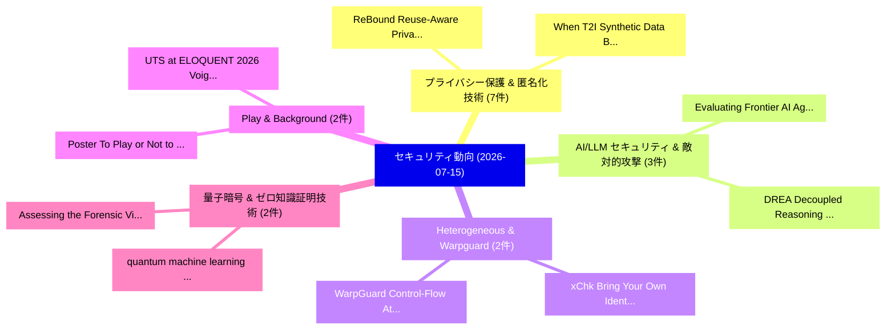

# 📅 02_daily: 日次エグゼクティブサマリー報告書 (2026-07-15)

**集計日時**: 2026-10-02 23:06:19 UTC  
**対象日付**: 2026-07-15  
**本日収集論文数**: 34 件  

---

## 💡 主要セキュリティ動向・脅威インサイト (Executive Insights)

本日の収集論文（計 34 件）において、以下の重点セキュリティ領域で活発な研究動向が確認されました：
- **プライバシー保護 & 匿名化技術** (7 件): 注目論文として 「ReBound: Reuse-Aware Privacy F...」、「When T2I Synthetic Data Backfi...」 等が発表され、実務防御および攻撃検証の進展が見られます。
- **AI/LLM セキュリティ & 敵対的攻撃** (3 件): 注目論文として 「Evaluating Frontier AI Agents ...」、「DREA: Decoupled Reasoning and ...」 等が発表され、実務防御および攻撃検証の進展が見られます。
- **Heterogeneous & Warpguard** (2 件): 注目論文として 「xChk: Bring Your Own Identity ...」、「WarpGuard: Control-Flow Attest...」 等が発表され、実務防御および攻撃検証の進展が見られます。
- **Play & Background** (2 件): 注目論文として 「Poster: To Play or Not to Play...」、「UTS at ELOQUENT 2026 Voight-Ka...」 等が発表され、実務防御および攻撃検証の進展が見られます。
- **量子暗号 & ゼロ知識証明技術** (2 件): 注目論文として 「quantum machine learning for a...」、「Assessing the Forensic Viabili...」 等が発表され、実務防御および攻撃検証の進展が見られます。

### 🗺️ 技術・脅威トピックマインドマップ

---

## 📌 日次セキュリティ論文一覧 (日本語表形式)

| No | arXiv ID | 論文タイトル (日本語訳) | 重要キーワード | 構造化エグゼクティブ要約 (背景・提案・影響) | 脅威分類 | 詳細リンク |
|---|---|---|---|---|---|---|
| 1 | `2607.13346v1` | [The Refusal Residue: When Probes Catch Alignment Faking and When They Don't（セキュリティ分析論文）](../../okf/papers/2026-07-15/2607.13346.md) | `Aman Mehta`, `Raw Meta`, `Executive Summary` | 【提案】概要 (Overview & Key Finding) 本論文「The Refusal Residue: When Probes Catch Alignment Faking...。実証評価により経営層・セキュリティ管理者向け推奨アクション (E... | `arXiv` | [arXiv](https://arxiv.org/abs/2607.13346v1) &#124; [OKF](../../okf/papers/2026-07-15/2607.13346.md) |
| 2 | `2607.13369v1` | [xChk: Bring Your Own Identity -- Heterogeneous Assurance with Verifier-Determined Sufficiency（セキュリティ分析論文）](../../okf/papers/2026-07-15/2607.13369.md) | `Heterogeneous Assurance`, `Determined Sufficiency`, `Verifier-Determined Sufficiency` | 【提案】概要 (Overview & Key Finding) 本論文「xChk: Bring Your Own Identity -- Heterogeneous Assuranc...。実証評価により経営層・セキュリティ管理者向け推奨アクション (E... | `arXiv` | [arXiv](https://arxiv.org/abs/2607.13369v1) &#124; [OKF](../../okf/papers/2026-07-15/2607.13369.md) |
| 3 | `2607.13411v1` | [Evaluating Frontier AI Agents as Autonomous Clinical Security Auditors（セキュリティ分析論文）](../../okf/papers/2026-07-15/2607.13411.md) | `Autonomous Clinical Security Auditors`, `Evaluating Frontier`, `Raw Meta` | 【提案】概要 (Overview & Key Finding) 本論文「Evaluating Frontier AI Agents as Autonomous Clinical Se...。実証評価によりEniolade - **公開日時**: `2026。 | `arXiv` | [arXiv](https://arxiv.org/abs/2607.13411v1) &#124; [OKF](../../okf/papers/2026-07-15/2607.13411.md) |
| 4 | `2607.13439v1` | [DREA: Decoupled Reasoning and Exploration Agents for Repository-Level 脆弱性検出](../../okf/papers/2026-07-15/2607.13439.md) | `Decoupled Reasoning`, `Exploration Agents`, `Level Vulnerability Detection` | 【提案】概要 (Overview & Key Finding) 本論文「DREA: Decoupled Reasoning and Exploration Agents for Re...。実証評価により経営層・セキュリティ管理者向け推奨アクション (E... | `arXiv` | [arXiv](https://arxiv.org/abs/2607.13439v1) &#124; [OKF](../../okf/papers/2026-07-15/2607.13439.md) |
| 5 | `2607.13440v1` | [ε-Indistinguishability In Moving Target Defense: Framework, Algorithms, And Cloud Case Studies（セキュリティ分析論文）](../../okf/papers/2026-07-15/2607.13440.md) | `Sailik Sengupta`, `Ankur Chowdhary`, `Raw Meta` | 【提案】概要 (Overview & Key Finding) 本論文「ε-Indistinguishability In Moving Target Defense: Framew...。実証評価により経営層・セキュリティ管理者向け推奨アクション (E... | `arXiv` | [arXiv](https://arxiv.org/abs/2607.13440v1) &#124; [OKF](../../okf/papers/2026-07-15/2607.13440.md) |
| 6 | `2607.13441v1` | [ReBound: Reuse-Aware Privacy For Interactive Decision Support（セキュリティ分析論文）](../../okf/papers/2026-07-15/2607.13441.md) | `Reuse-Aware Privacy`, `Nada Lahjouji`, `Shufan Zhang` | 【提案】概要 (Overview & Key Finding) 本論文「ReBound: Reuse-Aware Privacy For Interactive Decision S...。実証評価により経営層・セキュリティ管理者向け推奨アクション (E... | `arXiv` | [arXiv](https://arxiv.org/abs/2607.13441v1) &#124; [OKF](../../okf/papers/2026-07-15/2607.13441.md) |
| 7 | `2607.13453v1` | [Adversarial Prompting Framework for AI Safety Assessment（セキュリティ分析論文）](../../okf/papers/2026-07-15/2607.13453.md) | `Safety Assessment`, `Yash Bhatnagar`, `Kunal Banerjee` | 【提案】概要 (Overview & Key Finding) 本論文「Adversarial Prompting Framework for AI Safety Assessmen...。実証評価により経営層・セキュリティ管理者向け推奨アクション (E... | `arXiv` | [arXiv](https://arxiv.org/abs/2607.13453v1) &#124; [OKF](../../okf/papers/2026-07-15/2607.13453.md) |
| 8 | `2607.13480v2` | [Poster: To Play or Not to Play: Insights and Lessons Learned from 20 Years of CTFs with ENOFLAG（セキュリティ分析論文）](../../okf/papers/2026-07-15/2607.13480.md) | `Lessons Learned`, `Sebastian Neef`, `Sebastian Koch` | 【提案】背景とセキュリティ上の課題 (Background & Problem) 本研究はサイバー脅威環境におけるセキュリティ構造・脆弱性の検証を目的としています。(主要検出項目: ...。実証評価により経営層・セキュリティ管理者向け推奨アクション (E... | `arXiv` | [arXiv](https://arxiv.org/abs/2607.13480v2) &#124; [OKF](../../okf/papers/2026-07-15/2607.13480.md) |
| 9 | `2607.13505v1` | [CODA: How to Mitigate ColumnDisturb for (Almost) Free?（セキュリティ分析論文）](../../okf/papers/2026-07-15/2607.13505.md) | `Moinuddin Qureshi`, `Raw Meta`, `Executive Summary` | 【提案】### (日本語題名: CODA: How to Mitigate ColumnDisturb for (Almost) Free?（セキュリティ分析論文）)  > [!NO...。実証評価により経営層・セキュリティ管理者向け推奨アクション (E... | `arXiv` | [arXiv](https://arxiv.org/abs/2607.13505v1) &#124; [OKF](../../okf/papers/2026-07-15/2607.13505.md) |
| 10 | `2607.13541v1` | [When T2I Synthetic Data Backfires: Amplified Privacy Risks in Real-Synthetic Mix Training（セキュリティ分析論文）](../../okf/papers/2026-07-15/2607.13541.md) | `Synthetic Data Backfires`, `Amplified Privacy Risks`, `Synthetic Mix Training` | 【提案】概要 (Overview & Key Finding) 本論文「When T2I Synthetic Data Backfires: Amplified Privacy Ri...。実証評価により経営層・セキュリティ管理者向け推奨アクション (E... | `arXiv` | [arXiv](https://arxiv.org/abs/2607.13541v1) &#124; [OKF](../../okf/papers/2026-07-15/2607.13541.md) |
| 11 | `2607.13554v1` | [Multivariate Cryptography-Based Anonymous Certificate Scheme（セキュリティ分析論文）](../../okf/papers/2026-07-15/2607.13554.md) | `Based Anonymous Certificate Scheme`, `Multivariate Cryptography`, `Cryptography-Based Anonymous` | 【提案】概要 (Overview & Key Finding) 本論文「Multivariate 暗号技術-Based Anonymous Certificate Scheme（セキ...。実証評価によりChen - **公開日時**: `2026-07... | `arXiv` | [arXiv](https://arxiv.org/abs/2607.13554v1) &#124; [OKF](../../okf/papers/2026-07-15/2607.13554.md) |
| 12 | `2607.13565v1` | [UTS at ELOQUENT 2026 Voight-Kampff: structural shifts in AI writing bypass state-of-the-art detectors（セキュリティ分析論文）](../../okf/papers/2026-07-15/2607.13565.md) | `the-art detectors`, `Dima Galat`, `Andrei Rizoiu` | 【提案】背景とセキュリティ上の課題 (Background & Problem) 本研究はサイバー脅威環境におけるセキュリティ構造・脆弱性の検証を目的としています。(主要検出項目: ...。実証評価により経営層・セキュリティ管理者向け推奨アクション (E... | `arXiv` | [arXiv](https://arxiv.org/abs/2607.13565v1) &#124; [OKF](../../okf/papers/2026-07-15/2607.13565.md) |
| 13 | `2607.13596v1` | [Protective Capacity Hallucination: When 大規模言語モデル Claim Nonexistent Capabilities](../../okf/papers/2026-07-15/2607.13596.md) | `Protective Capacity Hallucination`, `Claim Nonexistent Capabilities`, `Eunna Lee` | 【提案】概要 (Overview & Key Finding) 本論文「Protective Capacity Hallucination: When 大規模言語モデル Claim ...。実証評価により経営層・セキュリティ管理者向け推奨アクション (E... | `arXiv` | [arXiv](https://arxiv.org/abs/2607.13596v1) &#124; [OKF](../../okf/papers/2026-07-15/2607.13596.md) |
| 14 | `2607.13640v1` | [WarpGuard: Control-Flow Attestation for Heterogeneous CPU-GPU Executionに向けて](../../okf/papers/2026-07-15/2607.13640.md) | `Flow Attestation`, `Control-Flow Attestation`, `Towards Control` | 【提案】概要 (Overview & Key Finding) 本論文「WarpGuard: Control-Flow Attestation for Heterogeneous C...。実証評価により経営層・セキュリティ管理者向け推奨アクション (E... | `arXiv` | [arXiv](https://arxiv.org/abs/2607.13640v1) &#124; [OKF](../../okf/papers/2026-07-15/2607.13640.md) |
| 15 | `2607.13718v2` | [How Agents Ask for Permission: User Permissions for AI Agents, from Interfaces to Enforcement（セキュリティ分析論文）](../../okf/papers/2026-07-15/2607.13718.md) | `User Permissions`, `Franziska Roesner`, `Raw Meta` | 【提案】概要 (Overview & Key Finding) 本論文「How Agents Ask for Permission: User Permissions for AI ...。実証評価により経営層・セキュリティ管理者向け推奨アクション (E... | `arXiv` | [arXiv](https://arxiv.org/abs/2607.13718v2) &#124; [OKF](../../okf/papers/2026-07-15/2607.13718.md) |
| 16 | `2607.13722v1` | [quantum machine learning for assessing the resilience of post-quantum cryptographyに向けて](../../okf/papers/2026-07-15/2607.13722.md) | `post-quantum cryptography`, `Raw Meta`, `Executive Summary` | 【提案】概要 (Overview & Key Finding) 本論文「量子 machine learning for assessing the resilience of pos...。実証評価により経営層・セキュリティ管理者向け推奨アクション (E... | `arXiv` | [arXiv](https://arxiv.org/abs/2607.13722v1) &#124; [OKF](../../okf/papers/2026-07-15/2607.13722.md) |
| 17 | `2607.13754v1` | [PriEval-Protect: A Unified Framework for Privacy Evaluation and Protection in Healthcare Systems（セキュリティ分析論文）](../../okf/papers/2026-07-15/2607.13754.md) | `Healthcare Systems`, `Asma El Hadj`, `Ilef Chebil` | 【提案】概要 (Overview & Key Finding) 本論文「PriEval-Protect: A Unified Framework for Privacy Evalua...。実証評価により経営層・セキュリティ管理者向け推奨アクション (E... | `arXiv` | [arXiv](https://arxiv.org/abs/2607.13754v1) &#124; [OKF](../../okf/papers/2026-07-15/2607.13754.md) |
| 18 | `2607.13801v1` | [Traffic-Aware Randomized Smoothing for LLM-Based Network Intrusion Detection（セキュリティ分析論文）](../../okf/papers/2026-07-15/2607.13801.md) | `Based Network Intrusion Detection`, `Aware Randomized Smoothing`, `Traffic-Aware Randomized` | 【提案】概要 (Overview & Key Finding) 本論文「Traffic-Aware Randomized Smoothing for LLM-Based Networ...。実証評価により経営層・セキュリティ管理者向け推奨アクション (E... | `arXiv` | [arXiv](https://arxiv.org/abs/2607.13801v1) &#124; [OKF](../../okf/papers/2026-07-15/2607.13801.md) |
| 19 | `2607.13816v2` | [Quantum Algorithm for Elliptic Curve Discrete Logarithms with Space-Efficient Point Addition（セキュリティ分析論文）](../../okf/papers/2026-07-15/2607.13816.md) | `Elliptic Curve Discrete Logarithms`, `Efficient Point Addition`, `Quantum Algorithm` | 【提案】概要 (Overview & Key Finding) 本論文「量子 Algorithm for Elliptic Curve Discrete Logarithms wit...。実証評価により経営層・セキュリティ管理者向け推奨アクション (E... | `arXiv` | [arXiv](https://arxiv.org/abs/2607.13816v2) &#124; [OKF](../../okf/papers/2026-07-15/2607.13816.md) |
| 20 | `2607.13821v1` | [Assessing the Forensic Viability of Android Memory Analysis Across Production Builds: A Cross-Version Study of Security Hardening and Structure Preservation（セキュリティ分析論文）](../../okf/papers/2026-07-15/2607.13821.md) | `Forensic Viability`, `Security Hardening`, `Structure Preservation` | 【提案】概要 (Overview & Key Finding) 本論文「Assessing the Forensic Viability of Android Memory Anal...。実証評価により経営層・セキュリティ管理者向け推奨アクション (E... | `arXiv` | [arXiv](https://arxiv.org/abs/2607.13821v1) &#124; [OKF](../../okf/papers/2026-07-15/2607.13821.md) |
| 21 | `2607.13832v1` | [Reveal, Correct, Then Pay: Encrypted Mempools and Perpetual Funding Security（セキュリティ分析論文）](../../okf/papers/2026-07-15/2607.13832.md) | `Perpetual Funding Security`, `Encrypted Mempools`, `Benjamin Marsh` | 【提案】概要 (Overview & Key Finding) 本論文「Reveal, Correct, Then Pay: Encrypted Mempools and Perpe...。実証評価により経営層・セキュリティ管理者向け推奨アクション (E... | `arXiv` | [arXiv](https://arxiv.org/abs/2607.13832v1) &#124; [OKF](../../okf/papers/2026-07-15/2607.13832.md) |
| 22 | `2607.13845v1` | [From Classification to Consistent Templates: Multiple Permuted-Label Classifier Encoding for Biometric Template Protection（セキュリティ分析論文）](../../okf/papers/2026-07-15/2607.13845.md) | `Label Classifier Encoding`, `Biometric Template Protection`, `Consistent Templates` | 【提案】概要 (Overview & Key Finding) 本論文「From Classification to Consistent Templates: Multiple P...。実証評価により経営層・セキュリティ管理者向け推奨アクション (E... | `arXiv` | [arXiv](https://arxiv.org/abs/2607.13845v1) &#124; [OKF](../../okf/papers/2026-07-15/2607.13845.md) |
| 23 | `2607.13928v1` | [Plausible Deniability Guarantees for Whistleblowers（セキュリティ分析論文）](../../okf/papers/2026-07-15/2607.13928.md) | `Plausible Deniability Guarantees`, `Leo Richter`, `Raw Meta` | 【提案】概要 (Overview & Key Finding) 本論文「Plausible Deniability Guarantees for Whistleblowers（セキュ...。実証評価によりKusner - **公開日時**: `2026-... | `arXiv` | [arXiv](https://arxiv.org/abs/2607.13928v1) &#124; [OKF](../../okf/papers/2026-07-15/2607.13928.md) |
| 24 | `2607.13939v1` | [HORCRUX: A Complete PQC RISC-V eXtension Architecture（セキュリティ分析論文）](../../okf/papers/2026-07-15/2607.13939.md) | `RISC-V eXtension`, `Alessandra Dolmeta`, `Valeria Piscopo` | 【提案】概要 (Overview & Key Finding) 本論文「HORCRUX: A Complete PQC RISC-V eXtension Architecture（セ...。実証評価により経営層・セキュリティ管理者向け推奨アクション (E... | `arXiv` | [arXiv](https://arxiv.org/abs/2607.13939v1) &#124; [OKF](../../okf/papers/2026-07-15/2607.13939.md) |
| 25 | `2607.13965v1` | [ProfMalPlus: Agent-Coordinated Malicious NPM Packages via Static-Dynamic Analysis Synergyの検出](../../okf/papers/2026-07-15/2607.13965.md) | `Coordinated Malicious`, `Agent-Coordinated Malicious`, `Coordinated Detection` | 【提案】概要 (Overview & Key Finding) 本論文「ProfMalPlus: Agent-Coordinated Malicious NPM Packages v...。実証評価により経営層・セキュリティ管理者向け推奨アクション (E... | `arXiv` | [arXiv](https://arxiv.org/abs/2607.13965v1) &#124; [OKF](../../okf/papers/2026-07-15/2607.13965.md) |
| 26 | `2607.13987v1` | [Agent Skill Security: Threat Models, Attacks, Defenses, and Evaluation（セキュリティ分析論文）](../../okf/papers/2026-07-15/2607.13987.md) | `Agent Skill Security`, `Threat Models`, `Sanket Badhe` | 【提案】概要 (Overview & Key Finding) 本論文「Agent Skill Security: 脅威 Models, Attacks, Defenses, and...。実証評価により経営層・セキュリティ管理者向け推奨アクション (E... | `arXiv` | [arXiv](https://arxiv.org/abs/2607.13987v1) &#124; [OKF](../../okf/papers/2026-07-15/2607.13987.md) |
| 27 | `2607.14006v1` | [Rethinking Penetration Testing for AI-Enabled Systems: From Resource Compromise to Behavioral Objective Violation（セキュリティ分析論文）](../../okf/papers/2026-07-15/2607.14006.md) | `Rethinking Penetration Testing`, `Behavioral Objective Violation`, `Enabled Systems` | 【提案】概要 (Overview & Key Finding) 本論文「Rethinking Penetration Testing for AI-Enabled Systems: ...。実証評価により経営層・セキュリティ管理者向け推奨アクション (E... | `arXiv` | [arXiv](https://arxiv.org/abs/2607.14006v1) &#124; [OKF](../../okf/papers/2026-07-15/2607.14006.md) |
| 28 | `2607.14166v3` | [Stop Means Stop: Measuring and Repairing the Enforcement Gap in Agent-Framework Control Primitives（セキュリティ分析論文）](../../okf/papers/2026-07-15/2607.14166.md) | `Stop Means Stop`, `Enforcement Gap`, `Agent-Framework Control` | 【提案】概要 (Overview & Key Finding) 本論文「Stop Means Stop: Measuring and Repairing the Enforcemen...。実証評価により経営層・セキュリティ管理者向け推奨アクション (E... | `arXiv` | [arXiv](https://arxiv.org/abs/2607.14166v3) &#124; [OKF](../../okf/papers/2026-07-15/2607.14166.md) |
| 29 | `2607.14205v1` | [Privacy Leakage in 連合学習 in Radiology Reports: A Comparative Evaluation of Tokenizer-Driven Privacy Risks](../../okf/papers/2026-07-15/2607.14205.md) | `Driven Privacy Risks`, `Privacy Leakage`, `Radiology Reports` | 【提案】概要 (Overview & Key Finding) 本論文「Privacy Leakage in 連合学習 in Radiology Reports: A Compara...。実証評価により経営層・セキュリティ管理者向け推奨アクション (E... | `arXiv` | [arXiv](https://arxiv.org/abs/2607.14205v1) &#124; [OKF](../../okf/papers/2026-07-15/2607.14205.md) |
| 30 | `2607.14340v1` | [The Prover Is the Judge: Verified Security Software from AI Coding Agents in Ada/SPARK（セキュリティ分析論文）](../../okf/papers/2026-07-15/2607.14340.md) | `Verified Security Software`, `Coding Agents`, `Tobias Philipp` | 【提案】概要 (Overview & Key Finding) 本論文「The Prover Is the Judge: Verified Security Software fro...。実証評価により経営層・セキュリティ管理者向け推奨アクション (E... | `arXiv` | [arXiv](https://arxiv.org/abs/2607.14340v1) &#124; [OKF](../../okf/papers/2026-07-15/2607.14340.md) |
| 31 | `2607.14345v4` | [Value Leakage: An LLM's Answers Are Silently Shaped by Its Own Values（セキュリティ分析論文）](../../okf/papers/2026-07-15/2607.14345.md) | `Value Leakage`, `Jan Betley`, `Johannes Treutlein` | 【提案】概要 (Overview & Key Finding) 本論文「Value Leakage: An LLM's Answers Are Silently Shaped by ...。実証評価により経営層・セキュリティ管理者向け推奨アクション (E... | `AI/ML Security` | [arXiv](https://arxiv.org/abs/2607.14345v4) &#124; [OKF](../../okf/papers/2026-07-15/2607.14345.md) |
| 32 | `2607.14395v2` | [Exploring Delay-Based PUFs for Energy-Efficient Low-Overhead Security of Wearable Devices（セキュリティ分析論文）](../../okf/papers/2026-07-15/2607.14395.md) | `Exploring Delay`, `Efficient Low`, `Delay-Based PUFs` | 【提案】概要 (Overview & Key Finding) 本論文「Exploring Delay-Based PUFs for Energy-Efficient Low-Ove...。実証評価により経営層・セキュリティ管理者向け推奨アクション (E... | `arXiv` | [arXiv](https://arxiv.org/abs/2607.14395v2) &#124; [OKF](../../okf/papers/2026-07-15/2607.14395.md) |
| 33 | `2607.14406v1` | [Better Privacy Guarantees for Larger Groups（セキュリティ分析論文）](../../okf/papers/2026-07-15/2607.14406.md) | `Better Privacy Guarantees`, `Larger Groups`, `Jack Fitzsimons` | 【提案】概要 (Overview & Key Finding) 本論文「Better Privacy Guarantees for Larger Groups（セキュリティ分析論文）...。実証評価により経営層・セキュリティ管理者向け推奨アクション (E... | `arXiv` | [arXiv](https://arxiv.org/abs/2607.14406v1) &#124; [OKF](../../okf/papers/2026-07-15/2607.14406.md) |
| 34 | `2607.15315v1` | [CHRONO-RESOLUTION: A Dependency Resolution Dataset at Release Points for npm, PyPI, and crates.io Packages（セキュリティ分析論文）](../../okf/papers/2026-07-15/2607.15315.md) | `Dependency Resolution Dataset`, `Release Points`, `Imranur Rahman` | 【提案】概要 (Overview & Key Finding) 本論文「CHRONO-RESOLUTION: A Dependency Resolution Dataset at R...。実証評価により経営層・セキュリティ管理者向け推奨アクション (E... | `arXiv` | [arXiv](https://arxiv.org/abs/2607.15315v1) &#124; [OKF](../../okf/papers/2026-07-15/2607.15315.md) |

