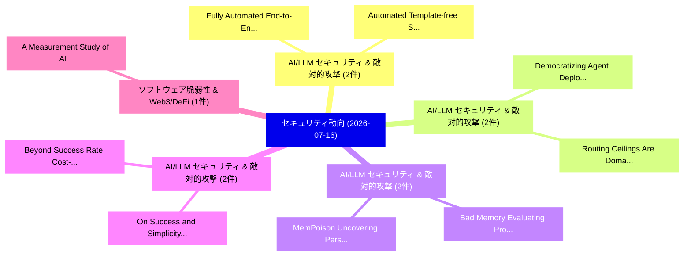

# 📅 02_daily: 日次エグゼクティブサマリー報告書 (2026-07-16)

**集計日時**: 2026-10-02 23:06:19 UTC  
**対象日付**: 2026-07-16  
**本日収集論文数**: 29 件  

---

## 💡 主要セキュリティ動向・脅威インサイト (Executive Insights)

本日の収集論文（計 29 件）において、以下の重点セキュリティ領域で活発な研究動向が確認されました：
- **AI/LLM セキュリティ & 敵対的攻撃** (2 件): 注目論文として 「Fully Automated End-to-End Adv...」、「Automated Template-free Synthe...」 等が発表され、実務防御および攻撃検証の進展が見られます。
- **AI/LLM セキュリティ & 敵対的攻撃** (2 件): 注目論文として 「Democratizing Agent Deployment...」、「Routing Ceilings Are Domain-In...」 等が発表され、実務防御および攻撃検証の進展が見られます。
- **AI/LLM セキュリティ & 敵対的攻撃** (2 件): 注目論文として 「Bad Memory: Evaluating Prompt ...」、「MemPoison: Uncovering Persiste...」 等が発表され、実務防御および攻撃検証の進展が見られます。
- **AI/LLM セキュリティ & 敵対的攻撃** (2 件): 注目論文として 「On Success and Simplicity: A S...」、「Beyond Success Rate: Cost-Awar...」 等が発表され、実務防御および攻撃検証の進展が見られます。
- **ソフトウェア脆弱性 & Web3/DeFi** (1 件): 注目論文として 「A Measurement Study of AI-Envi...」 等が発表され、実務防御および攻撃検証の進展が見られます。

### 🗺️ 技術・脅威トピックマインドマップ

---

## 📌 日次セキュリティ論文一覧 (日本語表形式)

| No | arXiv ID | 論文タイトル (日本語訳) | 重要キーワード | 構造化エグゼクティブ要約 (背景・提案・影響) | 脅威分類 | 詳細リンク |
|---|---|---|---|---|---|---|
| 1 | `2607.14434v1` | [A Measurement Study of AI-Environment Realism Gaps in Malware-Analysis Sandboxes（セキュリティ分析論文）](../../okf/papers/2026-07-16/2607.14434.md) | `Environment Realism Gaps`, `AI-Environment Realism`, `Malware-Analysis Sandboxes` | 【提案】概要 (Overview & Key Finding) 本論文「A Measurement Study of AI-Environment Realism Gaps in マ...。実証評価により経営層・セキュリティ管理者向け推奨アクション (E... | `arXiv` | [arXiv](https://arxiv.org/abs/2607.14434v1) &#124; [OKF](../../okf/papers/2026-07-16/2607.14434.md) |
| 2 | `2607.14442v1` | [Disclosure Divergence: Measuring プライバシーポリシー and Data Safety Misalignment at Scale](../../okf/papers/2026-07-16/2607.14442.md) | `Data Safety Misalignment`, `Disclosure Divergence`, `Measuring Privacy Policy` | 【提案】概要 (Overview & Key Finding) 本論文「Disclosure Divergence: Measuring プライバシーポリシー and Data Sa...。実証評価により経営層・セキュリティ管理者向け推奨アクション (E... | `arXiv` | [arXiv](https://arxiv.org/abs/2607.14442v1) &#124; [OKF](../../okf/papers/2026-07-16/2607.14442.md) |
| 3 | `2607.14493v1` | [Context Contamination in LLM Network Security Logs: Poison with Passive Prompt Injection and Mitigation Evaluationの分析](../../okf/papers/2026-07-16/2607.14493.md) | `Network Security Logs`, `Passive Prompt Injection`, `Context Contamination` | 【提案】概要 (Overview & Key Finding) 本論文「Context Contamination in LLM Network Security Logs: Poi...。実証評価により# Context Contamination i... | `arXiv` | [arXiv](https://arxiv.org/abs/2607.14493v1) &#124; [OKF](../../okf/papers/2026-07-16/2607.14493.md) |
| 4 | `2607.14566v1` | [Fully Automated End-to-End Adversary Emulation from MITRE ATT\&CK Based Cyber Threat Intelligence Using LLMs（セキュリティ分析論文）](../../okf/papers/2026-07-16/2607.14566.md) | `Based Cyber Threat Intelligence Using`, `Fully Automated End`, `End Adversary Emulation` | 【提案】概要 (Overview & Key Finding) 本論文「Fully Automated End-to-End Adversary Emulation from MIT...。実証評価により経営層・セキュリティ管理者向け推奨アクション (E... | `arXiv` | [arXiv](https://arxiv.org/abs/2607.14566v1) &#124; [OKF](../../okf/papers/2026-07-16/2607.14566.md) |
| 5 | `2607.14570v1` | [Democratizing Agent Deployment Safety: A Structural Monitoring Approach（セキュリティ分析論文）](../../okf/papers/2026-07-16/2607.14570.md) | `Democratizing Agent Deployment Safety`, `Preeti Ravindra`, `Rahul Tiwari` | 【提案】概要 (Overview & Key Finding) 本論文「Democratizing Agent Deployment Safety: A Structural Mon...。実証評価により経営層・セキュリティ管理者向け推奨アクション (E... | `arXiv` | [arXiv](https://arxiv.org/abs/2607.14570v1) &#124; [OKF](../../okf/papers/2026-07-16/2607.14570.md) |
| 6 | `2607.14587v1` | [Qubes OS Security in the Public Record（セキュリティ分析論文）](../../okf/papers/2026-07-16/2607.14587.md) | `Public Record`, `Alfonso De Gregorio`, `Raw Meta` | 【提案】概要 (Overview & Key Finding) 本論文「Qubes OS Security in the Public Record（セキュリティ分析論文）」（原題:...。実証評価により経営層・セキュリティ管理者向け推奨アクション (E... | `arXiv` | [arXiv](https://arxiv.org/abs/2607.14587v1) &#124; [OKF](../../okf/papers/2026-07-16/2607.14587.md) |
| 7 | `2607.14611v1` | [Bad Memory: Evaluating Prompt Injection Risks from Memory in Agentic Systems（セキュリティ分析論文）](../../okf/papers/2026-07-16/2607.14611.md) | `Evaluating Prompt Injection Risks`, `Bad Memory`, `Agentic Systems` | 【提案】概要 (Overview & Key Finding) 本論文「Bad Memory: Evaluating プロンプトインジェクション Risks from Memory ...。実証評価により経営層・セキュリティ管理者向け推奨アクション (E... | `arXiv` | [arXiv](https://arxiv.org/abs/2607.14611v1) &#124; [OKF](../../okf/papers/2026-07-16/2607.14611.md) |
| 8 | `2607.14628v1` | [Routing Ceilings Are Domain-Independent: Structural Prior Injection in Code Security 脆弱性検出](../../okf/papers/2026-07-16/2607.14628.md) | `Structural Prior Injection`, `Code Security Vulnerability Detection`, `Code Security` | 【提案】概要 (Overview & Key Finding) 本論文「Routing Ceilings Are Domain-Independent: Structural Pri...。実証評価により経営層・セキュリティ管理者向け推奨アクション (E... | `arXiv` | [arXiv](https://arxiv.org/abs/2607.14628v1) &#124; [OKF](../../okf/papers/2026-07-16/2607.14628.md) |
| 9 | `2607.14651v1` | [MemPoison: Uncovering Persistent Memory Threats and Structural Blind Spots in LLMエージェント](../../okf/papers/2026-07-16/2607.14651.md) | `Uncovering Persistent Memory Threats`, `Structural Blind Spots`, `Jifeng Gao` | 【提案】概要 (Overview & Key Finding) 本論文「MemPoison: Uncovering Persistent Memory Threats and Str...。実証評価により経営層・セキュリティ管理者向け推奨アクション (E... | `arXiv` | [arXiv](https://arxiv.org/abs/2607.14651v1) &#124; [OKF](../../okf/papers/2026-07-16/2607.14651.md) |
| 10 | `2607.14690v1` | [Lattice-based extended withdrawability（セキュリティ分析論文）](../../okf/papers/2026-07-16/2607.14690.md) | `Lattice-based extended`, `Ramses Fernandez`, `Raw Meta` | 【提案】概要 (Overview & Key Finding) 本論文「Lattice-based extended withdrawability（セキュリティ分析論文）」（原題:...。実証評価により経営層・セキュリティ管理者向け推奨アクション (E... | `arXiv` | [arXiv](https://arxiv.org/abs/2607.14690v1) &#124; [OKF](../../okf/papers/2026-07-16/2607.14690.md) |
| 11 | `2607.14754v1` | [FlowGuard: From Signals to Evidence for MCP Security Detection（セキュリティ分析論文）](../../okf/papers/2026-07-16/2607.14754.md) | `Security Detection`, `Pei Chen`, `Geng Hong` | 【提案】概要 (Overview & Key Finding) 本論文「FlowGuard: From Signals to Evidence for MCP Security De...。実証評価により経営層・セキュリティ管理者向け推奨アクション (E... | `arXiv` | [arXiv](https://arxiv.org/abs/2607.14754v1) &#124; [OKF](../../okf/papers/2026-07-16/2607.14754.md) |
| 12 | `2607.14811v1` | [Is External Database Protection Static in Retrieval-Augmented Generation? Rethinking Privacy Preservation under Dynamic Queries（セキュリティ分析論文）](../../okf/papers/2026-07-16/2607.14811.md) | `Rethinking Privacy Preservation`, `Augmented Generation`, `Dynamic Queries` | 【提案】Rethinking Privacy Preservation under Dynamic Queries ### (日本語題名: Is External Database ...。実証評価により経営層・セキュリティ管理者向け推奨アクション (E... | `arXiv` | [arXiv](https://arxiv.org/abs/2607.14811v1) &#124; [OKF](../../okf/papers/2026-07-16/2607.14811.md) |
| 13 | `2607.14900v1` | [The Distributed Open-Source Vulnerability Ecosystem（セキュリティ分析論文）](../../okf/papers/2026-07-16/2607.14900.md) | `Source Vulnerability Ecosystem`, `Open-Source Vulnerability`, `Peter Mandl` | 【提案】概要 (Overview & Key Finding) 本論文「The Distributed Open-Source 脆弱性 Ecosystem（セキュリティ分析論文）」（...。実証評価により経営層・セキュリティ管理者向け推奨アクション (E... | `arXiv` | [arXiv](https://arxiv.org/abs/2607.14900v1) &#124; [OKF](../../okf/papers/2026-07-16/2607.14900.md) |
| 14 | `2607.14921v1` | [Random Logit Scaling: Defending Deep Neural Networks Against Black-Box Score-Based Adversarial Example Attacks（セキュリティ分析論文）](../../okf/papers/2026-07-16/2607.14921.md) | `Random Logit Scaling`, `Based Adversarial Example Attacks`, `Box Score` | 【提案】概要 (Overview & Key Finding) 本論文「Random Logit Scaling: Defending Deep Neural Networks Ag...。実証評価により経営層・セキュリティ管理者向け推奨アクション (E... | `arXiv` | [arXiv](https://arxiv.org/abs/2607.14921v1) &#124; [OKF](../../okf/papers/2026-07-16/2607.14921.md) |
| 15 | `2607.14954v2` | [A Queueing-Stability Criterion for Causal IPD-QIM Network Flow Watermarking（セキュリティ分析論文）](../../okf/papers/2026-07-16/2607.14954.md) | `Network Flow Watermarking`, `Stability Criterion`, `Queueing-Stability Criterion` | 【提案】概要 (Overview & Key Finding) 本論文「A Queueing-Stability Criterion for Causal IPD-QIM Netwo...。実証評価により経営層・セキュリティ管理者向け推奨アクション (E... | `arXiv` | [arXiv](https://arxiv.org/abs/2607.14954v2) &#124; [OKF](../../okf/papers/2026-07-16/2607.14954.md) |
| 16 | `2607.14974v1` | [On Success and Simplicity: A Second Look at Transferable Vision-Language Attack Pipeline（セキュリティ分析論文）](../../okf/papers/2026-07-16/2607.14974.md) | `Language Attack Pipeline`, `Second Look`, `Transferable Vision` | 【提案】概要 (Overview & Key Finding) 本論文「On Success and Simplicity: A Second Look at Transferabl...。実証評価により経営層・セキュリティ管理者向け推奨アクション (E... | `arXiv` | [arXiv](https://arxiv.org/abs/2607.14974v1) &#124; [OKF](../../okf/papers/2026-07-16/2607.14974.md) |
| 17 | `2607.15052v1` | [NFSA: Non-Forward Secure Aggregation with One Server via Two Layer Secret Sharing（セキュリティ分析論文）](../../okf/papers/2026-07-16/2607.15052.md) | `Two Layer Secret Sharing`, `Forward Secure Aggregation`, `One Server` | 【提案】概要 (Overview & Key Finding) 本論文「NFSA: Non-Forward Secure Aggregation with One Server vi...。実証評価により経営層・セキュリティ管理者向け推奨アクション (E... | `arXiv` | [arXiv](https://arxiv.org/abs/2607.15052v1) &#124; [OKF](../../okf/papers/2026-07-16/2607.15052.md) |
| 18 | `2607.15081v1` | [DataShield: Uncovering Risky Fine-Tuning Data Across LLMs Through Consensus Subspace Alignment（セキュリティ分析論文）](../../okf/papers/2026-07-16/2607.15081.md) | `Uncovering Risky Fine`, `Tuning Data Across`, `Fine-Tuning Data` | 【提案】概要 (Overview & Key Finding) 本論文「DataShield: Uncovering Risky Fine-Tuning Data Across LL...。実証評価により経営層・セキュリティ管理者向け推奨アクション (E... | `arXiv` | [arXiv](https://arxiv.org/abs/2607.15081v1) &#124; [OKF](../../okf/papers/2026-07-16/2607.15081.md) |
| 19 | `2607.15118v1` | [Automated Template-free Synthesis of Instruction-Centric Leakage Contracts for Black-Box CPUs（セキュリティ分析論文）](../../okf/papers/2026-07-16/2607.15118.md) | `Centric Leakage Contracts`, `Automated Template`, `Template-free Synthesis` | 【提案】概要 (Overview & Key Finding) 本論文「Automated Template-free Synthesis of Instruction-Centri...。実証評価により経営層・セキュリティ管理者向け推奨アクション (E... | `arXiv` | [arXiv](https://arxiv.org/abs/2607.15118v1) &#124; [OKF](../../okf/papers/2026-07-16/2607.15118.md) |
| 20 | `2607.15143v1` | [Setup Complete, Now You Are Compromised: Weaponizing Setup Instructions Against AI Coding Agents（セキュリティ分析論文）](../../okf/papers/2026-07-16/2607.15143.md) | `Setup Complete`, `Coding Agents`, `Aadesh Bagmar` | 【提案】概要 (Overview & Key Finding) 本論文「Setup Complete, Now You Are Compromised: Weaponizing Se...。実証評価により経営層・セキュリティ管理者向け推奨アクション (E... | `arXiv` | [arXiv](https://arxiv.org/abs/2607.15143v1) &#124; [OKF](../../okf/papers/2026-07-16/2607.15143.md) |
| 21 | `2607.15218v1` | [When Words Are Safe But Actions Kill: Probing Physical Danger Beyond Text Safety in Hidden-State Risk Space（セキュリティ分析論文）](../../okf/papers/2026-07-16/2607.15218.md) | `Probing Physical Danger Beyond Text Safety`, `State Risk Space`, `Hidden-State Risk` | 【提案】概要 (Overview & Key Finding) 本論文「When Words Are Safe But Actions Kill: Probing Physical ...。実証評価により経営層・セキュリティ管理者向け推奨アクション (E... | `arXiv` | [arXiv](https://arxiv.org/abs/2607.15218v1) &#124; [OKF](../../okf/papers/2026-07-16/2607.15218.md) |
| 22 | `2607.15263v3` | [Beyond Success Rate: Cost-Aware Evaluation of Offensive and Defensive Security Agents（セキュリティ分析論文）](../../okf/papers/2026-07-16/2607.15263.md) | `Beyond Success Rate`, `Defensive Security Agents`, `Defensive Security Agent` | 【提案】概要 (Overview & Key Finding) 本論文「Beyond Success Rate: Cost-Aware Evaluation of Offensive...。実証評価により# Beyond Success Rate: Co... | `arXiv` | [arXiv](https://arxiv.org/abs/2607.15263v3) &#124; [OKF](../../okf/papers/2026-07-16/2607.15263.md) |
| 23 | `2607.15328v1` | [Lazy Arithmetic using Systolic Arrays for Closing the Verification Gap on Embedded Systems（セキュリティ分析論文）](../../okf/papers/2026-07-16/2607.15328.md) | `Lazy Arithmetic`, `Systolic Arrays`, `Verification Gap` | 【提案】概要 (Overview & Key Finding) 本論文「Lazy Arithmetic using Systolic Arrays for Closing the V...。実証評価により経営層・セキュリティ管理者向け推奨アクション (E... | `arXiv` | [arXiv](https://arxiv.org/abs/2607.15328v1) &#124; [OKF](../../okf/papers/2026-07-16/2607.15328.md) |
| 24 | `2607.15379v1` | [On the Impact of Entropy-based Features（セキュリティ分析論文）](../../okf/papers/2026-07-16/2607.15379.md) | `Entropy-based Features`, `Iuri Mundstock`, `Abreu Quevedo` | 【提案】概要 (Overview & Key Finding) 本論文「On the Impact of Entropy-based Features（セキュリティ分析論文）」（原題...。実証評価によりDalmazo - **公開日時**: `2026... | `arXiv` | [arXiv](https://arxiv.org/abs/2607.15379v1) &#124; [OKF](../../okf/papers/2026-07-16/2607.15379.md) |
| 25 | `2607.15389v1` | [Improving Network Anomaly Detection via Choquet-Integral-Based Feature Aggregation（セキュリティ分析論文）](../../okf/papers/2026-07-16/2607.15389.md) | `Improving Network Anomaly Detection`, `Based Feature Aggregation`, `Abreu Quevedo` | 【提案】概要 (Overview & Key Finding) 本論文「Improving Network Anomaly Detection via Choquet-Integra...。実証評価により経営層・セキュリティ管理者向け推奨アクション (E... | `arXiv` | [arXiv](https://arxiv.org/abs/2607.15389v1) &#124; [OKF](../../okf/papers/2026-07-16/2607.15389.md) |
| 26 | `2607.15434v5` | [Coercion and Deception in AI-to-AI Management: An Agentic Benchmark of Unprompted Escalation（セキュリティ分析論文）](../../okf/papers/2026-07-16/2607.15434.md) | `Unprompted Escalation`, `Jasmine Brazilek`, `Maheep Chaudhary` | 【提案】概要 (Overview & Key Finding) 本論文「Coercion and Deception in AI-to-AI Management: An Agent...。実証評価により経営層・セキュリティ管理者向け推奨アクション (E... | `arXiv` | [arXiv](https://arxiv.org/abs/2607.15434v5) &#124; [OKF](../../okf/papers/2026-07-16/2607.15434.md) |
| 27 | `2607.15467v1` | [ADS-C: Antidistillation Sampling for Classification（セキュリティ分析論文）](../../okf/papers/2026-07-16/2607.15467.md) | `Antidistillation Sampling`, `Khawaja Abaid Ullah`, `Mohammad Javad Khojasteh` | 【提案】概要 (Overview & Key Finding) 本論文「ADS-C: Antidistillation Sampling for Classification（セキュ...。実証評価により経営層・セキュリティ管理者向け推奨アクション (E... | `arXiv` | [arXiv](https://arxiv.org/abs/2607.15467v1) &#124; [OKF](../../okf/papers/2026-07-16/2607.15467.md) |
| 28 | `2607.15469v1` | [FLINT: Fingerprinting 連合学習 Architectures from 5G PHY-Layer Side Channels](../../okf/papers/2026-07-16/2607.15469.md) | `Layer Side Channels`, `PHY-Layer Side`, `Fingerprinting Federated Learning Architectures` | 【提案】概要 (Overview & Key Finding) 本論文「FLINT: Fingerprinting 連合学習 Architectures from 5G PHY-La...。実証評価により経営層・セキュリティ管理者向け推奨アクション (E... | `arXiv` | [arXiv](https://arxiv.org/abs/2607.15469v1) &#124; [OKF](../../okf/papers/2026-07-16/2607.15469.md) |
| 29 | `2607.15512v1` | [Intentional Electromagnetic Interference Attacks on Facial Recognition（セキュリティ分析論文）](../../okf/papers/2026-07-16/2607.15512.md) | `Intentional Electromagnetic Interference Attacks`, `Facial Recognition`, `Tyler Fitzsimmons` | 【提案】概要 (Overview & Key Finding) 本論文「Intentional Electromagnetic Interference Attacks on Fac...。実証評価により経営層・セキュリティ管理者向け推奨アクション (E... | `arXiv` | [arXiv](https://arxiv.org/abs/2607.15512v1) &#124; [OKF](../../okf/papers/2026-07-16/2607.15512.md) |

