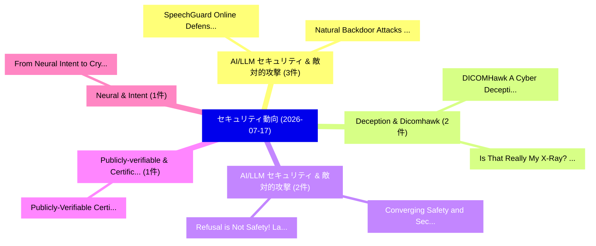

# 📅 02_daily: 日次エグゼクティブサマリー報告書 (2026-07-17)

**集計日時**: 2026-10-02 23:06:19 UTC  
**対象日付**: 2026-07-17  
**本日収集論文数**: 29 件  

---

## 💡 主要セキュリティ動向・脅威インサイト (Executive Insights)

本日の収集論文（計 29 件）において、以下の重点セキュリティ領域で活発な研究動向が確認されました：
- **AI/LLM セキュリティ & 敵対的攻撃** (3 件): 注目論文として 「SpeechGuard: Online Defense ag...」、「Natural Backdoor Attacks on Sp...」 等が発表され、実務防御および攻撃検証の進展が見られます。
- **Deception & Dicomhawk** (2 件): 注目論文として 「DICOMHawk: A Cyber Deception F...」、「Is That Really My X-Ray? Measu...」 等が発表され、実務防御および攻撃検証の進展が見られます。
- **AI/LLM セキュリティ & 敵対的攻撃** (2 件): 注目論文として 「Converging Safety and Security...」、「Refusal is Not Safety! Latent ...」 等が発表され、実務防御および攻撃検証の進展が見られます。
- **Publicly-verifiable & Certificates** (1 件): 注目論文として 「Publicly-Verifiable Certificat...」 等が発表され、実務防御および攻撃検証の進展が見られます。
- **Neural & Intent** (1 件): 注目論文として 「From Neural Intent to Cryptogr...」 等が発表され、実務防御および攻撃検証の進展が見られます。

### 🗺️ 技術・脅威トピックマインドマップ

---

## 📌 日次セキュリティ論文一覧 (日本語表形式)

| No | arXiv ID | 論文タイトル (日本語訳) | 重要キーワード | 構造化エグゼクティブ要約 (背景・提案・影響) | 脅威分類 | 詳細リンク |
|---|---|---|---|---|---|---|
| 1 | `2607.15528v1` | [Publicly-Verifiable Certificates for Statistical Algorithms（セキュリティ分析論文）](../../okf/papers/2026-07-17/2607.15528.md) | `Verifiable Certificates`, `Statistical Algorithms`, `Publicly-Verifiable Certificates` | 【提案】概要 (Overview & Key Finding) 本論文「Publicly-Verifiable Certificates for Statistical Algori...。実証評価によりKim - **公開日時**: `2026-07-... | `arXiv` | [arXiv](https://arxiv.org/abs/2607.15528v1) &#124; [OKF](../../okf/papers/2026-07-17/2607.15528.md) |
| 2 | `2607.15596v3` | [From Neural Intent to Cryptographic Authorization: AI-Driven Enterprise Workflowsのセキュリティ強化](../../okf/papers/2026-07-17/2607.15596.md) | `Cryptographic Authorization`, `AI-Driven Enterprise`, `Driven Enterprise` | 【提案】概要 (Overview & Key Finding) 本論文「From Neural Intent to Cryptographic Authorization: AI-D...。実証評価により経営層・セキュリティ管理者向け推奨アクション (E... | `arXiv` | [arXiv](https://arxiv.org/abs/2607.15596v3) &#124; [OKF](../../okf/papers/2026-07-17/2607.15596.md) |
| 3 | `2607.15657v1` | [Do Agents Dream of False Memories? Black-box Visual Attacks on Long-term Memory in Multimodal AI Agents（セキュリティ分析論文）](../../okf/papers/2026-07-17/2607.15657.md) | `False Memories`, `Black-box Visual`, `Visual Attacks` | 【提案】Black-box Visual Attacks on Long-term Memory in Multimodal AI Agents ### (日本語題名: Do Age...。実証評価により経営層・セキュリティ管理者向け推奨アクション (E... | `arXiv` | [arXiv](https://arxiv.org/abs/2607.15657v1) &#124; [OKF](../../okf/papers/2026-07-17/2607.15657.md) |
| 4 | `2607.15673v1` | [Beyond Detection: Agentic Attack Synthesis and Simulation for Smart Contracts（セキュリティ分析論文）](../../okf/papers/2026-07-17/2607.15673.md) | `Agentic Attack Synthesis`, `Beyond Detection`, `Smart Contracts` | 【提案】概要 (Overview & Key Finding) 本論文「Beyond Detection: Agentic Attack Synthesis and Simulati...。実証評価により経営層・セキュリティ管理者向け推奨アクション (E... | `arXiv` | [arXiv](https://arxiv.org/abs/2607.15673v1) &#124; [OKF](../../okf/papers/2026-07-17/2607.15673.md) |
| 5 | `2607.15697v1` | [SpeechGuard: Online Defense against Backdoor Attacks on Speech Recognition Models（セキュリティ分析論文）](../../okf/papers/2026-07-17/2607.15697.md) | `Speech Recognition Models`, `Online Defense`, `Backdoor Attacks` | 【提案】概要 (Overview & Key Finding) 本論文「SpeechGuard: Online Defense against Backdoor Attacks on...。実証評価により経営層・セキュリティ管理者向け推奨アクション (E... | `arXiv` | [arXiv](https://arxiv.org/abs/2607.15697v1) &#124; [OKF](../../okf/papers/2026-07-17/2607.15697.md) |
| 6 | `2607.15724v1` | [Natural Backdoor Attacks on Speech Recognition Models（セキュリティ分析論文）](../../okf/papers/2026-07-17/2607.15724.md) | `Natural Backdoor Attacks`, `Speech Recognition Models`, `Jinwen Xin` | 【提案】概要 (Overview & Key Finding) 本論文「Natural Backdoor Attacks on Speech Recognition Models（セ...。実証評価により経営層・セキュリティ管理者向け推奨アクション (E... | `arXiv` | [arXiv](https://arxiv.org/abs/2607.15724v1) &#124; [OKF](../../okf/papers/2026-07-17/2607.15724.md) |
| 7 | `2607.15750v2` | [Ciphertext- and Polynomial-Level Optimization for Fully Homomorphic Encryption（セキュリティ分析論文）](../../okf/papers/2026-07-17/2607.15750.md) | `Fully Homomorphic Encryption`, `Level Optimization`, `Polynomial-Level Optimization` | 【提案】概要 (Overview & Key Finding) 本論文「Ciphertext- and Polynomial-Level Optimization for Fully...。実証評価により経営層・セキュリティ管理者向け推奨アクション (E... | `arXiv` | [arXiv](https://arxiv.org/abs/2607.15750v2) &#124; [OKF](../../okf/papers/2026-07-17/2607.15750.md) |
| 8 | `2607.15754v1` | [DICOMHawk: A Cyber Deception Framework for Medical Imaging Infrastructure（セキュリティ分析論文）](../../okf/papers/2026-07-17/2607.15754.md) | `Medical Imaging Infrastructure`, `Karina Elzer`, `Alberto Mongardini` | 【提案】概要 (Overview & Key Finding) 本論文「DICOMHawk: A Cyber Deception Framework for Medical Imag...。実証評価により経営層・セキュリティ管理者向け推奨アクション (E... | `arXiv` | [arXiv](https://arxiv.org/abs/2607.15754v1) &#124; [OKF](../../okf/papers/2026-07-17/2607.15754.md) |
| 9 | `2607.15782v1` | [Vogls: a Fast Interactive Full-timing Simulator for Pre-silicon Power Side-Channel Analysis（セキュリティ分析論文）](../../okf/papers/2026-07-17/2607.15782.md) | `Fast Interactive Full`, `Full-timing Simulator`, `Power Side` | 【提案】概要 (Overview & Key Finding) 本論文「Vogls: a Fast Interactive Full-timing Simulator for Pre...。実証評価により経営層・セキュリティ管理者向け推奨アクション (E... | `arXiv` | [arXiv](https://arxiv.org/abs/2607.15782v1) &#124; [OKF](../../okf/papers/2026-07-17/2607.15782.md) |
| 10 | `2607.15839v1` | [Is That Really My X-Ray? Measuring Internet-Exposed DICOM Services in the Presence of Deception（セキュリティ分析論文）](../../okf/papers/2026-07-17/2607.15839.md) | `Measuring Internet`, `Internet-Exposed DICOM`, `Alberto Maria Mongardini` | 【提案】Measuring Internet-Exposed DICOM Services in the Presence of Deception ### (日本語題名: Is T...。実証評価により経営層・セキュリティ管理者向け推奨アクション (E... | `arXiv` | [arXiv](https://arxiv.org/abs/2607.15839v1) &#124; [OKF](../../okf/papers/2026-07-17/2607.15839.md) |
| 11 | `2607.15840v1` | [Converging Safety and Security: IO-Link Wireless and OPC UA over 5G under prEN 50742（セキュリティ分析論文）](../../okf/papers/2026-07-17/2607.15840.md) | `Converging Safety`, `Link Wireless`, `IO-Link Wireless` | 【提案】概要 (Overview & Key Finding) 本論文「Converging Safety and Security: IO-Link Wireless and OP...。実証評価により経営層・セキュリティ管理者向け推奨アクション (E... | `arXiv` | [arXiv](https://arxiv.org/abs/2607.15840v1) &#124; [OKF](../../okf/papers/2026-07-17/2607.15840.md) |
| 12 | `2607.15937v1` | [The Language of Security: How Prompt Syntax Shapes Secure Code Generation in Open LLMs（セキュリティ分析論文）](../../okf/papers/2026-07-17/2607.15937.md) | `Antonio Della Porta`, `Matteo Cicalese`, `Stefano Lambiase` | 【提案】概要 (Overview & Key Finding) 本論文「The Language of Security: How Prompt Syntax Shapes Secu...。実証評価により経営層・セキュリティ管理者向け推奨アクション (E... | `arXiv` | [arXiv](https://arxiv.org/abs/2607.15937v1) &#124; [OKF](../../okf/papers/2026-07-17/2607.15937.md) |
| 13 | `2607.15970v1` | [Code-Poisoning Property Inference Attacks（セキュリティ分析論文）](../../okf/papers/2026-07-17/2607.15970.md) | `Poisoning Property Inference Attacks`, `Code-Poisoning Property`, `Xukun Luan` | 【提案】概要 (Overview & Key Finding) 本論文「Code-Poisoning Property Inference Attacks（セキュリティ分析論文）」（...。実証評価により経営層・セキュリティ管理者向け推奨アクション (E... | `arXiv` | [arXiv](https://arxiv.org/abs/2607.15970v1) &#124; [OKF](../../okf/papers/2026-07-17/2607.15970.md) |
| 14 | `2607.15977v1` | [Refusal is Not Safety! Latent Safety Risks of LLM-Driven Content Humorizationのベンチマーク評価](../../okf/papers/2026-07-17/2607.15977.md) | `LLM-Driven Content`, `Latent Safety Risks`, `Benchmarking Latent Safety Risks` | 【提案】Latent Safety Risks of LLM-Driven Content Humorizationのベンチマーク評価)  > [!NOTE] > **OKF Met...。実証評価により経営層・セキュリティ管理者向け推奨アクション (E... | `arXiv` | [arXiv](https://arxiv.org/abs/2607.15977v1) &#124; [OKF](../../okf/papers/2026-07-17/2607.15977.md) |
| 15 | `2607.16010v1` | [AI Watermark Evidence Fails Forensic Readiness: An Empirical Evaluation（セキュリティ分析論文）](../../okf/papers/2026-07-17/2607.16010.md) | `Watermark Evidence Fails Forensic Readiness`, `Saifur Rahman Tamim`, `Amir Labib Khan` | 【提案】概要 (Overview & Key Finding) 本論文「AI Watermark Evidence Fails Forensic Readiness: An Empi...。実証評価により経営層・セキュリティ管理者向け推奨アクション (E... | `arXiv` | [arXiv](https://arxiv.org/abs/2607.16010v1) &#124; [OKF](../../okf/papers/2026-07-17/2607.16010.md) |
| 16 | `2607.16052v1` | [Gasp: A DeFi Application Specic Rollup as a Consolidation Layer for All Assets（セキュリティ分析論文）](../../okf/papers/2026-07-17/2607.16052.md) | `Application Specic Rollup`, `Consolidation Layer`, `Stanislav Vozarik` | 【提案】概要 (Overview & Key Finding) 本論文「Gasp: A DeFi Application Specic Rollup as a Consolidati...。実証評価により経営層・セキュリティ管理者向け推奨アクション (E... | `arXiv` | [arXiv](https://arxiv.org/abs/2607.16052v1) &#124; [OKF](../../okf/papers/2026-07-17/2607.16052.md) |
| 17 | `2607.16102v1` | [DoSQ: A Cross-Layer Denial of Service Quality Attack by Exploiting Side Channels in 5G NR（セキュリティ分析論文）](../../okf/papers/2026-07-17/2607.16102.md) | `Service Quality Attack`, `Exploiting Side Channels`, `Layer Denial` | 【提案】概要 (Overview & Key Finding) 本論文「DoSQ: A Cross-Layer サービス運用妨害 Quality Attack by Exploiti...。実証評価により経営層・セキュリティ管理者向け推奨アクション (E... | `arXiv` | [arXiv](https://arxiv.org/abs/2607.16102v1) &#124; [OKF](../../okf/papers/2026-07-17/2607.16102.md) |
| 18 | `2607.16175v1` | [Evaluating Open-Weight LLMs for Generating Structured Threat Information for Autonomous Vehicle Vulnerabilities（セキュリティ分析論文）](../../okf/papers/2026-07-17/2607.16175.md) | `Generating Structured Threat Information`, `Autonomous Vehicle Vulnerabilities`, `Evaluating Open` | 【提案】概要 (Overview & Key Finding) 本論文「Evaluating Open-Weight LLMs for Generating Structured 脅...。実証評価により経営層・セキュリティ管理者向け推奨アクション (E... | `arXiv` | [arXiv](https://arxiv.org/abs/2607.16175v1) &#124; [OKF](../../okf/papers/2026-07-17/2607.16175.md) |
| 19 | `2607.16348v1` | [Boundary-Seeking GAN-Augmented TabTransformer for Adversarially Robust Intrusion Detection（セキュリティ分析論文）](../../okf/papers/2026-07-17/2607.16348.md) | `Adversarially Robust Intrusion Detection`, `Boundary-Seeking GAN`, `Raihan Sultan Pasha Basuki` | 【提案】概要 (Overview & Key Finding) 本論文「Boundary-Seeking GAN-Augmented TabTransformer for Adver...。実証評価により経営層・セキュリティ管理者向け推奨アクション (E... | `arXiv` | [arXiv](https://arxiv.org/abs/2607.16348v1) &#124; [OKF](../../okf/papers/2026-07-17/2607.16348.md) |
| 20 | `2607.16357v1` | [Reliable Remediation Impact Prediction for Black-Box Security Ratings（セキュリティ分析論文）](../../okf/papers/2026-07-17/2607.16357.md) | `Reliable Remediation Impact Prediction`, `Box Security Ratings`, `Black-Box Security` | 【提案】概要 (Overview & Key Finding) 本論文「Reliable Remediation Impact Prediction for Black-Box Se...。実証評価により経営層・セキュリティ管理者向け推奨アクション (E... | `arXiv` | [arXiv](https://arxiv.org/abs/2607.16357v1) &#124; [OKF](../../okf/papers/2026-07-17/2607.16357.md) |
| 21 | `2607.16383v1` | [Identity-Bound Academic Credentials on Blockchain: On-Chain Issuer Accreditation with ERC-3643 and OnchainID（セキュリティ分析論文）](../../okf/papers/2026-07-17/2607.16383.md) | `Bound Academic Credentials`, `Chain Issuer Accreditation`, `Identity-Bound Academic` | 【提案】概要 (Overview & Key Finding) 本論文「Identity-Bound Academic Credentials on Blockchain: On-C...。実証評価により経営層・セキュリティ管理者向け推奨アクション (E... | `arXiv` | [arXiv](https://arxiv.org/abs/2607.16383v1) &#124; [OKF](../../okf/papers/2026-07-17/2607.16383.md) |
| 22 | `2607.16414v1` | [Signal-based Model Access Risk Analysis for AI System Operations Security（セキュリティ分析論文）](../../okf/papers/2026-07-17/2607.16414.md) | `System Operations Security`, `Signal-based Model`, `Maria Mahbub` | 【提案】概要 (Overview & Key Finding) 本論文「Signal-based Model Access Risk Analysis for AI System O...。実証評価により経営層・セキュリティ管理者向け推奨アクション (E... | `arXiv` | [arXiv](https://arxiv.org/abs/2607.16414v1) &#124; [OKF](../../okf/papers/2026-07-17/2607.16414.md) |
| 23 | `2607.16442v1` | [One Modality to Forget Them All: Enhancing Cross-Modal Unlearning in Vision-Language Models（セキュリティ分析論文）](../../okf/papers/2026-07-17/2607.16442.md) | `One Modality`, `Enhancing Cross`, `Modal Unlearning` | 【提案】概要 (Overview & Key Finding) 本論文「One Modality to Forget Them All: Enhancing Cross-Modal ...。実証評価により経営層・セキュリティ管理者向け推奨アクション (E... | `arXiv` | [arXiv](https://arxiv.org/abs/2607.16442v1) &#124; [OKF](../../okf/papers/2026-07-17/2607.16442.md) |
| 24 | `2607.16456v1` | [TaintRadar: Semantic-Aware Taint-Style 脆弱性検出 via Augmented Code Property Graphs](../../okf/papers/2026-07-17/2607.16456.md) | `Augmented Code Property Graphs`, `Aware Taint`, `Semantic-Aware Taint` | 【提案】概要 (Overview & Key Finding) 本論文「TaintRadar: Semantic-Aware Taint-Style 脆弱性検出 via Augmen...。実証評価により経営層・セキュリティ管理者向け推奨アクション (E... | `arXiv` | [arXiv](https://arxiv.org/abs/2607.16456v1) &#124; [OKF](../../okf/papers/2026-07-17/2607.16456.md) |
| 25 | `2607.16487v1` | [Fuzz'EMup: Leveraging EM Side-Channel Emanation to Guide Black-Box Embedded Firmware Fuzzing（セキュリティ分析論文）](../../okf/papers/2026-07-17/2607.16487.md) | `Box Embedded Firmware Fuzzing`, `Channel Emanation`, `Guide Black` | 【提案】概要 (Overview & Key Finding) 本論文「Fuzz'EMup: Leveraging EM サイドチャネル攻撃 Emanation to Guide B...。実証評価により経営層・セキュリティ管理者向け推奨アクション (E... | `arXiv` | [arXiv](https://arxiv.org/abs/2607.16487v1) &#124; [OKF](../../okf/papers/2026-07-17/2607.16487.md) |
| 26 | `2607.16521v1` | [Enhanced Multi-Class DDoS Attack Identification using a Meta-Learning Ensemble（セキュリティ分析論文）](../../okf/papers/2026-07-17/2607.16521.md) | `Enhanced Multi`, `Attack Identification`, `Learning Ensemble` | 【提案】概要 (Overview & Key Finding) 本論文「Enhanced Multi-Class DDoS Attack Identification using a...。実証評価により経営層・セキュリティ管理者向け推奨アクション (E... | `arXiv` | [arXiv](https://arxiv.org/abs/2607.16521v1) &#124; [OKF](../../okf/papers/2026-07-17/2607.16521.md) |
| 27 | `2607.16543v2` | [A Control-Driven Framework for Secure SaaS Onboarding in Regulated Enterprises（セキュリティ分析論文）](../../okf/papers/2026-07-17/2607.16543.md) | `Regulated Enterprises`, `Naga Sundeep Krishna Thota`, `General Cyber Security` | 【提案】概要 (Overview & Key Finding) 本論文「A Control-Driven Framework for Secure SaaS Onboarding i...。実証評価により経営層・セキュリティ管理者向け推奨アクション (E... | `General Cyber Security` | [arXiv](https://arxiv.org/abs/2607.16543v2) &#124; [OKF](../../okf/papers/2026-07-17/2607.16543.md) |
| 28 | `2607.16548v1` | [Secure and Trustworthy DAOs for Cross-Chain Governanceに向けて](../../okf/papers/2026-07-17/2607.16548.md) | `Towards Secure`, `Chain Governance`, `Cross-Chain Governance` | 【提案】概要 (Overview & Key Finding) 本論文「Secure and Trustworthy DAOs for Cross-Chain Governanceに...。実証評価により経営層・セキュリティ管理者向け推奨アクション (E... | `arXiv` | [arXiv](https://arxiv.org/abs/2607.16548v1) &#124; [OKF](../../okf/papers/2026-07-17/2607.16548.md) |
| 29 | `2607.22695v1` | [PANOPTICON: A PII-Based Assemblage of Naturalistic Output Tokens for Investigating Privacy Leakage Within LLM Context Window（セキュリティ分析論文）](../../okf/papers/2026-07-17/2607.22695.md) | `Investigating Privacy Leakage Within`, `Naturalistic Output Tokens`, `Based Assemblage` | 【提案】概要 (Overview & Key Finding) 本論文「PANOPTICON: A PII-Based Assemblage of Naturalistic Outp...。実証評価により経営層・セキュリティ管理者向け推奨アクション (E... | `arXiv` | [arXiv](https://arxiv.org/abs/2607.22695v1) &#124; [OKF](../../okf/papers/2026-07-17/2607.22695.md) |

