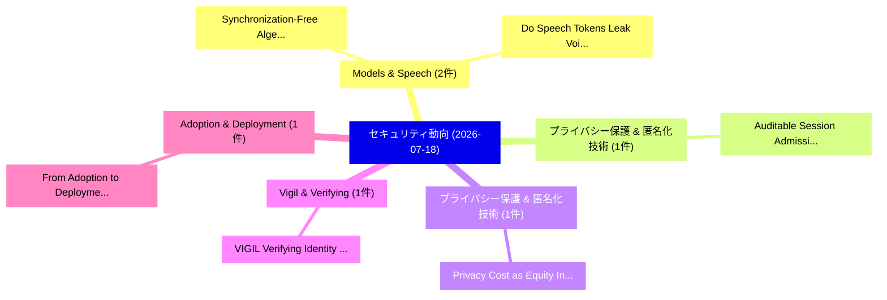

# 📅 02_daily: 日次エグゼクティブサマリー報告書 (2026-07-18)

**集計日時**: 2026-10-02 23:06:19 UTC  
**対象日付**: 2026-07-18  
**本日収集論文数**: 11 件  

---

## 💡 主要セキュリティ動向・脅威インサイト (Executive Insights)

本日の収集論文（計 11 件）において、以下の重点セキュリティ領域で活発な研究動向が確認されました：
- **Models & Speech** (2 件): 注目論文として 「Synchronization-Free Algebraic...」、「Do Speech Tokens Leak Voicepri...」 等が発表され、実務防御および攻撃検証の進展が見られます。
- **プライバシー保護 & 匿名化技術** (1 件): 注目論文として 「Auditable Session Admission fo...」 等が発表され、実務防御および攻撃検証の進展が見られます。
- **プライバシー保護 & 匿名化技術** (1 件): 注目論文として 「Privacy Cost as Equity Input: ...」 等が発表され、実務防御および攻撃検証の進展が見られます。
- **Vigil & Verifying** (1 件): 注目論文として 「VIGIL: Verifying Identity via ...」 等が発表され、実務防御および攻撃検証の進展が見られます。
- **Adoption & Deployment** (1 件): 注目論文として 「From Adoption to Deployment: A...」 等が発表され、実務防御および攻撃検証の進展が見られます。

### 🗺️ 技術・脅威トピックマインドマップ

---

## 📌 日次セキュリティ論文一覧 (日本語表形式)

| No | arXiv ID | 論文タイトル (日本語訳) | 重要キーワード | 構造化エグゼクティブ要約 (背景・提案・影響) | 脅威分類 | 詳細リンク |
|---|---|---|---|---|---|---|
| 1 | `2607.16559v1` | [Auditable Session Admission for Cross-Silo 連合学習](../../okf/papers/2026-07-18/2607.16559.md) | `Auditable Session Admission`, `Silo Federated Learning`, `Cross-Silo Federated` | 【提案】概要 (Overview & Key Finding) 本論文「Auditable Session Admission for Cross-Silo 連合学習」（原題: Au...。実証評価により経営層・セキュリティ管理者向け推奨アクション (E... | `arXiv` | [arXiv](https://arxiv.org/abs/2607.16559v1) &#124; [OKF](../../okf/papers/2026-07-18/2607.16559.md) |
| 2 | `2607.16620v1` | [Privacy Cost as Equity Input: A Group Fairness Criterion for Differentially Private Machine Learning（セキュリティ分析論文）](../../okf/papers/2026-07-18/2607.16620.md) | `Differentially Private Machine Learning`, `Group Fairness Criterion`, `Privacy Cost` | 【提案】概要 (Overview & Key Finding) 本論文「Privacy Cost as Equity Input: A Group Fairness Criterio...。実証評価により経営層・セキュリティ管理者向け推奨アクション (E... | `arXiv` | [arXiv](https://arxiv.org/abs/2607.16620v1) &#124; [OKF](../../okf/papers/2026-07-18/2607.16620.md) |
| 3 | `2607.16648v1` | [Synchronization-Free Algebraic Fingerprints for 大規模言語モデル: From Autoregressive to Diffusion Models](../../okf/papers/2026-07-18/2607.16648.md) | `Free Algebraic Fingerprints`, `Diffusion Models`, `Synchronization-Free Algebraic` | 【提案】概要 (Overview & Key Finding) 本論文「Synchronization-Free Algebraic Fingerprints for 大規模言語モデ...。実証評価により経営層・セキュリティ管理者向け推奨アクション (E... | `arXiv` | [arXiv](https://arxiv.org/abs/2607.16648v1) &#124; [OKF](../../okf/papers/2026-07-18/2607.16648.md) |
| 4 | `2607.16651v1` | [VIGIL: Verifying Identity via Gated Intermittent Likelihoods for Continuous Biometric Authentication（セキュリティ分析論文）](../../okf/papers/2026-07-18/2607.16651.md) | `Gated Intermittent Likelihoods`, `Continuous Biometric Authentication`, `Verifying Identity` | 【提案】概要 (Overview & Key Finding) 本論文「VIGIL: Verifying Identity via Gated Intermittent Likeli...。実証評価により経営層・セキュリティ管理者向け推奨アクション (E... | `arXiv` | [arXiv](https://arxiv.org/abs/2607.16651v1) &#124; [OKF](../../okf/papers/2026-07-18/2607.16651.md) |
| 5 | `2607.16660v2` | [From Adoption to Deployment: A Qualitative Study on AI Integration in Software Development Practice（セキュリティ分析論文）](../../okf/papers/2026-07-18/2607.16660.md) | `Software Development Practice`, `Mahzabin Tamanna`, `Elizabeth Lin` | 【提案】概要 (Overview & Key Finding) 本論文「From Adoption to Deployment: A Qualitative Study on AI ...。実証評価により経営層・セキュリティ管理者向け推奨アクション (E... | `AI/ML Security` | [arXiv](https://arxiv.org/abs/2607.16660v2) &#124; [OKF](../../okf/papers/2026-07-18/2607.16660.md) |
| 6 | `2607.16754v1` | [A Non-Intrusive Traffic Analysis Framework for Authorization Risk Detection and Coordinated Response in Web Applications（セキュリティ分析論文）](../../okf/papers/2026-07-18/2607.16754.md) | `Authorization Risk Detection`, `Coordinated Response`, `Web Applications` | 【提案】概要 (Overview & Key Finding) 本論文「A Non-Intrusive Traffic Analysis Framework for Authoriz...。実証評価により経営層・セキュリティ管理者向け推奨アクション (E... | `arXiv` | [arXiv](https://arxiv.org/abs/2607.16754v1) &#124; [OKF](../../okf/papers/2026-07-18/2607.16754.md) |
| 7 | `2607.16771v1` | [SABLE: Minimalist Instruction-Level Authenticated Encryption for Constrained Confidential Computing（セキュリティ分析論文）](../../okf/papers/2026-07-18/2607.16771.md) | `Level Authenticated Encryption`, `Constrained Confidential Computing`, `Minimalist Instruction` | 【提案】概要 (Overview & Key Finding) 本論文「SABLE: Minimalist Instruction-Level Authenticated Encry...。実証評価により経営層・セキュリティ管理者向け推奨アクション (E... | `arXiv` | [arXiv](https://arxiv.org/abs/2607.16771v1) &#124; [OKF](../../okf/papers/2026-07-18/2607.16771.md) |
| 8 | `2607.16870v1` | [Do Speech Tokens Leak Voiceprints? Speaker Inversion Attacks Against End-to-End Speech Language Models（セキュリティ分析論文）](../../okf/papers/2026-07-18/2607.16870.md) | `End Speech Language Models`, `Ye Lu`, `Yihan Yan` | 【提案】Speaker Inversion Attacks Against End-to-End Speech Language Models ### (日本語題名: Do Spee...。実証評価により経営層・セキュリティ管理者向け推奨アクション (E... | `arXiv` | [arXiv](https://arxiv.org/abs/2607.16870v1) &#124; [OKF](../../okf/papers/2026-07-18/2607.16870.md) |
| 9 | `2607.16898v2` | [Cross-Branch Conflict as a Shield: Safeguarding Facial Identities in Unified Multimodal Image Editing（セキュリティ分析論文）](../../okf/papers/2026-07-18/2607.16898.md) | `Unified Multimodal Image Editing`, `Safeguarding Facial Identities`, `Branch Conflict` | 【提案】概要 (Overview & Key Finding) 本論文「Cross-Branch Conflict as a Shield: Safeguarding Facial ...。実証評価により経営層・セキュリティ管理者向け推奨アクション (E... | `arXiv` | [arXiv](https://arxiv.org/abs/2607.16898v2) &#124; [OKF](../../okf/papers/2026-07-18/2607.16898.md) |
| 10 | `2607.16959v1` | [Rollback-Free Cross-Chain Atomicity Through Forward-Only Correction（セキュリティ分析論文）](../../okf/papers/2026-07-18/2607.16959.md) | `Free Cross`, `Rollback-Free Cross`, `Forward-Only Correction` | 【提案】概要 (Overview & Key Finding) 本論文「Rollback-Free Cross-Chain Atomicity Through Forward-Onl...。実証評価により経営層・セキュリティ管理者向け推奨アクション (E... | `arXiv` | [arXiv](https://arxiv.org/abs/2607.16959v1) &#124; [OKF](../../okf/papers/2026-07-18/2607.16959.md) |
| 11 | `2607.16963v1` | [Adaptive Incident Prioritization for Security Operations at Scale（セキュリティ分析論文）](../../okf/papers/2026-07-18/2607.16963.md) | `Adaptive Incident Prioritization`, `Security Operations`, `Scott Freitas` | 【提案】概要 (Overview & Key Finding) 本論文「Adaptive Incident Prioritization for Security Operation...。実証評価により経営層・セキュリティ管理者向け推奨アクション (E... | `arXiv` | [arXiv](https://arxiv.org/abs/2607.16963v1) &#124; [OKF](../../okf/papers/2026-07-18/2607.16963.md) |

