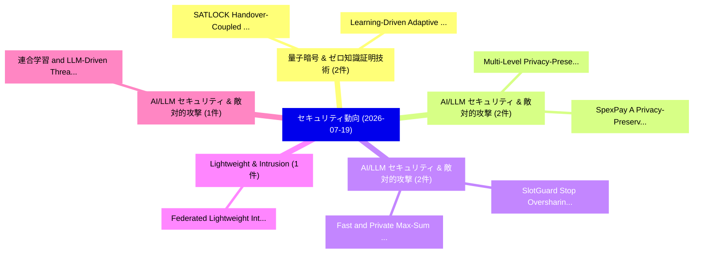

# 📅 02_daily: 日次エグゼクティブサマリー報告書 (2026-07-19)

**集計日時**: 2026-10-02 23:06:19 UTC  
**対象日付**: 2026-07-19  
**本日収集論文数**: 15 件  

---

## 💡 主要セキュリティ動向・脅威インサイト (Executive Insights)

本日の収集論文（計 15 件）において、以下の重点セキュリティ領域で活発な研究動向が確認されました：
- **量子暗号 & ゼロ知識証明技術** (2 件): 注目論文として 「SATLOCK: Handover-Coupled Sche...」、「Learning-Driven Adaptive Audit...」 等が発表され、実務防御および攻撃検証の進展が見られます。
- **AI/LLM セキュリティ & 敵対的攻撃** (2 件): 注目論文として 「Multi-Level Privacy-Preserving...」、「SpexPay: A Privacy-Preserving ...」 等が発表され、実務防御および攻撃検証の進展が見られます。
- **AI/LLM セキュリティ & 敵対的攻撃** (2 件): 注目論文として 「SlotGuard: Stop Oversharing Pr...」、「Fast and Private Max-Sum Diver...」 等が発表され、実務防御および攻撃検証の進展が見られます。
- **Lightweight & Intrusion** (1 件): 注目論文として 「Federated Lightweight Intrusio...」 等が発表され、実務防御および攻撃検証の進展が見られます。
- **AI/LLM セキュリティ & 敵対的攻撃** (1 件): 注目論文として 「連合学習 and LLM-Driven Threat Int...」 等が発表され、実務防御および攻撃検証の進展が見られます。

### 🗺️ 技術・脅威トピックマインドマップ

---

## 📌 日次セキュリティ論文一覧 (日本語表形式)

| No | arXiv ID | 論文タイトル (日本語訳) | 重要キーワード | 構造化エグゼクティブ要約 (背景・提案・影響) | 脅威分類 | 詳細リンク |
|---|---|---|---|---|---|---|
| 1 | `2607.17025v1` | [Federated Lightweight Intrusion Detection in Drone Swarms with Knowledge Distillation（セキュリティ分析論文）](../../okf/papers/2026-07-19/2607.17025.md) | `Federated Lightweight Intrusion Detection`, `Drone Swarms`, `Knowledge Distillation` | 【提案】概要 (Overview & Key Finding) 本論文「Federated Lightweight Intrusion Detection in Drone Swar...。実証評価により経営層・セキュリティ管理者向け推奨アクション (E... | `arXiv` | [arXiv](https://arxiv.org/abs/2607.17025v1) &#124; [OKF](../../okf/papers/2026-07-19/2607.17025.md) |
| 2 | `2607.17035v1` | [連合学習 and LLM-Driven Threat Intelligence for Zero Trust IoT Architecture](../../okf/papers/2026-07-19/2607.17035.md) | `Driven Threat Intelligence`, `Zero Trust`, `LLM-Driven Threat` | 【提案】概要 (Overview & Key Finding) 本論文「連合学習 and LLM-Driven 脅威 Intelligence for ゼロトラスト IoT Arch...。実証評価により経営層・セキュリティ管理者向け推奨アクション (E... | `arXiv` | [arXiv](https://arxiv.org/abs/2607.17035v1) &#124; [OKF](../../okf/papers/2026-07-19/2607.17035.md) |
| 3 | `2607.17075v2` | [A Systematic Evaluation of Traditional プライバシーポリシー Analysis Tools Against LLMs](../../okf/papers/2026-07-19/2607.17075.md) | `Madhav Aryal`, `Sudipa Saha`, `Sunil Manandhar` | 【提案】概要 (Overview & Key Finding) 本論文「A Systematic Evaluation of Traditional プライバシーポリシー Analy...。実証評価により経営層・セキュリティ管理者向け推奨アクション (E... | `arXiv` | [arXiv](https://arxiv.org/abs/2607.17075v2) &#124; [OKF](../../okf/papers/2026-07-19/2607.17075.md) |
| 4 | `2607.17076v3` | [SATLOCK: Handover-Coupled Scheduling for Weather-Resilient Quantum Key Distribution over LEO Constellations（セキュリティ分析論文）](../../okf/papers/2026-07-19/2607.17076.md) | `Resilient Quantum Key Distribution`, `Coupled Scheduling`, `Handover-Coupled Scheduling` | 【提案】概要 (Overview & Key Finding) 本論文「SATLOCK: Handover-Coupled Scheduling for Weather-Resili...。実証評価により経営層・セキュリティ管理者向け推奨アクション (E... | `arXiv` | [arXiv](https://arxiv.org/abs/2607.17076v3) &#124; [OKF](../../okf/papers/2026-07-19/2607.17076.md) |
| 5 | `2607.17098v1` | [Multi-Level Privacy-Preserving Dementia Detection from Speech via Targeted Adversarial Obfuscation and Representation Learning（セキュリティ分析論文）](../../okf/papers/2026-07-19/2607.17098.md) | `Preserving Dementia Detection`, `Targeted Adversarial Obfuscation`, `Level Privacy` | 【提案】概要 (Overview & Key Finding) 本論文「Multi-Level Privacy-Preserving Dementia Detection from ...。実証評価により経営層・セキュリティ管理者向け推奨アクション (E... | `arXiv` | [arXiv](https://arxiv.org/abs/2607.17098v1) &#124; [OKF](../../okf/papers/2026-07-19/2607.17098.md) |
| 6 | `2607.17105v1` | [A Multi-Model Hybrid Defense Approach Against White-box Adversarial Attacks in Computer Network Traffic（セキュリティ分析論文）](../../okf/papers/2026-07-19/2607.17105.md) | `Computer Network Traffic`, `Adversarial Attacks`, `Multi-Model Hybrid` | 【提案】概要 (Overview & Key Finding) 本論文「A Multi-Model Hybrid Defense Approach Against White-box...。実証評価により経営層・セキュリティ管理者向け推奨アクション (E... | `arXiv` | [arXiv](https://arxiv.org/abs/2607.17105v1) &#124; [OKF](../../okf/papers/2026-07-19/2607.17105.md) |
| 7 | `2607.17107v1` | [DSA Nonce Vulnerabilities: An Interactive Analysis（セキュリティ分析論文）](../../okf/papers/2026-07-19/2607.17107.md) | `Nonce Vulnerabilities`, `Rundong Wei`, `Xiaomei Tian` | 【提案】概要 (Overview & Key Finding) 本論文「DSA Nonce Vulnerabilities: An Interactive Analysis（セキュリ...。実証評価により経営層・セキュリティ管理者向け推奨アクション (E... | `arXiv` | [arXiv](https://arxiv.org/abs/2607.17107v1) &#124; [OKF](../../okf/papers/2026-07-19/2607.17107.md) |
| 8 | `2607.17147v1` | [SlotGuard: Stop Oversharing Private Local Context in LLM Agent Transcri（セキュリティ分析論文）](../../okf/papers/2026-07-19/2607.17147.md) | `Stop Oversharing Private Local Context`, `Agent Transcri`, `Haocheng Xia` | 【提案】概要 (Overview & Key Finding) 本論文「SlotGuard: Stop Oversharing Private Local Context in LL...。実証評価により経営層・セキュリティ管理者向け推奨アクション (E... | `arXiv` | [arXiv](https://arxiv.org/abs/2607.17147v1) &#124; [OKF](../../okf/papers/2026-07-19/2607.17147.md) |
| 9 | `2607.17152v1` | [How Jailbreak Attacks Inform Safety Alignment: A Defender-Centric, Shapley-Based Evaluation of Jailbreak Contributions（セキュリティ分析論文）](../../okf/papers/2026-07-19/2607.17152.md) | `Jailbreak Contributions`, `Yukai Zhou`, `Feiyang Lu` | 【提案】概要 (Overview & Key Finding) 本論文「How ジェイルブレイク Attacks Inform Safety Alignment: A Defende...。実証評価により経営層・セキュリティ管理者向け推奨アクション (E... | `arXiv` | [arXiv](https://arxiv.org/abs/2607.17152v1) &#124; [OKF](../../okf/papers/2026-07-19/2607.17152.md) |
| 10 | `2607.17196v1` | [Fast and Private Max-Sum Diversification（セキュリティ分析論文）](../../okf/papers/2026-07-19/2607.17196.md) | `Private Max`, `Sum Diversification`, `Max-Sum Diversification` | 【提案】概要 (Overview & Key Finding) 本論文「Fast and Private Max-Sum Diversification（セキュリティ分析論文）」（原...。実証評価により経営層・セキュリティ管理者向け推奨アクション (E... | `arXiv` | [arXiv](https://arxiv.org/abs/2607.17196v1) &#124; [OKF](../../okf/papers/2026-07-19/2607.17196.md) |
| 11 | `2607.17218v1` | [SpexPay: A Privacy-Preserving Pay-As-You-Go System for Dynamic Spectrum Sharing（セキュリティ分析論文）](../../okf/papers/2026-07-19/2607.17218.md) | `Dynamic Spectrum Sharing`, `Preserving Pay`, `Privacy-Preserving Pay` | 【提案】概要 (Overview & Key Finding) 本論文「SpexPay: A Privacy-Preserving Pay-As-You-Go System for ...。実証評価により経営層・セキュリティ管理者向け推奨アクション (E... | `arXiv` | [arXiv](https://arxiv.org/abs/2607.17218v1) &#124; [OKF](../../okf/papers/2026-07-19/2607.17218.md) |
| 12 | `2607.17279v1` | [Between Safe Boundaries: Exploiting Temporal Consistency for Jailbreaking Text-To-Video Generation Models（セキュリティ分析論文）](../../okf/papers/2026-07-19/2607.17279.md) | `Exploiting Temporal Consistency`, `Video Generation Models`, `Jailbreaking Text` | 【提案】概要 (Overview & Key Finding) 本論文「Between Safe Boundaries: Exploiting Temporal Consistenc...。実証評価により経営層・セキュリティ管理者向け推奨アクション (E... | `arXiv` | [arXiv](https://arxiv.org/abs/2607.17279v1) &#124; [OKF](../../okf/papers/2026-07-19/2607.17279.md) |
| 13 | `2607.17305v1` | [Learning-Driven Adaptive Audit Scheduling: A Sequential Decision Approach to Off-Chain Data Integrity（セキュリティ分析論文）](../../okf/papers/2026-07-19/2607.17305.md) | `Driven Adaptive Audit Scheduling`, `Chain Data Integrity`, `Learning-Driven Adaptive` | 【提案】概要 (Overview & Key Finding) 本論文「Learning-Driven Adaptive Audit Scheduling: A Sequential...。実証評価により経営層・セキュリティ管理者向け推奨アクション (E... | `arXiv` | [arXiv](https://arxiv.org/abs/2607.17305v1) &#124; [OKF](../../okf/papers/2026-07-19/2607.17305.md) |
| 14 | `2607.17328v1` | [Physical Time-Lock Puzzles（セキュリティ分析論文）](../../okf/papers/2026-07-19/2607.17328.md) | `Physical Time`, `Lock Puzzles`, `Time-Lock Puzzles` | 【提案】概要 (Overview & Key Finding) 本論文「Physical Time-Lock Puzzles（セキュリティ分析論文）」（原題: Physical Ti...。実証評価により経営層・セキュリティ管理者向け推奨アクション (E... | `arXiv` | [arXiv](https://arxiv.org/abs/2607.17328v1) &#124; [OKF](../../okf/papers/2026-07-19/2607.17328.md) |
| 15 | `2607.17353v1` | [Measuring and Evaluating the Performance of Generative AI Models for Scam Detection（セキュリティ分析論文）](../../okf/papers/2026-07-19/2607.17353.md) | `Scam Detection`, `Seyed Ali Akhavani`, `Cem Topcuoglu` | 【提案】概要 (Overview & Key Finding) 本論文「Measuring and Evaluating the Performance of Generative ...。実証評価により経営層・セキュリティ管理者向け推奨アクション (E... | `arXiv` | [arXiv](https://arxiv.org/abs/2607.17353v1) &#124; [OKF](../../okf/papers/2026-07-19/2607.17353.md) |

