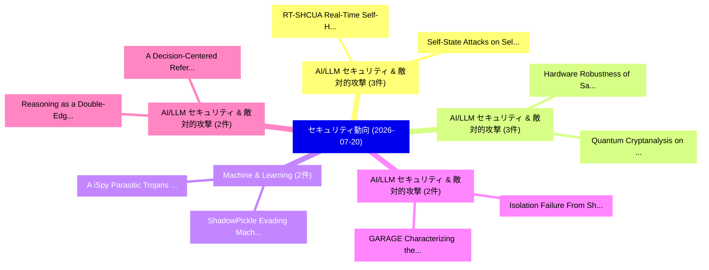

# 📅 02_daily: 日次エグゼクティブサマリー報告書 (2026-07-20)

**集計日時**: 2026-10-02 23:06:20 UTC  
**対象日付**: 2026-07-20  
**本日収集論文数**: 39 件  

---

## 💡 主要セキュリティ動向・脅威インサイト (Executive Insights)

本日の収集論文（計 39 件）において、以下の重点セキュリティ領域で活発な研究動向が確認されました：
- **AI/LLM セキュリティ & 敵対的攻撃** (3 件): 注目論文として 「RT-SHCUA: Real-Time Self-Hoste...」、「Self-State Attacks on Self-Hos...」 等が発表され、実務防御および攻撃検証の進展が見られます。
- **AI/LLM セキュリティ & 敵対的攻撃** (3 件): 注目論文として 「Hardware Robustness of Sample-...」、「Quantum Cryptanalysis on IBM Q...」 等が発表され、実務防御および攻撃検証の進展が見られます。
- **Machine & Learning** (2 件): 注目論文として 「ShadowPickle: Evading Machine ...」、「(A)iSpy: Parasitic Trojans for...」 等が発表され、実務防御および攻撃検証の進展が見られます。
- **AI/LLM セキュリティ & 敵対的攻撃** (2 件): 注目論文として 「Isolation Failure From Shared ...」、「GARAGE: Characterizing the Aut...」 等が発表され、実務防御および攻撃検証の進展が見られます。
- **AI/LLM セキュリティ & 敵対的攻撃** (2 件): 注目論文として 「Reasoning as a Double-Edged Sw...」、「A Decision-Centered Reference ...」 等が発表され、実務防御および攻撃検証の進展が見られます。

### 🗺️ 技術・脅威トピックマインドマップ

---

## 📌 日次セキュリティ論文一覧 (日本語表形式)

| No | arXiv ID | 論文タイトル (日本語訳) | 重要キーワード | 構造化エグゼクティブ要約 (背景・提案・影響) | 脅威分類 | 詳細リンク |
|---|---|---|---|---|---|---|
| 1 | `2607.17445v1` | [The Duality of Information Flow: Reconciling Robust Downgrading with Non-Interference（セキュリティ分析論文）](../../okf/papers/2026-07-20/2607.17445.md) | `Reconciling Robust Downgrading`, `Information Flow`, `Hemant Gouni` | 【提案】概要 (Overview & Key Finding) 本論文「The Duality of Information Flow: Reconciling Robust Dow...。実証評価により経営層・セキュリティ管理者向け推奨アクション (E... | `arXiv` | [arXiv](https://arxiv.org/abs/2607.17445v1) &#124; [OKF](../../okf/papers/2026-07-20/2607.17445.md) |
| 2 | `2607.17503v1` | [ShadowPickle: Evading Machine Learning Model Scanners via Stealthy Pickle Deserialization Attacks（セキュリティ分析論文）](../../okf/papers/2026-07-20/2607.17503.md) | `Evading Machine Learning Model Scanners`, `Stealthy Pickle Deserialization Attacks`, `Dhruv Pradhan` | 【提案】概要 (Overview & Key Finding) 本論文「ShadowPickle: Evading Machine Learning Model Scanners v...。実証評価により経営層・セキュリティ管理者向け推奨アクション (E... | `arXiv` | [arXiv](https://arxiv.org/abs/2607.17503v1) &#124; [OKF](../../okf/papers/2026-07-20/2607.17503.md) |
| 3 | `2607.17518v2` | [Isolation Failure From Shared Storage: Characterizing and Exploiting Page-Cache SCA Leakage Across Containers and VMs（セキュリティ分析論文）](../../okf/papers/2026-07-20/2607.17518.md) | `Leakage Across Containers`, `Exploiting Page`, `Page-Cache SCA` | 【提案】概要 (Overview & Key Finding) 本論文「Isolation Failure From Shared Storage: Characterizing a...。実証評価により経営層・セキュリティ管理者向け推奨アクション (E... | `arXiv` | [arXiv](https://arxiv.org/abs/2607.17518v2) &#124; [OKF](../../okf/papers/2026-07-20/2607.17518.md) |
| 4 | `2607.17535v1` | [Salience Induction against Multi-Hop RAG Agents: Threat and Defense（セキュリティ分析論文）](../../okf/papers/2026-07-20/2607.17535.md) | `Salience Induction`, `Multi-Hop RAG`, `Xingfu Zhou` | 【提案】概要 (Overview & Key Finding) 本論文「Salience Induction against Multi-Hop RAG Agents: 脅威 and...。実証評価により経営層・セキュリティ管理者向け推奨アクション (E... | `arXiv` | [arXiv](https://arxiv.org/abs/2607.17535v1) &#124; [OKF](../../okf/papers/2026-07-20/2607.17535.md) |
| 5 | `2607.17550v1` | [(A)iSpy: Parasitic Trojans for Machine Learning Infrastructure（セキュリティ分析論文）](../../okf/papers/2026-07-20/2607.17550.md) | `Machine Learning Infrastructure`, `Parasitic Trojans`, `Habibur Rahaman` | 【提案】概要 (Overview & Key Finding) 本論文「(A)iSpy: Parasitic Trojans for Machine Learning Infrast...。実証評価により経営層・セキュリティ管理者向け推奨アクション (E... | `arXiv` | [arXiv](https://arxiv.org/abs/2607.17550v1) &#124; [OKF](../../okf/papers/2026-07-20/2607.17550.md) |
| 6 | `2607.17573v2` | [Quantum-Resilient Banking Transaction Security using DW-HKEM: A Hybrid RSA/ML-KEM Cryptographic Gateway with Real-Time Monitoring（セキュリティ分析論文）](../../okf/papers/2026-07-20/2607.17573.md) | `Resilient Banking Transaction Security`, `Cryptographic Gateway`, `Time Monitoring` | 【提案】概要 (Overview & Key Finding) 本論文「量子-Resilient Banking Transaction Security using DW-HKEM...。実証評価により経営層・セキュリティ管理者向け推奨アクション (E... | `arXiv` | [arXiv](https://arxiv.org/abs/2607.17573v2) &#124; [OKF](../../okf/papers/2026-07-20/2607.17573.md) |
| 7 | `2607.17586v1` | [Detection, Attribution, Narration: An End-to-End Pipeline for Explainable Money Mule Identification（セキュリティ分析論文）](../../okf/papers/2026-07-20/2607.17586.md) | `Explainable Money Mule Identification`, `End Pipeline`, `Khairul Amsyar Mohd Razis` | 【提案】概要 (Overview & Key Finding) 本論文「Detection, Attribution, Narration: An End-to-End Pipeli...。実証評価により経営層・セキュリティ管理者向け推奨アクション (E... | `arXiv` | [arXiv](https://arxiv.org/abs/2607.17586v1) &#124; [OKF](../../okf/papers/2026-07-20/2607.17586.md) |
| 8 | `2607.17603v3` | [Protecting Floating-Point Computation for DNN Binaries with MBA Obfuscation（セキュリティ分析論文）](../../okf/papers/2026-07-20/2607.17603.md) | `Protecting Floating`, `Point Computation`, `Floating-Point Computation` | 【提案】概要 (Overview & Key Finding) 本論文「Protecting Floating-Point Computation for DNN Binaries ...。実証評価により経営層・セキュリティ管理者向け推奨アクション (E... | `arXiv` | [arXiv](https://arxiv.org/abs/2607.17603v3) &#124; [OKF](../../okf/papers/2026-07-20/2607.17603.md) |
| 9 | `2607.17619v1` | [Insecure Coding Preferences in Long-Term Memory: Security Risks for LLM-based Code Generation（セキュリティ分析論文）](../../okf/papers/2026-07-20/2607.17619.md) | `Insecure Coding Preferences`, `Term Memory`, `Security Risks` | 【提案】概要 (Overview & Key Finding) 本論文「Insecure Coding Preferences in Long-Term Memory: Securi...。実証評価により経営層・セキュリティ管理者向け推奨アクション (E... | `arXiv` | [arXiv](https://arxiv.org/abs/2607.17619v1) &#124; [OKF](../../okf/papers/2026-07-20/2607.17619.md) |
| 10 | `2607.17786v1` | [Reasoning as a Double-Edged Sword: Architecture and Cross-Stage Robustness in Vision-Language-Action Models（セキュリティ分析論文）](../../okf/papers/2026-07-20/2607.17786.md) | `Edged Sword`, `Double-Edged Sword`, `Stage Robustness` | 【提案】概要 (Overview & Key Finding) 本論文「Reasoning as a Double-Edged Sword: Architecture and Cro...。実証評価により経営層・セキュリティ管理者向け推奨アクション (E... | `arXiv` | [arXiv](https://arxiv.org/abs/2607.17786v1) &#124; [OKF](../../okf/papers/2026-07-20/2607.17786.md) |
| 11 | `2607.17809v1` | [Residual Observability and Attack Detectability in Encrypted OPC UA Traffic（セキュリティ分析論文）](../../okf/papers/2026-07-20/2607.17809.md) | `Residual Observability`, `Attack Detectability`, `Song Son Ha` | 【提案】概要 (Overview & Key Finding) 本論文「Residual Observability and Attack Detectability in Encr...。実証評価により経営層・セキュリティ管理者向け推奨アクション (E... | `arXiv` | [arXiv](https://arxiv.org/abs/2607.17809v1) &#124; [OKF](../../okf/papers/2026-07-20/2607.17809.md) |
| 12 | `2607.17889v1` | [Rate-Distortion Function for Encrypted Traffic Side-Channel Defense（セキュリティ分析論文）](../../okf/papers/2026-07-20/2607.17889.md) | `Encrypted Traffic Side`, `Distortion Function`, `Channel Defense` | 【提案】概要 (Overview & Key Finding) 本論文「Rate-Distortion Function for Encrypted Traffic サイドチャネル攻...。実証評価により経営層・セキュリティ管理者向け推奨アクション (E... | `arXiv` | [arXiv](https://arxiv.org/abs/2607.17889v1) &#124; [OKF](../../okf/papers/2026-07-20/2607.17889.md) |
| 13 | `2607.17951v1` | [RT-SHCUA: Real-Time Self-Hosted Computer-Use Agent for UAV Control（セキュリティ分析論文）](../../okf/papers/2026-07-20/2607.17951.md) | `Time Self`, `Hosted Computer`, `Use Agent` | 【提案】概要 (Overview & Key Finding) 本論文「RT-SHCUA: Real-Time Self-Hosted Computer-Use Agent for ...。実証評価により経営層・セキュリティ管理者向け推奨アクション (E... | `arXiv` | [arXiv](https://arxiv.org/abs/2607.17951v1) &#124; [OKF](../../okf/papers/2026-07-20/2607.17951.md) |
| 14 | `2607.17986v1` | [Self-State Attacks on Self-Hosted AI Agents: How Far Can OS Defenses Go?（セキュリティ分析論文）](../../okf/papers/2026-07-20/2607.17986.md) | `State Attacks`, `Defenses Go`, `Self-State Attacks` | 【提案】### (日本語題名: Self-State Attacks on Self-Hosted AI Agents: How Far Can OS Defenses Go?（セキ...。実証評価により経営層・セキュリティ管理者向け推奨アクション (E... | `arXiv` | [arXiv](https://arxiv.org/abs/2607.17986v1) &#124; [OKF](../../okf/papers/2026-07-20/2607.17986.md) |
| 15 | `2607.18021v1` | [Optimal Domain-Aware Privacy Mechanisms for Synthetic Data Generation（セキュリティ分析論文）](../../okf/papers/2026-07-20/2607.18021.md) | `Aware Privacy Mechanisms`, `Synthetic Data Generation`, `Optimal Domain` | 【提案】概要 (Overview & Key Finding) 本論文「Optimal Domain-Aware Privacy Mechanisms for Synthetic D...。実証評価により経営層・セキュリティ管理者向け推奨アクション (E... | `arXiv` | [arXiv](https://arxiv.org/abs/2607.18021v1) &#124; [OKF](../../okf/papers/2026-07-20/2607.18021.md) |
| 16 | `2607.18063v1` | [Adaptive Adversaries: A Multi-Turn, Multi-LLM Benchmark for LLM Agent Security（セキュリティ分析論文）](../../okf/papers/2026-07-20/2607.18063.md) | `Adaptive Adversaries`, `Agent Security`, `Multi-LLM Benchmark` | 【提案】概要 (Overview & Key Finding) 本論文「Adaptive Adversaries: A Multi-Turn, Multi-LLM Benchmark...。実証評価により経営層・セキュリティ管理者向け推奨アクション (E... | `arXiv` | [arXiv](https://arxiv.org/abs/2607.18063v1) &#124; [OKF](../../okf/papers/2026-07-20/2607.18063.md) |
| 17 | `2607.18108v1` | [GARAGE: Characterizing the Automation Boundary in LLM-based Attack Graph Generation（セキュリティ分析論文）](../../okf/papers/2026-07-20/2607.18108.md) | `Attack Graph Generation`, `Automation Boundary`, `LLM-based Attack` | 【提案】概要 (Overview & Key Finding) 本論文「GARAGE: Characterizing the Automation Boundary in LLM-b...。実証評価により経営層・セキュリティ管理者向け推奨アクション (E... | `arXiv` | [arXiv](https://arxiv.org/abs/2607.18108v1) &#124; [OKF](../../okf/papers/2026-07-20/2607.18108.md) |
| 18 | `2607.18126v1` | [CutBackdoor: A Circuit Cut Triggered Backdoor Attack on Variational Quantum Algorithms（セキュリティ分析論文）](../../okf/papers/2026-07-20/2607.18126.md) | `Circuit Cut Triggered Backdoor Attack`, `Variational Quantum Algorithms`, `Ahatesham Bhuiyan` | 【提案】概要 (Overview & Key Finding) 本論文「CutBackdoor: A Circuit Cut Triggered Backdoor Attack on...。実証評価により経営層・セキュリティ管理者向け推奨アクション (E... | `arXiv` | [arXiv](https://arxiv.org/abs/2607.18126v1) &#124; [OKF](../../okf/papers/2026-07-20/2607.18126.md) |
| 19 | `2607.18169v2` | [RRAM-DP: Device-Calibrated Differential Privacy for In-Memory Edge Learning（セキュリティ分析論文）](../../okf/papers/2026-07-20/2607.18169.md) | `Calibrated Differential Privacy`, `Memory Edge Learning`, `Device-Calibrated Differential` | 【提案】概要 (Overview & Key Finding) 本論文「RRAM-DP: Device-Calibrated 差分プライバシー for In-Memory Edge ...。実証評価により経営層・セキュリティ管理者向け推奨アクション (E... | `arXiv` | [arXiv](https://arxiv.org/abs/2607.18169v2) &#124; [OKF](../../okf/papers/2026-07-20/2607.18169.md) |
| 20 | `2607.18196v1` | [Hardware Robustness of Sample-Based Quantum Diagonalization（セキュリティ分析論文）](../../okf/papers/2026-07-20/2607.18196.md) | `Based Quantum Diagonalization`, `Hardware Robustness`, `Sample-Based Quantum` | 【提案】概要 (Overview & Key Finding) 本論文「Hardware Robustness of Sample-Based 量子 Diagonalization（...。実証評価により経営層・セキュリティ管理者向け推奨アクション (E... | `arXiv` | [arXiv](https://arxiv.org/abs/2607.18196v1) &#124; [OKF](../../okf/papers/2026-07-20/2607.18196.md) |
| 21 | `2607.18339v1` | [Shared Vulnerabilities in Robustness-Optimized Defenses: One Breach Exposes the Family（セキュリティ分析論文）](../../okf/papers/2026-07-20/2607.18339.md) | `One Breach Exposes`, `Shared Vulnerabilities`, `Optimized Defenses` | 【提案】概要 (Overview & Key Finding) 本論文「Shared Vulnerabilities in Robustness-Optimized Defenses...。実証評価により経営層・セキュリティ管理者向け推奨アクション (E... | `arXiv` | [arXiv](https://arxiv.org/abs/2607.18339v1) &#124; [OKF](../../okf/papers/2026-07-20/2607.18339.md) |
| 22 | `2607.18340v1` | [Quantum Cryptanalysis on IBM Quantum Hardware: Extending Even--Mansour Period Recovery from $N=4$ to $N=10$（セキュリティ分析論文）](../../okf/papers/2026-07-20/2607.18340.md) | `Mansour Period Recovery`, `Quantum Cryptanalysis`, `Quantum Hardware` | 【提案】概要 (Overview & Key Finding) 本論文「量子 Cryptanalysis on IBM 量子 Hardware: Extending Even--Ma...。実証評価により経営層・セキュリティ管理者向け推奨アクション (E... | `arXiv` | [arXiv](https://arxiv.org/abs/2607.18340v1) &#124; [OKF](../../okf/papers/2026-07-20/2607.18340.md) |
| 23 | `2607.18342v1` | [PRISM: Sensitivity-Aware PolynoMial PRuning for EffIcient Neural Network Encryption（セキュリティ分析論文）](../../okf/papers/2026-07-20/2607.18342.md) | `Neural Network Encryption`, `Sensitivity-Aware PolynoMial`, `Neural Network Encryptio` | 【提案】概要 (Overview & Key Finding) 本論文「PRISM: Sensitivity-Aware PolynoMial PRuning for EffIcie...。実証評価により経営層・セキュリティ管理者向け推奨アクション (E... | `arXiv` | [arXiv](https://arxiv.org/abs/2607.18342v1) &#124; [OKF](../../okf/papers/2026-07-20/2607.18342.md) |
| 24 | `2607.18347v1` | [A Decision-Centered Reference Architecture for Trustworthy Agentic Commerce（セキュリティ分析論文）](../../okf/papers/2026-07-20/2607.18347.md) | `Centered Reference Architecture`, `Trustworthy Agentic Commerce`, `Decision-Centered Reference` | 【提案】概要 (Overview & Key Finding) 本論文「A Decision-Centered Reference Architecture for Trustwor...。実証評価により経営層・セキュリティ管理者向け推奨アクション (E... | `arXiv` | [arXiv](https://arxiv.org/abs/2607.18347v1) &#124; [OKF](../../okf/papers/2026-07-20/2607.18347.md) |
| 25 | `2607.18360v1` | [HALLMARK: Diagnosing Three Failure Modes in LLM Citation Verifiers（セキュリティ分析論文）](../../okf/papers/2026-07-20/2607.18360.md) | `Diagnosing Three Failure Modes`, `Citation Verifiers`, `Patrik Reizinger` | 【提案】概要 (Overview & Key Finding) 本論文「HALLMARK: Diagnosing Three Failure Modes in LLM Citatio...。実証評価により経営層・セキュリティ管理者向け推奨アクション (E... | `arXiv` | [arXiv](https://arxiv.org/abs/2607.18360v1) &#124; [OKF](../../okf/papers/2026-07-20/2607.18360.md) |
| 26 | `2607.18429v1` | [Adversarial Robustness of Phishing Email Detection: A Comparative Study of TF-IDF + Logistic Regression and Fine-Tuned DistilBERT（セキュリティ分析論文）](../../okf/papers/2026-07-20/2607.18429.md) | `Phishing Email Detection`, `Adversarial Robustness`, `Logistic Regression` | 【提案】概要 (Overview & Key Finding) 本論文「Adversarial Robustness of Phishing Email Detection: A C...。実証評価により経営層・セキュリティ管理者向け推奨アクション (E... | `arXiv` | [arXiv](https://arxiv.org/abs/2607.18429v1) &#124; [OKF](../../okf/papers/2026-07-20/2607.18429.md) |
| 27 | `2607.18445v1` | [ChainMark: Model-Free LLM Watermarking with Closed-Form Calibration（セキュリティ分析論文）](../../okf/papers/2026-07-20/2607.18445.md) | `Form Calibration`, `Model-Free LLM`, `Closed-Form Calibration` | 【提案】概要 (Overview & Key Finding) 本論文「ChainMark: Model-Free LLM Watermarking with Closed-Form...。実証評価により経営層・セキュリティ管理者向け推奨アクション (E... | `arXiv` | [arXiv](https://arxiv.org/abs/2607.18445v1) &#124; [OKF](../../okf/papers/2026-07-20/2607.18445.md) |
| 28 | `2607.18452v1` | [0-Cyclic Equalizability of Binary Words Characterized by Hamming Weight（セキュリティ分析論文）](../../okf/papers/2026-07-20/2607.18452.md) | `Binary Words Characterized`, `Cyclic Equalizability`, `Hamming Weight` | 【提案】概要 (Overview & Key Finding) 本論文「0-Cyclic Equalizability of Binary Words Characterized b...。実証評価により経営層・セキュリティ管理者向け推奨アクション (E... | `arXiv` | [arXiv](https://arxiv.org/abs/2607.18452v1) &#124; [OKF](../../okf/papers/2026-07-20/2607.18452.md) |
| 29 | `2607.18485v1` | [Trusted Credentials, Untrusted Behavior: LLM-Agent Security in High-Performance Computingのベンチマーク評価](../../okf/papers/2026-07-20/2607.18485.md) | `Trusted Credentials`, `Untrusted Behavior`, `Agent Security` | 【提案】概要 (Overview & Key Finding) 本論文「Trusted Credentials, Untrusted Behavior: LLM-Agent Secu...。実証評価により経営層・セキュリティ管理者向け推奨アクション (E... | `arXiv` | [arXiv](https://arxiv.org/abs/2607.18485v1) &#124; [OKF](../../okf/papers/2026-07-20/2607.18485.md) |
| 30 | `2607.18496v3` | [an Automated Test of LLM Security Knowledgeに向けて](../../okf/papers/2026-07-20/2607.18496.md) | `Automated Test`, `Security Knowledge`, `Shufan Chai` | 【提案】概要 (Overview & Key Finding) 本論文「an Automated Test of LLM Security Knowledgeに向けて」（原題: To...。実証評価により経営層・セキュリティ管理者向け推奨アクション (E... | `arXiv` | [arXiv](https://arxiv.org/abs/2607.18496v3) &#124; [OKF](../../okf/papers/2026-07-20/2607.18496.md) |
| 31 | `2607.18533v1` | [PIP-NTT: a Scalable Memory-Parallelized Accelerator for Iterative NTT in PQCに向けて](../../okf/papers/2026-07-20/2607.18533.md) | `Scalable Memory`, `Parallelized Accelerator`, `Memory-Parallelized Accelerator` | 【提案】概要 (Overview & Key Finding) 本論文「PIP-NTT: a Scalable Memory-Parallelized Accelerator for...。実証評価により経営層・セキュリティ管理者向け推奨アクション (E... | `arXiv` | [arXiv](https://arxiv.org/abs/2607.18533v1) &#124; [OKF](../../okf/papers/2026-07-20/2607.18533.md) |
| 32 | `2607.18538v2` | [CryptanalysisBench: Can LLMs do Cryptanalysis?（セキュリティ分析論文）](../../okf/papers/2026-07-20/2607.18538.md) | `Lukas Fluri`, `Avital Shafran`, `Nicholas Carlini` | 【提案】### (日本語題名: CryptanalysisBench: Can LLMs do Cryptanalysis?（セキュリティ分析論文）)  > [!NOTE] > **...。実証評価により経営層・セキュリティ管理者向け推奨アクション (E... | `arXiv` | [arXiv](https://arxiv.org/abs/2607.18538v2) &#124; [OKF](../../okf/papers/2026-07-20/2607.18538.md) |
| 33 | `2607.18567v1` | [Attacking Graph Foundation Models Through Their Shared Representation（セキュリティ分析論文）](../../okf/papers/2026-07-20/2607.18567.md) | `Pankaj Kumar`, `Subhankar Mishra`, `Raw Meta` | 【提案】概要 (Overview & Key Finding) 本論文「Attacking Graph Foundation Models Through Their Shared ...。実証評価により経営層・セキュリティ管理者向け推奨アクション (E... | `arXiv` | [arXiv](https://arxiv.org/abs/2607.18567v1) &#124; [OKF](../../okf/papers/2026-07-20/2607.18567.md) |
| 34 | `2607.18575v1` | [RECEIPT: Deterministic, Reward-Hacking-Resistant Verification for White-Box Agentic XSS Discovery（セキュリティ分析論文）](../../okf/papers/2026-07-20/2607.18575.md) | `Resistant Verification`, `Box Agentic`, `White-Box Agentic` | 【提案】概要 (Overview & Key Finding) 本論文「RECEIPT: Deterministic, Reward-Hacking-Resistant Verifi...。実証評価により経営層・セキュリティ管理者向け推奨アクション (E... | `arXiv` | [arXiv](https://arxiv.org/abs/2607.18575v1) &#124; [OKF](../../okf/papers/2026-07-20/2607.18575.md) |
| 35 | `2607.19424v1` | [JailMeter: An Evidence-Based Evaluation Framework for Jailbreak Attacks on 大規模言語モデル](../../okf/papers/2026-07-20/2607.19424.md) | `Jailbreak Attacks`, `Large Language Models`, `Qingjia Huang` | 【提案】概要 (Overview & Key Finding) 本論文「JailMeter: An Evidence-Based Evaluation Framework for ジ...。実証評価により経営層・セキュリティ管理者向け推奨アクション (E... | `arXiv` | [arXiv](https://arxiv.org/abs/2607.19424v1) &#124; [OKF](../../okf/papers/2026-07-20/2607.19424.md) |
| 36 | `2607.19430v2` | [ChannelGuard: Safe Models Do Not Compose into Safe Multi-Agent Systems（セキュリティ分析論文）](../../okf/papers/2026-07-20/2607.19430.md) | `Safe Multi`, `Agent Systems`, `Multi-Agent Systems` | 【提案】背景とセキュリティ上の課題 (Background & Problem) 本研究はサイバー脅威環境におけるセキュリティ構造・脆弱性の検証を目的としています。(主要検出項目: ...。実証評価により経営層・セキュリティ管理者向け推奨アクション (E... | `arXiv` | [arXiv](https://arxiv.org/abs/2607.19430v2) &#124; [OKF](../../okf/papers/2026-07-20/2607.19430.md) |
| 37 | `2607.19432v1` | [ChainWatch: A Kill Chain-Aligned Sequential Detection Framework for Multi-Step Attacks in MCP-Based AI Agent Systems（セキュリティ分析論文）](../../okf/papers/2026-07-20/2607.19432.md) | `Kill Chain`, `Step Attacks`, `Agent Systems` | 【提案】概要 (Overview & Key Finding) 本論文「ChainWatch: A Kill Chain-Aligned Sequential Detection F...。実証評価により経営層・セキュリティ管理者向け推奨アクション (E... | `arXiv` | [arXiv](https://arxiv.org/abs/2607.19432v1) &#124; [OKF](../../okf/papers/2026-07-20/2607.19432.md) |
| 38 | `2607.19433v1` | [The Chronos Vulnerability: A Taxonomy of Temporal Persistence and Memory-Based Deception in Agentic AI（セキュリティ分析論文）](../../okf/papers/2026-07-20/2607.19433.md) | `Temporal Persistence`, `Based Deception`, `Memory-Based Deception` | 【提案】概要 (Overview & Key Finding) 本論文「The Chronos 脆弱性: A Taxonomy of Temporal Persistence and...。実証評価により経営層・セキュリティ管理者向け推奨アクション (E... | `arXiv` | [arXiv](https://arxiv.org/abs/2607.19433v1) &#124; [OKF](../../okf/papers/2026-07-20/2607.19433.md) |
| 39 | `2607.20564v2` | [PhantomSeal: Proactive Deepfakes Defense with Identity/Context Protection and Forensic Tracing（セキュリティ分析論文）](../../okf/papers/2026-07-20/2607.20564.md) | `Proactive Deepfakes Defense`, `Context Protection`, `Forensic Tracing` | 【提案】概要 (Overview & Key Finding) 本論文「PhantomSeal: Proactive Deepfakes Defense with Identity/...。実証評価により経営層・セキュリティ管理者向け推奨アクション (E... | `arXiv` | [arXiv](https://arxiv.org/abs/2607.20564v2) &#124; [OKF](../../okf/papers/2026-07-20/2607.20564.md) |

