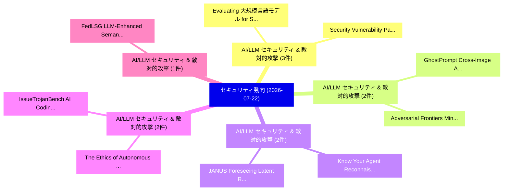

# 📅 02_daily: 日次エグゼクティブサマリー報告書 (2026-07-22)

**集計日時**: 2026-10-02 23:06:20 UTC  
**対象日付**: 2026-07-22  
**本日収集論文数**: 27 件  

---

## 💡 主要セキュリティ動向・脅威インサイト (Executive Insights)

本日の収集論文（計 27 件）において、以下の重点セキュリティ領域で活発な研究動向が確認されました：
- **AI/LLM セキュリティ & 敵対的攻撃** (3 件): 注目論文として 「Evaluating 大規模言語モデル for Symbol...」、「Security Vulnerability Pattern...」 等が発表され、実務防御および攻撃検証の進展が見られます。
- **AI/LLM セキュリティ & 敵対的攻撃** (2 件): 注目論文として 「GhostPrompt: Cross-Image Adver...」、「Adversarial Frontiers: Minimum...」 等が発表され、実務防御および攻撃検証の進展が見られます。
- **AI/LLM セキュリティ & 敵対的攻撃** (2 件): 注目論文として 「Know Your Agent: Reconnaissanc...」、「JANUS: Foreseeing Latent Risk ...」 等が発表され、実務防御および攻撃検証の進展が見られます。
- **AI/LLM セキュリティ & 敵対的攻撃** (2 件): 注目論文として 「The Ethics of Autonomous AI Ag...」、「IssueTrojanBench: AI Coding Ag...」 等が発表され、実務防御および攻撃検証の進展が見られます。
- **AI/LLM セキュリティ & 敵対的攻撃** (1 件): 注目論文として 「FedLSG: LLM-Enhanced Semantic ...」 等が発表され、実務防御および攻撃検証の進展が見られます。

### 🗺️ 技術・脅威トピックマインドマップ

---

## 📌 日次セキュリティ論文一覧 (日本語表形式)

| No | arXiv ID | 論文タイトル (日本語訳) | 重要キーワード | 構造化エグゼクティブ要約 (背景・提案・影響) | 脅威分類 | 詳細リンク |
|---|---|---|---|---|---|---|
| 1 | `2607.19674v1` | [FedLSG: LLM-Enhanced Semantic Calibration for Federated Graph Backdoor Defense（セキュリティ分析論文）](../../okf/papers/2026-07-22/2607.19674.md) | `Federated Graph Backdoor Defense`, `Enhanced Semantic Calibration`, `LLM-Enhanced Semantic` | 【提案】概要 (Overview & Key Finding) 本論文「FedLSG: LLM-Enhanced Semantic Calibration for Federated...。実証評価により経営層・セキュリティ管理者向け推奨アクション (E... | `arXiv` | [arXiv](https://arxiv.org/abs/2607.19674v1) &#124; [OKF](../../okf/papers/2026-07-22/2607.19674.md) |
| 2 | `2607.19683v1` | [GhostPrompt: Cross-Image Adversarial Prompt for Vision-Language Models（セキュリティ分析論文）](../../okf/papers/2026-07-22/2607.19683.md) | `Image Adversarial Prompt`, `Language Models`, `Cross-Image Adversarial` | 【提案】概要 (Overview & Key Finding) 本論文「GhostPrompt: Cross-Image Adversarial Prompt for Vision-...。実証評価により経営層・セキュリティ管理者向け推奨アクション (E... | `arXiv` | [arXiv](https://arxiv.org/abs/2607.19683v1) &#124; [OKF](../../okf/papers/2026-07-22/2607.19683.md) |
| 3 | `2607.19742v1` | [An Automated Framework for Extracting Reachable Attack Chains from Cyber Threat Intelligence Reports（セキュリティ分析論文）](../../okf/papers/2026-07-22/2607.19742.md) | `Extracting Reachable Attack Chains`, `Cyber Threat Intelligence Reports`, `Cyber Threat Intel` | 【提案】概要 (Overview & Key Finding) 本論文「An Automated Framework for Extracting Reachable Attack ...。実証評価により経営層・セキュリティ管理者向け推奨アクション (E... | `arXiv` | [arXiv](https://arxiv.org/abs/2607.19742v1) &#124; [OKF](../../okf/papers/2026-07-22/2607.19742.md) |
| 4 | `2607.19829v1` | [DARWIN: Evolving Jailbreak Adversary and Guardrail for LLM Safety Evaluation and Protection（セキュリティ分析論文）](../../okf/papers/2026-07-22/2607.19829.md) | `Evolving Jailbreak Adversary`, `Weiwei Qi`, `Zefeng Wu` | 【提案】概要 (Overview & Key Finding) 本論文「DARWIN: Evolving ジェイルブレイク Adversary and Guardrail for L...。実証評価により経営層・セキュリティ管理者向け推奨アクション (E... | `arXiv` | [arXiv](https://arxiv.org/abs/2607.19829v1) &#124; [OKF](../../okf/papers/2026-07-22/2607.19829.md) |
| 5 | `2607.19837v1` | [Know Your Agent: Reconnaissance-Driven Pentesting of AI Agents（セキュリティ分析論文）](../../okf/papers/2026-07-22/2607.19837.md) | `Driven Pentesting`, `Reconnaissance-Driven Pentesting`, `Eyal Lenga` | 【提案】概要 (Overview & Key Finding) 本論文「Know Your Agent: Reconnaissance-Driven Pentesting of AI...。実証評価により経営層・セキュリティ管理者向け推奨アクション (E... | `arXiv` | [arXiv](https://arxiv.org/abs/2607.19837v1) &#124; [OKF](../../okf/papers/2026-07-22/2607.19837.md) |
| 6 | `2607.19855v1` | [Adversarial Frontiers: Minimum-Norm Attack Ensembles for Robustness Evaluation（セキュリティ分析論文）](../../okf/papers/2026-07-22/2607.19855.md) | `Norm Attack Ensembles`, `Adversarial Frontiers`, `Minimum-Norm Attack` | 【提案】概要 (Overview & Key Finding) 本論文「Adversarial Frontiers: Minimum-Norm Attack Ensembles fo...。実証評価により経営層・セキュリティ管理者向け推奨アクション (E... | `arXiv` | [arXiv](https://arxiv.org/abs/2607.19855v1) &#124; [OKF](../../okf/papers/2026-07-22/2607.19855.md) |
| 7 | `2607.19894v1` | [Defense Against LLM Backdoors using Critical Neuron Isolation Pruning（セキュリティ分析論文）](../../okf/papers/2026-07-22/2607.19894.md) | `Critical Neuron Isolation Pruning`, `Yuxi Li`, `Zhibo Zhang` | 【提案】概要 (Overview & Key Finding) 本論文「Defense Against LLM Backdoors using Critical Neuron Iso...。実証評価により経営層・セキュリティ管理者向け推奨アクション (E... | `arXiv` | [arXiv](https://arxiv.org/abs/2607.19894v1) &#124; [OKF](../../okf/papers/2026-07-22/2607.19894.md) |
| 8 | `2607.19913v1` | [JANUS: Foreseeing Latent Risk for Long-Horizon Agent Safety（セキュリティ分析論文）](../../okf/papers/2026-07-22/2607.19913.md) | `Foreseeing Latent Risk`, `Horizon Agent Safety`, `Long-Horizon Agent` | 【提案】概要 (Overview & Key Finding) 本論文「JANUS: Foreseeing Latent Risk for Long-Horizon Agent Sa...。実証評価により経営層・セキュリティ管理者向け推奨アクション (E... | `arXiv` | [arXiv](https://arxiv.org/abs/2607.19913v1) &#124; [OKF](../../okf/papers/2026-07-22/2607.19913.md) |
| 9 | `2607.19957v2` | [HijackKV: New Threat in Position-Independent KV Cache Reuse（セキュリティ分析論文）](../../okf/papers/2026-07-22/2607.19957.md) | `New Threat`, `Cache Reuse`, `Position-Independent KV` | 【提案】概要 (Overview & Key Finding) 本論文「HijackKV: New 脅威 in Position-Independent KV Cache Reuse...。実証評価により経営層・セキュリティ管理者向け推奨アクション (E... | `arXiv` | [arXiv](https://arxiv.org/abs/2607.19957v2) &#124; [OKF](../../okf/papers/2026-07-22/2607.19957.md) |
| 10 | `2607.20003v1` | [Taming the Security-Energy Paradox: A Green AI Approach to Optimized Android マルウェア検出](../../okf/papers/2026-07-22/2607.20003.md) | `Energy Paradox`, `Security-Energy Paradox`, `Optimized Android Malware Detection` | 【提案】概要 (Overview & Key Finding) 本論文「Taming the Security-Energy Paradox: A Green AI Approach...。実証評価により経営層・セキュリティ管理者向け推奨アクション (E... | `arXiv` | [arXiv](https://arxiv.org/abs/2607.20003v1) &#124; [OKF](../../okf/papers/2026-07-22/2607.20003.md) |
| 11 | `2607.20176v1` | [ISAC-Assisted Channel Knowledge Map Generation for Physical Layer Authentication（セキュリティ分析論文）](../../okf/papers/2026-07-22/2607.20176.md) | `Assisted Channel Knowledge Map Generation`, `Physical Layer Authentication`, `ISAC-Assisted Channel` | 【提案】概要 (Overview & Key Finding) 本論文「ISAC-Assisted Channel Knowledge Map Generation for Phys...。実証評価により経営層・セキュリティ管理者向け推奨アクション (E... | `arXiv` | [arXiv](https://arxiv.org/abs/2607.20176v1) &#124; [OKF](../../okf/papers/2026-07-22/2607.20176.md) |
| 12 | `2607.20216v1` | [Small, Free, and Effective: Orchestrating Open-Weight Small Language Models to Outperform Single LLM for Malware Analysis（セキュリティ分析論文）](../../okf/papers/2026-07-22/2607.20216.md) | `Weight Small Language Models`, `Orchestrating Open`, `Outperform Single` | 【提案】概要 (Overview & Key Finding) 本論文「Small, Free, and Effective: Orchestrating Open-Weight S...。実証評価により経営層・セキュリティ管理者向け推奨アクション (E... | `arXiv` | [arXiv](https://arxiv.org/abs/2607.20216v1) &#124; [OKF](../../okf/papers/2026-07-22/2607.20216.md) |
| 13 | `2607.20255v2` | [The Ethics of Autonomous AI Agents for Offensive Security（セキュリティ分析論文）](../../okf/papers/2026-07-22/2607.20255.md) | `Offensive Security`, `Andreas Happe`, `Jasmin Wachter` | 【提案】概要 (Overview & Key Finding) 本論文「The Ethics of Autonomous AI Agents for Offensive Securi...。実証評価により経営層・セキュリティ管理者向け推奨アクション (E... | `arXiv` | [arXiv](https://arxiv.org/abs/2607.20255v2) &#124; [OKF](../../okf/papers/2026-07-22/2607.20255.md) |
| 14 | `2607.20280v1` | [Chained Attacks on Drone-Based 連合学習: From Network Disruption to Device Impersonation](../../okf/papers/2026-07-22/2607.20280.md) | `Chained Attacks`, `Device Impersonation`, `Based Federated Learning` | 【提案】概要 (Overview & Key Finding) 本論文「Chained Attacks on Drone-Based 連合学習: From Network Disru...。実証評価により経営層・セキュリティ管理者向け推奨アクション (E... | `arXiv` | [arXiv](https://arxiv.org/abs/2607.20280v1) &#124; [OKF](../../okf/papers/2026-07-22/2607.20280.md) |
| 15 | `2607.20305v1` | [Constant-time decoding of Gabidulin codes and their generalizations with application to RQC（セキュリティ分析論文）](../../okf/papers/2026-07-22/2607.20305.md) | `Constant-time decoding`, `Nicolas Aragon`, `Anthony Fraga` | 【提案】概要 (Overview & Key Finding) 本論文「Constant-time decoding of Gabidulin codes and their gen...。実証評価により経営層・セキュリティ管理者向け推奨アクション (E... | `arXiv` | [arXiv](https://arxiv.org/abs/2607.20305v1) &#124; [OKF](../../okf/papers/2026-07-22/2607.20305.md) |
| 16 | `2607.20418v2` | [Pure-DP Statistical Query Release at the Conjectured Square-Root Rate（セキュリティ分析論文）](../../okf/papers/2026-07-22/2607.20418.md) | `Statistical Query Release`, `Conjectured Square`, `Root Rate` | 【提案】概要 (Overview & Key Finding) 本論文「Pure-DP Statistical Query Release at the Conjectured Sq...。実証評価により経営層・セキュリティ管理者向け推奨アクション (E... | `arXiv` | [arXiv](https://arxiv.org/abs/2607.20418v2) &#124; [OKF](../../okf/papers/2026-07-22/2607.20418.md) |
| 17 | `2607.20574v1` | [AuthProbe: Specification-Driven, Multi-Identity Broken Object-Level Authorization in Recruitment APIの検出](../../okf/papers/2026-07-22/2607.20574.md) | `Level Authorization`, `Object-Level Authorization`, `Identity Broken Object` | 【提案】概要 (Overview & Key Finding) 本論文「AuthProbe: Specification-Driven, Multi-Identity Broken ...。実証評価により経営層・セキュリティ管理者向け推奨アクション (E... | `arXiv` | [arXiv](https://arxiv.org/abs/2607.20574v1) &#124; [OKF](../../okf/papers/2026-07-22/2607.20574.md) |
| 18 | `2607.20579v1` | [Deepfake News Detection: A Multimodal Framework Integrating LipNet, DeepSpeech and ResNET for Enhanced Audio-Visual Analysis（セキュリティ分析論文）](../../okf/papers/2026-07-22/2607.20579.md) | `Deepfake News Detection`, `Enhanced Audio`, `Muhammad Ahsan Aziz` | 【提案】概要 (Overview & Key Finding) 本論文「Deepfake News Detection: A Multimodal Framework Integra...。実証評価により経営層・セキュリティ管理者向け推奨アクション (E... | `arXiv` | [arXiv](https://arxiv.org/abs/2607.20579v1) &#124; [OKF](../../okf/papers/2026-07-22/2607.20579.md) |
| 19 | `2607.20581v1` | [Geometric Configurations of Perturbed Jailbreak Prompts（セキュリティ分析論文）](../../okf/papers/2026-07-22/2607.20581.md) | `Perturbed Jailbreak Prompts`, `Geometric Configurations`, `Lynn Delcon` | 【提案】概要 (Overview & Key Finding) 本論文「Geometric Configurations of Perturbed ジェイルブレイク Prompts（...。実証評価により経営層・セキュリティ管理者向け推奨アクション (E... | `arXiv` | [arXiv](https://arxiv.org/abs/2607.20581v1) &#124; [OKF](../../okf/papers/2026-07-22/2607.20581.md) |
| 20 | `2607.20686v1` | [Enhancing Attack Detection Capabilities in BACnet/IP Networks Using Machine-Learning Models（セキュリティ分析論文）](../../okf/papers/2026-07-22/2607.20686.md) | `Enhancing Attack Detection Capabilities`, `Networks Using Machine`, `Learning Models` | 【提案】概要 (Overview & Key Finding) 本論文「Enhancing Attack Detection Capabilities in BACnet/IP Ne...。実証評価により経営層・セキュリティ管理者向け推奨アクション (E... | `arXiv` | [arXiv](https://arxiv.org/abs/2607.20686v1) &#124; [OKF](../../okf/papers/2026-07-22/2607.20686.md) |
| 21 | `2607.20698v1` | [Buzz to Boom: Detecting Message Progression Vulnerabilities in Electron Applications via Segmented Directed Fuzzing（セキュリティ分析論文）](../../okf/papers/2026-07-22/2607.20698.md) | `Detecting Message Progression Vulnerabilities`, `Segmented Directed Fuzzing`, `Electron Applications` | 【提案】概要 (Overview & Key Finding) 本論文「Buzz to Boom: Detecting Message Progression Vulnerabili...。実証評価により経営層・セキュリティ管理者向け推奨アクション (E... | `arXiv` | [arXiv](https://arxiv.org/abs/2607.20698v1) &#124; [OKF](../../okf/papers/2026-07-22/2607.20698.md) |
| 22 | `2607.20712v1` | [Evaluating 大規模言語モデル for Symbolic Security Protocol Analysis](../../okf/papers/2026-07-22/2607.20712.md) | `Evaluating Large Language Models`, `Paolo Modesti`, `Syed Ahmed` | 【提案】概要 (Overview & Key Finding) 本論文「Evaluating 大規模言語モデル for Symbolic Security Protocol Anal...。実証評価により経営層・セキュリティ管理者向け推奨アクション (E... | `arXiv` | [arXiv](https://arxiv.org/abs/2607.20712v1) &#124; [OKF](../../okf/papers/2026-07-22/2607.20712.md) |
| 23 | `2607.20713v1` | [Security Vulnerability Patterns in AI-Generated Code: A Cross-Model Comparative Study（セキュリティ分析論文）](../../okf/papers/2026-07-22/2607.20713.md) | `Security Vulnerability Patterns`, `Generated Code`, `AI-Generated Code` | 【提案】概要 (Overview & Key Finding) 本論文「Security 脆弱性 Patterns in AI-Generated Code: A Cross-Mod...。実証評価により経営層・セキュリティ管理者向け推奨アクション (E... | `arXiv` | [arXiv](https://arxiv.org/abs/2607.20713v1) &#124; [OKF](../../okf/papers/2026-07-22/2607.20713.md) |
| 24 | `2607.20723v1` | [Leaky Language Models: Stealing Architecture and Inference Optimizations via Per-Token Timing（セキュリティ分析論文）](../../okf/papers/2026-07-22/2607.20723.md) | `Leaky Language Models`, `Stealing Architecture`, `Inference Optimizations` | 【提案】概要 (Overview & Key Finding) 本論文「Leaky Language Models: Stealing Architecture and Infere...。実証評価により経営層・セキュリティ管理者向け推奨アクション (E... | `arXiv` | [arXiv](https://arxiv.org/abs/2607.20723v1) &#124; [OKF](../../okf/papers/2026-07-22/2607.20723.md) |
| 25 | `2607.20727v1` | [Edit-Neighboring Data Streams and Privacy under Continual Observation（セキュリティ分析論文）](../../okf/papers/2026-07-22/2607.20727.md) | `Neighboring Data Streams`, `Continual Observation`, `Edit-Neighboring Data` | 【提案】概要 (Overview & Key Finding) 本論文「Edit-Neighboring Data Streams and Privacy under Continu...。実証評価により経営層・セキュリティ管理者向け推奨アクション (E... | `arXiv` | [arXiv](https://arxiv.org/abs/2607.20727v1) &#124; [OKF](../../okf/papers/2026-07-22/2607.20727.md) |
| 26 | `2607.20730v1` | [GPE: Evaluating Robust Evidence Aggregation for Fact Verification under Controllable GEO-Style Poisoning（セキュリティ分析論文）](../../okf/papers/2026-07-22/2607.20730.md) | `Evaluating Robust Evidence Aggregation`, `Fact Verification`, `Style Poisoning` | 【提案】概要 (Overview & Key Finding) 本論文「GPE: Evaluating Robust Evidence Aggregation for Fact Ve...。実証評価により# GPE: Evaluating Robust ... | `arXiv` | [arXiv](https://arxiv.org/abs/2607.20730v1) &#124; [OKF](../../okf/papers/2026-07-22/2607.20730.md) |
| 27 | `2607.20759v1` | [IssueTrojanBench: AI Coding Agents Against Malicious Issue Requestsのベンチマーク評価](../../okf/papers/2026-07-22/2607.20759.md) | `Ankur Singh`, `Jinqiu Yang`, `Hsun Chen` | 【提案】概要 (Overview & Key Finding) 本論文「IssueTrojanBench: AI Coding Agents Against Malicious Is...。実証評価により経営層・セキュリティ管理者向け推奨アクション (E... | `arXiv` | [arXiv](https://arxiv.org/abs/2607.20759v1) &#124; [OKF](../../okf/papers/2026-07-22/2607.20759.md) |

