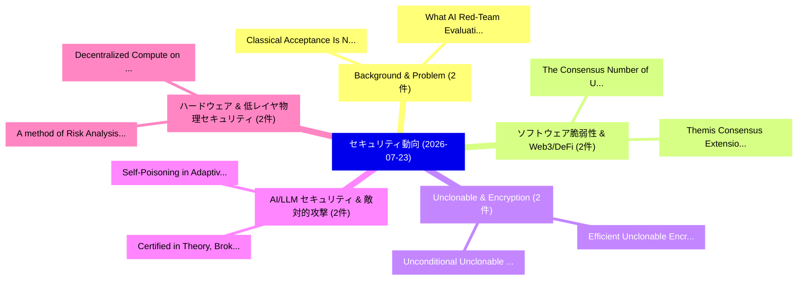

# 📅 02_daily: 日次エグゼクティブサマリー報告書 (2026-07-23)

**集計日時**: 2026-10-02 23:06:20 UTC  
**対象日付**: 2026-07-23  
**本日収集論文数**: 24 件  

---

## 💡 主要セキュリティ動向・脅威インサイト (Executive Insights)

本日の収集論文（計 24 件）において、以下の重点セキュリティ領域で活発な研究動向が確認されました：
- **Background & Problem** (2 件): 注目論文として 「Classical Acceptance Is Not Hy...」、「What AI Red-Team Evaluations C...」 等が発表され、実務防御および攻撃検証の進展が見られます。
- **ソフトウェア脆弱性 & Web3/DeFi** (2 件): 注目論文として 「The Consensus Number of Untrac...」、「Themis Consensus Extension v1:...」 等が発表され、実務防御および攻撃検証の進展が見られます。
- **Unclonable & Encryption** (2 件): 注目論文として 「Unconditional Unclonable Encry...」、「Efficient Unclonable Encryptio...」 等が発表され、実務防御および攻撃検証の進展が見られます。
- **AI/LLM セキュリティ & 敵対的攻撃** (2 件): 注目論文として 「Self-Poisoning in Adaptive Out...」、「Certified in Theory, Broken in...」 等が発表され、実務防御および攻撃検証の進展が見られます。
- **ハードウェア & 低レイヤ物理セキュリティ** (2 件): 注目論文として 「A method of Risk Analysis and ...」、「Decentralized Compute on Untru...」 等が発表され、実務防御および攻撃検証の進展が見られます。

### 🗺️ 技術・脅威トピックマインドマップ

---

## 📌 日次セキュリティ論文一覧 (日本語表形式)

| No | arXiv ID | 論文タイトル (日本語訳) | 重要キーワード | 構造化エグゼクティブ要約 (背景・提案・影響) | 脅威分類 | 詳細リンク |
|---|---|---|---|---|---|---|
| 1 | `2607.20800v3` | [Classical Acceptance Is Not Hybrid Authentication: Validation Policy and Lifecycle Management of Hybrid X.509 Certificates in Deployed Open-Source Stacks（セキュリティ分析論文）](../../okf/papers/2026-07-23/2607.20800.md) | `Validation Policy`, `Lifecycle Management`, `Deployed Open` | 【提案】背景とセキュリティ上の課題 (Background & Problem) 本研究はサイバー脅威環境におけるセキュリティ構造・脆弱性の検証を目的としています。(主要検出項目: ...。実証評価により経営層・セキュリティ管理者向け推奨アクション (E... | `arXiv` | [arXiv](https://arxiv.org/abs/2607.20800v3) &#124; [OKF](../../okf/papers/2026-07-23/2607.20800.md) |
| 2 | `2607.20832v1` | [Beyond Heavy Log Curation: Perplexity-Based APT Detection via Unsupervised, Context-Augmented Language Models（セキュリティ分析論文）](../../okf/papers/2026-07-23/2607.20832.md) | `Beyond Heavy Log Curation`, `Augmented Language Models`, `Perplexity-Based APT` | 【提案】概要 (Overview & Key Finding) 本論文「Beyond Heavy Log Curation: Perplexity-Based APT Detecti...。実証評価により経営層・セキュリティ管理者向け推奨アクション (E... | `arXiv` | [arXiv](https://arxiv.org/abs/2607.20832v1) &#124; [OKF](../../okf/papers/2026-07-23/2607.20832.md) |
| 3 | `2607.20860v1` | [Which Model Is Actually Serving You? IRIS: Budgeted Black-Box Auditing of Model Substitution and Routing Dilution in LLM Gateways（セキュリティ分析論文）](../../okf/papers/2026-07-23/2607.20860.md) | `Budgeted Black`, `Box Auditing`, `Model Substitution` | 【提案】IRIS: Budgeted Black-Box Auditing of Model Substitution and Routing Dilution in LLM Gat...。実証評価により経営層・セキュリティ管理者向け推奨アクション (E... | `arXiv` | [arXiv](https://arxiv.org/abs/2607.20860v1) &#124; [OKF](../../okf/papers/2026-07-23/2607.20860.md) |
| 4 | `2607.20929v1` | [The Consensus Number of Untraceable Cryptocurrencies（セキュリティ分析論文）](../../okf/papers/2026-07-23/2607.20929.md) | `Untraceable Cryptocurrencies`, `Christian Cachin`, `David Lehnherr` | 【提案】概要 (Overview & Key Finding) 本論文「The Consensus Number of Untraceable Cryptocurrencies（セキ...。実証評価により経営層・セキュリティ管理者向け推奨アクション (E... | `arXiv` | [arXiv](https://arxiv.org/abs/2607.20929v1) &#124; [OKF](../../okf/papers/2026-07-23/2607.20929.md) |
| 5 | `2607.21014v1` | [Weak Private Information Retrieval for Graph-based Storage（セキュリティ分析論文）](../../okf/papers/2026-07-23/2607.21014.md) | `Weak Private Information Retrieval`, `Graph-based Storage`, `Shodasakshari Vidya` | 【提案】概要 (Overview & Key Finding) 本論文「Weak Private Information Retrieval for Graph-based Stor...。実証評価により経営層・セキュリティ管理者向け推奨アクション (E... | `arXiv` | [arXiv](https://arxiv.org/abs/2607.21014v1) &#124; [OKF](../../okf/papers/2026-07-23/2607.21014.md) |
| 6 | `2607.21082v1` | [Risk-Limiting Audits for Parliamentary Majorities（セキュリティ分析論文）](../../okf/papers/2026-07-23/2607.21082.md) | `Limiting Audits`, `Parliamentary Majorities`, `Risk-Limiting Audits` | 【提案】概要 (Overview & Key Finding) 本論文「Risk-Limiting Audits for Parliamentary Majorities（セキュリテ...。実証評価により経営層・セキュリティ管理者向け推奨アクション (E... | `arXiv` | [arXiv](https://arxiv.org/abs/2607.21082v1) &#124; [OKF](../../okf/papers/2026-07-23/2607.21082.md) |
| 7 | `2607.21162v1` | [Agree on the Model, Verify the Inference: GKR Protocols for HND-Based Transformer Inference（セキュリティ分析論文）](../../okf/papers/2026-07-23/2607.21162.md) | `Based Transformer Inference`, `HND-Based Transformer`, `Xiaolong Liang` | 【提案】概要 (Overview & Key Finding) 本論文「Agree on the Model, Verify the Inference: GKR Protocols...。実証評価により経営層・セキュリティ管理者向け推奨アクション (E... | `arXiv` | [arXiv](https://arxiv.org/abs/2607.21162v1) &#124; [OKF](../../okf/papers/2026-07-23/2607.21162.md) |
| 8 | `2607.21178v1` | [Advances in STV Margin Computation（セキュリティ分析論文）](../../okf/papers/2026-07-23/2607.21178.md) | `Margin Computation`, `Michelle Blom`, `Alexander Ek` | 【提案】概要 (Overview & Key Finding) 本論文「Advances in STV Margin Computation（セキュリティ分析論文）」（原題: Adv...。実証評価によりStuckey, Vanessa Teague, ... | `arXiv` | [arXiv](https://arxiv.org/abs/2607.21178v1) &#124; [OKF](../../okf/papers/2026-07-23/2607.21178.md) |
| 9 | `2607.21325v2` | [Cryptographically verifiable authorization for autonomous AI agents: A falsifiable hypothesis and proof-of-concept（セキュリティ分析論文）](../../okf/papers/2026-07-23/2607.21325.md) | `Raw Meta`, `Executive Summary`, `Key Finding` | 【提案】概要 (Overview & Key Finding) 本論文「Cryptographically verifiable authorization for autonomo...。実証評価により経営層・セキュリティ管理者向け推奨アクション (E... | `arXiv` | [arXiv](https://arxiv.org/abs/2607.21325v2) &#124; [OKF](../../okf/papers/2026-07-23/2607.21325.md) |
| 10 | `2607.21406v1` | [Themis Consensus Extension v1: MEV Mitigation by Randomized Delayed Execution and Intent-Hiding Transactions in Application-Specific Blockchains（セキュリティ分析論文）](../../okf/papers/2026-07-23/2607.21406.md) | `Themis Consensus Extension`, `Randomized Delayed Execution`, `Hiding Transactions` | 【提案】概要 (Overview & Key Finding) 本論文「Themis Consensus Extension v1: MEV Mitigation by Random...。実証評価により経営層・セキュリティ管理者向け推奨アクション (E... | `arXiv` | [arXiv](https://arxiv.org/abs/2607.21406v1) &#124; [OKF](../../okf/papers/2026-07-23/2607.21406.md) |
| 11 | `2607.21551v1` | [Unconditional Unclonable Encryption（セキュリティ分析論文）](../../okf/papers/2026-07-23/2607.21551.md) | `Unconditional Unclonable Encryption`, `Prabhanjan Ananth`, `Amit Sahai` | 【提案】概要 (Overview & Key Finding) 本論文「Unconditional Unclonable Encryption（セキュリティ分析論文）」（原題: Un...。実証評価により経営層・セキュリティ管理者向け推奨アクション (E... | `arXiv` | [arXiv](https://arxiv.org/abs/2607.21551v1) &#124; [OKF](../../okf/papers/2026-07-23/2607.21551.md) |
| 12 | `2607.21564v1` | [Where You Tap Matters: A Probe-and-Model Benchmark for Open-Set RF Fingerprinting（セキュリティ分析論文）](../../okf/papers/2026-07-23/2607.21564.md) | `Model Benchmark`, `Open-Set RF`, `Gabriele Oligeri` | 【提案】概要 (Overview & Key Finding) 本論文「Where You Tap Matters: A Probe-and-Model Benchmark for ...。実証評価により経営層・セキュリティ管理者向け推奨アクション (E... | `arXiv` | [arXiv](https://arxiv.org/abs/2607.21564v1) &#124; [OKF](../../okf/papers/2026-07-23/2607.21564.md) |
| 13 | `2607.21673v1` | [Self-Poisoning in Adaptive Out-of-Distribution Detection: A Sharp-Threshold Theory and Certified Label-Free Calibration（セキュリティ分析論文）](../../okf/papers/2026-07-23/2607.21673.md) | `Distribution Detection`, `Threshold Theory`, `Certified Label` | 【提案】概要 (Overview & Key Finding) 本論文「Self-Poisoning in Adaptive Out-of-Distribution Detectio...。実証評価により経営層・セキュリティ管理者向け推奨アクション (E... | `arXiv` | [arXiv](https://arxiv.org/abs/2607.21673v1) &#124; [OKF](../../okf/papers/2026-07-23/2607.21673.md) |
| 14 | `2607.21691v1` | [A method of Risk Analysis and threat management using analytic hierarchy process（セキュリティ分析論文）](../../okf/papers/2026-07-23/2607.21691.md) | `Sumanta Kumar Das`, `Manvi Sahni`, `Raw Meta` | 【提案】概要 (Overview & Key Finding) 本論文「A method of Risk Analysis and 脅威 management using analy...。実証評価により経営層・セキュリティ管理者向け推奨アクション (E... | `arXiv` | [arXiv](https://arxiv.org/abs/2607.21691v1) &#124; [OKF](../../okf/papers/2026-07-23/2607.21691.md) |
| 15 | `2607.21735v2` | [What AI Red-Team Evaluations Can and Cannot Prove（セキュリティ分析論文）](../../okf/papers/2026-07-23/2607.21735.md) | `Team Evaluations Can`, `Red-Team Evaluations`, `Bandana Kaur` | 【提案】背景とセキュリティ上の課題 (Background & Problem) 本研究はサイバー脅威環境におけるセキュリティ構造・脆弱性の検証を目的としています。(主要検出項目: ...。実証評価により経営層・セキュリティ管理者向け推奨アクション (E... | `arXiv` | [arXiv](https://arxiv.org/abs/2607.21735v2) &#124; [OKF](../../okf/papers/2026-07-23/2607.21735.md) |
| 16 | `2607.21763v1` | [Every Model Cheats: Prompt-Level Mitigation of Cheating on Offensive Cyber Tasks（セキュリティ分析論文）](../../okf/papers/2026-07-23/2607.21763.md) | `Every Model Cheats`, `Offensive Cyber Tasks`, `Level Mitigation` | 【提案】概要 (Overview & Key Finding) 本論文「Every Model Cheats: Prompt-Level Mitigation of Cheating...。実証評価により経営層・セキュリティ管理者向け推奨アクション (E... | `arXiv` | [arXiv](https://arxiv.org/abs/2607.21763v1) &#124; [OKF](../../okf/papers/2026-07-23/2607.21763.md) |
| 17 | `2607.21776v1` | [Physiological Signals as a Forensic Modality for Talking-Face Deepfake Detection（セキュリティ分析論文）](../../okf/papers/2026-07-23/2607.21776.md) | `Face Deepfake Detection`, `Physiological Signals`, `Forensic Modality` | 【提案】概要 (Overview & Key Finding) 本論文「Physiological Signals as a Forensic Modality for Talkin...。実証評価により経営層・セキュリティ管理者向け推奨アクション (E... | `arXiv` | [arXiv](https://arxiv.org/abs/2607.21776v1) &#124; [OKF](../../okf/papers/2026-07-23/2607.21776.md) |
| 18 | `2607.21804v1` | [Adversarial Prompts for Acceptance Collapse in Speculative Decoding（セキュリティ分析論文）](../../okf/papers/2026-07-23/2607.21804.md) | `Adversarial Prompts`, `Acceptance Collapse`, `Speculative Decoding` | 【提案】概要 (Overview & Key Finding) 本論文「Adversarial Prompts for Acceptance Collapse in Speculat...。実証評価により経営層・セキュリティ管理者向け推奨アクション (E... | `arXiv` | [arXiv](https://arxiv.org/abs/2607.21804v1) &#124; [OKF](../../okf/papers/2026-07-23/2607.21804.md) |
| 19 | `2607.21811v2` | [Efficient Unclonable Encryption from Pauli Eigenstates（セキュリティ分析論文）](../../okf/papers/2026-07-23/2607.21811.md) | `Efficient Unclonable Encryption`, `Pauli Eigenstates`, `Seyoon Ragavan` | 【提案】概要 (Overview & Key Finding) 本論文「Efficient Unclonable Encryption from Pauli Eigenstates（...。実証評価により経営層・セキュリティ管理者向け推奨アクション (E... | `arXiv` | [arXiv](https://arxiv.org/abs/2607.21811v2) &#124; [OKF](../../okf/papers/2026-07-23/2607.21811.md) |
| 20 | `2607.21820v1` | [Probing Speaker Identity Sensitivity in Audio Deepfake Detectors（セキュリティ分析論文）](../../okf/papers/2026-07-23/2607.21820.md) | `Probing Speaker Identity Sensitivity`, `Audio Deepfake Detectors`, `Daniyal Kabir Dar` | 【提案】概要 (Overview & Key Finding) 本論文「Probing Speaker Identity Sensitivity in Audio Deepfake ...。実証評価により経営層・セキュリティ管理者向け推奨アクション (E... | `arXiv` | [arXiv](https://arxiv.org/abs/2607.21820v1) &#124; [OKF](../../okf/papers/2026-07-23/2607.21820.md) |
| 21 | `2607.21824v1` | [Protocol-Level Attacks on Agentic Commerce Platforms: A Cross-Platform Taxonomy, AIP-Bench, and Unified Defense（セキュリティ分析論文）](../../okf/papers/2026-07-23/2607.21824.md) | `Agentic Commerce Platforms`, `Level Attacks`, `Platform Taxonomy` | 【提案】概要 (Overview & Key Finding) 本論文「Protocol-Level Attacks on Agentic Commerce Platforms: A...。実証評価により経営層・セキュリティ管理者向け推奨アクション (E... | `arXiv` | [arXiv](https://arxiv.org/abs/2607.21824v1) &#124; [OKF](../../okf/papers/2026-07-23/2607.21824.md) |
| 22 | `2607.21835v1` | [ToolGuardian: Declarative Security for AI Agent-Tool Interactions（セキュリティ分析論文）](../../okf/papers/2026-07-23/2607.21835.md) | `Declarative Security`, `Tool Interactions`, `Agent-Tool Interactions` | 【提案】概要 (Overview & Key Finding) 本論文「ToolGuardian: Declarative Security for AI Agent-Tool In...。実証評価により経営層・セキュリティ管理者向け推奨アクション (E... | `arXiv` | [arXiv](https://arxiv.org/abs/2607.21835v1) &#124; [OKF](../../okf/papers/2026-07-23/2607.21835.md) |
| 23 | `2607.21839v1` | [Certified in Theory, Broken in Practice: Assumption Gaps in Cryptographic Model Certification（セキュリティ分析論文）](../../okf/papers/2026-07-23/2607.21839.md) | `Cryptographic Model Certification`, `Assumption Gaps`, `Carter Luck` | 【提案】概要 (Overview & Key Finding) 本論文「Certified in Theory, Broken in Practice: Assumption Gap...。実証評価により経営層・セキュリティ管理者向け推奨アクション (E... | `arXiv` | [arXiv](https://arxiv.org/abs/2607.21839v1) &#124; [OKF](../../okf/papers/2026-07-23/2607.21839.md) |
| 24 | `2607.21865v1` | [Decentralized Compute on Untrusted Hardware Using Intel TDX and Encrypted CVMs（セキュリティ分析論文）](../../okf/papers/2026-07-23/2607.21865.md) | `Untrusted Hardware Using Intel`, `Decentralized Compute`, `Venish Patidar` | 【提案】概要 (Overview & Key Finding) 本論文「Decentralized Compute on Untrusted Hardware Using Intel...。実証評価により経営層・セキュリティ管理者向け推奨アクション (E... | `arXiv` | [arXiv](https://arxiv.org/abs/2607.21865v1) &#124; [OKF](../../okf/papers/2026-07-23/2607.21865.md) |

