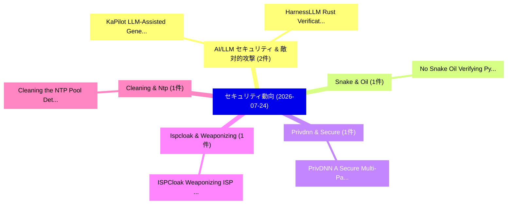

# 📅 02_daily: 日次エグゼクティブサマリー報告書 (2026-07-24)

**集計日時**: 2026-10-02 23:06:20 UTC  
**対象日付**: 2026-07-24  
**本日収集論文数**: 28 件  

---

## 💡 主要セキュリティ動向・脅威インサイト (Executive Insights)

本日の収集論文（計 28 件）において、以下の重点セキュリティ領域で活発な研究動向が確認されました：
- **AI/LLM セキュリティ & 敵対的攻撃** (2 件): 注目論文として 「KaPilot: LLM-Assisted Generati...」、「HarnessLLM: Rust Verification ...」 等が発表され、実務防御および攻撃検証の進展が見られます。
- **Snake & Oil** (1 件): 注目論文として 「No Snake Oil: Verifying Python...」 等が発表され、実務防御および攻撃検証の進展が見られます。
- **Privdnn & Secure** (1 件): 注目論文として 「PrivDNN: A Secure Multi-Party ...」 等が発表され、実務防御および攻撃検証の進展が見られます。
- **Ispcloak & Weaponizing** (1 件): 注目論文として 「ISPCloak: Weaponizing ISP for ...」 等が発表され、実務防御および攻撃検証の進展が見られます。
- **Cleaning & Ntp** (1 件): 注目論文として 「Cleaning the NTP Pool: Detecti...」 等が発表され、実務防御および攻撃検証の進展が見られます。

### 🗺️ 技術・脅威トピックマインドマップ

---

## 📌 日次セキュリティ論文一覧 (日本語表形式)

| No | arXiv ID | 論文タイトル (日本語訳) | 重要キーワード | 構造化エグゼクティブ要約 (背景・提案・影響) | 脅威分類 | 詳細リンク |
|---|---|---|---|---|---|---|
| 1 | `2607.21888v1` | [No Snake Oil: Verifying Python Package Builds（セキュリティ分析論文）](../../okf/papers/2026-07-24/2607.21888.md) | `Verifying Python Package Builds`, `Jens Dietrich`, `Spencer Sun` | 【提案】概要 (Overview & Key Finding) 本論文「No Snake Oil: Verifying Python Package Builds（セキュリティ分析論...。実証評価によりWhite, Behnaz Hassanshahi... | `arXiv` | [arXiv](https://arxiv.org/abs/2607.21888v1) &#124; [OKF](../../okf/papers/2026-07-24/2607.21888.md) |
| 2 | `2607.21895v1` | [PrivDNN: A Secure Multi-Party Computation Framework for Deep Learning using Partial DNN Encryption（セキュリティ分析論文）](../../okf/papers/2026-07-24/2607.21895.md) | `Secure Multi`, `Deep Learning`, `Multi-Party Computation` | 【提案】概要 (Overview & Key Finding) 本論文「PrivDNN: A Secure Multi-Party Computation Framework for...。実証評価により経営層・セキュリティ管理者向け推奨アクション (E... | `arXiv` | [arXiv](https://arxiv.org/abs/2607.21895v1) &#124; [OKF](../../okf/papers/2026-07-24/2607.21895.md) |
| 3 | `2607.21897v1` | [ISPCloak: Weaponizing ISP for Optimization-Free Physical Camouflage against Deepfake Detectors（セキュリティ分析論文）](../../okf/papers/2026-07-24/2607.21897.md) | `Free Physical Camouflage`, `Optimization-Free Physical`, `Deepfake Detectors` | 【提案】概要 (Overview & Key Finding) 本論文「ISPCloak: Weaponizing ISP for Optimization-Free Physica...。実証評価により経営層・セキュリティ管理者向け推奨アクション (E... | `arXiv` | [arXiv](https://arxiv.org/abs/2607.21897v1) &#124; [OKF](../../okf/papers/2026-07-24/2607.21897.md) |
| 4 | `2607.21903v2` | [Cleaning the NTP Pool: Detecting and Mitigating NTP-Sourced IPv6 Scanning（セキュリティ分析論文）](../../okf/papers/2026-07-24/2607.21903.md) | `NTP-Sourced IPv6`, `Erik Rye`, `Robert Beverly` | 【提案】概要 (Overview & Key Finding) 本論文「Cleaning the NTP Pool: Detecting and Mitigating NTP-Sou...。実証評価により経営層・セキュリティ管理者向け推奨アクション (E... | `arXiv` | [arXiv](https://arxiv.org/abs/2607.21903v2) &#124; [OKF](../../okf/papers/2026-07-24/2607.21903.md) |
| 5 | `2607.21951v1` | [SIREN (Luring LLMs onto the Rocks): PAIR-Driven Preference Manipulation in Web-RAG Recommenders（セキュリティ分析論文）](../../okf/papers/2026-07-24/2607.21951.md) | `Driven Preference Manipulation`, `PAIR-Driven Preference`, `Web-RAG Recommenders` | 【提案】概要 (Overview & Key Finding) 本論文「SIREN (Luring LLMs onto the Rocks): PAIR-Driven Prefere...。実証評価により経営層・セキュリティ管理者向け推奨アクション (E... | `arXiv` | [arXiv](https://arxiv.org/abs/2607.21951v1) &#124; [OKF](../../okf/papers/2026-07-24/2607.21951.md) |
| 6 | `2607.21955v1` | [Incentives and Market Structure in Intent-Based Exchanges: Evidence from a Solver-Reward Reform（セキュリティ分析論文）](../../okf/papers/2026-07-24/2607.21955.md) | `Market Structure`, `Based Exchanges`, `Intent-Based Exchanges` | 【提案】概要 (Overview & Key Finding) 本論文「Incentives and Market Structure in Intent-Based Exchang...。実証評価により経営層・セキュリティ管理者向け推奨アクション (E... | `arXiv` | [arXiv](https://arxiv.org/abs/2607.21955v1) &#124; [OKF](../../okf/papers/2026-07-24/2607.21955.md) |
| 7 | `2607.21957v1` | [KaPilot: LLM-Assisted Generation of Kani Specifications for Unsafe Rust Verification（セキュリティ分析論文）](../../okf/papers/2026-07-24/2607.21957.md) | `Unsafe Rust Verification`, `Assisted Generation`, `Kani Specifications` | 【提案】概要 (Overview & Key Finding) 本論文「KaPilot: LLM-Assisted Generation of Kani Specifications...。実証評価により経営層・セキュリティ管理者向け推奨アクション (E... | `arXiv` | [arXiv](https://arxiv.org/abs/2607.21957v1) &#124; [OKF](../../okf/papers/2026-07-24/2607.21957.md) |
| 8 | `2607.21983v1` | [Ethereum NFT Smart Contracts: Knowledge-Guided 脆弱性検出 with LLM and Code Slicing](../../okf/papers/2026-07-24/2607.21983.md) | `Smart Contracts`, `Code Slicing`, `Guided Vulnerability Detection` | 【提案】概要 (Overview & Key Finding) 本論文「Ethereum NFT スマートコントラクトs: Knowledge-Guided 脆弱性検出 with L...。実証評価により経営層・セキュリティ管理者向け推奨アクション (E... | `arXiv` | [arXiv](https://arxiv.org/abs/2607.21983v1) &#124; [OKF](../../okf/papers/2026-07-24/2607.21983.md) |
| 9 | `2607.22009v1` | [Practical Graph Optimisation and AI-Driven Models for Active Directory Security Hardening（セキュリティ分析論文）](../../okf/papers/2026-07-24/2607.22009.md) | `Active Directory Security Hardening`, `Practical Graph Optimisation`, `Driven Models` | 【提案】概要 (Overview & Key Finding) 本論文「Practical Graph Optimisation and AI-Driven Models for A...。実証評価により経営層・セキュリティ管理者向け推奨アクション (E... | `arXiv` | [arXiv](https://arxiv.org/abs/2607.22009v1) &#124; [OKF](../../okf/papers/2026-07-24/2607.22009.md) |
| 10 | `2607.22024v1` | [Agent Security Needs Redefinition through a Holistic Framework（セキュリティ分析論文）](../../okf/papers/2026-07-24/2607.22024.md) | `Agent Security Needs Redefinition`, `Vincent Siu`, `Kyle Montgomery` | 【提案】概要 (Overview & Key Finding) 本論文「Agent Security Needs Redefinition through a Holistic Fr...。実証評価により経営層・セキュリティ管理者向け推奨アクション (E... | `arXiv` | [arXiv](https://arxiv.org/abs/2607.22024v1) &#124; [OKF](../../okf/papers/2026-07-24/2607.22024.md) |
| 11 | `2607.22033v1` | [Exponentially Fewer-Server PIR from Sparser $S$-Decoding Polynomials（セキュリティ分析論文）](../../okf/papers/2026-07-24/2607.22033.md) | `Exponentially Fewer`, `Decoding Polynomials`, `Fewer-Server PIR` | 【提案】概要 (Overview & Key Finding) 本論文「Exponentially Fewer-Server PIR from Sparser $S$-Decodin...。実証評価により経営層・セキュリティ管理者向け推奨アクション (E... | `arXiv` | [arXiv](https://arxiv.org/abs/2607.22033v1) &#124; [OKF](../../okf/papers/2026-07-24/2607.22033.md) |
| 12 | `2607.22065v1` | [BioZKFHE: Scalable Encrypted Biometric Identification via Verifiable Homomorphic Similarity Evaluation（セキュリティ分析論文）](../../okf/papers/2026-07-24/2607.22065.md) | `Scalable Encrypted Biometric Identification`, `Rundong Xin`, `Taotao Wang` | 【提案】概要 (Overview & Key Finding) 本論文「BioZKFHE: Scalable Encrypted Biometric Identification v...。実証評価により経営層・セキュリティ管理者向け推奨アクション (E... | `arXiv` | [arXiv](https://arxiv.org/abs/2607.22065v1) &#124; [OKF](../../okf/papers/2026-07-24/2607.22065.md) |
| 13 | `2607.22076v1` | [PoCEvolve: Generating Proof-of-Concept Exploits from Security Patches with Vulnerability-Aware Prompt Evolution（セキュリティ分析論文）](../../okf/papers/2026-07-24/2607.22076.md) | `Aware Prompt Evolution`, `Generating Proof`, `Concept Exploits` | 【提案】概要 (Overview & Key Finding) 本論文「PoCEvolve: Generating Proof-of-Concept Exploits from Se...。実証評価により経営層・セキュリティ管理者向け推奨アクション (E... | `arXiv` | [arXiv](https://arxiv.org/abs/2607.22076v1) &#124; [OKF](../../okf/papers/2026-07-24/2607.22076.md) |
| 14 | `2607.22094v2` | [Transforming Keystroke Noise to Text: Self-Supervised Acoustic Eavesdropping Attacks on Keyboards（セキュリティ分析論文）](../../okf/papers/2026-07-24/2607.22094.md) | `Supervised Acoustic Eavesdropping Attacks`, `Transforming Keystroke Noise`, `Self-Supervised Acoustic` | 【提案】概要 (Overview & Key Finding) 本論文「Transforming Keystroke Noise to Text: Self-Supervised A...。実証評価により経営層・セキュリティ管理者向け推奨アクション (E... | `arXiv` | [arXiv](https://arxiv.org/abs/2607.22094v2) &#124; [OKF](../../okf/papers/2026-07-24/2607.22094.md) |
| 15 | `2607.22140v2` | [No Edges, No Verdict: A Large-Scale Empirical Study of Declared Dependency Graphs in 78K SBOMs in the Wild（セキュリティ分析論文）](../../okf/papers/2026-07-24/2607.22140.md) | `Declared Dependency Graphs`, `Large-Scale Empirical`, `Software Security` | 【提案】概要 (Overview & Key Finding) 本論文「No Edges, No Verdict: A Large-Scale Empirical Study of ...。実証評価により経営層・セキュリティ管理者向け推奨アクション (E... | `Software Security` | [arXiv](https://arxiv.org/abs/2607.22140v2) &#124; [OKF](../../okf/papers/2026-07-24/2607.22140.md) |
| 16 | `2607.22161v1` | [HarnessLLM: Rust Verification Harness Generation with 大規模言語モデル](../../okf/papers/2026-07-24/2607.22161.md) | `Rust Verification Harness Generation`, `Large Language Models`, `Minghua Wang` | 【提案】概要 (Overview & Key Finding) 本論文「HarnessLLM: Rust Verification Harness Generation with 大...。実証評価により経営層・セキュリティ管理者向け推奨アクション (E... | `arXiv` | [arXiv](https://arxiv.org/abs/2607.22161v1) &#124; [OKF](../../okf/papers/2026-07-24/2607.22161.md) |
| 17 | `2607.22184v1` | [DeFiScreener: Efficient DeFi Attack Pre-screening in Smart Contracts via Historical Case Matching（セキュリティ分析論文）](../../okf/papers/2026-07-24/2607.22184.md) | `Historical Case Matching`, `Attack Pre`, `Smart Contracts` | 【提案】概要 (Overview & Key Finding) 本論文「DeFiScreener: Efficient DeFi Attack Pre-screening in スマ...。実証評価により経営層・セキュリティ管理者向け推奨アクション (E... | `arXiv` | [arXiv](https://arxiv.org/abs/2607.22184v1) &#124; [OKF](../../okf/papers/2026-07-24/2607.22184.md) |
| 18 | `2607.22230v1` | [trasgoDP: An Open Source Framework for Releasing Noised Tabular Microdata under Local Differential Privacy（セキュリティ分析論文）](../../okf/papers/2026-07-24/2607.22230.md) | `Releasing Noised Tabular Microdata`, `Local Differential Privacy`, `Raw Meta` | 【提案】概要 (Overview & Key Finding) 本論文「trasgoDP: An Open Source Framework for Releasing Noised...。実証評価により経営層・セキュリティ管理者向け推奨アクション (E... | `arXiv` | [arXiv](https://arxiv.org/abs/2607.22230v1) &#124; [OKF](../../okf/papers/2026-07-24/2607.22230.md) |
| 19 | `2607.22269v2` | [Kalyna Block Cipher: From Design Space Exploration to ASIC Design（セキュリティ分析論文）](../../okf/papers/2026-07-24/2607.22269.md) | `Kalyna Block Cipher`, `Carlos Gewehr`, `Levent Aksoy` | 【提案】概要 (Overview & Key Finding) 本論文「Kalyna Block Cipher: From Design Space Exploration to A...。実証評価により経営層・セキュリティ管理者向け推奨アクション (E... | `arXiv` | [arXiv](https://arxiv.org/abs/2607.22269v2) &#124; [OKF](../../okf/papers/2026-07-24/2607.22269.md) |
| 20 | `2607.22386v1` | [Correlation-Aware and Gaussianity-Preserving Robust Latent Angular Watermarking for Diffusion Models（セキュリティ分析論文）](../../okf/papers/2026-07-24/2607.22386.md) | `Preserving Robust Latent Angular Watermarking`, `Gaussianity-Preserving Robust`, `Diffusion Models` | 【提案】概要 (Overview & Key Finding) 本論文「Correlation-Aware and Gaussianity-Preserving Robust Lat...。実証評価により経営層・セキュリティ管理者向け推奨アクション (E... | `arXiv` | [arXiv](https://arxiv.org/abs/2607.22386v1) &#124; [OKF](../../okf/papers/2026-07-24/2607.22386.md) |
| 21 | `2607.22445v1` | [Dynamic Capability Scoping for Enterprise AI Agents: A Synthetic Dataset and Three-Source Permission Architecture（セキュリティ分析論文）](../../okf/papers/2026-07-24/2607.22445.md) | `Dynamic Capability Scoping`, `Source Permission Architecture`, `Synthetic Dataset` | 【提案】概要 (Overview & Key Finding) 本論文「Dynamic Capability Scoping for Enterprise AI Agents: A ...。実証評価により経営層・セキュリティ管理者向け推奨アクション (E... | `arXiv` | [arXiv](https://arxiv.org/abs/2607.22445v1) &#124; [OKF](../../okf/papers/2026-07-24/2607.22445.md) |
| 22 | `2607.22450v1` | [A Maximum Entropy Implementation of Differential Privacy Under Linear Invariants（セキュリティ分析論文）](../../okf/papers/2026-07-24/2607.22450.md) | `Maximum Entropy Implementation`, `Ryan Lafferty`, `Anindya Roy` | 【提案】概要 (Overview & Key Finding) 本論文「A Maximum Entropy Implementation of 差分プライバシー Under Line...。実証評価により経営層・セキュリティ管理者向け推奨アクション (E... | `arXiv` | [arXiv](https://arxiv.org/abs/2607.22450v1) &#124; [OKF](../../okf/papers/2026-07-24/2607.22450.md) |
| 23 | `2607.22868v1` | [What Can Be Enforced? A Theory of Certified Runtime Safety for Tool-Using Agents（セキュリティ分析論文）](../../okf/papers/2026-07-24/2607.22868.md) | `Certified Runtime Safety`, `Using Agents`, `Tool-Using Agents` | 【提案】A Theory of Certified Runtime Safety for Tool-Using Agents ### (日本語題名: What Can Be Enfo...。実証評価により経営層・セキュリティ管理者向け推奨アクション (E... | `arXiv` | [arXiv](https://arxiv.org/abs/2607.22868v1) &#124; [OKF](../../okf/papers/2026-07-24/2607.22868.md) |
| 24 | `2607.22885v1` | [ReCon: A Resource-Constrained Benchmark for LLM-Based サイバーセキュリティ Compliance Across Ingestion and Retrieval Pipelines](../../okf/papers/2026-07-24/2607.22885.md) | `Constrained Benchmark`, `Retrieval Pipelines`, `Resource-Constrained Benchmark` | 【提案】概要 (Overview & Key Finding) 本論文「ReCon: A Resource-Constrained Benchmark for LLM-Based サ...。実証評価により経営層・セキュリティ管理者向け推奨アクション (E... | `arXiv` | [arXiv](https://arxiv.org/abs/2607.22885v1) &#124; [OKF](../../okf/papers/2026-07-24/2607.22885.md) |
| 25 | `2607.22926v1` | [SAGE: Safety-First Defense-in-Depth Guardrails for Verified Lifecycle Control of High-Impact Generative AI（セキュリティ分析論文）](../../okf/papers/2026-07-24/2607.22926.md) | `Verified Lifecycle Control`, `First Defense`, `Depth Guardrails` | 【提案】概要 (Overview & Key Finding) 本論文「SAGE: Safety-First Defense-in-Depth Guardrails for Veri...。実証評価により経営層・セキュリティ管理者向け推奨アクション (E... | `arXiv` | [arXiv](https://arxiv.org/abs/2607.22926v1) &#124; [OKF](../../okf/papers/2026-07-24/2607.22926.md) |
| 26 | `2607.22943v1` | [A Modular Cyber Range Platform for Smart Energy Systems（セキュリティ分析論文）](../../okf/papers/2026-07-24/2607.22943.md) | `Modular Cyber Range Platform`, `Smart Energy Systems`, `Vasilis Ieropoulos` | 【提案】概要 (Overview & Key Finding) 本論文「A Modular Cyber Range Platform for Smart Energy Systems...。実証評価により経営層・セキュリティ管理者向け推奨アクション (E... | `arXiv` | [arXiv](https://arxiv.org/abs/2607.22943v1) &#124; [OKF](../../okf/papers/2026-07-24/2607.22943.md) |
| 27 | `2607.22953v1` | [Share No More Than the Request Requires: Federated Disclosure for Perspective-Aware AI（セキュリティ分析論文）](../../okf/papers/2026-07-24/2607.22953.md) | `Request Requires`, `Federated Disclosure`, `Perspective-Aware AI` | 【提案】概要 (Overview & Key Finding) 本論文「Share No More Than the Request Requires: Federated Disc...。実証評価により経営層・セキュリティ管理者向け推奨アクション (E... | `arXiv` | [arXiv](https://arxiv.org/abs/2607.22953v1) &#124; [OKF](../../okf/papers/2026-07-24/2607.22953.md) |
| 28 | `2608.02627v1` | [Micro-Segmentation Anomaly Detection in Zero-Trust Software-Defined Network Fabrics（セキュリティ分析論文）](../../okf/papers/2026-07-24/2608.02627.md) | `Segmentation Anomaly Detection`, `Defined Network Fabrics`, `Trust Software` | 【提案】概要 (Overview & Key Finding) 本論文「Micro-Segmentation Anomaly Detection in ゼロトラスト Software...。実証評価により経営層・セキュリティ管理者向け推奨アクション (E... | `arXiv` | [arXiv](https://arxiv.org/abs/2608.02627v1) &#124; [OKF](../../okf/papers/2026-07-24/2608.02627.md) |

