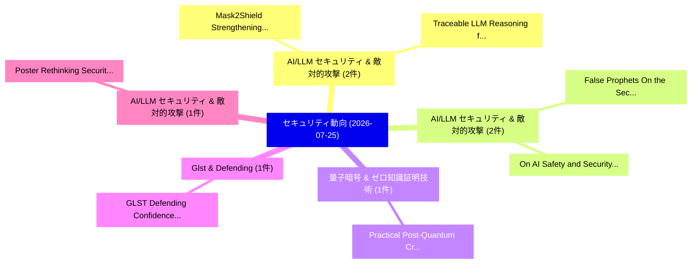

# 📅 02_daily: 日次エグゼクティブサマリー報告書 (2026-07-25)

**集計日時**: 2026-10-02 23:06:20 UTC  
**対象日付**: 2026-07-25  
**本日収集論文数**: 14 件  

---

## 💡 主要セキュリティ動向・脅威インサイト (Executive Insights)

本日の収集論文（計 14 件）において、以下の重点セキュリティ領域で活発な研究動向が確認されました：
- **AI/LLM セキュリティ & 敵対的攻撃** (2 件): 注目論文として 「Mask2Shield: Strengthening LLM...」、「Traceable LLM Reasoning for Fa...」 等が発表され、実務防御および攻撃検証の進展が見られます。
- **AI/LLM セキュリティ & 敵対的攻撃** (2 件): 注目論文として 「False Prophets: On the Securit...」、「On AI Safety and Security Tech...」 等が発表され、実務防御および攻撃検証の進展が見られます。
- **量子暗号 & ゼロ知識証明技術** (1 件): 注目論文として 「Practical Post-Quantum Cryptog...」 等が発表され、実務防御および攻撃検証の進展が見られます。
- **Glst & Defending** (1 件): 注目論文として 「GLST: Defending Confidence-Dri...」 等が発表され、実務防御および攻撃検証の進展が見られます。
- **AI/LLM セキュリティ & 敵対的攻撃** (1 件): 注目論文として 「Poster: Rethinking Security in...」 等が発表され、実務防御および攻撃検証の進展が見られます。

### 🗺️ 技術・脅威トピックマインドマップ

---

## 📌 日次セキュリティ論文一覧 (日本語表形式)

| No | arXiv ID | 論文タイトル (日本語訳) | 重要キーワード | 構造化エグゼクティブ要約 (背景・提案・影響) | 脅威分類 | 詳細リンク |
|---|---|---|---|---|---|---|
| 1 | `2607.23007v1` | [Practical Post-Quantum Cryptography for Bandwidth Constrained or Non-Terrestrial Networks, and Power Constrained Devices（セキュリティ分析論文）](../../okf/papers/2026-07-25/2607.23007.md) | `Power Constrained Devices`, `Practical Post`, `Quantum Cryptography` | 【提案】概要 (Overview & Key Finding) 本論文「Practical ポスト量子暗号 for Bandwidth Constrained or Non-Terr...。実証評価により経営層・セキュリティ管理者向け推奨アクション (E... | `arXiv` | [arXiv](https://arxiv.org/abs/2607.23007v1) &#124; [OKF](../../okf/papers/2026-07-25/2607.23007.md) |
| 2 | `2607.23015v1` | [Mask2Shield: Strengthening LLM Safety against Neuron-Pruning Attacks（セキュリティ分析論文）](../../okf/papers/2026-07-25/2607.23015.md) | `Pruning Attacks`, `Neuron-Pruning Attacks`, `Minghui Xu` | 【提案】概要 (Overview & Key Finding) 本論文「Mask2Shield: Strengthening LLM Safety against Neuron-Pr...。実証評価により経営層・セキュリティ管理者向け推奨アクション (E... | `arXiv` | [arXiv](https://arxiv.org/abs/2607.23015v1) &#124; [OKF](../../okf/papers/2026-07-25/2607.23015.md) |
| 3 | `2607.23059v1` | [GLST: Defending Confidence-Driven V2X Collaborative Perception Against Stealthy Multi-Attacker Feature Injection（セキュリティ分析論文）](../../okf/papers/2026-07-25/2607.23059.md) | `Attacker Feature Injection`, `Defending Confidence`, `Confidence-Driven V2X` | 【提案】概要 (Overview & Key Finding) 本論文「GLST: Defending Confidence-Driven V2X Collaborative Per...。実証評価により経営層・セキュリティ管理者向け推奨アクション (E... | `arXiv` | [arXiv](https://arxiv.org/abs/2607.23059v1) &#124; [OKF](../../okf/papers/2026-07-25/2607.23059.md) |
| 4 | `2607.23075v1` | [Traceable LLM Reasoning for Fake-Order Fraud Detection（セキュリティ分析論文）](../../okf/papers/2026-07-25/2607.23075.md) | `Order Fraud Detection`, `Fake-Order Fraud`, `Bingsong Xu` | 【提案】概要 (Overview & Key Finding) 本論文「Traceable LLM Reasoning for Fake-Order Fraud Detection（...。実証評価により経営層・セキュリティ管理者向け推奨アクション (E... | `arXiv` | [arXiv](https://arxiv.org/abs/2607.23075v1) &#124; [OKF](../../okf/papers/2026-07-25/2607.23075.md) |
| 5 | `2607.23088v1` | [Poster: Rethinking Security in LLM Code Generation through Real-World Risk Scenarios（セキュリティ分析論文）](../../okf/papers/2026-07-25/2607.23088.md) | `World Risk Scenarios`, `Rethinking Security`, `Code Generation` | 【提案】概要 (Overview & Key Finding) 本論文「Poster: Rethinking Security in LLM Code Generation thro...。実証評価により経営層・セキュリティ管理者向け推奨アクション (E... | `arXiv` | [arXiv](https://arxiv.org/abs/2607.23088v1) &#124; [OKF](../../okf/papers/2026-07-25/2607.23088.md) |
| 6 | `2607.23147v1` | [False Prophets: On the Security of World Models in Agentic Systems（セキュリティ分析論文）](../../okf/papers/2026-07-25/2607.23147.md) | `False Prophets`, `World Models`, `Agentic Systems` | 【提案】概要 (Overview & Key Finding) 本論文「False Prophets: On the Security of World Models in Agen...。実証評価により経営層・セキュリティ管理者向け推奨アクション (E... | `arXiv` | [arXiv](https://arxiv.org/abs/2607.23147v1) &#124; [OKF](../../okf/papers/2026-07-25/2607.23147.md) |
| 7 | `2607.23207v1` | [Accountable yet Anonymous AI Agents - Split-Knowledge Binding in National Agent-Identity Layer in China（セキュリティ分析論文）](../../okf/papers/2026-07-25/2607.23207.md) | `Knowledge Binding`, `National Agent`, `Split-Knowledge Binding` | 【提案】概要 (Overview & Key Finding) 本論文「Accountable yet Anonymous AI Agents - Split-Knowledge B...。実証評価により経営層・セキュリティ管理者向け推奨アクション (E... | `arXiv` | [arXiv](https://arxiv.org/abs/2607.23207v1) &#124; [OKF](../../okf/papers/2026-07-25/2607.23207.md) |
| 8 | `2607.23218v1` | [SPARC: Automated Root-Cause Pre-Silicon Power Side-Channel Leakage in the Processor Design Flowの分析](../../okf/papers/2026-07-25/2607.23218.md) | `Silicon Power Side`, `Automated Root`, `Channel Leakage` | 【提案】概要 (Overview & Key Finding) 本論文「SPARC: Automated Root-Cause Pre-Silicon Power サイドチャネル攻撃...。実証評価により経営層・セキュリティ管理者向け推奨アクション (E... | `arXiv` | [arXiv](https://arxiv.org/abs/2607.23218v1) &#124; [OKF](../../okf/papers/2026-07-25/2607.23218.md) |
| 9 | `2607.23272v1` | [From Signals to Behaviors: Evidence-Based Android マルウェア検出](../../okf/papers/2026-07-25/2607.23272.md) | `Evidence-Based Android`, `Based Android Malware Detection`, `Based Android` | 【提案】概要 (Overview & Key Finding) 本論文「From Signals to Behaviors: Evidence-Based Android マルウェア...。実証評価により経営層・セキュリティ管理者向け推奨アクション (E... | `arXiv` | [arXiv](https://arxiv.org/abs/2607.23272v1) &#124; [OKF](../../okf/papers/2026-07-25/2607.23272.md) |
| 10 | `2607.23292v1` | [Hiding in Plain Sight: An Effective Physical Adversarial Patch Attack against Visual-Infrared Fused Face Detection（セキュリティ分析論文）](../../okf/papers/2026-07-25/2607.23292.md) | `Infrared Fused Face Detection`, `Plain Sight`, `Visual-Infrared Fused` | 【提案】概要 (Overview & Key Finding) 本論文「Hiding in Plain Sight: An Effective Physical Adversaria...。実証評価により経営層・セキュリティ管理者向け推奨アクション (E... | `arXiv` | [arXiv](https://arxiv.org/abs/2607.23292v1) &#124; [OKF](../../okf/papers/2026-07-25/2607.23292.md) |
| 11 | `2607.23312v1` | [A Structured Cyber Threat Intelligence Dataset Using STIX 2.1 Entities and MITRE ATT&CK Mappings（セキュリティ分析論文）](../../okf/papers/2026-07-25/2607.23312.md) | `Structured Cyber Threat Intelligence Dataset Using`, `Md Rayhanur Rahman`, `Dipshikha Das` | 【提案】概要 (Overview & Key Finding) 本論文「A Structured Cyber 脅威 Intelligence Dataset Using STIX 2...。実証評価により経営層・セキュリティ管理者向け推奨アクション (E... | `arXiv` | [arXiv](https://arxiv.org/abs/2607.23312v1) &#124; [OKF](../../okf/papers/2026-07-25/2607.23312.md) |
| 12 | `2607.23342v1` | [Exploring the OODA Loop as a Systematic Way of Thinking in Coping with Conflicts（セキュリティ分析論文）](../../okf/papers/2026-07-25/2607.23342.md) | `Systematic Way`, `Ethan Anderson`, `Shouhuai Xu` | 【提案】概要 (Overview & Key Finding) 本論文「Exploring the OODA Loop as a Systematic Way of Thinking...。実証評価により経営層・セキュリティ管理者向け推奨アクション (E... | `arXiv` | [arXiv](https://arxiv.org/abs/2607.23342v1) &#124; [OKF](../../okf/papers/2026-07-25/2607.23342.md) |
| 13 | `2607.23365v1` | [On AI Safety and Security Technical Debt in Engineering AI-Enabled Systems（セキュリティ分析論文）](../../okf/papers/2026-07-25/2607.23365.md) | `Security Technical Debt`, `Enabled Systems`, `AI-Enabled Systems` | 【提案】概要 (Overview & Key Finding) 本論文「On AI Safety and Security Technical Debt in Engineering...。実証評価により経営層・セキュリティ管理者向け推奨アクション (E... | `arXiv` | [arXiv](https://arxiv.org/abs/2607.23365v1) &#124; [OKF](../../okf/papers/2026-07-25/2607.23365.md) |
| 14 | `2607.23389v1` | [Rendering on Real Silicon: GPU Render-Timing as a Passive, AI-Resistant CAPTCHA Signal（セキュリティ分析論文）](../../okf/papers/2026-07-25/2607.23389.md) | `Real Silicon`, `AI-Resistant CAPTCHA`, `David Noever` | 【提案】概要 (Overview & Key Finding) 本論文「Rendering on Real Silicon: GPU Render-Timing as a Passi...。実証評価により経営層・セキュリティ管理者向け推奨アクション (E... | `arXiv` | [arXiv](https://arxiv.org/abs/2607.23389v1) &#124; [OKF](../../okf/papers/2026-07-25/2607.23389.md) |

