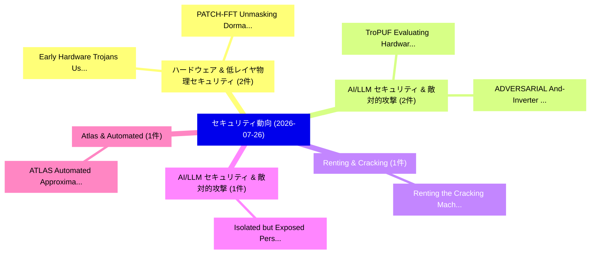

# 📅 02_daily: 日次エグゼクティブサマリー報告書 (2026-07-26)

**集計日時**: 2026-10-02 23:06:20 UTC  
**対象日付**: 2026-07-26  
**本日収集論文数**: 23 件  

---

## 💡 主要セキュリティ動向・脅威インサイト (Executive Insights)

本日の収集論文（計 23 件）において、以下の重点セキュリティ領域で活発な研究動向が確認されました：
- **ハードウェア & 低レイヤ物理セキュリティ** (2 件): 注目論文として 「Early Hardware Trojans Using N...」、「PATCH-FFT: Unmasking Dormant H...」 等が発表され、実務防御および攻撃検証の進展が見られます。
- **AI/LLM セキュリティ & 敵対的攻撃** (2 件): 注目論文として 「TroPUF: Evaluating Hardware Tr...」、「ADVERSARIAL: And-Inverter Grap...」 等が発表され、実務防御および攻撃検証の進展が見られます。
- **Renting & Cracking** (1 件): 注目論文として 「Renting the Cracking Machine w...」 等が発表され、実務防御および攻撃検証の進展が見られます。
- **AI/LLM セキュリティ & 敵対的攻撃** (1 件): 注目論文として 「Isolated but Exposed: Persiste...」 等が発表され、実務防御および攻撃検証の進展が見られます。
- **Atlas & Automated** (1 件): 注目論文として 「ATLAS: Automated Approximation...」 等が発表され、実務防御および攻撃検証の進展が見られます。

### 🗺️ 技術・脅威トピックマインドマップ

---

## 📌 日次セキュリティ論文一覧 (日本語表形式)

| No | arXiv ID | 論文タイトル (日本語訳) | 重要キーワード | 構造化エグゼクティブ要約 (背景・提案・影響) | 脅威分類 | 詳細リンク |
|---|---|---|---|---|---|---|
| 1 | `2607.23417v1` | [Early Hardware Trojans Using Neural Controlled Differential Equations and Analysis of Power Tracesの検出](../../okf/papers/2026-07-26/2607.23417.md) | `Early Hardware Trojans Using Neural Controlled Differential Equations`, `Hardware Trojans Using Neural Controlled Differential Equations`, `Early Detection` | 【提案】概要 (Overview & Key Finding) 本論文「Early Hardware Trojans Using Neural Controlled Differen...。実証評価により経営層・セキュリティ管理者向け推奨アクション (E... | `arXiv` | [arXiv](https://arxiv.org/abs/2607.23417v1) &#124; [OKF](../../okf/papers/2026-07-26/2607.23417.md) |
| 2 | `2607.23418v1` | [TroPUF: Evaluating Hardware Trojan Insertion in Delay-Based Physical Unclonable Functions（セキュリティ分析論文）](../../okf/papers/2026-07-26/2607.23418.md) | `Evaluating Hardware Trojan Insertion`, `Based Physical Unclonable Functions`, `Delay-Based Physical` | 【提案】概要 (Overview & Key Finding) 本論文「TroPUF: Evaluating Hardware Trojan Insertion in Delay-B...。実証評価により経営層・セキュリティ管理者向け推奨アクション (E... | `arXiv` | [arXiv](https://arxiv.org/abs/2607.23418v1) &#124; [OKF](../../okf/papers/2026-07-26/2607.23418.md) |
| 3 | `2607.23421v1` | [PATCH-FFT: Unmasking Dormant Hardware Trojans with Patch-Based Frequency-Domain Transformers（セキュリティ分析論文）](../../okf/papers/2026-07-26/2607.23421.md) | `Unmasking Dormant Hardware Trojans`, `Based Frequency`, `Patch-Based Frequency` | 【提案】概要 (Overview & Key Finding) 本論文「PATCH-FFT: Unmasking Dormant Hardware Trojans with Patc...。実証評価により経営層・セキュリティ管理者向け推奨アクション (E... | `arXiv` | [arXiv](https://arxiv.org/abs/2607.23421v1) &#124; [OKF](../../okf/papers/2026-07-26/2607.23421.md) |
| 4 | `2607.23443v1` | [Renting the Cracking Machine with a Cost-and-Time Exhaustive DES-56 Key Search in the Cloudの分析](../../okf/papers/2026-07-26/2607.23443.md) | `Cracking Machine`, `Key Search`, `DES-56 Key` | 【提案】概要 (Overview & Key Finding) 本論文「Renting the Cracking Machine with a Cost-and-Time Exhau...。実証評価により経営層・セキュリティ管理者向け推奨アクション (E... | `arXiv` | [arXiv](https://arxiv.org/abs/2607.23443v1) &#124; [OKF](../../okf/papers/2026-07-26/2607.23443.md) |
| 5 | `2607.23444v1` | [Isolated but Exposed: Persistence-Based Memory Extraction Attack on LLMエージェント](../../okf/papers/2026-07-26/2607.23444.md) | `Based Memory Extraction Attack`, `Persistence-Based Memory`, `Xinyu Gao` | 【提案】概要 (Overview & Key Finding) 本論文「Isolated but Exposed: Persistence-Based Memory Extracti...。実証評価により経営層・セキュリティ管理者向け推奨アクション (E... | `arXiv` | [arXiv](https://arxiv.org/abs/2607.23444v1) &#124; [OKF](../../okf/papers/2026-07-26/2607.23444.md) |
| 6 | `2607.23478v1` | [ATLAS: Automated Approximation of Transformers for Efficient Homomorphic Inference in One Hour（セキュリティ分析論文）](../../okf/papers/2026-07-26/2607.23478.md) | `Efficient Homomorphic Inference`, `Automated Approximation`, `One Hour` | 【提案】概要 (Overview & Key Finding) 本論文「ATLAS: Automated Approximation of Transformers for Effi...。実証評価により経営層・セキュリティ管理者向け推奨アクション (E... | `arXiv` | [arXiv](https://arxiv.org/abs/2607.23478v1) &#124; [OKF](../../okf/papers/2026-07-26/2607.23478.md) |
| 7 | `2607.23496v2` | [Do LLMs Know Their Vulnerable Scenarios?（セキュリティ分析論文）](../../okf/papers/2026-07-26/2607.23496.md) | `Ziheng Peng`, `Huiqi Deng`, `Haoran Jing` | 【提案】### (日本語題名: Do LLMs Know Their Vulnerable Scenarios?（セキュリティ分析論文）)  > [!NOTE] > **OKF Me...。実証評価により経営層・セキュリティ管理者向け推奨アクション (E... | `arXiv` | [arXiv](https://arxiv.org/abs/2607.23496v2) &#124; [OKF](../../okf/papers/2026-07-26/2607.23496.md) |
| 8 | `2607.23532v2` | [Mission-Level Runtime Assurance for LLM-Assisted ISR Swarms over a Verification-Aware Fabric（セキュリティ分析論文）](../../okf/papers/2026-07-26/2607.23532.md) | `Level Runtime Assurance`, `Mission-Level Runtime`, `LLM-Assisted ISR` | 【提案】概要 (Overview & Key Finding) 本論文「Mission-Level Runtime Assurance for LLM-Assisted ISR Sw...。実証評価により経営層・セキュリティ管理者向け推奨アクション (E... | `arXiv` | [arXiv](https://arxiv.org/abs/2607.23532v2) &#124; [OKF](../../okf/papers/2026-07-26/2607.23532.md) |
| 9 | `2607.23553v2` | [Screen-Conditioned Watermarking Against Multi-Screen Collusion Attacks（セキュリティ分析論文）](../../okf/papers/2026-07-26/2607.23553.md) | `Screen Collusion Attacks`, `Screen-Conditioned Watermarking`, `Multi-Screen Collusion` | 【提案】概要 (Overview & Key Finding) 本論文「Screen-Conditioned Watermarking Against Multi-Screen Co...。実証評価により経営層・セキュリティ管理者向け推奨アクション (E... | `arXiv` | [arXiv](https://arxiv.org/abs/2607.23553v2) &#124; [OKF](../../okf/papers/2026-07-26/2607.23553.md) |
| 10 | `2607.23586v1` | [Are You Still the Agent I Authorized? Earned Authority under a Fixed Ceiling for Evolving Agents（セキュリティ分析論文）](../../okf/papers/2026-07-26/2607.23586.md) | `Earned Authority`, `Fixed Ceiling`, `Evolving Agents` | 【提案】Earned Authority under a Fixed Ceiling for Evolving Agents ### (日本語題名: Are You Still th...。実証評価により経営層・セキュリティ管理者向け推奨アクション (E... | `arXiv` | [arXiv](https://arxiv.org/abs/2607.23586v1) &#124; [OKF](../../okf/papers/2026-07-26/2607.23586.md) |
| 11 | `2607.23597v2` | [HiTMS: A High-Throughput Multi-Stream Linguistic Steganography Framework（セキュリティ分析論文）](../../okf/papers/2026-07-26/2607.23597.md) | `Throughput Multi`, `High-Throughput Multi`, `Ruiyi Yan` | 【提案】概要 (Overview & Key Finding) 本論文「HiTMS: A High-Throughput Multi-Stream Linguistic Stegan...。実証評価により経営層・セキュリティ管理者向け推奨アクション (E... | `arXiv` | [arXiv](https://arxiv.org/abs/2607.23597v2) &#124; [OKF](../../okf/papers/2026-07-26/2607.23597.md) |
| 12 | `2607.23614v2` | [DualityCert: Verifier-Gated Language-Model Repair of Broken Duality Claims in Quantum Field Theory（セキュリティ分析論文）](../../okf/papers/2026-07-26/2607.23614.md) | `Broken Duality Claims`, `Quantum Field Theory`, `Gated Language` | 【提案】概要 (Overview & Key Finding) 本論文「DualityCert: Verifier-Gated Language-Model Repair of Br...。実証評価により経営層・セキュリティ管理者向け推奨アクション (E... | `arXiv` | [arXiv](https://arxiv.org/abs/2607.23614v2) &#124; [OKF](../../okf/papers/2026-07-26/2607.23614.md) |
| 13 | `2607.23698v2` | [SMARM+: Analyzing and Enhancing Shuffled Measurements for Remote Attestation in Real-Time IoT Settings（セキュリティ分析論文）](../../okf/papers/2026-07-26/2607.23698.md) | `Enhancing Shuffled Measurements`, `Remote Attestation`, `Real-Time IoT` | 【提案】概要 (Overview & Key Finding) 本論文「SMARM+: Analyzing and Enhancing Shuffled Measurements f...。実証評価により経営層・セキュリティ管理者向け推奨アクション (E... | `arXiv` | [arXiv](https://arxiv.org/abs/2607.23698v2) &#124; [OKF](../../okf/papers/2026-07-26/2607.23698.md) |
| 14 | `2607.23710v1` | [The Illusion of Secure LLM Code: Closing the Security Gap via Iterative Reprompting（セキュリティ分析論文）](../../okf/papers/2026-07-26/2607.23710.md) | `Security Gap`, `Iterative Reprompting`, `Ishpuneet Singh` | 【提案】概要 (Overview & Key Finding) 本論文「The Illusion of Secure LLM Code: Closing the Security G...。実証評価により経営層・セキュリティ管理者向け推奨アクション (E... | `arXiv` | [arXiv](https://arxiv.org/abs/2607.23710v1) &#124; [OKF](../../okf/papers/2026-07-26/2607.23710.md) |
| 15 | `2607.23727v1` | [Can PCE solve the factorisation problem via optimisation?（セキュリティ分析論文）](../../okf/papers/2026-07-26/2607.23727.md) | `Fernando Alonso`, `Jacobo Veiga`, `Raw Meta` | 【提案】### (日本語題名: Can PCE solve the factorisation problem via optimisation?（セキュリティ分析論文）)  > [...。実証評価により経営層・セキュリティ管理者向け推奨アクション (E... | `arXiv` | [arXiv](https://arxiv.org/abs/2607.23727v1) &#124; [OKF](../../okf/papers/2026-07-26/2607.23727.md) |
| 16 | `2607.23752v1` | [ZKP Security Tools and Verification: Coverage, Effectiveness, Adoption, and Challenges（セキュリティ分析論文）](../../okf/papers/2026-07-26/2607.23752.md) | `Security Tools`, `Arman Kolozyan`, `Tom Sorger` | 【提案】概要 (Overview & Key Finding) 本論文「ZKP Security Tools and Verification: Coverage, Effectiv...。実証評価により経営層・セキュリティ管理者向け推奨アクション (E... | `arXiv` | [arXiv](https://arxiv.org/abs/2607.23752v1) &#124; [OKF](../../okf/papers/2026-07-26/2607.23752.md) |
| 17 | `2607.23787v2` | [Bitcoin Mempool Linearization（セキュリティ分析論文）](../../okf/papers/2026-07-26/2607.23787.md) | `Bitcoin Mempool Linearization`, `General Cyber Security`, `Arman Mollakhani` | 【提案】概要 (Overview & Key Finding) 本論文「Bitcoin Mempool Linearization（セキュリティ分析論文）」（原題: Bitcoin ...。実証評価により経営層・セキュリティ管理者向け推奨アクション (E... | `General Cyber Security` | [arXiv](https://arxiv.org/abs/2607.23787v2) &#124; [OKF](../../okf/papers/2026-07-26/2607.23787.md) |
| 18 | `2607.23825v1` | [Bridging the Epistemic Gap in the Invisible Internet: Extended Mathematical Modeling and Empirical Characterization of I2P Topology（セキュリティ分析論文）](../../okf/papers/2026-07-26/2607.23825.md) | `Extended Mathematical Modeling`, `Epistemic Gap`, `Invisible Internet` | 【提案】概要 (Overview & Key Finding) 本論文「Bridging the Epistemic Gap in the Invisible Internet: E...。実証評価により経営層・セキュリティ管理者向け推奨アクション (E... | `arXiv` | [arXiv](https://arxiv.org/abs/2607.23825v1) &#124; [OKF](../../okf/papers/2026-07-26/2607.23825.md) |
| 19 | `2607.23838v1` | [TriShieldRAG: A Three-Ring Defense-in-Depth Framework Against Knowledge Corruption in Retrieval-Augmented Generation（セキュリティ分析論文）](../../okf/papers/2026-07-26/2607.23838.md) | `Ring Defense`, `Augmented Generation`, `Three-Ring Defense` | 【提案】概要 (Overview & Key Finding) 本論文「TriShieldRAG: A Three-Ring Defense-in-Depth Framework A...。実証評価により経営層・セキュリティ管理者向け推奨アクション (E... | `arXiv` | [arXiv](https://arxiv.org/abs/2607.23838v1) &#124; [OKF](../../okf/papers/2026-07-26/2607.23838.md) |
| 20 | `2607.23843v1` | [On a necessary condition for the matching cryptosystem stability（セキュリティ分析論文）](../../okf/papers/2026-07-26/2607.23843.md) | `Aleksey Bolotnikov`, `Anwar Irmatov`, `Raw Meta` | 【提案】概要 (Overview & Key Finding) 本論文「On a necessary condition for the matching cryptosystem ...。実証評価により経営層・セキュリティ管理者向け推奨アクション (E... | `arXiv` | [arXiv](https://arxiv.org/abs/2607.23843v1) &#124; [OKF](../../okf/papers/2026-07-26/2607.23843.md) |
| 21 | `2607.23882v1` | [ADVERSARIAL: And-Inverter Graph-Assisted Hardware Trojan Detection At Scale（セキュリティ分析論文）](../../okf/papers/2026-07-26/2607.23882.md) | `Inverter Graph`, `And-Inverter Graph`, `Yaroslav Popryho` | 【提案】概要 (Overview & Key Finding) 本論文「ADVERSARIAL: And-Inverter Graph-Assisted Hardware Troja...。実証評価により経営層・セキュリティ管理者向け推奨アクション (E... | `arXiv` | [arXiv](https://arxiv.org/abs/2607.23882v1) &#124; [OKF](../../okf/papers/2026-07-26/2607.23882.md) |
| 22 | `2607.24859v1` | [The Mirage of LLM Guardrails: A Case Study in AI-Assisted Medical Note Manipulation（セキュリティ分析論文）](../../okf/papers/2026-07-26/2607.24859.md) | `Assisted Medical Note Manipulation`, `AI-Assisted Medical`, `Davis Yadav` | 【提案】概要 (Overview & Key Finding) 本論文「The Mirage of LLM Guardrails: A Case Study in AI-Assist...。実証評価により経営層・セキュリティ管理者向け推奨アクション (E... | `arXiv` | [arXiv](https://arxiv.org/abs/2607.24859v1) &#124; [OKF](../../okf/papers/2026-07-26/2607.24859.md) |
| 23 | `2607.24866v1` | [The Missing Layer: Specification Infrastructure for AI Oversight（セキュリティ分析論文）](../../okf/papers/2026-07-26/2607.24866.md) | `Specification Infrastructure`, `Satyam Kumar`, `Saurabh Jha` | 【提案】概要 (Overview & Key Finding) 本論文「The Missing Layer: Specification Infrastructure for AI ...。実証評価により経営層・セキュリティ管理者向け推奨アクション (E... | `arXiv` | [arXiv](https://arxiv.org/abs/2607.24866v1) &#124; [OKF](../../okf/papers/2026-07-26/2607.24866.md) |

