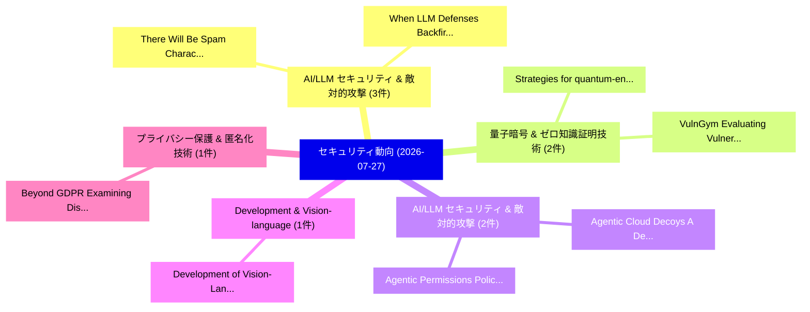

# 📅 02_daily: 日次エグゼクティブサマリー報告書 (2026-07-27)

**集計日時**: 2026-10-02 23:06:20 UTC  
**対象日付**: 2026-07-27  
**本日収集論文数**: 32 件  

---

## 💡 主要セキュリティ動向・脅威インサイト (Executive Insights)

本日の収集論文（計 32 件）において、以下の重点セキュリティ領域で活発な研究動向が確認されました：
- **AI/LLM セキュリティ & 敵対的攻撃** (3 件): 注目論文として 「There Will Be Spam: Characteri...」、「When LLM Defenses Backfire: Ch...」 等が発表され、実務防御および攻撃検証の進展が見られます。
- **量子暗号 & ゼロ知識証明技術** (2 件): 注目論文として 「Strategies for quantum-enabled...」、「VulnGym: Evaluating Vulnerabil...」 等が発表され、実務防御および攻撃検証の進展が見られます。
- **AI/LLM セキュリティ & 敵対的攻撃** (2 件): 注目論文として 「Agentic Cloud Decoys: A Decept...」、「Agentic Permissions Policy Alg...」 等が発表され、実務防御および攻撃検証の進展が見られます。
- **Development & Vision-language** (1 件): 注目論文として 「Development of Vision-Language...」 等が発表され、実務防御および攻撃検証の進展が見られます。
- **プライバシー保護 & 匿名化技術** (1 件): 注目論文として 「Beyond GDPR: Examining Disclos...」 等が発表され、実務防御および攻撃検証の進展が見られます。

### 🗺️ 技術・脅威トピックマインドマップ

---

## 📌 日次セキュリティ論文一覧 (日本語表形式)

| No | arXiv ID | 論文タイトル (日本語訳) | 重要キーワード | 構造化エグゼクティブ要約 (背景・提案・影響) | 脅威分類 | 詳細リンク |
|---|---|---|---|---|---|---|
| 1 | `2607.23952v2` | [Strategies for quantum-enabled Bitcoin miners（セキュリティ分析論文）](../../okf/papers/2026-07-27/2607.23952.md) | `quantum-enabled Bitcoin`, `Network Security`, `Zach Manson` | 【提案】概要 (Overview & Key Finding) 本論文「Strategies for 量子-enabled Bitcoin miners（セキュリティ分析論文）」（原...。実証評価によりSanders - **公開日時**: `2026... | `Network Security` | [arXiv](https://arxiv.org/abs/2607.23952v2) &#124; [OKF](../../okf/papers/2026-07-27/2607.23952.md) |
| 2 | `2607.23962v1` | [Development of Vision-Language Model-based GNSS Spoofing Detection for Autonomous Vehicle Navigation（セキュリティ分析論文）](../../okf/papers/2026-07-27/2607.23962.md) | `Autonomous Vehicle Navigation`, `Language Model`, `Spoofing Detection` | 【提案】概要 (Overview & Key Finding) 本論文「Development of Vision-Language Model-based GNSS Spoofin...。実証評価により経営層・セキュリティ管理者向け推奨アクション (E... | `arXiv` | [arXiv](https://arxiv.org/abs/2607.23962v1) &#124; [OKF](../../okf/papers/2026-07-27/2607.23962.md) |
| 3 | `2607.23984v1` | [Beyond GDPR: Examining Disclosure Gaps in Mobile AR Privacy Policies under U.S. State Privacy Laws（セキュリティ分析論文）](../../okf/papers/2026-07-27/2607.23984.md) | `Examining Disclosure Gaps`, `State Privacy Laws`, `Privacy Policies` | 【提案】State Privacy Laws ### (日本語題名: Beyond GDPR: Examining Disclosure Gaps in Mobile AR Priv...。実証評価により経営層・セキュリティ管理者向け推奨アクション (E... | `arXiv` | [arXiv](https://arxiv.org/abs/2607.23984v1) &#124; [OKF](../../okf/papers/2026-07-27/2607.23984.md) |
| 4 | `2607.23999v3` | [ContainmentBench: Trace-Based Evaluation of Post-Exposure Containment in Tool-Using LLMエージェント](../../okf/papers/2026-07-27/2607.23999.md) | `Exposure Containment`, `Post-Exposure Containment`, `Tool-Using LLM` | 【提案】概要 (Overview & Key Finding) 本論文「ContainmentBench: Trace-Based Evaluation of Post-Exposu...。実証評価により経営層・セキュリティ管理者向け推奨アクション (E... | `arXiv` | [arXiv](https://arxiv.org/abs/2607.23999v3) &#124; [OKF](../../okf/papers/2026-07-27/2607.23999.md) |
| 5 | `2607.24006v1` | [Agentic Cloud Decoys: A Deception-Driven Framework for Autonomous Intrusion Investigation（セキュリティ分析論文）](../../okf/papers/2026-07-27/2607.24006.md) | `Agentic Cloud Decoys`, `Autonomous Intrusion Investigation`, `Mohan Manivannan` | 【提案】概要 (Overview & Key Finding) 本論文「Agentic Cloud Decoys: A Deception-Driven Framework for ...。実証評価により経営層・セキュリティ管理者向け推奨アクション (E... | `arXiv` | [arXiv](https://arxiv.org/abs/2607.24006v1) &#124; [OKF](../../okf/papers/2026-07-27/2607.24006.md) |
| 6 | `2607.24116v1` | [A サイバーセキュリティ MLPS Large Language Model with Multi-Path Retrieval Fusion](../../okf/papers/2026-07-27/2607.24116.md) | `Large Language Model`, `Path Retrieval Fusion`, `Multi-Path Retrieval` | 【提案】概要 (Overview & Key Finding) 本論文「A サイバーセキュリティ MLPS Large Language Model with Multi-Path ...。実証評価により経営層・セキュリティ管理者向け推奨アクション (E... | `arXiv` | [arXiv](https://arxiv.org/abs/2607.24116v1) &#124; [OKF](../../okf/papers/2026-07-27/2607.24116.md) |
| 7 | `2607.24172v1` | [There Will Be Spam: Characterizing State-Invariant Transactions and Speculative MEV（セキュリティ分析論文）](../../okf/papers/2026-07-27/2607.24172.md) | `Characterizing State`, `Invariant Transactions`, `State-Invariant Transactions` | 【提案】概要 (Overview & Key Finding) 本論文「There Will Be Spam: Characterizing State-Invariant Tran...。実証評価により経営層・セキュリティ管理者向け推奨アクション (E... | `arXiv` | [arXiv](https://arxiv.org/abs/2607.24172v1) &#124; [OKF](../../okf/papers/2026-07-27/2607.24172.md) |
| 8 | `2607.24174v1` | [Just Testing, Move Along: Evasion of LLM-based System Log Interpretation by Prompt Injection（セキュリティ分析論文）](../../okf/papers/2026-07-27/2607.24174.md) | `System Log Interpretation`, `Move Along`, `Prompt Injection` | 【提案】概要 (Overview & Key Finding) 本論文「Just Testing, Move Along: Evasion of LLM-based System L...。実証評価により経営層・セキュリティ管理者向け推奨アクション (E... | `arXiv` | [arXiv](https://arxiv.org/abs/2607.24174v1) &#124; [OKF](../../okf/papers/2026-07-27/2607.24174.md) |
| 9 | `2607.24177v1` | [EXE-Bench: Ranking the Tradeoffs of AI-based Windows Malware Detectors for Real-World Usability（セキュリティ分析論文）](../../okf/papers/2026-07-27/2607.24177.md) | `Windows Malware Detectors`, `World Usability`, `AI-based Windows` | 【提案】概要 (Overview & Key Finding) 本論文「EXE-Bench: Ranking the Tradeoffs of AI-based Windows マル...。実証評価により経営層・セキュリティ管理者向け推奨アクション (E... | `arXiv` | [arXiv](https://arxiv.org/abs/2607.24177v1) &#124; [OKF](../../okf/papers/2026-07-27/2607.24177.md) |
| 10 | `2607.24295v1` | [New perspectives for code locality in the rank metric（セキュリティ分析論文）](../../okf/papers/2026-07-27/2607.24295.md) | `Camille Garnier`, `Julien Lavauzelle`, `Jade Nardi` | 【提案】概要 (Overview & Key Finding) 本論文「New perspectives for code locality in the rank metric（セ...。実証評価により経営層・セキュリティ管理者向け推奨アクション (E... | `arXiv` | [arXiv](https://arxiv.org/abs/2607.24295v1) &#124; [OKF](../../okf/papers/2026-07-27/2607.24295.md) |
| 11 | `2607.24299v1` | [Quantum-Level Crosstalk Characterization of a 16x16 MEMS Optical Switch for Dynamic Quantum Communications（セキュリティ分析論文）](../../okf/papers/2026-07-27/2607.24299.md) | `Level Crosstalk Characterization`, `Dynamic Quantum Communications`, `Optical Switch` | 【提案】概要 (Overview & Key Finding) 本論文「量子-Level Crosstalk Characterization of a 16x16 MEMS Opt...。実証評価により経営層・セキュリティ管理者向け推奨アクション (E... | `arXiv` | [arXiv](https://arxiv.org/abs/2607.24299v1) &#124; [OKF](../../okf/papers/2026-07-27/2607.24299.md) |
| 12 | `2607.24348v1` | [DeepFaith: Evidence-Grounded LLMs for Faithful Incident Reporting in Multi-Stage APT Defense（セキュリティ分析論文）](../../okf/papers/2026-07-27/2607.24348.md) | `Faithful Incident Reporting`, `Evidence-Grounded LLMs`, `Multi-Stage APT` | 【提案】概要 (Overview & Key Finding) 本論文「DeepFaith: Evidence-Grounded LLMs for Faithful Incident...。実証評価により経営層・セキュリティ管理者向け推奨アクション (E... | `arXiv` | [arXiv](https://arxiv.org/abs/2607.24348v1) &#124; [OKF](../../okf/papers/2026-07-27/2607.24348.md) |
| 13 | `2607.24392v1` | [When LLM Defenses Backfire: Characterizing Safety, Performance, and Cost Trade-offs（セキュリティ分析論文）](../../okf/papers/2026-07-27/2607.24392.md) | `Defenses Backfire`, `Characterizing Safety`, `Cost Trade` | 【提案】概要 (Overview & Key Finding) 本論文「When LLM Defenses Backfire: Characterizing Safety, Perf...。実証評価により経営層・セキュリティ管理者向け推奨アクション (E... | `arXiv` | [arXiv](https://arxiv.org/abs/2607.24392v1) &#124; [OKF](../../okf/papers/2026-07-27/2607.24392.md) |
| 14 | `2607.24411v2` | [Occluded Oculus: Operationalizing Stylistic Obscurement（セキュリティ分析論文）](../../okf/papers/2026-07-27/2607.24411.md) | `Operationalizing Stylistic Obscurement`, `Occluded Oculus`, `Robert Dilworth` | 【提案】概要 (Overview & Key Finding) 本論文「Occluded Oculus: Operationalizing Stylistic Obscurement...。実証評価により経営層・セキュリティ管理者向け推奨アクション (E... | `arXiv` | [arXiv](https://arxiv.org/abs/2607.24411v2) &#124; [OKF](../../okf/papers/2026-07-27/2607.24411.md) |
| 15 | `2607.24415v1` | [Near-Tight Theoretical Bounds for Incentive Compatibility in Bitcoin Mining（セキュリティ分析論文）](../../okf/papers/2026-07-27/2607.24415.md) | `Tight Theoretical Bounds`, `Incentive Compatibility`, `Bitcoin Mining` | 【提案】概要 (Overview & Key Finding) 本論文「Near-Tight Theoretical Bounds for Incentive Compatibili...。実証評価により経営層・セキュリティ管理者向け推奨アクション (E... | `arXiv` | [arXiv](https://arxiv.org/abs/2607.24415v1) &#124; [OKF](../../okf/papers/2026-07-27/2607.24415.md) |
| 16 | `2607.24552v1` | [VulnGym: Evaluating Vulnerability Management Strategies against Advanced Persistent Threats（セキュリティ分析論文）](../../okf/papers/2026-07-27/2607.24552.md) | `Evaluating Vulnerability Management Strategies`, `Advanced Persistent Threats`, `Sofia Della Penna` | 【提案】概要 (Overview & Key Finding) 本論文「VulnGym: Evaluating 脆弱性 Management Strategies against A...。実証評価により経営層・セキュリティ管理者向け推奨アクション (E... | `arXiv` | [arXiv](https://arxiv.org/abs/2607.24552v1) &#124; [OKF](../../okf/papers/2026-07-27/2607.24552.md) |
| 17 | `2607.24556v1` | [BettiSplit: Topology-Guided Privacy-Aware Split Learning Against Feature Inversion and Gradient Leakage（セキュリティ分析論文）](../../okf/papers/2026-07-27/2607.24556.md) | `Guided Privacy`, `Topology-Guided Privacy`, `Gradient Leakage` | 【提案】概要 (Overview & Key Finding) 本論文「BettiSplit: Topology-Guided Privacy-Aware Split Learnin...。実証評価により経営層・セキュリティ管理者向け推奨アクション (E... | `arXiv` | [arXiv](https://arxiv.org/abs/2607.24556v1) &#124; [OKF](../../okf/papers/2026-07-27/2607.24556.md) |
| 18 | `2607.24563v2` | [TRACE-CTI: Auditable Post-Extraction Governance of TTP Claims with Knowledge Graphs（セキュリティ分析論文）](../../okf/papers/2026-07-27/2607.24563.md) | `Auditable Post`, `Extraction Governance`, `Post-Extraction Governance` | 【提案】概要 (Overview & Key Finding) 本論文「TRACE-CTI: Auditable Post-Extraction Governance of TTP ...。実証評価により経営層・セキュリティ管理者向け推奨アクション (E... | `arXiv` | [arXiv](https://arxiv.org/abs/2607.24563v2) &#124; [OKF](../../okf/papers/2026-07-27/2607.24563.md) |
| 19 | `2607.24618v1` | [Modeling Local Exploit Hazard - A Bayesian Framework for Quantifying Exploit Risk and Operational Efficiency（セキュリティ分析論文）](../../okf/papers/2026-07-27/2607.24618.md) | `Modeling Local Exploit Hazard`, `Quantifying Exploit Risk`, `Operational Efficiency` | 【提案】概要 (Overview & Key Finding) 本論文「Modeling Local エクスプロイト Hazard - A Bayesian Framework fo...。実証評価により経営層・セキュリティ管理者向け推奨アクション (E... | `arXiv` | [arXiv](https://arxiv.org/abs/2607.24618v1) &#124; [OKF](../../okf/papers/2026-07-27/2607.24618.md) |
| 20 | `2607.24625v1` | [Agentic Permissions Policy Algebra for Taint Confinement in LLMエージェント](../../okf/papers/2026-07-27/2607.24625.md) | `Agentic Permissions Policy Algebra`, `Taint Confinement`, `Arseny Kravchenko` | 【提案】概要 (Overview & Key Finding) 本論文「Agentic Permissions Policy Algebra for Taint Confinemen...。実証評価により経営層・セキュリティ管理者向け推奨アクション (E... | `arXiv` | [arXiv](https://arxiv.org/abs/2607.24625v1) &#124; [OKF](../../okf/papers/2026-07-27/2607.24625.md) |
| 21 | `2607.24692v1` | [Denial of Deadline: Network-Driven Accuracy Collapse in Distributed Inference Pipelines（セキュリティ分析論文）](../../okf/papers/2026-07-27/2607.24692.md) | `Driven Accuracy Collapse`, `Distributed Inference Pipelines`, `Network-Driven Accuracy` | 【提案】概要 (Overview & Key Finding) 本論文「Denial of Deadline: Network-Driven Accuracy Collapse in...。実証評価により経営層・セキュリティ管理者向け推奨アクション (E... | `arXiv` | [arXiv](https://arxiv.org/abs/2607.24692v1) &#124; [OKF](../../okf/papers/2026-07-27/2607.24692.md) |
| 22 | `2607.24888v1` | [Trusting-Trust Attack against an Entire Linux Distribution through Binary Manipulation（セキュリティ分析論文）](../../okf/papers/2026-07-27/2607.24888.md) | `Entire Linux Distribution`, `Trust Attack`, `Trusting-Trust Attack` | 【提案】概要 (Overview & Key Finding) 本論文「Trusting-Trust Attack against an Entire Linux Distribut...。実証評価により経営層・セキュリティ管理者向け推奨アクション (E... | `arXiv` | [arXiv](https://arxiv.org/abs/2607.24888v1) &#124; [OKF](../../okf/papers/2026-07-27/2607.24888.md) |
| 23 | `2607.24893v1` | [Early Distributed Backdoors in Multi-Agent LLM Systems: A Characterization Studyの検出](../../okf/papers/2026-07-27/2607.24893.md) | `Multi-Agent LLM`, `Early Distributed Backdoors`, `Early Detection` | 【提案】概要 (Overview & Key Finding) 本論文「Early Distributed Backdoors in Multi-Agent LLM Systems:...。実証評価により経営層・セキュリティ管理者向け推奨アクション (E... | `arXiv` | [arXiv](https://arxiv.org/abs/2607.24893v1) &#124; [OKF](../../okf/papers/2026-07-27/2607.24893.md) |
| 24 | `2607.24896v1` | [Latent Stability Malware Representations Under Feature-Space Perturbationsの分析](../../okf/papers/2026-07-27/2607.24896.md) | `Space Perturbations`, `Feature-Space Perturbations`, `Bamidele Ajayi` | 【提案】概要 (Overview & Key Finding) 本論文「Latent Stability マルウェア Representations Under Feature-Sp...。実証評価により経営層・セキュリティ管理者向け推奨アクション (E... | `arXiv` | [arXiv](https://arxiv.org/abs/2607.24896v1) &#124; [OKF](../../okf/papers/2026-07-27/2607.24896.md) |
| 25 | `2607.24897v1` | [TYPO: Instruction-Dense Visual Jailbreaks against Commercial Closed-Source Image-Generation Models（セキュリティ分析論文）](../../okf/papers/2026-07-27/2607.24897.md) | `Dense Visual Jailbreaks`, `Instruction-Dense Visual`, `Commercial Closed` | 【提案】概要 (Overview & Key Finding) 本論文「TYPO: Instruction-Dense Visual ジェイルブレイクs against Commer...。実証評価により経営層・セキュリティ管理者向け推奨アクション (E... | `arXiv` | [arXiv](https://arxiv.org/abs/2607.24897v1) &#124; [OKF](../../okf/papers/2026-07-27/2607.24897.md) |
| 26 | `2607.24964v1` | [ALIBI: Adaptive Agentic Attacks on LLM-Based Vulnerability Detectors via Adversarial Code Comments（セキュリティ分析論文）](../../okf/papers/2026-07-27/2607.24964.md) | `Adaptive Agentic Attacks`, `Based Vulnerability Detectors`, `Adversarial Code Comments` | 【提案】概要 (Overview & Key Finding) 本論文「ALIBI: Adaptive Agentic Attacks on LLM-Based 脆弱性 Detect...。実証評価により経営層・セキュリティ管理者向け推奨アクション (E... | `arXiv` | [arXiv](https://arxiv.org/abs/2607.24964v1) &#124; [OKF](../../okf/papers/2026-07-27/2607.24964.md) |
| 27 | `2607.25012v1` | [ZIMPAF & RedPhuzz: High-fidelity Web Application Fuzzing via Branch, Language Construct, and Function Call Monitoring（セキュリティ分析論文）](../../okf/papers/2026-07-27/2607.25012.md) | `Web Application Fuzzing`, `Function Call Monitoring`, `High-fidelity Web` | 【提案】概要 (Overview & Key Finding) 本論文「ZIMPAF & RedPhuzz: High-fidelity Web Application Fuzzin...。実証評価により経営層・セキュリティ管理者向け推奨アクション (E... | `arXiv` | [arXiv](https://arxiv.org/abs/2607.25012v1) &#124; [OKF](../../okf/papers/2026-07-27/2607.25012.md) |
| 28 | `2607.25027v1` | [An Attack on High Rate McEliece Cryptosystems Using Generalized Reed Solomon Codes with Weight $2$ Mask（セキュリティ分析論文）](../../okf/papers/2026-07-27/2607.25027.md) | `Cryptosystems Using Generalized Reed Solomon Codes`, `High Rate`, `Julia Lieb` | 【提案】概要 (Overview & Key Finding) 本論文「An Attack on High Rate McEliece Cryptosystems Using Gen...。実証評価により経営層・セキュリティ管理者向け推奨アクション (E... | `arXiv` | [arXiv](https://arxiv.org/abs/2607.25027v1) &#124; [OKF](../../okf/papers/2026-07-27/2607.25027.md) |
| 29 | `2607.25041v1` | [ScoreShield: Differentially Private Release of Similarity Scores（セキュリティ分析論文）](../../okf/papers/2026-07-27/2607.25041.md) | `Differentially Private Release`, `Similarity Scores`, `Behrooz Razeghi` | 【提案】概要 (Overview & Key Finding) 本論文「ScoreShield: Differentially Private Release of Similari...。実証評価により経営層・セキュリティ管理者向け推奨アクション (E... | `arXiv` | [arXiv](https://arxiv.org/abs/2607.25041v1) &#124; [OKF](../../okf/papers/2026-07-27/2607.25041.md) |
| 30 | `2607.25070v1` | [Characterizing and Mitigating the Effects of Device Temperature on RF Fingerprinting Accuracy（セキュリティ分析論文）](../../okf/papers/2026-07-27/2607.25070.md) | `Device Temperature`, `Fingerprinting Accuracy`, `Haytham Albousayri` | 【提案】概要 (Overview & Key Finding) 本論文「Characterizing and Mitigating the Effects of Device Tem...。実証評価により# Characterizing and Miti... | `arXiv` | [arXiv](https://arxiv.org/abs/2607.25070v1) &#124; [OKF](../../okf/papers/2026-07-27/2607.25070.md) |
| 31 | `2607.25107v1` | [MOSAIC-FL, a micro-service based privacy-preserving framework with application to genomics（セキュリティ分析論文）](../../okf/papers/2026-07-27/2607.25107.md) | `micro-service based`, `Paul Largillier`, `Karl Paygambar` | 【提案】概要 (Overview & Key Finding) 本論文「MOSAIC-FL, a micro-service based privacy-preserving fra...。実証評価により経営層・セキュリティ管理者向け推奨アクション (E... | `arXiv` | [arXiv](https://arxiv.org/abs/2607.25107v1) &#124; [OKF](../../okf/papers/2026-07-27/2607.25107.md) |
| 32 | `2607.26087v1` | [Framework Implementation Maturity in Blockchain-Based Third-Party Compliance Assessment（セキュリティ分析論文）](../../okf/papers/2026-07-27/2607.26087.md) | `Party Compliance Assessment`, `Based Third`, `Blockchain-Based Third` | 【提案】概要 (Overview & Key Finding) 本論文「Framework Implementation Maturity in Blockchain-Based T...。実証評価により経営層・セキュリティ管理者向け推奨アクション (E... | `arXiv` | [arXiv](https://arxiv.org/abs/2607.26087v1) &#124; [OKF](../../okf/papers/2026-07-27/2607.26087.md) |

